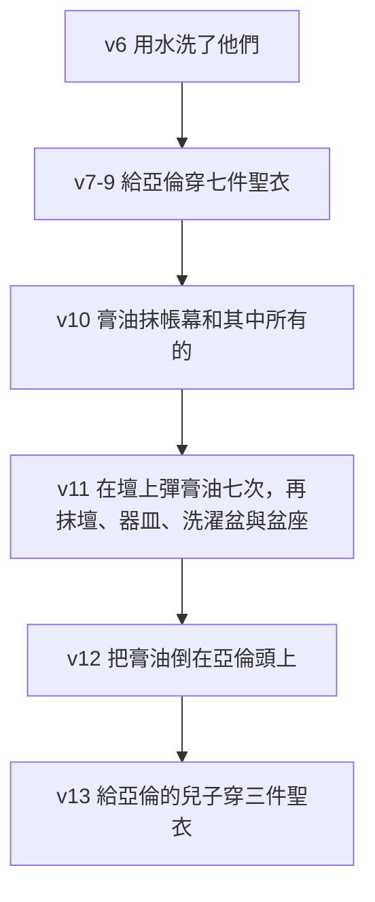
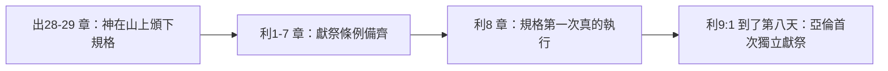

# 利未記 第8章

<!-- chapter-navigation:start -->
| [前一章](../03%20利未記/第7章.md) | [回目錄](../03%20利未記/全書目錄及綱要.md) | [下一章](../03%20利未記/第9章.md) |
| :--- | :---: | ---: |
<!-- chapter-navigation:end -->

1. 耶和華曉諭[[摩西]]說：
2. 你將[[亞倫和他兒子（祭司）|亞倫和他兒子]]一同帶來，並將[[聖衣（祭司聖服）|聖衣]]、[[聖膏油|膏油]]，與[[贖罪祭]]的一隻公牛、兩隻公綿羊、一筐無酵餅都帶來，
3. 又招聚[[全會眾|會眾]]到[[會幕門口]]。
4. [[摩西]]就照耶和華所吩咐的行了；於是[[全會眾|會眾]]聚集在[[會幕門口]]。
5. [[摩西]]告訴[[全會眾|會眾]]說：這就是耶和華所吩咐當行的事。
6. [[摩西]]帶了[[亞倫和他兒子（祭司）|亞倫和他兒子]]來，用[[洗身（水洗）|水洗]]了他們。
7. 給[[亞倫]]穿上[[內袍（雜色內袍）|內袍]]，束上[[腰帶（繡花腰帶）|腰帶]]，穿上[[外袍（以弗得的外袍）|外袍]]，又加上[[以弗得]]，用其上巧工織的帶子把以弗得繫在他身上，
8. 又給他戴上[[胸牌（決斷胸牌）|胸牌]]，把[[烏陵和土明]]放在胸牌內，
9. 把[[冠冕（裹頭巾）|冠冕]]戴在他頭上，在冠冕的前面釘上[[牌子（冠冕牌）|金牌]]，就是聖冠，都是照耶和華所吩咐[[摩西]]的。
10. [[摩西]]用[[聖膏油|膏油]]抹帳幕和其中所有的，使他成聖；
11. 又用[[聖膏油|膏油]]在壇上彈了七次，又抹了壇和壇的一切器皿，並[[洗濯盆（銅盆）|洗濯盆和盆座]]，使他成聖；
12. 又把[[聖膏油|膏油]]倒在[[亞倫]]的頭上膏他，使他成聖。
13. [[摩西]]帶了[[亞倫]]的兒子來，給他們穿上[[內袍（雜色內袍）|內袍]]，束上[[腰帶（繡花腰帶）|腰帶]]，包上[[冠冕（裹頭巾）|裹頭巾]]，都是照耶和華所吩咐摩西的。
14. 他牽了[[贖罪祭]]的公牛來，[[亞倫和他兒子（祭司）|亞倫和他兒子]][[按手]]在贖罪祭公牛的頭上，
15. 就宰了公牛。[[摩西]]用指頭蘸血，抹在壇上四角的周圍，使壇潔淨，把血倒在壇的腳那裡，使壇成聖，壇就潔淨了；
16. 又取臟上所有的[[脂油]]和[[肝上的網子]]，並[[腰子|兩個腰子]]與腰子上的脂油，都燒在壇上；
17. 惟有公牛，連皮帶肉並糞，用火燒在營外，都是照耶和華所吩咐[[摩西]]的。
18. 他奉上[[燔祭]]的公綿羊；[[亞倫和他兒子（祭司）|亞倫和他兒子]][[按手]]在羊的頭上，
19. 就宰了公羊。[[摩西]]把血灑在壇的周圍，
20. 把羊切成塊子，把頭和肉塊並[[脂油]]都燒了。
21. 用[[洗身（水洗）|水洗]]了臟腑和腿，就把全羊燒在壇上為馨香的[[燔祭]]，是獻給耶和華的[[火祭（isheh）|火祭]]，都是照耶和華所吩咐[[摩西]]的。
22. 他又奉上第二隻公綿羊，就是[[承接聖職（分別為聖）|承接聖職]]之禮的羊；[[亞倫和他兒子（祭司）|亞倫和他兒子]][[按手]]在羊的頭上，
23. 就宰了羊。[[摩西]]把些血抹在[[亞倫]]的右耳垂上和右手的大拇指上，並右腳的大拇指上，
24. 又帶了[[亞倫]]的兒子來，把些血抹在他們的右耳垂上和右手的大拇指上，並右腳的大拇指上，又把血灑在壇的周圍。
25. 取[[脂油]]和[[肥尾巴]]，並臟上一切的脂油與[[肝上的網子]]，[[腰子|兩個腰子]]和腰子上的脂油，並右腿，
26. 再從耶和華面前、盛無酵餅的筐子裡取出一個無酵餅，一個油餅，一個薄餅，都放在[[脂油]]和右腿上，
27. 把這一切放在[[亞倫]]的手上和他兒子的手上作[[搖祭]]，在耶和華面前搖一搖。
28. [[摩西]]從他們的手上拿下來，燒在壇上的[[燔祭]]上，都是為[[承接聖職（分別為聖）|承接聖職]]獻給耶和華馨香的[[火祭（isheh）|火祭]]。
29. [[摩西]]拿羊的胸作為[[搖祭]]，在耶和華面前搖一搖，是[[承接聖職（分別為聖）|承接聖職]]之禮，歸摩西的分，都是照耶和華所吩咐摩西的。
30. [[摩西]]取點[[聖膏油|膏油]]和壇上的血，彈在[[亞倫]]和他的衣服上，並他兒子和他兒子的衣服上，使他和他們的衣服一同成聖。
31. [[摩西]]對[[亞倫和他兒子（祭司）|亞倫和他兒子]]說：把肉煮在[[會幕門口]]，在那裡吃，又吃[[承接聖職（分別為聖）|承接聖職]]筐子裡的餅，按我所吩咐的說（或作：按所吩咐我的說）：這是亞倫和他兒子要吃的。
32. 剩下的肉和餅，你們要用火焚燒。
33. 你們七天不可出會幕的門，等到你們[[承接聖職（分別為聖）|承接聖職]]的日子滿了，因為主叫你們七天承接聖職。
34. 像今天所行的都是耶和華吩咐行的，為你們贖罪。
35. 七天你們要晝夜住在[[會幕門口]]，遵守耶和華的吩咐，免得你們死亡，因為所吩咐我的就是這樣。
36. 於是[[亞倫和他兒子（祭司）|亞倫和他兒子]]行了耶和華藉著[[摩西]]所吩咐的一切事。

---

## 本章知識節點

### 神學
- [[承接聖職（分別為聖）]]
- [[膏抹成聖]]
- [[受膏的祭司]]
- [[山上的樣式]]
- [[洗身（水洗）]]
- [[贖罪祭]]
- [[燔祭]]
- [[平安祭]]
- [[馨香之氣]]

### 人物
- [[摩西]]
- [[亞倫]]
- [[亞倫和他兒子（祭司）]]
- [[全會眾]]

### 主題
- [[七日承接聖職不出會幕門]]
- [[聖衣（祭司聖服）]]
- [[內袍（雜色內袍）]]
- [[外袍（以弗得的外袍）]]
- [[腰帶（繡花腰帶）]]
- [[洗濯盆（銅盆）]]
- [[銅壇（燔祭壇）]]
- [[至聖的供物（聖與至聖之分）]]
- [[皮肉頭腿臟腑糞]]
- [[營外焚燒]]
- [[灑血]]
- [[火祭（isheh）]]

### 原文
- [[以弗得]]
- [[胸牌（決斷胸牌）]]
- [[烏陵和土明]]
- [[冠冕（裹頭巾）]]
- [[牌子（冠冕牌）]]
- [[聖膏油]]
- [[按手]]
- [[搖祭]]
- [[脂油]]
- [[肝上的網子]]
- [[腰子]]
- [[肥尾巴]]
- [[無酵餅]]

### 地點
- [[會幕門口]]

### 互文
- [[出29：20|出29：20 血抹右耳垂、右手與右腳的大拇指]]

---

## 本章整理

### 條例講完了，現在照著做（v1-5）

利未記前七章都是條例——該獻什麼、怎麼獻、祭司拿哪一份。從第八章起，經文換成敘事：這些條例第一次被真的執行。[[承接聖職（分別為聖）|承接聖職禮]]的規格早在出埃及記29章就頒下了，但 GT《啟導本》指出一個編排上的理由，說明為什麼要等到這裡才寫——摩西必須先為這些將被膏立的祭司獻祭，讓他們承接聖職；而這些祭司也需要整套獻祭的條例和執行職務的「手冊」，才可以工作。所以前七章先講條例是有必要的。

KC 說得更短：先描述了祭司所獻的各樣祭，接下來才是[[亞倫和他兒子（祭司）|亞倫和他兒子]]被按立為祭司的歷史事件——「我們成了祭司制度設立的見證人」。

第一件事是把人都叫來。[[摩西]]奉命帶三樣東西：亞倫和他兒子、[[聖衣（祭司聖服）|聖衣]]與[[聖膏油|膏油]]、祭牲與一筐[[無酵餅]]（v2）；接著「招聚[[全會眾]]到[[會幕門口]]」（v3）。CT 說明為什麼要當眾舉行：「為要觀禮以見證他們的任職出於神。」GT 丁良才把這一點講得更重——神要會眾知道，這職分不是亞倫自取的、也不是摩西因為亞倫是自己的哥哥就給他的，乃是神召他作祭司；而**哥拉黨後來的反抗話，正顯明這次公開招聚有多要緊**。

==但會幕門口站得下全體以色列人嗎？各家都說站不下。== CT 推測到場的可能只有眾長老和百姓的代表，或者因為禮共有七天，百姓輪流觀禮、或在山坡遠觀。GT 丁良才的說法相同，並指出「因為會幕的院子不大，不能容很多的人」；GT《串珠聖經註釋》乾脆把「會眾」解為「那些代表百姓的長老」。

### 洗、穿、膏：三個動作把人分別出來（v6-13）

```mermaid
flowchart TD
    A["v6 用水洗了他們"] --> B["v7-9 給亞倫穿七件聖衣"]
    B --> C["v10 膏油抹帳幕和其中所有的"]
    C --> D["v11 在壇上彈膏油七次，再抹壇、器皿、洗濯盆與盆座"]
    D --> E["v12 把膏油倒在亞倫頭上"]
    E --> F["v13 給亞倫的兒子穿三件聖衣"]
```

**[[洗身（水洗）|水洗]]是第一步。** 洗到什麼程度，GT 丁良才做過一次相當徹底的統計：有注釋家認為只是在[[洗濯盆（銅盆）|洗濯盆]]裡洗了手腳，但多數注釋家認為是洗全身——因為「洗」這個字若上下文沒有指出洗哪個肢體，就是洗全身的意思，而利未記原文用這個字的地方共二十五處，其中十一處譯作「洗澡」、十處譯作「洗身」。他因此判斷這裡也是洗全身。CT 從另一個角度數了三重潔淨：「祭司要經過三重的潔淨：水的潔淨（6節），血的潔淨（24節），膏油的潔淨（12節）。」KC 則提醒這裡的水洗不是為了洗掉什麼髒東西——想作祭司的人用話語的水，不只是為了得潔淨，更是為了**保持**潔淨。

**接著是穿衣，而穿的順序本身有意思。** 亞倫穿七件：[[內袍（雜色內袍）|內袍]]、[[腰帶（繡花腰帶）|腰帶]]、[[外袍（以弗得的外袍）|外袍]]、[[以弗得]]、[[胸牌（決斷胸牌）|胸牌]]（內置[[烏陵和土明]]）、[[冠冕（裹頭巾）|冠冕]]與[[牌子（冠冕牌）|金牌]]；他的兒子只穿三件：內袍、腰帶、裹頭巾（v13）。KC 注意到一個對照：出埃及記28章描述聖衣是從外往內講的，這裡則是照實際穿戴的次序、從內往外。

| 誰 | 穿哪幾件 | 差別 |
|---|---|---|
| 亞倫（大祭司） | 內袍、腰帶、外袍、以弗得、胸牌、冠冕、金牌 | 七件；冠冕前有金牌 |
| 亞倫的兒子（眾祭司） | 內袍、腰帶、裹頭巾 | 三件；裹頭巾前沒有金牌 |

==那塊「金牌」在原文其實叫「花」。== CT 的〔原文字義〕註「牌」為「花卉」，並說「按原文字義，應當是指花朵狀冠冕上的飾物」；GT《舊約聖經背景註釋》說「由於譯作『牌』字的原文字眼又可解作『花』，這徽記可能也是花狀的」。STEP 給的詞典義正是 צִיץ（H6731A）＝「flower」。同一節的「聖冠」則是 נֵזֶר（H5145H）。

[[烏陵和土明]]是什麼，各家都承認不知道。CT 說「可能是兩塊小玉石」，並指出它們在被擄時便已失蹤，「解經家們雖有各種推測，但不足採信」；GT《啟導本》同樣說「一切的解釋都不外乎推測，難作定論」。名字的意思倒是清楚——GT《串珠聖經註釋》：「希伯來文字義是『光明與完全』。」

**然後是[[膏抹成聖|膏抹]]，而膏的動作分成三種。** v10 抹帳幕和其中所有的；v11 在[[銅壇（燔祭壇）|燔祭壇]]上彈了七次，再抹壇、器皿、[[洗濯盆（銅盆）|洗濯盆和盆座]]；v12 則把膏油「倒」在亞倫的頭上。丁良才特別點出：所有器具裡只有燔祭壇不只被抹、還被彈了七次；他並要讀者比較 v12 的「倒」與 v30 的「彈」——「亞倫所受的聖油比他兒子所受的更多」，因為他的職分尊貴。==原文確實是兩個不同的動詞：v12 是 יָצַק（H3332G，傾倒），v30 是 נָזָה（H5137A，噴灑）。==

KC 從順序讀出一層對照：亞倫在血還沒有抹到他身上以前就先受了膏，他兒子卻是先受血、後受膏——因為亞倫在這裡是主耶穌的圖像，聖靈可以直接臨到那位無罪的完全人；我們則是天生的罪人，聖靈只能在罪被基督的血洗淨之後才臨到。

### 三隻祭牲，一場就職禮（v14-30）

承接聖職要獻三種祭，順序不能顛倒。GT 丁良才把三者的意義排開：先有[[贖罪祭]]（表示稱義）、次有[[燔祭]]（表示成聖）、後有承接聖職的祭（表示與主相交）。

| 祭牲 | 祭別 | 血怎麼處理 | 肉怎麼處理 |
|---|---|---|---|
| 公牛（v14-17） | 贖罪祭 | 抹在壇的四角、其餘倒在壇腳 | 脂油、腰子、肝網焚壇；皮、肉、糞燒在營外 |
| 第一隻公綿羊（v18-21） | 燔祭 | 灑在壇的周圍 | 全羊切塊焚燒，為馨香的火祭 |
| 第二隻公綿羊（v22-29） | 承接聖職之祭 | 抹在右耳垂、右手大拇指、右腳大拇指；其餘灑在壇周圍 | 脂油等作搖祭後焚壇；胸歸摩西 |

==血在本章一共用了四個不同的原文動詞，中文只看得出「抹／倒／灑／彈」的分別。== v15 抹在壇角是 נָתַן（H5414H，放上去），倒在壇腳是 יָצַק（H3332G）；v19、v24 灑在壇周圍是 זָרַק（H2236，撒開）；v11、v30 的「彈」則是 נָזָה（H5137A）。四個動作、四個字，各有各的對象。

第一隻公牛的贖罪祭有一個特別處：它不是為某一件已犯的罪獻的。丁良才指出摩西沒有照為大祭司和會眾獻贖罪祭時的作法行，「因為這祭不是為亞倫有什麼一定的罪獻的」。原文在 v15 用了一個值得看的動詞——「使壇潔淨」是 וַיְחַטֵּא，出自 חָטָא（H2398，詞典義「to sin」，犯罪），這裡是 Piel，STEP 逐字解作「他除去了罪」。同一個詞根、同一種語態，在利6:26 也用來稱呼「為贖罪獻這祭的祭司」。

祭牲的[[皮肉頭腿臟腑糞|皮、肉、糞]]要[[營外焚燒|燒在營外]]（v17）。丁良才給了兩個理由：一是按定例祭司不能吃自己的贖罪祭肉；二是摩西是亞倫的哥哥、又是家長，所以他也不能吃——神沒有把這肉給他，不像承接聖職之祭的胸給了他。

**抹血在三個部位，是本章最鮮明的畫面。** v23-24 把血抹在[[出29：20|右耳垂、右手大拇指、右腳大拇指]]上，亞倫與他兒子都是。四家的解讀一致：耳朵今後專為聽神的話，手為作神的工，腳為行神的路。GT《啟導本》說得直白：「凡手所作的事，腳所走的路完全遵照神旨不偏離；不沾世務，專心侍奉神。」GT《舊約聖經背景註釋》另補上一個古代近東的觀察：儀式中的抹血和塗血通常集中在邊緣和入口上，而血在這裡有潔淨與保護的雙重功用。KC 特別注意順序——血先抹耳朵，「一切真實的祭司事奉都是從這裡開始的：先聽，才知道主要我們作什麼」。

### 「承接聖職」的原文，是「把手裝滿」（v27-36）

v27 把[[脂油]]、[[肥尾巴]]、[[肝上的網子]]、[[腰子]]、右腿和三樣[[無酵餅]]全放在亞倫和他兒子的手上，作[[搖祭]]搖一搖。這個動作正好對上這個詞的字面意思。

「承接聖職」在原文是 מִלֻּאִים（H4394），v33 同一節還配上一個動詞片語——「他要充滿你們的手」（מָלֵא，H4390）。CT 的〔原文字義〕早就把它拆成「設立、裝置」加上「手」兩個字，並引了一句話：「在希伯來文裏，奉獻應當繙作 to fill the hand，意即充滿這手，或作把手充滿了。本來手是空的，現在把它裝滿了。」GT《串珠聖經註釋》說「希伯來文原意是『充填物』」，GT《利未記雷氏研讀本》說「其希伯來名字的直譯作：『充滿』」——三處說的是同一件事。

GT《舊約聖經背景註釋》把這個片語放進近東文獻裡：「充滿其手」在亞喀得文獻中可以形容祭司，也可以形容君王；亞述王阿達德尼拉里二世即位時，就用這話描述人把象徵王權的權杖放在他手中。

搖完之後，摩西把這一切從他們手上拿下來燒在壇上（v28），只留下羊的胸作[[搖祭]]歸自己（v29）。丁良才解釋這個例外：平常平安祭的胸歸眾祭司，這一次歸摩西，「因為他充任臨時祭司的職分」。摩西為什麼能當祭司？丁良才說神既認他為立約的中保、使他分派祭司，也就使他擔任祭司的職分；KC 講的是同一件事——祭司還沒被按立、還不能獻，摩西可以，因為他不需要按立。

最後一段是[[七日承接聖職不出會幕門|七天的禁足]]：不可出會幕的門，要晝夜住在會幕門口，遵守耶和華的吩咐，「免得你們死亡」（v33-35）。這七天裡究竟做了什麼，GT 丁良才並列兩種解法——一說摩西每天都重行一次完整的承接聖職禮，另一說只有第一天行禮、其餘六天只獻常獻的祭並潔淨祭壇；他自己傾向前者，理由之一是這樣百姓才有機會輪流觀看。GT《舊約聖經背景註釋》給了不能離開的實際理由：「大祭司不可因為任何理由離開此地，因為這樣做會使他感染不潔……一旦離開，這些不潔就會對他構成性命危險」，並舉蘇美文獻中恩圖女祭司同樣不可踏出廟宇一步為旁證。

### 全章只在講一件事：一絲不苟

```mermaid
flowchart LR
    A["出28-29 章：神在山上頒下規格"] --> B["利1-7 章：獻祭條例備齊"]
    B --> C["利8 章：規格第一次真的執行"]
    C --> D["利9:1 到了第八天：亞倫首次獨立獻祭"]
```

[[山上的樣式|「都是照耶和華所吩咐摩西的」]]這句話在本章反覆出現。原文可以數得很精確：完全相同的片語（כַּאֲשֶׁר צִוָּה יְהוָה 之後接受詞「摩西」）出現五次，就是 v9、v13、v17、v21、v29；另有幾處中文同樣譯作「吩咐」，原文結構卻不一樣——v4 的受詞是「他」而不是「摩西」，v34 是「像今天所行的……耶和華吩咐行的」，v36 則是「耶和華藉摩西的手所吩咐的」。同形的五次加上幾處變體，撐起了全章的節奏。

GT 丁良才在本章開頭列出神為以色列人所定禮拜條例的四個要點，正好可以當作這一章的總綱：須在一定的地方（會幕）、按一定的時期（每日、每安息日、諸節期）、用一定的禮節（獻各祭的條例）、藉一定的中保（大祭司和眾祭司）。本章補上的正是最後一項——中保本身是怎麼被立起來的。

==而立起來的方式，本身就是這一章要教的功課：沒有一個步驟是人想出來的。== 洗、穿、膏、獻、吃、住滿七天，每一項都寫著「照耶和華所吩咐的」。v36 是全章的收尾，也是一句成績單：「於是亞倫和他兒子行了耶和華藉著摩西所吩咐的一切事。」KC 給這句話的評語值得記下——這樣的順服令人印象深刻、也堪為榜樣；只可惜緊接著的下一章（利10:1）就看見人怎麼偏離了它。

**參考資料**
https://www.ccbiblestudy.org/Old%20Testament/03Lev/03CT08.htm
https://www.ccbiblestudy.org/Old%20Testament/03Lev/03GT08.htm
https://www.kingcomments.com/en/bible-studies/Lev/8
https://biblehub.com/study/leviticus/8.htm
https://github.com/STEPBible/STEPBible-Data

<!-- chapter-navigation:start -->
| [前一章](../03%20利未記/第7章.md) | [回目錄](../03%20利未記/全書目錄及綱要.md) | [下一章](../03%20利未記/第9章.md) |
| :--- | :---: | ---: |
<!-- chapter-navigation:end -->
