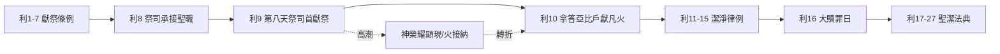

# 利未記 第9章

1. 到了第八天，[[摩西]]召了[[亞倫和他兒子（祭司）|亞倫和他兒子]]，並[[以色列的眾長老]]來，
2. 對[[亞倫]]說：你當取牛群中的一隻[[公牛犢（par ben baqar）|公牛犢]]作[[贖罪祭]]，一隻公綿羊作[[燔祭（olah）|燔祭]]，都要沒有殘疾的，獻在耶和華面前。
3. 你也要對以色列人說：你們當取一隻[[山羊|公山羊]]作[[贖罪祭]]，又取一隻[[公牛犢（par ben baqar）|牛犢]]和一隻綿羊羔，都要一歲、沒有殘疾的，作[[燔祭（olah）|燔祭]]，
4. 又取一隻[[公牛犢（par ben baqar）|公牛]]，一隻公綿羊作[[平安祭（shelamim）|平安祭]]，獻在耶和華面前，並取調油的[[素祭（minchah）|素祭]]，因為今天耶和華要向你們顯現。
5. 於是他們把[[摩西]]所吩咐的，帶到[[會幕門口|會幕前]]；[[全會眾（kol ha-edah）|全會眾]]都近前來，站在耶和華面前。
6. [[摩西]]說：這是耶和華吩咐你們所當行的；[[耶和華的榮光]]就要向你們顯現。
7. [[摩西]]對[[亞倫]]說：你就近壇前，獻你的[[贖罪祭]]和[[燔祭（olah）|燔祭]]，為自己與百姓贖罪，又獻上百姓的供物，為他們贖罪，都照耶和華所吩咐的。
8. 於是，[[亞倫]]就近壇前，宰了為自己作[[贖罪祭]]的[[公牛犢（par ben baqar）|牛犢]]。
9. [[亞倫]]的兒子把血奉給他，他就把指頭蘸在血中，抹在壇的四角上，又把血倒在壇腳那裡。
10. 惟有[[贖罪祭]]的[[脂油（chelev）|脂油]]和[[腰子（kilyah）|腰子]]，並肝上取的網子，都燒在壇上，是照耶和華所吩咐[[摩西]]的；
11. 又用火將肉和皮燒在營外。
12. [[亞倫]]宰了[[燔祭（olah）|燔祭]]牲，他兒子把血遞給他，他就灑在壇的周圍，
13. 又把[[燔祭（olah）|燔祭]]一塊一塊地、連頭遞給他，他都燒在壇上；
14. 又洗了臟腑和腿，燒在壇上的[[燔祭（olah）|燔祭]]上。
15. 他奉上百姓的供物，把那給百姓作[[贖罪祭]]的[[山羊|公山羊]]宰了，為罪獻上，和先獻的一樣；
16. 也奉上[[燔祭（olah）|燔祭]]，照例而獻。
17. 他又奉上[[素祭（minchah）|素祭]]，從其中取一滿把，燒在壇上；這是在早晨的[[燔祭（olah）|燔祭]]以外。
18. [[亞倫]]宰了那給百姓作[[平安祭（shelamim）|平安祭]]的[[公牛犢（par ben baqar）|公牛]]和公綿羊。他兒子把血遞給他，他就灑在壇的周圍；
19. 又把[[公牛犢（par ben baqar）|公牛]]和公綿羊的[[脂油（chelev）|脂油]]、[[肥尾巴（alyah）|肥尾巴]]，並蓋臟的脂油與[[腰子（kilyah）|腰子]]，和[[肝上的網子（yoteret ha-kaved）|肝上的網子]]，都遞給他；
20. 把[[脂油（chelev）|脂油]]放在胸上，他就把脂油燒在壇上。
21. 胸和右腿，[[亞倫]]當作[[搖祭（tenufah）|搖祭]]，在耶和華面前搖一搖，都是照[[摩西]]所吩咐的。
22. [[亞倫]]向百姓舉手，為他們祝福。他獻了[[贖罪祭]]、[[燔祭（olah）|燔祭]]、[[平安祭（shelamim）|平安祭]]就下來了。
23. [[摩西]]、[[亞倫]]進入會幕，又出來為百姓祝福，[[耶和華的榮光]]就向眾民顯現。
24. 有火從耶和華面前出來，在壇上燒盡[[燔祭（olah）|燔祭]]和[[脂油（chelev）|脂油]]；眾民一見，就都歡呼，俯伏在地。

---

## 本章知識節點

### 人物
- [[亞倫]]
- [[亞倫和他兒子（祭司）]]
- [[摩西]]
- [[以色列的眾長老]]
- [[全會眾（kol ha-edah）]]

### 神學
- [[承接聖職（分別為聖）]]
- [[山上的樣式]]
- [[耶和華的榮光]]
- [[神在火中降臨]]
- [[贖罪祭]]
- [[舉手祝福（祭司祝福百姓）]]

### 原文
- [[下拜（shachah）]]
- [[燔祭（olah）]]
- [[平安祭（shelamim）]]
- [[素祭（minchah）]]
- [[脂油（chelev）]]
- [[腰子（kilyah）]]
- [[肝上的網子（yoteret ha-kaved）]]
- [[肥尾巴（alyah）]]
- [[搖祭（tenufah）]]

### 主題
- [[無殘疾（tamim）]]
- [[公牛犢（par ben baqar）]]
- [[灑血（zaraq）]]
- [[銅壇（燔祭壇）]]
- [[皮肉頭腿臟腑糞（or basar rosh regel qereb pereq）]]
- [[營外焚燒（machutz la-machaneh saraf）]]

### 文化
- [[山羊]]

### 地點
- [[會幕門口]]

---

## 本章整理

### 第八日祭司就職獻祭的準備與召集（v1-7）

利未記第九章是全書的**儀式高潮**，記載[[亞倫]]與其子孫完成七天[[承接聖職（分別為聖）|承接聖職]]禮（利8:33-36）後，**第八天**正式執行祭司職分。經文開篇「到了第八天，摩西召了亞倫和他兒子，並以色列的眾長老來」（v1），「第八天」不只是時間順序，更具**神學象徵**：七日潔淨分別歸神後，第八天代表**新秩序的開始、復活生命的事奉、新創造的啟動**（參利12:3；22:27；結43:26-27；約20:1）。[[摩西]]召集[[亞倫和他兒子（祭司）|亞倫和他兒子]]與[[以色列的眾長老]]（會眾代表），形成**公共見證**的法定會眾。

摩西按耶和華吩咐指定四類祭，次序固定且具神學邏輯（v2-4）：
- **亞倫自獻**：[[公牛犢（par ben baqar）|公牛犢]]贖罪祭、公綿羊燔祭——「為自己與百姓贖罪」（v7）
- **百姓獻祭**：[[山羊|公山羊]]贖罪祭、牛犢與綿羊羔燔祭、公牛與公綿羊[[平安祭（shelamim）|平安祭]]、調油[[素祭（minchah）|素祭]]  
> **關鍵神學**：贖罪祭→燔祭→素祭→平安祭，呈現「除罪→獻上→事奉→交通」的屬靈次序（參來5:1-3；7:27）。

「全會眾都近前來，站在耶和華面前」（v5）——敬拜姿態與見證角色。摩西宣告：「這是耶和華吩咐你們所當行的；耶和華的榮光就要向你們顯現」（v6），強調**順服神命令是榮耀顯現的前提**（參撒上15:22；賽1:11-17）。摩西吩咐亞倫：「你就近壇前，獻你的贖罪祭和燔祭，為自己與百姓贖罪……都照耶和華所吩咐的」（v7）。祭司**中保職分**正式啟動：先為己後為民，完全照神吩咐行事。

### 亞倫為自己獻贖罪祭與燔祭（v8-14）

亞倫先為自己獻[[贖罪祭]]：宰公牛犢，兒子奉血，亞倫**指頭蘸血抹壇四角，倒血壇腳**——潔淨壇本身（v9；參出29:12；利4:7,18,25,30,34）。**脂油（chelev）、腰子（kilyah）、肝上網子（yoteret ha-kaved）燒壇上**（v10）；**肉皮燒營外**（v11）——祭司為自己獻的贖罪祭**不可吃**，須全然焚燒（參利6:23；4:11-12），顯示祭司自身有罪，需完全歸神。

接著獻[[燔祭（olah）|燔祭]]：宰公綿羊，**灑血（zaraq）壇周圍**（v12）；**一塊塊連頭燒壇上**（v13）；**洗臟腑腿燒壇上**（v14）。全獻火中，馨香之氣上升，CT靈意註解指出「把燔祭…燒在壇上：表徵為神而活」。**屬靈功課**：GT《丁良才利未記註釋》指出v7「為自己與百姓贖罪」的獻祭次序是「先為自己，後為別人」（來5:3；7:27；9:7；參提前4:16）——事奉者必先在神面前解決自己的罪（贖罪祭），再將自己完全獻上（燔祭），才能有效服事百姓。

### 亞倫為百姓獻四祭（v15-21）

亞倫轉為[[全會眾（kol ha-edah）|百姓]]獻祭：
1. **百姓贖罪祭：公山羊**（v15）——“和先獻的一樣”，程序同亞倫自獻，但**肉歸祭司食用**（利6:26；10:16-18）。
2. **百姓燔祭：牛犢與綿羊羔**（v16）——“照例而獻”，依利未記一章條例，顯示**全會眾同蒙悅納、同獻上自己**。
3. **百姓素祭：調油細麵**（v17）——“從其中取一滿把燒在壇上；這是在早晨的燔祭以外。”素祭表徵**人生勞苦成果歸神**，並預表基督**被聖靈充滿的完美人性**（約6:35；約一2:20,27）。
4. **百姓平安祭：公牛與公綿羊**（v18-21）——灑血壇周圍（v18）；**脂油、肥尾巴（alyah）、蓋臟脂油、腰子、肝上網子燒壇上**（v19-20）——神得最美分。**胸與右腿作搖祭（tenufah），在耶和華面前搖一搖**（v21）——歸祭司食用（利7:30-34），象徵**基督的愛（胸）與能力（右腿）成為祭司（信徒）的分**。平安祭實現「神人和好、共享筵席」的團契圖景（弗2:14-16；林前10:16-17）。

### 祭司祝福與神雙重回應：榮光顯現、火燒祭物（v22-24）

獻完三祭後，亞倫「向百姓舉手，為他們祝福」（v22）。這是**祭司祝福職分**的首次行使（參民6:22-27），預表基督升天前舉手祝福門徒（路24:50-51）。隨後[[摩西]]、亞倫同進會幕，再出來**同聲祝福**——雙重中保合一，預表基督兼具三重職分（v23a）。

「耶和華的榮光就向眾民顯現」（v23b）——**神同在的可見彰顯**（出16:10；40:34-35；王上8:10-11），確認祭司制度、會幕敬拜蒙神立約同在印證。緊接著「有火從耶和華面前出來，在壇上燒盡燔祭和脂油」（v24a）——非壇上常火（利6:12-13），乃**超自然神火**（參士6:21；13:19-20；王上18:38；代下7:1）。只燒「燔祭和脂油」——**全歸神的部分**，證明神**悅納獻祭、赦免罪孽、接納敬拜**。

「眾民一見，就都歡呼，俯伏在地」（v24b）——**敬畏與喜樂**的雙重回應（下拜 shachah），成就敬拜最高目標：神得榮耀、人蒙福、雙向交通（來12:28-29）。

---

### 關鍵神學主題與新約成全對照

| 主題 | 利未記9章呈現 | 新約成全/對應 |
|------|----------------|----------------|
| **大祭司就職** | 亞倫第八天首獻祭 | 基督復活升天，進天上聖所（來8:1-2） |
| **贖罪祭次序** | 先祭司後百姓，牛犢/山羊 | 基督無罪，一次獻上自己（來7:27；9:7；林後5:21） |
| **燔祭全獻** | 亞倫與百姓燔祭全燒 | CT靈意註解：表徵為神而活 |
| **平安祭交通** | 神得脂油、祭司得胸腿、百姓得肉 | GT：胸表基督的愛、右腿表基督的能力，祭司（信徒）在其中得分 |
| **祭司祝福** | 亞倫舉手祝福 | 基督升天舉手祝福門徒（路24:50-51） |
| **榮光顯現** | 會幕榮光充滿 | 道成肉身榮光顯現（約1:14；來1:3） |
| **神火接納** | 火燒盡祭物 | 五旬節火舌降在各人頭上（徒2章）；末世火試驗各人工作（林前3:13） |

---

### 牧應與屬靈功課

1. **事奉次序不可倒置**：先在神面前解決自己的罪（贖罪祭），再將自己完全獻上（燔祭），才能有效服事人（平安祭祝福）。  
2. **遵行神命令是蒙悅納關鍵**：「都照耶和華所吩咐的」重複出現（v7,10,21），強調**順服勝於獻祭**（撒上15:22）。  
3. **屬靈領袖須為群羊代禱祝福**：亞倫舉手祝福、摩西亞倫同聲祝福，顯示**代禱權柄源於與神面對面交通**（v23）。  
4. **神榮耀顯現引發真敬拜**：百姓「歡呼俯伏」——敬拜非情緒發洩，乃回應神聖潔榮耀與恩典火（來12:28-29）。  
5. **第八天屬靈經驗**：每個「第八天」都是新開始——在基督裡，我們天天經歷復活大能，重新獻上自己，等候榮耀顯現。

---

### 釋經難點備註

| 難點 | 主要解釋取向 |
|------|--------------|
| 亞倫贖罪祭用公牛犢而非公牛（利4:3） | 就職特殊禮儀，預表基督無罪卻為罪人成罪（林後5:21）；或因亞倫曾造金牛犢（出32），特用牛犢提醒 |
| 贖罪祭血不進聖所只抹壇角 | 此非為特定罪愆，乃就職禮儀潔淨壇與祭司（利8:15；16:18-19） |
| 祭司自獻贖罪祭肉皮燒營外不可吃 | 祭司有罪不可自食贖罪祭，須全歸神（利6:23；4:11-12） |
| 平安祭胸右腿皆作搖祭未分舉祭 | 經文簡略記載「搖祭」代表獻祭動作；舉祭隱含其中（利7:30-34） |
| 火從何處出來 | 從會幕/至聖所榮光中發出（利9:23-24；民17:9），非天上直降 |

---

### 本章在利未記結構中的位置

利未記第九章是**祭司制度建立的頂點**，也是**聖潔律法展開的基點**：神已悅納祭司與祭物，確立會幕為祂同在之所，接著進入「潔淨與聖潔」的生活規範（利11-15），並指向年度大贖罪日（利16）的終極贖罪。

---

### 研讀建議大綱（講道/查經適用）

**主題：第八天的榮耀——祭司職分啟用與神的回應**  
**經文：利未記9:1-24**

1. **序言**：七日預備，第八天新開始——復活生命的事奉起點  
2. **準備階段（1-7節）**：神吩咐的祭物、會眾的站立、摩西的宣告——順服是榮耀的條件  
3. **祭司為己獻祭（8-14節）**：贖罪祭潔淨壇與己，燔祭全獻於神——事奉者先被潔淨、後被獻上  
4. **祭司為民獻祭（15-21節）**：四祭次序彰顯救恩全貌——除罪、獻身、事奉、交通  
5. **雙重祝福與雙重回應（22-24節）**：亞倫祝福、摩西亞倫同祝福 → 榮光顯現、火燒祭物 → 百姓歡呼俯伏  
6. **應用**：今日信徒作「有君尊的祭司」（彼前2:9），同樣經歷「第八天」——在基督裡親近神、蒙悅納、得榮耀、出去祝福  

---

> **關鍵經文**：利未記9:6, 23-24  
> 「摩西說：這是耶和華吩咐你們所當行的；耶和華的榮光就要向你們顯現。……摩西、亞倫進入會幕，又出來為百姓祝福，耶和華的榮光就向眾民顯現。有火從耶和華面前出來，在壇上燒盡燔祭和脂油；眾民一見，就都歡呼，俯伏在地。」

**參考資料**
https://www.ccbiblestudy.org/Old%20Testament/03Lev/03CT09.htm
https://www.ccbiblestudy.org/Old%20Testament/03Lev/03GT09.htm
https://www.kingcomments.com/en/bible-studies/Lev/9
https://biblehub.com/study/leviticus/9.htm
