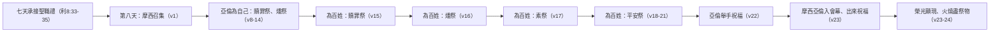
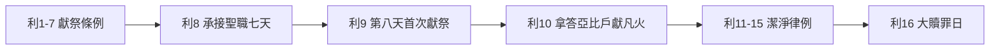

# 利未記 第9章

<!-- chapter-navigation:start -->
| [前一章](../03%20利未記/第8章.md) | [回目錄](../03%20利未記/全書目錄及綱要.md) | [下一章](../03%20利未記/第10章.md) |
| :--- | :---: | ---: |
<!-- chapter-navigation:end -->

1. 到了第八天，[[摩西]]召了[[亞倫和他兒子（祭司）|亞倫和他兒子]]，並[[以色列的眾長老]]來，
2. 對[[亞倫]]說：你當取牛群中的一隻[[公牛犢]]作[[贖罪祭]]，一隻公綿羊作[[燔祭]]，都要沒有殘疾的，獻在耶和華面前。
3. 你也要對以色列人說：你們當取一隻[[山羊|公山羊]]作[[贖罪祭]]，又取一隻[[公牛犢|牛犢]]和一隻綿羊羔，都要一歲、沒有殘疾的，作[[燔祭]]，
4. 又取一隻[[公牛犢|公牛]]，一隻公綿羊作[[平安祭]]，獻在耶和華面前，並取調油的[[素祭（minchah）|素祭]]，因為今天耶和華要向你們顯現。
5. 於是他們把[[摩西]]所吩咐的，帶到[[會幕門口|會幕前]]；[[全會眾]]都近前來，站在耶和華面前。
6. [[摩西]]說：這是耶和華吩咐你們所當行的；[[耶和華的榮光]]就要向你們顯現。
7. [[摩西]]對[[亞倫]]說：你就近壇前，獻你的[[贖罪祭]]和[[燔祭]]，為自己與百姓贖罪，又獻上百姓的供物，為他們贖罪，都照耶和華所吩咐的。
8. 於是，[[亞倫]]就近壇前，宰了為自己作[[贖罪祭]]的[[公牛犢|牛犢]]。
9. [[亞倫]]的兒子把血奉給他，他就把指頭蘸在血中，抹在壇的四角上，又把血倒在壇腳那裡。
10. 惟有[[贖罪祭]]的[[脂油]]和[[腰子]]，並肝上取的網子，都燒在壇上，是照耶和華所吩咐[[摩西]]的；
11. 又用火將肉和皮燒在營外。
12. [[亞倫]]宰了[[燔祭]]牲，他兒子把血遞給他，他就灑在壇的周圍，
13. 又把[[燔祭]]一塊一塊地、連頭遞給他，他都燒在壇上；
14. 又洗了臟腑和腿，燒在壇上的[[燔祭]]上。
15. 他奉上百姓的供物，把那給百姓作[[贖罪祭]]的[[山羊|公山羊]]宰了，為罪獻上，和先獻的一樣；
16. 也奉上[[燔祭]]，照例而獻。
17. 他又奉上[[素祭（minchah）|素祭]]，從其中取一滿把，燒在壇上；這是在早晨的[[燔祭]]以外。
18. [[亞倫]]宰了那給百姓作[[平安祭]]的[[公牛犢|公牛]]和公綿羊。他兒子把血遞給他，他就灑在壇的周圍；
19. 又把[[公牛犢|公牛]]和公綿羊的[[脂油]]、[[肥尾巴]]，並蓋臟的脂油與[[腰子]]，和[[肝上的網子]]，都遞給他；
20. 把[[脂油]]放在胸上，他就把脂油燒在壇上。
21. 胸和右腿，[[亞倫]]當作[[搖祭]]，在耶和華面前搖一搖，都是照[[摩西]]所吩咐的。
22. [[亞倫]]向百姓舉手，為他們祝福。他獻了[[贖罪祭]]、[[燔祭]]、[[平安祭]]就下來了。
23. [[摩西]]、[[亞倫]]進入會幕，又出來為百姓祝福，[[耶和華的榮光]]就向眾民顯現。
24. 有火從耶和華面前出來，在壇上燒盡[[燔祭]]和[[脂油]]；眾民一見，就都歡呼，俯伏在地。

---

## 本章知識節點

### 人物
- [[亞倫]]
- [[亞倫和他兒子（祭司）]]
- [[摩西]]
- [[以色列的眾長老]]
- [[全會眾]]

### 神學
- [[承接聖職（分別為聖）]]
- [[山上的樣式]]
- [[耶和華的榮光]]
- [[神在火中降臨]]
- [[贖罪祭]]
- [[燔祭]]
- [[平安祭]]
- [[舉手祝福（祭司祝福百姓）]]

### 原文
- [[下拜]]
- [[素祭（minchah）]]
- [[脂油]]
- [[腰子]]
- [[肝上的網子]]
- [[肥尾巴]]
- [[搖祭]]

### 主題
- [[無殘疾（tamim）]]
- [[公牛犢]]
- [[灑血]]
- [[銅壇（燔祭壇）]]
- [[皮肉頭腿臟腑糞]]
- [[營外焚燒]]
- [[壇火常燒不熄滅]]

### 文化
- [[山羊]]

### 地點
- [[會幕門口]]

### 歷史
- [[雲柱火柱]]

### 背景
- [[古代近東廟宇奉獻典禮]]

---

## 本章整理

### 第八天：制度開始運作的那一天（v1-7）

利未記第八章記完七天的[[承接聖職（分別為聖）|承接聖職]]之禮，第九章開頭就是「到了第八天」。這一天之所以重要，是因為前面七天都還在辦手續，從這天起[[亞倫]]才真的開始做祭司該做的事。

「第八天」在舊約不是隨口說的日子。GT 引丁良才把它的意思講得很清楚：「第八天既是－個禮拜之末日的次日，又是七日的第一日，所以在聖書中『第八天』三個字含有離舊換新和重新起首的意思。」他接著列了一整串同樣落在第八天的規定：產婦潔淨、牛犢羊羔生下第八天以後才可獻為火祭、長大痲瘋的人、患漏症的人、因沾染污穢廢了願的拿細耳人，都要等到行潔淨禮的第八天才得潔淨。KC 從信徒的角度把這一天讀成會重複發生的經驗：「第八天說到一個新的開始。有一件從來沒有過的事開始了。」而且「我們的承接聖職持續我們的一生，但一次又一次地有一個第八天」。BH 則把數字八接到復活上——耶穌復活在七日的第一日，也就是安息日的次日。

把眼光放到以色列以外，這場典禮的形式其實不罕見。GT《舊約聖經背景註釋》指出，「七天的啟用奉獻典禮完成後，制度在第八日開始實施。主的顯現是典禮的高潮」，並比對所羅門聖殿啟用時（王上八62～64）也有類似的典禮，用的是「啟用」（hanok）一詞。真正不一樣的地方要到本章末尾才看得出來（見下文[[古代近東廟宇奉獻典禮|古代近東的廟宇奉獻典禮]]）。

[[摩西]]召的不只是祭司，還有[[以色列的眾長老]]，因為這件事需要見證人。至於v5 說「[[全會眾]]都近前來」，兩家都提醒不要照字面想成兩百多萬人擠在院子裡：丁良才說這幾個字「就是指著全會眾的代表（1注），和一切在會幕院子裡的人說的」；GT《聖經精讀本》講得更具體：「實際上不是所有的以色列百姓聚集在會幕前，是代表全會眾的長老及各支派的官長聚集在會幕前。」

==這一天要獻的祭有固定次序，而次序本身就是道理。== 不過各家分的段數不同。GT《串珠聖經註釋》歸納成三個觀念：「首先是罪的救贖，然後是生命的奉獻和成聖，最後才是在感恩餐中與神交通。」GT《聖經精讀本》則分成四項，一祭一義：「在神面前贖罪（[[贖罪祭]]）、奉獻（[[燔祭]]）、事奉（[[素祭（minchah）|素祭]]）、與神和睦（[[平安祭]]）。」串珠並補充這裡為什麼沒有贖愆祭——因為贖愆祭是為特別的過犯而獻的，本章所獻「乃是為國家一般性的罪而獻的」。

```mermaid
flowchart LR
    A["七天承接聖職禮（利8:33-35）"] --> B["第八天：摩西召集（v1）"]
    B --> C["亞倫為自己：贖罪祭、燔祭（v8-14）"]
    C --> D["為百姓：贖罪祭（v15）"]
    D --> E["為百姓：燔祭（v16）"]
    E --> F["為百姓：素祭（v17）"]
    F --> G["為百姓：平安祭（v18-21）"]
    G --> H["亞倫舉手祝福（v22）"]
    H --> I["摩西亞倫入會幕、出來祝福（v23）"]
    I --> J["榮光顯現、火燒盡祭物（v23-24）"]
```

### 先為自己，再為別人（v8-14）

亞倫做的第一件事不是為百姓獻祭，是為自己獻[[贖罪祭]]。CT 說明原因：「『一隻公牛犢作贖罪祭』為贖大祭司本人的罪(參8節)，因他一人的罪，連累眾百姓也陷在罪惡裡(參四3)。」丁良才則把這件事讀成舊約祭司制度的自白——舊約的祭司不完全，須靠贖罪祭牲的血才敢親近神；並在v7 註明次序：「注意本節獻祭的次序，先為自己，後為別人。」KC 說的是同一件事：「在亞倫為別人獻祭之前，他先為自己獻祭。」他還提到亞倫的兒子在本章只做一件事——每一次都把血遞給他——「血是一切真實祭司事奉的根基」。

> [!note] 這裡的「公牛犢」和利未記第四章的不是同一個字
> 丁良才做過一次原文比對：利4:3 的「公牛犢」與出29:1、利4:14 等處同字，指兩歲的；利9:2、3、8 的「公牛犢」原文不同，指一歲的；而利9:4、18-19 的「公牛」又是另一個字。STEP語言資料可以確認本章這兩個字確實不同：v2、v3、v8 用 עֵגֶל（H5695，逐字解「a male calf」），v4、v18、v19 用 שׁוֹר（H7794，詞典義「cattle」）——同樣譯成中文的「牛犢」與「公牛」，原文是兩個字。

也正因為原文相同，丁良才記下一個猶太傳說：「這贖罪祭是暗示亞倫為百姓所作那使他們陷在罪裡的金牛犢」，並註明出32 的「牛犢」與本章2-3、8節的「公牛犢」按原文是一樣的。但他自己並不採納這個讀法，緊接著就反駁：「但神既已在出三十三5-6、12-16，三十四1至10、27-28節聲明將這罪赦免了，後來就未必再提起這罪。」

血怎麼用，也和第四章不同。這一次血只抹在燔祭壇的四角、倒在壇腳，沒有帶進聖所。丁良才的解釋是這祭「不是為什麼指定的罪獻的，乃是要在禮節上作贖罪的標記」；GT《串珠聖經註釋》給的理由更實際：「可能是祭司至此仍未入過聖所，故聖所未被污染，不須抹血。」

祭牲的[[皮肉頭腿臟腑糞|肉和皮]]則[[營外焚燒|燒在營外]]。CT 點出這裡的犧牲有多實在：「本來祭司可以享用贖罪祭牲的皮(參七8)，又可以在聖處吃祭肉(參七6)；然而為祭司自己所獻的，必須完全燒掉。」

### 為百姓獻的四樣祭（v15-21）

輪到百姓，祭牲換成了[[山羊|公山羊]]。丁良才指出這是節期慣例——與大贖罪日（十六5）、每月朔、各大節期所獻的一樣，而不是利4:13-21 全會眾為指定的罪所獻的公牛犢。

v15「為罪獻上」這四個字，中文不太看得出原文的味道。GT《利未記雷氏研讀本》說：「『為罪獻上』。直譯作：他使牠犯罪或成為罪（比較林後五21）。」STEP語言資料與這個描述吻合：本節的 וַיְחַטְּאֵהוּ 是 חָטָא（H2398，詞典義「to sin」）的 Piel 形，逐字解作「他使牠成為贖罪祭」——動詞的字根是「犯罪」，但在這個字幹裡表達的是「除罪／使之成為贖罪祭」。

接著是[[燔祭]]「照例而獻」、[[素祭（minchah）|素祭]]取一滿把燒在壇上。丁良才注意到兩個經文沒說的空缺，並且坦白說明是推測：其一，本段沒有提到亞倫自己的素祭，「或者是因為神還沒有曉諭民十五3-4節的條例」；其二，亞倫和他兒子當日沒有獻[[平安祭]]，「大概是因為他們在會眾的平安祭上有份」。

[[脂油]]、[[肥尾巴]]、[[腰子]]、[[肝上的網子]]要燒在壇上——這些是歸神的部分。BH 為其中兩樣補了文化背景：在希伯來文化中，腰子常與人最深處的思想與情感相連；而肝更有意思——「在古代近東文化中，肝有時被用於占卜；但在以色列的獻祭制度裡，它被獻給神」。同一個器官，別人拿來預測未來，以色列把它交給神。

胸和右腿則作[[搖祭]]。這裡有一個經文沒有交代的問題，CT 沒有硬給答案：「平安祭中有搖祭和舉祭，胸是為搖祭，右腿是為舉祭(參出二十九27)，此處不知何故，僅提搖祭。」GT《聖經精讀本》只複述條例本身（胸作搖祭7:30、右腿作舉祭7:32），並解釋這兩個部位的象徵：「胸象徵愛、右腿象徵力量，意味神把愛和能力賜給為神作工的人。」

| 中文 | 本章節次 | STEP 原文與 Strong | 逐字解／詞典義 |
| --- | --- | --- | --- |
| 抹（血在壇角） | v9 | נָתַן H5414H | he put [it] |
| 倒（血在壇腳） | v9 | יָצַק H3332G | to pour |
| 灑（血在壇周圍） | v12、v18 | זָרַק H2236 | to scatter |

同樣是處理血，本章用了三個不同的動詞，各自對應壇上不同的位置（見[[灑血]]、[[銅壇（燔祭壇）]]）。

### 祝福、榮光，和那把火（v22-24）

獻完祭，亞倫[[舉手祝福（祭司祝福百姓）|向百姓舉手祝福]]。經文沒有記下祝福的內容，各家只能引猶太傳統：多數認為就是民六24-26 那段話；丁良才另記下兩則傳說——一說摩西和亞倫用詩九十17 的話祝福，一說他們說的是「願你們所獻的祭蒙主悅納，願主住在你們中間，赦免你們的罪孽」。他並把祝福扣回剛才獻的那幾樣祭：以色列人所蒙的恩典都是本著祭祀，「他們借著贖罪祭得蒙赦罪，借著燔祭得蒙悅納，借著素祭的餅得以生活，借著平安祭得與神和好，與神相交」。

KC 在這裡點出新舊約的一個差別：亞倫必須從會幕裡出來，百姓才領受得到祝福；但「對我們，幔子已經裂開，我們可以進入聖所」。CT 則提醒次序不能倒過來：「在我們能以出來祝福百姓之先，必須進入與神相會的所在。」

然後[[耶和華的榮光]]顯現了。GT《舊約聖經背景註釋》把這一刻與鄰近民族的作法對照：「古代近東大部分的廟宇奉獻典禮，都是環繞神明正式在廟中開光而舉行（通常指神像搬入廟中）」，而「耶和華在此沒有開光，但其榮光卻從剛奉獻的聖幕之中顯現出來」。==別人的典禮高潮是人把神像請進廟裡，這一章的高潮是神自己出來。==

最後是火。**火從哪裡來，本章的來源給了四種不同的答案，而且彼此並不相容。**

| 來源 | 這火是什麼／從哪裡來 |
| --- | --- |
| GT 丁良才 | 不是從天上降下來的，「乃是從會幕內至聖所的約櫃那裡，或從所顯的榮耀中出來的」 |
| GT《舊約聖經背景註釋》 | 「雲柱火柱是最可能的顯現方式」，火從柱中冒出（見 [[雲柱火柱]]） |
| GT《利未記雷氏研讀本》 | 「這裏所描述的，可能是那常常燒的『火』（六12,13）開始焚燒的時候」（見 [[壇火常燒不熄滅]]） |
| GT《聖經精讀本》 | 與焚燒燔祭的火不一樣，「是超自然的，從耶和華神面前出來焚燒燔祭」 |

值得注意的是，這四種說法全都出自 GT——同一部合訂本裡的四位作者，對同一節給了四個方向。CT 沒有處理火的來處，而是講它的性質：「祭壇上第一次的火是神點的，是從神出來的聖火」，並歸納出一句話：「水流是神生命的供應，火流是神聖潔性情的要求。」（延伸見[[神在火中降臨]]）

丁良才另外記了一個關於這火後來如何的猶太傳說：「這火沒有熄滅，一直到所羅門的聖殿落成的時候」，那時另有火從天上降下來，而第二次的聖火要到尼布甲尼撒攻取耶路撒冷時才熄滅。他也照樣記下反對意見：「也有人疑感這傳說是謬誤的，是不足靠的」——因為以色列人敬拜神的事屢次非常衰敗。

> [!note] v24 的「俯伏」不是「下拜」那個字
> 百姓的反應是「歡呼，俯伏在地」。STEP語言資料顯示，這裡的「俯伏」是 נָפַל（H5307G，詞典義「to fall」），與出24:1「遠遠的下拜」用的不是同一個字；CT 在本節的〔原文字義〕給「俯伏」的字義也是「仆倒」。「歡呼」則是 רָנַן（H7442B，詞典義「to sing」）。兩個動作一組，構成本章的收尾（見 [[下拜]]）。

### 一句話在本章出現幾次（跨章脈絡）

[[山上的樣式]]這個原則在利未記第八章以「照耶和華所吩咐摩西的」反覆出現，到第九章仍在。STEP語言資料可以把次數數準：動詞 צִוָּה（H6680，詞典義「to command」）在本章出現五次，分別在v5、v6、v7、v10、v21——但主詞有兩種。

| 節次 | 誰吩咐 | 中文 |
| --- | --- | --- |
| v5 | 摩西 | 他們把摩西所吩咐的，帶到會幕前 |
| v6 | 耶和華 | 這是耶和華吩咐你們所當行的 |
| v7 | 耶和華 | 都照耶和華所吩咐的 |
| v10 | 耶和華（受詞為摩西） | 是照耶和華所吩咐摩西的 |
| v21 | 摩西 | 都是照摩西所吩咐的 |

換句話說，本章並不是把同一句話重複五次，而是在「照耶和華所吩咐的」與「照摩西所吩咐的」之間交替——摩西此刻仍是傳達神命令的那個人，亞倫照他所說的做，等於照神所吩咐的做。CT 由此收束全章：「都照耶和華所吩咐的：給我們顯明了獻祭的根本不在於儀式，而在於順服。」

```mermaid
flowchart LR
    A["利1-7 獻祭條例"] --> B["利8 承接聖職七天"]
    B --> C["利9 第八天首次獻祭"]
    C --> D["利10 拿答亞比戶獻凡火"]
    D --> E["利11-15 潔淨律例"]
    E --> F["利16 大贖罪日"]
```

第九章是制度開始運作的那一天，第十章緊接著就是這制度第一次被違反。兩章要合起來讀：神的火先燒盡了照吩咐獻上的祭物，隨後同樣的火燒滅了獻凡火的兩個祭司。

**參考資料**
https://www.ccbiblestudy.org/Old%20Testament/03Lev/03CT09.htm
https://www.ccbiblestudy.org/Old%20Testament/03Lev/03GT09.htm
https://www.kingcomments.com/en/bible-studies/Lev/9
https://biblehub.com/study/leviticus/9.htm
https://github.com/STEPBible/STEPBible-Data

<!-- chapter-navigation:start -->
| [前一章](../03%20利未記/第8章.md) | [回目錄](../03%20利未記/全書目錄及綱要.md) | [下一章](../03%20利未記/第10章.md) |
| :--- | :---: | ---: |
<!-- chapter-navigation:end -->
