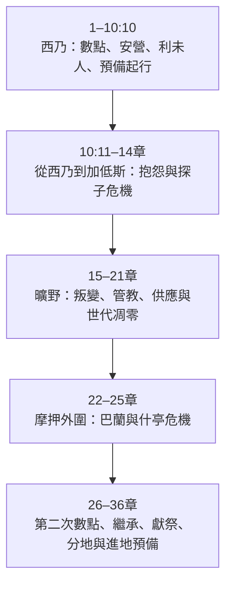
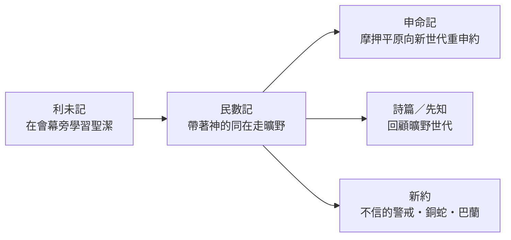

<!-- book-introduction-navigation:start -->
| [[04 民數記/全書目錄及綱要|全書目錄及綱要]] | [[04 民數記/第1章|開始讀第1章]] |
| :--- | ---: |
<!-- book-introduction-navigation:end -->

---

# 民數記

*在曠野中・一個世代倒下，另一個世代走到應許之地門口*

中文書名讓人容易以為《民數記》主要是在記人口統計；但希伯來書名「在曠野中」更貼近全書。故事從西乃山下已經整隊完成的以色列開始：會幕在營中央，百姓預備向迦南前進。真正的危機卻不是路有多遠，而是他們是否信靠神。從抱怨、探子事件、可拉叛變，到新一代在摩押平原重新被數點，《民數記》用一段近四十年的曠野旅程，呈現人的不信與神仍然持續的信實、管教與供應。

<!-- sources: CT00, GT00, KC0, BH, BIBLEPROJECT, ENTER_THE_BIBLE -->

---

## 一覽

| 項目 | 資料 |
| --- | --- |
| 位置 | 摩西五經第四卷；承接西乃，結束於摩押平原 |
| 章數 | 36 章 |
| 希伯來書名 | בְּמִדְבַּר（Bemidbar，「在曠野中」） |
| 希臘／通行書名 | Numbers／Arithmoi，來自第1章與第26章兩次人口數點 |
| 傳統作者歸屬 | 摩西 |
| 故事時間跨度 | 出埃及後第二年到第四十年，接近四十年 |
| 主要地理段落 | 西乃 → 巴蘭／加低斯與曠野 → 摩押平原 |
| 核心張力 | 人的不信與反叛 ↔ 神的信實、管教與應許 |

<!-- sources: CT00, GT00, KC0, BH, BIBLEPROJECT, ENTER_THE_BIBLE, YALE -->

---

## 書名與位置

中文「民數記」承接希臘文書名的傳統，因為第1章與第26章都大規模數點以色列人。但這兩次人口統計的真正作用，不只是提供數字：第一次數點的是準備從西乃起行的出埃及世代；第二次數點時，上一代幾乎已經倒在曠野，新的一代正在摩押平原準備進地。

希伯來書名 **בְּמִדְבַּר（Bemidbar，「在曠野中」）** 更直接點出本書舞台。《利未記》把百姓聚集在會幕周圍學習聖潔，《民數記》則讓這群人真正拔營上路；所以它是一卷「旅程中的信仰」之書。

> [!note] 兩次數點，其實是在看兩個世代
> 第1章不是只問「有多少人」，第26章也不是再算一次而已。兩張名單框住了全書最大的變化：**第一代因不信倒下，新一代在應許之地門口重新被預備。**

<!-- sources: CT00, GT00, KC0, BH, BIBLEPROJECT, ENTER_THE_BIBLE -->

---

## 作者、年代與曠野背景

按傳統理解，《民數記》是摩西五經第四卷，摩西是主要作者。書中多次以「耶和華曉諭摩西」推進，也明說摩西記錄行程站點。CT00、KingComments 與 BibleHub 因此把本書放在摩西帶領以色列走曠野的歷史框架中。

從敘事時間看，本書開始於出埃及後第二年二月，百姓仍在西乃；結尾已到第四十年，位於約旦河東的摩押平原。全書跨度接近四十年，但敘事分布很不平均：對西乃起行前與進地前的最後階段寫得很多，漫長的中間歲月反而大量留白。

現代研究則把本書看成多種材料編整而成：旅程敘事、祭司律例、人口名單、詩歌、巴蘭故事、戰爭與土地規定都並列其中。Enter the Bible 把這些材料放在五經長期形成中討論；Yale 也從古代記錄、祭司傳統與巴蘭等外部材料來閱讀。

| 要分開看的問題 | 本卷導論的處理 |
| --- | --- |
| 故事所涵蓋的時間 | 出埃及後第二年到第四十年；接近整個曠野世代。 |
| 傳統作者歸屬 | 摩西；第33章特別提到摩西記錄行程。 |
| 現代成書研究 | 多種敘事、法律、祭司、詩歌與名單材料的長期形成與編整。 |
| 主要地理舞台 | 西乃曠野 → 巴蘭／加低斯與曠野旅程 → 摩押平原。 |

> [!important] 四十年很多，正文卻沒有平均記四十年
> 本書大量篇幅集中在 **出發前、重大叛逆、以及進地前**。中間長年曠野生活常只以站名或少數事件帶過，這本身就是敘事設計的一部分。

<!-- sources: CT00, GT00, KC0, BH, ENTER_THE_BIBLE, YALE -->

---

## 主旨：路不只是走過去，人必須學會信靠

《民數記》開始時，一切看起來已經準備好：支派被數點、營地有次序、會幕在中央、利未人有職責、雲彩帶領起行。真正上路後，問題卻迅速暴露。百姓為食物抱怨，米利暗和亞倫挑戰摩西，十二探子回報後全會眾拒絕進地。第14章成為全書重大轉折：原本可以進入迦南的一代，被宣告要在曠野中倒下。

後面的故事顯示，判決不等於神取消應許。可拉叛變、摩西擊打磐石、銅蛇、巴蘭與巴勒等事件一再顯出人的脆弱與危機，但神仍供應食物與水、保護百姓不被咒詛，並把新世代帶到摩押。

因此這卷書的張力不只是「以色列很會抱怨」，而是：**神的應許如何在一個反覆不信的群體中仍然往前？** 答案同時包括恩典、管教、代求、審判與新一代的興起。

> [!summary] 全書最大的對比
> **第一代看見神的作為卻不信；第二代則在上一代的失敗之後重新站到應許之地門口。**

<!-- sources: CT00, GT00, KC0, BH, BIBLEPROJECT, ENTER_THE_BIBLE -->

---

## 本書的重要性與特色

《民數記》讓五經的「出埃及」真正走向「進應許之地」。如果沒有這卷書，讀者會從西乃的律法直接跳到摩押／迦南，無法理解為什麼出埃及的第一代沒有進地、約書亞為什麼接班，以及四十年曠野如何成為以色列長久的信仰記憶。

它也把會幕與聖潔制度放進移動中的現實。利未記談聖潔時，百姓基本上停在營地；民數記則問：營地怎麼排列？會幕怎麼搬？誰負責？遇到不潔、衝突、戰爭、分地與領袖交接時，屬神群體要怎麼繼續前進？

**地理結構就是故事結構**  
西乃、曠野／巴蘭、摩押三個主要區域，對應預備、危機與重新預備三個階段。

**兩次人口數點框住世代更替**  
第1章的軍隊幾乎沒有成為第26章的軍隊；數字背後是第14章判決的實現。

**文體非常混合**  
歷史敘事、法律、祭司規定、名單、詩歌、預言與旅行記錄穿插，顯示本書不只是「曠野故事集」。

**外人的巴蘭反而說出祝福**  
當以色列自己反覆不信時，受雇來咒詛的外邦先見卻不得不宣告祝福，形成強烈反諷。

<!-- sources: CT00, GT00, KC0, BH, BIBLEPROJECT, ENTER_THE_BIBLE, YALE -->

---

## 全書結構

《民數記》最自然的骨架是旅程地理。BibleProject 與 Enter the Bible 都強調從西乃出發、經曠野、抵摩押的三段移動；若配合現有目錄細分，可以把中間的加低斯危機特別凸顯出來。

| 範圍 | 段落 | 內容重點 |
| --- | --- | --- |
| 1–10:10 | 西乃山下 | 第一次數點、安營、利未人、潔淨與逾越節；群體準備出發。 |
| 10:11–14章 | 從西乃到加低斯 | 起行後接連抱怨與權柄衝突，最終在探子事件拒絕進地。 |
| 15–21章 | 曠野世代 | 可拉叛變、祭司確認、紅母牛、摩西擊磐石、亞倫去世、銅蛇與戰事。 |
| 22–25章 | 巴蘭與摩押危機 | 外來咒詛被轉成祝福，內部卻在什亭陷入背約。 |
| 26–36章 | 新世代預備進地 | 第二次數點、約書亞承接、獻祭與許願、河東分地、行程、邊界與逃城。 |

<!-- sources: CT00, GT00, BH, BIBLEPROJECT, ENTER_THE_BIBLE, YALE -->

---

## 鑰節、鑰字與核心主題

《民數記》最重要的經文常落在「秩序、信心、祝福、管教與新世代」上。第6章祭司祝福顯示神願意把名放在百姓身上；第9章雲彩說明起行與安營都以神的引導為中心；第14章是不信的轉折；第21章銅蛇和22–24章巴蘭則顯示即使在審判與外敵之中，神仍保存生命與祝福。

| 經文 | 在全書中的位置 |
| --- | --- |
| 民6:24–26 | 祭司祝福；神的賜福、保守、恩典與平安成為百姓身份的一部分。 |
| 民9:15–23 | 雲彩決定安營與起行；理想中的曠野旅程是跟隨神的同在。 |
| 民14:8–9、22–35 | 探子事件的核心；信靠與不信使一個世代的命運分開。 |
| 民21:4–9 | 銅蛇事件；百姓因悖逆受審判，也因仰望神所提供的方式得存活。 |
| 民23:19–23 | 巴蘭祝福強調神不是反覆無常，祂對以色列的應許不能被外來咒詛取消。 |
| 民26章 | 第二次數點標記新世代正式站到進地前。 |

**鑰字／重複線索：** 曠野、數點、安營／起行、耶和華曉諭摩西、抱怨／背叛、信、會幕、產業／地

- **神的同在與秩序**：會幕在營中央，雲彩決定行止；群體不是漫無目的地流浪。
- **不信與管教**：最大的失敗不是缺乏資源，而是在看見神作為後仍拒絕信靠祂的應許。
- **代求與領袖**：摩西多次站在百姓與審判之間；但他自己也在米利巴失敗，顯出領袖並非免於責任。
- **應許跨過世代失敗**：第一代倒下，約卻沒有倒下；第二代仍被帶到約旦河東。

<!-- sources: CT00, GT00, KC0, BH, BIBLEPROJECT, ENTER_THE_BIBLE, YALE -->

---

## 與前後書卷及整本聖經的關係

《民數記》直接承接《利未記》：同樣的會幕、祭司與聖潔制度開始移動起來。它又直接把故事帶到《申命記》的舞台——摩押平原。申命記不是突然出現的另一套律法，而是摩西面對民數記末尾那個新世代，重新回顧歷史、解釋律法並更新約。

後來聖經經常把曠野世代當成警戒。詩篇78、95、106回顧他們的不信；先知使用曠野記憶反思以色列與神的關係；新約尤其《哥林多前書》10章與《希伯來書》3–4章，把這一代「蒙救贖卻因不信倒下」的故事用來提醒信徒。

民數記21章的銅蛇也被《約翰福音》3章重新引用；巴蘭則在新約多處成為錯誤道路與引誘的象徵。這些引用說明《民數記》雖然讀起來零散，卻深深進入後續聖經的警戒與盼望語彙。

<!-- sources: CT00, GT00, KC0, BH, BIBLEPROJECT, ENTER_THE_BIBLE, YALE -->

---

> [!info]- 本頁來源與方法
>
> 本頁以 **CT00 的書卷提要節奏作為編排參考**；CT00、GT00、KC0、BH 是四套既有註釋來源，BibleProject、Enter the Bible、Yale 屬補強層，不加入四家共識票數。
>
> - **CT00**｜[CCBibleStudy 民數記提要](https://www.ccbiblestudy.org/Old%20Testament/04Num/04CT00.htm)
> - **GT00**｜[CCBibleStudy 民數記導論拾穗](https://www.ccbiblestudy.org/Old%20Testament/04Num/04GT00.htm)
> - **KC0**｜[KingComments — Numbers Introduction](https://www.kingcomments.com/en/bible-studies/Num/0)
> - **BH**｜[BibleHub — Numbers Summary and Study Bible](https://biblehub.com/numbers/)
> - **BIBLEPROJECT**｜[BibleProject — Book of Numbers Guide](https://bibleproject.com/guides/book-of-numbers/)
> - **ENTER_THE_BIBLE**｜[Enter the Bible — Numbers](https://enterthebible.org/courses/numbers/)
> - **YALE**｜[Yale Bible Study — Leviticus, Numbers, and Deuteronomy](https://yalebiblestudy.org/courses/leviticus-numbers-and-deuteronomy/)
>
> GT00 是多家導論與研讀資料的合輯，使用其中個別觀點時必須保留子來源；BibleHub 即使整合多種底層資料，在本專案仍只算一個 BH 來源維度。作者、年代、旅程歷史與文本形成若有分歧，本文按不同問題層次並列。

---

<!-- book-introduction-navigation:start -->
| [[04 民數記/全書目錄及綱要|全書目錄及綱要]] | [[04 民數記/第1章|開始讀第1章]] |
| :--- | ---: |
<!-- book-introduction-navigation:end -->
