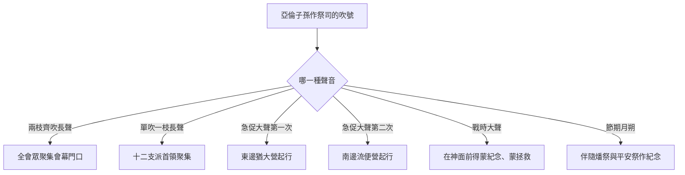
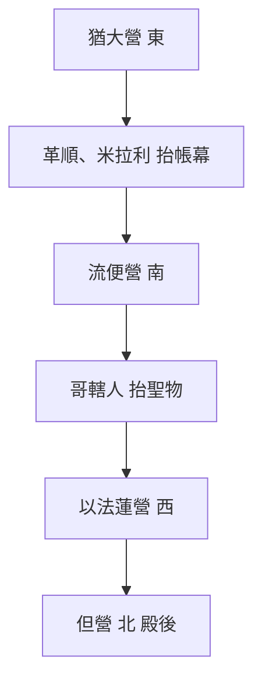

# 民數記 第10章

<!-- chapter-navigation:start -->
| [前一章](../04%20民數記/第9章.md) | [回目錄](../04%20民數記/全書目錄及綱要.md) | [下一章](../04%20民數記/第11章.md) |
| :--- | :---: | ---: |
<!-- chapter-navigation:end -->

1. 耶和華曉諭摩西說：
2. 你要用銀子做[[銀號|兩枝號]]，都要[[銀號製作工藝（錘出法）|錘出來]]的，用以招聚會眾，並叫眾營[[拔營起行|起行]]。
3. 吹這[[銀號|號]]的時候，全會眾要到你那裡，聚集在[[會幕（帳幕整體）|會幕]]門口。
4. 若單吹一枝，眾首領，就是以色列軍中的統領，要聚集到你那裡。
5. 吹出大聲的時候，東邊安的營都要[[拔營起行|起行]]。
6. 二次吹出大聲的時候，南邊安的營都要[[拔營起行|起行]]。他們將起行，必吹出大聲。
7. 但招聚會眾的時候，你們要吹[[銀號|號]]，卻不要吹出大聲。
8. 亞倫子孫作祭司的要吹這[[銀號|號]]；這要作你們世世代代永遠的定例。
9. 你們在自己的地，與欺壓你們的敵人打仗，就要用[[銀號|號]]吹出大聲，便在耶和華─你們的神面前得蒙紀念，也蒙拯救脫離仇敵。
10. 在你們快樂的日子和節期，並月朔，獻[[燔祭]]和[[平安祭]]，也要吹[[銀號|號]]，這都要在你們的神面前作為紀念。我是耶和華─你們的神。
11. 第二年二月二十日，[[雲彩]]從[[法櫃的帳幕]]收上去。
12. 以色列人就按站[[拔營起行|往前行]]，離開[[西乃的曠野]]，[[雲彩]]停住在[[巴蘭的曠野]]。
13. 這是他們照耶和華藉摩西所吩咐的，初次[[拔營起行|往前行]]。
14. 按著軍隊首先[[拔營起行|往前行]]的是猶大營的[[安營與纛|纛]]。統領軍隊的是亞米拿達的兒子拿順。
15. 統領以薩迦支派軍隊的是蘇押的兒子拿坦業。
16. 統領西布倫支派軍隊的是希倫的兒子以利押。
17. [[會幕（帳幕整體）|帳幕]]拆卸，[[革順子孫|革順的子孫]]和[[米拉利子孫|米拉利的子孫]]就抬著帳幕先[[拔營起行|往前行]]。
18. 按著軍隊[[拔營起行|往前行]]的是流便營的[[安營與纛|纛]]。統領軍隊的是示丟珥的兒子以利蓿。
19. 統領西緬支派軍隊的是蘇利沙代的兒子示路蔑。
20. 統領迦得支派軍隊的是丟珥的兒子以利雅薩。
21. [[哥轄子孫|哥轄人]]抬著聖物先[[拔營起行|往前行]]。他們未到以前，抬[[會幕（帳幕整體）|帳幕]]的已經把帳幕支好。
22. 按著軍隊[[拔營起行|往前行]]的是以法蓮營的[[安營與纛|纛]]，統領軍隊的是亞米忽的兒子以利沙瑪。
23. 統領瑪拿西支派軍隊的是比大蓿的兒子迦瑪列。
24. 統領便雅憫支派軍隊的是基多尼的兒子亞比但。
25. 在諸營末後的是但營的[[安營與纛|纛]]，按著軍隊[[拔營起行|往前行]]。統領軍隊的是亞米沙代的兒子亞希以謝。
26. 統領亞設支派軍隊的是俄蘭的兒子帕結。
27. 統領拿弗他利支派軍隊的是以南的兒子亞希拉。
28. 以色列人按著軍隊[[拔營起行|往前行]]，就是這樣。
29. 摩西對他[[流珥葉忒羅與何巴的稱謂關係|岳父]]（或作：[[流珥葉忒羅與何巴的稱謂關係|內兄]]）─[[何巴|米甸人流珥的兒子何巴]]─說：我們要[[拔營起行|行路]]，往耶和華所應許之地去；他曾說：我要將這地賜給你們。現在求你和我們同去，我們必厚待你，因為耶和華指著以色列人已經應許給好處。
30. [[何巴]]回答說：我不去；我要回本地本族那裡去。
31. 摩西說：求你不要離開我們；因為你知道我們要在曠野安營，你可以當作我們的眼目。
32. 你若和我們同去，將來耶和華有什麼好處待我們，我們也必以什麼好處待你。
33. 以色列人離開耶和華的山，[[拔營起行|往前行]]了三天的路程；[[約櫃|耶和華的約櫃]]在前頭行了三天的路程，為他們尋找安歇的地方。
34. 他們拔營[[拔營起行|往前行]]，日間有耶和華的[[雲彩]]在他們以上。
35. [[約櫃]][[拔營起行|往前行]]的時候，摩西就說：耶和華啊，求你興起！願你的仇敵四散！願恨你的人從你面前逃跑！
36. [[約櫃]]停住的時候，他就說：耶和華啊，求你回到以色列的千萬人中！

---

## 本章知識節點

### 文化
- [[銀號]]
- [[銀號形制（直筒喇叭口）]]
- [[銀號製作工藝（錘出法）]]

### 主題
- [[會幕（帳幕整體）]]
- [[約櫃]]
- [[安營與纛]]

### 神學
- [[燔祭]]
- [[平安祭]]
- [[約櫃前行與停住的宣告]]

### 原文
- [[雲彩]]

### 地點
- [[法櫃的帳幕]]
- [[西乃的曠野]]
- [[巴蘭的曠野]]

### 歷史
- [[拔營起行]]

### 人物
- [[革順子孫]]
- [[米拉利子孫]]
- [[哥轄子孫]]
- [[何巴]]

### 背景
- [[古代近東的戰場傳訊方式]]

### 解經爭議
- [[流珥葉忒羅與何巴的稱謂關係]]
- [[摩西請何巴作嚮導是否顯出信心不足]]
- [[約櫃在前頭行與在營中的位置]]

### 互文
- [[銀號與主再來天使吹號（太24：31）|太24：31 天使吹號招聚選民]]
- [[銀號與聖殿敬拜（代下5：12）|代下5：12 所羅門獻殿的一百二十枝號]]

---

## 本章整理

### 兩枝銀號：一套用聲音下令的系統（v1-10）

以色列人在西乃山下領受的最後一項指示，是做兩枝[[銀號]]。GT《民數記串珠聖經註釋》把它與雲彩並列：「在西乃山上，神最後的一項指示是吩咐摩西製造兩枝銀號，從此用吹號來召集會眾及指揮起行。」KC 說得更直接：雲彩是用看的，號是用聽的——「雲彩是可見的，號是可聞的。號是耶和華向他們說話的聲音。」

材質與工法都有規定。CT 的〔文意註解〕說：「『用銀子』跟用羊角製的喇叭不同，銀子在聖經裡表徵救贖……『錘出來』表示整體的材質沒有摻雜，是純銀作的，金燈台也是錘出來的（參出二十五31）。」GT《民數記串珠聖經註釋》把這道工序歸到同一類器物：「整枝號筒要用人手錘出來（1），正如聖所中的器具一樣」（見[[銀號製作工藝（錘出法）]]）。KC 從「被錘打」讀出另一層：這是那位「為我們被神的刀擊打」的好牧人的聲音（亞13:7上）。

**兩枝號的長度，GT 內部給了兩個差十倍的數字**，這件事本身值得看：《民數記串珠聖經註釋》引猶太史家說「銀號的直管約四十五毫米長，開端像喇叭」；《啟導本聖經註釋》引約瑟夫說「銀號為直筒形，長約45公分，末端張開如喇叭」。經文沒有給尺寸，兩說並存（見[[銀號形制（直筒喇叭口）]]）。

號只有兩枝，卻要指揮數十萬人，靠的是聲音的編碼。GT《民數記串珠聖經註釋》點出方法：「吹號是要全會眾聽見，所以必須是大聲的，只藉節奏的快慢表達不同的信息。」

| 吹法 | 聲音 | 誰要動 | 節次 |
| :--- | :--- | :--- | :--- |
| 兩枝齊吹、悠長 | 召集號 | 全會眾到會幕門口（見 [[會幕（帳幕整體）]]） | v3 |
| 單吹一枝、悠長 | 召集號 | 只有十二支派的首領 | v4 |
| 吹出大聲、急促 | 起行號（第一次） | 東邊的猶大營 | v5 |
| 吹出大聲、急促 | 起行號（第二次） | 南邊的流便營 | v6 |
| 吹出大聲 | 戰時求告 | 全軍，並蒙神紀念與拯救 | v9 |
| 吹號 | 節期號 | 獻祭時在神面前作紀念（見 [[燔祭]]、[[平安祭]]） | v10 |

STEP語言資料顯示，經文其實用了兩組不同的字來承擔這兩種訊號：第3、4、7、8節的「吹」是動詞 ta.qa（H8628，詞典義 to blow）；第5、6節的「吹出大聲」是名詞 te.ru.'Ah（H8643，詞典義 shout，本節譯義是 an alarm）——CT 註「『吹出大聲』原文是一個字」，正對得上；到第9節進入戰場，用的換成同一字根的動詞 ru.a（H7321，詞典義 to shout，Hiphil 使役形）。BH 也用同一組名稱區分：長聲叫 tekiah，短聲叫 teruah。這套聲音編碼並不是憑空發明的，GT《舊約聖經背景註釋》指出當代軍隊本來就熟悉這類方法（見[[古代近東的戰場傳訊方式]]）。

第9節有一個中譯讀不出的語態。STEP語言資料顯示「得蒙紀念」是 va./niz.kar.Tem（H2142，詞典形 za.khar，詞典義 to remember），「蒙拯救」是 ve./no.sha'.Tem（H3467，詞典形 ya.sah，詞典義 to save），==兩個都是 Niphal 被動形==：不是以色列人記得什麼、救了自己，而是他們被記念、被拯救。BH 在同一節說：「被神『記念』意味著祂主動的參與與恩眷。」

> [!note] KC 從方位讀出的一層意思
> KC 注意到號聲的次序與營的方位相關：「住在東邊的人最先聽見號聲。東邊說到盼望主的降臨，那升起的太陽。」接著是南邊，「就是右邊，這些人知道自己在基督裡的地位」。他並指出一個經文的沉默：==「西邊和北邊沒有為他們吹號。」== 這是 KC 個人的屬靈解讀，經文只記東、南兩次吹號，未說明原因。

吹號的人有限定。第8節說「亞倫子孫作祭司的要吹這號」，並定為世世代代永遠的定例。CT 由此推論：「祭司吹號成為以色列人永遠的規矩，暗示打仗是神的事，祂要作耶和華軍隊的元帥（參書五14）。」KC 特別強調吹號的不是利未人而是祭司：「不是那些用話語服事的弟兄（利未人），而是習慣在聖所中與神相交、認識祂的心思的信徒。」這條定例後來一路延伸到聖殿（見[[銀號與聖殿敬拜（代下5：12）]]）與末世（見[[銀號與主再來天使吹號（太24：31）]]）。

### 第二年二月二十日：第一次拔營（v11-28）

[[雲彩]]從[[法櫃的帳幕]]收上去，以色列人第一次[[拔營起行]]，離開[[西乃的曠野]]，一路走到[[巴蘭的曠野]]。他們在西乃待了多久？CT 說「以色列人在西乃曠野安營十一個多月（參出十九1）」，KC 說差不多一年。GT 丁良才把這一節看成整卷書的轉軸：「本書的樞紐，在10和11節當中。」GT《啟導本聖經註釋》說明它切開的下半段有多長：「自本節到二十二1，記載以色列民從西奈起程到達摩押平原一共38年的生活。」

這一年並不是空等。GT《聖經精讀本》列出這段時間完成的事——與神立約、接受律法、建立會幕、接受祭祀制度，最後為了行軍數點人數——並下了一句評語：「以色列百姓一年時間的等候不是時間和精力的浪費，而是培養成熟人格和增強國力所必需的時間。」

行軍的次序就是安營的次序。GT 丁良才：「以色列人起行的次序，和安營的次序一樣（二17）。」四個營各有自己的[[安營與纛|纛]]，依東、南、西、北的順序拔營，利未人的兩批搬運隊插在中間。

| 順序 | 誰 | 帶的是什麼 | 節次 |
| :--- | :--- | :--- | :--- |
| 1 | 猶大營（猶大、以薩迦、西布倫） | 猶大營的纛，拿順統領 | v14-16 |
| 2 | 革順與米拉利兩族（見 [[革順子孫]]、[[米拉利子孫]]） | 拆卸下來的帳幕：幕幔、幕板、院帷、柱子、閂、帶卯的座 | v17 |
| 3 | 流便營（流便、西緬、迦得） | 流便營的纛，以利蓿統領 | v18-20 |
| 4 | 哥轄一族（見 [[哥轄子孫]]） | 聖物：約櫃、金香壇、金燈台、陳設餅的桌子、洗濯盆、祭壇 | v21 |
| 5 | 以法蓮營（以法蓮、瑪拿西、便雅憫） | 以法蓮營的纛，以利沙瑪統領 | v22-24 |
| 6 | 但營（但、亞設、拿弗他利） | 但營的纛殿後，亞希以謝統領 | v25-27 |

兩批利未人為什麼分開走？CT 給了很實際的理由：革順與米拉利人跟在猶大營後面，「這樣，當他們到達新的營地，可以立即支搭起來，好讓哥轄的子孫所搬運的聖物（器具）到達時，馬上搬進去，不容不相干的人碰觸」。KC 把這個安排歸給神的智慧：等第二營也安營完畢，哥轄人就正好可以把聖物放進已經立好的帳幕。

KC 注意到一個與民二不同的地方：民二說帳幕要在隊伍正中，這裡卻是第一營一走，革順與米拉利人就跟著出發了。他並提出一個觀察：以法蓮這一營緊跟在約櫃後面，「使這幾個支派可以直接看見它」，而詩篇八十篇第2節提到的正是以法蓮、便雅憫、瑪拿西三支派，可能就是指這一段。GT 丁良才則從人數看防衛：「四營中的第一營（就是最先之營）的人數，和第四營（就是最後之營）的人數，都是很多（參二章之表），所以能保護當中第二第三兩營。」

STEP語言資料在這一段給出兩個高頻字：「軍隊」是 tsa.va（H6635A，詞典義 army），全章出現 17 次；「往前行／起行」是 na.sa（H5265，詞典義 to set out），出現 16 次。第12節的「按站」則是 le./mas.'ei./Hem（H4550，詞典形 mas.sa，詞典義 journey）——一站一站的行程本身就是一個名詞。

### 摩西與何巴：四套來源在這裡真的分歧（v29-32）

摩西邀請[[何巴]]同行，被拒絕，又再求一次。這段對話短，卻是全章唯一四套來源正面對立的地方（見[[摩西請何巴作嚮導是否顯出信心不足]]）。

| 立場 | 誰 | 原話 |
| :--- | :--- | :--- |
| 顯出信心不足 | CT〔靈意註解〕 | 「摩西請求岳父同行，好作眼目，表示他的信心不足。」 |
| 顯出信心不足 | KC | 摩西「似乎更倚靠一個看得見摸得著的嚮導，過於那位看不見的神」 |
| 不是不信 | GT《聖經精讀本》 | 「這並不表示摩西的不信，而是為了更加有效地調動百萬以上的以色列百姓所需要的。」 |
| 不是不信 | GT 丁良才 | 「雲柱不過指示他們一個大概的方向和地位。」 |
| 不是不信 | GT 賈斯樂郝威 | 「提出這個批評的人，不瞭解神並不須為我們作一些我們人自己可以解決的事情。」 |
| 未判定 | BH | 這段話「凸顯了人對同伴與支持的需要，即使神的引導已經在場」 |

GT 丁良才另從正面整理摩西這番話的結構，說它「可作信徒對於外人的模範」：承認（我們要行路，往耶和華所應許之地去）、邀請（求你和我們同去）、應許（我們必厚待你）、見證（耶和華已經應許給好處）。CT 列的四點幾乎相同。

「岳父」還是「內兄」，經文小字自己就留了兩讀（見[[流珥葉忒羅與何巴的稱謂關係]]）。CT 說：「原來希伯來文的岳父和內兄是同一個字（參本節小字），故何巴仍宜解作內兄。」GT《舊約聖經背景註釋》講得更廣：「用來形容女子男性近親的字眼含義很廣泛，同一個字可以解作女子的父親、兄弟，甚至祖父。」==STEP語言資料正好對上這個說法==：第29節「岳父」是 cho.Ten（H2859A），簡要詞典義是 relative（親戚），本節譯義才落在 father-in-law，詞形是 Qal 主動分詞，本身不指定是哪一種姻親。

經文沒有記何巴的答覆。GT 丁良才與《啟導本聖經註釋》都指出，從士一16、四11、撒上十五6 等後續記載看，士師時代與列王時代的基尼人就是何巴的後代，他大概還是同去了。

### 約櫃走到隊伍前頭（v33-36）

第33節出現一個與前面隊形不合的畫面：[[約櫃]]「在前頭行了三天的路程，為他們尋找安歇的地方」。但第21節與民二17 都把哥轄人排在第二營之後。這個位置問題歷來有幾種解法（見[[約櫃在前頭行與在營中的位置]]）：GT 賈斯樂郝威《聖經難解經文詮釋手冊》列出「兩個約櫃說」「平時居中、特殊時在前說」，以及「『在前頭行』並非表示約櫃所處的地點，而是象徵它領導的地位」三種，並補上第四種——安營時居中、拔營時在前。CT 與 GT 丁良才都採第二種：「若遇到特別緣故，約櫃便會轉到前頭（參書三6）。」

KC 不從位置爭起，而讀出一個職分的翻轉：==「在這裡不是百姓保護約櫃，而是約櫃保護百姓。」== 神離開祂在營中被人看顧的位置，反過來走在前面，替他們找安歇之處。他把這件事直接接到前一段——摩西求何巴作眼目之後，「耶和華讓人清楚知道誰在作主」。要不要把兩段讀成因果，取決於怎麼判斷第29至32節。

約櫃每次起行與停住，摩西都說一句話（見[[約櫃前行與停住的宣告]]）。GT《啟導本聖經註釋》描寫那個場面：「每天早上摩西對神說：『求你興起，願你的仇敵四散』（35節；參詩六十八1）；每天晚上他向神祈求：『求你回到以色列的千萬人中』（36節）。」GT《聖經精讀本》強調這兩句話的對象：「在這裡所要強調的是以色列真正的君王——神，而不是約櫃……當知道戰爭是屬於耶和華時，才能取得勝利。」

GT《啟導本聖經註釋》另留下一個文本上的旁註：第34節在「《七十士譯本》將本節放在36節後」。

### 原文層：一個字把第10章和第13章綁在一起

STEP語言資料顯示第33至36節有一組同根字在來回：

| 節次 | 和合本 | 原文 | 詞典義 |
| :--- | :--- | :--- | :--- |
| v33 | 安歇的地方 | me.nu.Chah（H4496H） | resting |
| v36 | 停住 | u./ve./nu.Ch/oh（H5117，詞典形 nu.ach） | to rest |

約櫃去尋找的「安歇之處」，與它自己「停住」的動作，出自同一個字根。CT 給「安歇的地方」的原文字義正是「安息之所，休息」。

更值得注意的是第33節的「尋找」。STEP語言資料顯示這個字是 la./Tur（H8446，詞典形 tur，詞典義 to spy）。同一個字在民數記接下來密集出現，全部譯作「窺探」——第13章第2、16、17、21、25、32節與第14章第6、7、34、36、38節；==而第13章16、17節用的正是與第33節一字不差的 la./Tur。== 同一個動作，本章由約櫃替百姓做，三章之後改由十二個人去做。經文沒有評論這個重複，STEP 只確認用字相同。

第35、36節的三個動詞也都對得上 CT 的〔原文字義〕：「興起」是 ku.Ma/h（H6965B，詞典形 qum，to arise），「四散」是 ya.Fu.tzu（H6327A，puts，to scatter），「逃跑」是 ya.Nu.su（H5127，nus，to flee）。第36節的「千萬人」則是兩個數詞疊起來：ri.Vot（H7233，re.va.vah，myriad）配 'al.Fei（H505G，e.leph，thousand），字面是「以色列的千千萬萬」。

**參考資料**
https://www.ccbiblestudy.org/Old%20Testament/04Num/04CT10.htm
https://www.ccbiblestudy.org/Old%20Testament/04Num/04GT10.htm
https://www.kingcomments.com/en/bible-studies/Num/10
https://biblehub.com/study/numbers/10.htm
https://github.com/STEPBible/STEPBible-Data

<!-- appendix-links:start -->
## 附錄

### 相關地圖
- [[appendix/fhl_maps/maps/019|〈出圖二〉以色列人出埃及到西乃山]]
- [[appendix/fhl_maps/maps/020|〈民圖一〉從西乃山到加低斯]]
- [[appendix/fhl_maps/maps/024|〈民圖五〉出埃及和進迦南的旅程]]
- [[appendix/fhl_maps/maps/025|〈申圖一〉應許之地全圖]]
<!-- appendix-links:end -->

<!-- chapter-navigation:start -->
| [前一章](../04%20民數記/第9章.md) | [回目錄](../04%20民數記/全書目錄及綱要.md) | [下一章](../04%20民數記/第11章.md) |
| :--- | :---: | ---: |
<!-- chapter-navigation:end -->
