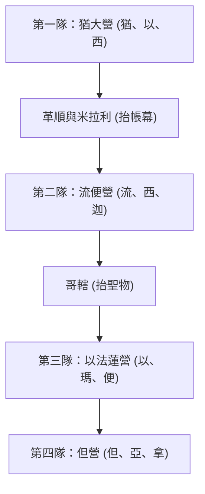

# 民數記 第10章

1. 耶和華曉諭摩西說：
2. 你要用銀子做[[銀號|兩枝號]]，都要錘出來的，用以招聚會眾，並叫眾營[[拔營起行|起行]]。
3. 吹這號的時候，全會眾要到你那裡，聚集在會幕門口。
4. 若單吹一枝，眾首領，就是以色列軍中的統領，要聚集到你那裡。
5. 吹出大聲的時候，東邊安的營都要[[拔營起行|起行]]。
6. 二次吹出大聲的時候，南邊安的營都要[[拔營起行|起行]]。他們將起行，必吹出大聲。
7. 但招聚會眾的時候，你們要吹號，卻不要吹出大聲。
8. 亞倫子孫作祭司的要吹這號；這要作你們世世代代永遠的定例。
9. 你們在自己的地，與欺壓你們的敵人打仗，就要用號吹出大聲，便在耶和華─你們的神面前得蒙紀念，也蒙拯救脫離仇敵。
10. 在你們快樂的日子和節期，並月朔，獻燔祭和平安祭，也要吹號，這都要在你們的神面前作為紀念。我是耶和華─你們的神。
11. 第二年二月二十日，雲彩從法櫃的帳幕收上去。
12. 以色列人就按站[[拔營起行|往前行]]，離開西乃的曠野，雲彩停住在[[巴蘭的曠野]]。
13. 這是他們照耶和華藉摩西所吩咐的，初次[[拔營起行|往前行]]。
14. 按著軍隊首先[[拔營起行|往前行]]的是猶大營的纛。統領軍隊的是亞米拿達的兒子拿順。
15. 統領以薩迦支派軍隊的是蘇押的兒子拿坦業。
16. 統領西布倫支派軍隊的是希倫的兒子以利押。
17. 帳幕拆卸，革順的子孫和米拉利的子孫就抬著帳幕先[[拔營起行|往前行]]。
18. 按著軍隊[[拔營起行|往前行]]的是流便營的纛。統領軍隊的是示丟珥的兒子以利蓿。
19. 統領西緬支派軍隊的是蘇利沙代的兒子示路蔑。
20. 統領迦得支派軍隊的是丟珥的兒子以利雅薩。
21. 哥轄人抬著聖物先[[拔營起行|往前行]]。他們未到以前，抬帳幕的已經把帳幕支好。
22. 按著軍隊[[拔營起行|往前行]]的是以法蓮營的纛，統領軍隊的是亞米忽的兒子以利沙瑪。
23. 統領瑪拿西支派軍隊的是比大蓿的兒子迦瑪列。
24. 統領便雅憫支派軍隊的是基多尼的兒子亞比但。
25. 在諸營末後的是但營的纛，按著軍隊[[拔營起行|往前行]]。統領軍隊的是亞米沙代的兒子亞希以謝。
26. 統領亞設支派軍隊的是俄蘭的兒子帕結。
27. 統領拿弗他利支派軍隊的是以南的兒子亞希拉。
28. 以色列人按著軍隊[[拔營起行|往前行]]，就是這樣。
29. 摩西對他岳父（或作：內兄）─[[何巴|米甸人流珥的兒子何巴]]─說：我們要行路，往耶和華所應許之地去；他曾說：我要將這地賜給你們。現在求你和我們同去，我們必厚待你，因為耶和華指著以色列人已經應許給好處。
30. [[何巴]]回答說：我不去；我要回本地本族那裡去。
31. 摩西說：求你不要離開我們；因為你知道我們要在曠野安營，你可以當作我們的眼目。
32. 你若和我們同去，將來耶和華有什麼好處待我們，我們也必以什麼好處待你。
33. 以色列人離開耶和華的山，[[拔營起行|往前行]]了三天的路程；耶和華的約櫃在前頭行了三天的路程，為他們尋找安歇的地方。
34. 他們拔營[[拔營起行|往前行]]，日間有耶和華的雲彩在他們以上。
35. 約櫃[[拔營起行|往前行]]的時候，摩西就說：耶和華啊，求你興起！願你的仇敵四散！願恨你的人從你面前逃跑！
36. 約櫃停住的時候，他就說：耶和華啊，求你回到以色列的千萬人中！

---

## 本章知識節點

### 文化
- [[銀號]]

### 歷史
- [[拔營起行]]

### 地點
- [[巴蘭的曠野]]

### 人物
- [[何巴]]

### 神學
- [[約櫃前行與停住的宣告]]

---

## 本章整理

民數記第十章是曠野旅程的一個重要轉折點。本章前半段記載了行軍信號的設立，後半段則詳細描述了以色列人自出埃及後第一次正式成軍拔營起行的歷史性時刻。這章經文不僅記錄了歷史事實，更充滿了關於順服、引導與神同在的豐富神學意義。

### 製造銀號與吹號的條例（v1-10）

為了有效指揮數百萬人的大軍，神吩咐摩西用純銀錘出兩枝[[銀號]]。號聲成了神旨意傳遞的具體工具。吹號的權責交由亞倫的子孫（祭司）執行，這表明以色列的行軍與爭戰不是世俗的行動，而是屬靈的軍事行動，是由耶和華親自發號施令。銀在聖經中預表救贖，而「錘出來」則象徵著經過十字架的壓榨與苦難。這意味著神的命令與引導是建立在救贖的根基之上。

號聲有著極其細緻的功能區分，要求百姓必須敏銳辨識：
- **單吹一枝**：召集眾首領（軍中統領）到會幕前，接受具體指令。
- **雙吹兩枝**：召集全會眾到會幕門口，通常是為了重大的宣告。
- **吹出大聲（急促聲）**：這是各營起行的信號。第一次大聲東邊營起行，第二次大聲南邊營起行。這種急促的戰鬥號音，帶有催促與警醒的意味。
- **戰爭與節期吹號**：在面臨仇敵爭戰時吹號，能得蒙神的記念與拯救；在節期、月朔獻燔祭與平安祭歡慶時也要吹號。這表明無論在艱難的爭戰中，還是在喜樂的慶典裡，以色列人都必須倚靠神、尊神為大。

### 第一次拔營起行（v11-28）

在第二年二月二十日，雲彩從法櫃的帳幕收上去，以色列人迎來了他們歷史上首次的[[拔營起行]]。他們離開了駐紮近十一節個月的西乃曠野，跟隨雲彩的引導，最終停留在[[巴蘭的曠野]]。這次起行象徵著他們從「領受律法」的靜態階段，正式進入「邁向應許」的動態行軍階段。

此次行軍嚴格遵照神先前在民數記第二章所指示的編組與順序，展現了極高的軍事紀律與屬靈次序：
- **前鋒（東邊）**：猶大營的纛首先起行，包含猶大、以薩迦、西布倫支派。猶大作為領頭的支派，預表著君王與獅子的權柄。
- **帳幕結構**：緊接著是革順與米拉利子孫，他們負責抬著會幕的板閂、罩棚等結構起行。
- **第二陣營（南邊）**：流便營的纛（流便、西緬、迦得）隨後跟上。
- **聖物**：哥轄子孫負責抬著聖所的神聖器具（如約櫃、金燈臺等）起行。這樣的先後安排極具智慧：當哥轄人抵達新營地時，前面的革順與米拉利人已經將帳幕支搭完畢，聖物就可以直接安放進去。
- **第三陣營（西邊）**：以法蓮營的纛（以法蓮、瑪拿西、便雅憫）。
- **殿後（北邊）**：但營的纛（但、亞設、拿弗他利）作為全軍的後衛，負責保護整個隊伍的後方。

這種井然有序的行軍陣列，不僅避免了百萬人同行的混亂，更展現了神是使人有和平、有次序的神。以色列人在曠野中以十字架（會幕與祭壇）為中心前行，預表了新約教會在世界中跟隨基督的屬靈次序。

### 摩西挽留何巴同行（v29-32）

在起行之際，摩西懇求他的內兄（或岳父）米甸人[[何巴]]與他們同去。摩西希望能借重何巴豐富的曠野生存經驗，作以色列人的「眼目」（嚮導）。摩西對何巴說：「求你不要離開我們，因為你知道我們要在曠野安營，你可以當作我們的眼目。」這段插曲常引發解經家的討論：以色列人已經有神的雲彩引導，為何還需要人的嚮導？

事實上，這說明了神超自然的引導並不排斥人自然的常識與經驗。雲彩指示大方向與何時起行、何時安營，但何巴的經驗可以幫助他們在營地附近尋找水源、牧草與合適的駐紮點。這教導我們，在完全倚靠神引導的同時，也不應忽視神所賜予的人類智慧與實際經驗的輔助。雖然何巴起初拒絕，但從後續歷史（士一16；四11）可知，他最終選擇了留下，其後裔（基尼人）與以色列人同住，這預表了外邦人因信而與神的百姓同得基業。

### 約櫃的引導與摩西的宣告（v33-36）

當百姓起行時，耶和華的約櫃在他們前頭行了三天的路程，為他們尋找安歇的地方，且有耶和華的雲彩在他們以上。這顯示神親自擔任了全軍的開路先鋒。約櫃代表神的同在，它親自走在前面，為百姓探路並預備安息之所，這是神對祂子民無微不至的牧養與看顧。

為此，摩西發出了強而有力的[[約櫃前行與停住的宣告]]。這兩句禱告，成為以色列人曠野旅程的定海神針：
1. **起行時**：「耶和華啊，求你興起！願你的仇敵四散，願恨你的人從你面前逃跑！」這宣告了神是以色列軍隊真正的元帥，祂親自為百姓爭戰，清除前方道路上的一切攔阻與仇敵。這是一種極具信心的爭戰宣告。
2. **停住時**：「耶和華啊，求你回到以色列的千萬人中！」這宣告了神的同在是以色列人安息與力量的泉源。這代表著在經歷了爭戰之後，神與祂的百姓同享平安與安息。

這兩段宣告生動地描繪了屬靈爭戰與安息的雙重節奏：在前進與爭戰中倚靠神的大能，在停歇與安營時享受神的同在，這正是新約信徒跟隨基督、奔跑天路的屬靈縮影。

**參考資料**
https://www.ccbiblestudy.org/Old%20Testament/04Num/04CT10.htm
https://www.ccbiblestudy.org/Old%20Testament/04Num/04GT10.htm
https://www.kingcomments.com/en/bible-studies/Num/10
https://biblehub.com/study/numbers/10.htm
