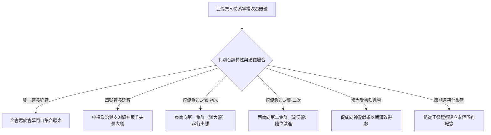

# 民數記 第10章

<!-- chapter-navigation:start -->
| [前一章](../04%20民數記/第9章.md) | [回目錄](../04%20民數記/全書目錄及綱要.md) | [下一章](../04%20民數記/第11章.md) |
| :--- | :---: | ---: |
<!-- chapter-navigation:end -->

1. 耶和華曉諭摩西說：
2. 你要用銀子做[[銀號|兩枝號]]，都要錘出來的，用以招聚會眾，並叫眾營[[拔營起行|起行]]。
3. 吹這[[銀號|號]]的時候，全會眾要到你那裡，聚集在[[會幕（帳幕整體）|會幕]]門口。
4. 若單吹一枝，眾首領，就是以色列軍中的統領，要聚集到你那裡。
5. 吹出大聲的時候，東邊安的營都要[[拔營起行|起行]]。
6. 二次吹出大聲的時候，南邊安的營都要[[拔營起行|起行]]。他們將起行，必吹出大聲。
7. 但招聚會眾的時候，你們要吹[[銀號|號]]，卻不要吹出大聲。
8. 亞倫子孫作祭司的要吹這[[銀號|號]]；這要作你們世世代代永遠的定例。
9. 你們在自己的地，與欺壓你們的敵人打仗，就要用[[銀號|號]]吹出大聲，便在耶和華─你們的神面前得蒙紀念，也蒙拯救脫離仇敵。
10. 在你們快樂的日子和節期，並月朔，獻[[燔祭|燔祭]]和[[平安祭|平安祭]]，也要吹[[銀號|號]]，這都要在你們的神面前作為紀念。我是耶和華─你們的神。
11. 第二年二月二十日，[[雲彩|雲彩]]從[[法櫃的帳幕]]收上去。
12. 以色列人就按站[[拔營起行|往前行]]，離開[[西乃的曠野]]，[[雲彩|雲彩]]停住在[[巴蘭的曠野]]。
13. 這是他們照耶和華藉摩西所吩咐的，初次[[拔營起行|往前行]]。
14. 按著軍隊首先[[拔營起行|往前行]]的是猶大營的纛。統領軍隊的是亞米拿達的兒子拿順。
15. 統領以薩迦支派軍隊的是蘇押的兒子拿坦業。
16. 統領西布倫支派軍隊的是希倫的兒子以利押。
17. [[會幕（帳幕整體）|帳幕]]拆卸，[[革順子孫|革順的子孫]]和[[米拉利子孫|米拉利的子孫]]就抬著帳幕先[[拔營起行|往前行]]。
18. 按著軍隊[[拔營起行|往前行]]的是流便營的纛。統領軍隊的是示丟珥的兒子以利蓿。
19. 統領西緬支派軍隊的是蘇利沙代的兒子示路蔑。
20. 統領迦得支派軍隊的是丟珥的兒子以利雅薩。
21. [[哥轄子孫|哥轄人]]抬著聖物先[[拔營起行|往前行]]。他們未到以前，抬[[會幕（帳幕整體）|帳幕]]的已經把帳幕支好。
22. 按著軍隊[[拔營起行|往前行]]的是以法蓮營的纛，統領軍隊的是亞米忽的兒子以利沙瑪。
23. 統領瑪拿西支派軍隊的是比大蓿的兒子迦瑪列。
24. 統領便雅憫支派軍隊的是基多尼的兒子亞比但。
25. 在諸營末後的是但營的纛，按著軍隊[[拔營起行|往前行]]。統領軍隊的是亞米沙代的兒子亞希以謝。
26. 統領亞設支派軍隊的是俄蘭的兒子帕結。
27. 統領拿弗他利支派軍隊的是以南的兒子亞希拉。
28. 以色列人按著軍隊[[拔營起行|往前行]]，就是這樣。
29. 摩西對他岳父（或作：內兄）─[[何巴|米甸人流珥的兒子何巴]]─說：我們要[[拔營起行|行路]]，往耶和華所應許之地去；他曾說：我要將這地賜給你們。現在求你和我們同去，我們必厚待你，因為耶和華指著以色列人已經應許給好處。
30. [[何巴]]回答說：我不去；我要回本地本族那裡去。
31. 摩西說：求你不要離開我們；因為你知道我們要在曠野安營，你可以當作我們的眼目。
32. 你若和我們同去，將來耶和華有什麼好處待我們，我們也必以什麼好處待你。
33. 以色列人離開耶和華的山，[[拔營起行|往前行]]了三天的路程；[[約櫃|耶和華的約櫃]]在前頭行了三天的路程，為他們尋找安歇的地方。
34. 他們拔營[[拔營起行|往前行]]，日間有耶和華的[[雲彩|雲彩]]在他們以上。
35. [[約櫃]][[拔營起行|往前行]]的時候，摩西就說：耶和華啊，求你興起！願你的仇敵四散！願恨你的人從你面前逃跑！
36. [[約櫃]]停住的時候，他就說：耶和華啊，求你回到以色列的千萬人中！

---

## 本章知識節點

### 文化
- [[銀號]]

### 主題
- [[會幕（帳幕整體）]]
- [[約櫃]]

### 原文
- [[燔祭]]
- [[平安祭]]
- [[雲彩]]

### 地點
- [[法櫃的帳幕]]
- [[西乃的曠野]]
- [[巴蘭的曠野]]

### 歷史
- [[拔營起行]]

### 人物
- [[革順子孫]]
- [[米拉利子孫]]
- [[哥轄子孫]]
- [[何巴]]

### 解經爭議
- [[流珥葉忒羅與何巴的稱謂關係]]

### 神學
- [[約櫃前行與停住的宣告]]

---

## 本章整理

### 銀號的製作指導與多元信號機制（1-10節）
在民數記第10章1至10節中，耶和華向摩西指示製作兩枝 [[銀號]]，作為招聚會眾與指揮拔營行軍的工具。經文嚴格強調兩枝銀號必須是「都要錘出來的」（第2節）。在預表神學與經文背景中，銀子代表「救贖」（參出三十16；CT 註解），而整體純銀經過敲打錘煉成像，在神學分析中指涉神救贖共同體的建立與聖潔試驗（KC；BH）。因此，號角聲並非傳達人性衝動，而是宣揚基於神聖救贖與典章的命令。此外，吹號的權柄「惟獨交由亞倫子孫作祭司的吹奏」（第8節），並列為世世代代永遠不廢的定例，確立了地上軍隊在軍事與宗教活動上的神權管轄性質。

銀號所傳達的信號依其演奏方式與調性具有嚴密的分類定義與實際功能：兩枝銀號同時長吹時，意為召集全體會眾於 [[會幕（帳幕整體）|會幕]] 門口集合；若僅吹奏一枝銀號，則限於召集代表全國內政與軍事的支派千夫長與首領。當會幕即將移動時，祭司需吹出短促且節奏鮮明的警報大聲（希伯來文 teruah）：第一次警報聲引導駐紮於會幕東面的營隊先行出發；第二次警報聲則啟動駐紮於南面的營隊。在將來進入應許地後，吹出急促大聲也兼具軍事警衛與信仰祈求的雙重效能，宣告百姓在敵陣的攻擊與重壓下向大能之神祈告保護，並獲得耶和華的記念與拯救。此外，於定期舉行的吉日、常規節期及每月朔日，祭司均需於獻上 [[燔祭|燔祭]] 與 [[平安祭|平安祭]] 時吹響銀號，以此在神面前作為選民忠貞遵守盟約與神永恆顧念的常規明證（CT；GT）。

| 信號形式與奏法 | 聲音結構與節奏 | 具體軍事或宗教行動 | 神學意義與經文詮釋 |
| :--- | :--- | :--- | :--- |
| **雙號齊吹長聲** | 沉穩明確、遍歷全部 | 招聚十二支派民代表親赴會幕大會 | 表達盟約中樞以救贖呼告統領整個全疆集體 |
| **單一號角長音** | 單管警示、受制鎖位 | 僅限於各族氏部長老及高層總首集結 | 在組織行政層級中顯示有條不紊的分層神意傳遞 |
| **連續大叫短鳴** | 快而響急、指歸明確 | 觸發各外圈陣列次第離營出動進退 | 設定嚴明階層之起程步履以維持井井有條的紀律 |
| **遭遇敵襲求急** | 危在急切、鳴金向安 | 於交兵之虞呼喊求庇，抗止外敵侵困 | 仰藉父神的護庇約旦，見證信仰即為抵禦邪惡之基礎 |
| **喜氣暨月朔發亮** | 和順喜悅、協贊獻薦 | 佐伴聖殿大牲之燔殺與感恩薦上之聲 | 確認信者在向王神敬奉中得長住於賜約護眷之下 |

### 首次拔營與部隊次序配置（11-28節）
在出埃及第二年二月二十日，以色列人領取律法、建造並豎立會幕、數點大營軍力的準備工作終告完成。代表神靈同在指導的實體信號正動態釋出：「[[雲彩|雲彩]] 從 [[法櫃的帳幕]] 收上去。」（民十11）。這代表群體正式告別停滯十一個月半之久的棲所，展開首次歷史紀錄中的 [[拔營起行]]。隨即，全民在神權旨意之帶引下，正式離開了靜態培育的地點——[[西乃的曠野]]；整個行伍隨著那停升退進的真靈引發按站前進，終至在廣被檢測考煉的目標地安立營地：[[巴蘭的曠野]]（第12節）。

在這系列綿長且規整的行進序列中，神既有的藍圖絕非紙上談兵，而是依據民數記第2至4章的配置精準開拓與落實：猶大氏與以薩迦、西布倫等前軀戰隊領路為鋒。一旦開路尖兵行發出離，隨即啟動利未門徒依令而為的高速組配大體系：擔當巨幕布棚解遷及粗巨木栓棟架移載重業的 [[革順子孫]] 與 [[米拉利子孫]] 伴仗分定車馬先驅成陣；此提前啟步具有極為嚴肅的水準與時間控尺，其唯一目的是趕在新遷地點能得寬足辰間，搶位於承挑極要寶重的前鋒祭友抵臨前方將聖宇外殼支托落位（第17節）。

繼之則是流便大部伍之行路護備；在南疆部伍推進後，便來臨大陣的宗教核心：這即是由 [[哥轄子孫]] 親自用肩膀承受的至聖物體隊列（含施恩桌與神約櫃具）。各名著解評（如 GT 與 KC 系列等）屢發深入觀察：「哥轄支流手挑最高會幕聖物延緩行步而上；正是因前導營建子弟兵均早足底點、神帳早安如昔，使聖地寶具及刻步入安插，不必露在野宿中。」隨後則依序是以法蓮部陣護從中央與死衛最後的部隊—但大支派方鎮充當殿後收攬餘陣之要命官組，彰顯神聖核心全由萬重雄兵護藏在中層進駐不二的神學真相。

| 序列階梯與運籌分組 | 配屬軍團或利未世冑 | 部區統領名單或職權劃定 | 軍學佈置與宗教同存價位 |
| :--- | :--- | :--- | :--- |
| **第一集群（東向前導）** | 猶大、以薩迦、西布倫 | 拿順等三大軍團長 | 主理全線進擊、開疆向漠野發揚秩序神進 |
| **會幕外殼及布幕移負組** | 革順世裔與米拉利世裔 | 執持會幕支幕與實厚柱底與銅門座 | 為奔至下宿迅速撐好聖居硬架，預妥置座之重責 |
| **第二集群（南向護衛）** | 流便、西緬、迦得 | 以利蓿等首領君長 | 屏衛大陣南翼、給助後進的哥轄聖器前進 |
| **聖堂內儀專攜組** | 哥轄一脈利未長徒 | 肩上承負至真聖物（燈檯、香壇、陳桌等）| 現出至崇神理在人民行動中長期為核心之事實 |
| **第三集群（西向拱佐）** | 以法蓮、瑪拿西、便雅憫 | 以利沙瑪等大家首 | 肩任後半主體拱護與掩陣神衛任務 |
| **第四集群（北向殿後）** | 但、亞設、拿弗他利 | 亞希以謝等統領總領 | 綜攬後方護退、照會收攬落單散友安至的要役 |

### 摩西與何巴的對話：超自然啟示與人的自然常識（29-32節）
在起營邁開之正朝，經文中記述了一處具極豐富信仰教說與釋疑神智的特殊對談記錄。摩西面對著即刻深往未卜荒路的挑戰，轉向邀請米甸親族的一名熟疆人物同行：這即是由神靈記事肯留的 [[何巴]]。經文中揭道：「摩西對他岳父（或作：內兄）—米甸人流珥的兒子何巴—說：我們要行路，往耶和華所應許之地去；他曾說：我要將這地賜給你們。現在求你和我們同去，我們必厚待你，因為耶和華指著以色列人已經應許給好處。」這裡對「岳父與內兄」翻譯及人情世牒的交錯討論，開啟了古老聖本釋言深探之關鍵爭議話題：[[流珥葉忒羅與何巴的稱謂關係]]。專業釋經傳統（見 CT 黃迦勒講錄與 KC 等引解）皆證其親屬原文詞彙於字詞構造中具備泛義之婚姻結親概念，能代表一干內親關係，將其直釋成摩西之內兄在時差與家族史上較具整合致信度。

在首波回絕意向當中，何巴聲解希望回去故地安於原本一己本家舊業；而摩西為留真助再度言明動念：「求你不要離開我們；因為你知道我們要在曠野安營，你可以當作我們的眼目。」在此對談之核心意義討論中，歷史注疏屢起辯釋雙說：曾有一端學者批評摩西似失信心而不賴雲騰引導；然近現代重本權威釋經學人（如 GT、及普設之 BibleHub 全球學典解注與 CT 主流意見等）一致反對此荒論，表明：「超自然的聖雲起滅並不廢解人間理性對實際地形和荒野水眼的科學認識與眼路。」何巴深諳漠地凶吉長況的智慧，受悅地見收於上帝領眾向前的天程治理；而這種樂心把盟約勝美同分享於友異英朋之行徑，早為救贖主日後普及招喚普天下信友與以色列人一共嗣享基業的天約福音立好了預置基礎。

### 約櫃的引路職責與出發安營之宣告（33-36節）
當第一程起錨大軍背辭山嶽踏邁時，經記呈現出一幅空前的奇妙次序跨變。依例法長條原本居留中央守候之至要表徵，在初探首航之「三天行進探索段」上，卻顯見不同之作法：為象徵終極權與約愛無上的 [[約櫃]]，脫序前移自居排頭前發。「以色列人離開耶和華的山，往前行了三天的路程；耶和華的約櫃在前頭行了三天的路程，為他們尋找安歇的地方。」（第33節）。此事在釋經中含極深刻深寓：神全無強行把未受戰經之徒眾投向漠口送險，而是藉超絕領君親臨先道，劈除荊坎，在前塗為信靠民尋覓那和靜平安可以駐棲之樂居定境！

佐隨斯般崇奇之親導，神聖先知皆以無可比抑的公定呼求伴禱不輟。不顧是雲起發揚又為駕頓休降，摩西屢引出留傳史冊的至臻雙宣古句：[[約櫃前行與停住的宣告]]。當偉駕開行直刺未知，摩西莊重放呼：「耶和華啊，求你興起！願你的仇敵四散！願恨你的人從你面前逃跑！」（第35節；後遭千古聖徒採引入詩篇六十八篇一節）；待靈風停泊大軍安駐的那瞬間，其二度祈祝溫祥大辭：「耶和華啊，求你回到以色列的千萬人中！」（第36節）。此一明徵在教理中顯露真理：聖主之存身就是拯救共同體能否興戰長治的核心因由；戰場爭敵亦或安享平息，兩端皆仰依那為民先走穿途、歷死而重歸休憩永定的真光之王作為永無旁二的基本堡壘。

### 跨章節神學與經典結構總結
對檢全冊神民發展序列可知，民數記第10章是劃分古代律約培育與天途出走的至大中流分界點。追及過去，自出埃及記19章選族齊步達離西乃山谷，延續直到本卷這刻之10章10節，其歷月大載咸駐西乃山足——其情態屬靜息潛受盟信條款、立妥會地之「靜態陶造教義時段」。然一進入本卷後部吹號引呼的一息間，以前在西乃聖足下廣為記持之至善信約、諸般條文成範，咸須翻身化作長征入沙漠極嚴實踐中的「動態天行煉歷見證」。

此轉型告白：毫無節制的宣洩與失規絕不可存在於事奉國土內；真純無比的銀號吹規、千軍相齊之配位移勤、以至於約櫃親自指探三辰宿處的紀錄在在指示，群族的移動全受超純天意與有常理序支配。天國行軍無論靜留與出駕，唯靠此純理架構，才能步上越戰千荒並長休天疆之永遠不輟神徑。

**參考資料**
https://www.ccbiblestudy.org/Old%20Testament/04Num/04CT10.htm
https://www.ccbiblestudy.org/Old%20Testament/04Num/04GT10.htm
https://www.kingcomments.com/en/bible-studies/Num/10
https://biblehub.com/study/numbers/10.htm

<!-- appendix-links:start -->
## 附錄

### 相關地圖
- [[appendix/fhl_maps/maps/019|〈出圖二〉以色列人出埃及到西乃山]]
- [[appendix/fhl_maps/maps/020|〈民圖一〉從西乃山到加低斯]]
- [[appendix/fhl_maps/maps/024|〈民圖五〉出埃及和進迦南的旅程]]
- [[appendix/fhl_maps/maps/025|〈申圖一〉應許之地全圖]]
<!-- appendix-links:end -->

<!-- chapter-navigation:start -->
| [前一章](../04%20民數記/第9章.md) | [回目錄](../04%20民數記/全書目錄及綱要.md) | [下一章](../04%20民數記/第11章.md) |
| :--- | :---: | ---: |
<!-- chapter-navigation:end -->
