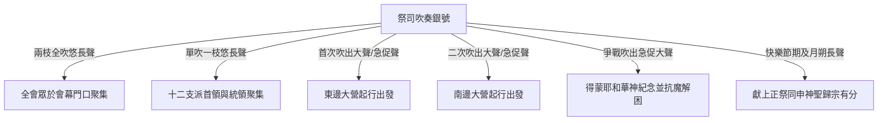
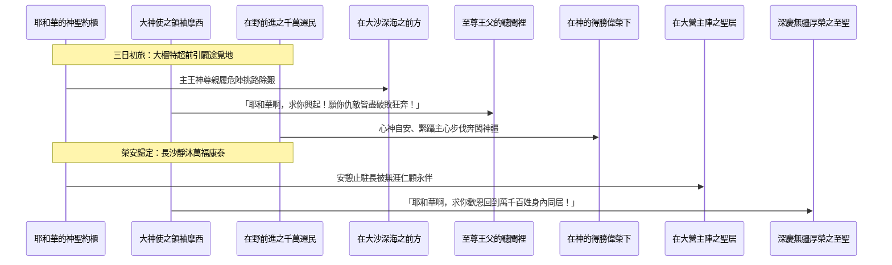

# 民數記 第10章

1. 耶和華曉諭摩西說：
2. 你要用銀子做[[銀號|兩枝號]]，都要錘出來的，用以招聚會眾，並叫眾營[[拔營起行|起行]]。
3. 吹這[[銀號|號]]的時候，全會眾要到你那裡，聚集在[[會幕（帳幕整體）|會幕]]門口。
4. 若單吹一枝，眾首領，就是以色列軍中的統領，要聚集到你那裡。
5. 吹出大聲的時候，東邊安的營都要[[拔營起行|起行]]。
6. 二次吹出大聲的時候，南邊安的營都要[[拔營起行|起行]]。他們將起行，必吹出大聲。
7. 但招聚會眾的時候，你們要吹[[銀號|號]]，卻不要吹出大聲。
8. 亞倫子孫作祭司的要吹這[[銀號|號]]；這要作你們世世代代永遠的定例。
9. 你們在自己的地，與欺壓你們的敵人打仗，就要用[[銀號|號]]吹出大聲，便在耶和華─你們的神面前得蒙紀念，也蒙拯救脫離仇敵。
10. 在你們快樂的日子和節期，並月朔，獻[[燔祭（olah）|燔祭]]和[[平安祭（shelamim）|平安祭]]，也要吹[[銀號|號]]，這都要在你們的神面前作為紀念。我是耶和華─你們的神。
11. 第二年二月二十日，[[雲彩（anan）|雲彩]]從[[法櫃的帳幕]]收上去。
12. 以色列人就按站[[拔營起行|往前行]]，離開[[西乃的曠野]]，[[雲彩（anan）|雲彩]]停住在[[巴蘭的曠野]]。
13. 這是他們照耶和華藉摩西所吩咐的，初次[[拔營起行|往前行]]。
14. 按著軍隊首先[[拔營起行|往前行]]的是猶大營的纛。統領軍隊的是亞米拿達的兒子拿順。
15. 統領以薩迦支派軍隊的是蘇押的兒子拿坦業。
16. 統領西布倫支派軍隊的是希倫的兒子以利押。
17. [[會幕（帳幕整體）|帳幕]]拆卸，[[革順子孫|革順的子孫]]和[[米拉利子孫|米拉利的子孫]]就抬著帳幕先[[拔營起行|往前行]]。
18. 按著軍隊[[拔營起行|往前行]]的是流便營的纛。統領軍隊的是示丟珥的兒子以利蓿。
19. 統領西緬支派軍隊的是蘇利沙代的兒子示路蔑。
20. 統領迦得支派軍隊的是丟珥的兒子以利雅薩。
21. [[哥轄子孫|哥轄人]]抬著聖物先[[拔營起行|往前行]]。他們未到以前，抬[[會幕（帳幕整體）|帳幕]]的已經把帳幕支好。
22. 按著軍隊[[拔營起行|往前行]]的是以法蓮營的纛，統領軍隊的是亞米忽的兒子以利沙瑪。
23. 統領瑪拿西支派軍隊的是比大蓿的兒子迦瑪列。
24. 統領便雅憫支派軍隊的是基多尼的兒子亞比但。
25. 在諸營末後的是但營的纛，按著軍隊[[拔營起行|往前行]]。統領軍隊的是亞米沙代的兒子亞希以謝。
26. 統領亞設支派軍隊的是俄蘭的兒子帕結。
27. 統領拿弗他利支派軍隊的是以南的兒子亞希拉。
28. 以色列人按著軍隊[[拔營起行|往前行]]，就是這樣。
29. 摩西對他岳父（或作：內兄）─[[何巴|米甸人流珥的兒子何巴]]─說：我們要[[拔營起行|行路]]，往耶和華所應許之地去；他曾說：我要將這地賜給你們。現在求你和我們同去，我們必厚待你，因為耶和華指著以色列人已經應許給好處。
30. [[何巴]]回答說：我不去；我要回本地本族那裡去。
31. 摩西說：求你不要離開我們；因為你知道我們要在曠野安營，你可以當作我們的眼目。
32. 你若和我們同去，將來耶和華有什麼好處待我們，我們也必以什麼好處待你。
33. 以色列人離開耶和華的山，[[拔營起行|往前行]]了三天的路程；[[約櫃|耶和華的約櫃]]在前頭行了三天的路程，為他們尋找安歇的地方。
34. 他們拔營[[拔營起行|往前行]]，日間有耶和華的[[雲彩（anan）|雲彩]]在他們以上。
35. [[約櫃]][[拔營起行|往前行]]的時候，摩西就說：耶和華啊，求你興起！願你的仇敵四散！願恨你的人從你面前逃跑！
36. [[約櫃]]停住的時候，他就說：耶和華啊，求你回到以色列的千萬人中！

<!-- fhl-map-links:start -->
## 相關地圖

- [[appendix/fhl_maps/maps/019|〈出圖二〉以色列人出埃及到西乃山]]
- [[appendix/fhl_maps/maps/020|〈民圖一〉從西乃山到加低斯]]
- [[appendix/fhl_maps/maps/024|〈民圖五〉出埃及和進迦南的旅程]]
- [[appendix/fhl_maps/maps/025|〈申圖一〉應許之地全圖]]
<!-- fhl-map-links:end -->

---

## 本章知識節點

### 文化
- [[銀號]]

### 主題
- [[會幕（帳幕整體）]]
- [[約櫃]]

### 原文
- [[燔祭（olah）]]
- [[平安祭（shelamim）]]
- [[雲彩（anan）]]

### 地點
- [[法櫃的帳幕]]
- [[西乃的曠野]]
- [[巴蘭的曠野]]

### 歷史
- [[拔營起行]]

### 人物
- [[革順子孫]]
- [[米拉利子孫]]
- [[哥轄子孫]]
- [[何巴]]

### 解經爭議
- [[流珥葉忒羅與何巴的稱謂關係]]

### 神學
- [[約櫃前行與停住的宣告]]

---

## 本章整理

### 銀號的定例與神聖啟導（v1-10）
在西乃山下，耶和華曉諭摩西一項至關重要的行軍與敬拜指引，要求他用純銀製作兩枝 [[銀號]]。根據經文記載，這兩枝號並非分段鎔鑄，而是都要「錘出來的」，此製作工藝與純淨程度展示了神聖器物的絕對一致性與精煉性質。在用途方面，號的聲響被設定為神對其子民的傳達訊號，廣泛應用於招聚全會眾、單獨召集首領、導引眾營拔營往前行、在本土與敵交戰時呼求，以及於聖日時奉獻各種祭祀作為歡欣表白與在神面前的紀念。

針對製作銀號的深意，各家解經賦予了豐富且深刻的闡解。在靈意涵義上，CT 援引黃迦勒的講論指出：「銀子在聖經裡表徵救贖；號用來傳達行軍號令；錘出來表示整體的材質沒有摻雜，是純銀作的，金燈台也是錘出來的；銀號表徵宣告救贖，錘表徵經過十字架的壓榨。」這顯示神以救贖為基石，發聲召聚散漫的百姓成為有組織的信仰共同體。CT 在「話中之光」篇章中更深刻闡述：「銀子是救贖的表號，用銀子錘出來的號筒，說明瞭主忍受十字架的苦難而完成的救贖。吹號來招聚和指揮前行，除了當時的實際用途以外，也表明了救恩在人身上的功用。」這兩隻號僅交由亞倫子孫的祭司吹奏，更是永遠不廢的定例。如 GT 釋講，銀號的直管約四十五毫米長，其聲宣揚並非是為了人為樂事，而是因為「把吹角的事分別為聖了，這號聲代替神威嚴的聲音，引導著以色列的行軍」。當會眾聽到長聲與急促之聲，即必須如一身耳順從遵令而聚合於 [[會幕（帳幕整體）|會幕]] 門口或起程，這徹底操練了選民的側耳靈敏與順任意志。

特別之處在於，在全會眾享歡過節之時，吹號同樣被廣為使用。正如 CT 說明，在慶樂歲時、月朔與既定年慶大禮期間，選民呈獻各種大喜敬奉，不論是徹底獻盡的 [[燔祭（olah）|燔祭]]，還是歡享盟好長居的 [[平安祭（shelamim）|平安祭]]，隨之而起的宏烈聖響都成了神得重宣顧惜此民不二的主權背書。CT 於註解節期敬拜時深透指明：「救贖使神宣告說，『我是耶和華你們的神。』神成了人的神，這就是大喜樂的根源，人與神恢復和好，這就是最大的祝福。」藉此定規，耶和華申告一切動靜都要以祂不變的真誠顧護與神聖救贖作唯一基礎。

| 信號或節期場合 | 吹法與節奏特徵 | 軍事與禮儀行動要求 | 靈學寓意與註釋見解 |
| :--- | :--- | :--- | :--- |
| **兩枝齊吹長聲** | 悠長沉穩呼號 | 全國人眾咸奔至會幕門口集隊 | 彰顯天上主王恩榮普招全家同處聽信 |
| **單吹一枝長聲** | 單管長悠傳呼 | 十二軍統及首領與眾代表聚首 | 表白中樞策劃統御要命下達奉派而揚 |
| **急促大聲起營** | 快短連綿聲揚 | 按既定大旗方列依東及南起去 | 折射出全地雄兵隨軍元帥依令勇進而為 |
| **敵境禦患呼聲** | 急起震慍吹鼓 | 戰況方堅乞求至聖庇衛大勝 | 仰恃長榮聖主憶憫奇祐拯救免淪寇困 |
| **節假歡愉常音** | 清揚喜樂奏呼 | 會眾奉牲崇賀仰仰感頌聖恩 | 象徵喜安長樂與父神互享永久靈交歡愛 |

### 初次拔營起行與行軍部署（v11-28）
在出埃及後的第二年二月二十日，這一具備重要里程碑的時辰來臨。以色列眾多子民自出埃及的奇蹟勝利、至奔駐停泊十一多個月之長的聖山下，全面領受了一套空前詳明的法規約禮與軍情劃定；當至高的聖榮引領之象自主壇頂收轉升騰，全體便展開其真正意義的歷史奇途——「第二年二月二十日，雲彩從法櫃的帳幕收上去。以色列人就按站往前行，離開西乃的曠野，雲彩停住在巴蘭的曠野。」（民十11-12）。此次離卻往日定址而初度正式展開浩蕩的 [[拔營起行]]，其軍力方格完全彰顯著極致的威神定見與絕美秩序。此時聖民所朝向之地，便是充滿嚴格考驗與歷程淬鍊的廣大領域：[[巴蘭的曠野]]。

在這個具有莊重意義的龐大長縱武裝編陣與行進行程當中，以色列眾旗統領及會幕神職肩隊相互鑲嵌、和契無悖。猶大強隊一馬當先，由前路披斬萬患；待強兵開創暢塗後，主理神堂宏件的搬隊與聖潔禮器穿行其中，形成了萬民敬守聖禮的榮耀方陣。神學作家群咸以高度推崇評宣這一行進方格的核心要意，CT 直言：「我們要留意的是，不管隊形如何變動，神的聖物包括約櫃在內，始終是在隊形的正中間。讚美神，這是可喜樂的大事，因為神的心意就是喜歡祂自己常在人的中間。」這向全世展演著一場極其榮貴的信仰奇蹟：即聖神權柄並未被拋懸空虛之際，而是確切居住並行走在大海狂砂的子民方塊身側。無論紮營休致或是起錨出征，唯獨祂才是百姓一動一靜所倚附依望的核心主殿。

| 行軍序號與分組陣營 | 支派或神職部伍名稱 | 領軍族長或分工專責 | 陣容布局之戰術與敬拜功能 |
| :--- | :--- | :--- | :--- |
| **第一大隊（先鋒）** | 猶大、以薩迦、西布倫 | 拿順、拿坦業、以利押 | 東面旗主率先開闢大疆衝出浩瀚狂流 |
| **會幕基礎運件兵組** | [[革順子孫]]、[[米拉利子孫]] | 負責大門板幕與座栓搬負 | 搶在聖物臨前便火速將行在幕宇建好至妥 |
| **第二大隊（右翼）** | 流便、西緬、迦得 | 以利蓿、示路蔑、以利雅薩 | 南邊軍統繼起強勁後勁撐衛中隊與前道 |
| **聖潔器具行駕護陣** | [[哥轄子孫]] | 尊載全幕最高神對象器重物 | 秉揚聖靈居眾人核心行遍黃沙永護不改 |
| **第三大隊（後翼）** | 以法蓮、瑪拿西、便雅憫 | 以利沙瑪、迦瑪列、亞比但 | 西邊兄弟接踵壯行固挺主軸防守 |
| **第四大隊（殿後）** | 但、亞設、拿弗他利 | 亞希以謝、帕結、亞希拉 | 北方勇士最後殿禦掩護收括眾行旅全陣 |

值得一書者在於那高升庇蔭的大神表樣。正如 GT 一致洞幽點解：引導曠野這無盡茫路的唯賴父神權能聖顯的象徵，也就是在當天上引騰收放自如的神之 [[雲彩（anan）|雲彩]]。這榮光不但並未如常雲浮動毫無方向，更明確從至聖大院之上、那是長留法誓的中心處所得意揚走——正如聖文所銘，這是一場自神居聖宅 [[法櫃的帳幕]] 所揭牌發放的大帶領；眾民毫無擅肆自主的前言，悉聽雲騰號吹之向度而依站安行。CT 針對這一深切信靠與引導關係，在靈訓要義與解註中多次強調：「跟隨雲彩安營；雲彩表徵聖靈；神一直藉著人的順服去作成祂榮耀的計畫。」因此，全團隊伍順依主心而走出荒野首步，成為千古所傳承「軍心與靈愛」不二一體的極致範式。

### 摩西力勸何巴同行（v29-32）
在浩瀚曠野即將翻身邁向未知波濤之時，這段曠古行蹤也穿插了另一場人性熱望與神聖邀請相輝織的精妙對談：摩西懇邀米甸賢要高人、對沙漠乾路有真情體會的 [[何巴]] 一同結伴登途。在經文陳述之際，我們瞥見聖書稱讚道：「摩西對他岳父（或作：內兄）米甸人流珥的兒子何巴說：我們要行路，往耶和華所應許之地去；他曾說：我要將這地賜給你們。現在求你和我們同去，我們必厚待你，因為耶和華指著以色列人已經應許給好處。」這場至誠的交涉在初期遭到何巴退辭求息的答對，其明志想要返回那自己熟悉的家國故業歸老；然而，摩西絲毫不言放棄，反更熱切力持懇願：「求你不要離開我們；因為你知道我們要在曠野安營，你可以當作我們的眼目。」

> [!quote] 黃迦勒對福音呼召的解講引讀
> 「摩西對何巴的話，可視為對不信的福音朋友說的話，有四點值得我們信徒學習：(1)口裡承認自己是行走天路的信徒；(2)得著了神寶貴的應許；(3)邀請對方一同前往；(4)必能同得屬天的好處。何巴的拒絕，可視作福音朋友最初的反應，雖然口硬但卻心軟。何巴後來還是同去，得了無窮豐滿的回報。」

在這段彌足珍貴的交談記事中，也圍繞出幾層深致且耐尋思的研說空間。其中一個即是世人習言討論的 [[流珥葉忒羅與何巴的稱謂關係]]。如 CT 及精讀文鑑詳申：「這裡說他是摩西的內兄，但別處聖經說他是摩西的岳父，究竟是內兄或是岳父，令人困惑。原來希伯來文的岳父和內兄是同一個字，故何巴仍宜解作內兄。」至於此請求本身所展露的心情，不同學者亦各呈高妙看法。部分評釋甚至針尖相面而對：一者謂摩西此言顯明其偶陷微小的依物與對前途浩闊信心稍欠（「摩西請求岳父同行，好作眼目，表示他的信心不足」，參 CT）；然而相反的一端——如 GT（以及啟導本與精讀本系列註釋）——則指出此乃主恩待並普救天涯豪傑、且悅順其運用在地睿識來豐沃眾志的絕妙安排！「你若和我們同去，將來耶和華有什麼好處待我們，我們也必以什麼好處待你」，這強韌的善情至深展現出，真正神僕願將屬天的應許同心奔與他人共享的高華襟度。

### 約櫃前引與勝敵自安的至聖禱辭（v33-36）
在初次揚揚發跡、走開老遠何烈舊居而浩邁挺行的始途中，這壯志難言的篇幅於結章更是翻出空前崇奇的啟蒙強音。根據常態行車秩序，聖物器具本應嚴規隨居大隊腹中，受萬將四顧迴抱而定安；但在這次最初誓發、往長大荒野披斬試金石的三日進程內，象徵最高王靈尊容無邊的 [[約櫃]] 居然不同慣性而改移於眾人前端開陣！「以色列人離開耶和華的山，往前行了三天的路程；耶和華的約櫃在前頭行了三天的路程，為他們尋找安歇的地方。」（民十33）。這顯示出一道凌越萬古的神恩神學主意：非是孱弱子民憑靠自己血肉身軀盲闖沙陣去為神爭地，而是至神大主化為威榮元帥、親駕大聖寶駕赴往兇厄疆隅，為心軟體劣的會民劈道踏穴、遍討平安康泰可久依之宿！

因此，這引導絕不是只徒遺空文形式。在天天拔營破霧之日中，不僅上騰一片慈愛巨被：「日間有耶和華的雲彩在他們以上」；就在王靈震震動止之即，摩西更懷發不凡激越勇誠大聲讚叫——這就是震鑠聖靈全書名冊的一大祈呼高音：[[約櫃前行與停住的宣告]]！當大聖寶居拔地衝征時，摩西大振言吼：「耶和華啊，求你興起！願你的仇敵四散！願恨你的人從你面前逃跑！」；待神榮安宿歸隱之那瞬，他更是安祥慰歌：「耶和華啊，求你回到以色列的千萬人中！」

針對這曠野最為壯絕之呼叫，《基督徒文摘》及諸大家咸譽斯辭乃極純的信心禱聲：CT 點出「這裡將神與神的子民合而為一，以色列人的仇敵就是神地仇敵，恨以色列人的人就是恨神的人，故從你面前逃跑也就是從以色列人面前逃跑。」CT 同意並深層闡揚：「約櫃在前頭行，尋找安歇之處；三天表徵死而復活；起行時求神興起驅逐仇敵，表徵靠神爭戰；安營時求神同在，表徵靠神生活。」

### 跨章脈絡與預表整理：從靜態立約到動態信心的天路實踐
縱觀整個民數記第十章與既往出埃及記至利未記、暨本冊前半頁長卷之傳承交互關係，本節事實上成了貫切整本舊約甚至新約行軍啟蒙的一道終極關隘轉承站！在此之前的漫長一整年，色列選人深埋沉浸一如受護嬰孩，在西乃山岳靜觀天光轟耀、聽奉千萬善美純一的典制常規；那是一系列處一室不動而承受真法「靜態立約」的大段黃金培育時節。然而，正由本章起處、銀號清徹穿響的片時起：聖民神殿便宣告不再久戀舒適故里！所有前所訓示的金條嚴規，悉要搖身翻做狂沙長飆裡面斤斤計較的「動態天路實踐」！

正如 CT 及多位註釋神人語帶感慨稱道：「神以雲柱在他們的前面引導，一切順從指揮，有條不紊；新約說神不是紛亂的神！基督徒有秩序的生活是很要緊的。」這漫向巴蘭大荒之進軍，實質正是全本靈文預言基督聖軍要披一身世苦、依奉至善榮主所施永救聖印往前浩然挺發之巨大寫作：銀子救恩為根，錘打歷磨為身，吹音靈呼為方，萬聖方殿同心共護一神王居核心！那自願放棄歸土回族舊業的米甸良賢，亦與眾多散處海外仍感聖召投心大隊之恩客長響共震；最終在那誓要驅魔開途的勇壯聖禱呼號之中，百姓不僅是在行走於滾滾乾漠的物質途上，更是永世向著那位早為人跨越死殤、勝歸三夜長冥而尋賜最終永久安泰良土的基督得勝之路上，穩篤喜安的闊駕前程。

**參考資料**
https://www.ccbiblestudy.org/Old%20Testament/04Num/04CT10.htm
https://www.ccbiblestudy.org/Old%20Testament/04Num/04GT10.htm
https://www.kingcomments.com/en/bible-studies/Num/10
https://biblehub.com/study/numbers/10.htm
