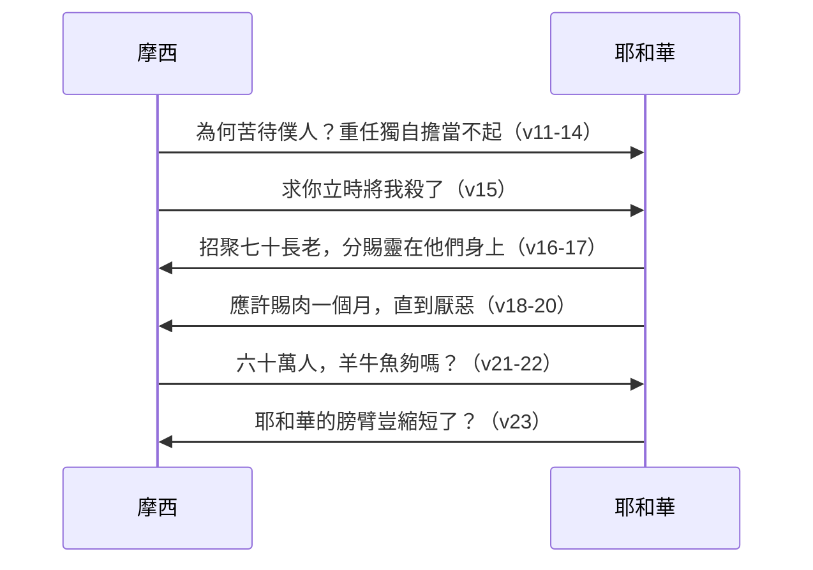

# 民數記 第11章

1. 眾百姓[[怨言（mitlonen）|發怨言]]，他們的[[怨言（mitlonen）|惡語]]達到耶和華的耳中。耶和華聽見了就怒氣發作，使火在他們中間焚燒，直燒到營的邊界。
2. 百姓向摩西哀求，摩西祈求耶和華，[[摩西代禱熄滅神怒（詩106：23）|火就熄了]]。
3. 那地方便叫做[[他備拉]]，因為耶和華的火燒在他們中間。
4. 他們中間的[[百姓貪慾要吃肉（貪慾事件）|閒雜人]][[貪慾（ta'avah）|大起貪慾的心]]；以色列人又哭號說：誰給我們肉吃呢？
5. 我們記得，在埃及的時候不花錢就吃魚，也記得有黃瓜、西瓜、韮菜、葱、蒜。
6. 現在我們的心血枯竭了，除這[[百姓厭棄嗎哪（約6：31-35）|嗎哪]]以外，在我們眼前並沒有別的東西。
7. （這[[百姓厭棄嗎哪（約6：31-35）|嗎哪]]彷彿芫荽子，又好像珍珠。
8. 百姓周圍行走，把[[百姓厭棄嗎哪（約6：31-35）|嗎哪]]收起來，或用磨推，或用臼搗，煮在鍋中，又做成餅，滋味好像新油。
9. 夜間露水降在營中，[[百姓厭棄嗎哪（約6：31-35）|嗎哪]]也隨著降下。）
10. 摩西聽見百姓各在各家的帳棚門口哭號。耶和華的怒氣便大發作，摩西就不喜悅。
11. 摩西對耶和華說：你為何苦待僕人？我為何不在你眼前蒙恩，竟把這管理百姓的重任加在我身上呢？
12. 這百姓豈是我懷的胎，豈是我生下來的呢？你竟對我說：把他們抱在懷裡，如養育之父抱吃奶的孩子，直抱到你起誓應許給他們祖宗的地去。
13. 我從哪裡得肉給這百姓吃呢？他們都向我哭號說：你給我們肉吃吧！
14. 管理這百姓的責任太重了，我獨自擔當不起。
15. 你這樣待我，我若在你眼前蒙恩，求你[[摩西求死|立時將我殺了]]，[[摩西求死|不叫我見自己的苦情]]。
16. 耶和華對摩西說：你從以色列的長老中招聚七十個人，就是你所知道作百姓的長老和官長的，到我這裡來，領他們到會幕前，使他們和你一同站立。
17. 我要在那裡降臨，與你說話，也要把降於你身上的靈分賜他們，他們就和你同當這管百姓的重任，免得你獨自擔當。
18. 又要對百姓說：你們應當自潔，預備明天吃肉，因為你們哭號說：誰給我們肉吃！我們在埃及很好。這聲音達到了耶和華的耳中，所以他必給你們肉吃。
19. 你們不止吃一天、兩天、五天、十天、二十天，
20. 要[[神給肉吃一個月是恩典還是審判|吃一個整月]]，甚至肉從你們鼻孔裡噴出來，[[神給肉吃一個月是恩典還是審判|使你們厭惡了]]，因為你們厭棄住在你們中間的耶和華，在他面前哭號說：我們[[百姓拒絕耶和華|為何出了埃及]]呢！
21. 摩西對耶和華說：這與我同住的百姓、步行的男人有六十萬，你還說：我要把肉給他們，使他們可以[[神給肉吃一個月是恩典還是審判|吃一個整月]]。
22. 難道給他們宰了羊群牛群，或是把海中所有的魚都聚了來，就夠他們吃嗎？
23. 耶和華對摩西說：耶和華的膀臂豈是縮短了嗎？現在要看我的話向你應驗不應驗。
24. 摩西出去，將耶和華的話告訴百姓，又招聚百姓的長老中七十個人來，使他們站在會幕的四圍。
25. 耶和華在雲中降臨，對摩西說話，把降與他身上的靈分賜那[[七十長老受靈|七十個長老]]。靈停在他們身上的時候，他們就受感說話，以後卻沒有再說。
26. 但有兩個人仍在營裡，一個名叫伊利達，一個名叫米達。他們本是在那些被錄的人中，卻沒有到會幕那裡去。靈停在他們身上，他們就在營裡說預言。
27. 有個少年人跑來告訴摩西說：伊利達、米達在營裡說預言。
28. [[約書亞|摩西的幫手]]，[[約書亞|嫩的兒子約書亞]]，就是摩西所揀選的一個人，說：[[約書亞請禁伊利達、米達說預言是否嫉妒|請我主摩西禁止他們]]。
29. 摩西對他說：[[約書亞請禁伊利達、米達說預言是否嫉妒|你為我的緣故嫉妒人嗎]]？惟願耶和華的百姓都受感說話！願耶和華把他的靈降在他們身上！
30. 於是，摩西和以色列的長老都回到營裡去。
31. 有風從耶和華那裡颳起，把鵪鶉由海面颳來，飛散在營邊和營的四圍；這邊約有一天的路程，那邊約有一天的路程，[[風颳鵪鶉（風颳鵪鶉）|離地面約有二肘]]。
32. 百姓起來，終日終夜，並次日一整天，捕取鵪鶉；至少的也取了[[賀梅珥（homer）|十賀梅珥]]，為自己擺列在營的四圍。
33. 肉在他們牙齒之間尚未嚼爛，耶和華的怒氣就向他們發作，用最重的災殃擊殺了他們。
34. 那地方便叫做[[基博羅哈他瓦]]（就是[[基博羅哈他瓦|貪慾之人的墳墓]]），因為他們在那裡葬埋那起貪慾之心的人。
35. 百姓從[[基博羅哈他瓦]]走到[[哈洗錄]]，就[[哈洗錄|住在哈洗錄]]。

<!-- fhl-map-links:start -->
## 相關地圖

- [[appendix/fhl_maps/maps/020|〈民圖一〉從西乃山到加低斯]]
- [[appendix/fhl_maps/maps/024|〈民圖五〉出埃及和進迦南的旅程]]
<!-- fhl-map-links:end -->

---

## 本章知識節點

### 神學
- [[神的怒氣與審判]]
- [[摩西的代禱與代求]]
- [[聖靈分賜七十長老]]
- [[百姓拒絕耶和華]]
- [[基督作中保（來7：25）]]
- [[聖靈分賜預表五旬節（徒2：1-4）]]
- [[火燒營邊預表神審判（來12：29）]]
- [[百姓厭棄嗎哪（約6：31-35）]]

### 人物
- [[約書亞]]
- [[伊利達]]
- [[米達]]

### 地名
- [[他備拉]]
- [[基博羅哈他瓦]]
- [[哈洗錄]]

### 事件
- [[怨言（mitlonen）]]
- [[貪慾（ta'avah）]]
- [[鵪鶉（selav）]]
- [[摩西求死]]
- [[七十長老受靈]]
- [[風颳鵪鶉（風颳鵪鶉）]]
- [[百姓貪慾要吃肉（貪慾事件）]]

### 原文術語
- [[賀梅珥（homer）]]
- [[閒雜人是誰（出12：38）]]

### 討論議題
- [[七十長老制度起源]]
- [[七十長老是否包含伊利達、米達]]
- [[約書亞請禁伊利達、米達說預言是否嫉妒]]
- [[神給肉吃一個月是恩典還是審判]]
- [[伊利達、米達在營中說預言（伊利達、米達）]]

---

## 本章整理

### 火燒他備拉：怨言招致審判（v1-3）
以色列人剛離開西乃山三日路程，[[怨言（mitlonen）|怨言]]聲便傳入耶和華耳中。經文未具體記載怨言內容，只說「惡語」，卻足以引發[[神的怒氣與審判|神的怒氣]]——火從耶和華那裡出來，燒毀營邊。百姓向摩西哀求，摩西[[摩西的代禱與代求|代禱]]，火才熄滅。該地遂名[[他備拉|他備拉]]（意即「燒盡」），成為[[火燒營邊預表神審判（來12：29）|神審判聖潔的預表]]（來 12:29）。這段敘事確立全章基調：百姓的不滿、神的烈怒、領袖的代求，三者交織貫穿始終。

### 閒雜人貪慾、百姓厭棄嗎哪（v4-9）
[[閒雜人是誰（出12：38）|閒雜人]]（出 12:38）率先「大起[[貪慾（ta'avah）|貪慾]]的心」，以色列人隨聲附和，在帳棚門口哭號：「誰給我們肉吃？」他們美化埃及飲食——魚、黃瓜、西瓜、韭菜、蔥、蒜，卻將神每日供應的[[百姓厭棄嗎哪（約6：31-35）|嗎哪]]視為「心血枯竭」的單調食物（v6）。經文特意插入嗎哪的形狀、採集、加工與口感（v7-9），強調神的供應豐富且可變化，百姓的不滿純屬屬靈眼瞎。這段對比為後續[[百姓貪慾要吃肉（貪慾事件）|貪慾事件]]埋下伏筆，也預表約翰福音 6 群眾只求餅餅、拒絕生命糧的光景。

### 摩西求死：領袖的崩潰與誠實（v10-15）
聽見全營哭號，摩西「不喜悅」，更向神傾吐苦水：為何苦待僕人？這百姓豈是我懷的胎？重任獨自擔當不起，寧求神「立時將我殺了」（v15）。這不是信心軟弱的表現，乃是領袖在極限壓力下向神完全敞開的誠實——正如詩篇 106:23 所記，[[摩西代禱熄滅神怒（詩106：23）|摩西站在破口前代求]]，神卻回應以制度性供應而非單靠摩西一人。

### 七十長老受靈：分擔重擔的制度起源（v16-17, 24-25）
神吩咐摩西從長老中選七十人到會幕前，將降於摩西身上的[[聖靈分賜七十長老|靈分賜他們]]，使他們「同當這管百姓的重任」（v17）。這是[[七十長老制度起源|以色列長老制度的正式起點]]，預表新約教會多元恩賜共同牧養（弗 4:11-12），更遠指[[聖靈分賜預表五旬節（徒2：1-4）|五旬節聖靈澆灌全體信徒]]（徒 2:1-4）。靈停在他們身上時「受感說話，以後卻沒有再說」（v25），顯示這是一次性授職標記，而非持續性預言恩賜。此事件確立了[[七十長老受靈|七十長老受靈]]的歷史記載。

### 神應許肉吃一個月：恩典還是審判？（v18-23）
神命百姓自潔，預備吃肉「一個整月，甚至肉從你們鼻孔裡噴出來，使你們厭惡」（v20），因為他們「厭棄住在你們中間的耶和華」（v20），這正是[[百姓拒絕耶和華|百姓拒絕耶和華]]的表現。摩西以六十萬步行男人為由質疑供應可能性（v21-22），神以「耶和華的膀臂豈是縮短了嗎？」（v23）回應。這應許雙重性質明顯：表面滿足慾望，實為[[神給肉吃一個月是恩典還是審判|審判性的飽足]]——讓貪慾者在飽足中見證自己的悖逆與神的大能。

### 伊利達、米達在營中說預言：約書亞的嫉妒與摩西的胸襟（v26-30）
[[伊利達|伊利達]]、[[米達|米達]]雖在錄名單中卻未到會幕，靈仍降在他們身上，在營中說預言。[[約書亞|約書亞]]請摩西禁止，摩西卻說：「你為我的緣故嫉妒人嗎？惟願耶和華的百姓都受感說話！」（v29）這段揭示兩層真理：(1) [[七十長老是否包含伊利達、米達|神的恩賜不受儀式空間限制]]，(2) [[約書亞請禁伊利達、米達說預言是否嫉妒|屬靈領袖當以神榮耀為重，非維護個人權威]]。摩西的胸襟預表[[基督作中保（來7：25）|基督作大祭司的廣大胸懷]]（來 7:25）。這也是[[伊利達、米達在營中說預言（伊利達、米達）|伊利達、米達在營中說預言]]的具體記載。

### 風颳鵪鶉、瘟疫擊殺：基博羅哈他瓦的慘痛教訓（v31-34）
[[風颳鵪鶉（風颳鵪鶉）|風從耶和華颳起]]，將[[鵪鶉（selav）|鵪鶉]]吹至營邊四圍，厚約二肘、廣約一天路程（v31）。百姓貪婪採集，至少也有十[[賀梅珥（homer）|賀梅珥]]（約 2,200 公升），鋪滿營外（v32）。「肉在他們牙齒之間尚未嚼爛」，[[神的怒氣與審判|耶和華的怒氣]]發作，用最重災殃擊殺他們（v33）。該地名[[基博羅哈他瓦|基博羅哈他瓦]]（意即「貪慾之人的墳墓」），永記[[貪慾（ta'avah）|貪慾]]的代價。這審判並非神殘忍，乃是聖潔對悖逆的必然回應，也警戒後世：貪慾是拜偶像（西 3:5）。

### 從基博羅哈他瓦到哈洗錄（v35）
百姓從[[基博羅哈他瓦|基博羅哈他瓦]]起行，來到[[哈洗錄|哈洗錄]]安營。地理移動標記著一段慘痛教訓的結束，也預備下一章米利暗、亞倫毀謗摩西的事件——百姓的怨言未止，領袖的試煉接踵而至。

### 跨章脈絡與神學預表
本章呈現「百姓怨言 → 神審判 → 領袖代求 → 制度建立 → 神供應 → 審判落實」的完整循環。關鍵神學張力在於：神同時是「賜嗎哪的供應者」與「降火燒營的審判者」；摩西同時是「軟弱求死的僕人」與「分享靈恩的中保」。[[七十長老受靈|七十長老受靈]]開啟共同治理模式，[[伊利達|伊利達]]、[[米達|米達]]事件打破空間限制，[[風颳鵪鶉（風颳鵪鶉）|風颳鵪鶉]]展示神對受造界的主權。新約視角下：嗎哪預表基督（[[百姓厭棄嗎哪（約6：31-35）|約 6:31-35]]），聖靈分賜預表五旬節（[[聖靈分賜預表五旬節（徒2：1-4）|徒 2:1-4]]），摩西代求預表基督永遠活著替我們祈求（[[基督作中保（來7：25）|來 7:25]]），貪慾審判警戒教會不可試探主（林前 10:6-11），火燒營邊預表神審判（[[火燒營邊預表神審判（來12：29）|來 12:29]]）。

**參考資料**
https://www.ccbiblestudy.org/Old%20Testament/04Num/04CT11.htm
https://www.ccbiblestudy.org/Old%20Testament/04Num/04GT11.htm
https://www.kingcomments.com/en/bible-studies/Num/11
https://biblehub.com/study/numbers/11.htm
