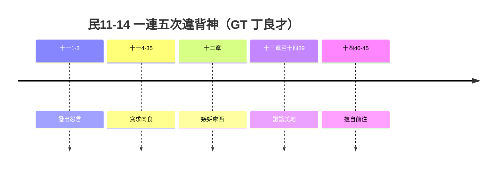
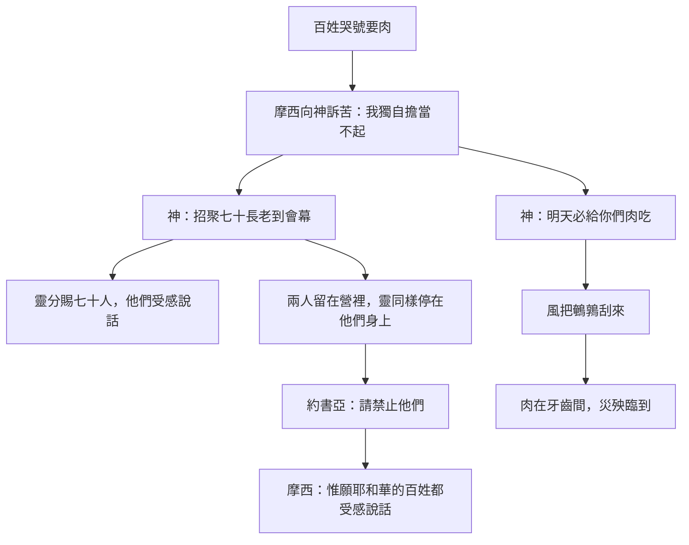

# 民數記 第11章

<!-- chapter-navigation:start -->
| [前一章](../04%20民數記/第10章.md) | [回目錄](../04%20民數記/全書目錄及綱要.md) | [下一章](../04%20民數記/第12章.md) |
| :--- | :---: | ---: |
<!-- chapter-navigation:end -->

1. 眾百姓發怨言，他們的惡語達到耶和華的耳中。耶和華聽見了就怒氣發作，使火在他們中間[[他備拉|焚燒]]，直燒到營的邊界。
2. 百姓向摩西哀求，摩西祈求耶和華，火就熄了。
3. 那地方便叫做[[他備拉]]，因為耶和華的火燒在他們中間。
4. 他們中間的[[閒雜人]]大起貪慾的心；以色列人又哭號說：誰給我們肉吃呢？
5. 我們記得，在埃及的時候不花錢就吃魚，也記得有黃瓜、西瓜、韮菜、葱、蒜。
6. 現在我們的心血枯竭了，除這[[嗎哪]]以外，在我們眼前並沒有別的東西。
7. （這[[嗎哪]]彷彿芫荽子，又好像珍珠。
8. 百姓周圍行走，把[[嗎哪]]收起來，或用磨推，或用臼搗，煮在鍋中，又做成餅，滋味好像新油。
9. 夜間露水降在營中，[[嗎哪]]也隨著降下。）
10. 摩西聽見百姓各在各家的帳棚門口哭號。耶和華的怒氣便大發作，摩西就不喜悅。
11. 摩西對耶和華說：你為何苦待僕人？我為何不在你眼前蒙恩，竟把這管理百姓的重任加在我身上呢？
12. 這百姓豈是我懷的胎，豈是我生下來的呢？你竟對我說：把他們抱在懷裡，如養育之父抱吃奶的孩子，直抱到你起誓應許給他們祖宗的地去。
13. 我從哪裡得肉給這百姓吃呢？他們都向我哭號說：你給我們肉吃吧！
14. 管理這百姓的責任太重了，我獨自擔當不起。
15. 你這樣待我，我若在你眼前蒙恩，求你立時將我殺了，不叫我見自己的苦情。
16. 耶和華對摩西說：你從[[以色列的長老]]中招聚七十個人，就是你所知道作百姓的長老和官長的，到我這裡來，領他們到會幕前，使他們和你一同站立。
17. 我要在那裡降臨，與你說話，也要把降於你身上的[[聖靈|靈]]分賜他們，他們就和你同當這管百姓的重任，免得你獨自擔當。
18. 又要對百姓說：你們應當自潔，預備明天吃肉，因為你們哭號說：誰給我們肉吃！我們在埃及很好。這聲音達到了耶和華的耳中，所以他必給你們肉吃。
19. 你們不止吃一天、兩天、五天、十天、二十天，
20. 要吃一個整月，甚至肉從你們鼻孔裡噴出來，使你們厭惡了，因為你們厭棄住在你們中間的耶和華，在他面前哭號說：我們為何出了埃及呢！
21. 摩西對耶和華說：這與我同住的百姓、步行的男人有六十萬，你還說：我要把肉給他們，使他們可以吃一個整月。
22. 難道給他們宰了羊群牛群，或是把海中所有的魚都聚了來，就夠他們吃嗎？
23. 耶和華對摩西說：耶和華的膀臂豈是縮短了嗎？現在要看我的話向你應驗不應驗。
24. 摩西出去，將耶和華的話告訴百姓，又招聚百姓的[[以色列的長老|長老]]中七十個人來，使他們站在會幕的四圍。
25. 耶和華在雲中降臨，對摩西說話，把降與他身上的[[聖靈|靈]]分賜那七十個[[以色列的長老|長老]]。靈停在他們身上的時候，他們就受感說話，以後卻沒有再說。
26. 但有兩個人仍在營裡，一個名叫[[伊利達與米達|伊利達]]，一個名叫[[伊利達與米達|米達]]。他們本是在那些被錄的人中，卻沒有到會幕那裡去。[[聖靈|靈]]停在他們身上，他們就在營裡說預言。
27. 有個少年人跑來告訴摩西說：[[伊利達與米達|伊利達]]、[[伊利達與米達|米達]]在營裡說預言。
28. 摩西的幫手，嫩的兒子[[約書亞]]，就是摩西所揀選的一個人，說：請我主摩西禁止他們。
29. 摩西對他說：你為我的緣故嫉妒人嗎？惟願耶和華的百姓都受感說話！願耶和華把他的[[聖靈|靈]]降在他們身上！
30. 於是，摩西和[[以色列的長老]]都回到營裡去。
31. 有風從耶和華那裡颳起，把[[鵪鶉遮營|鵪鶉]]由海面颳來，飛散在營邊和營的四圍；這邊約有一天的路程，那邊約有一天的路程，離地面約有二肘。
32. 百姓起來，終日終夜，並次日一整天，捕取[[鵪鶉遮營|鵪鶉]]；至少的也取了十賀梅珥，為自己擺列在營的四圍。
33. 肉在他們牙齒之間尚未嚼爛，耶和華的怒氣就向他們發作，用最重的災殃擊殺了他們。
34. 那地方便叫做[[基博羅哈他瓦]]（就是貪慾之人的墳墓），因為他們在那裡葬埋那起貪慾之心的人。
35. 百姓從[[基博羅哈他瓦]]走到[[哈洗錄]]，就住在哈洗錄。

---

## 本章知識節點

### 地點
- [[他備拉]]
- [[基博羅哈他瓦]]
- [[哈洗錄]]

### 人物
- [[閒雜人]]
- [[伊利達與米達]]
- [[約書亞]]

### 主題
- [[嗎哪]]
- [[先知]]
- [[以色列人一連五次違背神]]

### 歷史
- [[七十長老制度起源]]
- [[以色列人的怨言]]

### 文化
- [[以色列的長老]]

### 背景
- [[嗎哪的物理特性]]
- [[鵪鶉遷徙]]
- [[古代近東的超脫預言]]

### 事件
- [[鵪鶉遮營]]
- [[耶和華擊打百姓的瘟疫]]

### 神學
- [[摩西的靈命低谷與重擔求死]]
- [[聖靈]]
- [[摩西的代求]]

### 解經爭議
- [[閒雜人是誰（出12：38）]]
- [[他備拉與基博羅哈他瓦是否同一地]]
- [[神賜鵪鶉又降災的因果]]

### 互文
- [[百姓厭棄嗎哪（約6：31-35）|約6：31-35 生命的糧與被厭棄的嗎哪]]
- [[聖靈分賜預表五旬節（徒2：1-4）|徒2：1-4 靈分賜眾人的五旬節]]

---

## 本章整理

### 三天就開始抱怨（v1-3）

以色列人離開西乃的曠野才三天，第一件被記下來的事就是[[以色列人的怨言|發怨言]]。KC 把這個落差說得很清楚：「我們卻聽不見他們有任何喜樂。他們在路上只走了三天，就開始抱怨。」

抱怨的內容經文沒有說。GT《民數記串珠聖經註釋》：「以色列人發怨言的原因，經文並無說明，但很可能與他們初出埃及時的怨言源出一轍──他們缺乏水和食物。」GT 丁良才另提出一個實際的可能：「以色列人住在西奈約有一年的工夫沒有行路，巴蘭曠野的道路比西奈的更加難走，他們或者因此發怨言。」

STEP語言資料顯示這一節的句子結構本身就帶著評價：「發怨言」是 ke./mit.'O.ne.Nim（H596，詞典形 a.nan，詞典義 to complain），Hithpael 分詞前面加了 ke（如同）；「惡語」則是單獨一個字 ra'（H7451B，詞典義 bad: evil）。==字面是「百姓像那些抱怨惡事的人」==——他們並沒有真的遇上什麼災殃，只是表現得像遇上了。KC 引達祕譯本腳註讀的正是這個結構：「他們的舉止像是遇上了什麼災殃的人。」

火燒到「營的邊界」。三家給了三種讀法：CT 說這是「達到閒雜人所住的地方」；GT《民數記串珠聖經註釋》說這「是初步的警告，並不算是嚴重的懲罰，因為火只燒了一些營幕的物件，似乎沒有毀滅生命」；KC 讀成距離——「離神的中心最遠的人，最先落在神懲罰的手下」。

火止住是因為有人代求（見[[摩西的代求]]）。CT 只用一句話收：「由此可知代禱的重要性。」KC 把這件事放大：「幸而百姓中有一位代求者……教會裡人也抱怨、也埋怨眼前的光景，但那藉代求除去惡的幫助在哪裡？」那地就叫[[他備拉]]，意思是燃燒。它到底是不是一個獨立的地方，另有爭議（見[[他備拉與基博羅哈他瓦是否同一地]]）。

### 為肉哭號：記得的與忘記的（v4-9）

第二次抱怨從[[閒雜人]]起頭（他們的身分見[[閒雜人是誰（出12：38）]]），再蔓延到全體。GT《聖經精讀本》：「罪就是這樣具有很強的傳染性，在很短的時間內會把整個群體毀滅。」GT 丁良才用三個比方說同一件事：「一點面酵能發起全團，一枚爛果能帶壞全簍，一個不好的學生能敗壞全校。」

GT 丁良才把百姓這番話裡的問題列成五條，值得整條照錄：

| # | 以色列人的錯誤 | 出處 |
| :--- | :--- | :--- |
| 1 | 單記埃及的食物 | v5 |
| 2 | 不記埃及的苦楚 | v5 |
| 3 | 藐視神所預備的 | v6 |
| 4 | 論理不公 | v7-9 |
| 5 | 捨不得宰殺各人的牛羊 | v4、6，參22 |

第五條最容易被略過：他們並不是真的沒有肉。CT 在〔話中之光〕指出「以色列人還有從埃及帶出來的牲畜，可以宰吃（參22節）」；GT《舊約聖經背景註釋》補上原因：「他們雖有牲口，但卻不願宰殺，免得削減牧群的數目。再者這些肉類是慶典食品，不是他們日常的食物。」他們想吃的是尼羅河的魚——同一份來源說「他們在埃及住在河邊，吃慣了魚類」。

這五條不是孤立的。丁良才在同一段把民11 到民14 讀成一條連續的線（見[[以色列人一連五次違背神]]），本章佔了前兩級。

```mermaid
timeline
    title 民11-14 一連五次違背神（GT 丁良才）
    十一1-3 : 發出怨言
    十一4-35 : 貪求肉食
    十二章 : 嫉妒摩西
    十三章至十四39 : 譭謗美地
    十四40-45 : 擅自前往
```

第7至9節是插敘，客觀描述[[嗎哪]]的樣子與作法（見[[嗎哪的物理特性]]）。GT《民數記串珠聖經註釋》指出這段話「是作者對嗎哪客觀的描述，不屬於以色列人埋怨之言」，用意正是反駁百姓「心血枯竭」的說法——STEP語言資料顯示這個詞是 naf.She./nu（H5315L，詞典義 soul: appetite）配 ye.ve.Shah（H3002，詞典義 dry），字面就是「我們的胃口乾了」。

> [!note] 一個各家讀法相反的細節
> 本章第8節說嗎哪滋味「好像新油」，出16:31 卻說「如同攙蜜的薄餅」。CT 判為不衝突：「兩者的描述並不衝突，只是烹製方法和過程不同，各有千秋」；GT 賈斯樂郝威《聖經難解經文詮釋手冊》命題11 也這樣解——一個是原初的味道，一個是煮過以後的。KC 卻把這個差異當成重點：==「這裡沒有提到『滋味如同攙蜜的薄餅』（出16:31）。」== 在他讀來，甘甜不見了。

百姓對嗎哪的態度，在新約有一個對應的場景（見[[百姓厭棄嗎哪（約6：31-35）]]）。

### 摩西也發怨言（v10-15）

百姓哭號，摩西也垮了。這段話的力度可以量出來——GT 丁良才數過：「『我……我……我』——共有十二個我字」，並直接評語：「摩西幾乎失了盼望，他不喜歡民發怨言，自己卻發怨言。」（見[[摩西的靈命低谷與重擔求死]]）

STEP語言資料顯示第15節那句求死的話，原文是同一個動詞用了兩次：ha.re.Ge./ni（H2026，詞典形 ha.rag，詞典義 to kill，命令式）配 ha.Rog（同一個 H2026，不定詞絕對式），正對得上 CT 所註的「立時…殺了（原文雙同字）」。同節「苦情」是 be./ra.'a.T/i（H7451C，詞典義 distress: harm），與第1節百姓所發的「惡語」ra' 同一字根——==百姓抱怨自己的苦，摩西求神別讓他看見自己的苦，用的是同一個字。==

各家對這段話的評價方向一致，重點不同：

| 來源 | 怎麼看摩西這段話 |
| :--- | :--- |
| CT、GT《啟導本聖經註釋》 | 「不少偉大的聖者，在苦難的時刻，也出現過信心的危機。這見於以利亞、施洗約翰，也見於彼得」 |
| GT 丁良才 | 另舉以利亞（王上十九4-10）與約拿（拿四1-3）為同類 |
| GT《聖經精讀本》 | 「任何了不起的神的工人，都有人性軟弱的一面」 |
| KC | 摩西「忘了照顧肉身、背負百姓本來就不是他的事，而是神的事（出19:4；申1:31）。神也並沒有期待他做這些」 |
| BH | 這段話顯出「即使最忠心的領袖也會被壓垮」 |

神的回應沒有一句責備。GT 丁良才：「耶和華憐恤摩西，並沒有責備他。」CT：「神的恩典是大的，對摩西的懷疑並沒有過深的責備。」

### 七十個人分擔一副擔子（v16-30）

神的答覆是制度性的：招聚七十個[[以色列的長老|長老]]，把降於摩西身上的[[聖靈|靈]]分賜他們（見[[七十長老制度起源]]）。

STEP語言資料在這裡連出一條線：第12節「抱」、第14節「擔當」、第17節「同當」與「獨自擔當」，==全部是同一個動詞 na.sa（H5375H，詞典義 to lift: bear）==；第17節的「重任」則是同根名詞 ma.Sa（H4853A，詞典義 burden）。摩西說「我扛不動」，神的答覆用的正是同一個字：「他們就和你同當……免得你獨自擔當。」

分出去，摩西會不會少掉什麼？KC 用一個比喻回答：「這就像一塊燃燒的木頭。那塊燃燒的木頭若點燃另一塊木頭，它自己的火一點也不會減少，反而使火更大。」STEP語言資料顯示第17、25節「分賜」是 a.tsal（H680），簡要詞典義是 to reserve，本節譯義是 share。

```mermaid
flowchart TD
    A["百姓哭號要肉"] --> B["摩西向神訴苦：我獨自擔當不起"]
    B --> C["神：招聚七十長老到會幕"]
    C --> D["靈分賜七十人，他們受感說話"]
    C --> E["兩人留在營裡，靈同樣停在他們身上"]
    E --> F["約書亞：請禁止他們"]
    F --> G["摩西：惟願耶和華的百姓都受感說話"]
    B --> H["神：明天必給你們肉吃"]
    H --> I["風把鵪鶉刮來"]
    I --> J["肉在牙齒間，災殃臨到"]
```

七十長老受感說話「以後卻沒有再說」。這件事在當時的世界並不陌生（見[[古代近東的超脫預言]]），但它的功能是印證而不是預測——GT 丁良才：「神這一次使他們受感說話，無非是要顯明他們的職分，是神認可的。」

真正的高潮是留在營裡的那兩個人（見[[伊利達與米達]]）。KC 指出他們缺席反而成了證據：「我們可以看見神護理中一個特別的引導，就是這兩個人不在場——因為這樣才顯出驅動這些長老的確實是神的靈，不是摩西給了他們那靈，而是神自己。」[[約書亞]]要摩西禁止他們，摩西的回答成了本章最被引用的一句：「你為我的緣故嫉妒人嗎？惟願耶和華的百姓都受感說話！」

CT 在〔話中之光〕把這句話讀成人格的量度：「如果一個人真正偉大，他盼望人人都與他一樣，甚至要比他強。他因人們有敬虔的心而歡喜，別人有更大的恩賜而高興。」KC 則指出這個心願後來有了下文：它「在約珥那裡成了耶和華的應許：兒女要說預言」（珥2:28-29）——這條線一路接到五旬節（見[[先知]]、[[聖靈分賜預表五旬節（徒2：1-4）]]）。

### 鵪鶉、貪慾與墳墓（v31-35）

神說到做到。風把[[鵪鶉遷徙|鵪鶉]]從海面刮來（見[[鵪鶉遮營]]），數量之大讓摩西先前的懷疑顯得可笑——他曾說「難道給他們宰了羊群牛群，或是把海中所有的魚都聚了來，就夠他們吃嗎？」

| 經文說的 | 各家的換算與說法 |
| :--- | :--- |
| 一天的路程 | CT：折合每天約二十餘公里 |
| 離地面約有二肘 | CT 與 GT《啟導本聖經註釋》：約一公尺；GT《民數記串珠聖經註釋》寫作「九十毫米」 |
| 至少的也取了十賀梅珥 | CT：約二千二百公升；GT《舊約聖經背景註釋》：估計四十或六十蒲式耳 |
| 終日終夜並次日一整天 | CT：共計約三十六小時 |

「離地面約有二肘」是飛在一公尺高，還是堆到一公尺厚？GT《啟導本聖經註釋》兩說並存，並指出後一種讀法比較能解釋一人一天取到十賀梅珥；GT 艾基斯《舊約聖經難題彙編》主張後者，理由是「『地面』之前的前置詞’al應翻譯作『超出』……而不是『上』」。STEP語言資料顯示第31節這個介系詞在本節的譯義正是 above。

災殃隨即臨到（見[[耶和華擊打百姓的瘟疫]]）。STEP語言資料顯示第33節「擊殺」是 va/i.Yakh（H5221，詞典形 na.khah，詞典義 to smite），Hiphil 使役形，主語是耶和華——經文把這件事直接歸給神的作為。至於災殃的實際形式，CT 判「大概是瘟疫」並註「指食物中毒」，GT《舊約聖經背景註釋》從鵪鶉沒有醃過推出同一結論。

那麼神究竟是因為什麼降災（見[[神賜鵪鶉又降災的因果]]）？GT 賈斯樂郝威《聖經難解經文詮釋手冊》命題13 的結論很直接：==「神並非因為百姓吃了鵪鶉而懲罰他們；而是因為百姓貪婪和忘恩的心態。」== CT 在〔話中之光〕給了同一個教訓的另一種說法：「你不要用不滿的態度向神祈求任何事物，或許祂會應允你，但是你要付上很大的代價。」

那地就叫[[基博羅哈他瓦]]，意思是貪欲之人的墳墓。STEP語言資料顯示這個名字是從第4節長出來的：第4節「大起貪欲的心」的第二個字是 ta.'a.Vah（H8378，詞典義 desire），第34節地名的後半正是同一個字；同節「起貪欲之心的人」也是同一個字根（H183，詞典形 a.vah）。==貪慾起於第4節，埋在第34節，用的是同一個字。==

KC 在這裡下了一句話：「他們墓碑上的題字是：『貪慾的百姓』。我們的墓碑上會寫什麼？」百姓從這裡走到[[哈洗錄]]——那正是下一章的場景。

**參考資料**
https://www.ccbiblestudy.org/Old%20Testament/04Num/04CT11.htm
https://www.ccbiblestudy.org/Old%20Testament/04Num/04GT11.htm
https://www.kingcomments.com/en/bible-studies/Num/11
https://biblehub.com/study/numbers/11.htm
https://github.com/STEPBible/STEPBible-Data

<!-- appendix-links:start -->
## 附錄

### 相關地圖
- [[appendix/fhl_maps/maps/020|〈民圖一〉從西乃山到加低斯]]
- [[appendix/fhl_maps/maps/024|〈民圖五〉出埃及和進迦南的旅程]]
<!-- appendix-links:end -->

<!-- chapter-navigation:start -->
| [前一章](../04%20民數記/第10章.md) | [回目錄](../04%20民數記/全書目錄及綱要.md) | [下一章](../04%20民數記/第12章.md) |
| :--- | :---: | ---: |
<!-- chapter-navigation:end -->
