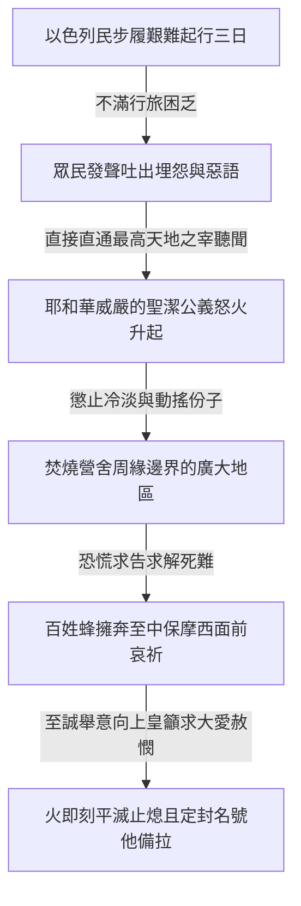
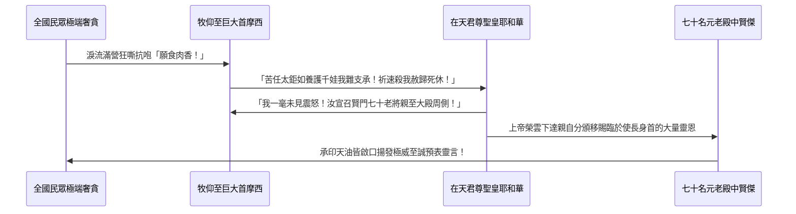

# 民數記 第11章

1. 眾百姓發怨言，他們的惡語達到耶和華的耳中。耶和華聽見了就怒氣發作，使火在他們中間焚燒，直燒到營的邊界。
2. 百姓向摩西哀求，摩西祈求耶和華，火就熄了。
3. 那地方便叫做[[他備拉]]，因為耶和華的火燒在他們中間。
4. 他們中間的[[閒雜人]]大起貪慾的心；以色列人又哭號說：誰給我們肉吃呢？
5. 我們記得，在埃及的時候不花錢就吃魚，也記得有黃瓜、西瓜、韮菜、葱、蒜。
6. 現在我們的心血枯竭了，除這[[嗎哪]]以外，在我們眼前並沒有別的東西。
7. （這[[嗎哪]]彷彿芫荽子，又好像珍珠。
8. 百姓周圍行走，把[[嗎哪]]收起來，或用磨推，或用臼搗，煮在鍋中，又做成餅，滋味好像新油。
9. 夜間露水降在營中，[[嗎哪]]也隨著降下。）
10. 摩西聽見百姓各在各家的帳棚門口哭號。耶和華的怒氣便大發作，摩西就不喜悅。
11. 摩西對耶和華說：你為何苦待僕人？我為何不在你眼前蒙恩，竟把這管理百姓的重任加在我身上呢？
12. 這百姓豈是我懷的胎，豈是我生下來的呢？你竟對我說：把他們抱在懷裡，如養育之父抱吃奶的孩子，直抱到你起誓應許給他們祖宗的地去。
13. 我從哪裡得肉給這百姓吃呢？他們都向我哭號說：你給我們肉吃吧！
14. 管理這百姓的責任太重了，我獨自擔當不起。
15. 你這樣待我，我若在你眼前蒙恩，求你立時將我殺了，不叫我見自己的苦情。
16. 耶和華對摩西說：你從[[以色列的長老]]中招聚七十個人，就是你所知道作百姓的長老和官長的，到我這裡來，領他們到會幕前，使他們和你一同站立。
17. 我要在那裡降臨，與你說話，也要把降於你身上的[[聖靈|靈]]分賜他們，他們就和你同當這管百姓的重任，免得你獨自擔當。
18. 又要對百姓說：你們應當自潔，預備明天吃肉，因為你們哭號說：誰給我們肉吃！我們在埃及很好。這聲音達到了耶和華的耳中，所以他必給你們肉吃。
19. 你們不止吃一天、兩天、五天、十天、二十天，
20. 要吃一個整月，甚至肉從你們鼻孔裡噴出來，使你們厭惡了，因為你們厭棄住在你們中間的耶和華，在他面前哭號說：我們為何出了埃及呢！
21. 摩西對耶和華說：這與我同住的百姓、步行的男人有六十萬，你還說：我要把肉給他們，使他們可以吃一個整月。
22. 難道給他們宰了羊群牛群，或是把海中所有的魚都聚了來，就夠他們吃嗎？
23. 耶和華對摩西說：耶和華的膀臂豈是縮短了嗎？現在要看我的話向你應驗不應驗。
24. 摩西出去，將耶和華的話告訴百姓，又招聚百姓的[[以色列的長老|長老]]中七十個人來，使他們站在會幕的四圍。
25. 耶和華在雲中降臨，對摩西說話，把降與他身上的[[聖靈|靈]]分賜那七十個[[以色列的長老|長老]]。靈停在他們身上的時候，他們就受感說話，以後卻沒有再說。
26. 但有兩個人仍在營裡，一個名叫[[伊利達與米達|伊利達]]，一個名叫[[伊利達與米達|米達]]。他們本是在那些被錄的人中，卻沒有到會幕那裡去。[[聖靈|靈]]停在他們身上，他們就在營裡說預言。
27. 有個少年人跑來告訴摩西說：[[伊利達與米達|伊利達]]、[[伊利達與米達|米達]]在營裡說預言。
28. 摩西的幫手，嫩的兒子[[約書亞]]，就是摩西所揀選的一個人，說：請我主摩西禁止他們。
29. 摩西對他說：你為我的緣故嫉妒人嗎？惟願耶和華的百姓都受感說話！願耶和華把他的[[聖靈|靈]]降在他們身上！
30. 於是，摩西和[[以色列的長老]]都回到營裡去。
31. 有風從耶和華那裡颳起，把[[鵪鶉遮營|鵪鶉]]由海面颳來，飛散在營邊和營的四圍；這邊約有一天的路程，那邊約有一天的路程，離地面約有二肘。
32. 百姓起來，終日終夜，並次日一整天，捕取[[鵪鶉遮營|鵪鶉]]；至少的也取了十賀梅珥，為自己擺列在營的四圍。
33. 肉在他們牙齒之間尚未嚼爛，耶和華的怒氣就向他們發作，用最重的災殃擊殺了他們。
34. 那地方便叫做[[基博羅哈他瓦]]（就是貪慾之人的墳墓），因為他們在那裡葬埋那起貪慾之心的人。
35. 百姓從[[基博羅哈他瓦]]走到[[哈洗錄]]，就住在哈洗錄。

<!-- fhl-map-links:start -->
## 相關地圖

- [[appendix/fhl_maps/maps/020|〈民圖一〉從西乃山到加低斯]]
- [[appendix/fhl_maps/maps/024|〈民圖五〉出埃及和進迦南的旅程]]
<!-- fhl-map-links:end -->

---

## 本章知識節點

### 地點
- [[他備拉]]
- [[基博羅哈他瓦]]
- [[哈洗錄]]

### 人物
- [[閒雜人]]
- [[伊利達與米達]]
- [[約書亞]]

### 解經爭議
- [[閒雜人是誰（出12：38）]]

### 主題
- [[嗎哪]]

### 背景
- [[嗎哪的物理特性]]
- [[鵪鶉遷徙]]

### 互文
- [[百姓厭棄嗎哪（約6：31-35）]]
- [[聖靈分賜預表五旬節（徒2：1-4）]]

### 神學
- [[摩西的靈命低谷與重擔求死]]
- [[聖靈]]

### 文化
- [[以色列的長老]]

### 歷史
- [[七十長老制度起源]]

### 事件
- [[鵪鶉遮營]]

---

## 本章整理

### 他備拉的大火與埋怨的起端（v1-3）
以色列人在經歷西乃山下漫長約十一個月的聖約培育、領受清晰嚴密的會幕部署與前進定例，並在喜慶揚聲的銀號引導下正式起營前邁後，竟短短於拔營起行三天之內即遭逢信仰心態的新崩跌。民數記第十一章劈頭直言：「眾民發怨言，他們的惡語達到耶和華的耳中。耶和華聽見了就怒氣發作，使火在他們中間焚燒，直燒到營的邊界。」（民十一1）。這種迅速起意反叛的舉止令人驚心，顯示出當部伍正式踏上充滿日照黃沙與肉身疲憊的千重旱厄境況時，選民靈魂深處依然藏伏著未受十字架對付的貪戀頑疾與猜疑毒根。

針對於耶和華嚴格懲處這一次埋怨風浪的深遠涵義，神學界諸名宿悉作極廣重的闡示與省察。CT 徵引黃迦勒大釋指出：「發怨言乃是不知足的表現，發自不信的噁心。主使聖潔公義的火在營的邊界焚燒，乃深刻警告任何長期佇留在全會眾周緣、信仰動盪搖晃與苟且觀望的邊際基督徒。」在審判怒火降臨之死際，平民慌亂不堪退赴摩西面前哀哭懇命，正引顯了中保聖工的不可忽缺；「摩西祈求耶和華，火就熄了」，該地自此即受賜下嚴肅無赦的大封稱：[[他備拉]]（字面寓意正是『猛烈燒灼』與『焚燒』），作永遠震攝後來走在天道者切莫縱容惡語、向天上最高主宰吐逆的歷史碑銘。

```mermaid
flowchart TD
    A["以色列民步履艱難起行三日"] -->|不滿行旅困乏| B["眾民發聲吐出埋怨與惡語"]
    B -->|直接直通最高天地之宰聽聞| C["耶和華威嚴的聖潔公義怒火升起"]
    C -->|懲止冷淡與動搖份子| D["焚燒營舍周緣邊界的廣大地區"]
    D -->|恐慌求告求解死難| E["百姓蜂擁奔至中保摩西面前哀祈"]
    E -->|至誠舉意向上皇籲求大愛赦憫| F["火即刻平滅止熄且定封名號他備拉"]
```

### 閒雜人的貪慾與對天降嗎哪的厭棄（v4-9）
在初歷他備拉劫火甫安餘威之頃，營陣腹中旋即牽翻一波程度慘烈過倍、更具傳染穿透特質的屬靈背叛騷亂。這場空前震災的引發源流清晰定址於隨團居眾裡的少數人：「他們中間的 [[閒雜人]] 大起貪慾的心；以色列人又哭號說：誰給我們肉吃呢？我們記得，在埃及的時候不花錢就吃魚，也記得有黃瓜、西瓜、韮菜、葱、蒜。現在我們的心血枯竭了，除這嗎哪以外，在我們眼前並沒有別的！」（民十一4-6）。此一群體正是經學常論探討的 [[閒雜人是誰（出12：38）|閒雜人身份與解經爭議]]；如 GT《精讀本》與《啟導本》皆同為申論：此輩乃昔年追尋埃及神蹟狂風、攜隨難民大湧出城之外族投靠團體，未有正約信憑根骨，面對長道勞頓即以肉體情慾染惑滲入全隊之思想。

此種情慾沉淪更激起了一項極嚴重、至神莫能饒恕的至深神學反忤：對天天奉降恩供的聖糧 [[嗎哪]] 展開公開惡毒的回絕。「現在我們的心血枯竭了，除這嗎哪以外，在我們眼前並沒有別的！」這樣惡待主王大餽與長久眷守的神意心志，直穿後古貫成 [[百姓厭棄嗎哪（約6：31-35）|約翰福音記載大眾追求腐食而厭離靈命活魚耶穌的深長互文]]。諷刺至極者，正在眾群囂囂唾咒恩糧之時刻，聖籍筆風竟特意抽轉出溫厚靜雅的大量字體，浩長羅列並謳頌 [[嗎哪的物理特性]] 與豐澤工序：「這嗎哪彷彿芫荽子，又好像珍珠... 滋味好像新油；夜間露水降在營中，嗎哪也隨著降下。」（民十一7-9）。這優美插論如 CT 一針見血所題：「神在此精刻描繪嗎哪純皓白瑩、芳郁美潤、入夜攜露長供的光景，就是誓以無誤靈雨的聖貴美福，大力指罪斥折世俗之人心眼全黑與背德不知狂恩！」

| 食物特質與歷史回憶 | 以色列民狂愛之埃及故味 | 天使長飲與父王所施之曠野嗎哪 | 神學對比與生命指歸 |
| :--- | :--- | :--- | :--- |
| **主要食色內容** | 魚、黃瓜、西瓜、韭菜、蔥與大蒜 | 潔白細粒如芫荽子又晶瑩宛如大聖明珠 | 地中肉氣芳菲對面長映天城純光珍愛 |
| **代價與取得淵源** | 號稱毫不破款白吃（實為永受奴鎖血仇） | 天霄入夕攜甘露免費天天傾遍眾民戶外 | 虛幻貪逸掩覆魔牢對等神愛至無極無竭 |
| **口慾香氣體驗** | 極端重烈氣味與強烈口舌肉香辣刺 | 薄碾細烹煮餅品吟好似淳香甘醇之新油 | 敗壞刺激的感官沉溺對上安泰深養之靈油 |
| **生命果效與結緣** | 心沉魔域苦戀塵凡致招絕命天火死禍 | 長扶康體度越沙漠直至升抵定許神邦 | 向魔歸依死墮埋淵與遵道得勝升越樂邦之別 |

### 摩西的崩潰求死與七十長老的制度設立（v10-25）
隨著貪食泣吼漫無拘抑地爆發於家家戶戶大篷門外，不僅是世權父王震赫翻生極怒焰氣，連久居忍辱承領巨任的偉主第一聖僕，也在精神千鈞重沉壓縮前身傾心死！經史忠厚銘寫了這次著名的 [[摩西的靈命低谷與重擔求死|摩西靈命狂洩與痛叫哀卒求絕]] 的空前巨吼：「你為何苦待僕人... 竟把這管理全體民胞萬座千家大罪全扛於身上？... 我獨自單身根本難以肩抱擔載不起！你若是如此苦苦對付你使，若我曾在王眼得絲微小善，真祈望大父快下死命一早把我處棄殺脫，願勿長居看此畢生辱淚！」（民十一11-15）。

在此極致之際，天聖之主不但絲毫不怒打責打僕童此等荒唐失態的大痛怨聲，反在廣大無窮神憫情懷內即行宣布宏圖改造：命令立招 [[以色列的長老|各分邦名望素高之元老與長老]] 中七十名英哲親臨法幕！這正是轟重萬載的 [[七十長老制度起源|七十位聖老同權承牧體制的歷史發跡與王國雛形]]。正如 GT 一同宣白：「上帝未曾呵叱摩西求死之失；神深體憐恤人性之單孤極限；並以驚世妙意開白分眾事奉的新局！」在此制度起端裡，至要關鍵乃在浩大永存的 [[聖靈]] 大作為：「我要在台上降雲共答，同時親自將垂落置貼在他摩西一身頭面上面的厚大靈氣割卸分頒灌賜向彼等眾賢」（民十一17）。這偉聖靈力廣被散注、一遇眾老之身立刻催引出說聲長達的新風，此舉不單成就神家權理自一人轉向靈群團工，更作千百年後古史輝映、極度壯嚴大對稱的 [[聖靈分賜預表五旬節（徒2：1-4）|新約五旬節無上靈風厚灌全民受感榮作天言宣聖美光]]。

```mermaid
sequenceDiagram
    participant 全國民眾極端奢貪
    participant 牧仰至巨大首摩西
    participant 在天君尊聖皇耶和華
    participant 七十名元老殿中賢傑
    
    全國民眾極端奢貪->>牧仰至巨大首摩西: 淚流滿營狂嘶抗咆「願食肉香！」
    牧仰至巨大首摩西->>在天君尊聖皇耶和華: 「苦任太鉅如養護千娃我難支承！祈速殺我赦歸死休！」
    在天君尊聖皇耶和華->>牧仰至巨大首摩西: 「我一毫未見震怒！汝宣召賢門七十老將親至大殿周側！」
    在天君尊聖皇耶和華->>七十名元老殿中賢傑: 上帝榮雲下達親自分頒移賜臨於使長身首的大量靈恩
    七十名元老殿中賢傑->>全國民眾極端奢貪: 承印天油皆啟口揚發極威至誠預表靈言！
```

### 營中受靈預言與鵪鶉災殃中的地獄葬地（v26-35）
就當眾老奔會幕受灌受證同時，歷史留駐了一場突破封裝框架的靈力破疆美傳：即是著名的 [[伊利達與米達|伊利達與米達留置帳舍亦享聖顯受感唱言]] 大蹟。此兩哲名正處受錄榜單卻未前抵神堂門坎，依然與廟側列儒全等得享那無所不到、自在奔流的聖神厚注大功而縱歌作歌！這場震悚大業甚至激得忠勇青年大使、即彼副帥親佐 [[約書亞]] 心懷急怒而奔告尊長祈求遏殺退停。幸頼摩西展懷一語成真史詩風采：「汝何須為一己官權衛道致生恨心？惟冀耶和華的千萬兒女人人全受靈恩廣濟普歌說話！」此真如 GT（參考《丁道爾舊約聖經註釋》及《中文聖經註釋》）咸道引述：「約書亞擔憂的是制度體統與單一權威之被毀，但摩西卻以超逸胸臆體宣：天上榮能永無侷囿受囚在磚石宇殿，上帝靈愛之自由穿騰永遠是無可抗禦之絕對王威！」

然而，跟隨著恩膏大發的同夕，主給貪肉苦民的嚴辭賜報亦以天震無倫之勢來襲：「看我的話向你應驗不應驗！... 有風自殿際奔越揭來，引驅海潮大浪送吹那漫世充地的 [[鵪鶉遷徙|龐巨候飛鵪鶉徙族大臨]]！」（民十一31）。隨即迎臨的一場驚絕大劫即是浩浩血風浩劫的 [[鵪鶉遮營]]——鳥飛充滿四面圍野「一晝悠長、層厚兩肘！」平眾昏昧忘餐捕獵累積十多賀梅珥，誰料此番喜滿至狂正如經記沉重反噬：「肉在他們齒間無及全細嚼爛，主的赤猛威討立至引擊致生大殃死萬千眾！」斯野因此哀染萬里血冤慘絕之墳，永久冠下痛稱：[[基博羅哈他瓦]]（實釋正是『貪慾深林之墳葬』）；殘兵悲慟垂淚離行再出、方遷宿息於名藏安好守牆護顧神院寓名的長寧綠址 [[哈洗錄]] 中。

> [!quote] 《基督徒文摘》(CT) 對貪慾苦禍之警覺訓詰
> 「求肉得肉、飽至噴鼻，卻成了惹召天怒禍敗死亡的無盡葬場；這教導所有走在浩渺沙程的信眾莫忘了：上帝縱肯放任許諾世慾妄言的肆行狂願，所給所成終究多變成吞噬身骸靈血與長垂地獄沉冤的『貪慾之塚』！永遠要以父心隨日降予之清純恩食為足。」

### 跨章脈絡與預表整理：從曠野貪戀與神僕重擔看恩典深處的引導
貫通民數記第十一章至出埃及以來長遠路徑與將至無極往來世年，本節史詩實質成了一座劃度人類墮性與天國治約之關鍵雙重映界碑。一方面，他備拉烈火衝霄與基博羅哈他瓦遍野死墳交鎖雙映，痛徹解構了人世憑仗血氣心神去面對沙漠大路考驗時必然沉墜的滅局——若是輕看天天露下純皓靈食、貪返魔俗鮮肉血蔥，結局只能落得災難重重；正如 BH 匯評明示，這不是一時情緒妄怒，乃為永存之君對違畔天約者公義至剛的定罪必至。

但在另一個廣博深潭裡面，本章的極難跌沒卻離奇釣揚出王帝絕宏無限之神聖慈慰：在一己聖領摩西耗盡生機泣陳渴死崩殘之即，公義神恩竟絕不落火落雷，反而俯聽虛苦心誠、化哭嚎為神旨改制宏開之壯碩大端。從極微殘身中誕生了分頒無限靈智之公會領袖體統；由少數滯居帳角未赴神林老儒胸膛內，放綻成沖碎人造威權金框的普遍恩賜狂歌；乃至終站牽引百折大創殘軀投奔神宅護牆的哈洗錄綠野，均一箭橫貫指向基督恩救的博遠終極。信仰的曠原戰役必難忘免貪血妄想磨煉與重荷肩折；但藉著代懇神父主中保垂死之交托，我們定在那不受圍堵的聖靈分頒恩油帶引底下，勝離一眾罪辱老葬墳場，步登那永遠榮靜穩貼的天宅恩門長歌有份。

**參考資料**
https://www.ccbiblestudy.org/Old%20Testament/04Num/04CT11.htm
https://www.ccbiblestudy.org/Old%20Testament/04Num/04GT11.htm
https://www.kingcomments.com/en/bible-studies/Num/11
https://biblehub.com/study/numbers/11.htm
