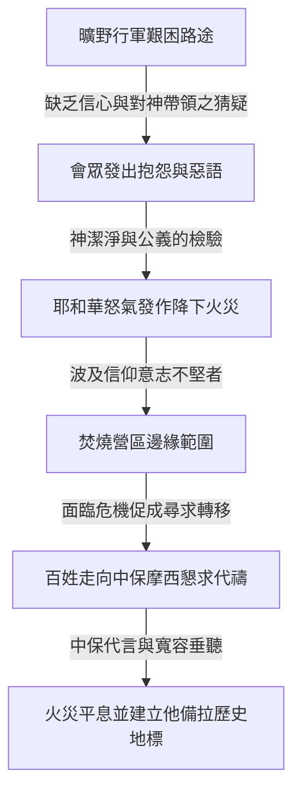
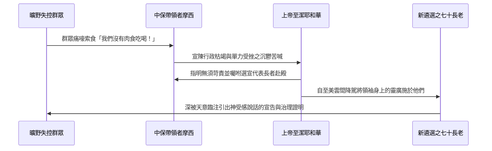

# 民數記 第11章

1. 眾百姓發怨言，他們的惡語達到耶和華的耳中。耶和華聽見了就怒氣發作，使火在他們中間焚燒，直燒到營的邊界。
2. 百姓向摩西哀求，摩西祈求耶和華，火就熄了。
3. 那地方便叫做[[他備拉]]，因為耶和華的火燒在他們中間。
4. 他們中間的[[閒雜人]]大起貪慾的心；以色列人又哭號說：誰給我們肉吃呢？
5. 我們記得，在埃及的時候不花錢就吃魚，也記得有黃瓜、西瓜、韮菜、葱、蒜。
6. 現在我們的心血枯竭了，除這[[嗎哪]]以外，在我們眼前並沒有別的東西。
7. （這[[嗎哪]]彷彿芫荽子，又好像珍珠。
8. 百姓周圍行走，把[[嗎哪]]收起來，或用磨推，或用臼搗，煮在鍋中，又做成餅，滋味好像新油。
9. 夜間露水降在營中，[[嗎哪]]也隨著降下。）
10. 摩西聽見百姓各在各家的帳棚門口哭號。耶和華的怒氣便大發作，摩西就不喜悅。
11. 摩西對耶和華說：你為何苦待僕人？我為何不在你眼前蒙恩，竟把這管理百姓的重任加在我身上呢？
12. 這百姓豈是我懷的胎，豈是我生下來的呢？你竟對我說：把他們抱在懷裡，如養育之父抱吃奶的孩子，直抱到你起誓應許給他們祖宗的地去。
13. 我從哪裡得肉給這百姓吃呢？他們都向我哭號說：你給我們肉吃吧！
14. 管理這百姓的責任太重了，我獨自擔當不起。
15. 你這樣待我，我若在你眼前蒙恩，求你立時將我殺了，不叫我見自己的苦情。
16. 耶和華對摩西說：你從[[以色列的長老]]中招聚七十個人，就是你所知道作百姓的長老和官長的，到我這裡來，領他們到會幕前，使他們和你一同站立。
17. 我要在那裡降臨，與你說話，也要把降於你身上的[[聖靈|靈]]分賜他們，他們就和你同當這管百姓的重任，免得你獨自擔當。
18. 又要對百姓說：你們應當自潔，預備明天吃肉，因為你們哭號說：誰給我們肉吃！我們在埃及很好。這聲音達到了耶和華的耳中，所以他必給你們肉吃。
19. 你們不止吃一天、兩天、五天、十天、二十天，
20. 要吃一個整月，甚至肉從你們鼻孔裡噴出來，使你們厭惡了，因為你們厭棄住在你們中間的耶和華，在他面前哭號說：我們為何出了埃及呢！
21. 摩西對耶和華說：這與我同住的百姓、步行的男人有六十萬，你還說：我要把肉給他們，使他們可以吃一個整月。
22. 難道給他們宰了羊群牛群，或是把海中所有的魚都聚了來，就夠他們吃嗎？
23. 耶和華對摩西說：耶和華的膀臂豈是縮短了嗎？現在要看我的話向你應驗不應驗。
24. 摩西出去，將耶和華的話告訴百姓，又招聚百姓的[[以色列的長老|長老]]中七十個人來，使他們站在會幕的四圍。
25. 耶和華在雲中降臨，對摩西說話，把降與他身上的[[聖靈|靈]]分賜那七十個[[以色列的長老|長老]]。靈停在他們身上的時候，他們就受感說話，以後卻沒有再說。
26. 但有兩個人仍在營裡，一個名叫[[伊利達與米達|伊利達]]，一個名叫[[伊利達與米達|米達]]。他們本是在那些被錄的人中，卻沒有到會幕那裡去。[[聖靈|靈]]停在他們身上，他們就在營裡說預言。
27. 有個少年人跑來告訴摩西說：[[伊利達與米達|伊利達]]、[[伊利達與米達|米達]]在營裡說預言。
28. 摩西的幫手，嫩的兒子[[約書亞]]，就是摩西所揀選的一個人，說：請我主摩西禁止他們。
29. 摩西對他說：你為我的緣故嫉妒人嗎？惟願耶和華的百姓都受感說話！願耶和華把他的[[聖靈|靈]]降在他們身上！
30. 於是，摩西和[[以色列的長老]]都回到營裡去。
31. 有風從耶和華那裡颳起，把[[鵪鶉遮營|鵪鶉]]由海面颳來，飛散在營邊和營的四圍；這邊約有一天的路程，那邊約有一天的路程，離地面約有二肘。
32. 百姓起來，終日終夜，並次日一整天，捕取[[鵪鶉遮營|鵪鶉]]；至少的也取了十賀梅珥，為自己擺列在營的四圍。
33. 肉在他們牙齒之間尚未嚼爛，耶和華的怒氣就向他們發作，用最重的災殃擊殺了他們。
34. 那地方便叫做[[基博羅哈他瓦]]（就是貪慾之人的墳墓），因為他們在那裡葬埋那起貪慾之心的人。
35. 百姓從[[基博羅哈他瓦]]走到[[哈洗錄]]，就住在哈洗錄。

---

## 本章知識節點

### 地點
- [[他備拉]]
- [[基博羅哈他瓦]]
- [[哈洗錄]]

### 人物
- [[閒雜人]]
- [[伊利達與米達]]
- [[約書亞]]

### 解經爭議
- [[閒雜人是誰（出12：38）]]

### 主題
- [[嗎哪]]

### 背景
- [[嗎哪的物理特性]]
- [[鵪鶉遷徙]]

### 互文
- [[百姓厭棄嗎哪（約6：31-35）]]
- [[聖靈分賜預表五旬節（徒2：1-4）]]

### 神學
- [[摩西的靈命低谷與重擔求死]]
- [[聖靈]]

### 文化
- [[以色列的長老]]

### 歷史
- [[七十長老制度起源]]

### 事件
- [[鵪鶉遮營]]

---

## 本章整理

### 他備拉的抱怨與神的審判（v1-3）
以色列人在經過西乃山下近一年的聖約教化、領受完備的會幕組織與祭祀條例之後，在銀號的引導下正式起營邁向應許之地。然而，隊伍在拔營的三天行程中便再次暴露出信仰與心理的不穩定性。民數記第11章1節指出：「眾民發怨言，他們的惡語達到耶和華的耳中。耶和華聽見了就怒氣發作，使火在他們中間焚燒，直燒到營的邊界。」此事顯示，即使領受了詳細的信仰律法與結構安排，當面臨旅程實質的勞頓與匱乏時，缺乏靈敏信心的群體依然容易陷入埋怨的心態。

針對這場發生於邊界的審判之火，研經學者（CT；GT）重申，怨言在本質上並非純粹的客觀困境陳述，而是對神帶領意志的猜疑與否定。「營的邊界」一詞常被註釋家賦予象徵意涵，解讀為群體中靈命鬆散、處於跟從邊緣與態度搖擺不定的信徒易遭遇試探之地。當大禍臨頭時，百姓隨即向領袖摩西呼求，引出了聖經歷史中領袖中保事工的極大重要性。藉由摩西向耶和華祈求，火即熄滅；這地因而命名為 [[他備拉]]（字面意為「焚燒」），為神聖主權對埋怨行為的管教，以及對代求呼籲的回應設立了具體標誌。

```mermaid
flowchart TD
    A["曠野行軍艱困路途"] -->|缺乏信心與對神帶領之猜疑| B["會眾發出抱怨與惡語"]
    B -->|神潔淨與公義的檢驗| C["耶和華怒氣發作降下火災"]
    C -->|波及信仰意志不堅者| D["焚燒營區邊緣範圍"]
    D -->|面臨危機促成尋求轉移| E["百姓走向中保摩西懇求代禱"]
    E -->|中保代言與寬容垂聽| F["火災平息並建立他備拉歷史地標"]
```

### 閒雜人的貪慾與嗎哪的物理特性對比（v4-9）
繼他備拉事件之後，營陣之中再度引發結構性的投訴事件，此次焦點明確繫於對飲食供應的要求及其衍生的大量怨怒。起因是由群體內部的 [[閒雜人]]「大起貪慾的心」，進而使以色列人的情緒被擴散渲染：「誰給我們肉吃呢？我們記得，在埃及的時候不花錢就吃魚，也記得有黃瓜、西瓜、韮菜、葱、蒜。現在我們的心血枯竭了，除這嗎哪以外，在我們眼前並沒有別的！」（民十一4-6）。此群體身分正是長久討論的 [[閒雜人是誰（出12：38）|閒雜人解經與身分定位]]議題；註疏權威（GT《精讀本》與《啟導本》）推斷，這些隨同出埃及的其他宗親混眾往往保留原本世俗的訴求習慣，在面對艱難行伍時常成為負面情緒與慾念傳染的來源。

此事件同時展示了百姓對於上帝每日定量賜與的聖食 [[嗎哪]] 的嚴重誤判與排斥。「現在我們的心血枯竭了」這番言語，誇大了物理需求的貧瘠，將埃及做奴地沉重的代價遺忘，轉而只計較一時的感官刺激；這為新約記載中信仰對待物慾神蹟的心態，提供了深厚的 [[百姓厭棄嗎哪（約6：31-35）|約 6:31-35 百姓厭言神賜與追求永生食糧之互文導引]]。在此處，聖經文本插足描寫了 [[嗎哪的物理特性]] 與其收穫運用：「這嗎哪彷彿芫荽子，又好像珍珠... 滋味好像新油；夜間露水降在營中，嗎哪也隨著降下。」（民十一7-9），客觀記錄其穩定、甘潤且可多樣調理以獲滿足的心養本色，有效反對了投訴者空無失據的激烈批評。

| 食物屬性與歷史意向 | 埃及記憶中的食客品類 | 曠野營地降落的天授嗎哪 | 神學比較與教義歸結 |
| :--- | :--- | :--- | :--- |
| **主要糧食內容** | 魚、黃瓜、西瓜、韭菜、蔥、蒜 | 細小圓粒如芫荽子、外觀明瑩色如珍珠 | 肉慾重口享受與清邁潔淨培育之反面見狀 |
| **取得代價與環境** | 表象宣稱不需破費（伴同重軛奴僕代價） | 夜晚伴隨露水每日新鮮免費平均灑落於戶 | 魔境捆鎖下虛度口福 vs 自主天佑每日信服 |
| **感官氣味體驗** | 強烈重刺激之辛溫氣息 | 口感平滑，研磨水煮後味均好似醇雅新油 | 感官的激動耽嗜與深遠和諧安居之品讀 |
| **旅途命運推引** | 回念舊地退心欲逃避艱辛行腳 | 支撐曠野進化的實力營養維持至應許領地 | 退走過去腐妄悲穴對映堅心步趨聖殿長榮 |

### 摩西的承重危機與七十長老治理機制的建立（v10-25）
當群眾的悲訴蔓延至千家萬戶帳棚外端、耶和華烈火不滿升張時，肩顧大任的摩西迎來嚴峻的心志考驗與情緒危機。經文細密羅勒這次顯赫的 [[摩西的靈命低谷與重擔求死|摩西身苦壓抑至發求生厭訴的實況]]：「你為何苦待僕人... 竟把這管理全體民胞萬座千家巨擔全置向肩膀？... 我獨身單人實難負載不支！你如如此對付你僕，我若得蒙你眼賞信，祈速即日把我拿殺，使勿長久陷見如此煎迫！」（民十一11-15）。

對比於此極致壓力的情緒告白，上帝的回應全然充滿慈容體寬與積極調整之架構解方；主不僅全然不上責批判其言語過當，反而依心性所苦宣布改革體例：命令集結 [[以色列的長老|以色列部落中備享敬望的長老代表]] 中之七十哲員同臨會幕場側。這項引領古以色列權威分層的大建樹正是名重長史的 [[七十長老制度起源|七十長老體系建構及猶太立法公會雛形]]。正如 GT 彙述：神接納人事奉的精力邊際，不依人意使強扛勞竭，轉而開鑿團隊合治之體；其中要務即仰承那廣發灌賦的 [[聖靈]] 主體作工：「我要在會所降臨講諭，隨即把你一身所攜的靈力分割釋注加佈向他們身上」（民十一17）。這一靈能通融分賦不僅促成團隊治理的力量重啟，更在釋經互文中直透遙應至 [[聖靈分賜預表五旬節（徒2：1-4）|新約時期全會眾被同感一靈引揚宣頌的神恩五旬榮景]]。

```mermaid
sequenceDiagram
    participant 曠野失控群眾
    participant 中保帶領者摩西
    participant 上帝至潔耶和華
    participant 新遴選之七十長老
    
    曠野失控群眾->>中保帶領者摩西: 群眾痛嚎索食「我們沒有肉食吃喝！」
    中保帶領者摩西->>上帝至潔耶和華: 宣陳行政枯竭與單力受挫之沉鬱苦喊
    上帝至潔耶和華->>中保帶領者摩西: 指明無須苛責並囑咐選宣代表長者赴殿
    上帝至潔耶和華->>新遴選之七十長老: 自至美雲間降駕將領袖身上的靈廣施於他們
    新遴選之七十長老->>曠野失控群眾: 深被天意臨注引出神受感說話的宣告與治理證明
```

### 營中受靈預言與鵪鶉災殃中的地獄葬地（v26-35）
當群老赴大壇見證分膏的時刻，文本插敘了一起打破常設地點的聖靈引領紀錄：即為 [[伊利達與米達|伊利達與米達留置帳處亦同等享有恩光說言]] 事件。兩員雖列於正職名單上，因故仍住紮民宅深陣未能走抵中殿，然聖氣依約垂留彼方致生感言；此事令護衛建制倫禮的小將、摩西親身特佐 [[約書亞]] 為防損害統治集權而求急行干涉。然而摩西善對一聲留垂千古見地：「你為我故懷生妒念？實祈期真主天下蒼靈咸承大恩引言成話！」正如 GT 所辨，約書亞所衛者為規條體系的絕對凝聚，摩西卻證宣上帝之靈不為既成宮牆枷困的偉業眼見。

同日隨從著改革共營落地的同時，上主應復貪婪會靈狂願的嚴法審罰更在天平中實現：「且看我話能不能即時現出！... 神激出巨風奔向海洋攜返數量磅礡無盡的 [[鵪鶉遷徙|大批北遷海鳥鵪鶉狂撲地面]]！」（民十一31）。繼此所爆發的一刻就是沉重的 [[鵪鶉遮營]] 歷史——候鳥蔽滿地周營區「一晝夜連走長途、廣高約達二肘！」市民競起抓收致滿帳累積過高；料情正如史證的警訊反轉：「肉猶留齒齦其間未能咬細，主的義勇災怒正朝狂群急至降出瘟變罰撲亡無計眾！」此悲場遂遺稱一座厚沉哀哭的大名錄：[[基博羅哈他瓦]]（字對寓指即是「貪慾之墳」）；在此沉重管裁的收拾事工告解後，眾隊拔向安居靜守意味濃烈的草原居所 [[哈洗錄]] 休氣駐護。

> [!NOTE] 《基督徒文摘》(CT) 與《拾穗》(GT) 對進程轉折的學術共識
> 在求食獲得充分成就背後隱隨致命管誡的故事結構中，顯揚一向長明未消的解經學觀念：上天准從人極盡貪求之奢想所得，並不必然等同祝福加恩，而常是讓人經驗憑藉私慾偏行的沉醉至痛代價；貪慾與抱怨所生長之地總以喪沒受裁為歸宿，天民應在哈洗錄類的靈休過境裡，學習唯讀尊服上帝安詳之長備供食。

### 跨章脈絡與預表整理：從曠野貪戀與神僕重擔看恩典深處的引導
連攜起自西乃山前嚴整陣仗（第10章）至本質人心騷惑的起端（第11章），直至相繼將進之直隸內部與同門的挑剔紛攪（第12章），此段章冊標點出群聚邁入真實爭執旅程上的關鍵分化面。一方面，他備拉烈火警信與基博羅哈他瓦之埋欲墳碑一齊樹立了一組教悔指標：倚仗放蕩世執及肉望懷戀前度埃及恩悅的心緒，必定無法持續在乾苦修途上長青成器；如 BH 學說指明，天庭公義律例絕非片面怒濤，而是引證人必須以信誠仰順取代口腹猜疑。

但在同時，本章跌宕悲情之下反生神慈憐與建制再生的驚喜重造。摩西個人於壓頂崩垂際發越至悲求解，非無取譴痛罵，而轉成拓展為多元領導框架與靈能共融的制度躍進；由孤君的苦荷開起向集體長老七十席團隊事奉的新猷；進而在不受宮陣阻繞、營角兩眾同受神說的開放情懷中，昭示著將來全民皆同沐神聖施惠的終極預期。這指示走於行旅中的信友，雖然隨路常面嗜舊情緒試驗及擔挑磨耗折抑，然而透過坦率信誠懇語向神剖露限制，且願靠賴無限活能與共助團隊同行，必定走越貪欲坑墳，迎升向如同哈洗錄安詳牧護的新步進境。

**參考資料**
https://www.ccbiblestudy.org/Old%20Testament/04Num/04CT11.htm
https://www.ccbiblestudy.org/Old%20Testament/04Num/04GT11.htm
https://www.kingcomments.com/en/bible-studies/Num/11
https://biblehub.com/study/numbers/11.htm

<!-- appendix-links:start -->
## 附錄

### 相關地圖
- [[appendix/fhl_maps/maps/020|〈民圖一〉從西乃山到加低斯]]
- [[appendix/fhl_maps/maps/024|〈民圖五〉出埃及和進迦南的旅程]]
<!-- appendix-links:end -->
