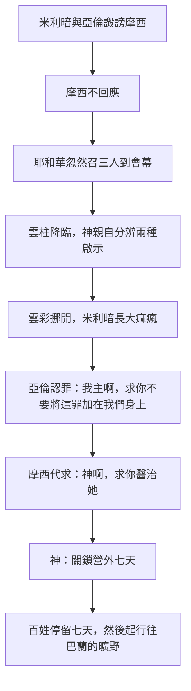

# 民數記 第12章

<!-- chapter-navigation:start -->
| [前一章](../04%20民數記/第11章.md) | [回目錄](../04%20民數記/全書目錄及綱要.md) | [下一章](../04%20民數記/第13章.md) |
| :--- | :---: | ---: |
<!-- chapter-navigation:end -->

1. 摩西娶了[[古實女子]]為妻。[[米利暗]]和[[亞倫]]因他所娶的古實女子就毀謗他，說：
2. 難道耶和華單與摩西說話，不也與我們說話嗎？這話耶和華聽見了。
3. （[[摩西為人極其謙和（民12：3）|摩西為人極其謙和]]，勝過世上的眾人。）
4. 耶和華忽然對摩西、[[亞倫]]、[[米利暗]]說：你們三個人都出來，到會幕這裡。他們三個人就出來了。
5. 耶和華在[[雲柱火柱|雲柱]]中降臨，站在會幕門口，召[[亞倫]]和[[米利暗]]，二人就出來了。
6. 耶和華說：你們且聽我的話：你們中間若有[[先知]]，我─耶和華必在異象中向他顯現，在夢中與他說話。
7. 我的僕人摩西不是這樣；他是[[摩西在神全家盡忠（民12：7）|在我全家盡忠]]的。
8. 我要與他[[神與摩西面對面明說|面對面說話]]，乃是[[神與摩西面對面明說|明說]]，不用謎語，並且他必見我的形像。你們毀謗我的僕人摩西，為何不懼怕呢？
9. 耶和華就向他們二人發怒而去。
10. 雲彩從會幕上挪開了，不料，[[米利暗]]長了[[大痲瘋（sara'at）|大痲瘋]]，
11. 有雪那樣白。[[亞倫]]一看[[米利暗]]長了[[大痲瘋（sara'at）|大痲瘋]]，就對摩西說：我主啊，求你不要因我們愚昧犯罪，便將這罪加在我們身上。
12. 求你不要使他像那出母腹、肉已半爛的死胎。
13. 於是摩西哀求耶和華說：神啊，求你醫治他！
14. 耶和華對摩西說：他父親若吐唾沫在他臉上，他豈不蒙羞七天嗎？現在要把他[[患痲瘋者的哀悼記號（獨居營外）|在營外關鎖七天]]，然後才可以領他進來。
15. 於是[[米利暗]][[患痲瘋者的哀悼記號（獨居營外）|關鎖在營外七天]]。百姓沒有行路，直等到把米利暗領進來。
16. 以後百姓從[[哈洗錄]]起行，在[[巴蘭的曠野]]安營。

---

## 本章知識節點

### 人物
- [[米利暗]]
- [[亞倫]]
- [[古實女子]]

### 主題
- [[先知]]
- [[患痲瘋者的哀悼記號（獨居營外）]]

### 神學
- [[摩西為人極其謙和（民12：3）]]
- [[神與摩西面對面明說]]
- [[摩西的代求]]

### 原文
- [[大痲瘋（sara'at）]]

### 歷史
- [[雲柱火柱]]

### 地點
- [[哈洗錄]]
- [[巴蘭的曠野]]

### 解經爭議
- [[摩西娶古實女子的解經爭議]]
- [[米利暗與亞倫誰是主謀]]
- [[民12：3 這句話是誰寫的]]
- [[大痲瘋是否等同於罪的懲罰之爭]]

### 互文
- [[摩西在神全家盡忠（民12：7）|來3：5-6 僕人與兒子的分別]]

---

## 本章整理

### 兩個人開口，一個人受罰（v1-3）

前兩章的怨言是針對神的供應，本章換了對象。GT《民數記串珠聖經註釋》：「上兩次的埋怨是針對神在物質上的供應，本章記載的另一次埋怨卻針對摩西的權柄；這次較為小規模，只牽涉摩西、亞倫和米利暗三姊弟。但這並不是家庭的小糾紛，而是大祭司和先知向神的中保所發出的挑戰。」CT 說的是同一件事：「[[米利暗]]是女先知，[[亞倫]]是大祭司，他們兩人代表以色列宗教信仰中的兩大力量。」

**表面上的理由是摩西的妻子。** 這位[[古實女子]]是誰、「古實」指哪裡，兩層都有爭議（見[[摩西娶古實女子的解經爭議]]）。但各家一致認為那只是藉口——GT《民數記串珠聖經註釋》：「若單因她是外邦人，便有點強辭奪理了，因為摩西娶妻時神尚未頒下律法聲明不可娶外邦人為妻。無論如何。這只是推翻摩西屬靈權柄的一個藉口，他們真正的動機在2節便暴露無遺了。」CT 在〔話中之光〕把這種手法點得更白：==「人們常常會爭辯細微的分歧，把重大的問題放在一邊……不去正視自己的驕傲與嫉妒，卻批評別人所娶的妻子，借題發揮，這是教會中常見的現象。」==

**KC 讀出的爭點不是婚姻而是恩典**：他們「無法忍受恩典臨到一個外邦人」，並把這種態度接到路加福音二十16 的葡萄園比喻與使徒行傳二十二21-22 猶太人聽保羅講恩典臨到外邦人時的反應。

**兩個人說話，誰在主導？**（見[[米利暗與亞倫誰是主謀]]）GT 丁良才給了兩項證據：「1她的名在先，2神只罰了她。」STEP語言資料提供了第三項：第1節「譭謗」是 va./te.da.Ber（H1696G，詞典形 da.var，詞典義 to speak），==詞形是第三人稱陰性單數==——主詞寫的是兩個人，動詞卻是單數陰性。

第3節插進來一句旁白：「摩西為人極其謙和，勝過世上的眾人。」（見[[摩西為人極其謙和（民12：3）]]）STEP語言資料顯示「謙和」是 a.nav（H6035），簡要詞典義是 poor，正對得上 CT 所註的「卑微的，貧窮的」。這句話是不是摩西自己寫的，是全卷最常被拿來討論的一節（見[[民12：3 這句話是誰寫的]]）。

### 神在會幕門口開庭（v4-9）

第4節的「忽然」有份量。CT：「『忽然』表示出乎他們三人的意料之外。」GT 丁良才給了理由：「因為神發怒，神也要免那叛亂的事蔓延在百姓中。」

CT 指出這個地點的功能：「『在會幕門口』表示在那裡設立臨時法庭（註：古時人判案是在城門口）。」GT《舊約聖經背景註釋》從周邊文化補一筆：「在迦南文獻中，主神伊勒也是在帳幕居住，並且從帳幕中（這是神明集會之處）頒布旨意和判語。」神在[[雲柱火柱|雲柱]]中降臨（v5），這是本章雲彩的第一個動作。

神的答覆沒有否認米利暗和亞倫也領受啟示，只把兩種啟示分開（見[[神與摩西面對面明說]]）：

| | 一般[[先知]]（v6） | 摩西（v7-8） |
| :--- | :--- | :--- |
| 方式 | 在異象中顯現、在夢中說話 | 面對面說話 |
| 清晰度 | 需要解讀 | 明說，不用謎語 |
| 所見 | —— | 必見耶和華的形像 |
| 身分 | 先知 | 我的僕人，在我全家盡忠 |

「面對面」的原文字面是「嘴對嘴」——GT《聖經精讀本》：「字面上的意思是『嘴對嘴』，是指神與摩西相見的時候並不是通過中間通道，而是象朋友一樣自然對話的意思。」STEP語言資料證實第8節正是 peh 'el- peh（H6310G，詞典義 lip／mouth）。

STEP語言資料另顯示第6與第8節用了一組拼寫極近、編號卻不同的字：==第6節「異象」是 mar.'Ah（H4759A，詞典義 vision），第8節「明說」是 mar.'Eh（H4758，詞典義 appearance）。== CT 給的原文字義正是「異象」景象，鏡子／「明說」眼前看到的。

「見我的形像」不是看見神的本體。GT 丁良才：「神叫摩西所看見的，是照著他所能容受的（出三十三21-23）。摩西卻沒有看見神的本體。」GT《啟導本聖經註釋》：「這當然不是指直接見到神未隱藏的面，而是一種可見的形狀。」

GT《民數記串珠聖經註釋》把這段判詞的要點收得很準：==「米利暗和亞倫所說的並沒有錯，可惜他們沒有分辨出他們得啟示的方法與摩西的有何不同。」== 第7節那句「在我全家盡忠」後來被希伯來書接了過去（見[[摩西在神全家盡忠（民12：7）]]）。

STEP語言資料在這裡連出一條跨章的線：第7節「盡忠」是 ne.'e.Man（H539，詞典形 a.man，詞典義 be faithful）。同一個 H539 在前一章第12節出現過——民11:12 摩西抱怨神要他像「養育之父」（ha./'o.Men）抱著這百姓。==他自稱扛不動的那個角色，神在下一章用同一個字根稱他為忠信的。==

### 大痲瘋、認罪、代求（v10-13）

雲彩的第二個動作是挪開。GT 丁良才特別把它與民9 分開：「在原文上『挪開』兩個字和九17節的『收上去』三個字不同。雲彩收上去，就是以色列人起行的記號；雲彩挪開，就是耶和華發怒的標幟。」STEP語言資料證實第10節用的是 sar（H5493G，詞典形 sur，詞典義 to turn aside: remove）。

米利暗立刻長了[[大痲瘋（sara'at）|大痲瘋]]，「有雪那樣白」。這是全本聖經裡罪與病因果最明確的一次（見[[大痲瘋是否等同於罪的懲罰之爭]]）。GT《舊約聖經背景註釋》從症狀反推它不是今天的痲瘋病：

> 「在古代近東，漢森氏病（現代痲瘋病的名稱）要到亞歷山大大帝時代，才有發生的記錄。本段和舊約其他地方所形容的皮膚病，比較接近牛皮癬或濕疹。第12節將之比作死胎，進一步證實這診斷……夭折胎兒的膚色由紅轉棕灰，接著皮膚開始脫落。」

也就是說，亞倫那句「肉已半爛的死胎」本身就是一條診斷線索。

亞倫的反應很快。GT 丁良才：「這或者是亞倫頭一次遵神論長大麻風者所定的條例（利十三十四章）。米利暗既是他的姐姐，他自己在這事上也有錯，亞倫心裡就必定越發難過。」他改口稱摩西「我主啊」——丁良才：「亞倫這樣稱他的兄弟，顯明他再不敢將自己和摩西列為平等。」GT《聖經精讀本》指出這句話他說過一次：「亞倫在西乃曠野陷在拜金牛犢的罪中時，也是用這樣的話向摩西承認了自己的錯誤（出32:22）。」

摩西這才開口，而且只說了一句：「神啊，求你醫治她！」（見[[摩西的代求]]）GT 丁良才用四個字評語：「摩西以善報惡。」KC 說得更完整：==「我們在這段記載中聽見摩西所說的第一句話，是一位代求者的話。他成了中保。他真正的偉大就在這裡。一點怨恨也看不見。」==

### 七天，全營都不走（v14-16）

神的答覆用了一個家庭裡的例子：「她父親若吐唾沫在她臉上，她豈不蒙羞七天嗎？」STEP語言資料顯示「吐唾沫」在原文是同一個動詞用了兩次——ya.Rok ya.Rak（H3417，詞典形 ya.raq，詞典義 to spit），不定詞絕對式配完成式，正對得上 CT 所註的「吐唾沫（原文雙同字）」。GT 丁良才與 CT 都列出這個動作在舊約的意義（申二十五9；伯三十10；賽五十16；太二十六67），BH 也說在古代近東社會裡「向人臉上吐唾沫是表達嚴重羞辱與棄絕的文化行為」。

米利暗被關鎖在營外七天（見[[患痲瘋者的哀悼記號（獨居營外）]]）。GT 丁良才注意到她受的比條例更重：「長大麻風得潔淨的人，必須在自己的帳棚外暫住幾天（利十四8、10）；但神吩咐米利暗不但要在帳棚外，也要在營外居住七天。」

KC 指出這七天不是因為神還沒赦免：==「認罪之後並沒有立刻的醫治……惡有時嚴重到即使已經赦免，刑罰仍必須執行。當主公開的見證受了損害時，情形就是這樣。」==

代價落在全體。CT 在〔話中之光〕算了這筆帳：「百姓也因她而在原地停留了七天，就是說他們進入應許的行程受阻礙了七天。神的計畫常因人的無知而受耽延，人雖然不能改變神的計畫，但可以阻擋神計畫的完成，造成眾人的難處。」GT 丁良才寫得更聳動：「一人的罪，使二兆多人，受了連累。」KC 從教會的角度說同一件事：「當某種惡公開出來的時候，就沒有力量。」

停留的原因，各家看法略有不同。CT 說是雙重的：「一面是因雲柱沒有升上去，另一面也顯示對她身分的尊敬」；GT《啟導本聖經註釋》只提後者：「米利暗在民中頗有地位，百姓為她的釋放等了七天，沒有上路」；BH 也讀成敬意與群體的整體性。

七天滿了，百姓從[[哈洗錄]]起行，安營在[[巴蘭的曠野]]。CT 由此推斷「哈洗錄仍位於巴蘭的曠野範圍之內」；GT《啟導本聖經註釋》則指出這一站的意義：「巴蘭在迦南最南端，以色列人應該就快進入美地。」下一章的探子就是從這裡出發。

**參考資料**
https://www.ccbiblestudy.org/Old%20Testament/04Num/04CT12.htm
https://www.ccbiblestudy.org/Old%20Testament/04Num/04GT12.htm
https://www.kingcomments.com/en/bible-studies/Num/12
https://biblehub.com/study/numbers/12.htm
https://github.com/STEPBible/STEPBible-Data

<!-- appendix-links:start -->
## 附錄

### 相關地圖
- [[appendix/fhl_maps/maps/020|〈民圖一〉從西乃山到加低斯]]
- [[appendix/fhl_maps/maps/024|〈民圖五〉出埃及和進迦南的旅程]]
<!-- appendix-links:end -->

<!-- chapter-navigation:start -->
| [前一章](../04%20民數記/第11章.md) | [回目錄](../04%20民數記/全書目錄及綱要.md) | [下一章](../04%20民數記/第13章.md) |
| :--- | :---: | ---: |
<!-- chapter-navigation:end -->
