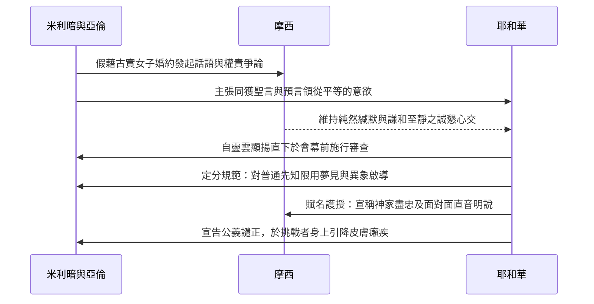

# 民數記 第12章

<!-- chapter-navigation:start -->
| [前一章](第11章.md) | [回目錄](全書目錄及綱要.md) | [下一章](第13章.md) |
| :--- | :---: | ---: |
<!-- chapter-navigation:end -->

1. 摩西娶了[[古實女子]]為妻。[[米利暗]]和亞倫因他所娶的古實女子就毀謗他，說：
2. 難道耶和華單與摩西說話，不也與我們說話嗎？這話耶和華聽見了。
3. （[[摩西為人極其謙和（民12：3）|摩西為人極其謙和]]，勝過世上的眾人。）
4. 耶和華忽然對摩西、亞倫、[[米利暗]]說：你們三個人都出來，到會幕這裡。他們三個人就出來了。
5. 耶和華在雲柱中降臨，站在會幕門口，召亞倫和[[米利暗]]，二人就出來了。
6. 耶和華說：你們且聽我的話：你們中間若有[[先知]]，我─耶和華必在異象中向他顯現，在夢中與他說話。
7. 我的僕人摩西不是這樣；他是[[摩西在神全家盡忠（民12：7）|在我全家盡忠]]的。
8. 我要與他[[神與摩西面對面明說|面對面說話]]，乃是[[神與摩西面對面明說|明說]]，不用謎語，並且他必見我的形像。你們毀謗我的僕人摩西，為何不懼怕呢？
9. 耶和華就向他們二人發怒而去。
10. 雲彩從會幕上挪開了，不料，[[米利暗]]長了[[大痲瘋（tsara'at，皮膚病診斷條例）|大痲瘋]]，
11. 有雪那樣白。亞倫一看[[米利暗]]長了[[大痲瘋（tsara'at，皮膚病診斷條例）|大痲瘋]]，就對摩西說：我主啊，求你不要因我們愚昧犯罪，便將這罪加在我們身上。
12. 求你不要使他像那出母腹、肉已半爛的死胎。
13. 於是摩西哀求耶和華說：神啊，求你醫治他！
14. 耶和華對摩西說：他父親若吐唾沫在他臉上，他豈不蒙羞七天嗎？現在要把他[[患痲瘋者的哀悼記號（獨居營外）|在營外關鎖七天]]，然後才可以領他進來。
15. 於是[[米利暗]][[患痲瘋者的哀悼記號（獨居營外）|關鎖在營外七天]]。百姓沒有行路，直等到把米利暗領進來。
16. 以後百姓從[[哈洗錄]]起行，在[[巴蘭的曠野]]安營。

---

## 本章知識節點

### 人物
- [[米利暗]]
- [[古實女子]]

### 神學
- [[摩西為人極其謙和（民12：3）]]
- [[神與摩西面對面明說]]

### 互文
- [[摩西在神全家盡忠（民12：7）]]

### 主題
- [[先知]]
- [[患痲瘋者的哀悼記號（獨居營外）]]

### 原文
- [[大痲瘋（tsara'at，皮膚病診斷條例）]]

### 解經爭議
- [[摩西娶古實女子的解經爭議]]
- [[大痲瘋是否等同於罪的懲罰之爭]]

### 地點
- [[哈洗錄]]
- [[巴蘭的曠野]]

---

## 本章整理

### 古實女子的指責與宣揚主權的爭訟（v1-3）

民數記第12章記錄了古以色列曠野路程中，引發於最高領袖核心內部的權威分化與倫理重塑過程。事件起端呈現在家族私生活領域與外在信仰傳統的表面交執上：「摩西娶了 [[古實女子]] 為妻；[[米利暗]] 和亞倫因他所娶的古實女子就毀謗他。」（v1）。在此處，文本留下了關於異族新配或續婚淵源的深廣 [[摩西娶古實女子的解經爭議|古實女子出身與動機解經之爭]]。多個解經權威（CT 黃迦勒與 GT《精讀本》、《丁良才註釋》等）剖明：無論這場婚禮是指早期與米甸人西坡拉之結合的延遲挑剔，或者是摩西在漫長沙漠途中與另一非洲出身的非群血親的續定結縭，這一議題本質上是一樁發起的表層藉口；批判者試圖借婚姻破口，挑戰首席代言人靈明授任之至極權益。

深藏的競爭心理於隨後的直言抗告中被證實：「難道耶和華單與摩西說話，不也與我們說話嗎？」（v2）。兩人憑藉著自己在女先知讚主詩舞及祭司宣聖授位上的歷史奉獻，要求分享甚至平等的預言主導權。然而處於此內爭核心，聖經紀錄並未看見任何激烈反制的大聲還駁，僅嵌入一句對信仰品操高度精研的定語：「[[摩西為人極其謙和（民12：3）|摩西為人極其謙和]]，勝過世上的眾人。」（v3）。他的默忍自讓而非強力對決，反映了對世俗言責沉淪的清淨抽離；正是斯人在遭遇手足至親非難時保持不動搖的交付心情，促使其直抵公理主裁判自雲垂見的平權救恩。

> [!NOTE] 批判的動機與宣揚職位的爭訟主幹
> 神學家指出，教會及靈治團隊裡突現之家庭是非與細碎習慣投訴，常遮蓋著結構內部對宣講發語地盤之競爭性意念。人若是憑自身片刻得授之靈覺天性，企圖進犯超越全磐盟約所授定的中心權威，終至招逢自上而臨的大使整頓與靈德反叛判定。

### 會幕顯明與神默示權限的層等差界（v4-8）

當爭議從暗言宣揚至全軍邊地時，上帝立即介入並命令重啓公審定性程序：「耶和華忽然對摩西、亞倫、米利暗說：你們三個人都出來，到會幕裡去！」（v4）。耶和華以顯要莊榮之雲柱直接降抵殿門，單獨將兩位申訴的兄姊喚出行列，頒告了一本對於舊約宣神靈制和權利位階極其精深的系統宣告：將對普般 [[先知]] 使用的異象象徵、夢兆默示之法，區隔於大權受任者的殊絕地界。

神鄭重為其中心使徒作身世之誓證：「我的僕人摩西不是這樣，他是在我全家盡忠的。」（v7）。斯言不僅肯定他身處龐雜的古民家庭組織內部具有堅定的不渝守節與忠順能力，也讓此絕贊譽為後續貫穿千春永祀古義與新約架構、為論述基督主位提供有力佐鑑之 [[摩西在神全家盡忠（民12：7）|「神家盡忠」古典原經基石]]。也為彰賞厥職於重責下的委辦精神，天父破例外釋最崇高的交通法益，便是世上無匹、超越全象徵遮網的 [[神與摩西面對面明說|面對面與明說無隱之天諭密交]]（v8）。沒有難思隱喻的隔絕，也沒有沉默謎詞的困惱，神甚至指證其得見上帝超自然臨降的神恩形像；從而在根本結構上瓦解了次等啟示經驗企圖分據中心天授席位的主任幻想。

### 大痲瘋的懲處與營外關鎖的群體神學（v9-16）

隨著神聖宣明雲霧從會幕殿上抬升收返，對挑動團隊體制大爭的紀律實體審判立刻實顯：「不料，米利暗長了 [[大痲瘋（tsara'at，皮膚病診斷條例）|大痲瘋（tsara'at）]]，有雪那樣白。」（v10）。這種以突發皮膚敗變來展示罪過的具體神蹟，直接成為日後無數經釋經典重反覆覆辯論、致力釐析世人身損罹疫與至頂罰命關係中 [[大痲瘋是否等同於罪的懲罰之爭|大痲瘋病厄與得罪管處是否具直接相關性的極品指引]]。身任頂級大祭司的亞倫頓見胞姊身陷大創與禮儀敗損之窘狀，急轉深懇於摩西腳下自承失禮大愚！

一生備享苛評與冤壓的大僕人摩西於此刻大起悲智、當空對主大呼「神啊，求祢醫治她！」（v13）。對待斯善愛之言，大判高神顯露出威仁並行於一的體系之綱：憐愛祈恩可即獲得平止不延，但在治禮制度中為使教靈久懷不悖，神意援明依家政儀式、即便遭遇凡族親嚴侮唾顏面也應守規之意，吩咐要徹底實行其在 [[患痲瘋者的哀悼記號（獨居營外）|在營外關鎖七天的禮儀法則]]（v14）。米利暗遭受與全大民暫不接觸的單向絕塵處置；引致數百萬旅將毫無急心抱怨與妄馳前攻，全員安心止休原地守候女領導滿堂解圍的復始日安；待經潔贖平安再迎回位，大眾軍才共同拔隊脫離平安沉澱的綠蔭故林 [[哈洗錄]]，意定心平向前闖進前疆關嶺 [[巴蘭的曠野]] 紮屯待命。

| 默示等差與位階體制 | 普通預言傳訊先知 | 極限盟約代言代表摩西 | 基督神授榮美的預表推廣 |
| :--- | :--- | :--- | :--- |
| **靈示體驗與媒介** | 異象投射與夜間夢兆傳遞 | 面對面相通與直接朗言明說 | 本意神言親臨常駐的顯化之道 |
| **在天國中的管掌職階** | 定期分部傳達信息與代禱 | 於神全府家業至信受託宰持 | 身為真誠長子總綰全戶大局 |
| **涉指之互見經文引據** | 創20:7；民12:6 | 民12:7-8；申34:10 | 來3:5-6；約1:18 |
| **遭遇挑戰時的神聖救度** | 憑依先見話柄及自薦分明 | 耶和華顯駕恩雲實行親御見證 | 天父常以終極復活真柄勝卻反倒 |

**參考資料**
https://www.ccbiblestudy.org/Old%20Testament/04Num/04CT12.htm
https://www.ccbiblestudy.org/Old%20Testament/04Num/04GT12.htm
https://www.kingcomments.com/en/bible-studies/Num/12
https://biblehub.com/study/numbers/12.htm

<!-- appendix-links:start -->
## 附錄

### 相關地圖
- [[appendix/fhl_maps/maps/020|〈民圖一〉從西乃山到加低斯]]
- [[appendix/fhl_maps/maps/024|〈民圖五〉出埃及和進迦南的旅程]]
<!-- appendix-links:end -->

<!-- chapter-navigation:start -->
| [前一章](第11章.md) | [回目錄](全書目錄及綱要.md) | [下一章](第13章.md) |
| :--- | :---: | ---: |
<!-- chapter-navigation:end -->
