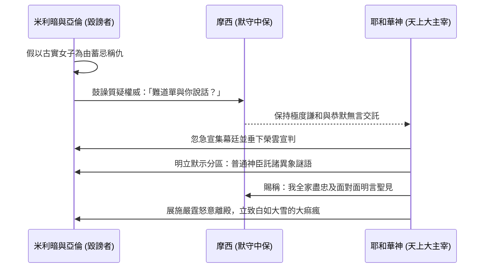

# 民數記 第12章

1. 摩西娶了[[古實女子]]為妻。[[米利暗]]和亞倫因他所娶的古實女子就毀謗他，說：
2. 難道耶和華單與摩西說話，不也與我們說話嗎？這話耶和華聽見了。
3. （[[摩西為人極其謙和（民12：3）|摩西為人極其謙和]]，勝過世上的眾人。）
4. 耶和華忽然對摩西、亞倫、[[米利暗]]說：你們三個人都出來，到會幕這裡。他們三個人就出來了。
5. 耶和華在雲柱中降臨，站在會幕門口，召亞倫和[[米利暗]]，二人就出來了。
6. 耶和華說：你們且聽我的話：你們中間若有[[先知]]，我─耶和華必在異象中向他顯現，在夢中與他說話。
7. 我的僕人摩西不是這樣；他是[[摩西在神全家盡忠（民12：7）|在我全家盡忠]]的。
8. 我要與他[[神與摩西面對面明說|面對面說話]]，乃是[[神與摩西面對面明說|明說]]，不用謎語，並且他必見我的形像。你們毀謗我的僕人摩西，為何不懼怕呢？
9. 耶和華就向他們二人發怒而去。
10. 雲彩從會幕上挪開了，不料，[[米利暗]]長了[[大痲瘋（tsara'at，皮膚病診斷條例）|大痲瘋]]，
11. 有雪那樣白。亞倫一看[[米利暗]]長了[[大痲瘋（tsara'at，皮膚病診斷條例）|大痲瘋]]，就對摩西說：我主啊，求你不要因我們愚昧犯罪，便將這罪加在我們身上。
12. 求你不要使他像那出母腹、肉已半爛的死胎。
13. 於是摩西哀求耶和華說：神啊，求你醫治他！
14. 耶和華對摩西說：他父親若吐唾沫在他臉上，他豈不蒙羞七天嗎？現在要把他[[患痲瘋者的哀悼記號（獨居營外）|在營外關鎖七天]]，然後才可以領他進來。
15. 於是[[米利暗]][[患痲瘋者的哀悼記號（獨居營外）|關鎖在營外七天]]。百姓沒有行路，直等到把米利暗領進來。
16. 以後百姓從[[哈洗錄]]起行，在[[巴蘭的曠野]]安營。

<!-- fhl-map-links:start -->
## 相關地圖

- [[appendix/fhl_maps/maps/020|〈民圖一〉從西乃山到加低斯]]
- [[appendix/fhl_maps/maps/024|〈民圖五〉出埃及和進迦南的旅程]]
<!-- fhl-map-links:end -->

---

## 本章知識節點

### 人物
- [[米利暗]]
- [[古實女子]]

### 神學
- [[摩西為人極其謙和（民12：3）]]
- [[神與摩西面對面明說]]

### 互文
- [[摩西在神全家盡忠（民12：7）]]

### 主題
- [[先知]]
- [[患痲瘋者的哀悼記號（獨居營外）]]

### 原文
- [[大痲瘋（tsara'at，皮膚病診斷條例）]]

### 解經爭議
- [[摩西娶古實女子的解經爭議]]
- [[大痲瘋是否等同於罪的懲罰之爭]]

### 地點
- [[哈洗錄]]
- [[巴蘭的曠野]]

---

## 本章整理

### 古實女子與權柄毀謗的動機（v1-3）

民數記第十二章是古以色列人在曠野旅途中，領導核心爆發嚴重的權威危機與手足背道抗侮的深層歷史記錄。故事的導火線肇始於家庭與婚姻的表層抨擊：「摩西娶了[[古實女子]]為妻；[[米利暗]]和亞倫因他所娶的古實女子就毀謗他。」（v1）。在歷史闡讀上，關於這椿婚約的核心真象激起了深遠的[[摩西娶古實女子的解經爭議|摩西娶古實女子之解經爭議]]；諸釋本如《基督徒文摘》（CT）、《精讀本》與《丁良才註釋》（GT）齊聚揭示，這女子的名號與血統無論是重提昔年米甸沙漠的西坡拉或非洲南方黑種女妾，全數只為表面掩罪之言；兄妹兩人發言批評的心腸，全然是希企搶奪神前先知啟示的主宰領頭名譽。

其野心在次節暴露無遺：「難道耶和華單與摩西說話，不也與我們說話嗎？」他們質疑長子與女仙官地位不次，意圖挑動以全家並權削奪一人默示威儀。然而面對這般源自最密骨肉的利刃中傷，聖經極罕見地留下垂鑑千古的評述：[[摩西為人極其謙和（民12：3）|摩西為人極其謙和]]，超越天上地下的世上眾人。他不出口為自己表白一辭，不動聲言尋求辯護；如此虛心沉服直接動員了萬古王榮親率天上護駕顯面為僕持平。

> [!important] 領導中斷與人性狂妄的本質
> 批評往往不基於所稱的論據本身，而是掩蓋了貪圖威風和妒意騰昇的心態。人以世俗婚配作藉口抗令神職主者，即是挑弄天上至高的選召定令。

### 耶和華在雲彩中宣示密約與默示等級（v4-8）

當人寰中爆發不忠的野望狂奔，大仙全王急疾呼喝：「你們三個人都出來，到會幕這裡！」耶和華親駕宏偉烈焰威雲在神會幕殿門而立，分別召出反抗者施行宣訓與無匹審判。上帝口開金典，將凡聖仙職的層等清白剖立：普通[[先知]]乃由上帝借暗瞑異象、宵夢幻語遙遙示微；惟對忠勇中保是高階殊榮！

上帝親自向世界認領並加讚其使：「我的僕人非同往列；他乃是[[摩西在神全家盡忠（民12：7）|在我全家盡忠]]的偉誠使長。」正因斯人忠勤至上、死守盟誓無二心，主意降致極聖封蔭，即是那垂為奇觀的[[神與摩西面對面明說|神與摩西面對面明說]]：不是曲折謎晦、亦非猜隱含矇，是真切親面明音賜與像觀主君的大福！隨即發雷棒喝反眾：爾等言慢神聖忠執長子，竟為何毫無畏寒神火刑法之道？

### 大痲瘋神刑、懇祈與營外關鎖（v9-16）

當天威雲氣抽揚移世，嚴肅審罰瞬間大降：女領袖米利暗滿皮紅爛化變，白徹若長風積雪般直被[[大痲瘋（tsara'at，皮膚病診斷條例）|大痲瘋]]厲瘟侵蓋身架。這椿以肉身突變直接反諷奢榮反語的大顯神怒，亦成為經注界辯析全靈生死規律中[[大痲瘋是否等同於罪的懲罰之爭|大痲瘋是否等同罪咎苦禍的明鑑]]。亞倫身見親姊肌體寸碎腐殘、勢必堪憐若胎亡腹中半爛臭鬼，驚惶拜僕弟弟前祈放饒休。

曾經蒙枉無數的摩西在此時以「神啊求祢醫治她」之疾絕代禱一聲大徹金壇；天地造化的靈主見僕寬恕，依然堅持公定法度：為嚴訓此慢侮神僕大狂罪行，正如親家父嚴喝唾沫投辱當忍辱七日，女嫌必以重法嚴施[[患痲瘋者的哀悼記號（獨居營外）|在營外關鎖七天]]絕食離居隔離潔盡，方蒙平冤重入大民天軍之門。百萬浩浩浩行車騎悉聽君旨原地沉休，不復起程追向；遲歸醫正得復平，選軍始復發整裝自那片久居休整營所[[哈洗錄]]奔入遼闊大野[[巴蘭的曠野]]沉兵札帳。

| 事件演變 | 涉及人物與權限 | 歷史靈意指歸 |
|----------|----------------|---------------|
| 毀謗興起 | 亞倫與米利暗 vs 摩西 | 以婚配隱私飾遮圖霸神靈代言之驕奢 |
| 神雲審判 | 耶和華面責群黎 | 主定默示高下區隔，神僕於天下家屋盡信奉持 |
| 降災醫休 | 米利暗大罪長患皮瘋 | 神意無容親長縱越，隔離洗贖見恩赦真範 |

**參考資料**
https://www.ccbiblestudy.org/Old%20Testament/04Num/04CT12.htm
https://www.ccbiblestudy.org/Old%20Testament/04Num/04GT12.htm
https://www.kingcomments.com/en/bible-studies/Num/12
https://biblehub.com/study/numbers/12.htm
