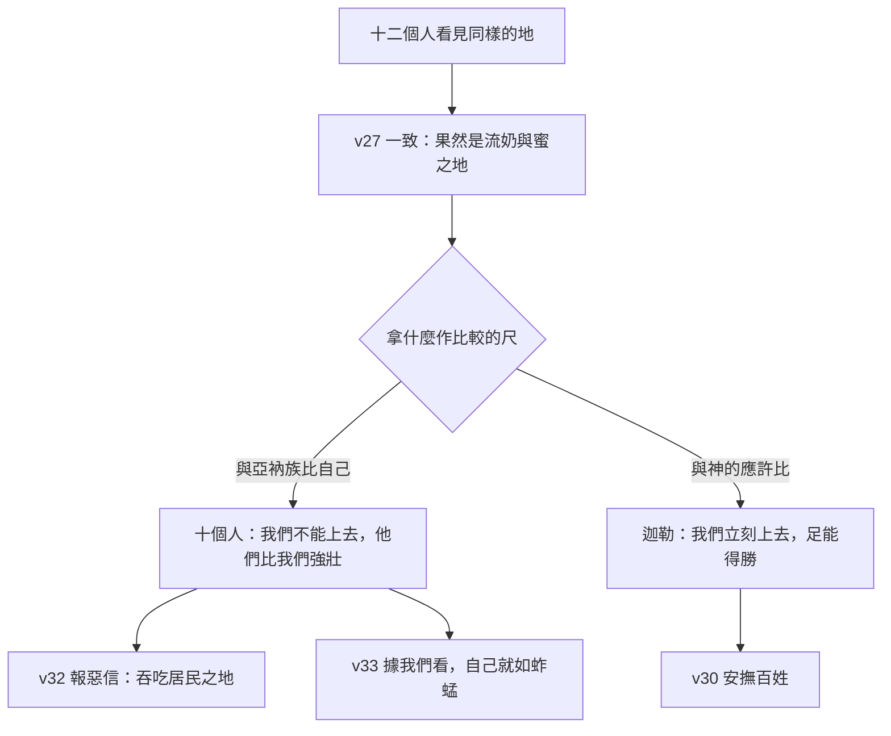

# 民數記 第13章

<!-- chapter-navigation:start -->
| [前一章](../04%20民數記/第12章.md) | [回目錄](../04%20民數記/全書目錄及綱要.md) | [下一章](../04%20民數記/第14章.md) |
| :--- | :---: | ---: |
<!-- chapter-navigation:end -->

1. 耶和華曉諭摩西說：
2. 你打發人去窺探我所賜給以色列人的[[迦南地]]，他們每支派中要打發一個人，都要作首領的。
3. 摩西就照耶和華的吩咐從巴蘭的曠野打發他們去；他們都是以色列人的族長。
4. 他們的名字：屬流便支派的有撒刻的兒子沙母亞。
5. 屬西緬支派的有何利的兒子的沙法。
6. 屬猶大支派的有耶孚尼的兒子[[迦勒]]。
7. 屬以薩迦支派的有約色的兒子以迦。
8. 屬以法蓮支派的有嫩的兒子[[約書亞|何西阿]]。
9. 屬便雅憫支派的有拉孚的兒子帕提。
10. 屬西布倫支派的有梭底的兒子迦疊。
11. 約瑟的子孫，屬瑪拿西支派的有穌西的兒子迦底。
12. 屬但支派的有基瑪利的兒子亞米利。
13. 屬亞設支派的有米[[迦勒]]的兒子西帖。
14. 屬拿弗他利支派的有縛西的兒子拿比。
15. 屬迦得支派的有瑪基的兒子臼利。
16. 這就是摩西所打發、窺探那地之人的名字。摩西就稱嫩的兒子[[約書亞|何西阿]]為[[約書亞]]。
17. 摩西打發他們去窺探[[迦南地]]，說：你們從南地上山地去，
18. 看那地如何，其中所住的民是強是弱，是多是少，
19. 所住之地是好是歹，所住之處是營盤是堅城。
20. 又看那地土是肥美是瘠薄，其中有樹木沒有。你們要放開膽量，把那地的果子帶些來。（那時正是葡萄初熟的時候。）
21. 他們上去窺探那地，從尋的曠野到利合，直到哈馬口。
22. 他們從[[南地與希伯崙|南地]]上去，到了[[南地與希伯崙|希伯崙]]；在那裡有[[亞衲族與偉人拿非林|亞衲族人]]亞希幔、示篩、撻買。（原來希伯崙城被建造比埃及的[[南地與希伯崙|鎖安城]]早七年。）
23. 他們到了[[以實各谷的一掛葡萄|以實各谷]]，從那裡砍了葡萄樹的一枝，上頭有[[以實各谷的一掛葡萄|一掛葡萄]]，兩個人用槓抬著，又帶了些石榴和無花果來。
24. （因為以色列人從那裡砍來的那掛葡萄，所以那地方叫做[[以實各谷的一掛葡萄|以實各谷]]。）
25. 過了四十天，他們窺探那地才回來，
26. 到了巴蘭曠野的加低斯，見摩西、亞倫，並以色列的全會眾，回報摩西、亞倫，並全會眾，又把那地的果子給他們看；
27. 又告訴摩西說：我們到了你所打發我們去的那地，果然是[[流奶與蜜之地]]；這就是那地的果子。
28. 然而住那地的民強壯，城邑也堅固寬大，並且我們在那裡看見了[[亞衲族與偉人拿非林|亞衲族]]的人。
29. 亞瑪力人住在[[南地與希伯崙|南地]]；赫人、耶布斯人、亞摩利人住在山地；迦南人住在海邊並約但河旁。
30. [[迦勒]]在摩西面前安撫百姓，說：我們立刻上去得那地吧！我們足能得勝。
31. 但那些和他同去的人說：我們不能上去攻擊那民，因為他們比我們強壯。
32. 探子中有人論到所窺探之地，向以色列人報惡信，說：我們所窺探、經過之地是吞吃居民之地，我們在那裡所看見的人民都身量高大。
33. 我們在那裡看見[[亞衲族與偉人拿非林|亞衲族人]]，就是[[亞衲族與偉人拿非林|偉人]]；他們是偉人的後裔。據我們看，自己就[[自認如蚱蜢的不信態勢|如蚱蜢一樣]]；據他們看，我們也是如此。

---

## 本章知識節點

### 人物
- [[迦勒]]
- [[約書亞]]

### 事件
- [[十二探子窺探迦南地]]

### 歷史
- [[加低斯巴尼亞事件]]

### 主題
- [[以實各谷的一掛葡萄]]

### 背景
- [[亞衲族與偉人拿非林]]
- [[迦南地的居民分佈]]

### 神學
- [[自認如蚱蜢的不信態勢]]
- [[流奶與蜜之地]]

### 地點
- [[南地與希伯崙]]
- [[迦南地]]

### 原文
- [[四十的屬靈意義]]

### 解經爭議
- [[窺探迦南起因為神命或民意的解經爭議]]
- [[十二探子自巴蘭或加低斯巴尼亞出發之解經爭議]]
- [[何西阿與約書亞改名時機與字意之解經爭議]]
- [[吞吃居民之地是什麼意思]]

---

## 本章整理

### 誰先提議去窺探？（v1-16）

本章開頭是「耶和華曉諭摩西說：你打發人去窺探……」，但申1:22 記的是百姓自己先開口：「我們要先打發人去，為我們窺探那地。」兩處怎麼並存，是本章的第一個問題（見[[窺探迦南起因為神命或民意的解經爭議]]）。

四份來源的次序判斷一致：人先提、神後准。分歧在「神為什麼准」。GT 丁良才讀成任憑：「本節顯明神也任憑他們隨著自己的意思而行。」CT 讀成試驗：「表面上，神允准百姓所提出的要求，實際上，神是藉此行動以顯明人的存心所在，是憑眼見，或是憑信心。」GT《啟導本聖經註釋》讀成寬容：「這件事再次看見神對人不信的寬容與慈愛。」CT 在〔話中之光〕也不從責備切入：「神並沒有責備這些信心軟弱的人，為了他們信心的成長命令摩西差遣探子。」KC 用另一件事作類比：「這就像在以色列立王一樣。耶和華吩咐撒母耳立一個王，但那是因為百姓要一個王。」而 GT《民數記串珠聖經註釋》乾脆不從人的軟弱切入：==「與敵方開戰前，先偵探敵方的情報是智慧之舉，所以神也以此為美事。」==

[[十二探子窺探迦南地|這十二個人]]不是民1、民2、民7 那批首領。GT《民數記串珠聖經註釋》推測原因：前面幾章負責統計與獻禮的「是一些年長德高望重的領袖」，本章選派作探子的「則是一些年輕有為的青年領袖」。名單裡沒有利未人——GT 丁良才：「利未支派也不在其中，因為他們將來不分地。」十二個名字裡，後來還被提起的只有兩個。

名單結尾插了一句改名：「摩西就稱嫩的兒子何西阿為[[約書亞]]。」但出17:9 早就用了新名，這個時間差另有爭議（見[[何西阿與約書亞改名時機與字意之解經爭議]]）。

### 摩西交代的任務（v17-20）

摩西的問題很具體，可以列成一張表：

| 要看什麼 | 摩西的問法 | 節次 |
| :--- | :--- | :--- |
| 人 | 所住的民是強是弱，是多是少 | v18 |
| 地 | 所住之地是好是歹 | v19 |
| 防務 | 所住之處是營盤是堅城 | v19 |
| 土壤 | 那地土是肥美是瘠薄 | v20 |
| 植被 | 其中有樹木沒有 | v20 |
| 帶回 | 把那地的果子帶些來 | v20 |

GT《民數記串珠聖經註釋》指出這份清單不是白問的：「以上資料對日後約書亞領以色列人攻佔迦南地各城鄉的次序及策略有很大的幫助。」但 GT 丁良才對這種問法有保留：「摩西任憑百姓只憑眼見不憑信心（林後五7）。迦南人或多或少，或強或弱，原來與以色列人都無關係，因為神應許將迦南地賜給他們，只要他們順服神，奮勇向前。」

第20節還有一句鼓勵：「你們要放開膽量。」KC 注意到這是一個第一次：==「聖經中第一次出現這樣的勸勉：『要努力』，或說：『要放膽』。」== STEP語言資料顯示這個字是 ve./Hit.cha.zak.Tem（H2388G，詞典形 cha.zaq，詞典義 to strengthen），Hithpael 反身形，字面是「你們要使自己剛強」。

出發的時間是「葡萄初熟的時候」。CT 換算為陽曆七月間，GT《啟導本聖經註釋》與《民數記串珠聖經註釋》相同；GT 丁良才算的是「陽曆八九月間」，並把整段行程倒推了一遍：以色列人二月二十日從西乃起行，在基博羅哈他瓦約一個月，在哈洗錄一個禮拜，「會眾又行了五六百里路，到了陽曆六七月間，探子才動身」。

### 四十天走了三百五十哩（v21-25）

探子的路線從尋的曠野一直到哈馬口。GT《舊約聖經背景註釋》算出範圍：「這幾個參照點顯示探子探查了約但河和地中海之間，整個南北全長三百五十哩的地區。」出發與回報的地點都是[[加低斯巴尼亞事件|加低斯]]，但同一個地方在經文裡有時屬巴蘭曠野、有時屬尋的曠野（見[[十二探子自巴蘭或加低斯巴尼亞出發之解經爭議]]）。

他們從[[南地與希伯崙|南地]]上去，先到希伯崙。第22節插了一句年代註記：希伯崙比埃及的鎖安城早建七年。GT《民數記串珠聖經註釋》讀出用意：「這裡特別提及希伯侖城歷史的悠久……使以色列人回想神早已對亞伯拉罕應許賜這塊地土。」KC 讀出另一層：瑣安當時是埃及的首都，「代表埃及所代表的一切……我們還想回去嗎？那就記得希伯崙比它古老得多」。

希伯崙也是[[亞衲族與偉人拿非林|亞衲族]]住的地方——同一個地名同時是應許的憑據與恐懼的來源。

接著是[[以實各谷的一掛葡萄]]。為什麼要兩個人抬，三家給了三種答案：

| 來源 | 說法 |
| :--- | :--- |
| CT | 「表示那地所產葡萄巨大沉重，非同尋常」 |
| GT 丁良才 | 「並不是因為一個人拿不動，乃是要保護那葡萄不受損傷」 |
| KC | 「那一掛葡萄說到喜樂。喜樂是相交的結果」——抬那一掛需要兩個人 |

四十天回來（見[[四十的屬靈意義]]）。KC 指出這個數字在這裡的作用：==「四十這個數字是試驗的數字……對信心的試驗顯出信心的實況。十二個探子出發時，彼此還看不出有什麼分別。分別要到他們『過了四十天』回來時才顯出來。」==

### 同一批人，兩種報告（v26-33）

第27節十二個人異口同聲：「果然是[[流奶與蜜之地]]；這就是那地的果子。」證物就擺在會眾眼前。

第28節接上「然而」。GT 丁良才算過這兩段話的比例：==「探子們用十七個字稱述迦南的好處，卻用了六十五個字述說進迦南的難處。」==

第29節是報告裡唯一不帶情緒的一段——按地形把[[迦南地的居民分佈|居民]]分成三塊：亞瑪力人在南地，赫人、耶布斯人、亞摩利人在山地，[[迦南地|迦南人]]在海邊與約但河旁。這份名單放回當時的史料裡是站得住的：GT《舊約聖經背景註釋》指出亞馬拿書函中「這地區的君王自稱為基納努」，亞門霍特普二世的俘虜名單也分列迦南人、阿皮魯人、沙蘇人、胡魯人。問題不在資料，在結論。

[[迦勒]]的話在原文是兩重加強語氣。STEP語言資料顯示第30節「立刻上去」是 'a.Loh na.'a.Leh（H5927G，不定詞絕對式配未完成式），「足能得勝」是 ya.Khol nu.Khal（H3201，同樣結構），==正對得上 CT 所註的兩個「原文雙同字」==；同節「安撫」是 va/i.Ya.has（H2013，詞典形 ha.sah，詞典義 to silence）。

GT 丁良才解釋為什麼出頭的是迦勒不是約書亞：「因為約書亞既是摩西的幫手，他若說話，百姓必想他有偏心。」KC 強調迦勒不是無視危險：「他沒有把事情說成另一個樣子，也沒有輕看危險。他不是對危險無感，而是一個相信神所說的話的人。這就是分別所在。」

「吞吃居民之地」是什麼意思，四份來源給了四種答案（見[[吞吃居民之地是什麼意思]]）。而第33節那句「據我們看，自己就如蚱蜢一樣；據他們看，我們也是如此」，各家都認為後半是加上去的（見[[自認如蚱蜢的不信態勢]]）——CT：「凡不自重的人，總沒有人尊重他，所以這班懦夫可不必加上末了一句。」GT 丁良才只用五個字：「這也是過實的話。」

CT 把整章的分別歸到一句話：==「十個人將偉人與他們自己比，但那兩人將偉人與神來較量。」== KC 說的是同一件事的原因：「人若忘了神所說的話，看事情就會不一樣。因此這十個人在自己眼中像蚱蜢，因為他們已經看不見神了。」

### 原文層：三個字決定了這一章的性質

STEP語言資料在本章給出三組值得看的字。

**第一，「窺探」與民10:33 是同一個字。** 第2、16、32節的「窺探」都是 tur（H8446，詞典義 to spy），而第16節的形式 la./Tur 與民10:33「耶和華的約櫃在前頭行……為他們尋找安歇的地方」一字不差。==同一個動作，三章之前由約櫃替百姓做，本章改由十二個人去做。== 經文沒有評論這個重複，STEP 只確認用字相同。

**第二，「報惡信」本身就是毀謗。** 第32節的「報惡信」是 di.Bat（H1681，簡要詞典義 slander），不只是「壞消息」。CT 給的原文字義同樣是「耳語，毀謗，罪惡的報導」。GT《啟導本聖經註釋》從法律面推出後果：「依當時法律，作假見證的要『以眼還眼，以牙還牙』地受刑罰。他們訛稱迦南為食人之地，便應受死刑。」

**第三，「身量高大」在原文沒有「高大」。** 第32節「人民都身量高大」是 'an.Shei mi.Dot（H4060A，詞典形 mid.dah，詞典義 measure），字面是「有尺寸的人」；CT 的〔原文字義〕正好註明「『高大』（原文無此字）」。第33節的「蚱蜢」是 cha.Gav（H2284，簡要詞典義 locust），前後兩個「據……看」用的都是同一個字 a.yin（H5869I，詞典義 eye: appearance）。

**參考資料**
https://www.ccbiblestudy.org/Old%20Testament/04Num/04CT13.htm
https://www.ccbiblestudy.org/Old%20Testament/04Num/04GT13.htm
https://www.kingcomments.com/en/bible-studies/Num/13
https://biblehub.com/study/numbers/13.htm
https://github.com/STEPBible/STEPBible-Data

<!-- appendix-links:start -->
## 附錄

### 相關地圖
- [[appendix/fhl_maps/maps/021|〈民圖二〉探查應許地和應許地的範圍]]
- [[appendix/fhl_maps/maps/024|〈民圖五〉出埃及和進迦南的旅程]]
- [[appendix/fhl_maps/maps/025|〈申圖一〉應許之地全圖]]
<!-- appendix-links:end -->

<!-- chapter-navigation:start -->
| [前一章](../04%20民數記/第12章.md) | [回目錄](../04%20民數記/全書目錄及綱要.md) | [下一章](../04%20民數記/第14章.md) |
| :--- | :---: | ---: |
<!-- chapter-navigation:end -->
