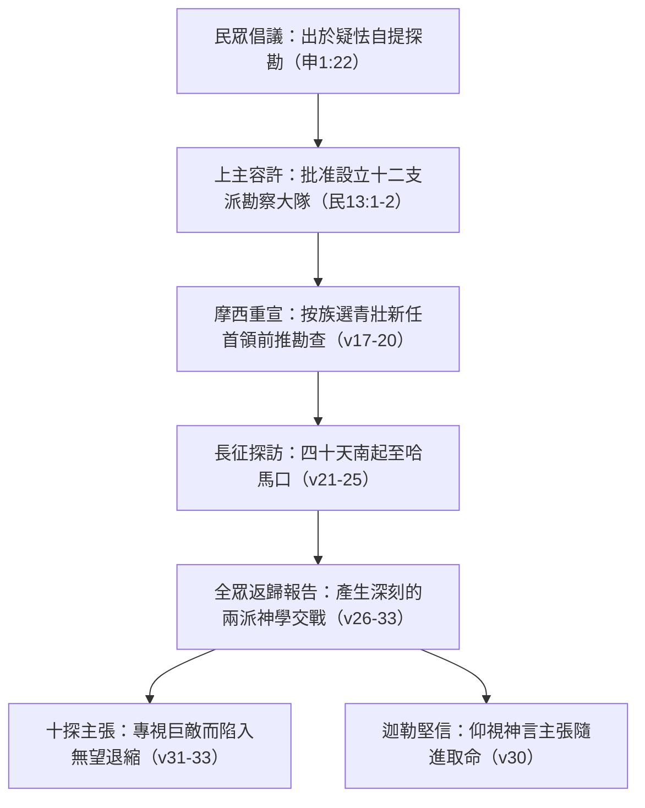

# 民數記 第13章

<!-- chapter-navigation:start -->
| [前一章](../04%20民數記/第12章.md) | [回目錄](../04%20民數記/全書目錄及綱要.md) | [下一章](../04%20民數記/第14章.md) |
| :--- | :---: | ---: |
<!-- chapter-navigation:end -->

1. 耶和華曉諭摩西說：
2. 你打發人去窺探我所賜給以色列人的迦[[南地與希伯崙|南地]]，他們每支派中要打發一個人，都要作首領的。
3. 摩西就照耶和華的吩咐從巴蘭的曠野打發他們去；他們都是以色列人的族長。
4. 他們的名字：屬流便支派的有撒刻的兒子沙母亞。
5. 屬西緬支派的有何利的兒子的沙法。
6. 屬猶大支派的有耶孚尼的兒子[[迦勒]]。
7. 屬以薩迦支派的有約色的兒子以迦。
8. 屬以法蓮支派的有嫩的兒子[[約書亞|何西阿]]。
9. 屬便雅憫支派的有拉孚的兒子帕提。
10. 屬西布倫支派的有梭底的兒子迦疊。
11. 約瑟的子孫，屬瑪拿西支派的有穌西的兒子迦底。
12. 屬但支派的有基瑪利的兒子亞米利。
13. 屬亞設支派的有米[[迦勒]]的兒子西帖。
14. 屬拿弗他利支派的有縛西的兒子拿比。
15. 屬迦得支派的有瑪基的兒子臼利。
16. 這就是摩西所打發、窺探那地之人的名字。摩西就稱嫩的兒子[[約書亞|何西阿]]為[[約書亞]]。
17. 摩西打發他們去窺探迦[[南地與希伯崙|南地]]，說：你們從南地上山地去，
18. 看那地如何，其中所住的民是強是弱，是多是少，
19. 所住之地是好是歹，所住之處是營盤是堅城。
20. 又看那地土是肥美是瘠薄，其中有樹木沒有。你們要放開膽量，把那地的果子帶些來。（那時正是葡萄初熟的時候。）
21. 他們上去窺探那地，從尋的曠野到利合，直到哈馬口。
22. 他們從[[南地與希伯崙|南地]]上去，到了[[南地與希伯崙|希伯崙]]；在那裡有[[亞衲族與偉人拿非林|亞衲族人]]亞希幔、示篩、撻買。（原來希伯崙城被建造比埃及的[[南地與希伯崙|鎖安城]]早七年。）
23. 他們到了[[以實各谷的一掛葡萄|以實各谷]]，從那裡砍了葡萄樹的一枝，上頭有[[以實各谷的一掛葡萄|一掛葡萄]]，兩個人用槓抬著，又帶了些石榴和無花果來。
24. （因為以色列人從那裡砍來的那掛葡萄，所以那地方叫做[[以實各谷的一掛葡萄|以實各谷]]。）
25. 過了四十天，他們窺探那地才回來，
26. 到了巴蘭曠野的加低斯，見摩西、亞倫，並以色列的全會眾，回報摩西、亞倫，並全會眾，又把那地的果子給他們看；
27. 又告訴摩西說：我們到了你所打發我們去的那地，果然是[[流奶與蜜之地]]；這就是那地的果子。
28. 然而住那地的民強壯，城邑也堅固寬大，並且我們在那裡看見了[[亞衲族與偉人拿非林|亞衲族]]的人。
29. 亞瑪力人住在[[南地與希伯崙|南地]]；赫人、耶布斯人、亞摩利人住在山地；迦南人住在海邊並約但河旁。
30. [[迦勒]]在摩西面前安撫百姓，說：我們立刻上去得那地吧！我們足能得勝。
31. 但那些和他同去的人說：我們不能上去攻擊那民，因為他們比我們強壯。
32. 探子中有人論到所窺探之地，向以色列人報惡信，說：我們所窺探、經過之地是吞吃居民之地，我們在那裡所看見的人民都身量高大。
33. 我們在那裡看見[[亞衲族與偉人拿非林|亞衲族人]]，就是[[亞衲族與偉人拿非林|偉人]]；他們是偉人的後裔。據我們看，自己就如蚱蜢一樣；據他們看，我們也是如此。

---

## 本章知識節點

### 人物
- [[迦勒]]
- [[約書亞]]

### 事件
- [[十二探子窺探迦南地]]

### 歷史
- [[加低斯巴尼亞事件]]

### 主題
- [[以實各谷的一掛葡萄]]

### 背景
- [[亞衲族與偉人拿非林]]

### 神學
- [[自認如蚱蜢的不信態勢]]
- [[流奶與蜜之地]]

### 地點
- [[南地與希伯崙]]

### 解經爭議
- [[十二探子自巴蘭或加低斯巴尼亞出發之解經爭議]]
- [[何西阿與約書亞改名時機與字意之解經爭議]]
- [[窺探迦南起因為神命或民意的解經爭議]]

---

## 本章整理

### 窺探迦南的使命宣授與起始動力（v1-20）

民數記第13章記述了古代以色列民結束在西乃山的修習與立法大營，移動抵達迦南邊界後，針對應許之地所實行的前導考察，這亦構成了救贖歷史上極其重大的驗證關口——[[十二探子窺探迦南地]]。本章開篇以主神向領袖的正式吩咐為起點：「耶和華曉諭摩西說：你打發人去窺探我所賜給以色列人的迦南地，他們每支派中要打發一個人，都要作首領的。」（v1-2）。從此兩節字面讀看，勘測計劃是來自最高權威的指令；然而當放置於更宏觀的五經回顧中，此際卻衍伸出 [[窺探迦南起因為神命或民意的解經爭議|窺探行動起源於上帝旨意或群眾主張的釋道討論]]。

針對這場啟示論述的調和，解經學長久累積了嚴肅的解答。丁良才（GT收錄）明確申述：「先前百姓因不信，生出遣人窺探迦南地的主意（申一22），摩西卻沒有看出他們的用意，就允准這事。本節顯明神也任憑他們隨著自己的意思而行。」這表明上帝深知百姓群眾心中的信仰隱怯，卻以忍耐的心接納這項人性需求；黃迦勒（CT）進一步從牧養意蘊剖開其中奧秘：「表面上，神允准百姓所提出的要求，實際上，神是藉此行動以顯明人的存心所在，是憑眼見，或是憑信心。」藉由這次公開探尋的洗禮，主未當急口斥拒脆弱不安，而是借客觀實況訓練會從之沉厚心能。

為推進這項軍政雙務之觀察，摩西按族指派了不涉及聖幕事工之其餘十二支派宗長代表；正如《啟導本》（GT）強調，此大批受遣探路的新晉人馬「全為各派別新拔除力強的壯男隊員與青年主力」；甚至比往日常規耆老擁有優良體格與適當決心（CT）。在人員列表裡（v4-15），極醒目處在於第16節加綴說明：「摩西就稱嫩的兒子何西阿為約書亞。」此節同時牽連深邃之 [[何西阿與約書亞改名時機與字意之解經爭議|名字轉換時間及含意解析]]。艾基斯在《舊約聖經難題彙編》（GT）中作了無隙剖釋，說明兩稱號同植出於希伯來文拯救字根 yasa'；而之所以出埃及早段經文即可先遇新稱呼，純由於撰史時軸於晚輩沉浸多秋的通用記憶下順其筆勢直稱。隨之，摩西向他們劃定由深遠南方一路追高查對城地肥枯、樹木盛虛及國居佈局的詳細考察細節（v17-20），而該期正好落在熱季的「葡萄初熟之候」。

### 勘察縱深與以實各谷的豐美實物證驗（v21-25）

受命出發的十二席青年大使全面穿越應許領地的南北咽喉：「他們上去窺探那地，從尋的曠野到利合，直到哈馬口。」（v21）。就起事位置而言，經文本節載從「巴蘭的曠野（或歸於加低斯）」展開與歸來（v3,26），然他卷有時指定加低斯巴尼亞，促成了釋道經典上的 [[十二探子自巴蘭或加低斯巴尼亞出發之解經爭議|出發基地地理對應解釋]]。艾基斯與《丁道爾註釋》（GT）闡明此區屬一片闊達漫長的塞地，加低斯極為充沛為其中間性大綠島地區，因此文獻引用一廣漠區域與具體綠地絲毫沒有對立誤讀。隨後他們的履跡繼續北取：跨離半乾極熱的 [[南地與希伯崙|南地原帶再往上直攀傳統大鎮希伯崙]]（v22）；作者於此補綴古今論說：「希伯崙被建造比埃及的鎖安城早七年」，凸出所登臨之神命盟證名地擁越千古帝權城邦的沉長厚實史榮；同時探隊親面相會當世魁形健碩之 [[亞衲族與偉人拿非林|亞衲宗族與相傳的偉人大怪]]（v22）。

縱使眼現諸猛勢壯的衛備土著，天地良美恩藏之大真確更是難掩。當眾伍深入深水茂谷之林：「他們到了以實各谷，從那裡砍了葡萄樹的一枝，上頭有一掛葡萄，兩個人用杠抬著，又帶了些石榴和無花果來。」（v23）。此地點因採擷那一具須雙丁穿木方克移攜的新盈沉實重果而被銘刻命名為 —— [[以實各谷的一掛葡萄|「以實各（一雙抬葡萄之谷）」]]。針對這種無以直面否認的厚產見證，CT（黃迦勒）點亮其內在教訓：其山區優越表徵著信仰中登往致高的基督生命性，那一手結實的超然碩穗不但落實驗證該沃壤非凡的甜美屬實，在教會觀中也是先嘗與基督豐滿肢體交連的見證標籤。十二探員耗時完整嚴格之四十日足印踐證（v25），將豐渥農果原樣帶回大軍面前。

| 摩西查核要求 (v18-20) | 探子現地所接觸的客觀真相 | 教誨及釋經觀看見證 |
| :--- | :--- | :--- |
| **土質之良劣與沃薄** | 於以實各割下雙人同肩扛負的巨碩飽滿葡萄與甘美石榴果實 | 見證 [[流奶與蜜之地]] 為客觀事實而非虛浮想像 (CT) |
| **定居人體型與強盛度** | 直接面對南疆及高嶺的亞希幔、示篩、撻買三氏族猛壯身材 | 對應 [[亞衲族與偉人拿非林]] 的爭戰精神，檢煉信心依仗之實體考題 (BH) |
| **城邑之鞏防狀態** | 登上極有歷史深度的大丘古鎮希伯崙與諸雄堅高牆壘 | 顯示承受神權領地務必預備承受相當長世的信心征戰 (GT) |
| **探勘時間與涵蓋廣度** | 自極熱南邊長驅北挺直至極深哈馬口，共費四十晝夜 | 四十天的齊整沉靜考察，既顯示全地真實，更作為信仰分流的契口 (KC) |

### 加低斯巴尼亞的匯報交鋒與不信氛圍的成型（v26-33）

經歷長安堪尋的十二探家終於歸赴大軍之集鎮 —— 發生重大變遷的 [[加低斯巴尼亞事件|加低斯巴尼亞大營]]（v26）。初始眾團坦對領軍摩西與全黎百姓直吐盛實說言：「我們到了你所打發我們去的那地，果然是 [[流奶與蜜之地|「流奶與蜜之地」]]；這就是那地的果子。」（v27）。然而正因為眼中存有血智，隨即這甜言即刻為驚心語反鎖：「然而住那地的民強壯，城邑也堅固寬大，並且我們在那裡看見了亞衲族的人。」（v28）。他們向世俗攤開恐懼分析表說亞瑪力、赫人與耶布斯猛雄各自塞滿所有據點（v29），瞬間讓會民意志陷落。正於絕境當下，代表主心的的將信英雄 [[迦勒]] 悍然從眾出班站立在主席摩西前，作安撫民眾的壯歌強語：「我們立刻上去得那地吧！我們足能得勝。」（v30）。對於這無雙正語，CT 指明說：「迦勒是一個專心跟從主的人，他不只語氣定靜正解，意向更是筆直無忌；在神意帶引之下的真戰家必將敵人放在神能之下檢看，絕非只抓拿自己的軟能跟對面高怪較量！」全群也看知與之同時保持清智之好男將即是 [[約書亞]]。

然而悲劇於刻，同返的其餘十名墮懦探兵悍然撕揭恐慌防衛令說：「我們不能上去攻擊那民，因為他們比我們強壯。」（v31）。為使其抗意合法並阻止部伍整進，這組倡惡信的謀眾散播駭言反造罪孽：「探子中有人論到所窺探之地，向以色列人報惡信，說：我們所窺探、經過之地是吞吃居民之地，我們在那裡所看見的人民都身量高大。我們在那裡看見亞衲族人，就是偉人；他們是偉人的後裔。據我們看，自己就如蚱蜢一樣；據他們看，我們也是如此。」（v32-33）。這一失序偏論成就了一則傳世驚醒的 [[自認如蚱蜢的不信態勢|「如蚱蜢的不信妄態」]]。 KingComments（KC）洞破迷障之底痛：「人當自傲除去至誠神的保衛宣託，專看周遭偉猛強身，心意就失靈失衡至全面怯弱；因為目睹大軍就全然忽忘昔年浩罕紅海神蹟的力量。」這部雙向信與魔障相殺交壘，立定了往後選聚須承受長逾四十年大浪不歸的曠厄審道長途。

> [!important] 目觀事實與靈命信託在遭逢挑戰時的分歧發展
>
> - **專賴血氣判見（十個不信探兵）**：緊鎖巨身居民和堅壁石坊，在懼愁放大作用下深陷無以抵抗之幻惑，自視若小地脆草蟲隻（見 [[自認如蚱蜢的不信態勢]]），引發不信叛離。
> - **依仗神約至高（迦勒與約書亞）**：聚焦自實地所獲雙丁力拱的肥大重葡萄果串（見 [[以實各谷的一掛葡萄]]），確認主定神權皆真；視難敵不過為上空榮耀前行鍛材，挺立高呼足能制勝。

**參考資料**
https://www.ccbiblestudy.org/Old%20Testament/04Num/04CT13.htm
https://www.ccbiblestudy.org/Old%20Testament/04Num/04GT13.htm
https://www.kingcomments.com/en/bible-studies/Num/13
https://biblehub.com/study/numbers/13.htm

<!-- appendix-links:start -->
## 附錄

### 相關地圖
- [[appendix/fhl_maps/maps/021|〈民圖二〉探查應許地和應許地的範圍]]
- [[appendix/fhl_maps/maps/024|〈民圖五〉出埃及和進迦南的旅程]]
- [[appendix/fhl_maps/maps/025|〈申圖一〉應許之地全圖]]
<!-- appendix-links:end -->

<!-- chapter-navigation:start -->
| [前一章](../04%20民數記/第12章.md) | [回目錄](../04%20民數記/全書目錄及綱要.md) | [下一章](../04%20民數記/第14章.md) |
| :--- | :---: | ---: |
<!-- chapter-navigation:end -->
