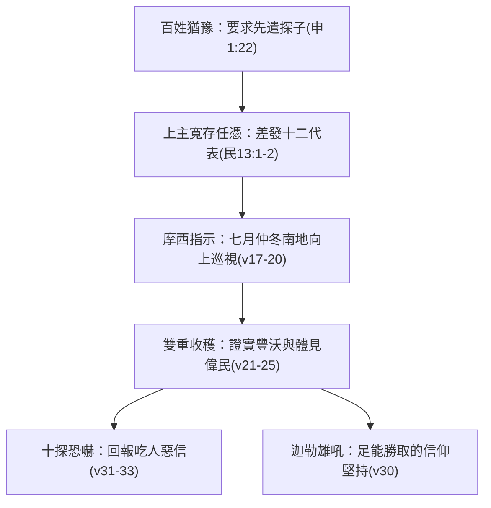

# 民數記 第13章

1. 耶和華曉諭摩西說：
2. 你打發人去窺探我所賜給以色列人的迦[[南地與希伯崙|南地]]，他們每支派中要打發一個人，都要作首領的。
3. 摩西就照耶和華的吩咐從巴蘭的曠野打發他們去；他們都是以色列人的族長。
4. 他們的名字：屬流便支派的有撒刻的兒子沙母亞。
5. 屬西緬支派的有何利的兒子的沙法。
6. 屬猶大支派的有耶孚尼的兒子[[迦勒]]。
7. 屬以薩迦支派的有約色的兒子以迦。
8. 屬以法蓮支派的有嫩的兒子[[約書亞|何西阿]]。
9. 屬便雅憫支派的有拉孚的兒子帕提。
10. 屬西布倫支派的有梭底的兒子迦疊。
11. 約瑟的子孫，屬瑪拿西支派的有穌西的兒子迦底。
12. 屬但支派的有基瑪利的兒子亞米利。
13. 屬亞設支派的有米[[迦勒]]的兒子西帖。
14. 屬拿弗他利支派的有縛西的兒子拿比。
15. 屬迦得支派的有瑪基的兒子臼利。
16. 這就是摩西所打發、窺探那地之人的名字。摩西就稱嫩的兒子[[約書亞|何西阿]]為[[約書亞]]。
17. 摩西打發他們去窺探迦[[南地與希伯崙|南地]]，說：你們從南地上山地去，
18. 看那地如何，其中所住的民是強是弱，是多是少，
19. 所住之地是好是歹，所住之處是營盤是堅城。
20. 又看那地土是肥美是瘠薄，其中有樹木沒有。你們要放開膽量，把那地的果子帶些來。（那時正是葡萄初熟的時候。）
21. 他們上去窺探那地，從尋的曠野到利合，直到哈馬口。
22. 他們從[[南地與希伯崙|南地]]上去，到了[[南地與希伯崙|希伯崙]]；在那裡有[[亞衲族與偉人拿非林|亞衲族人]]亞希幔、示篩、撻買。（原來希伯崙城被建造比埃及的[[南地與希伯崙|鎖安城]]早七年。）
23. 他們到了[[以實各谷的一掛葡萄|以實各谷]]，從那裡砍了葡萄樹的一枝，上頭有[[以實各谷的一掛葡萄|一掛葡萄]]，兩個人用槓抬著，又帶了些石榴和無花果來。
24. （因為以色列人從那裡砍來的那掛葡萄，所以那地方叫做[[以實各谷的一掛葡萄|以實各谷]]。）
25. 過了四十天，他們窺探那地才回來，
26. 到了巴蘭曠野的加低斯，見摩西、亞倫，並以色列的全會眾，回報摩西、亞倫，並全會眾，又把那地的果子給他們看；
27. 又告訴摩西說：我們到了你所打發我們去的那地，果然是[[流奶與蜜之地]]；這就是那地的果子。
28. 然而住那地的民強壯，城邑也堅固寬大，並且我們在那裡看見了[[亞衲族與偉人拿非林|亞衲族]]的人。
29. 亞瑪力人住在[[南地與希伯崙|南地]]；赫人、耶布斯人、亞摩利人住在山地；迦南人住在海邊並約但河旁。
30. [[迦勒]]在摩西面前安撫百姓，說：我們立刻上去得那地吧！我們足能得勝。
31. 但那些和他同去的人說：我們不能上去攻擊那民，因為他們比我們強壯。
32. 探子中有人論到所窺探之地，向以色列人報惡信，說：我們所窺探、經過之地是吞吃居民之地，我們在那裡所看見的人民都身量高大。
33. 我們在那裡看見[[亞衲族與偉人拿非林|亞衲族人]]，就是[[亞衲族與偉人拿非林|偉人]]；他們是偉人的後裔。據我們看，自己就如蚱蜢一樣；據他們看，我們也是如此。

<!-- fhl-map-links:start -->
## 相關地圖

- [[appendix/fhl_maps/maps/021|〈民圖二〉探查應許地和應許地的範圍]]
- [[appendix/fhl_maps/maps/024|〈民圖五〉出埃及和進迦南的旅程]]
- [[appendix/fhl_maps/maps/025|〈申圖一〉應許之地全圖]]
<!-- fhl-map-links:end -->

---

## 本章知識節點

### 人物
- [[迦勒]]
- [[約書亞]]

### 事件
- [[十二探子窺探迦南地]]

### 歷史
- [[加低斯巴尼亞事件]]

### 主題
- [[以實各谷的一掛葡萄]]

### 背景
- [[亞衲族與偉人拿非林]]

### 神學
- [[自認如蚱蜢的不信態勢]]
- [[流奶與蜜之地]]

### 地點
- [[南地與希伯崙]]

### 解經爭議
- [[十二探子自巴蘭或加低斯巴尼亞出發之解經爭議]]
- [[何西阿與約書亞改名時機與字意之解經爭議]]
- [[窺探迦南起因為神命或民意的解經爭議]]

---

## 本章整理

### 窺探迦南的使命指示與解經溯源（v1-20）

民數記第十三章記載了以色列全神權會眾在出埃及並經歷西乃盟約陶冶後，直奔迦南南隅邊界的重要考驗轉折——[[十二探子窺探迦南地]]。在第一至二節，經文首揭：「耶和華曉諭摩西說：你打發人去窺探我所賜給以色列人的迦南地，他們每支派中要打發一個人，都要作首領的。」看似本行動全然源自由上而下的直接啟示；然而在聖經研經統整和啟示歷史裡，卻引發了[[窺探迦南起因為神命或民意的解經爭議]]。針對此深重議題，丁良才在《民數記註釋》（GT收錄）釋白說：「先前百姓因不信，生出遣人窺探迦南地的主意（申一22），摩西卻沒有看出他們的用意，就允准這事。本節顯明神也任憑他們隨著自己的意思而行。」這表明天地主宰雖知百姓內在對美地真實性的猶豫與動搖，卻以無限恩澤承襲其要求；黃迦勒（CT）進一步明解：「表面上，神允准百姓所提出的要求，實際上，神是藉此行動以顯明人的存心所在，是憑眼見，或是憑信心。」同時指出：「神並沒有責備這些信心軟弱的人，為了他們信心的成長命令摩西差遣探子。神不責備我們的軟弱，在接納我們軟弱的同時眷顧我們，使我們能漸有成熟的屬靈生命。」這成為磨煉並驗證選民靈性的考場。

為執行探勘大旨，摩西任命了除專司幕職的利未人外所有十二支派的宗族主腦。CT 闡言，這些代表「都是每一個支派的首領，要比一般的百姓多有認識和經歷」，甚至是日前分享摩西之靈的長老；《啟導本》（GT）則洞析：「打探迦南的事需要年輕力壯的人，以前幾章所記的都屬較年長的領袖，本文選派作探子的，則是一些年輕有為的青年領袖。」在這十二位代表名冊中（v4-15），極具關鍵亮點的是第16節申斷：「摩西就稱嫩的兒子何西阿為約書亞。」論及[[何西阿與約書亞改名時機與字意之解經爭議]]，艾基斯於《舊約聖經難題彙編》（GT）精確闡釋：「Yehosua'（耶和華是拯救）與 Hosea'（拯救）是相同的名字，二者均源於字根 yasa'」；丁良才指明《出埃及記》第十七章之所以提早見及此新稱，乃因「摩西寫本冊的時候人已經將這名字稱慣了」，採倒敘稱封。摩西接著向他們給予定向指示，要求自南部極限走上高山脈，察覽土質勝負、農產林蔭和城壘防線（v17-20），而那時「正是葡萄初熟的時候」，相當於陽曆七月間，大地豐富正奔放顯露出引領愛慕神約的絕美恩華。

### 勘探南北地理廊道與帶回以實各谷的憑據（v21-25）

自受命令出征，十二位壯年首領由南直至北疆遍訪千里：「他們上去窺探那地，從尋的曠野到利合，直到哈馬口。」（v21）關於探團初出地標，經文第3與26節記載自「巴蘭的曠野（或加低斯）」而去，而他章常引加低斯巴尼亞，遂誘促[[十二探子自巴蘭或加低斯巴尼亞出發之解經爭議]]。對此釋讀分歧，艾基斯與《丁道爾》（GT）明解：「巴蘭曠野的最南端在依拉夫港向東北偏北伸展……曠野的範圍內，包括有加低斯巴尼亞，所以十二個探子由加低斯出發，而加低斯位於巴蘭曠野內。」二處並無矛盾。其行蹤繼而越涉[[南地與希伯崙]]：「他們從南地上去，到了希伯崙；在那裡有亞衲族人亞希幔、示篩、撻買。」（v22）作者此處借筆懸注希伯崙比埃及大帝國京朝鎖安城早七載興立，彰顯先祖應許雄址歷史的浩重，同時卻撞上了高猛如神的[[亞衲族與偉人拿非林]]大家族；BibleHub Study 補充指出：「亞衲族是一群著名的偉大壯偉種族，居於希伯崙一帶，其勇悍聲勢構成顯著力量。」

然而，地理考察除了險阻外，更是神蹟甘泉的見證期。經節宣揚：「他們到了以實各谷，從那裡砍了葡萄樹的一枝，上頭有一掛葡萄，兩個人用杠抬著，又帶了些石榴和無花果來。」（v23）這地名正是以一掛重豐無二的大串葡萄為名的名址——[[以實各谷的一掛葡萄]]。針對這一驚世碩大的屬靈鐵證，黃迦勒（CT）啟迪深刻靈訓：「以實各谷是山地，表徵基督的超越和得勝。這一挂的葡萄，表明了迦南地的性質——果然是流奶與蜜之地；聖靈住在我們裏面，也像這挂葡萄一樣，今天我們所豫嘗的是如此，將來天上的滋味也必定是如此。碩大葡萄雙人槓抬，說明基督豐盛的生命；石榴千百子粒構成一體，說明基督身體的豐富；無花果香甜，豫表基督給人飽足。」為追求對這至極基業的徹悉，探子整整在遠山縱橫了四十日（v25），將這神國豐厚印證帶還營陣。

| 考察項目 (v18-20) | 探子回扣之觀察現實 | 神學涵義與釋經對照 |
| --- | --- | --- |
| 土質好歹與收成 | **以實各谷**的大葡萄一掛需兩人扛、石榴無花果 | 見證 **流奶與蜜之地** 的偉大無邊與基督豫嘗 (CT) |
| 當地民之強弱 | 見面撞及亞希幔、示篩、撻買三部落 | 見 **亞衲族與偉人拿非林** 考驗肉身對上天的單靠信心 (BH) |
| 城區居為盤為城 | 希伯崙古大圍牆與難以破除的巨堡工事 | 映襯邁進屬靈基業總須經過進取鍛鍊 (GT) |
| 調研時段長度 | 全疆走透經過四十日回來 | 四十日審鑑深邃皆真，展示神應許絕不虛言 (KC) |

### 加低斯巴尼亞的匯報衝突與不信者的惡信崩解（v26-33）

四十期滿，十二名代表歸抵[[加低斯巴尼亞事件]]之發生起場：「到了巴蘭曠野的加低斯，見摩西、亞倫，並以色列的全會眾，回報摩西、亞倫，並全會眾，又把那地的果子給他們看。」（v26）這是一個關隘抉擇期；他們開膛盛賀那美土千勝萬妙：「我們到了你所打發我們去的那地，果然是[[流奶與蜜之地]]；這就是那地的果子。」（v27）然而，這甜言立刻被「然而」兩字打破：「然而住那地的民強壯，城邑也堅固寬大，並且我們在那裡看見了亞衲族的人。」（v28）他們開始詳繪山南道岸分踞的亞瑪力世仇、赫人與耶布斯猛敵（v29），用巨大的現實困難將百姓的心澆為冷水。就在民意震抖時，[[迦勒]]毅然現身擋在主座前：「迦勒在摩西面前安撫百姓，說：我們立刻上去得那地吧！我們足能得勝。」（v30）針對這極高壯烈喊號，CT 賞揚道：「迦勒是一個專心跟從主的人，他不只字句對，音調也對。他說我們立刻上去得那地罷，一個以主為靠得住的人，遵行神的旨意都是立刻的。十個人的說法與兩人不同：十個人將偉人與他們自己比，但那兩人（他和[[約書亞]]）將偉人與神來較量！」

悲泣的是，那與之偕行歸返的另外十名敗探不惜撕下實是，展開背逆惡戰：「我們不能上去攻擊那民，因為他們比我們強壯。」（v31）為了給逃縮尋求正當依護，他們甚至大發言譭：「探子中有人論到所窺探之地，向以色列人報惡信，說：我們所窺探、經過之地是吞吃居民之地，我們在那裡所看見的人民都身量高大。我們在那裡看見亞衲族人，就是偉人；他們是偉人的後裔。據我們看，自己就如蚱蜢一樣；據他們看，我們也是如此。」（v32-33）這種絕望態度構成了世世警鐘的[[自認如蚱蜢的不信態勢]]。針對這種眼光扭曲，KingComments（KC）明確詮釋：「『人如果完全將神排除在外，便容易受到懼怕與不信之噁心侵襲；由於仰觀敵人身段大膽高昂，就把信仰承擔全然棄退。』」CT 也指露此大病根：「神允許他們去窺探，是要藉著環境來磨煉他們的信心，催促他們去取用神的信實。但是人裡面的光景不對，他所看見的也就不對，該看見的神他們沒有看見，不該看見的他們倒看到像山那麼大。你如果一直看難處，當然你就沒有辦法；神是要我們對山說：你挪開此地投在海裏。」這番兩派大搏交集，徹底刻勒下以色列於荒野漂流四十載重劫的前聲，亦向信徒顯明眼見世難與專念聖神威力兩極化心態終獲天地之隔的大結局。

> [!important] 信心與血氣眼見在面對同款挑戰時的靈命極限對照
>
> - **單依血肉世眼**：眼底全居拿非林巨偉兵組與希伯崙高壁，將神約化無，倒置致認自己如同毫無抵抗力的草綠蚱蜢，飽嘗懷疑的痛苦並掉進沙原之災（見 [[自認如蚱蜢的不信態勢]] ）。
> - **持護至聖道靈**：見到一掛須雙男共挑之碩美靈土葡萄果枝（見 [[以實各谷的一掛葡萄]] ），深悟必為天神厚賜；雖見兵城雄屹卻獨信聖神全能，仰首宣告：「我們足能得勝！」

**參考資料**
https://www.ccbiblestudy.org/Old%20Testament/04Num/04CT13.htm
https://www.ccbiblestudy.org/Old%20Testament/04Num/04GT13.htm
https://www.kingcomments.com/en/bible-studies/Num/13
https://biblehub.com/study/numbers/13.htm
