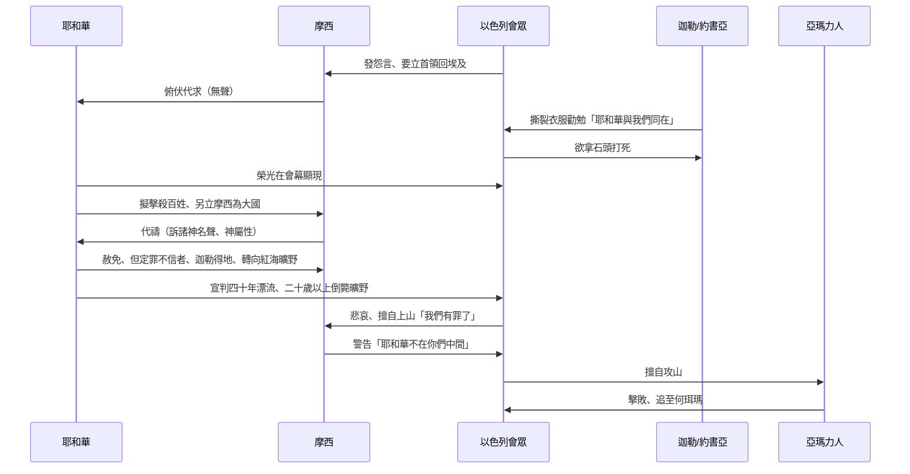

# 民數記 第14章

1. 當下，全會眾大聲喧嚷；那夜百姓都哭號。
2. 以色列眾人向[[摩西]]、[[亞倫]]發怨言；全會眾對他們說：巴不得我們早死在埃及地，或是死在這曠野。
3. 耶和華為什麼把我們領到那地，使我們倒在刀下呢？我們的妻子和孩子必被擄掠。我們回埃及去豈不好嗎？
4. 眾人彼此說：我們不如立一個首領回埃及去吧！
5. [[摩西]]、[[亞倫]]就俯伏在以色列全會眾面前。
6. 窺探地的人中，[[約書亞|嫩的兒子約書亞]]和[[迦勒|耶孚尼的兒子迦勒]]撕裂衣服，
7. 對以色列全會眾說：我們所窺探、經過之地是[[迦勒約書亞撕裂衣服勸勉|極美之地]]。
8. [[迦勒約書亞撕裂衣服勸勉|耶和華若喜悅我們]]，就必將我們領進那地，把地賜給我們；那地原是[[應許之地流奶與蜜預表屬天基業（來 11：10, 16；彼前 1：4）|流奶與蜜之地]]。
9. 但你們[[迦勒約書亞撕裂衣服勸勉|不可背叛耶和華]]，也不要怕那地的居民；因為他們是我們的食物，並且蔭庇他們的已經離開他們。有耶和華與我們同在，不要怕他們！
10. 但全會眾說：[[會眾想拿石頭打死迦勒約書亞|拿石頭打死]]他們二人。忽然，耶和華的榮光[[耶和華榮光在會幕顯現|在會幕]]中向以色列眾人顯現。
11. 耶和華對[[摩西]]說：這百姓藐視我要到幾時呢？我在他們中間行了這一切神蹟，他們還不信我要到幾時呢？
12. 我要[[神要擊殺百姓另立摩西為大國|用瘟疫擊殺]]他們，使他們不得承受那地，叫你的後裔成為大國，比他們強勝。
13. [[摩西]]對耶和華說：埃及人必聽見這事；因為你曾施展大能，將這百姓從他們中間領上來。
14. 埃及人要將這事傳給迦南地的居民；那民已經聽見你─耶和華是在這百姓中間；因為你面對面被人看見，有你的雲彩停在他們以上。你日間在雲柱中，夜間在火柱中，在他們前面行。
15. 如今你若把這百姓殺了，如殺一人，那些聽見你名聲的列邦必議論說：
16. 耶和華因為不能把這百姓領進他向他們起誓應許之地，所以在曠野把他們殺了。
17. 現在求主大顯能力，照你所說過的話說：
18. 耶和華不輕易發怒，並有豐盛的慈愛，赦免罪孽和過犯；萬不以有罪的為無罪，必追討他的罪，自父及子，直到三、四代。
19. 求你照你的大慈愛赦免這百姓的罪孽，好像你從埃及到如今常赦免他們一樣。
20. 耶和華說：我照著你的話赦免了他們。
21. 然我指著我的永生起誓，遍地要被我的榮耀充滿。
22. 這些人雖看見我的榮耀和我在埃及與曠野所行的神蹟，仍然試探我這十次，不聽從我的話，
23. 他們斷不得看見我向他們的祖宗所起誓應許之地。凡藐視我的，一個也不得看見；
24. 惟獨我的僕人[[迦勒]]，因他另有一個心志，專一跟從我，我就把他領進他所去過的那地；他的後裔也必得那地為業。
25. 亞瑪力人和迦南人住在谷中，明天你們要轉回，從紅海的路往曠野去。
26. 耶和華對[[摩西]]、[[亞倫]]說：
27. 這惡會眾向我發怨言，我忍耐他們要到幾時呢？以色列人向我所發的怨言，我都聽見了。
28. 你們告訴他們，耶和華說：我指著我的永生起誓，我必要照你們達到我耳中的話待你們。
29. 你們的屍首必倒在這曠野，並且你們中間凡被數點、從[[成年人必死在曠野|二十歲以外]]、向我發怨言的，
30. 必不得進我起誓應許叫你們住的那地；惟有[[迦勒|耶孚尼的兒子迦勒]]和[[約書亞|嫩的兒子約書亞]]才能進去。
31. 但你們的婦人孩子，就是你們所說、要被擄掠的，我必把他們領進去，他們就得知你們所厭棄的那地。
32. 至於你們，你們的屍首必倒在這曠野；
33. 你們的兒女必在曠野飄流四十年，擔當你們淫行的罪，直到你們的屍首在曠野消滅。
34. 按你們窺探那地的四十日，一年頂一日，你們要[[一日頂一年（yom tachat shanah）|擔當罪孽]]四十年，就知道我與你們疏遠了，
35. 我─耶和華說過，我總要這樣待這一切聚集敵我的惡會眾；他們必在這曠野消滅，在這裡死亡。
36. [[摩西]]所打發、窺探那地的人回來，報那地的惡信，叫全會眾向摩西發怨言，
37. 這些報惡信的人都遭瘟疫，死在耶和華面前。
38. 其中惟有[[約書亞|嫩的兒子約書亞]]和[[迦勒|耶孚尼的兒子迦勒]]仍然存活。
39. [[摩西]]將這些話告訴以色列眾人，他們就甚悲哀。
40. 清早起來，上山頂去，說：我們在這裡，我們有罪了；情願上耶和華所應許的地方去。
41. [[摩西]]說：你們為何違背耶和華的命令呢？這事不能順利了。
42. 不要上去；因為[[百姓擅自上山被擊敗|耶和華不在你們中間]]，恐怕你們被仇敵殺敗了。
43. 亞瑪力人和迦南人都在你們面前，你們必倒在刀下；因你們退回不跟從耶和華，所以他必不與你們同在。
44. 他們卻擅敢上山頂去，然而耶和華的約櫃和[[摩西]]沒有出營。
45. 於是亞瑪力人和住在那山上的迦南人都下來擊打他們，把他們殺退了，直到[[何珥瑪]]。

<!-- fhl-map-links:start -->
## 相關地圖

- [[appendix/fhl_maps/maps/021|〈民圖二〉探查應許地和應許地的範圍]]
- [[appendix/fhl_maps/maps/025|〈申圖一〉應許之地全圖]]
- [[appendix/fhl_maps/maps/078|〈代上圖二〉迦勒的子孫所居之城]]
<!-- fhl-map-links:end -->

---

## 本章知識節點

### 神學
- [[神的忍耐與公義並行]]
- [[代禱改變神審判]]
- [[信心與不信的分水嶺]]
- [[屬肉體悔改非真悔改]]
- [[試探神十次（nissah aser）]]
- [[一日頂一年（yom tachat shanah）]]
- [[迦勒約書亞信心預表基督徒得勝（來 3-4；羅 8：37）]]
- [[曠野漂流預表希伯來書警告（來 3：7-4：11）]]

### 人物
- [[摩西]]
- [[約書亞]]
- [[迦勒]]
- [[亞倫]]

### 地理
- [[紅海曠野]]
- [[加低斯]]
- [[何珥瑪]]

### 事件
- [[全會眾哭號發怨言]]
- [[摩西亞倫俯伏代求]]
- [[迦勒約書亞撕裂衣服勸勉]]
- [[會眾想拿石頭打死迦勒約書亞]]
- [[耶和華榮光在會幕顯現]]
- [[神要擊殺百姓另立摩西為大國]]
- [[摩西為百姓代禱]]
- [[神赦免但定罪不信者]]
- [[迦勒得進迦南地]]
- [[神命百姓轉向紅海曠野]]
- [[成年人必死在曠野]]
- [[十探子遭瘟疫而死]]
- [[百姓擅自上山被擊敗]]

### 疑難
- [[迦勒何時進迦南地]]
- [[摩西是否進過迦南地]]
- [[十探子報惡信是否故意]]
- [[一日頂一年原則]]

### 預表
- [[摩西代禱預表基督代禱（來7：25）]]

---

## 本章整理

### 百姓哭號、發怨言、想立首領回埃及（v1-4）
以色列[[全會眾哭號發怨言|全會眾大聲喧嚷、通夜哭號]]，因十探子的惡報而絕望。他們不僅埋怨[[摩西]]、[[亞倫]]，更公開質疑神的美意：「耶和華為什麼把我們領到那地，使我們倒在刀下？」甚至提議「立一個首領回埃及去」。這場叛逆的核心是**不信**——他們看見神在埃及與曠野的神蹟，卻拒絕信靠神能將迦南地賜給他們（v22-23）。

### 迦勒約書亞撕裂衣服勸勉、會眾想拿石頭打死、耶和華榮光顯現（v5-10）
[[摩西亞倫俯伏代求|摩西亞倫雙雙俯伏]]在會眾面前，不發一語，將局面完全交託給神。[[迦勒約書亞撕裂衣服勸勉|迦勒與約書亞]]撕裂衣服，大聲宣告：「那地是極美之地……不要怕那地的居民，因為他們是我們的食物，蔭庇他們的已經離開他們，有耶和華與我們同在。」這句「他們是我們的食物」極富神學張力：原本令人恐懼的敵人，在神同在的視角下反成屬靈養分。會眾卻暴怒，[[會眾想拿石頭打死迦勒約書亞|要拿石頭打死二人]]。關鍵時刻，[[耶和華榮光在會幕顯現|耶和華的榮光在會幕中顯現]]，強行介入審判與拯救。

### 神要擊殺百姓另立摩西為大國、摩西為百姓代禱（v11-19）
神向摩西啟心：「這百姓藐視我要到幾時？我要用瘟疫擊殺他們，叫你的後裔成為大國。」這是繼出埃及記 32 章金牛犢事件後，神再次提出「另立摩西為大國」的測試。[[摩西為百姓代禱|摩西再次拒絕這榮耀]]，改以兩大理由代求：
1. **神的名聲在列邦中**：埃及人、迦南人若聽見神在曠野殺盡百姓，必褻瀆神名，說「耶和華因為不能把這百姓領進應許之地，所以在曠野把他們殺了」（v13-16）。
2. **神的屬性**：摩西引用出埃及記 34:6-7 的自我啟示——「耶和華不輕易發怒，並有豐盛的慈愛，赦免罪孽和過犯；萬不以有罪的為無罪」（v17-18），懇求神「照你的大慈愛赦免這百姓的罪孽，好像你從埃及到如今常赦免他們一樣」（v19）。

> [!quote] 摩西代禱的神學基礎
> 「現在求主大顯能力，照你所說過的話說：耶和華不輕易發怒，並有豐盛的慈愛，赦免罪孽和過犯；萬不以有罪的為無罪，必追討他的罪，自父及子，直到三、四代。求你照你的大慈愛赦免這百姓的罪孽，好像你從埃及到如今常赦免他們一樣。」（民 14:17-19）

### 神赦免但定罪不信者、迦勒得進迦南地、神命百姓轉向紅海曠野（v20-25）
神回應：「我照著你的話赦免了他們」（v20）——**代禱改變了神的審判時程**，但不改變公義的原則。神隨即起誓：「遍地要被我的榮耀充滿」（v21），並宣告審判：
- 所有「看見我的榮耀和神蹟，仍然試探我這十次、不聽從我的話」的人（v22，[[試探神十次（nissah aser）|試探神十次]]），**斷不得看見應許之地**（v23）。
- 唯獨[[迦勒得進迦南地|迦勒]]因「另有一個心志，專一跟從我」，必得進入並承受為業（v24）。
- 當下命令：「明天你們要轉回，從紅海的路往曠野去」（v25，[[神命百姓轉向紅海曠野]]）。

### 成年人必死在曠野、一日頂一年、十探子遭瘟疫而死（v26-38）
神向摩西、亞倫詳細說明審判細節：
- **對象**：凡被數點、從二十歲以外、向神發怨言者（v29）。
- **刑罰**：屍首倒在曠野，不得進入應許地（v30, 32）。
- **期限**：按窺探地的四十日，一日頂一年，共四十年（v34，[[一日頂一年（yom tachat shanah）|一日頂一年原則]]）。
- **下一代**：你們所說「要被擄掠的婦人孩子」，神必領他們進去，得知你們所厭棄的那地（v31）。
- **十探子**：報惡信的十人「都遭瘟疫，死在耶和華面前」（v37，[[十探子遭瘟疫而死]]）；惟有約書亞、迦勒存活（v38）。

> [!note] 一日頂一年的雙重意義
> 這原則在以西結書 4:6 再現，顯示神審判的精確度：四十年漂流既是懲罰，也是下一代在曠野受訓、學習倚靠神的必要過程（參[[曠野漂流預表希伯來書警告（來 3：7-4：11）]]）。

### 百姓擅自上山被擊敗、何珥瑪之敗（v39-45）
聽見審判後，百姓「甚悲哀」（v39），清早上山頂說：「我們在這裡，我們有罪了；情願上耶和華所應許的地方去」（v40）。摩西警告：「你們為何違背耶和華的命令呢？這事不能順利了……耶和華不在你們中間」（v41-43）。這是[[屬肉體悔改非真悔改|屬肉體的悔改]]——為後果憂傷，卻不順服神當下的命令（轉向曠野）。他們擅自上山，約櫃與摩西未出營，結果被亞瑪力人和迦南人擊敗，直追到[[何珥瑪]]（v45）。

> [!important] 本章樞紐：信心與不信的分水嶺
> 同一群人、同一塊地、同一個應許——迦勒約書亞因信得地，十探子因不信死於瘟疫，成年一代因不信倒斃曠野，下一代因父親的不信延遲四十年卻終得應許。這分水嶺貫穿聖經：[[信心與不信的分水嶺|信心看見神的大能，不信看見人的軟弱]]（參來 3-4）。

---
### 跨章脈絡與預表整理

#### 摩西代禱預表基督代禱
摩西三次為百姓攔阻神的忿怒（出 32；民 14；民 16），預表[[摩西代禱預表基督代禱（來7：25）|基督作大祭司「長遠活著，替他們祈求」]]。摩西引用神的屬性（出 34:6-7）作為代求依據，基督則憑自己的寶血與義代求。

#### 迦勒約書亞：信心得勝的預表
迦勒「專一跟從耶和華」（v24），約書亞後來帶領百姓得地。二人預表[[迦勒約書亞信心預表基督徒得勝（來 3-4；羅 8：37）|在基督裡得勝的信徒]]：不因環境巨人懼怕，因神同在而得地為業。

#### 曠野漂流：希伯來書的警告
民數記 14 是希伯來書 3:7-4:11 論述「今日若聽他聲音，就不可硬著心」的歷史背景。四十年漂流成了[[曠野漂流預表希伯來書警告（來 3：7-4：11）|新約信徒不可效法的反面教材]]。

#### 應許之地流奶與蜜：屬天基業的預表
迦勒約書亞眼中的「極美之地」（v7）預表[[應許之地流奶與蜜預表屬天基業（來 11：10, 16；彼前 1：4）|那更美的、屬天的家鄉]]。

#### 關鍵對話流程圖

#### 審判與恩典對照表
| 群體 | 回應 | 結局 | 神學意義 |
|------|------|------|----------|
| 十探子 | 報惡信、挑動叛逆 | 遭瘟疫立死 | 不信的領袖速受審判 |
| 全會眾（20歲↑） | 哭號、發怨言、想回埃及 | 四十年漂流、屍首倒在曠野 | 群體性不信的集體後果 |
| 迦勒、約書亞 | 專一跟從、撕裂衣服勸勉 | 存活、得地為業 | 信心的少數派得應許 |
| 下一代（兒女） | 非自願漂流四十年 | 進入應許之地 | 神信實守約、恩典延續 |
| 擅自上山者 | 屬肉體悔改、違命出戰 | 被亞瑪力人/迦南人擊敗 | 無神同在的屬靈爭戰必敗 |

> [!question] 留待後章釐清的問題
> - [[迦勒何時進迦南地]]：約書亞記 14 章迦勒 85 歲求希伯崙為業，中間 45 年如何度過？
> - [[摩西是否進過迦南地]]：民 20:12 摩西因米利巴水不信，不得進地；但變像山（太 17）摩西站在應許地上——如何協調？
> - [[十探子報惡信是否故意]]：他們是「恐懼誇大」還是「惡意謊報」？經文用「惡信」（v36）與「毀謗」（13:32）暗示主觀惡意。

**參考資料**
https://www.ccbiblestudy.org/Old%20Testament/04Num/04CT14.htm
https://www.ccbiblestudy.org/Old%20Testament/04Num/04GT14.htm
https://www.kingcomments.com/en/bible-studies/Num/14
https://biblehub.com/study/numbers/14.htm
