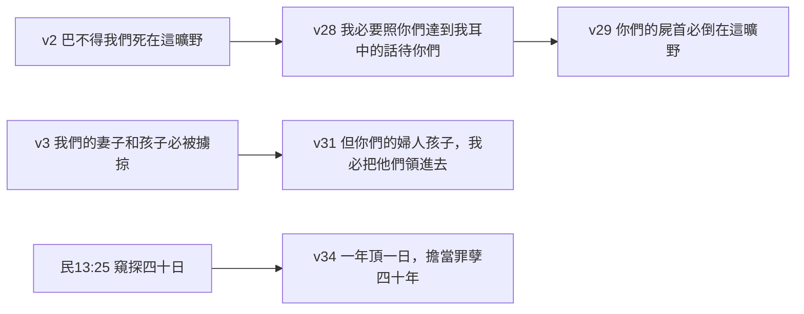

# 民數記 第14章

<!-- chapter-navigation:start -->
| [前一章](../04%20民數記/第13章.md) | [回目錄](../04%20民數記/全書目錄及綱要.md) | [下一章](../04%20民數記/第15章.md) |
| :--- | :---: | ---: |
<!-- chapter-navigation:end -->

1. 當下，全會眾大聲喧嚷；那夜百姓都哭號。
2. 以色列眾人向摩西、亞倫發怨言；全會眾對他們說：巴不得我們早死在埃及地，或是死在這曠野。
3. 耶和華為什麼把我們領到那地，使我們倒在刀下呢？我們的妻子和孩子必被擄掠。我們回埃及去豈不好嗎？
4. 眾人彼此說：我們不如立一個首領回埃及去吧！
5. 摩西、亞倫就俯伏在以色列全會眾面前。
6. 窺探地的人中，嫩的兒子[[約書亞]]和耶孚尼的兒子[[迦勒]]撕裂衣服，
7. 對以色列全會眾說：我們所窺探、經過之地是極美之地。
8. 耶和華若喜悅我們，就必將我們領進那地，把地賜給我們；那地原是流奶與蜜之地。
9. 但你們不可背叛耶和華，也不要怕那地的居民；因為他們是[[仇敵是我們的食物|我們的食物]]，並且蔭庇他們的已經離開他們。有耶和華與我們同在，不要怕他們！
10. 但全會眾說：拿石頭打死他們二人。忽然，[[耶和華的榮光與會幕的及時顯現|耶和華的榮光]][[耶和華的榮光與會幕的及時顯現|在會幕中向以色列眾人顯現]]。
11. 耶和華對摩西說：這百姓藐視我要到幾時呢？我在他們中間行了這一切神蹟，他們還不信我要到幾時呢？
12. 我要用瘟疫擊殺他們，使他們不得承受那地，叫你的後裔成為大國，比他們強勝。
13. 摩西對耶和華說：埃及人必聽見這事；因為你曾施展大能，將這百姓從他們中間領上來。
14. 埃及人要將這事傳給[[迦南地]]的居民；那民已經聽見你─耶和華是在這百姓中間；因為你面對面被人看見，有你的雲彩停在他們以上。你日間在雲柱中，夜間在火柱中，在他們前面行。
15. 如今你若把這百姓殺了，如殺一人，那些聽見你名聲的列邦必議論說：
16. 耶和華因為不能把這百姓領進他向他們起誓應許之地，所以在曠野把他們殺了。
17. 現在求主大顯能力，照你所說過的話說：
18. 耶和華不輕易發怒，並有[[摩西代求與神的豐盛慈愛|豐盛的慈愛]]，赦免罪孽和過犯；萬不以有罪的為無罪，[[神公義追討與禍延子孫的釋經探討|必追討他的罪]]，[[神公義追討與禍延子孫的釋經探討|自父及子，直到三、四代]]。
19. 求你照你的大慈愛赦免這百姓的罪孽，好像你從埃及到如今常赦免他們一樣。
20. 耶和華說：我照著你的話赦免了他們。
21. 然我指著我的永生起誓，遍地要被我的榮耀充滿。
22. 這些人雖看見我的榮耀和我在埃及與曠野所行的神蹟，仍然[[試探神十次|試探我這十次]]，不聽從我的話，
23. 他們斷不得看見我向他們的祖宗所起誓應許之地。凡藐視我的，一個也不得看見；
24. 惟獨我的僕人[[迦勒]]，因他[[專心跟從主與另一個心志|另有一個心志]]，[[專心跟從主與另一個心志|專一跟從我]]，我就把他領進他所去過的那地；他的後裔也必得那地為業。
25. [[亞瑪力人]]和迦南人住在谷中，明天你們要轉回，從紅海的路往曠野去。
26. 耶和華對摩西、亞倫說：
27. 這惡會眾向我發怨言，我忍耐他們要到幾時呢？以色列人向我所發的怨言，我都聽見了。
28. 你們告訴他們，耶和華說：我指著我的永生起誓，我必要照你們達到我耳中的話待你們。
29. 你們的屍首必倒在這曠野，並且你們中間凡被數點、從二十歲以外、向我發怨言的，
30. 必不得進我起誓應許叫你們住的那地；惟有耶孚尼的兒子[[迦勒]]和嫩的兒子[[約書亞]]才能進去。
31. 但你們的婦人孩子，就是你們所說、要被擄掠的，我必把他們領進去，他們就得知你們所厭棄的那地。
32. 至於你們，你們的屍首必倒在這曠野；
33. 你們的兒女必在[[曠野飄流四十年]]，擔當你們淫行的罪，直到你們的屍首在曠野消滅。
34. 按你們窺探那地的四十日，一年頂一日，你們要[[曠野飄流四十年|擔當罪孽四十年]]，就知道我與你們疏遠了，
35. 我─耶和華說過，我總要這樣待這一切聚集敵我的惡會眾；他們必在這曠野消滅，在這裡死亡。
36. 摩西所打發、窺探那地的人回來，報那地的惡信，叫全會眾向摩西發怨言，
37. 這些[[報惡信之人的瘟疫與存活者|報惡信的人都遭瘟疫]]，死在耶和華面前。
38. 其中惟有嫩的兒子[[約書亞]]和耶孚尼的兒子[[迦勒]][[報惡信之人的瘟疫與存活者|仍然存活]]。
39. 摩西將這些話告訴以色列眾人，他們就甚悲哀。
40. 清早起來，上山頂去，說：我們在這裡，我們有罪了；[[假意悔改與冒死擅自作戰|情願上耶和華所應許的地方去]]。
41. 摩西說：你們為何違背耶和華的命令呢？這事不能順利了。
42. 不要上去；因為耶和華不在你們中間，恐怕你們被仇敵殺敗了。
43. [[亞瑪力人]]和迦南人都在你們面前，你們必倒在刀下；因你們退回不跟從耶和華，所以他必不與你們同在。
44. 他們卻[[假意悔改與冒死擅自作戰|擅敢上山頂去]]，然而耶和華的約櫃和摩西沒有出營。
45. 於是[[亞瑪力人]]和住在那山上的迦南人都下來擊打他們，把他們[[迦南大敗直到何珥瑪|殺退了，直到何珥瑪]]。

---

## 本章知識節點

### 人物
- [[迦勒]]
- [[約書亞]]
- [[亞瑪力人]]

### 事件
- [[報惡信之人的瘟疫與存活者]]
- [[假意悔改與冒死擅自作戰]]
- [[十二探子窺探迦南地]]
- [[耶和華擊打百姓的瘟疫]]

### 歷史
- [[迦南大敗直到何珥瑪]]
- [[曠野飄流四十年]]
- [[加低斯巴尼亞事件]]
- [[以色列人的怨言]]

### 神學
- [[仇敵是我們的食物]]
- [[摩西代求與神的豐盛慈愛]]
- [[專心跟從主與另一個心志]]
- [[摩西的代求]]

### 主題
- [[耶和華的榮光與會幕的及時顯現]]

### 地點
- [[迦南地]]

### 原文
- [[四十的屬靈意義]]

### 解經爭議
- [[神公義追討與禍延子孫的釋經探討]]

### 互文
- [[試探神十次|出14至民14 十次試探神的清單]]

---

## 本章整理

### 從哭號到另立首領（v1-5）

探子的報告在一夜之間變成全面的叛變。GT 丁良才數出營裡發生的三種動作：==「1喧嚷，2號哭，3發怨言。號哭是不信的結果；頌揚是信心的結果。」==（見[[以色列人的怨言]]）

百姓說的話有兩層。第一層是寧可死：「巴不得我們早死在埃及地，或是死在這曠野。」GT 丁良才點出其中的矛盾：「以色列人因為怕死，就巴不得早死，可見他們的愚拙。」第二層是回頭：「我們不如立一個首領回埃及去吧！」CT：「他們執意棄絕摩西、亞倫，亦即棄絕神。」KC 指出這件事在數百年後仍讓人羞愧——尼希米的禱告特別提到它：「他們不肯聽從，也不記念你在他們中間所行的奇事，竟硬著頸項，居心背逆，自立首領，要回他們為奴之地」（尼9:17）。

摩西和亞倫「俯伏在以色列全會眾面前」。CT 分析他們的處境：安撫無效之後，只剩兩種結局——「他們自己因惹怒暴徒而死於非命」或「大多數會眾因惹神怒，必遭神擊殺而亡」，所以「他們別無他策，只有俯伏在地」。KC 注意到一個細節：他們是俯伏在百姓面前，不是在耶和華面前，「這樣顯出他們彷彿被百姓的心思壓垮了」。

### 兩個人對六十萬人（v6-10）

[[約書亞]]與[[迦勒]]撕裂衣服，把民13:30 的話再說一次。GT 丁良才指出這是約書亞在這件事上第一次開口：「到了這地步。約書亞才說了話……一面要勸戒百姓，一面要盡自己的本分。」

第9節那句話把前一章的比喻整個翻了過來（見[[仇敵是我們的食物]]）：民13:32 十個探子說那地「吞吃居民」，這裡迦勒說那地的居民「是我們的食物」。STEP語言資料顯示「食物」在原文就是 lach.Me./nu（H3899H，詞典形 le.chem，詞典義 food: bread），字面是「他們是我們的餅」。

CT 把這段話讀成信心的五個原則：

| # | 迦勒與約書亞說的 | 內容 |
| :--- | :--- | :--- |
| 1 | 不可背叛耶和華 | 順服神 |
| 2 | 不要怕那地的居民 | 不懼怕仇敵和困難 |
| 3 | 他們是我們的食物 | 以仇敵和困難為食物 |
| 4 | 蔭庇他們的已經離開他們 | 撒但不敢與神對抗 |
| 5 | 有耶和華與我們同在 | 有神同在 |

「蔭庇他們的已經離開他們」在原文也很具體：STEP語言資料顯示「蔭庇」是 tzi.La/m（H6738，詞典形 tsel，詞典義 shadow），「離開」是 sar（H5493G，詞典形 sur，詞典義 to turn aside: remove）——==與民12:10「雲彩從會幕上挪開了」是同一個動詞。== CT 解「蔭庇他們的」為「他們所拜偶像假神背後的魔鬼」；BH 則放回當時的觀念：在古代近東，城邑與民族被認為在自己神明的保護之下。

會眾的回應是要拿石頭打死他們。就在這一刻，耶和華的榮光顯現（見[[耶和華的榮光與會幕的及時顯現]]）。KC 數過這件事在本卷出現四次——民14:10、16:19、16:42、20:6——==「而且總是在人看來已經無望的情況下」。==

### 摩西的第二次「我不要」（v11-20）

神提出的方案與出32 完全相同：滅了這百姓，另立摩西的後裔為大國。GT 丁良才：「神說這話，是第二次（參出三十二10），可見摩西絲毫沒有為己的心。」

摩西的回答分三層（見[[摩西代求與神的豐盛慈愛]]、[[摩西的代求]]）。GT 丁良才拆得很清楚：「1靠主的榮耀（13-17），2仗主的應許（17-18），3依主的憐憫（19）。」

第一層的論證有時代背景。GT《舊約聖經背景註釋》：「神明提供守護是古代近東普遍接受的信念……當城市或團體之間發生爭鬥時，他們的神祇亦參與戰事。負方的神明名譽掃地，往往遭其崇拜者所摒棄。」摩西正是拿這個來求。

第二層他引的是神自己說過的話（出34:6-7）。STEP語言資料顯示第18節「不輕易發怒」是 'E.rekh 'a.Pa.yim（H750，詞典義 slow ＋ H639G，詞典義 face: anger），字面是「怒氣長」，正對得上 CT 所註的「忍耐的，慢慢發怒的（首字）；怒氣，鼻孔（次字）」；「豐盛的慈愛」的第二個字是 Che.sed（H2617A，詞典義 kindness，本節譯義 covenant loyalty）；「萬不以有罪的為無罪」是 ve./na.Keh lo' ye.na.Keh（H5352 用了兩次的加強語氣）。

**神說「我照著你的話赦免了他們」，但這句話有兩面。** CT 指出它同時含兩層：不再如殺一人般滅絕全體，也照摩西自己引的「萬不以有罪的為無罪」追究不信的罪。KC 說的是同一件事：「神垂聽禱告並且赦免。這不表示祂不罰惡，而是祂延後審判。」第18節下半那句「自父及子，直到三、四代」另有爭議（見[[神公義追討與禍延子孫的釋經探討]]）。

### 判決：照他們自己說過的話（v21-38）

神先總結歷史：「仍然試探我這十次」（見[[試探神十次]]）。CT、GT 丁良才與 GT《啟導本聖經註釋》三份清單完全對得上，從紅海一路數到加低斯巴尼亞；GT《民數記串珠聖經註釋》則換成按性質分三類的算法。

然後是判決本身，而判決的內容就是他們自己的話：

```mermaid
flowchart LR
    A["v2 巴不得我們死在這曠野"] --> B["v28 我必要照你們達到我耳中的話待你們"]
    B --> C["v29 你們的屍首必倒在這曠野"]
    D["v3 我們的妻子和孩子必被擄掠"] --> E["v31 但你們的婦人孩子，我必把他們領進去"]
    F["民13:25 窺探四十日"] --> G["v34 一年頂一日，擔當罪孽四十年"]
```

GT《民數記串珠聖經註釋》數過這句判詞出現的次數：「既然他們情願死在曠野（2），神就讓他們的屍首真的倒在曠野（此句在本段複述四次，29, 32-33, 35）」。CT 在〔話中之光〕點出這個判法的性質：==「神用百姓最懼怕的方式懲罰他們，他們害怕死在曠野，神就懲罰他們在曠野飄流直至死去。」==

[[曠野飄流四十年|四十年]]是怎麼算出來的（見[[四十的屬靈意義]]）：按窺探的四十日一年頂一日。CT 說四十年從出埃及起算；至於實際年數，GT《啟導本聖經註釋》算出：「『四十年』是約數，實際上是三十八年零十個月。」KC 用一個詞說出這四十年改變了什麼：==「這百姓成了流浪的百姓。他們本是客旅，是往應許之地去的行路人。如今他們是流浪者，在曠野裡漫無目標地遊蕩。」==

STEP語言資料在這裡連出一組對照：第18節神「赦免」罪孽是 no.Se'（H5375I，詞典形 na.sa，詞典義 to lift: forgive），第34節百姓「擔當」罪孽是 tis.'U（H5375J，同一個 na.sa，詞典義 to lift: guilt）。==同一個動詞：神舉起他們的罪孽，他們也要舉起自己的罪孽。== 本章的判決是赦免與擔當同時成立，而原文用同一個字承擔了兩邊。

例外只有兩個人（見[[專心跟從主與另一個心志]]）。第24節「另有一個心志，專一跟從我」在原文都很具體——STEP語言資料顯示是 Ru.ach 'a.Che.ret（另一個靈）與 va/y.ma.Le' 'a.cha.Ra/i（字面「他在我後面填滿了」），正對得上 CT 的兩處原文字義。

十個報惡信的探子當場死亡（見[[報惡信之人的瘟疫與存活者]]、[[耶和華擊打百姓的瘟疫]]）。KC 描繪那個場面：==「十二個探子可能正站在一起，在百姓中間……約書亞和迦勒仍然站著。這對以色列人必定說了很多話——當一整個民族倒下的時候，這兩個人仍舊站著。」==（見[[十二探子窺探迦南地]]）

### 太晚的膽量（v39-45）

百姓聽見判決就「甚悲哀」，清早起來要上山頂去（見[[假意悔改與冒死擅自作戰]]）。各家都不認為這是悔改。GT 丁良才：「以色列人既然不聽從神的話，就顯明他們是假意認罪」，並列出聖經中因怕刑罰認罪的六個人：法老、本章的百姓、巴蘭、亞幹、掃羅、猶大。KC 說得更直接：==「他們想用第二個罪——莽撞的自信——去彌補第一個罪，就是懼怕。但神絕不把祂的名交給悖逆。」==

GT 丁良才把前後兩次對照起來：==「先前主保護他們的時候，他們還害怕，後來主不保護他們了，他們反倒膽大起來。這兩件事都是出於不信：1不信神的應許，2不信神的警誡。」==

第44節記下誰沒有去：「耶和華的約櫃和摩西沒有出營。」GT 丁良才補充：「利未人、約書亞，和好些百姓，也沒有出營。」STEP語言資料顯示「擅敢」是 va/i.ya'.Pi.lu（H6075B，詞典形 a.phal，詞典義 to presume），Hiphil 形，對得上 CT 所註的「膨脹，輕率疏忽」。

結果是被[[亞瑪力人]]與迦南人殺退直到何珥瑪（見[[迦南大敗直到何珥瑪]]）。這個地名本身是雙關語——CT：「原本是可以得到『庇護』的地理用詞，現在轉用來成為『完全毀滅』的所在。」

整件事的代價，GT《啟導本聖經註釋》算得很清楚：==「一條只須十一天的路程（申一2），現在要繞足足38年。」== 而這一站的名字，後世反覆回顧：民32章、申一20～40、詩九十五10、一〇六24、摩二10、五25、林前十章、來三7～四13（見[[加低斯巴尼亞事件]]）。同一塊[[迦南地|地]]，民13 是證物，民14 成了審判的內容。

**參考資料**
https://www.ccbiblestudy.org/Old%20Testament/04Num/04CT14.htm
https://www.ccbiblestudy.org/Old%20Testament/04Num/04GT14.htm
https://www.kingcomments.com/en/bible-studies/Num/14
https://biblehub.com/study/numbers/14.htm
https://github.com/STEPBible/STEPBible-Data

<!-- appendix-links:start -->
## 附錄

### 相關地圖
- [[appendix/fhl_maps/maps/021|〈民圖二〉探查應許地和應許地的範圍]]
- [[appendix/fhl_maps/maps/025|〈申圖一〉應許之地全圖]]
- [[appendix/fhl_maps/maps/078|〈代上圖二〉迦勒的子孫所居之城]]
<!-- appendix-links:end -->

<!-- chapter-navigation:start -->
| [前一章](../04%20民數記/第13章.md) | [回目錄](../04%20民數記/全書目錄及綱要.md) | [下一章](../04%20民數記/第15章.md) |
| :--- | :---: | ---: |
<!-- chapter-navigation:end -->
