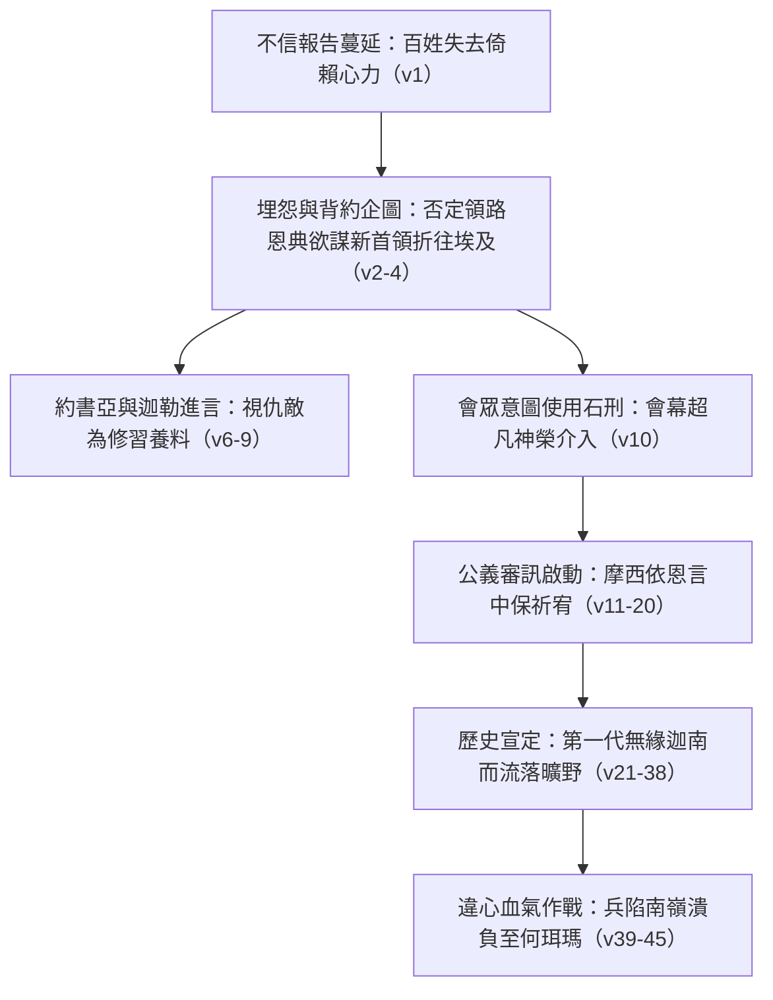

# 民數記 第14章

<!-- chapter-navigation:start -->
| [前一章](../04%20民數記/第13章.md) | [回目錄](../04%20民數記/全書目錄及綱要.md) | [下一章](../04%20民數記/第15章.md) |
| :--- | :---: | ---: |
<!-- chapter-navigation:end -->

1. 當下，全會眾大聲喧嚷；那夜百姓都哭號。
2. 以色列眾人向摩西、亞倫發怨言；全會眾對他們說：巴不得我們早死在埃及地，或是死在這曠野。
3. 耶和華為什麼把我們領到那地，使我們倒在刀下呢？我們的妻子和孩子必被擄掠。我們回埃及去豈不好嗎？
4. 眾人彼此說：我們不如立一個首領回埃及去吧！
5. 摩西、亞倫就俯伏在以色列全會眾面前。
6. 窺探地的人中，嫩的兒子約書亞和耶孚尼的兒子迦勒撕裂衣服，
7. 對以色列全會眾說：我們所窺探、經過之地是極美之地。
8. 耶和華若喜悅我們，就必將我們領進那地，把地賜給我們；那地原是流奶與蜜之地。
9. 但你們不可背叛耶和華，也不要怕那地的居民；因為他們是[[仇敵是我們的食物|我們的食物]]，並且蔭庇他們的已經離開他們。有耶和華與我們同在，不要怕他們！
10. 但全會眾說：拿石頭打死他們二人。忽然，[[耶和華的榮光與會幕的及時顯現|耶和華的榮光]][[耶和華的榮光與會幕的及時顯現|在會幕中向以色列眾人顯現]]。
11. 耶和華對摩西說：這百姓藐視我要到幾時呢？我在他們中間行了這一切神蹟，他們還不信我要到幾時呢？
12. 我要用瘟疫擊殺他們，使他們不得承受那地，叫你的後裔成為大國，比他們強勝。
13. 摩西對耶和華說：埃及人必聽見這事；因為你曾施展大能，將這百姓從他們中間領上來。
14. 埃及人要將這事傳給迦南地的居民；那民已經聽見你─耶和華是在這百姓中間；因為你面對面被人看見，有你的雲彩停在他們以上。你日間在雲柱中，夜間在火柱中，在他們前面行。
15. 如今你若把這百姓殺了，如殺一人，那些聽見你名聲的列邦必議論說：
16. 耶和華因為不能把這百姓領進他向他們起誓應許之地，所以在曠野把他們殺了。
17. 現在求主大顯能力，照你所說過的話說：
18. 耶和華不輕易發怒，並有[[摩西代求與神的豐盛慈愛|豐盛的慈愛]]，赦免罪孽和過犯；萬不以有罪的為無罪，[[神公義追討與禍延子孫的釋經探討|必追討他的罪]]，[[神公義追討與禍延子孫的釋經探討|自父及子，直到三、四代]]。
19. 求你照你的大慈愛赦免這百姓的罪孽，好像你從埃及到如今常赦免他們一樣。
20. 耶和華說：我照著你的話赦免了他們。
21. 然我指著我的永生起誓，遍地要被我的榮耀充滿。
22. 這些人雖看見我的榮耀和我在埃及與曠野所行的神蹟，仍然[[試探神十次|試探我這十次]]，不聽從我的話，
23. 他們斷不得看見我向他們的祖宗所起誓應許之地。凡藐視我的，一個也不得看見；
24. 惟獨我的僕人迦勒，因他[[專心跟從主與另一個心志|另有一個心志]]，[[專心跟從主與另一個心志|專一跟從我]]，我就把他領進他所去過的那地；他的後裔也必得那地為業。
25. 亞瑪力人和迦南人住在谷中，明天你們要轉回，從紅海的路往曠野去。
26. 耶和華對摩西、亞倫說：
27. 這惡會眾向我發怨言，我忍耐他們要到幾時呢？以色列人向我所發的怨言，我都聽見了。
28. 你們告訴他們，耶和華說：我指著我的永生起誓，我必要照你們達到我耳中的話待你們。
29. 你們的屍首必倒在這曠野，並且你們中間凡被數點、從二十歲以外、向我發怨言的，
30. 必不得進我起誓應許叫你們住的那地；惟有耶孚尼的兒子迦勒和嫩的兒子約書亞才能進去。
31. 但你們的婦人孩子，就是你們所說、要被擄掠的，我必把他們領進去，他們就得知你們所厭棄的那地。
32. 至於你們，你們的屍首必倒在這曠野；
33. 你們的兒女必在[[曠野飄流四十年]]，擔當你們淫行的罪，直到你們的屍首在曠野消滅。
34. 按你們窺探那地的四十日，一年頂一日，你們要[[曠野飄流四十年|擔當罪孽四十年]]，就知道我與你們疏遠了，
35. 我─耶和華說過，我總要這樣待這一切聚集敵我的惡會眾；他們必在這曠野消滅，在這裡死亡。
36. 摩西所打發、窺探那地的人回來，報那地的惡信，叫全會眾向摩西發怨言，
37. 這些[[報惡信之人的瘟疫與存活者|報惡信的人都遭瘟疫]]，死在耶和華面前。
38. 其中惟有嫩的兒子約書亞和耶孚尼的兒子迦勒[[報惡信之人的瘟疫與存活者|仍然存活]]。
39. 摩西將這些話告訴以色列眾人，他們就甚悲哀。
40. 清早起來，上山頂去，說：我們在這裡，我們有罪了；[[假意悔改與冒死擅自作戰|情願上耶和華所應許的地方去]]。
41. 摩西說：你們為何違背耶和華的命令呢？這事不能順利了。
42. 不要上去；因為耶和華不在你們中間，恐怕你們被仇敵殺敗了。
43. 亞瑪力人和迦南人都在你們面前，你們必倒在刀下；因你們退回不跟從耶和華，所以他必不與你們同在。
44. 他們卻[[假意悔改與冒死擅自作戰|擅敢上山頂去]]，然而耶和華的約櫃和摩西沒有出營。
45. 於是亞瑪力人和住在那山上的迦南人都下來擊打他們，把他們[[迦南大敗直到何珥瑪|殺退了，直到何珥瑪]]。

---

## 本章知識節點

### 神學
- [[仇敵是我們的食物]]
- [[摩西代求與神的豐盛慈愛]]
- [[專心跟從主與另一個心志]]

### 歷史
- [[迦南大敗直到何珥瑪]]
- [[曠野飄流四十年]]

### 互文
- [[試探神十次]]

### 事件
- [[報惡信之人的瘟疫與存活者]]
- [[假意悔改與冒死擅自作戰]]

### 解經爭議
- [[神公義追討與禍延子孫的釋經探討]]

### 主題
- [[耶和華的榮光與會幕的及時顯現]]

---

## 本章整理

### 百姓的失信宣洩與領導體制的危機（v1-4）

民數記第14章承接上章十二探子歸來後的矛盾匯報，紀錄了全體以色列人因為屈從現實恐懼與眼見的威脅，於加低斯巴尼亞演變成一場全面的信心背馳與群體反逆：「當下，全會眾大聲喧嚷；那夜百姓都哭號。以色列眾人向摩西、亞倫發怨言；全會眾對他們說：巴不得我們死在埃及地，或者死在這曠野！耶和華為什麼把我們領到那地，使我們倒在刀下呢？我們的妻子和孩子必被擄掠。我們回埃及去豈不更好嗎？眾人彼此說：我們不如立一個首領回埃及去吧！」（v1-4）。

在學術的屬靈解構中，此處呈現的不僅是情緒性的崩解，而是在本質上否定出埃及的救贖初衷與立約基礎。黃迦勒在《基督徒文摘解經系列》（CT）中闡言：「遇難處退縮與怨言，本質是將眼前的挑戰極度放大，同時將過往親歷的神蹟見證予以虛無化。」更深一層探討，百姓的抗言已轉化為對上主性情與引導的質疑：他們把得勝的呼召曲解為造成群體消滅的禍途，並妄圖破壞神的委任順位，企圖另立領袖倒折歸向苦役場。正如 KingComments（KC）所指出：「一旦人在心中排除了信仰的臨在與應許，世俗的懼怕便會全權主導認知；選眾試圖倒退往長期被宰制之地，反放棄了必須憑信跨越關隘的生命晉階權益。」這不僅折斷了順進領取的直行道路，也拉開了隨後長達四十餘年曠野洗煉的序幕。

```mermaid
flowchart TD
    A["不信報告蔓延：百姓失去倚賴心力（v1）"] --> B["埋怨與背約企圖：否定領路恩典欲謀新首領折往埃及（v2-4）"]
    B --> C1["約書亞與迦勒進言：視仇敵為修習養料（v6-9）"]
    B --> C2["會眾意圖使用石刑：會幕超凡神榮介入（v10）"]
    C2 --> D["公義審訊啟動：摩西依恩言中保祈宥（v11-20）"]
    D --> E["歷史宣定：第一代無緣迦南而流落曠野（v21-38）"]
    E --> F["違心血氣作戰：兵陷南嶺潰負至何珥瑪（v39-45）"]
```

### 堅持聖言的表白與會幕神榮的彰顯（v5-10）

面對全會眾反向浪潮的逼臨，領袖摩西與亞倫選擇自降身段：「就俯伏在以色列全會眾面前」（v5）。他們不出自氣血抗辯，而是知解此等逆意對神聖同在的威脅而落向代跪與哀懇。就在全眾徬徨沉淪時，早嘗應許良木實體的兩位代表「嫩的兒子約書亞和耶孚尼的兒子迦勒撕裂衣服」（v6），毫無動搖地在主民會眾間開口見證，提出極端純毅之聲譽銘文：「我們所窺探、經過之地是極美之地。耶和華若喜悅我們，就必將我們領進那地，把地賜給我們；那地原是流奶與蜜之地。但你們不可背叛耶和華，也不要怕那地的居民；因為那等難堪的敵手正是 [[仇敵是我們的食物|我們的養料與鍛鍊支撐]]；並且蔭庇他們的已經離開他們。有耶和華與我們同在，不要怕他們！」（v7-9）。

此宣言建構起極端分歧的新一代戰論釋義：持信代表的眼光絕無跳脫敵人客觀存在的真相，卻把敵我量度交融於主的保證下；凡面臨的高阻大障，全能主皆足以轉安為厚扶靈魂堅壯向得勝路晉升進級的純強滋養（CT 註疏解析：「畏懼者以艱危似為要吞噬居住人的險淵，而至高前鋒反把大難看待為上帝給予修葺成事品德的恩養盛饌；只要高天之防衛不歇，即便仇敵浩大亦不能折抑我們。」）。不幸的是，心生亂念與自閉視野的大組群非但不求清解，更妄喊道：「拿石頭打死他們二人！」就在暴眾高揚兇舉刻間，「忽然，[[耶和華的榮光與會幕的及時顯現|會幕中盛放榮光燦耀護庇]]！」（v10）。上主無可踰越的大榮譽與神蹟顯現至此介入，及時將不順遂之抗行折停，奠立並固守主張真理事物的核心話言，開啟與全眾的長線審度。

| 兩極爭判的心志拉扯 | 評價戰場與困難之基礎架構 | 立即引至的雙重反向裁遇 |
| :--- | :--- | :--- |
| **反逆失信會團眾人** | 倚仰人眼看偉軀強豪如崇嶺、降矮自己如同無防脆弱草蟲 | 招來直向發布的神怒警訊與無份晉入領地（KC） |
| **專誠仗信的探測首領** | 堅持上帝無上約定與誓詞、將險峙艱阻視為靈魂與生命的培育糧食 | 得蒙會幕威光立即介入保護並獲得承受天道之許可（CT） |

### 公義震動下的刑旨與摩西的中介禱訴（v11-20）

會幕榮光降止群怨後，耶和華對於長期屢屢冒失威儀之民團開啟嚴酷之訊宣：「這百姓藐視我要到幾時呢？我在他們中間行了這一切神蹟，他們不信我要到幾時呢？我要用瘟疫擊殺他們，使他們不得為業，又使你成為大國，比他們強盛。」（v11-12）。在學界釋經結構中，此言顯著印出誓命與公義的相涉關係：頻次挑戰恩光並輕慢主同在者，在法度中具有直接遭排除於應許以外之法理基礎；天旨亦闡釋得以讓逆眾消沈而由先知一家獨立發展為廣遠民族之公權力。

但在可能獨立揚宗壯大的歷史選擇前，摩西充分實現出作為和好與拯救中保的角色美德：他完全未貪婪被升作唯一強盛脈系的想法，直接轉身站立在天地之主台前發起了長切的大禱論 —— [[摩西代求與神的豐盛慈愛]]。其一，摩西高度關切上帝威儀與歷史宣信在天下各大國防中的千古聲望：「埃及人必聽見這事……他們必對這地的居民說：耶和華因為不能把這百姓領進祂向他們起誓應許之地，所以在曠野把他們殺了。」（v13-16）；若致各路對立勢力誣陷上天大德無法兼程載民抵至迦南定域，則是無法承坐的史前折辱。其二，摩西堅守上帝在西乃山曾宣布的話說恩義：「現在求主大顯其力，正如你所說的話……耶和華不輕易發怒，並有豐盛的慈愛，赦免罪孽和過犯；萬不以有罪的為無罪，必追討他的罪，自父及子，直到三、四代。」（v17-18）。就在此處經義「既具有廣慈赦過無限恩典、又帶有嚴正追擊罪業至三、四代」這表層二元對讀關係及與後卷以西結書個人自治受審的平衡結合裡，學者集大成總整成了周嚴的 [[神公義追討與禍延子孫的釋經探討]]；如《精讀本》及深藏系統神論釐知：生死得救的責任是個體面對上帝裁示之獨自命題，然而歷史與倫理過謬在整個社團傳代氛圍與大自然處境裡，必造成連續性的世代現實沉果；前賢棄命退怯，後續的幼子雖然獲赦，亦需隨同承受曠野風乾荒年的群聚時局代價。終於，上帝應准中介所求回答：「我照著你的話赦免了他們」（v20），阻止即場廢去民族存亡之大譴，留下轉渡於將來的餘生血系。

### 代償長遊與十探終局與擅行敗離（v21-45）

主上帝雖然在神聖饒恕裡收走破殺即死災，卻不可把一意背順與藐視實約的操作淡化為毫無因致；由此宣告了一項沒有折還空間的現實裁斷：「然而我指著我的永生起誓，遍地要被我的榮耀充滿。這些人雖看見我的榮耀和我在埃及與曠野所行的神蹟，仍然 [[試探神十次|「一連在十項具體危機與抱怨事件上抗拒信心的背命群眾」]]，不聽從我的話，他們斷不得看見我向他們的祖宗所起誓應許之地！」（v21-23）。這裡指出的古史總錄提醒，自出離紅海、抵達瑪拉苦水、吃用嗎哪以及抵達加低斯等多方起怨，均是對天地眷憐恩典本質之抗逆，終也引申出他們一生喪亡跨向樂境資格的宿果；惟在普遍跌仆退後者之中閃映一枚高星 —— [[專心跟從主與另一個心志|擁有卓越純堅和純厚信念的迦勒等人]] —— 受授獨持不廢的新約進步名望：「惟獨我的僕人迦勒，因他另有一個心志，專一跟從我，我就把他領進他所去過的那地；他的後裔也必得那地為業。」（v24）。

對揚聲控斥稚齡小孩將任憑他人掠辱的女老一族，耶和華發射出高度公平而震人深思的時間裁判答錄：「你們的屍首必倒在這曠野……但你們的婦人孩子，就是你們所說、要被擄掠的，我必把他們領進去，他們就得知你們所厭棄的那地！」（v29-31）；立下那漫居荒野修習的著名階段 —— [[曠野飄流四十年|「四十年間年替一日之漫長考掘與轉序飄移」]]：「你們的兒女必在曠野飄流四十年，擔當你們淫行的罪，直到你們的屍首在曠野消滅。按你們窺探那地的四十日，一年頂一日，你們要擔當罪孽四十年，就知道我與你們疏遠了。」（v33-34）。與之對等的公正神權同步降至推波眾議的主犯面前：那批用荒唐修辭放大險勢、使全聚喪膽倡退的十個報任大將頓落入災變中，呈現了 [[報惡信之人的瘟疫與存活者|「遭受集體瘟禍在主前立斃的明確果報」]]：「這些報惡信的人都遭瘟疫，死在耶和華面前。其中惟有嫩的兒子約書亞和耶孚尼的兒子迦勒仍然存活。」（v37-38）；繪構明澈順逆之存毀極限壁壘。

當最終把那無可挽回的世代漫隱命終宣讀出，「他們就甚悲哀」（v39）。可嘆這深重的哭愁仍未真正把群倫領投於順受天譴、安度曠途的沉靜修信，竟興成了試投妄進、求靠激鬥去博抹反訓自為罪失，產生了充滿沉痛意旨的 [[假意悔改與冒死擅自作戰|「表層自痛後昧往山脊出征之大不幸遭遇」]]：「清早起來，上山頂去，說：我們在這裡，我們有罪了；情願上耶和華所應許的地方去。」（v40）。這種憑意自居的一步冒行本身就是向昨日「清楚宣告明日往大漠折回」天敕的抗禦大不忠；領隊摩西極盡竭聲喝勸制衡：「你們為何違背耶和華的命令呢？這事不能順利了。不要上去；因為耶和華不在你們中間，恐怕你們被仇敵殺敗了……！」（v41-43）。

然驕傲盲力使人閉而不悟，「他們卻擅敢上山頂去，然而耶和華的約櫃和摩西沒有出營。」（v44）。少了領主護陣與盟約方舟陪伴，便是把赤血血軍無力推進於對手利壁前。聖字續而沉錄下蒙折悲傷的結局 —— [[迦南大敗直到何珥瑪|「慘負亞瑪力兵和在地眾人攻仆追獵至於南域深土何珥瑪」]]：「於是亞瑪力人和住在那山上的迦南人都下來擊打他們，把他們殺退了，直到何珥瑪。」（v45）。何珥瑪於古代聖文中蘊含了把萬類變為徹底廢墟與灰劫處的深入內意，明切向各歷史信仰社眾揚露：上帝護育與開工一旦落定不偕行，依抗天道心生愧行與自我逞強再出征，莫可救贖違命狂言的失算過錯，終只換授於漫天敗潰慘落的史路歧途！

> [!CAUTION] 憑己心意奮起征討與遵意降服於天示審判的兩種靈途
>
> - **自為冒名出征（悲情之下的擅鬥作風）**：怕遭常年砂野洗練，罔聽神定歸漠回轉命旨，於約櫃與主領未嘗偕去下強攻高阜，被打落受砍直推向南方 **何珥瑪** 之「澈底終廢與損壞地」。
> - **謙良受審隨命（接納責陶的穩篤重育）**：降伏一氣浮哀，靜心安受世父命頒之四十暑載鍛新大限，在中途荒涼洗滌處鍛鍊虔敬信望，等候下一段歷史時刻蒙牽而返、歡臨應地。

**參考資料**
https://www.ccbiblestudy.org/Old%20Testament/04Num/04CT14.htm
https://www.ccbiblestudy.org/Old%20Testament/04Num/04GT14.htm
https://www.kingcomments.com/en/bible-studies/Num/14
https://biblehub.com/study/numbers/14.htm

<!-- appendix-links:start -->
## 附錄

### 相關地圖
- [[appendix/fhl_maps/maps/021|〈民圖二〉探查應許地和應許地的範圍]]
- [[appendix/fhl_maps/maps/025|〈申圖一〉應許之地全圖]]
- [[appendix/fhl_maps/maps/078|〈代上圖二〉迦勒的子孫所居之城]]
<!-- appendix-links:end -->

<!-- chapter-navigation:start -->
| [前一章](../04%20民數記/第13章.md) | [回目錄](../04%20民數記/全書目錄及綱要.md) | [下一章](../04%20民數記/第15章.md) |
| :--- | :---: | ---: |
<!-- chapter-navigation:end -->
