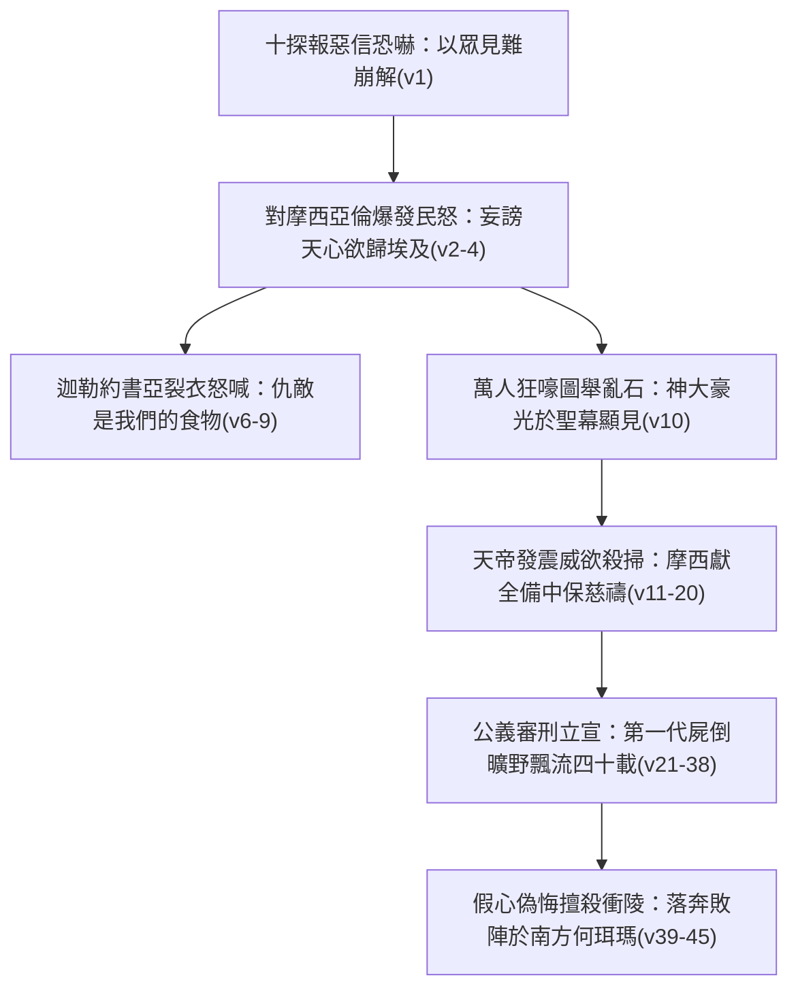

# 民數記 第14章

1. 當下，全會眾大聲喧嚷；那夜百姓都哭號。
2. 以色列眾人向摩西、亞倫發怨言；全會眾對他們說：巴不得我們早死在埃及地，或是死在這曠野。
3. 耶和華為什麼把我們領到那地，使我們倒在刀下呢？我們的妻子和孩子必被擄掠。我們回埃及去豈不好嗎？
4. 眾人彼此說：我們不如立一個首領回埃及去吧！
5. 摩西、亞倫就俯伏在以色列全會眾面前。
6. 窺探地的人中，嫩的兒子約書亞和耶孚尼的兒子迦勒撕裂衣服，
7. 對以色列全會眾說：我們所窺探、經過之地是極美之地。
8. 耶和華若喜悅我們，就必將我們領進那地，把地賜給我們；那地原是流奶與蜜之地。
9. 但你們不可背叛耶和華，也不要怕那地的居民；因為他們是[[仇敵是我們的食物|我們的食物]]，並且蔭庇他們的已經離開他們。有耶和華與我們同在，不要怕他們！
10. 但全會眾說：拿石頭打死他們二人。忽然，[[耶和華的榮光與會幕的及時顯現|耶和華的榮光]][[耶和華的榮光與會幕的及時顯現|在會幕中向以色列眾人顯現]]。
11. 耶和華對摩西說：這百姓藐視我要到幾時呢？我在他們中間行了這一切神蹟，他們還不信我要到幾時呢？
12. 我要用瘟疫擊殺他們，使他們不得承受那地，叫你的後裔成為大國，比他們強勝。
13. 摩西對耶和華說：埃及人必聽見這事；因為你曾施展大能，將這百姓從他們中間領上來。
14. 埃及人要將這事傳給迦南地的居民；那民已經聽見你─耶和華是在這百姓中間；因為你面對面被人看見，有你的雲彩停在他們以上。你日間在雲柱中，夜間在火柱中，在他們前面行。
15. 如今你若把這百姓殺了，如殺一人，那些聽見你名聲的列邦必議論說：
16. 耶和華因為不能把這百姓領進他向他們起誓應許之地，所以在曠野把他們殺了。
17. 現在求主大顯能力，照你所說過的話說：
18. 耶和華不輕易發怒，並有[[摩西代求與神的豐盛慈愛|豐盛的慈愛]]，赦免罪孽和過犯；萬不以有罪的為無罪，[[神公義追討與禍延子孫的釋經探討|必追討他的罪]]，[[神公義追討與禍延子孫的釋經探討|自父及子，直到三、四代]]。
19. 求你照你的大慈愛赦免這百姓的罪孽，好像你從埃及到如今常赦免他們一樣。
20. 耶和華說：我照著你的話赦免了他們。
21. 然我指著我的永生起誓，遍地要被我的榮耀充滿。
22. 這些人雖看見我的榮耀和我在埃及與曠野所行的神蹟，仍然[[試探神十次|試探我這十次]]，不聽從我的話，
23. 他們斷不得看見我向他們的祖宗所起誓應許之地。凡藐視我的，一個也不得看見；
24. 惟獨我的僕人迦勒，因他[[專心跟從主與另一個心志|另有一個心志]]，[[專心跟從主與另一個心志|專一跟從我]]，我就把他領進他所去過的那地；他的後裔也必得那地為業。
25. 亞瑪力人和迦南人住在谷中，明天你們要轉回，從紅海的路往曠野去。
26. 耶和華對摩西、亞倫說：
27. 這惡會眾向我發怨言，我忍耐他們要到幾時呢？以色列人向我所發的怨言，我都聽見了。
28. 你們告訴他們，耶和華說：我指著我的永生起誓，我必要照你們達到我耳中的話待你們。
29. 你們的屍首必倒在這曠野，並且你們中間凡被數點、從二十歲以外、向我發怨言的，
30. 必不得進我起誓應許叫你們住的那地；惟有耶孚尼的兒子迦勒和嫩的兒子約書亞才能進去。
31. 但你們的婦人孩子，就是你們所說、要被擄掠的，我必把他們領進去，他們就得知你們所厭棄的那地。
32. 至於你們，你們的屍首必倒在這曠野；
33. 你們的兒女必在[[曠野飄流四十年]]，擔當你們淫行的罪，直到你們的屍首在曠野消滅。
34. 按你們窺探那地的四十日，一年頂一日，你們要[[曠野飄流四十年|擔當罪孽四十年]]，就知道我與你們疏遠了，
35. 我─耶和華說過，我總要這樣待這一切聚集敵我的惡會眾；他們必在這曠野消滅，在這裡死亡。
36. 摩西所打發、窺探那地的人回來，報那地的惡信，叫全會眾向摩西發怨言，
37. 這些[[報惡信之人的瘟疫與存活者|報惡信的人都遭瘟疫]]，死在耶和華面前。
38. 其中惟有嫩的兒子約書亞和耶孚尼的兒子迦勒[[報惡信之人的瘟疫與存活者|仍然存活]]。
39. 摩西將這些話告訴以色列眾人，他們就甚悲哀。
40. 清早起來，上山頂去，說：我們在這裡，我們有罪了；[[假意悔改與冒死擅自作戰|情願上耶和華所應許的地方去]]。
41. 摩西說：你們為何違背耶和華的命令呢？這事不能順利了。
42. 不要上去；因為耶和華不在你們中間，恐怕你們被仇敵殺敗了。
43. 亞瑪力人和迦南人都在你們面前，你們必倒在刀下；因你們退回不跟從耶和華，所以他必不與你們同在。
44. 他們卻[[假意悔改與冒死擅自作戰|擅敢上山頂去]]，然而耶和華的約櫃和摩西沒有出營。
45. 於是亞瑪力人和住在那山上的迦南人都下來擊打他們，把他們[[迦南大敗直到何珥瑪|殺退了，直到何珥瑪]]。

<!-- fhl-map-links:start -->
## 相關地圖

- [[appendix/fhl_maps/maps/021|〈民圖二〉探查應許地和應許地的範圍]]
- [[appendix/fhl_maps/maps/025|〈申圖一〉應許之地全圖]]
- [[appendix/fhl_maps/maps/078|〈代上圖二〉迦勒的子孫所居之城]]
<!-- fhl-map-links:end -->

---

## 本章知識節點

### 神學
- [[仇敵是我們的食物]]
- [[摩西代求與神的豐盛慈愛]]
- [[專心跟從主與另一個心志]]

### 歷史
- [[迦南大敗直到何珥瑪]]
- [[曠野飄流四十年]]

### 互文
- [[試探神十次]]

### 事件
- [[報惡信之人的瘟疫與存活者]]
- [[假意悔改與冒死擅自作戰]]

### 解經爭議
- [[神公義追討與禍延子孫的釋經探討]]

### 主題
- [[耶和華的榮光與會幕的及時顯現]]

---

## 本章整理

### 不信者的喧嚷、哭號與策謀反叛（v1-4）

民數記第十四章揭開了整個舊約選民歷史中最令人痛心疾首的關鍵轉折——因聽信絕大多數探子（十個報惡信者）對迦南地的誇大恐嚇，全體會眾於加低斯巴尼亞徹底爆發了全民的反叛狂熱與不信浪潮。經文第一至四節以強烈的心理與感官描寫呈現這場信仰崩塌：「當下，全會眾大聲喧嚷；那夜百姓都哭號。以色列眾人向摩西、亞倫發怨言；全會眾對他們說：巴不得我們死在埃及地，或者死在這曠野！耶和華為什麼把我們領到那地，使我們倒在刀下呢？我們的妻子和孩子必被擄掠。我們回埃及去豈不更好嗎？眾人彼此說：我們不如立一個首領回埃及去吧！」

在這段描繪中，黃迦勒在《基督徒文摘解經系列》（CT）裡痛惜並深刻揭曉：「那夜百姓都哭號……人最沒有理性的表現，就是遇難處折苦哀嚎；眼見難處被大肆擴張，忘卻曾經見證的上神榮耀大能。」更嚴重的是，他們的埋怨早已不是單純對環境的嘆息，而是轉化為對至高神本身善意與動機的公然質疑與褻瀆。他們把上帝拯救的浩瀚恩典歪曲為要把他們屠殺並「辱擄其妻子孩童」的毀滅險途；並妄言欲「另立一位君領引路倒退走返埃及奴邦」。如《KingComments》（KC）精準評價：「只要信仰的核心一度失去了耶和華的偉岸同在，肉眼的恐懼就會奪走全心；百姓此舉其實是向拯救他們出火爐的造物主揚眉宣戰，寧從屬地長命受苦之奴役，而拒承須持定聖神之勇進仗戰名譽。」這無底線的回倒企圖，釀成了以色列民族進入大荒漠長達三十餘載折磨的浩大開端。

```mermaid
flowchart TD
  A["十探報惡信恐嚇：以眾見難崩解(v1)"] --> B["對摩西亞倫爆發民怒：妄謗天心欲歸埃及(v2-4)"]
  B --> C1["迦勒約書亞裂衣怒喊：仇敵是我們的食物(v6-9)"]
  B --> C2["萬人狂嚎圖舉亂石：神大豪光於聖幕顯見(v10)"]
  C2 --> D["天帝發震威欲殺掃：摩西獻全備中保慈禱(v11-20)"]
  D --> E["公義審刑立宣：第一代屍倒曠野飄流四十載(v21-38)"]
  E --> F["假心偽悔擅殺衝陵：落奔敗陣於南方何珥瑪(v39-45)"]
```

### 濁流中的清流：信心的怒喊與榮光的急援（v5-10）

面對這如天崩巨嘯般的平民叛亂，摩西與亞倫兩位謙順牧長無以對抗，「就俯伏在以色列全會眾面前」（v5），絕口不在自傲裡為個人品性表白，而是深刻為即將臨到全族的滔天大譴恐懼仆倒於恩殿虛冥前。在此黑暗時刻，親身歷行了天土的青年雄才「嫩的兒子約書亞和耶孚尼的兒子迦勒撕裂衣服」（v6），毫無顧忌地揚聲力阻狂民之迷妄。二人共同發出了全本聖經至為震動人心的至高信仰告白：「我們所窺探、經過之地是極美之地。耶和華若喜悅我們，就必將我們領進那地，把地賜給我們；那地原是流奶與蜜之地。但你們不可背叛耶和華，也不要怕那地的居民；因為[[仇敵是我們的食物]]，並且蔭庇他們的已經離開他們。有耶和華與我們同在，不要怕他們！」（v7-9）。

此句至誠喊語刻立下高廣的神學哲境：真正的勇僕決非把困難視而不見，而是將其置入上帝無與倫比的大威下秤衡；凡有大難前路，皆為鍛長聖兵豪氣的豐富養料與高靈滋食。 CT 註疏讚說：「別人的眼光看難度如吞居客之地，兩人卻將仇敵奉為營養的實物！因為上帝正是要把一切危阻作給信僕充肌體長勝的無價天宴；敵背上的守護已逝，神愛相駐便必橫驅千軍。」可惜，百萬不辨神意、沉塞肉眼的蠢動盲眾不單拒聽，「但全會眾說：拿石頭打死他們二人！」就在利石將作致命急雨降墮於見證兵將的千鈞瞬刻，「忽然，[[耶和華的榮光與會幕的及時顯現]]！」上帝未敢延安片分，自大靈帳高尖吐發萬鈞刺耀無朋的新震聖威，瞬間把千軍萬馬的不軌狂勇給懾落震仆。這極偉亮火展示出無限君皇為順服宣其美誓的真聖大僕親作無限神盾護從的不撓盟規。

| 民間兩方勢力對持 | 神智理念與眼光焦點 | 當天得見的立即反面待遇 |
| --- | --- | --- |
| **背約抗令十長與千百流眾** | 單向俯望偉人如擎尺泰山、自甘降格認如衰小草蚱 | 立即惹落耶和華神聖震災與大怒降擊（KC） |
| **純神主將約書亞與迦勒** | 仰瞻創空上帝無上信宣、堅視高陵仇陣皆為至甘靈食 | 大豪光從幕殿奔展救援並承准永久賜進榮業（CT） |

### 上帝的怒怒揚威與摩西的深沈代求（v11-20）

會幕的震烈顯光不僅僅為了喝阻殺氣，更是天主君義受損之痛刑臨譴。耶和華向摩西出怒直問：「這百姓藐視我要到幾時呢？我在他們中間行了這一切神蹟，他們不信我要到幾時呢？我要用瘟疫擊殺他們，使他們不得為業，又使你成為大國，比他們強盛。」（v11-12）這並非虛言或試探，而是造主被子民輕褻鄙抗十事以後，依法宣告將原定世代夷除而由靈將先知家族再創巨系之偉大天令。

然而在此獨榮天下的萬分恩選之際，先知摩西表現出了作為無上中介牧者與救贖象徵者的致深偉度；他拒受王道封土，全身投效於一通悲壯長深的神學和護代請中——[[摩西代求與神的豐盛慈愛]]。其一，摩西首先懸愛於上帝的威靈美聲於天地列強間的不破名節：「埃及人必聽見這事……他們必對這地的居民說：耶和華因為不能把這百姓領進祂向他們起誓應許之地，所以在曠野把他們殺了。」（v13-16）若遭外人譏訕造主的恩手僅在領人赴葬荒塗，乃莫大不宜。其二，他精切掌握了神昔日在西乃山自敞心腹的大自宣誓，呼喚名典：「現在求主大顯其力，正如你所說的話……耶和華不輕易發怒，並有豐盛的慈愛，赦免罪孽和過犯；萬不以有罪的為無罪，必追討他的罪，自父及子，直到三、四代。」（v17-18）對於這節經語中深藏的教理結構與後來人言子不用替亡命父擔愆一隙相疊處，學界提出周全的[[神公義追討與禍延子孫的釋經探討]]；如《精讀本》與古老訓要指證：個人的最後救死裁審純由自造定決，但身著天威家命的主在上垂社會與流歲長塗中必執守一以貫之的「群聚自然倫理果緣」；先代叛主而仆亡荒原，其小苗後代縱能入迦南，亦必被迫相佐走蕩漠野吃砂經年。終極，上天允諾垂恩言：「我照著你的話赦免了他們」（v20），保下了選民存續無消、成至勝大代祈里程。

### 神聖的嚴格公義裁決：四十年流亡與探子受殃（v21-38）

神雖豁除群眾遭霎時撲滅之浩劫，但絕不可把放縱抗逆與傲蔑不信視為無塵；聖帝遂於全眾耳內起下了浩瀚沉遠的審辦定奪。「然而我指著我的永生起誓，遍地要被我的榮耀充滿。這些人雖看見我的榮耀和我在埃及與曠野所行的神蹟，仍然[[試探神十次]]，不聽從我的話，他們斷不得看見我向他們的祖宗所起誓應許之地！」（v21-23）這段著名的歷史重刑名錄揭亮，自出海度路直至加低斯這十回叫喧皆是一番挑弄神耐、踩割恩眷的放任狂心，他們即此徹底盡毀邁足美野的天權；然而唯有極為璀璨的一星——[[專心跟從主與另一個心志]]的極選忠僕得以獲寵：「惟獨我的僕人迦勒，因他另有一個心志，專一跟從我，我就把他領進他所去過的那地；他的後裔也必得那地為業。」（v24）

繼而，耶和華對那批滿腹哀怨、妄喊妻孫當作奴奴虜掠者的成年反骨群發放深冷長命裁判：「你們的屍首必倒在這曠野……但你們的婦人孩子，就是你們所說、要被擄掠的，我必把他們領進去，他們就得知你們所厭棄的那地！」（v29-31）並正式宣告不可折改的歷史長塗——[[曠野飄流四十年]]：「你們的兒女必在曠野飄流四十年，擔當你們淫行的罪，直到你們的屍首在曠野消滅。按你們窺探那地的四十日，一年頂一日，你們要擔當罪孽四十年，就知道我與你們疏遠了。」（v33-34）。至上者的執平審決立即在最造因禍源中燃作烈燄：那組扯下誇誕危報震散國民決心的首倡禍星遭遇浩重神刑，成就了[[報惡信之人的瘟疫與存活者]]的高冷寫照：「這些報惡信的人都遭瘟疫，死在耶和華面前。其中惟有嫩的兒子約書亞和耶孚尼的兒子迦勒仍然存活。」（v37-38）瘟禍如同當代即刻降臨的天正刃剪，一舉掃盡倡亂主謀；相反，倚望至尊信命的兩員名將榮居安詳穩世之域，樹定不可磨棄的神光獎懲標誌。

### 假意的血氣後悔與在何珥瑪遭遇大潰退（v39-45）

當摩西把漫歲磨沉砂磧與父輩將全全倒歿荒山的嚴悲宣判告知百姓，「他們就甚悲哀」（v39）。無以復加的是，極度傷痛的心並沒有將其真正引往披麻投神、服承苦誓的真敬畏深省中；他們想出一條用自作勇毅來倒行平憤的妄險凶計，釀出了漫野浩嘆的[[假意悔改與冒死擅自作戰]]。「清早起來，上山頂去，說：我們在這裡，我們有罪了；情願上耶和華所應許的地方去。」（v40）此一番搶進晨征根本違逆全君昨言勒令「明天你們要轉回，從紅海的路往曠野去」之明鐵禁訓。神樸摩西立即哀聲厲呼與阻止：「你們為何違背耶和華的命令呢？這事不能順利了。不要上去；因為耶和華不在你們中間，恐怕你們被仇敵殺敗了……因你們退回不跟從耶和華，所以祂必不與你們同在！」（v41-43）。

但在驕氣強壓罪苦的神盲鼓使中，「他們卻擅敢上山頂去，然而耶和華的約櫃和摩西沒有出營。」（v44）一個既沒有上帝約櫃聖眷相伴、也沒有大君領者率隊帶兵的自我封將冒進，完全是在失去庇身防壘的前提下直撞死關。經文隨之烙印下屈辱而泣赤的大悲局——[[迦南大敗直到何珥瑪]]：「於是亞瑪力人和住在那山上的迦南人都下來擊打他們，把他們殺退了，直到何珥瑪。」（v45）『何珥瑪』一詞於希伯來神文具備雙關絕語，本意味堪享向神宣祈保護的聖境，卻因失了主同在而一沉淪至成了徹頭徹尾的「死荒與全盡滅盡場」；這沉痛末尾深深對世世聖君僕者疾敲警告：不在上帝的時針、不秉天恩伴順的個人武斷爭功與自悔奔陣，非但不能化回昔年叛戾，反而不過淪為偽飾下更荒無生息的次級狂反叛行！

> [!CAUTION] 擅行違命作戰與真正悔改降服於神裁決的危險警鑑
>
> - **表面偽真痛悔（擅敢征上）**：畏懼懲處、罔顧神已發離返漠野大裁決定，於沒有約櫃及摩西陪伴中硬提凶鋒闖侵山上，被亞瑪力兵砍沉奔屠直到南方 **何珥瑪** 之「徹絕廢壞地」。
> - **純淨奉承順心**：坦靜心接納天帝所施「四十年牧原礪金」漫長管削，於漫苦沉默中操練仰慕，待靈命成熟之君辰隨從新主將安享越向流奶天邦。

**參考資料**
https://www.ccbiblestudy.org/Old%20Testament/04Num/04CT14.htm
https://www.ccbiblestudy.org/Old%20Testament/04Num/04GT14.htm
https://www.kingcomments.com/en/bible-studies/Num/14
https://biblehub.com/study/numbers/14.htm
