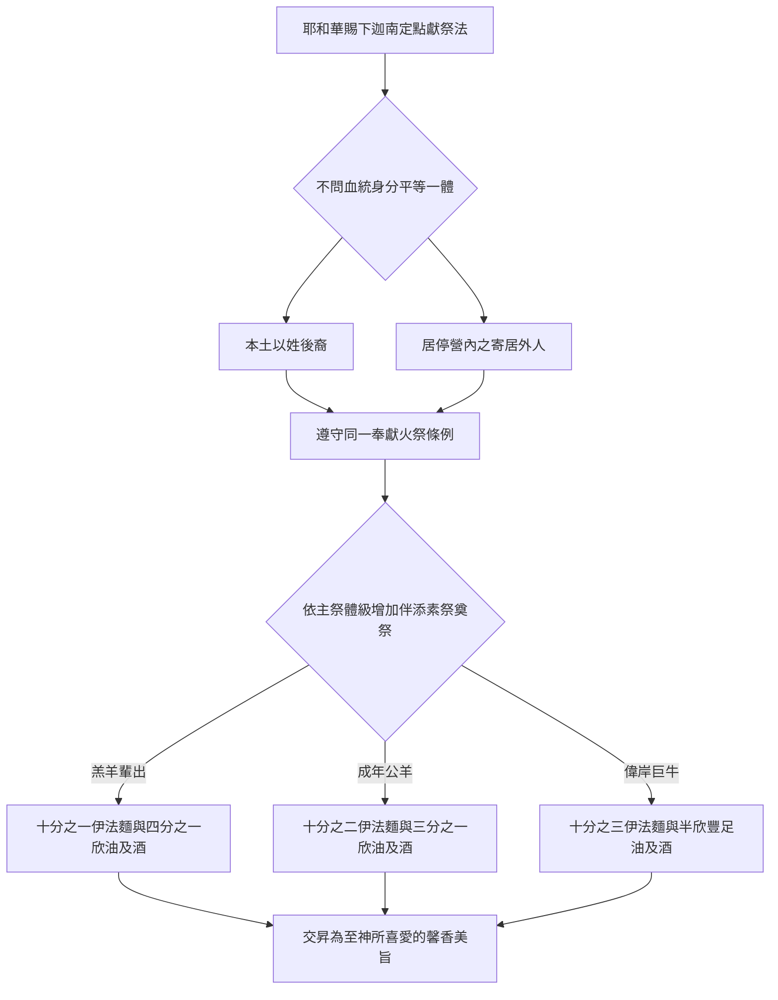
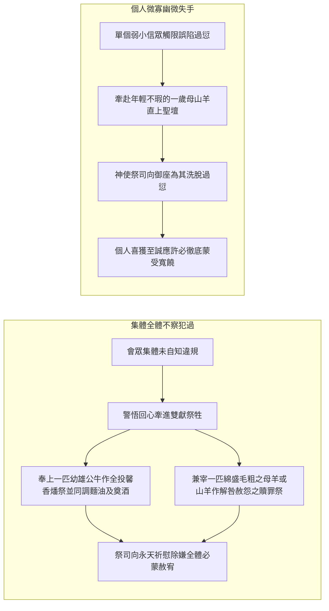
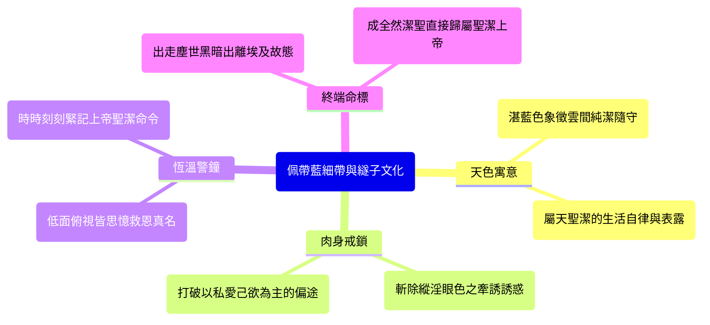

# 民數記 第15章

1. 耶和華對摩西說：
2. 你曉諭以色列人說：你們[[進迦南地後的獻祭定例與神愛恩慈|到了我所賜給你們居住的地]]，
3. 若願意從牛群羊群中取牛羊作火祭，獻給耶和華，無論是燔祭是平安祭，為要還特許的願，或是作甘心祭，或是逢你們節期獻的，都要奉給耶和華為[[燔祭平安祭同獻的素祭與奠祭比例|馨香之祭]]。
4. 那獻供物的就要將細麵伊法十分之一，並油一欣四分之一，[[燔祭平安祭同獻的素祭與奠祭比例|調和作素祭]]，獻給耶和華。
5. 無論是燔祭是平安祭，你要為每隻綿羊羔，一同預備[[燔祭平安祭同獻的素祭與奠祭比例|奠祭的酒]]一欣四分之一。
6. 為公綿羊預備細麵伊法十分之二，並油一欣三分之一，[[燔祭平安祭同獻的素祭與奠祭比例|調和作素祭]]，
7. 又用酒一欣三分之一[[燔祭平安祭同獻的素祭與奠祭比例|作奠祭]]，獻給耶和華為[[燔祭平安祭同獻的素祭與奠祭比例|馨香之祭]]。
8. 你預備公牛作燔祭，或是作平安祭，為要還特許的願，或是作平安祭，獻給耶和華，
9. 就要把細麵伊法十分之三，並油半欣，[[燔祭平安祭同獻的素祭與奠祭比例|調和作素祭]]，和公牛一同獻上，
10. 又用酒半欣[[燔祭平安祭同獻的素祭與奠祭比例|作奠祭]]，獻給耶和華為[[燔祭平安祭同獻的素祭與奠祭比例|馨香的火祭]]。
11. 獻公牛、公綿羊、綿羊羔、山羊羔，每隻都要這樣辦理。
12. 照你們所預備的數目，按著隻數都要這樣辦理。
13. 凡本地人將[[燔祭平安祭同獻的素祭與奠祭比例|馨香的火祭]]獻給耶和華，都要這樣辦理。
14. 若有外人和你們同居，或有人世世代代住在你們中間，願意將[[燔祭平安祭同獻的素祭與奠祭比例|馨香的火祭]]獻給耶和華，你們怎樣辦理，他也要照樣辦理。
15. 至於會眾，你們和[[本地人與寄居者同歸一例的律法精神|同居的外人都歸一例]]，作為你們世世代代永遠的定例，在耶和華面前，你們怎樣，寄居的也要怎樣。
16. 你們並與你們同居的外人當有[[本地人與寄居者同歸一例的律法精神|一樣的條例]]，[[本地人與寄居者同歸一例的律法精神|一樣的典章]]。
17. 耶和華對摩西說：
18. 你曉諭以色列人說：你們到了我所領你們[[進迦南地後的獻祭定例與神愛恩慈|進去的那地]]，
19. 吃那地的糧食，就要把舉祭獻給耶和華。
20. 你們要用[[初熟的麥子磨麵作餅作為舉祭|初熟的麥子]]磨麵，[[初熟的麥子磨麵作餅作為舉祭|做餅當舉祭奉獻]]；你們舉上，好像[[初熟的麥子磨麵作餅作為舉祭|舉禾場的舉祭]]一樣，
21. 你們世世代代要用[[初熟的麥子磨麵作餅作為舉祭|初熟的麥子]]磨麵，當舉祭獻給耶和華。
22. 你們有錯誤的時候，不守耶和華所曉諭摩西的這一切命令，
23. 就是耶和華藉摩西一切所吩咐你們的，自那日以至你們的世世代代，
24. [[全會眾誤行過錯與大眾贖罪定例|若有誤行，是會眾所不知道的]]，後來全會眾就要將一隻公牛犢作燔祭，並照典章把素祭和奠祭一同獻給耶和華為[[燔祭平安祭同獻的素祭與奠祭比例|馨香之祭]]，又獻一隻公山羊作贖罪祭。
25. 祭司要[[全會眾誤行過錯與大眾贖罪定例|為以色列全會眾贖罪]]，他們就[[全會眾誤行過錯與大眾贖罪定例|必蒙赦免]]，因為這是錯誤。他們又因自己的錯誤，把供物，就是向耶和華獻的火祭和贖罪祭，一併奉到耶和華面前。
26. 以色列全會眾和寄居在他們中間的外人就[[全會眾誤行過錯與大眾贖罪定例|必蒙赦免]]，因為這罪是百姓誤犯的。
27. [[個人誤犯過錯與一歲母山羊贖罪祭|若有一個人誤犯了罪]]，他就要獻[[個人誤犯過錯與一歲母山羊贖罪祭|一歲的母山羊作贖罪祭]]。
28. 那[[全會眾誤行過錯與大眾贖罪定例|誤行]]的人犯罪的時候，祭司要在耶和華面前[[個人誤犯過錯與一歲母山羊贖罪祭|為他贖罪]]，他就[[全會眾誤行過錯與大眾贖罪定例|必蒙赦免]]。
29. 以色列中的本地人和寄居在他們中間的外人，若[[全會眾誤行過錯與大眾贖罪定例|誤行]]了什麼事，必歸[[本地人與寄居者同歸一例的律法精神|一樣的條例]]，
30. 但那[[擅敢行事與褻瀆耶和華的剪除處分|擅敢行事的]]，無論是本地人是寄居的，他[[擅敢行事與褻瀆耶和華的剪除處分|褻瀆了耶和華]]，[[擅敢行事與褻瀆耶和華的剪除處分|必從民中剪除]]。
31. 因他[[擅敢行事與褻瀆耶和華的剪除處分|藐視耶和華的言語]]，[[擅敢行事與褻瀆耶和華的剪除處分|違背耶和華的命令]]，那人總要剪除；他的[[擅敢行事與褻瀆耶和華的剪除處分|罪孽要歸到他身上]]。
32. 以色列人在曠野的時候，遇見一個人[[曠野安息日撿柴事件與神明告處決|在安息日撿柴]]。
33. 遇見他[[曠野安息日撿柴事件與神明告處決|撿柴]]的人，就把他帶到摩西、亞倫並全會眾那裡，
34. 將他收在監內；因為[[曠野安息日撿柴事件與神明告處決|當怎樣辦他，還沒有指明]]。
35. 耶和華吩咐摩西說：總要把那人治死；全會眾要在[[曠野安息日撿柴事件與神明告處決|營外用石頭把他打死]]。
36. 於是全會眾將他帶到營外，[[曠野安息日撿柴事件與神明告處決|用石頭打死他]]，是照耶和華所吩咐摩西的。
37. 耶和華曉諭摩西說：
38. 你吩咐以色列人，叫他們世世代代在[[衣服邊的繸子與藍細帶子|衣服邊上做繸子]]，又在[[衣服邊的繸子與藍細帶子|底邊的繸子上]][[衣服邊的繸子與藍細帶子|釘一根藍細帶子]]。
39. 你們[[衣服邊的繸子與藍細帶子|佩帶這繸子]]，好叫你們看見就記念遵行耶和華一切的命令，[[不隨從己心眼目行邪淫與成為聖潔|不隨從自己的心意、眼目行邪淫]]，像你們素常一樣；
40. 使你們記念遵行我一切的命令，[[不隨從己心眼目行邪淫與成為聖潔|成為聖潔]]，[[不隨從己心眼目行邪淫與成為聖潔|歸與你們的神]]。
41. 我是耶和華─你們的神，曾把你們從埃及地領出來，要作你們的神。我是耶和華─你們的神。

<!-- fhl-map-links:start -->
## 相關地圖

- [[appendix/fhl_maps/maps/021|〈民圖二〉探查應許地和應許地的範圍]]
<!-- fhl-map-links:end -->

---

## 本章知識節點

### 主題
- [[進迦南地後的獻祭定例與神愛恩慈]]

### 神學
- [[燔祭平安祭同獻的素祭與奠祭比例]]
- [[本地人與寄居者同歸一例的律法精神]]
- [[初熟的麥子磨麵作餅作為舉祭]]
- [[全會眾誤行過錯與大眾贖罪定例]]
- [[個人誤犯過錯與一歲母山羊贖罪祭]]
- [[擅敢行事與褻瀆耶和華的剪除處分]]
- [[不隨從己心眼目行邪淫與成為聖潔]]

### 事件
- [[曠野安息日撿柴事件與神明告處決]]

### 文化
- [[衣服邊的繸子與藍細帶子]]

---

## 本章整理

### 審判後垂憐施恩與進入迦南美地的同獻定例（v1-16）

民數記第15章的開啟在整卷書的歷史與神學宏圖中，具有極為奇異與深遠的靈性治癒力。第14章記述了以色列全會眾因探子惡報而大發怨言、圖謀反叛，終究惹動上帝的震怒與公義宣判——除迦勒與約書亞之外，該世代凡二十歲以上背逆者悉數不得見我所起誓應許的那地，必須在曠野漂流磨損直至倒斃於荒岩之野（參十四29-33）。在充滿如此慘痛、嚴酷且令人絕望的死亡灰暗語意之後，第15章並非繼續渲染沉重的葬歌或荒土艱厄，卻突然由上帝平靜且無比堅定地開口：「耶和華對摩西說：你曉諭以色列人說：你們到了我所賜給你們居住的地…」（v1-2）。此處直言的 [[進迦南地後的獻祭定例與神愛恩慈]]，是整套舊約神學中最輝煌、最感人肺腑的恩典確切展演。誠如各家解經者的一致讚歎，丁良才註釋指稱：「這一句話暗指兩件事：一是以色列人在曠野少獻祭；二是以色列人將來必定到迦南。有註釋家以為神藉著這些吩咐，又要使百姓再起盼望」（GT），而《啟導本》亦直陳：「此處出現的作用，似在為前章所記的不幸事件加一註腳…神重申祂給以色列人先祖的應許，會繼續領他們進入迦南；獻祭之例中規定要用大量的細麵粉、油和酒，與祭牲同獻，正是他們能到應許美地的保證。否則，曠野那裡有這些出產？神的計畫不會因人的不信而放棄」（GT）。這種在嚴格管教下毫無損減地傳達神愛恩慈與來日確信的旨意，證明耶和華與以色列所立的盟約並不僅僅倚仗人心多變的感情與道德成績，而是安立於永恆立約主浩蕩純和的心智中；基督徒當明白：「生活上的富裕，常會使我們忘記神的恩典…若是沒有神賜恩，人一切的努力都要落在虛空裡」（CT）。

在進入那流奶與蜜的應許豐土之後，凡屬神名之會民若懷仰瞻恩之念，打算甘心情願，抑或因還願和遵守各項年節而興誠自願把群畜—包括長角粗偉的公牛及白淨純和的羊眾—牽入聖地築燒「馨香的火祭」，摩西嚴密陳明一道劃時代的新典：獻牲畜不可成片面之恩，皆須兼奉 [[燔祭平安祭同獻的素祭與奠祭比例]] 才能成為名正言順無可批評的頂上馨香火祭。無論是奉為一切交予毫無保留的燔祭，亦或表顯雙方共食長相歡慶的平安祭，凡是牽入一隻纖柔綿羊羔，同呈供物的信手必須掏提依比例備置成的調酥純油一欣四分之一及白細純淨麥麵伊法十分之一搓勻而成的好處素祭；而隨侍澆傾神案神火前的酒，是絕對不得省略的一欣四分之一甘苦厚奠。隨著所呈祭祀等級之逐步抬昂與體形昇大，配套的素祭麵油和奠宴烈香也要呈現階梯般準嚴無欺的對沖狂翻：遇有角堅體健的公綿羊獻上，素面倍添成兩整份（即伊法十分之二），好油香酒咸依足量上揚破為一欣三分之一；倘果真抬出最神明貴重、代表無限氣態勞作成器的公大猛牛，細純高湯油液飆上一整盤二分之一欣，連烘烙大糕麥沙都要翻高突破伊法十分之三。如此繁複豐盛、油脂潤郁、酒露香濃的供物大交會，遠非乾枯荒野自長而成，預告將來的歲月中上帝絕不會令他們缺乏農事厚恩與豐盛盈穀。而在新約屬靈的對照與靈意探索裡，各解經名家精準指出這些祭典元素所隱藏的奧理：「素祭表徵耶穌基督在世為人（細麵），因有聖靈（油）的調和，祂的生活全然無罪；奠祭表徵耶穌基督將祂自己澆奠給神」（CT）；KingComments 也深刻剖析：「這極其清晰的供奉法則不僅描畫得救者對主的感恩度數大出於從前，也顯明任何蒙悅的敬拜均奠基於至高大犧牲與他無罪馨香生命美德之交融，且以此成為父與子民同慶的至誠相遇」（KC）。

| 犧牲祭牲類別 | 細麵（素祭主糧） | 搗油（與麵和揉） | 烈酒（作奠祭傾灑） | 屬靈表徵與神學呼應 |
| :--- | :--- | :--- | :--- | :--- |
| 綿羊羔與山羊羔 | 伊法十分之一 | 一欣四分之一 | 一欣四分之一 | 表徵基本無罪替死羔羊的甘溫柔美，聖靈和諧扶攜的一生純粹行走。 |
| 成壯公綿羊 | 伊法十分之二 | 一欣三分之一 | 一欣三分之一 | 代表進階奉獻者更加深刻認清主德無疵與自盡澆奠的深刻誓守與信誠。 |
| 巨壯成熟公牛 | 伊法十分之三 | 一欣二分之一 | 一欣二分之一 | 顯露全然服從神大能、終盡大功順成到底並瀝竭心命無遺悔的榮高品格。 |

最讓人欽折的乃是：在這樣精密與威嚴的一大群神恩法例裡，上帝重口宣諭了無與倫比、衝開古代部落隔膜的公義寬懷——[[本地人與寄居者同歸一例的律法精神]]。古代理念常將血盟子民與遠涉留家寄養於邦內的外路人劃開尊卑嚴塹；然而耶和華在神聖崇拜上斬釘截鐵地聲訓：「至於會眾，你們和同居的外人都歸一例，作為你們世世代代永遠的定例，在耶和華面前，你們怎樣，寄居的也要怎樣。你們並與你們同居的外人當有一樣的條例，一樣的典章」（v15-16）。這一口氣連續採用「都歸一例」、「永遠的定例」、「寄居的也要怎樣」、「一樣的條例」、「一樣的典章」等毫無間隙的重啟絕詞，令各家中深感嘆息服仰。丁道爾《民數記註釋》直斥妄談而贊論：「本節的規矩，是要勉勵外人，也敬拜耶和華，不敬拜別神」（GT）；《啟導本》亦洞視至深：「事實上，神與人立約時早已包括萬族（創十二3）」（GT）；而黃迦勒更直接把目光投奔救贖遠圖：「適用於一切信徒；真神給人恩典與平等…在上帝殿宇和主宰之下毫無階格偏見與特屬壁壘」（CT）。正如現代研經者所直述，「獻祭條例是以色列人和居住在他們中間的外邦人都要遵守的條例，兩者之間沒有任何差別。這樣特別的法…暗示著猶太人和外邦人在神面前都是沒有任何差別的，都擁有能來到神面前的特權（羅三9-29；林前一22-25）」（GT）；BibleHub 亦提出真摯證道：「上帝是沒有偏見且長開恩門的主宰，在耶和華跟前完全平等的靈性接待，是新約救贖大合約超越國家宗派界線的最遠景見證，預繪將來普羅萬族在基督巨幅施愛之下共享共慶的浩烈合聲」（BH）。

### 獻上地利初熟的麥餅舉祭與真安息仰望（v17-21）

隨著祭典之步邁進迦南生活的深遠地土經營層次，神進一步把感恩與主權銘志深深釘刻在百姓日復一日食寢於人世大盤餐桌的基本舉動上，建立了永繼傳承的 [[初熟的麥子磨麵作餅作為舉祭]]。上帝對摩西開口：「你曉諭以色列人說：你們到了我所領你們進去的那地，吃那地的糧食，就要把舉祭獻給耶和華。你們要用初熟的麥子磨麵，做餅當舉祭奉獻；你們舉上，好像舉禾場的舉祭一樣；你們世世代代要用初熟的麥子磨麵，當舉祭獻給耶和華」（v18-21）。此處特別揭露：以色列人的農業生活從最初踏上這得之地起，一切收穫的第一筆成就、每一春開麥秋實成捆成麵成熱香大餅的第一撮粗造良糧，無論有多甜美動魄，都切忌私慾為安，一定要依循仰頌禮俗把它先高舉而呈。正知這「舉祭」在原文與祭場習例上的意義，「『舉祭』指將手中的祭物，垂直向上舉起，上下擺動，表示獻給神」（CT）；這也是對先前在荒林外向來依靠露天隨賜嗎哪而活生活狀態的美善過渡——一旦他們自力勞苦撒籽發禾，千萬不可以為憑自己的勤勇強悍自居成功，而要把那起原粗磨餅高仰天上，隨同神院使役官長的餐養分配共頌高上之安。

對於這真切深摯的家事敬奉儀式，《啟導本》留下了極富感染性與長遠透徹力之精彩解析：「說明一切的福氣由神而來，一切的出產為神所有。向神獻初熟之物早有定例，包括長子和頭生的牲畜（出二十二29-30；二十三19），現在把這個原則延伸到家居生活。主婦做餅，要把一份獻給神。猶太人二次被擄後仍保持此風俗，把餅投入家中的火爐裡當作『小祭』，火爐成為祭壇，每個家成為神的居所」（GT）。基督徒生命應時刻以此鑑戒為惕，深憶「生活上的富裕，常會使我們忘記神的恩典，總覺得那是我們努力奮發的結果。有一天，主會叫我們看見，若不是祂拖恩，人一切的努力都要落在虛空裡！」（CT）。而且探進救恩頂標，此法更有莫測至高妙寓：「這個初熟的麥子是所有穀物的代表，預表著耶穌基督，因為耶穌基督完成了人類的救贖工作成了獻給神的初熟的果子（羅八23；林前十五23；雅一18；啟十四14）」（GT）；KingComments 同時讚賞：「我們將這塊粗糙初獲的手作大餅朝天上舉搖高升，便是由衷吐露對那位無微不至救恩滋養大宰之全然倚任，這不僅是奉天神權治界不可搖退的安全根由，也是將家庭俗間粗薪煮炊生活化整為對上榮耀靈契奉侍的真致聖徑」（KC）。

> [!info] 初熟獻禮的家戶延伸與基督預表
> - **古近東與律法根源**：過往神已令眾人將牛羊長頭歸納（出22:29），並以禾場第一捆青搖穗送達帳堂（利23:10）；如今此命破入廚房手灶，使家庭母親巧搓和熱造好之最先那團全麥熟餅一律昇作獻主聖慶。無論是家常粗米或是盛宴初麵，皆出自上主豐盈的浩瀚恩遇！
> - **靈命得榮之奧義**：正如保羅在羅馬書中的見證：「所獻的新面若是聖潔，全團也就聖潔了」（羅十一16），透過初出鮮活的一塊奉納獻上，整個後繼浩如煙海得福有餘的耕活成果皆一律同被主默恩眷顧；此正是見證基督已從死裡復活出離，作了眾聖長眠深穴之人的輝偉初果！

### 集體與私微誤犯罪的免愆饒宥定則（v22-29）

人既被賜有高舉尊顯聖職之重擔，上帝當然深刻照知血性人倫在脆弱幽光下仍極難斷絕出軌與失察落過，故此於本章接次細陳對付誤行差貸的贖愆厚道——區隔全團群策失覺之過與個己暗迷觸限之異境，分別予以悉心洗瑕復原。當全會眾因未深悟真諦，在無心未省或是引領者一時疏怠失明之境遇下，不守或落落忘履了耶和華藉摩西親曉賜與千載萬代的威德言律，隨後一旦東窗明照、豁起懺悔驚覺時，神即嚴囑一幅恢偉的滌慰圖畫：[[全會眾誤行過錯與大眾贖罪定例]]（v22-26）。在這種眾落茫昧的大錯前，洗心絕不止於殺血消帳，「後來全會眾就要將一隻公牛犢作燔祭，並照典章把素祭和奠祭一同獻給耶和華為馨香之祭，又獻一隻公山羊作贖罪祭」（v24）。在此令人眼前震鳴的是，面對犯罪，律例罕見地將「一隻大公牛作燔祭」前擺成為先領！正如何為精要解析者揭宣的，「『作燔祭』——這祭是因有錯誤（當行的不行）獻的，所以注重當獻給主…一隻公山羊作贖罪祭大概是在作燔祭的牛犢以前獻的，但聖書上先提到牛犢，因為這牛犢是要緊的」（GT）；並且這神聖洗罪大典帶來了宇宙無出其右的光誠誓聲：「祭司要為以色列全會眾贖罪，他們就必蒙赦免，因為這是錯誤。他們又因自己的錯誤，把供物…一併奉到耶和華面前。以色列全會眾和寄居在他們中間的外人就必蒙赦免，因為這罪是百姓誤犯的」（v25-26）。

> [!important] 拯救應許的核心鐵約
> 「**必蒙赦免**」是上帝永弗能忘的鐵證恩諾與無愧大許！正如基督徒文摘智言：「這四個字是神的應許，是罪得解決的保證。取用這應許使人不再受罪的纏擾和轄制，在承受神應許的產業上可以坦然。神實在紀念人，也體恤人，祂定意要人蒙恩，接受祂命定的祝福…祂不但給人脫出罪的權勢的恩典，也不使人受罪的傷害，更不讓罪在人的心中留下陰影，因為祂的應許是這樣的明確：『必蒙赦免』」（CT）。

然而上主的慈愛眼目也從不安縱群雄忽視孤弱個人幽細心聲；倘有任何一位庶民兄弟因智謀愚漏或是迷途踩雷而私落偏路失真，便依行 [[個人誤犯過錯與一歲母山羊贖罪祭]]。律例簡明有力而極富體貼溫煦：「若有一個人誤犯了罪，他就要獻一歲的母山羊作贖罪祭。那誤行的人犯罪的時候，祭司要在耶和華面前為他贖罪，他就必蒙赦免」（v27-28）。如此微小如粒草的單一羊子一歲潔貞之體，經由大祭司仁憫雙手為在主案前真懇祈哀成贖，該名低淚自傷之子亦獲頒極其豪雄均等的絕痛解放書——一樣不爽毫厘地寫定了「他就必蒙赦免」。且神再度宣告了公眾同一平等至理：「以色列中的本地人和寄居在他們中間的外人，若誤行了甚麼事，必歸一樣的條例」（v29）。對此幽切赦例，《精讀本》發人深省地理揚：「神清楚地知道沒有一個人能滿足神自己的義（詩一〇三14；羅三10），所以在制訂聖潔的律法以後，為那些違法的人預備了贖罪的方法。但是只有無意中犯罪的人才能贖罪…這樣的法的精神應應用於今天的裁判制度，如果知道人性的軟弱，就能通過彼此的寬容和愛，克服只知定罪的人與人之間的關係」（GT）；KingComments 也激勵心志說：「當我們俯躬認清己愚無知所埋下的悔過坑溝時，基督血泉作為那毫無缺瑕的母山羊救功，早有充塞蒼淵的高威替我們滌洗污濁良知，叫憂靈得歸長寧安恬之居」（KC）。

### 擅敢違逆的褻瀆剪除與曠野安息日撿柴處刑（v30-36）

寬大無限的高天赦約絕對不可冒充為放肆抗神、自我稱大當王的反悖舞台；神在民數記第15章隨即峰迴路轉地拉開大帷，嚴切勒劃了一條令人寒徹毛骨、絕對無法僭跨的滅性鐵索：「但那擅敢行事的，無論是本地人是寄居的，他褻瀆了耶和華，必從民中剪除。因他藐視耶和華的言語，違背耶和華的命令，那人總要剪除；他的罪孽要歸到他身上」（v30-31）。這裡震裂長天呼叱出的 [[擅敢行事與褻瀆耶和華的剪除處分]]，點出了最冷厲深寒之神性底色：所謂「擅敢行事」，原文意為高舉手掌與天庭公然對抗之意（代表以傲慢輕賤的心志故意反叛神意），這不再是眼拙路滑偶失足過，而是打斷脊骨妄揚自我為神、以自己狂想駕破神訓的高顏挑釁。對於這般狂徒，無論他是何方望族血流抑或是異姓賓客，上帝斬滅留有任何活口牛羊救罪餘地——宣示為「褻瀆了耶和華」，並落下了最沉重不顧的回望咒告：「藐視耶和華的言語…罪孽要歸到他身上」。

> [!quote] 故意叛罪者絕不可逃滅亡
> - 「**神給人赦罪的恩典，並不是鼓勵人放心的犯罪**，因為贖罪祭是指明給誤犯罪的人享用的，對於存心犯罪的人，擅敢行事，明知故犯的，就是不把神放在眼中，以自己為神，這樣作的結果必定是死亡，不能享用神的憐憫，因為他不以神為神。」(CT)
> - 「這兩個子句的意思相同：藐視與違背、言語與命令都同義；意指凡故意抗命的，就須承擔罪孽而被治死…孩子不順服父母，自然引起家長的嚴責；輕賤上天天威主權者更是步赴毀絕之路。」(CT)

言音正酣、威震心志時，全卷無任何縫隙地接壤寫入一場震動當世群族神識的嚴酷試金案——[[曠野安息日撿柴事件與神明告處決]]（v32-36）。事逢以色列人身處大塵狂捲的曠野日子，忽爾見證一名無畏者在絕不可稍伸動手妄事塵業的安息聖節前，堂而皇之在大野折俯收集薪火碎柴。目擊民眾心中悚急，速將其推上摩西、亞倫及長者合堂面前；礙於「安息日無故勞事必遭治死」（出三十一14）固早已是立典深盟，然究竟如何裁此命斷等細規未得天發，「因為當怎樣辦他，還沒有指明」，長者不敢弄性專橫，立押於監牢底間等待神之裁決。黃迦勒為摩西此度停佇大讚發人警思：「摩西是等候神命令他如何作，他才敢作，他不敢自作主張。我們若不肯等一等，神的工作就要大受虧損！我們必須有了神的命令，才有動作，才能得神的喜悅」（CT）。轉瞬之間，上帝宣下如烈雷無雙決旨：「耶和華吩咐摩西說：總要把那人治死；全會眾要在營外用石頭把他打死」（v35）。

| 判例案件之推展進程 | 具體執行舉止與情節描摹 | 歷史背境與神學意義發掘 |
| :--- | :--- | :--- |
| **違律犯科即行見著** | 男士於浩野之中公然踩壞安息良限，於休息神旨刻隙任意低俯揀拾草薪枯材。 | 干犯者毫無悔隱之意，並非不知定年歇日，乃是明目以個人便利與傲私壓踩上帝聖言。 |
| **拘攬入局候主天批** | 鄉賢與會首無權冒為定死活，持押留滯在監房下望候天神裁決。 | 顯露真民領者對律例不恣為自以為是；不敢拿意猜念刑格，盡俯聽上帝口宣終端命令。 |
| **耶和華明諭誅伐之裁** | 上天宣道必將其嚴處：差發全聚落眾男女攜此悖德者曳去聖土潔營邊緣之野。 | 用為首期大罪處重刑大樣；「在營外」為絕除沾污玷損永生主駐宿之潔淨營區。 |
| **眾石齊飛徹底除刑** | 全會眾毫無縱捨與推讓，合提堅硬石塊投擲致死於營外之地。 | 彰示人人須同受震懾共勉敬畏：輕慢妄違自當王權者，必定承受聖刑！ |

此案震發無以計量的肅然偉力！BibleHub 痛徹講出箇中深諦：「安息日的守定不僅為生理解乏，那更是上主主宰和贖免救成的大盟約旗徽；此柴夫並非因飢渴救命而為，乃是滿心存傲意欲違背誡規。上主命令萬民皆攜手共執死刑，乃是深徹教誨迷荒萬輩：輕慢天恩、將神定聖息拋作耳邊笑語的自我自傲者，是在自行砍絕活源，唯一結局就是刑滅」（BH）；KingComments 更呼告現代世人：「今天凡是不肯俯順安臥於耶穌基督替世受困換取得成的十字架永世真安息，卻偏要驕肆持靠私心人為工夫想通達前途者，同樣落在靈裡可悲的干犯處境中」（KC）。

### 藍邊衣繸的長往垂戒與分聖歸屬耶和華（v37-41）

經歷了震爍天地、在血與石之間結束的警示刑罰後，神並非要會民終日驚嚇於顫狂黑暗中；相反地，祂以極具撫慰、巧妙生動的象徵，將護心的長相防護鎖鍊賜到了每一位子民身上，建立了 [[衣服邊的繸子與藍細帶子]] 這一優美文化的巨偉靈道。耶和華呼告摩西宣達萬民：「你吩咐以色列人，叫他們世世代代在衣服邊上做繸子，又在底邊的繸子上釘一根藍細帶子。你們佩戴這繸子，好叫你們看見就紀念遵行耶和華一切的命令…」（v38-39）。這是何等精緻無瑕的愛心巧著！「不少人認為以色列人比較聰明，卻不知他們有個很大的缺點，就是記憶力普遍很差，極容易忘記神的恩典，忘記神叫他們從萬民中分別出來。幫助記憶的方法，是作一個記號，叫你看到那記號，就記起其所代表的事物」（CT）。而這裝點不光只是美雅的服飾，更是長空天國色彩在人世生活裡的最直接提醒！「藍是代表天的顏色，是叫他們記得天上的事。所以我們信主的人所穿的衣服，應當有屬天的味道…這蔚藍色的天空、遠處的地平線或壯麗的冰河，都說明深厚與恆久的愛，照射神至上的愛。所以佩帶起來，提醒我們有關永恆與未見之光輝」（CT）。

這一席美麗動人的衣繸佩繫，最底層要護擊克服的是人內裡奔流不息的荒妄迷思—[[不隨從己心眼目行邪淫與成為聖潔]]。神悲聲提醒道：「好叫你們看見就紀念遵行耶和華一切的命令，不隨從自己的心意、眼目行邪淫，像你們素常一樣；使你們紀念遵行我一切的命令，成為聖潔，歸與你們的神」（v39-40）。人心的狂欲與不定的眼目正是牽出無窮過錯甚至墮為高橫妄抗神意之根底：「『心』與『眼』是人的問題根源；遵行神的話，能對付隨從自己的心與眼，討神喜悅…神叫以色列人佩帶這繸子，是要他們警醒，不隨從自己的心意、眼目行邪淫，乃要尋求耶和華。敬拜偶像就是以自我為中心，一心指望從假神獲得幸運、亨通…敬拜真神則完全相反，基督徒必須捨己…不圖任何報答」（CT）。為此註釋一再提醒我們：「當我們披帶上這蔚天藍帶的恩約神采，正如今日我們仰賴聖靈常駐在我們思懷心穴處一樣，抵擋著屬肉情欲的波瀾；神用這極具詩調美倫的大告為沉思下了定旨大註腳——不是只要人死守重重律冊，更要真真確實叫世民在喜佩榮潔裡得著脫俗入新、迎向光明聖命！」（KC）。而本章最後呼告：「我是耶和華你們的神，曾把你們從埃及地領出來，要作你們的神。我是耶和華你們的神！」（v41），連續複念神名並強言出離埃及，正是宣告世人成聖、得釋並享有浩妙盼望唯一的至恩堡壘。

### 跨章脈絡與聖經神學總論：自審判恩約進至生活全幅分聖

綜覽民數記從歷史轉軌的第14章走向這片靜思浩海般的第15章，我們在一片看似散裂的法條叢聚中，看見了一根無比明徹、光氣浩壯的神學主軌如何緊繫起舊約的贖世大道：
1. **救贖不倒於逆途**：縱使經歷大野內神怒告吹與流亡；上帝以進迦南定例向永和的新脈保證—神應許成約並不會因為人們的愚鈍而化盡，這是永福洪恩的首柱。
2. **祭奉交慶的豐圓**：牲羔不是孤單敬獻，有酒為其奠流，有油與淨麥調酥作祥和奉納；此神學預繪了未來崇拜的真確意義—把靈裡的純白無瑕相融於真實的相遇中。
3. **普世同一不分內外**：恩約打破狹域樊籬，下至群眾心仰主恩者，本土以系後代和居停寄子皆全享一視同仁的慈法典章。
4. **對錯嚴區與饒容赦恩**：誤傷與忽犯之咎得用公牛幼羊、憑禱得蒙平安無懼；然而自逞胸中妄縱、目無法度輕棄救恩的傲狂犯法者，必定承刑遭絕！
5. **常世守真長隨佩帶**：天上至高者知曉人間易走邪淫之道；特命一緞天藍垂邊在身上，叫子孫舉足觀賞之間隨時回憶誡命，捨去以自心眼目當宰，心歸榮光主意、作歸屬真主的聖潔子民。

這一份壯浩綿遠之聖潔章典，教導追隨神的敬拜者在此深悟主意，真心歸向那位為眾人帶來光明、平靜與神愛真承諾的至高靈宰。

**參考資料**
https://www.ccbiblestudy.org/Old%20Testament/04Num/04CT15.htm
https://www.ccbiblestudy.org/Old%20Testament/04Num/04GT15.htm
https://www.kingcomments.com/en/bible-studies/Num/15
https://biblehub.com/study/numbers/15.htm
