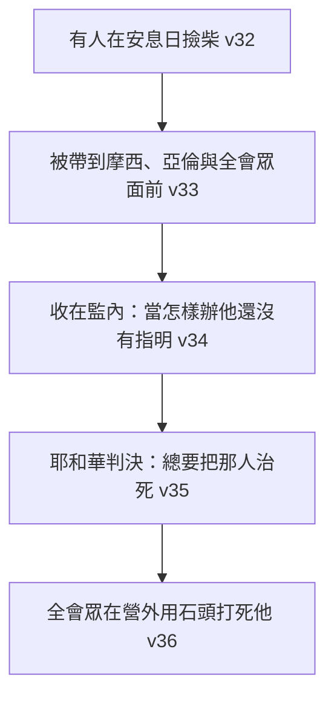

# 民數記 第15章

<!-- chapter-navigation:start -->
| [前一章](../04%20民數記/第14章.md) | [回目錄](../04%20民數記/全書目錄及綱要.md) | [下一章](../04%20民數記/第16章.md) |
| :--- | :---: | ---: |
<!-- chapter-navigation:end -->

1. 耶和華對摩西說：
2. 你曉諭以色列人說：你們[[進迦南地後的獻祭定例與神愛恩慈|到了我所賜給你們居住的地]]，
3. 若願意從牛群羊群中取牛羊作[[火祭（isheh）|火祭]]，獻給耶和華，無論是[[燔祭]]是[[平安祭]]，為要還特許的願，或是作甘心祭，或是逢你們節期獻的，都要奉給耶和華為[[燔祭平安祭同獻的素祭與奠祭比例|馨香之祭]]。
4. 那獻供物的就要將細麵[[伊法]]十分之一，並油一欣四分之一，[[燔祭平安祭同獻的素祭與奠祭比例|調和作素祭]]，獻給耶和華。
5. 無論是[[燔祭]]是[[平安祭]]，你要為每隻綿羊羔，一同預備[[燔祭平安祭同獻的素祭與奠祭比例|奠祭的酒]]一欣四分之一。
6. 為公綿羊預備細麵[[伊法]]十分之二，並油一欣三分之一，[[燔祭平安祭同獻的素祭與奠祭比例|調和作素祭]]，
7. 又用酒一欣三分之一[[燔祭平安祭同獻的素祭與奠祭比例|作奠祭]]，獻給耶和華為[[燔祭平安祭同獻的素祭與奠祭比例|馨香之祭]]。
8. 你預備公牛作[[燔祭]]，或是作[[平安祭]]，為要還特許的願，或是作平安祭，獻給耶和華，
9. 就要把細麵[[伊法]]十分之三，並油半欣，[[燔祭平安祭同獻的素祭與奠祭比例|調和作素祭]]，和公牛一同獻上，
10. 又用酒半欣[[燔祭平安祭同獻的素祭與奠祭比例|作奠祭]]，獻給耶和華為[[燔祭平安祭同獻的素祭與奠祭比例|馨香的火祭]]。
11. 獻公牛、公綿羊、綿羊羔、山羊羔，每隻都要這樣辦理。
12. 照你們所預備的數目，按著隻數都要這樣辦理。
13. 凡本地人將[[燔祭平安祭同獻的素祭與奠祭比例|馨香的火祭]]獻給耶和華，都要這樣辦理。
14. 若有外人和你們同居，或有人世世代代住在你們中間，願意將[[燔祭平安祭同獻的素祭與奠祭比例|馨香的火祭]]獻給耶和華，你們怎樣辦理，他也要照樣辦理。
15. 至於會眾，你們和[[本地人與寄居者同歸一例的律法精神|同居的外人都歸一例]]，作為你們世世代代永遠的定例，在耶和華面前，你們怎樣，[[寄居身分|寄居]]的也要怎樣。
16. 你們並與你們同居的外人當有[[本地人與寄居者同歸一例的律法精神|一樣的條例]]，[[本地人與寄居者同歸一例的律法精神|一樣的典章]]。
17. 耶和華對摩西說：
18. 你曉諭以色列人說：你們到了我所領你們[[進迦南地後的獻祭定例與神愛恩慈|進去的那地]]，
19. 吃那地的糧食，就要把[[舉祭]]獻給耶和華。
20. 你們要用[[初熟的麥子磨麵作餅作為舉祭|初熟的麥子]]磨麵，[[初熟的麥子磨麵作餅作為舉祭|做餅當舉祭奉獻]]；你們舉上，好像[[初熟的麥子磨麵作餅作為舉祭|舉禾場的舉祭]]一樣，
21. 你們世世代代要用[[初熟的麥子磨麵作餅作為舉祭|初熟的麥子]]磨麵，當[[舉祭]]獻給耶和華。
22. 你們有錯誤的時候，不守耶和華所曉諭摩西的這一切命令，
23. 就是耶和華藉摩西一切所吩咐你們的，自那日以至你們的世世代代，
24. [[全會眾誤行過錯與大眾贖罪定例|若有誤行，是會眾所不知道的]]，後來全會眾就要將一隻公牛犢作[[燔祭]]，並照典章把[[素祭（minchah）|素祭]]和[[奠酒|奠祭]]一同獻給耶和華為[[燔祭平安祭同獻的素祭與奠祭比例|馨香之祭]]，又獻一隻公山羊作[[贖罪祭]]。
25. 祭司要[[全會眾誤行過錯與大眾贖罪定例|為以色列全會眾贖罪]]，他們就[[全會眾誤行過錯與大眾贖罪定例|必蒙赦免]]，因為這是錯誤。他們又因自己的錯誤，把供物，就是向耶和華獻的[[火祭（isheh）|火祭]]和[[贖罪祭]]，一併奉到耶和華面前。
26. 以色列全會眾和[[寄居身分|寄居]]在他們中間的外人就[[全會眾誤行過錯與大眾贖罪定例|必蒙赦免]]，因為這罪是百姓誤犯的。
27. [[個人誤犯過錯與一歲母山羊贖罪祭|若有一個人誤犯了罪]]，他就要獻[[個人誤犯過錯與一歲母山羊贖罪祭|一歲的母山羊作贖罪祭]]。
28. 那[[全會眾誤行過錯與大眾贖罪定例|誤行]]的人犯罪的時候，祭司要在耶和華面前[[個人誤犯過錯與一歲母山羊贖罪祭|為他贖罪]]，他就[[全會眾誤行過錯與大眾贖罪定例|必蒙赦免]]。
29. 以色列中的本地人和[[寄居身分|寄居]]在他們中間的外人，若[[全會眾誤行過錯與大眾贖罪定例|誤行]]了什麼事，必歸[[本地人與寄居者同歸一例的律法精神|一樣的條例]]，
30. 但那[[擅敢行事與褻瀆耶和華的剪除處分|擅敢行事的]]，無論是本地人是[[寄居身分|寄居]]的，他[[擅敢行事與褻瀆耶和華的剪除處分|褻瀆了耶和華]]，[[擅敢行事與褻瀆耶和華的剪除處分|必從民中剪除]]。
31. 因他[[擅敢行事與褻瀆耶和華的剪除處分|藐視耶和華的言語]]，[[擅敢行事與褻瀆耶和華的剪除處分|違背耶和華的命令]]，那人總要[[剪除]]；他的[[擅敢行事與褻瀆耶和華的剪除處分|罪孽要歸到他身上]]。
32. 以色列人在曠野的時候，遇見一個人在[[安息日]]撿柴。
33. 遇見他撿柴的人，就把他帶到摩西、亞倫並全會眾那裡，
34. 將他收在監內；因為當怎樣辦他，還沒有指明。
35. 耶和華吩咐摩西說：總要把那人治死；全會眾要在營外用石頭把他打死。
36. 於是全會眾將他帶到營外，用石頭打死他，是照耶和華所吩咐摩西的。
37. 耶和華曉諭摩西說：
38. 你吩咐以色列人，叫他們世世代代在[[衣服邊的繸子與藍細帶子|衣服邊上做繸子]]，又在[[衣服邊的繸子與藍細帶子|底邊的繸子上]][[衣服邊的繸子與藍細帶子|釘一根藍細帶子]]。
39. 你們[[衣服邊的繸子與藍細帶子|佩帶這繸子]]，好叫你們看見就記念遵行耶和華一切的命令，[[不隨從己心眼目行邪淫與成為聖潔|不隨從自己的心意、眼目行邪淫]]，像你們素常一樣；
40. 使你們記念遵行我一切的命令，[[不隨從己心眼目行邪淫與成為聖潔|成為聖潔]]，[[不隨從己心眼目行邪淫與成為聖潔|歸與你們的神]]。
41. 我是耶和華─你們的神，曾把你們從埃及地領出來，要作你們的神。我是耶和華─你們的神。

---

## 本章知識節點

### 主題
- [[進迦南地後的獻祭定例與神愛恩慈]]
- [[火祭（isheh）]]

### 神學
- [[燔祭平安祭同獻的素祭與奠祭比例]]
- [[本地人與寄居者同歸一例的律法精神]]
- [[初熟的麥子磨麵作餅作為舉祭]]
- [[全會眾誤行過錯與大眾贖罪定例]]
- [[個人誤犯過錯與一歲母山羊贖罪祭]]
- [[擅敢行事與褻瀆耶和華的剪除處分]]
- [[不隨從己心眼目行邪淫與成為聖潔]]
- [[燔祭]]
- [[平安祭]]
- [[贖罪祭]]
- [[馨香之氣]]
- [[寄居身分]]
- [[故意犯罪沒有贖罪祭]]
- [[安息日]]

### 事件
- [[曠野安息日撿柴事件與神明告處決]]

### 文化
- [[衣服邊的繸子與藍細帶子]]
- [[奠酒]]

### 原文
- [[素祭（minchah）]]
- [[伊法]]
- [[舉祭]]
- [[初熟]]
- [[剪除]]

### 背景
- [[石刑]]

---

## 本章整理

第14章剛判完：那一代人要倒斃曠野。第15章第一句話卻是「你們到了我所賜給你們居住的地」——講的是進迦南以後怎麼獻祭、怎麼過日子。兩章之間沒有過渡，這個落差本身就是本章的主題。

### 一、判決下來之後，神講的還是進迦南以後的事（v1-2、17-18）

本章有三段啟示，開頭都是同一句「耶和華對摩西說：你曉諭以色列人說」（v1、17、37）；前兩段接的都是同一個前提——[[進迦南地後的獻祭定例與神愛恩慈|「你們到了我所賜給你們居住的地」]]（v2）、「你們到了我所領你們進去的那地」（v18）。

KC 點出這句話是說給誰聽的：神不是對那批要倒在曠野的人說話，而是對迦勒、約書亞那樣的信心餘民說的——人的罪推翻不了神的計畫。GT《聖經精讀本──民數記註解》從條例的對象確認同一件事：「記錄在這段經文裡的條例是針對著新世代,而不是舊世代」。

GT《啟導本聖經註釋》則從另一個角度看出同樣的意思：這些條例要用大量細麵、油和酒，而曠野根本產不出這些東西——規定本身就是「你們到得了」的憑據。它並總結說：「神的計畫不會因人的不信而放棄，人若能真心悔改，獻上贖罪祭，仍可以在神的救贖恩典中重獲祝福（40～41節）。」

至於這一章發生在什麼時候，GT 丁良才《民數記註釋》的估算是：民十四和十五章之間大概間隔三十多年，本章所記或者是出埃及後第三十九年的事。中間隔了一整代人，神開口的第一句話還是那一句：你們到了那地。

### 二、每一隻牲口都要配上麵、油、酒（v3-13）

第一段條例處理的是[[燔祭平安祭同獻的素祭與奠祭比例|獻祭時的搭配]]。以前獻[[燔祭]]或[[平安祭]]，牽一隻牲口上去就是了；從這裡開始，每一隻牲口都要配一份[[素祭（minchah）|素祭]]（細麵調油）與一份[[奠酒|奠祭]]（酒），份量按牲口大小遞增。

GT《民數記串珠聖經註釋》指出這是一項新規定：「摩西五經中，這裡是第一次說明每次奉獻祭牲必須有素祭和奠祭陪同。」

| 祭牲 | 細麵 | 油 | 酒 | 換算（CT） |
| :--- | :--- | :--- | :--- | :--- |
| 綿羊羔、山羊羔 | [[伊法]]十分之一 | 一欣四分之一 | 一欣四分之一 | 細麵約 2.2 公升 |
| 公綿羊 | 伊法十分之二 | 一欣三分之一 | 一欣三分之一 | 細麵約 4.4 公升 |
| 公牛 | 伊法十分之三 | 半欣 | 半欣 | 細麵約 6.6 公升 |

GT《啟導本聖經註釋》給了單位的整數換算：「一伊法約等於20公升，一欣約等於4公升」，並指出「獻祭所需的麵粉與酒分量相當大，間接說明迦南地農產富足」。GT《民數記串珠聖經註釋》讀出同樣的意思：「這裡所指定的分量相當大，暗示將來在應許地的收成必定很豐富。」

幾個名詞值得先分清楚：

- **[[火祭（isheh）|火祭]]**——GT《民數記串珠聖經註釋》說明它不是新的一種祭：「並不是一種新祭，而是指民數記列舉的五祭中，須用火燒獻上的祭物。」
- **燔祭與平安祭的差別**——CT：「『燔祭』整個祭物用火焚燒；『平安祭』僅部分祭物用火焚燒，其餘的歸祭司享用」。
- **[[奠酒|奠祭]]**——GT《啟導本聖經註釋》：「“奠祭”為以奠酒為祭，不是獨立的獻，乃配其他祭物而獻。」
- **[[馨香之氣|馨香]]**——CT 在原文字義註明這是原文雙字：「安靜，舒坦，寧靜(首字)；香氣，芳香(次字)」。STEP 原文資料可確認這兩個字：רֵיחַ（Rei.ach，H7381，scent）與 נִיחֹחַ（ni.Cho.ach，H5207，soothing），本章共出現六次（v3、7、10、13、14、24）。

KC 注意到一件容易忽略的事：本章的排序是由小到大（羊羔→公綿羊→公牛），與利未記由大到小相反；他把三樣配料分別讀成——細麵指基督在地上完全平整無瑕的一生，油指聖靈與那生命完全調和，酒指獻上時的喜樂，並引腓2:17 保羅說自己願意作「澆奠的祭」來說明奠祭。

### 三、本地人與外人，一樣的條例（v14-16）

條例講到一半，插進一段身分宣告：[[本地人與寄居者同歸一例的律法精神|以色列人與住在他們中間的外人適用同一套規矩]]。

> [!important] 第15-16節
> 「至於會眾，你們和同居的外人都歸一例，作為你們世世代代永遠的定例，在耶和華面前，你們怎樣，寄居的也要怎樣。你們並與你們同居的外人當有一樣的條例，一樣的典章。」

KC 認為這一段在舊約裡是獨一無二的：外邦人被放在以色列人旁邊、地位相同，這在舊約其他地方看不到，因為舊約通常保持區別，外邦人得福也是透過以色列。

各家對這條規矩的理由說法不同，可以並排看：

- GT 丁良才《民數記註釋》從實用面說：「本節的規矩，是要勉勵外人，也敬拜耶和華，不敬拜別神。」
- GT《啟導本聖經註釋》把它接回更早的應許：「事實上，神與人立約時早已包括萬族（創十二3）。」
- GT《聖經精讀本──民數記註解》加了一個前提：「神不會立相互矛盾的法」，[[寄居身分|寄居的外人]]能享受同樣的屬靈特權，但同樣要靠信實地履行律法才享受得到。

這條原則在本章一共出現四次，恩典與刑罰兩面都適用：獻火祭時（v14-16）、全會眾誤犯得赦免時（v26）、個人誤犯歸同一條例時（v29）、擅敢行事被剪除時（v30）。

### 四、進了那地，第一塊餅要先舉起來（v17-21）

第二段條例把獻祭搬進了廚房：[[初熟的麥子磨麵作餅作為舉祭|吃那地的糧食時，要用初熟的麥子磨麵做餅當舉祭獻上]]（v19-21）。

CT 說明[[舉祭]]是什麼動作：「指將手中的祭物，垂直向上舉起，上下擺動，表示獻給神」，原文字義是「升高，高舉」。GT《民數記串珠聖經註釋》指出這份祭物歸祭司享用（利7:32）。

GT 丁良才《民數記註釋》把先前已有的三種[[初熟|初熟之物]]條例列了出來，並判斷本章這一項是額外新加的：

| 先前已有的條例 | 出處 |
| :--- | :--- |
| 用火烘了禾穗，當作初熟之物的素祭 | 利二14 |
| 將初熟的一捆大麥，當作搖祭 | 利二十三10 |
| 將兩個搖祭的餅，當作初熟之物獻給耶和華 | 利二十三17 |

他的結論是：「本節的吩咐，大概是在這三層以外。」

這條規矩後來真的走進了家庭。GT《啟導本聖經註釋》記下猶太人的作法：「猶太人二次被擄後仍保持此風俗，把餅投入家中的火爐裡當作“小祭”，火爐成為祭壇，每個家成為神的居所。」並指出保羅引用過這個作法——「所獻的新面若是聖潔，全團也就聖潔了」（羅十一16）。KC 說得更直接：這裡講的不是節期那樣的特別場合，而是每天的日常。

### 五、不小心犯的，怎麼補（v22-29）

第三段處理犯錯。本章把誤犯的罪拆成兩種規格：

| | 全會眾誤犯（v22-26） | 個人誤犯（v27-29） |
| :--- | :--- | :--- |
| 燔祭 | 一隻公牛犢，連同素祭、奠祭 | 無 |
| [[贖罪祭]] | 一隻公山羊 | 一隻一歲的母山羊 |
| 結論 | 「他們就必蒙赦免」 | 「他就必蒙赦免」 |
| 適用對象 | 以色列全會眾與寄居的外人 | 本地人與外人「必歸一樣的條例」 |

[[全會眾誤行過錯與大眾贖罪定例|全會眾這一款]]多了一隻公牛犢的燔祭，這是本章與利未記第4章最明顯的差別。GT 丁良才《民數記註釋》分辨得很清楚：「這祭是因有錯誤（當行的不行）獻的，所以注重當獻給主（22）。利四13節的祭，是為誤犯的罪（不當行的而行）獻的，所以注重必須贖罪。」KC 的分法相同：利未記第4章講的是做了不該做的事，這裡講的是沒做該做的事——沒做該做的，光除罪不夠，還要用燔祭把「以後要做」補回去。

[[個人誤犯過錯與一歲母山羊贖罪祭|個人這一款]]規格輕得多，結論卻一模一樣。CT 註第28節「犯罪的時候」的意思是「當知道自己犯罪之時」——條例啟動的時間點不是犯的那一刻，而是發覺的那一刻。GT《聖經精讀本──民數記註解》把兩款放在一起比較：「因個人的犯罪獻上的祭物和因會眾的犯罪獻上的祭物(24節)是有差異的。這說明在耶和華神面前比起個人犯罪,集體犯罪是更嚴重的(利4:27-5:13)。」

STEP 原文資料顯示這一整段扣在同一個字上：「誤行／誤犯」在第24至29節出現七次，都是 שְׁגָגָה（she.ga.Gah，H7684，unintentionally）。

> [!note] 「必蒙赦免」
> CT 把這四個字讀成一句保證：這是神的應許，是罪得解決的保證，取用這應許使人不再受罪的纏擾和轄制。但 CT 同時劃了界線：贖罪祭是指明給誤犯罪的人享用的，明知故犯的人不在此列——這正是接下來兩節要處理的。

GT 賈斯樂郝威《聖經難解經文詮釋手冊》命題19 另處理了一個文本問題：利四14 只提一種獻祭、本章提兩種，他的答覆是兩處並不衝突，只是彼此互補。

### 六、舉著手做的，沒有祭可獻（v30-31）

第30節換了一種人：[[擅敢行事與褻瀆耶和華的剪除處分|「但那擅敢行事的，無論是本地人是寄居的，他褻瀆了耶和華，必從民中剪除」]]。

「擅敢行事」這四個中文字看不太出原意。CT 在原文字義註明它是原文雙字：「升起，舉起(首字)；手(次字)」；GT《聖經精讀本──民數記註解》直接譯出來：「字面意思是“用高舉的手”」STEP 原文資料可確認這個組合是 בְּ/יָד רָמָה（be./Yad ra.Mah），由 יָד（yad，H3027G，hand）加 רוּם（rum，H7311A，to exalt）構成——不是失手犯錯，是舉著手做的。

CT 註第31節的兩個子句意思相同：藐視與違背、言語與命令都同義。STEP 原文資料另顯示「[[剪除|那人總要剪除]]」用了 הִכָּרֵת תִּכָּרֵת（hi.ka.Ret ti.ka.Ret，H3772I）不定詞絕對式加未完成式的重複，是加重語氣的寫法。

GT《舊約聖經背景註釋》從古代法律解釋這種罪為什麼不能不罰：所違背的不但是神的律法，也是社會同意遵守這些律例的集體盟約；並說明「從民中剪除」的執行面：它「表示進行懲罰的包括了人、神雙方的媒介──大概是官方處死，神絕其家系」。

GT《啟導本聖經註釋》用《希伯來書》的警告作結：「我們得知真道以後，若故意犯罪，贖罪的祭就再沒有了，惟有戰懼等候審判」（十26～27）。KC 描述這種人的狀態：他不是沒有力氣抵擋罪，而是清楚知道自己在做什麼、也知道後果，卻沒有任何東西攔得住他（[[故意犯罪沒有贖罪祭]]）。

### 七、安息日撿柴的那個人（v32-36）

原則宣告完，緊接著就是[[曠野安息日撿柴事件與神明告處決|第一個實例]]。

爭點在哪裡？GT《民數記串珠聖經註釋》講得最清楚：[[安息日]]作工或生火要治死是律法明文（出31:15；35:2-3），「但在安息日檢柴卻未有明文說明」——而撿柴的目的是生火，所以這是蓄意違反不可生火的條例。CT 也註明：撿柴是為生火，但安息日連生火也不可以（參出三十五3），撿柴是否犯法尚無明文可查。

摩西的處置是本段的重點之一。CT 稱讚他等候神的命令才敢作，不敢自作主張；KC 從教會紀律的角度讀「收在監內」這個動作——有些案子確實不知道該怎麼辦，這時寧可先擱置、承認自己不知道，等主指明。

至於為什麼要拖到營外執行[[石刑]]，GT 丁良才《民數記註釋》註得很短：「免得營盤被污穢了（參徒七58，來十三12）。」GT《舊約聖經背景註釋》補上一句：處決不論是不是群體性的，都要在營外執行，以求避免因與屍體接觸而沾染不潔。STEP 原文資料顯示第35節的「總要把那人治死」是 מוֹת יוּמַת（Mot yu.Mat，H4191），同一個動詞連用兩次的強調寫法，與 CT 原文字義所註的「總要…治死(原文雙同字)」相符。

### 八、衣角上的繸子與那條藍線（v37-41）

第三段啟示回到日常穿著：[[衣服邊的繸子與藍細帶子|世世代代在衣服邊上做繸子，並在底邊的繸子上釘一根藍細帶子]]（v38）。

STEP 原文資料可以確認這幾個字：

| 中文 | 原文 | 音譯 | Strong | 詞典義 |
| :--- | :--- | :--- | :--- | :--- |
| 繸子 | צִיצִת | tzi.Tzit | H6734 | tassel |
| 衣服邊（衣角） | כָּנָף | ka.Naf | H3671 | wing |
| 細帶子 | פְּתִיל | pe.Til | H6616 | cord |
| 藍 | תְּכֵלֶת | te.Khe.let | H8504 | blue |

BH 用同一組詞，並說明藍色染料可能取自骨螺（Murex snail）；GT《舊約聖經背景註釋》指出這種染料「極為昂貴」，而且特別劃了一條界線：「繸子是象徵性的，為鼓勵良好的行為而設」，不是護身符，「沒有驅除危險或試探的功用」。

GT 丁良才《民數記註釋》記下猶太人自己的算法：外衣是一塊大方布，四角都有繸子，每繸上有一條藍線，「這些線和其上所結的結子，共計六百一十三個，特為表明律法上的六百一十三條誡命」。CT 解釋顏色的用意：「藍是代表天的顏色，是叫他們記得天上的事。」

這件事後來走樣了。GT 丁良才與 KC 都指出法利賽人把繸子做長了（太23:5）；GT《聖經精讀本──民數記註解》說得更完整：本為內在敬虔的條例，被法利賽人錯誤地用於表示宗教地位或外在敬虔的標記。KC 另指出同一種藍細帶子也出現在大祭司額上的金牌（出28）——金牌在頭上朝著神，繸子在衣角貼近地面，一個管仰望，一個管走路。

### 九、不要拿心和眼睛去「探地」（v39-41）

繸子要防的是什麼，第39節自己說了：[[不隨從己心眼目行邪淫與成為聖潔|「不隨從自己的心意、眼目行邪淫，像你們素常一樣」]]。

這裡的「隨從」在原文裡是個很特別的字。CT 在原文字義註明它是原文雙字：「搜尋，探索(首字)；在…之後(次字)」。STEP 原文資料可確認首字是 תָתֻרוּ（ta.Tu.ru），詞典形 תּוּר（tur，H8446，to spy）——**和民13:2 打發人去「窺探」迦南地、民13:16-17 十二個探子出發時用的是同一個字**。

把這一節接回前兩章就看得出編排的用意：那一代人派了十二個人去「窺探」那地，十個人照著眼睛所見的回報，全會眾當晚就垮了。同一個動詞在這裡被禁止用在自己的心和眼睛上。CT 指出癥結：「『心』與『眼』是人的問題根源」；STEP 另顯示「行邪淫」是 זֹנִים（zo.Nim，H2181，za.nah，to fornicate）的分詞形，把跟著自己的心和眼睛走這件事直接說成不忠。

全章以兩次「我是耶和華你們的神」收尾（v41）。GT 丁良才《民數記註釋》注意到這個重複，並指出以色列人在曠野飄流時有好些神所吩咐的事守不了，「這幾節的吩咐，卻是人人能守的」——四十年裡守不住的那些，這一章給的是每個人每天都做得到的。

**參考資料**
https://www.ccbiblestudy.org/Old%20Testament/04Num/04CT15.htm
https://www.ccbiblestudy.org/Old%20Testament/04Num/04GT15.htm
https://www.kingcomments.com/en/bible-studies/Num/15
https://biblehub.com/study/numbers/15.htm
https://github.com/STEPBible/STEPBible-Data

<!-- appendix-links:start -->
## 附錄

### 相關地圖
- [[appendix/fhl_maps/maps/021|〈民圖二〉探查應許地和應許地的範圍]]
<!-- appendix-links:end -->

<!-- chapter-navigation:start -->
| [前一章](../04%20民數記/第14章.md) | [回目錄](../04%20民數記/全書目錄及綱要.md) | [下一章](../04%20民數記/第16章.md) |
| :--- | :---: | ---: |
<!-- chapter-navigation:end -->
