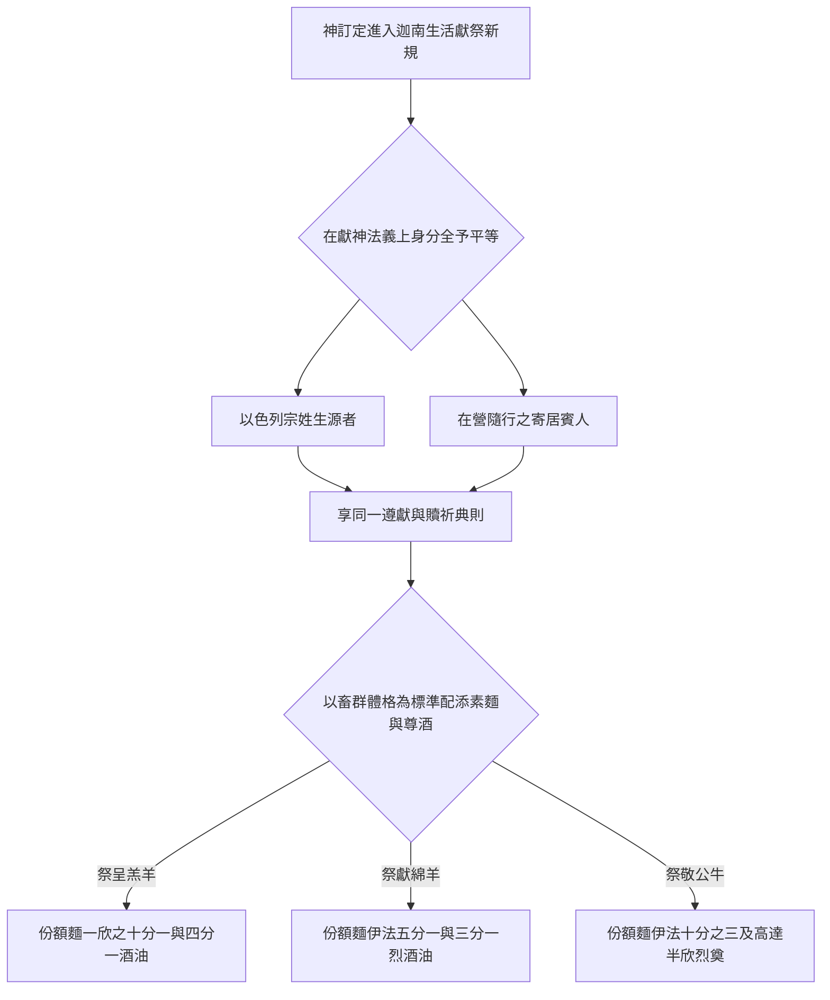
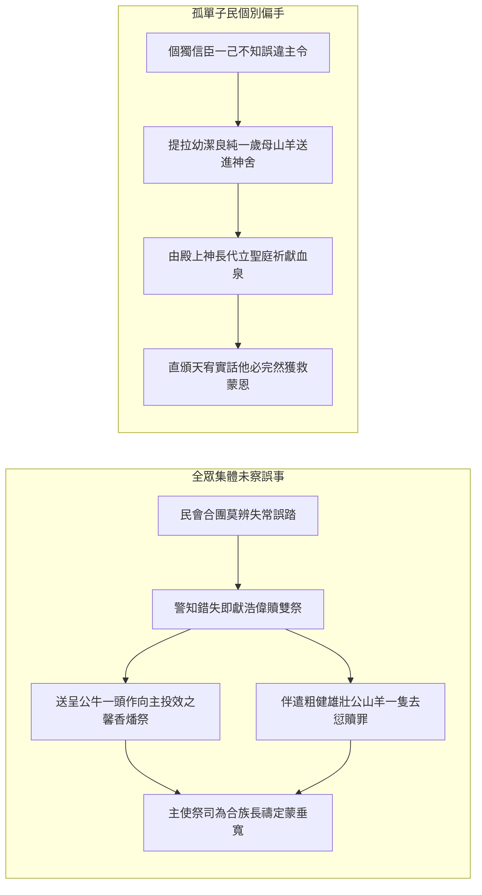
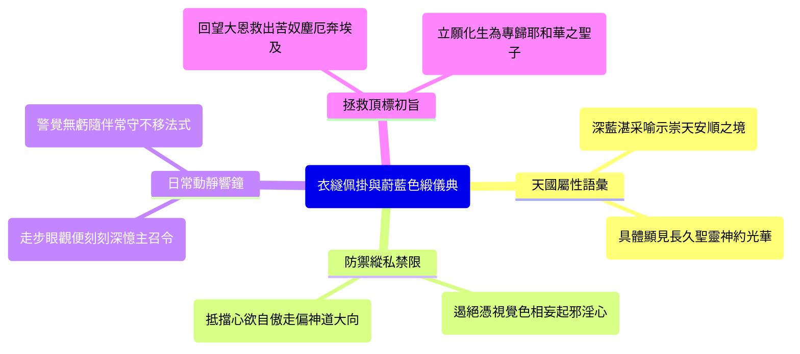

# 民數記 第15章

1. 耶和華對摩西說：
2. 你曉諭以色列人說：你們[[進迦南地後的獻祭定例與神愛恩慈|到了我所賜給你們居住的地]]，
3. 若願意從牛群羊群中取牛羊作火祭，獻給耶和華，無論是燔祭是平安祭，為要還特許的願，或是作甘心祭，或是逢你們節期獻的，都要奉給耶和華為[[燔祭平安祭同獻的素祭與奠祭比例|馨香之祭]]。
4. 那獻供物的就要將細麵伊法十分之一，並油一欣四分之一，[[燔祭平安祭同獻的素祭與奠祭比例|調和作素祭]]，獻給耶和華。
5. 無論是燔祭是平安祭，你要為每隻綿羊羔，一同預備[[燔祭平安祭同獻的素祭與奠祭比例|奠祭的酒]]一欣四分之一。
6. 為公綿羊預備細麵伊法十分之二，並油一欣三分之一，[[燔祭平安祭同獻的素祭與奠祭比例|調和作素祭]]，
7. 又用酒一欣三分之一[[燔祭平安祭同獻的素祭與奠祭比例|作奠祭]]，獻給耶和華為[[燔祭平安祭同獻的素祭與奠祭比例|馨香之祭]]。
8. 你預備公牛作燔祭，或是作平安祭，為要還特許的願，或是作平安祭，獻給耶和華，
9. 就要把細麵伊法十分之三，並油半欣，[[燔祭平安祭同獻的素祭與奠祭比例|調和作素祭]]，和公牛一同獻上，
10. 又用酒半欣[[燔祭平安祭同獻的素祭與奠祭比例|作奠祭]]，獻給耶和華為[[燔祭平安祭同獻的素祭與奠祭比例|馨香的火祭]]。
11. 獻公牛、公綿羊、綿羊羔、山羊羔，每隻都要這樣辦理。
12. 照你們所預備的數目，按著隻數都要這樣辦理。
13. 凡本地人將[[燔祭平安祭同獻的素祭與奠祭比例|馨香的火祭]]獻給耶和華，都要這樣辦理。
14. 若有外人和你們同居，或有人世世代代住在你們中間，願意將[[燔祭平安祭同獻的素祭與奠祭比例|馨香的火祭]]獻給耶和華，你們怎樣辦理，他也要照樣辦理。
15. 至於會眾，你們和[[本地人與寄居者同歸一例的律法精神|同居的外人都歸一例]]，作為你們世世代代永遠的定例，在耶和華面前，你們怎樣，寄居的也要怎樣。
16. 你們並與你們同居的外人當有[[本地人與寄居者同歸一例的律法精神|一樣的條例]]，[[本地人與寄居者同歸一例的律法精神|一樣的典章]]。
17. 耶和華對摩西說：
18. 你曉諭以色列人說：你們到了我所領你們[[進迦南地後的獻祭定例與神愛恩慈|進去的那地]]，
19. 吃那地的糧食，就要把舉祭獻給耶和華。
20. 你們要用[[初熟的麥子磨麵作餅作為舉祭|初熟的麥子]]磨麵，[[初熟的麥子磨麵作餅作為舉祭|做餅當舉祭奉獻]]；你們舉上，好像[[初熟的麥子磨麵作餅作為舉祭|舉禾場的舉祭]]一樣，
21. 你們世世代代要用[[初熟的麥子磨麵作餅作為舉祭|初熟的麥子]]磨麵，當舉祭獻給耶和華。
22. 你們有錯誤的時候，不守耶和華所曉諭摩西的這一切命令，
23. 就是耶和華藉摩西一切所吩咐你們的，自那日以至你們的世世代代，
24. [[全會眾誤行過錯與大眾贖罪定例|若有誤行，是會眾所不知道的]]，後來全會眾就要將一隻公牛犢作燔祭，並照典章把素祭和奠祭一同獻給耶和華為[[燔祭平安祭同獻的素祭與奠祭比例|馨香之祭]]，又獻一隻公山羊作贖罪祭。
25. 祭司要[[全會眾誤行過錯與大眾贖罪定例|為以色列全會眾贖罪]]，他們就[[全會眾誤行過錯與大眾贖罪定例|必蒙赦免]]，因為這是錯誤。他們又因自己的錯誤，把供物，就是向耶和華獻的火祭和贖罪祭，一併奉到耶和華面前。
26. 以色列全會眾和寄居在他們中間的外人就[[全會眾誤行過錯與大眾贖罪定例|必蒙赦免]]，因為這罪是百姓誤犯的。
27. [[個人誤犯過錯與一歲母山羊贖罪祭|若有一個人誤犯了罪]]，他就要獻[[個人誤犯過錯與一歲母山羊贖罪祭|一歲的母山羊作贖罪祭]]。
28. 那[[全會眾誤行過錯與大眾贖罪定例|誤行]]的人犯罪的時候，祭司要在耶和華面前[[個人誤犯過錯與一歲母山羊贖罪祭|為他贖罪]]，他就[[全會眾誤行過錯與大眾贖罪定例|必蒙赦免]]。
29. 以色列中的本地人和寄居在他們中間的外人，若[[全會眾誤行過錯與大眾贖罪定例|誤行]]了什麼事，必歸[[本地人與寄居者同歸一例的律法精神|一樣的條例]]，
30. 但那[[擅敢行事與褻瀆耶和華的剪除處分|擅敢行事的]]，無論是本地人是寄居的，他[[擅敢行事與褻瀆耶和華的剪除處分|褻瀆了耶和華]]，[[擅敢行事與褻瀆耶和華的剪除處分|必從民中剪除]]。
31. 因他[[擅敢行事與褻瀆耶和華的剪除處分|藐視耶和華的言語]]，[[擅敢行事與褻瀆耶和華的剪除處分|違背耶和華的命令]]，那人總要剪除；他的[[擅敢行事與褻瀆耶和華的剪除處分|罪孽要歸到他身上]]。
32. 以色列人在曠野的時候，遇見一個人[[曠野安息日撿柴事件與神明告處決|在安息日撿柴]]。
33. 遇見他[[曠野安息日撿柴事件與神明告處決|撿柴]]的人，就把他帶到摩西、亞倫並全會眾那裡，
34. 將他收在監內；因為[[曠野安息日撿柴事件與神明告處決|當怎樣辦他，還沒有指明]]。
35. 耶和華吩咐摩西說：總要把那人治死；全會眾要在[[曠野安息日撿柴事件與神明告處決|營外用石頭把他打死]]。
36. 於是全會眾將他帶到營外，[[曠野安息日撿柴事件與神明告處決|用石頭打死他]]，是照耶和華所吩咐摩西的。
37. 耶和華曉諭摩西說：
38. 你吩咐以色列人，叫他們世世代代在[[衣服邊的繸子與藍細帶子|衣服邊上做繸子]]，又在[[衣服邊的繸子與藍細帶子|底邊的繸子上]][[衣服邊的繸子與藍細帶子|釘一根藍細帶子]]。
39. 你們[[衣服邊的繸子與藍細帶子|佩帶這繸子]]，好叫你們看見就記念遵行耶和華一切的命令，[[不隨從己心眼目行邪淫與成為聖潔|不隨從自己的心意、眼目行邪淫]]，像你們素常一樣；
40. 使你們記念遵行我一切的命令，[[不隨從己心眼目行邪淫與成為聖潔|成為聖潔]]，[[不隨從己心眼目行邪淫與成為聖潔|歸與你們的神]]。
41. 我是耶和華─你們的神，曾把你們從埃及地領出來，要作你們的神。我是耶和華─你們的神。

---

## 本章知識節點

### 主題
- [[進迦南地後的獻祭定例與神愛恩慈]]

### 神學
- [[燔祭平安祭同獻的素祭與奠祭比例]]
- [[本地人與寄居者同歸一例的律法精神]]
- [[初熟的麥子磨麵作餅作為舉祭]]
- [[全會眾誤行過錯與大眾贖罪定例]]
- [[個人誤犯過錯與一歲母山羊贖罪祭]]
- [[擅敢行事與褻瀆耶和華的剪除處分]]
- [[不隨從己心眼目行邪淫與成為聖潔]]

### 事件
- [[曠野安息日撿柴事件與神明告處決]]

### 文化
- [[衣服邊的繸子與藍細帶子]]

---

## 本章整理

### 嚴肅管教中的恩典續約與同獻祭品定例（v1-16）

民數記第15章的開端在歷史與神學結構上，展現了神權救贖不受干擾的永恆與持續力。在第14章紀載不信風潮與四十年曠野流轉與懲處的背景下，第15章卻非以譴責或哀怨續篇，而是上帝啟口宣告一條極具建設與修復意識的恩赦典律：「耶和華對摩西說：你曉諭以色列人說：你們到了我所賜給你們居住的地…」（v1-2）。此處具體開啟的 [[進迦南地後的獻祭定例與神愛恩慈|「進入應許領地後的日常奉祀法程」]]，向未來新一代的信眾展示：漫長的沙漠陶鑄並不會廢止地之所有權及立約的核心盼望。

在《基督徒文摘解經系列》（CT）和《拾穗》（GT）中，各釋經大師（如丁良才和黃迦勒等人）相繼說明：「神指言『居住的地』，暗指了在曠野四十年內多是以存養見忍、難備盈盛各好素酒；這番規約乃是向會從立明終局無畏的大期許；神的救度體系不會因為一個世代的不忠而被撤絕。」當後嗣真正跨入應許福地，凡心願樂意，不論是依歲年重慶、還誓發願或甘心喜納而要把群中良羊好牛攜至神案燒起「馨香的火祭」時，一條前瞻不改的新制在此建立：絕不能空置肉祭單孤獨行，咸當遵同於 [[燔祭平安祭同獻的素祭與奠祭比例|「經嚴密量度比例相融搭配的素麥油以及奠酒」]]。

不拘為代表命志全獻不餘的燔祭或體認平安喜歡相伴和契的平安慰奉，凡宰舉一隻羔羊，信役手上一定要捧置以一欣四分之一精實好油和白細麥粉伊法十分之一攪和精美的素祭；同期仰傾的奠使酒香定當以四分之一欣斟滿無減。一旦祭牲規格進階至成年雄厚之綿公羊，相倚同行奉呈之白粉須乘是翻一高層成兩純份（即伊法十分之二），佐調酥油及烈奠也必定晉位為欣之三分之一一準；若是牽升至農動主幹、承具最端嚴氣體的成體偉雄公牛，精潔之油及純尊厚酒須揚抵至高半欣界限，連細潔麵團都必定提至伊法十分之三。此極盡層級與滋育香氛的大總結與和諧相呈，非但在歷史中為美地盈田產作證，在新約神靈觀下更有極其清晰之神聖印證：「素潔淨麵代表基督成聖之為人、油喻深注於真善的純誠聖靈，而那向地而竭的尊崇香酒奠瀝，更是表徵真徒竭盡情信、無悔傾倒身與願之高尚告慰」（KC 研道深注）。

| 犧牲祭牲類別 | 細麵（素祭主糧） | 搗油（與麵和揉） | 烈酒（作奠祭傾灑） | 屬靈表徵與神學呼應 |
| :--- | :--- | :--- | :--- | :--- |
| **綿羊羔與山羊羔** | 伊法十分之一 | 一欣四分之一 | 一欣四分之一 | 基礎替罪和平無罪羔羊，純粹、溫順且與神旨一致的聖靈陶煉。 |
| **成壯公綿羊** | 伊法十分之二 | 一欣三分之一 | 一欣三分之一 | 進階承擔誓願之信者更為嚴密的遵行心志與靈裡相親的純真同和。 |
| **成熟壯公牛** | 伊法十分之三 | 一欣二分之一 | 一欣二分之一 | 完全傾倒一生使命於榮道主作、堅固信實並徹底投降於神聖引發的神恩力量。 |

就在嚴明浩繁的各種比率規定之中，經文出奇揭示一道穿逾古族血脈框架的大公義與平等宣言 —— [[本地人與寄居者同歸一例的律法精神|「本土宗族與寄留賓客於禮俗典令上前皆享有同樣待遇之道」]]。舊古社會觀每將部族本系與遠至求容客士設下層遞等級；上帝卻在行祭和誓道下斬絕偏遠言：「至於會眾，你們和同居的外人都歸一例，作為你們世世代代永遠的定例，在耶和華面前，你們怎樣，寄居的也要怎樣。你們並與你們同居的外人當有一樣的條例，一樣的典章」（v15-16）。丁道爾研讀錄深讚此事理：「經言之本願是廣張義胸勉引諸方仁信共同心事真主，絕摒群神崇拜之染；神本不嫌阻任何心慕其聖名者」（GT）；而《啟導本》亦洞陳此脈早已內融在與早年亞伯拉罕約起賜萬姓的大祝福內（創十二3）。此種法意不問生平門閥、唯望尋真恭侍的心理同一性，成了基督教歷史跨國域族界、同享天上平權恩契的最大開端證實。

### 食用大田賜養處之初熟麥餅舉祭與自卑修約（v17-21）

順應從浪居轉入地土深藏經理的生活軌跡，上帝宣告把長想仰順的心志深深扣結在會胞每日取糧養身賴以為常的生活行為中，立法頒定了經典耐遠的 [[初熟的麥子磨麵作餅作為舉祭|「拿新採早穫磨成首塊生熱良餅獻上作禮的尊恩事程」]]。神曉示摩西直論：「你們到了我所領你們進去的那地，吃那地的糧食，就要把舉祭獻給耶和華。你們要用初熟的麥子磨麵，做餅當舉祭奉獻；你們舉上，好像舉禾場的舉祭一樣；你們世世代代要用初熟的麥子磨麵，當舉祭獻給耶和華」（v18-21）。經理家事者一經收納初成飽實之麥粒與五穀禾糧，即定依言把首道精麥打細烙出家內珍碩飽和之生食麵塊，不可放縱先下家腹，當行立直伸提往天上獻歸為敬拜良祭。

依考證與經典原釋闡提：「舉祭為持物向上高高托行揚示於天空、作宣表皆由神手供應並敬交原主之明誓」（CT）；這樣生活法將過往食露自收露天的曠野狀態穩定接轉至深耕沃野生計中：免除世人以為依賴一身血性勇武、智力開展便有倉豐禾足的妄見高傲。《啟導本》與各傳統讀解（KC 與 GT 等）並指陳：「這是一份極美善深刻之家庭聖堂延擴——前既有公家神所牽行羊首和第一束大搖青穀，現在進駐私人生活火灶；老妻揉和第一件熱圓香飽主食，悉以舉神稱頌作起步。」同時此新初好品也在全聖結構裡高揚地指攝了基督為那毫無朽敗、從墳塚底起率先復生開闢人類新生新晨之純義至大初熟至果。

> [!info] 家門初麥烙奉和恩召啟證
> - **實用與靈性教育**：百姓入沃土自耕開食自收主食，神令必拿首熟純麵先奉為主尊舉禮，阻抑浮奢和自居收成的縱恣心理；長持存有「萬福泉出於天威扶帶」的清晰悟信。
> - **神學呼應與先鋒**：如保羅新約見證書信所言（羅十一16）：若是最前挑定獻上的精壯初麵已顯純潔，全體歲用之餘年長日便在一片成聖護蔭裡同行喜潔與豐潤。

### 集體忽誤與私身小違的贖愆平衡定法（v22-29）

縱蒙聖約崇深相帶，天心清楚見照人性在困限與血意交繞處極難終保全心無虧，遂在宣告好意進土定規後詳述對付失察偏行的正當救援：分辨公眾整體昏憒跟孤個微小信者誤失之境，兩者各自開設有條有理之贖禮。如果全部以氏聚眾在並未深知或是主領判思疏漏下，整體未盡守住天頒的無瑕規律，於得人提攜或是悔深警醒時，律理設有了完整的寬容回正規範 —— [[全會眾誤行過錯與大眾贖罪定例|「向大祭台行大牛升燔與山羊去疚成善合赦典制」]]（v22-26）。在這種整體誤謬洗補下，不僅要有殺血免咎之事，規裡更是出眾且難能地命以「先致祭一頭長雄壯大之公牛犢作為熱燔之意」！（v24）。眾名家註經明證：「以此公牛前導作為全投好火之祭，為表達全群不僅愧悔罪錯，且以此壯體公獻表示回往宣順上帝引命之真情一決」；而同來協濟的，必定少不了一頂盛壯成齡的去罪公山羊。這完整贖法發言落下至美無二的保證銘書：「祭司要為以色列全會眾贖罪，他們就必蒙赦免，因為這是錯誤... 以色列全會眾和寄居在他們中間的外人就必蒙赦免，因為這罪是百姓誤犯的」（v25-26）。

> [!important] 拯救保證與寬恕信度
> 「**必蒙赦免**」構成聖書中至誠難磨的平赦憑證！ CT 精讀與 KC 經論相佐大言指出：此非可有可無之空願，實乃神權給予罪欠良知真正重獲清白並長享大天業底地的真實支柱；赦罪既至，人心就不至困陷於永恆惶怕憂慮死境中。

然全光至聖的大者也絲毫不遺落對微渺單一個人幽處失慎的牽念；若是民群之內某個弱僕或子弟不為知定或一時失信踏失於誠命條列，便採引穩篤柔愛並濟的 [[個人誤犯過錯與一歲母山羊贖罪祭|「獨呈一年整無疵女潔羊至殿庭洗咎無疑得恕之路」]]。條例淺白清直：「若有一個人誤犯了罪，他就要獻一歲的母山羊作贖罪祭。那誤行的人犯罪的時候，祭司要在耶和華面前為他贖罪，他就必蒙赦免」（v27-28）。僅止這一歲輕軟細實母山羊無過體態，由主恩居司引手申情洗冤，這渺個的兄弟照等同度受授毫無苛簡的恩判書聲 —— 準然落印「他必蒙赦免」無餘。並且這良範同等覆蓋全聚人群：「以色列中的本地人和寄居在他們中間的外人，若誤行了甚麼事，必歸一樣的條例」（v29），深藏體貼人性脆軟並藉贖道帶回光泰和諧的神聖智慧。

### 擅敢違抗的剪除大罪與曠野安息日處死個案（v30-36）

慈寬赦贖之路與法制不可借此淪作對君聖之輕侮和意肆犯上；第15章在此明辨事界，立下了公義中不肯寬縱抗背傲性的分水領界 —— [[擅敢行事與褻瀆耶和華的剪除處分|「對心生高傲、執力反上、踐越神諭言令者必引自斃翦逐鐵則」]]：「但那擅敢行事的，無論是本地人是寄居的，他褻瀆了耶和華，必從民中剪除。因他藐視耶和華的言語，違背耶和華的命令，那人總要剪除；他的罪孽要歸到他身上」（v30-31）。原名詞意裡所謂「擅敢行事」，象徵「把自信意力與肉腕傲放凌架在最高聖言智上，自奉為主以抵觸至上主公」，根本背馳無知涉險或失力滑落的事實，屬刻意心違的極度對決。上帝宣知此極行即為「褻瀆和侮慢救君的偉名」，毫無用任何公母畜替贖解避的可能性，下命斷然要把這橫放者除去聖民生命共同之盟約線；並留載罪過由自己一人領盡的神判定語。

> [!quote] 故意叛罪與公義不可侮辱的絕對宣信
> - **拒絕恩愛轉作蓄意輕侮的果報**：「上帝向世敞啟寬和洗錯大悲心，切不是允許子民以身玩罪肆去違抗！蓄意不顧道訓並存主意挑戰至聖名諱者，等於踩決造己成靈大願，只能自己步赴公度下的斬落刑限中。」(CT/GT 註釋釋言)

就在大典昭宣後，史筆立刻切入留下一樁深警天度信實不可玩笑之真歷史案例 —— [[曠野安息日撿柴事件與神明告處決|「選族漂行沙碛期一人傲踩休身良道受石裁大逆示案」]]（v32-36）。紀錄選眾仍居於灰狂寂靜大荒漠期間，突見某男人在定然務將四肢止操、靜聽救主榮美保證和休息之安息佳暮天期內，公然隨走折攬草草樹殘材火以事自利。目迎此事者皆心生震悚，速同抓這傲慢棄紀者攜往摩西與大會座上。由於舊說早宣安息日不願靜守妄自力為需負致死（出三十一14），然而要按何格具體實施宣戮尚未得神親言交代（「因為當怎樣辦他，還沒有指明」），理民諸臣守義未敢憑我擅斷，急將該犯拘置在房牢底仰看聖決。黃迦勒長文推獎此行穩慎：「偉領者摩西深知凡涉生與奪判必須屏息等待神明自示，決不依隨意妄行論。事不擅越、肯留一候、恭求真志，是全成靈德要件！」旋即天帝落發清清楚楚的大明訓定：「耶和華吩咐摩西說：總要把那人治死；全會眾要在營外用石頭把他打死」（v35）。

| 判案進退軌跡程要 | 執行細則與場面落實見證 | 蘊育之宗教與神學法規奧旨 |
| :--- | :--- | :--- |
| **安息狂逆立行發見** | 男人在明知務必守息休工的安息日白晨間，自行於荒郊遊走搜奪小殘薪材。 | 干犯者毫無糊里未知與窮乏危困藉端，實為心存自恃、憑藉肉便蔑辱天權定立的大憲言。 |
| **嚴禁拘押苦盼聖誨** | 摩西和士長毫不自大越俎行使宣制，僅恭穩留其押居牢所內等待長天賜下宣說。 | 代表為真理執事者嚴防血力論罪，謹不敢自為意想斷刑，仰賴上主純粹公信賜予之確明判道。 |
| **神口頒落石刑斷語** | 上主無有放隨或淡釋此逆：指遣大組團把涉罪老少拖離聖光常宿的良潔營城疆遠之外。 | 取代任意宣寬而以長嚴定規建標；「赴入營疆遠界外」乃竭力防堵惡德穢念染落永生主同宿的大院場！ |
| **全眾合投頑石除犯** | 全合之民眾一秉道行恭循，取硬石塊共向其砸除其世俗生氣而棄廢生命。 | 警發千載同蒙戒懼共勵敬奉神宣：藐視大愛盟約且妄自逞驕慢神者，定被移剪除盡。 |

此血淚明辦案例深鑿震發著聖世萬載神經倫理誓義。各解經良師和研道叢卷相率呼應：「休沐於安息遠遠超越一般養生休整；那是直直指設到創天全造及贖世拯救皆成於施大愛主人手下的崇尚宣信。放縱驕意折弄草支不守此福，乃在挑戰這大誓根由。神宣用全眾之手懲治違俗妄意自當神格之人，正是警愾千萬代良靈 —— 莫將拯救定恩做輕肆遊戲！」（KC/BH 經語大義解析）。

### 佩掛蔚藍衣繸之常態文化警守與成為聖潔（v37-41）

在宣揭震落身魂、於堅石邊成事的護約懲度過後，上帝的心意卻未止於催落惶惑無歸的恐慌沉寂；正正相悖地，祂手啟最纖巧親慰的服飾表象文化，為各兒女之隨時穿著建立常隨自持防偏長護網 —— [[衣服邊的繸子與藍細帶子|「命令世世代代垂掛於直裙周沿、佐襯高曠深長蔚藍之線條文化典程」]]。主向神僕摩西宣叫轉示會眾：「你吩咐以色列人，叫他們世世代代在衣服邊上做繸子，又在底邊的繸子上釘一根藍細帶子。你們佩戴這繸子，好叫你們看見就記念並遵行耶和華的一切命令...」（v38-39）。此等設置充裕吐露出細緻仁善和牧育智慧！CT 全品闡云：「人常自命高慧而獨偏偏漏短於健保記憶，極其頻仍地在紅塵宴趣間淡忘了天朝垂召與恩約良理。安制明顯看得出可憑見知之視覺標徵，使人在舉投張眼處一觀即可直勾重想其身後那深厚無限之永世聖誡。」而挑用湛妙的天藍色彩更有宏闊之寄靈象徵：「這明徹淨妙的深天蔚藍彩意就是一瞬呼引天家崇神、深邃無私與永長不渝的大和境界；垂掛藍緣促令萬子出落成群時都保有不俗不染的天城榮儀味道！」

那精工縫著的藍邊垂錦最後要攻破護守的大根，即是將心底滾滾流竄的小心欲和狂蕩目光徹底收安於正理內 —— [[不隨從己心眼目行邪淫與成為聖潔|「拋卻縱目逐私行徑並竭成無玷良靈獻奉歸神的頂上宣誓」]]。主語摯切呼喚：「好叫你們看見就紀念並遵行耶和華的一切命令，不隨從自己的心意、眼目行邪淫，像你們素然所行的一樣；使你們紀念並遵行我的一切命令，成為聖潔，歸與你們的神」（v39-40）。縱使無奇的人間歲世往往因眼盼不休、心意自矜演化出輕主走背之歧路：「心性狂喜或隨眼求逐皆是世俗墜荒底泉；仰奉偶神意欲從己利，順從真神則要棄捐我執、一心渴義追向高靈聖德！」（CT 解析長談）。這優雅深長之衣裝戒示如同學人深嘆那樣：「不容再仰仗狂慢自滿之血欲，當心垂目一瞻藍色深線如睹聖神誓語長明照見；此舉無關生冷虛坐條規，實要人在仰天見誠中轉而迎邁喜慶真純成潔光榮的新境界！」（KC）。直至整段大論結下如雷震耳不退的呼銘：「我是耶和華你們的神，曾把你們從埃及地領出來，作你們的神。我是耶和華」（v41），以此連續反復讚詠的耶和華尊號並直述脫拔於埃及奴淵的浩蕩神恩，鑄定屬民之所以能棄絕妄念、履道行成聖命的最強得手庇靠與恩護長磐。

### 全書脈絡中的神學綜論：在審判、律約與生活文化間的立約架構

回觀全章如何與上一卷波浪動蕩、刑審天震的民數記14章建構出絕佳輝揚之銜接體系，本篇雖聚眾條例卻把五經中上帝公德與厚愛相涉、赦宥和修習並育的高邃救治架構發明於世：
1. **承約無懼荒亡延隔**：雖遭受狂沙四十冬年懲管；一通入土獻品聖言明宣告世 —— 真恩無移，流離並非盡斷救約，神得勝帶回與歡聚樂野必為定論成行。
2. **奉祭和安的成美比例**：牲命不僅孑立於案上，總要與純酥油脂細麥加酌熱酒均和互遞；象徵日後救靈奉禮不再僅拘一儀，實為心魂潔淨和真情傾側的大全然化一。
3. **法度面前平正無二**：屏去宗門深溝與客身鄙視，肯心稱誠事崇奉上天真榮之本地遺流及寓所寄信客子皆擁抱同樣律格恩養和除愆之路。
4. **誤失憐補與高橫破剪**：對受困愚迷的無心涉嫌深予幼獸獻禱、誓予赦全確誓；然而蓄心弄權、玩藐主名的狂侮罪人必定受絕於石刑剪罰下，絕無苟免。
5. **文化行裝長伴垂警**：上帝深識眾心易被目彩與私懷拉隨墮亡；定一領青深藍彩緣隨身曳繫，教老稚每一步驟望見此蔚藍標記，隨歸心服道，成一眾光泰成潔、單獻耶和華的崇光神子。

此一曠闊宏偉且綿亙於人情與神聖意念間的新篇大訓，正是帶引屬神的後進承志者隨其修道成長，投歸於那使生命越出塵難、贏受慈憐常住與應許得果不盡的神聖拯救與同在大定例。

**參考資料**
https://www.ccbiblestudy.org/Old%20Testament/04Num/04CT15.htm
https://www.ccbiblestudy.org/Old%20Testament/04Num/04GT15.htm
https://www.kingcomments.com/en/bible-studies/Num/15
https://biblehub.com/study/numbers/15.htm

<!-- appendix-links:start -->
## 附錄

### 相關地圖
- [[appendix/fhl_maps/maps/021|〈民圖二〉探查應許地和應許地的範圍]]
<!-- appendix-links:end -->
