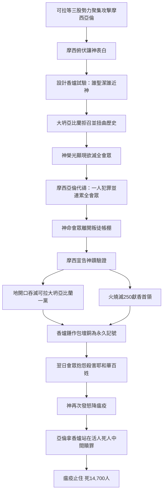

# 民數記 第16章

1. 利未的曾孫、哥轄的孫子、以斯哈的兒子[[可拉的背叛（預告）|可拉]]，和[[大坍亞比蘭|流便子孫]]中以利押的兒子[[大坍亞比蘭|大坍]]、[[大坍亞比蘭|亞比蘭]]，與比勒的兒子安，
2. 並以色列會中的[[可拉大坍亞比蘭安背叛摩西亞倫|二百五十個首領]]，就是有名望選入會中的人，在[[摩西]]面前一同起來，
3. 聚集攻擊[[摩西]]、[[亞倫]]，說：你們[[可拉大坍亞比蘭安背叛摩西亞倫|擅自專權]]！全會眾個個既是聖潔，耶和華也在他們中間，你們為什麼自高，超過耶和華的會眾呢？
4. [[摩西]]聽見這話就俯伏在地，
5. 對[[可拉的背叛（預告）|可拉]]和他一黨的人說：到了早晨，耶和華必指示誰是屬他的，誰是聖潔的，就叫誰親近他；他所揀選的是誰，必叫誰親近他。
6. [[可拉的背叛（預告）|可拉]]啊，你們要這樣行，你和你的一黨要[[可拉一黨拿香爐在耶和華面前|拿香爐]]來。
7. 明日，在耶和華面前，把火盛在爐中，把香放在其上。耶和華揀選誰，誰就為聖潔。你們這利未的子孫[[可拉大坍亞比蘭安背叛摩西亞倫|擅自專權]]了！
8. [[摩西]]又對[[可拉的背叛（預告）|可拉]]說：利未的子孫哪，你們聽我說！
9. 以色列的神從以色列會中將你們分別出來，使你們親近他，辦耶和華帳幕的事，並站在會眾面前替他們當差。
10. 耶和華又使你和你一切弟兄─利未的子孫─一同親近他，這豈為小事？你們還要求祭司的職任嗎？
11. 你和你一黨的人聚集是要攻擊耶和華。[[亞倫]]算什麼，你們竟向他發怨言呢？
12. [[摩西]]打發人去召以利押的兒子[[大坍亞比蘭|大坍]]、[[大坍亞比蘭|亞比蘭]]。他們說：我們不上去！
13. 你將我們從流奶與蜜之地領上來，要在曠野殺我們，這豈為小事？你還要自立為王轄管我們嗎？
14. 並且你沒有將我們領到流奶與蜜之地，也沒有把田地和葡萄園給我們為業。難道你要剜這些人的眼睛嗎？我們不上去！
15. [[摩西]]就甚發怒，對耶和華說：求你不要享受他們的供物。我並沒有奪過他們一匹驢，也沒有害過他們一個人。
16. [[摩西]]對[[可拉的背叛（預告）|可拉]]說：明天，你和你一黨的人，並[[亞倫]]，都要站在耶和華面前；
17. 各人要拿一個[[火鑵（machtah）|香爐]]，共二百五十個，把香放在上面，到耶和華面前。你和[[亞倫]]也各拿自己的香爐。
18. 於是他們各人拿一個[[火鑵（machtah）|香爐]]，盛上火，加上香，同[[摩西]]、[[亞倫]]站在會幕門前。
19. [[可拉的背叛（預告）|可拉]]招聚全會眾到會幕門前，要攻擊[[摩西]]、[[亞倫]]；耶和華的榮光就向全會眾顯現。
20. 耶和華曉諭[[摩西]]、[[亞倫]]說：
21. 你們離開這會眾，我好在轉眼之間把他們滅絕。
22. [[摩西]]、[[亞倫]]就俯伏在地，說：神，萬人之靈的神啊，一人犯罪，你就要[[摩西亞倫為會眾代禱|向全會眾發怒]]嗎？
23. 耶和華曉諭[[摩西]]說：
24. 你吩咐會眾說：你們離開[[可拉的背叛（預告）|可拉]]、[[大坍亞比蘭|大坍]]、[[大坍亞比蘭|亞比蘭]]帳棚的四圍。
25. [[摩西]]起來，往[[大坍亞比蘭|大坍]]、[[大坍亞比蘭|亞比蘭]]那裡去；以色列的長老也隨著他去。
26. 他吩咐會眾說：你們離開這惡人的帳棚吧，他們的物件，什麼都不可摸，恐怕你們陷在他們的罪中，與他們一同消滅。
27. 於是眾人離開[[可拉的背叛（預告）|可拉]]、[[大坍亞比蘭|大坍]]、[[大坍亞比蘭|亞比蘭]]帳棚的四圍。大坍、亞比蘭帶著妻子、兒女、小孩子，都出來，站在自己的帳棚門口。
28. [[摩西]]說：我行的這一切事本不是憑我自己心意行的，乃是耶和華打發我行的，必有證據使你們知道。
29. 這些人死若與世人無異，或是他們所遭的與世人相同，就不是耶和華打發我來的。
30. 倘若耶和華創作一件新事，使[[吞滅（bala）|地開口]]，把他們和一切屬他們的都吞下去，叫他們活活地墜落陰間，你們就明白這些人是藐視耶和華了。
31. [[摩西]]剛說完了這一切話，他們腳下的地就開了口，
32. 把他們和他們的家眷，並一切屬[[可拉的背叛（預告）|可拉]]的人丁、財物，都吞下去。
33. 這樣，他們和一切屬他們的，都活活地墜落陰間；地口在他們上頭照舊合閉，他們就從會中滅亡。
34. 在他們四圍的以色列眾人聽他們呼號，就都逃跑，說：恐怕地也把我們吞下去。
35. 又有火從耶和華那裡出來，燒滅了那獻香的二百五十個人。
36. 耶和華曉諭[[摩西]]說：
37. 你吩咐祭司[[亞倫]]的兒子[[以利亞撒]]從火中撿起那些[[火鑵（machtah）|香爐]]來，把火撒在別處，因為那些香爐是聖的。
38. 把那些犯罪、自害己命之人的[[火鑵（machtah）|香爐]]，叫人錘成片子，用以包壇。那些香爐本是他們在耶和華面前獻過的，所以是聖的，並且可以給以色列人作記號。
39. 於是祭司[[以利亞撒]]將被燒之人所獻的銅[[火鑵（machtah）|香爐]]拿來，人就錘出來，用以包壇，
40. 給以色列人作紀念，使[[亞倫]]後裔之外的人不得近前來[[可拉一黨拿香爐在耶和華面前|在耶和華面前燒香]]，免得他遭[[可拉的背叛（預告）|可拉]]和他一黨所遭的。這乃是照耶和華藉著[[摩西]]所吩咐的。
41. 第二天，以色列全會眾都向[[摩西]]、[[亞倫]]發怨言說：你們殺了耶和華的百姓了。
42. 會眾聚集攻擊[[摩西]]、[[亞倫]]的時候，向會幕觀看，不料，有雲彩遮蓋了，耶和華的榮光顯現。
43. [[摩西]]、[[亞倫]]就來到會幕前。
44. 耶和華吩咐[[摩西]]說：
45. 你們離開這會眾，我好在轉眼之間把他們滅絕。他們二人就俯伏於地。
46. [[摩西]]對[[亞倫]]說：拿你的[[火鑵（machtah）|香爐]]，把壇上的火盛在其中，又加上香，快快帶到會眾那裡，為他們贖罪；因為有忿怒從耶和華那裡出來，瘟疫已經發作了。
47. [[亞倫]]照著[[摩西]]所說的拿來，跑到會中，不料，瘟疫在百姓中已經發作了。他就加上香，為百姓贖罪。
48. 他站在活人死人中間，瘟疫就止住了。
49. 除了因[[可拉的背叛（預告）|可拉]]事情死的以外，遭瘟疫死的，共有[[瘟疫爆發亞倫拿香爐贖罪|一萬四千七百人]]。
50. [[亞倫]]回到會幕門口，到[[摩西]]那裡，瘟疫已經止住了。

<!-- fhl-map-links:start -->
## 相關地圖

- [[appendix/fhl_maps/maps/021|〈民圖二〉探查應許地和應許地的範圍]]
<!-- fhl-map-links:end -->

---

## 本章知識節點

### 神學
- [[神主權揀選祭司與領袖]]
- [[謙卑不為自己表白]]
- [[背叛神權柄的後果]]
- [[大祭司在死人活人中間贖罪]]
- [[可拉背叛預表猶大書警告（猶1：11）]]
- [[亞倫贖罪預表基督大祭司贖罪（來7：25）]]
- [[神審判背叛預表末世審判（啟20：11-15）]]

### 人物
- [[可拉大坍亞比蘭安背叛摩西亞倫]]
- [[大坍亞比蘭]]
- [[可拉是否為利未人嫉妒祭司職分]]
- [[大坍亞比蘭拒絕摩西召喚是否故意悖逆]]
- [[二百五十首領是否明知故犯]]

### 事件
- [[摩西俯伏在地讓神表白]]
- [[可拉一黨拿香爐在耶和華面前]]
- [[摩西亞倫為會眾代禱]]
- [[地開口吞滅可拉一黨]]
- [[火燒滅二百五十獻香的人]]
- [[香爐錘作包壇銅為記號]]
- [[會眾抱怨摩西亞倫殺害耶和華百姓]]
- [[瘟疫爆發亞倫拿香爐贖罪]]
- [[吞滅（bala）]]

### 器具
- [[火鑵（machtah）]]

---

## 本章整理

### 叛亂爆發：三股勢力聯手挑戰神權（v1-3）
經文一開場即點出三波叛亂核心：**可拉**（利未族哥轄支派）嫉妒祭司職分；**大坍、亞比蘭**（流便支派）不滿長子名分被約瑟二支派取代；**二百五十名首領**則是會中有名望的選民。他們聚集攻擊 [[摩西]]、[[亞倫]]：「全會眾個個既是聖潔，……你們為什麼自高，超過耶和華的會眾呢？」這句話直指神主權揀選的根基——聖潔不是群體自稱，乃是神呼召分別。

### 摩西的回應：俯伏讓神表白，設計香爐試驗（v4-11）
[[摩西]] 聽見「就俯伏在地」（v4），不為自己辯護，將判斷權完全交給神。他命令可拉一黨明日各拿香爐，在耶和華面前獻香，「耶和華揀選誰，誰就為聖潔」（v7）。摩西直指可拉的核心問題：神已將利未人分別出來「辦耶和華帳幕的事」（v9），這豈為小事？你們還要求祭司職任？這是「攻擊耶和華」（v11），而非單針對亞倫。

### 大坍、亞比蘭的拒絕與控訴（v12-15）
摩西召喚大坍、亞比蘭，他們拒絕上來，反倒扭曲歷史：「你將我們從流奶與蜜之地領上來，要在曠野殺我們」（v13），指稱埃及為應許之地，並指控摩西「自立為王」（v13）。摩西「甚發怒」，向神申訴：「我並沒有奪過他們一匹驢，也沒有害過他們一個人」（v15）——領袖的清廉在神面前成為申訴依據。

### 香爐試驗與榮光顯現（v16-19）
翌日，可拉、二百五十首領、亞倫各拿香爐，盛火加香，站在會幕門前。可拉招聚全會眾要攻擊摩西、亞倫，「耶和華的榮光就向全會眾顯現」（v19）。神的同在介入，審判即將執行。

### 神命令分離，摩西代禱（v20-24）
神要「在轉眼之間把他們滅絕」（v21），[[摩西]]、[[亞倫]] 再次俯伏代禱：「神，萬人之靈的神啊，一人犯罪，你就要向全會眾發怒嗎？」（v22）神聽從，命令會眾離開可拉、大坍、亞比蘭帳棚四圍。

### 地開口吞滅、火燒滅二百五十人（v25-35）
摩西宣告神蹟驗證：「倘若耶和華創作一件新事，使地開口……叫他們活活地墜落陰間」（v30）。話音剛落，**地開口吞滅可拉一黨**（連同家眷、財物），**火從耶和華出來燒滅二百五十獻香的人**。雙重審判精準對應兩類叛亂：利未人嫉妒祭職、首領僭越獻香權。

### 香爐錘作包壇銅——永久記號（v36-40）
神吩咐以利亞撒從火中撿起香爐，「錘成片子，用以包壇」（v38-39)。這些香爐因曾在耶和華面前獻過，成為聖物，改為銅壇包裹，給以色列人作紀念：「使亞倫後裔之外的人不得近前來在耶和華面前燒香，免得他遭可拉和他一黨所遭的」（v40）。==祭司職分的排他性以審判為代價確立==。

### 會眾抱怨、瘟疫爆發、亞倫贖罪站在死人活人中間（v41-50）
翌日全會眾反倒向摩西、亞倫發怨言：「你們殺了耶和華的百姓了」（v41）。神再次要滅絕會眾，摩西、亞倫俯伏代禱。摩西命亞倫拿香爐，盛壇火加香，「快快帶到會眾那裡，為他們贖罪」（v46）。亞倫跑到會中，站在「活人死人中間」，瘟疫止住。除可拉一黨外，**遭瘟疫死者共一萬四千七百人**。大祭司在死蔓延的邊緣以香代禱，預表基督大祭司的代求事奉（來 7:25）。

---
### 三波叛亂動機對照表
| 群體 | 代表人物 | 支派 | 核心不滿 | 審判方式 |
|------|----------|------|----------|----------|
| 利未人嫉妒祭職 | 可拉 | 利未（哥轄） | 要求祭司職任 | 地開口吞滅 + 火燒 |
| 長子名分被取代 | 大坍、亞比蘭 | 流便 | 指控摩西自立為王、未得應許地 | 地開口吞滅（連家眷） |
| 首領僭越獻香權 | 250 首領 | 各支派 | 自以為聖潔可獻香 | 火從耶和華出來燒滅 |

---
### 事件因果鏈

---
### 跨章脈絡與預表整理
- **可拉背叛**成為新約猶大書警告的典型：「可拉的背叛」（猶 1:11），象徵屬靈領袖被嫉妒、僭越神權者顛覆。
- **亞倫拿香爐贖罪，站在活人死人中間**，預表基督作大祭司「長遠活著，替他們祈求」（來 7:25），在審判臨到時成為中保。
- **地開口吞滅、火燒滅叛徒**，預表末世大白寶座審判（啟 20:11-15）：拒絕神主權揀選、僭越聖職者，終必面對「活活墜落陰間」的永恆後果。
- **香爐錘作包壇銅**，在聖所空間留下永久見證：==神的揀選不可僭越，親近神的路唯有神所定==。這銅壇包裹見證著每一次獻祭：祭司職分是恩典，非人謀取的權利。

**參考資料**
https://www.ccbiblestudy.org/Old%20Testament/04Num/04CT16.htm
https://www.ccbiblestudy.org/Old%20Testament/04Num/04GT16.htm
https://www.kingcomments.com/en/bible-studies/Num/16
https://biblehub.com/study/numbers/16.htm
