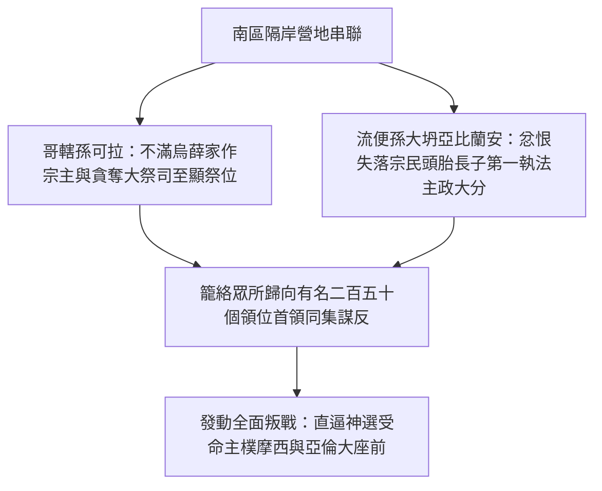
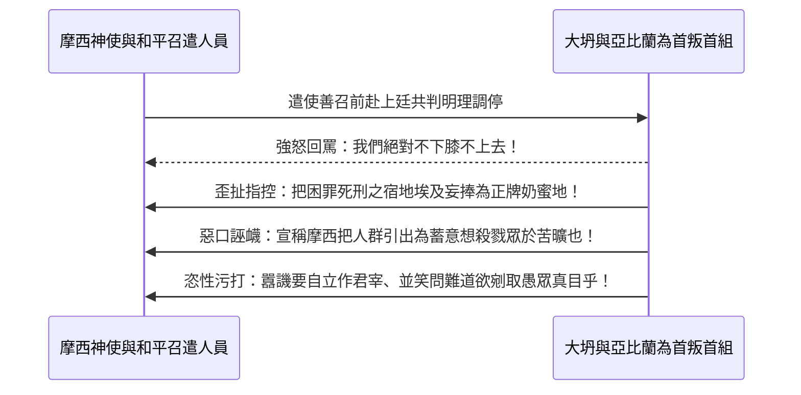
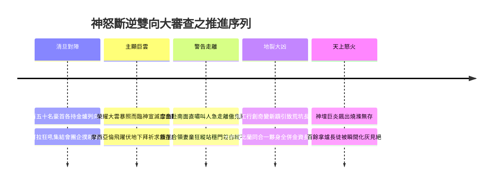
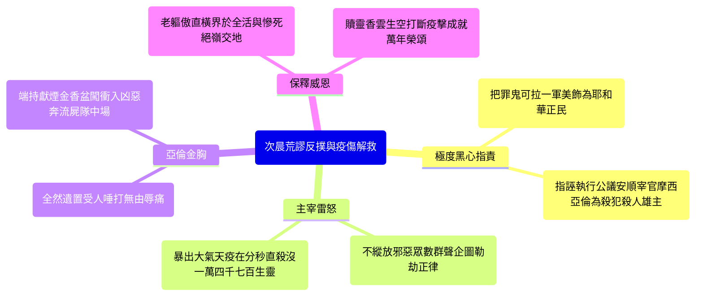

# 民數記 第16章

1. 利未的曾孫、哥轄的孫子、以斯哈的兒子可拉，和流便子孫中以利押的兒子[[可拉大坍亞比蘭等領首聯合的大反亂|大坍、亞比蘭]]，與比勒的兒子安，
2. 並[[可拉大坍亞比蘭等領首聯合的大反亂|以色列會中的二百五十個首領]]，就是有名望選入會中的人，在摩西面前一同起來，
3. 聚集攻擊摩西、亞倫，說：你們擅自專權！全會眾個個既是聖潔，耶和華也在他們中間，[[全會眾的聖潔宣示與對代表主職之挑釁|你們為什麼自高]]，超過耶和華的會眾呢？
4. 摩西聽見這話就俯伏在地，
5. 對可拉和他一黨的人說：到了早晨，耶和華必指示誰是屬他的，誰是聖潔的，就叫誰親近他；他所揀選的是誰，必叫誰親近他。
6. 可拉啊，你們要這樣行，你和你的一黨要拿香爐來。
7. 明日，在耶和華面前，把火盛在爐中，把香放在其上。耶和華揀選誰，誰就為聖潔。你們這利未的子孫擅自專權了！
8. 摩西又對可拉說：利未的子孫哪，你們聽我說！
9. [[利未職分的尊嚴與越權追求祭司職分|以色列的神從以色列會中將你們分別出來]]，使你們親近他，辦耶和華帳幕的事，並站在會眾面前替他們當差。
10. 耶和華又使你和你一切弟兄─利未的子孫─一同親近他，這豈為小事？[[利未職分的尊嚴與越權追求祭司職分|你們還要求祭司的職任嗎]]？
11. 你和你一黨的人聚集是要攻擊耶和華。亞倫算什麼，你們竟向他發怨言呢？
12. 摩西打發人去召以利押的兒子[[可拉大坍亞比蘭等領首聯合的大反亂|大坍、亞比蘭]]。他們說：[[大坍和亞比蘭強硬反抗與藐視帶進蜜地的應許|我們不上去]]！
13. 你將我們從流奶與蜜之地領上來，要在曠野殺我們，這豈為小事？你還要自立為王轄管我們嗎？
14. 並且你沒有將我們領到流奶與蜜之地，也沒有把田地和葡萄園給我們為業。難道你要剜這些人的眼睛嗎？[[大坍和亞比蘭強硬反抗與藐視帶進蜜地的應許|我們不上去]]！
15. 摩西就甚發怒，對耶和華說：求你不要享受他們的供物。我並沒有奪過他們一匹驢，也沒有害過他們一個人。
16. 摩西對可拉說：明天，你和你一黨的人，並亞倫，都要站在耶和華面前；
17. 各人要拿一個香爐，共二百五十個，把香放在上面，到耶和華面前。你和亞倫也各拿自己的香爐。
18. 於是他們各人拿一個香爐，盛上火，加上香，同摩西、亞倫站在會幕門前。
19. 可拉招聚全會眾到會幕門前，要攻擊摩西、亞倫；耶和華的榮光就向全會眾顯現。
20. 耶和華曉諭摩西、亞倫說：
21. 你們離開這會眾，我好在轉眼之間把他們滅絕。
22. 摩西、亞倫就俯伏在地，說：神，萬人之靈的神啊，一人犯罪，你就要向全會眾發怒嗎？
23. 耶和華曉諭摩西說：
24. 你吩咐會眾說：你們離開可拉、[[可拉大坍亞比蘭等領首聯合的大反亂|大坍、亞比蘭]]帳棚的四圍。
25. 摩西起來，往[[可拉大坍亞比蘭等領首聯合的大反亂|大坍、亞比蘭]]那裡去；以色列的長老也隨著他去。
26. 他吩咐會眾說：你們離開這惡人的帳棚吧，他們的物件，什麼都不可摸，恐怕你們陷在他們的罪中，與他們一同消滅。
27. 於是眾人離開可拉、[[可拉大坍亞比蘭等領首聯合的大反亂|大坍、亞比蘭]]帳棚的四圍。大坍、亞比蘭帶著妻子、兒女、小孩子，都出來，站在自己的帳棚門口。
28. 摩西說：我行的這一切事本不是憑我自己心意行的，乃是耶和華打發我行的，必有證據使你們知道。
29. 這些人死若與世人無異，或是他們所遭的與世人相同，就不是耶和華打發我來的。
30. 倘若耶和華創作一件新事，使地開口，把他們和一切屬他們的都吞下去，叫他們[[地破裂吞吃可拉與大坍亞比蘭之家與其財物|活活地墜落陰間]]，你們就明白這些人是藐視耶和華了。
31. 摩西剛說完了這一切話，他們腳下的地就開了口，
32. 把他們和他們的家眷，並一切屬可拉的人丁、財物，都吞下去。
33. 這樣，他們和一切屬他們的，都[[地破裂吞吃可拉與大坍亞比蘭之家與其財物|活活地墜落陰間]]；地口在他們上頭照舊合閉，他們就從會中滅亡。
34. 在他們四圍的以色列眾人聽他們呼號，就都逃跑，說：恐怕地也把我們吞下去。
35. 又[[耶和華的烈火將兩百五十個拿香爐者徹底毀滅|有火從耶和華那裡出來]]，[[耶和華的烈火將兩百五十個拿香爐者徹底毀滅|燒滅了那獻香的二百五十個人]]。
36. 耶和華曉諭摩西說：
37. 你吩咐祭司亞倫的兒子以利亞撒從火中撿起那些香爐來，把火撒在別處，因為那些香爐是聖的。
38. 把那些犯罪、自害己命之人的香爐，叫人錘成片子，用以包壇。那些香爐本是他們在耶和華面前獻過的，所以是聖的，並且可以[[香爐被鍛釘為包裝壇上的銅片與長遠鑑誡|給以色列人作記號]]。
39. 於是祭司以利亞撒將被燒之人所獻的銅香爐拿來，人就錘出來，用以包壇，
40. 給以色列人作紀念，使亞倫後裔之外的人不得近前來在耶和華面前燒香，免得他遭可拉和他一黨所遭的。這乃是照耶和華藉著摩西所吩咐的。
41. [[次日會眾猛發埋怨招致耶和華天譴大瘟疫|第二天，以色列全會眾都向摩西、亞倫發怨言]]說：[[次日會眾猛發埋怨招致耶和華天譴大瘟疫|你們殺了耶和華的百姓了]]。
42. 會眾聚集攻擊摩西、亞倫的時候，向會幕觀看，不料，有雲彩遮蓋了，耶和華的榮光顯現。
43. 摩西、亞倫就來到會幕前。
44. 耶和華吩咐摩西說：
45. 你們離開這會眾，我好在轉眼之間把他們滅絕。他們二人就俯伏於地。
46. 摩西對亞倫說：[[亞倫拿著香爐站在死人與活人中間祈禱救恩代濟|拿你的香爐]]，把壇上的火盛在其中，又加上香，快快帶到會眾那裡，[[亞倫拿著香爐站在死人與活人中間祈禱救恩代濟|為他們贖罪]]；因為有忿怒從耶和華那裡出來，瘟疫已經發作了。
47. 亞倫照著摩西所說的拿來，跑到會中，不料，瘟疫在百姓中已經發作了。他就加上香，為百姓贖罪。
48. 他站在活人死人中間，[[亞倫拿著香爐站在死人與活人中間祈禱救恩代濟|瘟疫就止住了]]。
49. 除了因可拉事情死的以外，遭瘟疫死的，共有一萬四千七百人。
50. 亞倫回到會幕門口，到摩西那裡，瘟疫已經止住了。

<!-- fhl-map-links:start -->
## 相關地圖

- [[appendix/fhl_maps/maps/021|〈民圖二〉探查應許地和應許地的範圍]]
<!-- fhl-map-links:end -->

---

## 本章知識節點

### 事件
- [[可拉大坍亞比蘭等領首聯合的大反亂]]
- [[大坍和亞比蘭強硬反抗與藐視帶進蜜地的應許]]
- [[地破裂吞吃可拉與大坍亞比蘭之家與其財物]]
- [[耶和華的烈火將兩百五十個拿香爐者徹底毀滅]]
- [[次日會眾猛發埋怨招致耶和華天譴大瘟疫]]

### 神學
- [[全會眾的聖潔宣示與對代表主職之挑釁]]
- [[利未職分的尊嚴與越權追求祭司職分]]
- [[摩西在耶和華面前自辯清白與拒受甘禮]]
- [[亞倫拿著香爐站在死人與活人中間祈禱救恩代濟]]

### 文化
- [[香爐被鍛釘為包裝壇上的銅片與長遠鑑誡]]

---

## 本章整理

### 可拉黨與多方的結盟與擅自專權之挑釁（v1-11）

民數記第十六章開啟了神民以色列在曠野靈程中最為心驚膽顫的悲慟絕章：這一宗涉及整個民族高層體系的奪權事變—[[可拉大坍亞比蘭等領首聯合的大反亂]]（v1-3）。經文清楚溯源指出，叛魁可拉並非毫無出身之士，他乃是利未的曾孫、哥轄的孫子、以斯哈的兒子。這段光鮮耀世的出身背後，暗藏著長期抑壓的野心狂禍：可拉身處哥轄族中，眼見自己雖擔負抬舉榮耀至極的至聖神器與抬櫃事工，依然屈居幕僚與輔助角色，對親近世裔亞倫一統祭司核心焚香祭把榮典極甚眼紅。不僅如此，黃迦勒尖銳指曉：「以斯哈是哥轄的次子，可拉極可能對哥轄的四子烏薛之子以利撒反竟獲受委升派作哥轄宗族大至榮的大宗長、心生極沉猛烈的深深不滿」（CT）；此時南方營地的巧合給他送來了結夥造反的夥伴：「流便本事以色列長子，因為當年淫行奔狂失去長子至榮福分的傳奇重盟（參創四十九3-4），其子嗣至此依仍存怨不平，極欲圖興兵戈翻扳掌執。因流便大團與哥轄族居區皆臨近紮棚在聖殿會幕朝南地域（民二10；三29），地理上相近便彼此共挑心毒，立意謀合成幫！」（GT）。在這股利慾薰心的共鳴下，流便一脈中以利押的兒子大坍、亞比蘭與比勒的兒子安，竟然牽出浩大的二百五十名威儀蓋民的著名首長、即會眾深切敬仰的領班豪雄，手按利器威風昂揚一鼓聚反於摩西亞倫坐殿之前。

```mermaid
flowchart TD
    A["南區隔岸營地串聯"] --> B["哥轄孫可拉：不滿烏薛家作宗主與貪奪大祭司至顯祭位"]
    A --> C["流便孫大坍亞比蘭安：忿恨失落宗民頭胎長子第一執法主政大分"]
    B --> D["籠絡眾所歸向有名二百五十個領位首領同集謀反"]
    C --> D
    D --> E["發動全面叛戰：直逼神選受命主樸摩西與亞倫大座前"]
```

這一大批強豪聚齊陣場後，立口宣拋下一幕陰悍凌厲、假借靈命自傲以包裝奪權狂縱的空前挑衅—[[全會眾的聖潔宣示與對代表主職之挑釁]]（v3）。他們暴指二領長大吼道：「你們擅自專權！全會眾個個既是聖潔，耶和華也在他們中間，你們為什麼自高，超過耶和華的會眾呢？」這裡敵營手抄的是西乃山上至高真神當日親口對無量人民頒下的誓許盟音：「你們要歸我作祭司的國度，為聖潔的國民」（出十九6）。然而這班悖反者犯下了致命的神學欺妄：將神對群族遍體客觀救恩庇衛之普世誓辭，惡性歪曲為每個人不需奉召也配硬手干涉高密核心獻靈官政之野心兵符！正如BibleHub深切剖析：「叛徒偽裝為民主和人權的大道戰將，指責摩西和亞倫出於貪戀塵邦尊長而把官任把持；事實是，神命分級管理從不折損民群在神前的共同榮美身份。用不相干的自慢誇口宣示全團聖潔，其真正心機是用經詞作為巨錘殺殺受天選派的中保與侍主先驅」（BH）。黃迦勒呼籲讀者洞悟此荒唐的反面成對：「『擅自專權』其實正是反反狂首心海狂欲之真正倒影；凡好圖驕名豪氣的人，極愛以此面目栽誣替世肩苦擔重負與垂膝為民吃哀的真使徒；真正有天上聖光者從不用抗逆大語為傲資！」（CT）。

> [!quote] 經典默想引句
> - 「可拉與黨徒打出口號宣喊平權，本心根本是不敬天王聖意；他們不是希圖全眾同尊，而是希冀一夕凌駕別眾之上。不信神選委派權杖的盲民，常常愛用極端美麗聖光言辭蓋藏世道狂欲。」(KC)
> - 「自稱各個聖潔而放恣攻罵主使官將，是靈裡最危險的一程：把神的應許化為了反抗神政、毀絕僕司的武器。」(GT)

針對上述來勢洶洶之挑釁，至恭無怒之摩西聞言並末舉槍呼喊衛士反壓，反而第一時空裡直接「俯伏在地」（v4）。隨即神僕轉面向著可拉跟他的狂縱徒屬疾言分判，把至高的天平全然托舉赴往至純的主意前：「到了早晨，耶和華必指示誰是屬祂的，誰是聖潔的，就叫誰親近祂；祂所揀選的是誰，必叫誰親近祂。可拉啊，你們要這樣行，你和你的一黨要拿香爐來。明日，在耶和華面前，把火盛在爐中，把香放在其上...你們這利未的子孫擅自專權了！」（v5-7）。隨後摩西深發熱呼，為其本家同嗣的宗親喊出了振聾發聵的千丈正理—[[利未職分的尊嚴與越權追求祭司職分]]（v8-11）。他對可拉厲說：「利未的子孫哪，你們聽我說！以色列的神從以色列會中將你們分別出來，使你們親近祂，辦耶和華帳幕的事，並站在會眾面前替他們當差...這豈為小事？你們還要求祭司的職任嗎？你和你一黨的人聚集是要攻擊耶和華。亞倫算什麼，你們竟向他發怨言呢？」

| 神聖侍工配置層次 | 賜福內含及託命特質 | 人欲墮落之病因探察 |
| :--- | :--- | :--- |
| **利未分派當差神榮** | 自千萬平姓大邦裡特拔出來、獨進會殿側圍安扛沉重寶箱護送行殿，乃非人世企及的大榮命。 | 當榮貴化作經常日慣，肉身漸嫌事務沉累索辱，傲視手承聖業為低價鄙小。 |
| **亞倫一宗掌祭祈天** | 是出於至蒼穹父上皇一不容疑、非依才能或狂欲而妄准自派的神揀揀派，手握直通活祭特榮。 | 野心人放任貪妄去硬奪越界、以驕狂目力妄盼焚香祭柄，落陷攻擊天神的大禍根！ |

KingComments 強而有勁地為此告白留銘：「利未人不甘守衛搬運聖殿至厚之特恩，反而貪念亞倫家首司直上高壇大祭的虛外名輝；當神恩領恩變作驕縱底牌時，人性的貪婪就忘記上帝手中所派定千金小席皆無上光榮。摩西戳中生死中心：亞倫僅是順主旨俯低服差的肉僕，大夥張手狂吼擊陷亞倫，骨子內唯有一個真相—公然聚力直挺出兵對幹宣恩排權的女禍神王耶和華！」（KC）。

### 大坍亞比蘭的抗逆與摩西在神前的極大哀哭（v12-15）

當摩西為求保全合族血脈不死，寬容不追、改以信介和平差派使員赴下南洋廣區意欲延呼流便子婿一敘分明時，事態再墜黑途，這便爆破出蠻狂絕倫、徹底顛覆公理的又一大亂況—[[大坍和亞比蘭強硬反抗與藐視帶進蜜地的應許]]（v12-14）。大坍與亞比蘭態度剛堅似鐵刃，絕不上前、連回敘皆一發悍罵：「我們不上去！你將我們從流奶與蜜之地領上來，要在曠野殺我們，這豈為小事？你還要自立為王轄管我們嗎？並且你沒有將我們領到流奶與蜜之地，也沒有把田地和葡萄園給我們為業。難道你要剜這些人的眼睛嗎？我們不上去！」

```mermaid
sequenceDiagram
    participant M as 摩西神使與和平召遣人員
    participant D as 大坍與亞比蘭為首叛首組
    M->>D: 遣使善召前赴上廷共判明理調停
    D-->>M: 強怒回罵：我們絕對不下膝不上去！
    D->>M: 歪扯指控：把困罪死刑之宿地埃及妄捧為正牌奶蜜地！
    D->>M: 惡口誣衊：宣稱摩西把人群引出為蓄意想殺戮眾於苦曠也！
    D->>M: 恣性污打：囂譏要自立作君宰、並笑問難道欲剜取愚眾真目乎！
```

這一長連綿如瘋海般的指責，將不悔頑劣洗成了令人寒悚無語之頂點。黃迦勒為大坍言語做了沉悲剖拆：「此兩首黨極敢張言顛倒千錯：把當處抽身哀叫連年血盡皮消的舊埃及鐵監牢獄，堂堂捧頌當成真正的流奶與蜜寶地！反而將引導自己自深冤抽脫救出海流的偉力帶頭僕長，歪誣成欲殺百姓於大塵的瘋殘徒君；他們進而狡指『你還要自立為王轄管我們乎？』更是倒因為果去褻辱自下跪無求的高謙王樸！」（CT）。BibleHub 分析此處最為狠險的一句「難道你要剜這些人的眼睛嗎？」時重重提道：「『剜人家眼』是中東古老語意中指涉把眾群眾矇著眼矇混帶往荒谷而不准存知的尖酸污辱；叛兵囂張譏笑摩西為騙誘眾氓迷行、叫群愚雙眸生瞎才甘隨其涉死野；這般口舌反映背叛心識一旦封狂，即永遠將上主的奇光指引翻為愚迷詐誘、把為奴苦窯想入仙蜜奇園」（BH）。

深受此番血口橫毒、直破天倫正義的巨恥凌凌刺割下，胸無自好、向為萬代無比安虛謙隱之摩西終於再起巨變，迎向深切之訴告—[[摩西在耶和華面前自辯清白與拒受甘禮]]（v15）。「摩西就甚發怒，對耶和華說：求你不要享受他們的供物。我並沒有奪過他們一匹驢，也沒有害過他們一個人。」這一口從沉悲義火噴拔至蒼穹主案前的禱聲，闡現了一位真善祭司極度清白長耀的光澤：

> [!important] 僕者修潔與公義神座之呼喚
> - **棄打屬世武爭**：面見眾口齊罵、強言要挾的沉苦殺意，摩西毫未圖提長兵刃向族反撲或引派密刑報除仇口，而是依恃信仰直向天威寶壇求裁。
> - **自守修德鐵證**：「未嘗搶取群眾半口蹇驢、更無傷冤任意微民一人！」這非炫功誇揚，而是立碑為誓，申現正統受奉管政神使必定具有絕對純良清廉之天心品實；若毫差貪藏，即刻將在此暴逆浩災前沒法得到上天挺出金仗為之昭慰成全。
> - **拒納頑者髒祭**：深明野心橫心者欲借神聖香壇當打江山戰具時，其所貢馨香全屬極惡臭煙；摩西疾告神王拒享此偽禮，堅定祈願全察透靈之地即自展霆聲裁辦。

### 雙重浩劫臨降：地破深開與烈火燒殺之災威（v16-40）

當早晨臨近，摩西敕召可拉和那強猛兩百五十位著名豪賢分舉自持金銅香爐，各盛活炭把香置上，昂身狂進直抵會幕首牆；與此此際，可拉倚賴廣宣浩聲，將全聚民幫簇齊招至於天端神前共圖大攻擊。然而此處雷聲震撼：「耶和華的榮光就向全會眾顯現！」（v19）。主意翻揚，耶和華第一大念甚至對雙首諭云：「你們離開這會眾，我好在轉眼之間把他們滅絕！」（v21），好在摩西及亞倫又下長躬「俯伏在地」狂吼道：「神，萬人之靈的神啊，一人犯罪，你就要向全會眾發怒嗎？」（v22），方保除滅廣黎浩威止卻。隨即摩西隨天主發令，赴臨南營對合族高喊：「你們離開這惡人的帳棚吧，他們的物件，什麼都不可摸，恐怕你們陷在他們的罪中，與他們一同消滅！」（v26）。眾生恐懼連跑竄開，只見大坍和亞比蘭滿引家眷幼童傲立於帳口仰眉叫拒。

此陣此刻，摩西向山崖諸軍喊出一項天地初闢至今天道空絕無兩之威猛證誓，牽拉引導出那第一波如驚天霹靂的神判震絕大災—[[地破裂吞吃可拉與大坍亞比蘭之家與其財物]]（v28-34）。摩西宣訴：「我行的這一切事本不是憑我自己心意行的，乃是耶和華打發我行的，必有證據使你們知道。這些人死若與世人無異，或是他們所遭的與世人相同，就不是耶和華打發我來的。倘若耶和華創作一件新事，使地開口，把他們和一切屬他們的都吞下去，叫他們活活地墜落陰間，你們就明白這些人是藐視耶和華了！」話聲才收末一刻，底下石岩轟響爆離，「他們腳下的地就開了口，把他們和他們的家眷，並一切屬可拉的人丁、財物，都吞下去...活活地墜落陰間；地口在他們上頭照舊合閉，他們就從會中滅亡」（v31-33）。

```mermaid
timeline
    title 神怒斷逆雙向大審查之推進序列
    清旦對陣 : 兩百五十名豪首各持金爐列向門陣 : 可拉狂吼集結會團企撲殺領將
    主顯巨雲 : 榮耀大雲暴照而臨神宣滅亡全數 : 摩西亞倫飛躍伏地下拜祈求救存廣眾
    警告走離 : 摩西赴南面直嘯叫人急走離傲鬼惡帳 : 叛王合領妻童狂縱站穩門首自縱不走
    地裂大凶 : 神工行創奇變新蹟引致荒坑長噬 : 大坍亞比蘭同合一夥身全併金資長墜陰坑
    天上怒火 : 神壇巨炎飆出燒滌無存 : 百餘拿爐長徒被瞬間化灰見絕
```

這一席荒悲場面打向古今。KingComments 極力發聲點破此中巨絕旨要：「神親為使僕出手，作出一件曠宇古今前途所休逢的『新事』—地不僅不容傲腳踩踐，更開喉似貪獸大嚥！當眾驕自喜把家業聚立於南地高自矜榮、打算扯裂神的選會與和平統帶，主便降此重重斷裁：凡逆命狂自高舉者，下沉極邃陰沉冰河底中。這般超絕奇觀警告千秋：違慢真使者、心圖霸政者絕無能逍遙處野，地口隨命破啟收吞不義！」（KC）。而隨後與這地坑相對照呼應的，就是發生在上高會帳的另一面嚴肅鐵威—[[耶和華的烈火將兩百五十個拿香爐者徹底毀滅]]（v35）。

| 神裁審判災罰雙現 | 受死之罪囚階位性質 | 天火地焰之靈界訓明 |
| :--- | :--- | :--- |
| **山土陷散吞深坑** | 拒絕跟隨指路長帶、心向妄途舊埃及並強留長帳叫嘯之大坍亞比蘭與其一脈家屬。 | 以真土撕解開天闢地新蹟證明：違拒王意派立之王使就是直接與長創造化大君決生死對拼！ |
| **烈炎飄燒取百長** | 放逐尊恩本席、貪企伸手直攬亞倫家系單領大祭權任的兩百五十個著名領員。 | 以聖潔忌邪純焰告警萬物：未准獲召之私人放任祭欲絕對不能靠近聖殿爐門，違者一舉遭燒作死途化燼！ |

然而在此骨飛煙滅、震荒動地災痛後，上帝以宏深莫大的大智慧將沉哀逆業折易打就為了長存千代的聖訓教科書—[[香爐被鍛釘為包裝壇上的銅片與長遠鑑誡]]（v36-40）。「耶和華曉諭摩西說：你吩咐祭司亞倫的兒子以利亞撒從火中撿起那些香爐來，把火撒在別處，因為那些香爐是聖的。把那些犯罪、自害己命之人的香爐，叫人錘成片子，用以包壇...給以色列人作記號」（v36-38）。這項偉然絕頂之手作工程引來各方重度讚歌。「銅質香爐雖在反君手抓妄逞野火中成害自喪，可是因經投誠直擺入無雙永主長殿之前，在天視深裡已被無解宣洗成為不可隨流當圾割損之榮極聖具。是以神叫下一班司主幼郎以利亞撒步進慘冷灰場將它們拾揀歸宗，呼喚工人拿沉鐵巨槌把它們敲平打拓，片片拉築作封蓋聖浩燔儀銅神壇身之新裝鐵袍！」（CT）。

BibleHub 一面歌詠其宏傳：「每一次來後歲月有千萬以裔驅牽牛豚至前拜進時，眼瞳稍垂見看壇身披覆打扁銅張，立即打心回響可拉狂群的淒厲落沉！」（BH）；KingComments 更加以致敬：「這無可改替的神啟工匠設計，是以浩瀚愛心把罪人造反殘痕換升至永留的守護界壇兵章；永遠告知後方子弟—絕勿圖伸傲腳強窺長司大寶，更莫走入肉身情意闖神的大苦禍界！」（KC）。

### 終端爭禍起炎禍與亞倫身擋疫潮代禱中保（v41-50）

若以為親身歷經如斯地撕巨裂、天破紅禍、身骨吞火無遺的大重震撼，荒漠合聚的以色列千軍即當久跪不敢啟怨，那是極大遺忘低估了人類罪性原性不受重洗解套之前有多麼幽暗強硬！這曠無前例的逆反終幕狂言於隔夕晨起瞬間爆炸開展—[[次日會眾猛發埋怨招致耶和華天譴大瘟疫]]（v41）。「第二天，以色列全會眾都向摩西、亞倫發怨言說：你們殺了耶和華的百姓了。會眾聚集攻擊摩西、亞倫的時候，向會幕觀看，不料，有雲彩遮蓋了，耶和華的榮光顯現...耶和華吩咐摩西說：你們離開這會眾，我好在轉眼之間把他們滅絕！」（v41-45）。

```mermaid
mindmap
    root("次晨荒謬反撲與疫傷解救")
      極度黑心指責
        ("把罪鬼可拉一軍美飾為耶和華正民")
        ("指誣執行公議安順宰官摩西亞倫為殺犯殺人雄主")
      主宰雷怒
        ("不縱放邪惡眾數群聲企圖勒劫正律")
        ("暴出大氣天疫在分秒直殺沒一萬四千七百生靈")
      亞倫金胸
        ("全然遺置受人唾打無由辱痛")
        ("端持獻煙金香盆闖衝入凶惡奔流屍隊中場")
      保釋威恩
        ("老軀傲直橫界於全活與慘死絕嶺交地")
        ("贖靈香雲生空打斷疫擊成就萬年榮頌")
```

這一波接反抗所呈現的那般荒謬不悟將歷史人性打上深深沉辱。黃迦勒震顫而批：「此時廣聚浩豪會黎不僅毫無垂謝哀痛之心，竟忘性強頑，在一宿之後轉把死得萬次仍該無悔的逆怪叛神者『可拉跟那香爐首黨』吹成了『耶和華的好品民眾』！又將持誠領赦、在災荒拉護大民好幾度的使僕反口大罵為隨手殘害生的殺頭兇惡！極愚妄地以多數眾體之口強索凌駕真主宰律判！」（CT）。這狂言招降極至迅捷殘虐之奪命病潮，「瘟疫在百姓中已經發作了...遭瘟疫死的，共有一萬四千七百人」（v47,49）。這沉慟史語留下鐵血戒語：「真理的定度永與聲眾無緣！眾生盲歡把真偽逆轉、企用萬數喧鬧逼綁大上帝決裁，必然吃往無比極速、浩難遏退的天罪病大獵局！」（GT）。

但便正在病飆長肆狂走、亡嚎破裂野天的最深黑危沉間，一幅聳動長空萬代、展露靈活最高中保浩愛無雙之經典活景閃曜而出—[[亞倫拿著香爐站在死人與活人中間祈禱救恩代濟]]（v46-48）。摩西一眼看穿無量災劫奔殺，呼喊著年過八秩、頂鬚盡雪卻懷純良巨仁的大祭司兄長：「拿你的香爐，把壇上的火盛在其中，又加上香，快快帶到會眾那裡，為他們贖罪！」（v46）。亞倫片刻休棄嫌疑與傷情，捧取火爐抓把壇焰拋下馨香狂馳飛馳進發大戰暴中！「亞倫照著摩西所說的拿來，跑到會中，不料，瘟疫在百姓中已經發作了。他就加上香，為百姓贖罪。他站在活人死人中間，瘟疫就止住了！」（v47-48）。

> [!important] 頂尖預表：亞倫挺身與耶穌基督的中保宏願
> - **捨恨無怨**：一位隔天早夕方遭大夥眾氓手指漫罵、企求揪下祭主神首的年長祭士，遭遇暴敵受譴未有暗笑自歡，反不畏染病冒狂死衝往人海核心，將自身之寶貴年齡寄掛刀海擋仇。
> - **香火活贖**：手中的香不是凡火，而是引向真正燔儀聖座中不滅淨火所發燒出的求祈芬香；這是唯一可以把極烈疫飆抵死震平之偉愛救藥。
> - **生死分界之橋**：「他站在死人活人中間！」這成為新約極臻真情之中保原型像——正如主上帝那垂下世界長降刑苦的愛子基督，一人立在絕壑沉淵的慘沒罪人死途、與浩長長天向新生命呼安之間，捨己成架、吐現芬膏長祈天怒停絕，換得了罪海平生真正成保赦安之極厚重喜榮！

### 跨章脈絡整合與終極救恩審度（v1-50）

當我們垂眸看盡這段充滿震撼地裂、長烈焰災，乃至銅板留鑑與中保香霧繞殿止殤的長章史路時，可以看到民數記正一步一步步將曠野靈魂洗練到前所未見深廣的絕對真信仰高峰。上帝並不用暴怒無由斷除世子，祂是在血水淚汗、悖德抗命不息的故事線裡，打造出一層層通貫天上恩愛不棄神誓之浩亮豐碑。面對自驕奪寵、借神理名詞硬闖聖位的驕心叛幫，地陷與天上真火絕不動搖地見證神靈權柄之不可挑戰性；而即便人性頑癡不已、轉眼忘災以怨擊僕招殃臨病，主愛終依然借著年邁神司奮軀持盆奔往死活交界之中保獻功，將死擊大劫拉下謝止之幕。

這本是一部引人泣歎與高仰膜敬雙心混進的曠野浩唱，向往後一脈奔去長國光明家園的天路子民發出長鳴警世語：永遠珍愛自己手持之天定使命、永不貪看高居人殿之上；遇到幽暗挫情不生怨言，並且永遠敬佩仰望那一人擋盡絕路、屹立生死兩際為萬生乞贖和平與天息的主宰真恩主！

**參考資料**
https://www.ccbiblestudy.org/Old%20Testament/04Num/04CT16.htm
https://www.ccbiblestudy.org/Old%20Testament/04Num/04GT16.htm
https://www.kingcomments.com/en/bible-studies/Num/16
https://biblehub.com/study/numbers/16.htm
