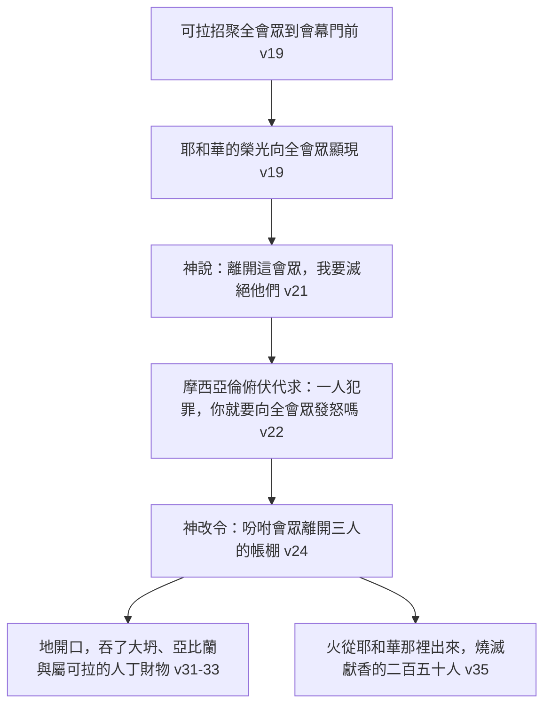

# 民數記 第16章

<!-- chapter-navigation:start -->
| [前一章](../04%20民數記/第15章.md) | [回目錄](../04%20民數記/全書目錄及綱要.md) | [下一章](../04%20民數記/第17章.md) |
| :--- | :---: | ---: |
<!-- chapter-navigation:end -->

1. 利未的曾孫、哥轄的孫子、[[可拉大坍亞比蘭等領首聯合的大反亂|以斯哈的兒子可拉]]，和[[流便]]子孫中以利押的兒子[[可拉大坍亞比蘭等領首聯合的大反亂|大坍、亞比蘭]]，與比勒的兒子安，
2. 並以色列會中的[[可拉大坍亞比蘭等領首聯合的大反亂|二百五十個首領]]，就是有名望選入會中的人，在[[摩西]]面前一同起來，
3. 聚集攻擊[[摩西]]、[[亞倫]]，說：你們擅自專權！[[全會眾的聖潔宣示與對代表主職之挑釁|全會眾個個既是聖潔]]，耶和華也在他們中間，[[全會眾的聖潔宣示與對代表主職之挑釁|你們為什麼自高]]，[[全會眾的聖潔宣示與對代表主職之挑釁|超過耶和華的會眾呢]]？
4. [[摩西]]聽見這話就俯伏在地，
5. 對[[可拉的背叛（預告）|可拉]]和他一黨的人說：到了早晨，耶和華必指示誰是屬他的，誰是聖潔的，就叫誰親近他；他所揀選的是誰，必叫誰親近他。
6. [[可拉的背叛（預告）|可拉]]啊，你們要這樣行，你和你的一黨要拿[[香爐]]來。
7. 明日，在耶和華面前，把火盛在爐中，把香放在其上。耶和華揀選誰，誰就為聖潔。你們這利未的子孫擅自專權了！
8. [[摩西]]又對[[可拉的背叛（預告）|可拉]]說：利未的子孫哪，你們聽我說！
9. [[利未職分的尊嚴與越權追求祭司職分|以色列的神從以色列會中將你們分別出來]]，使你們親近他，辦耶和華帳幕的事，並站在[[全會眾|會眾]]面前替他們當差。
10. 耶和華又使你和你一切弟兄─利未的子孫─一同親近他，[[利未職分的尊嚴與越權追求祭司職分|這豈為小事]]？[[利未職分的尊嚴與越權追求祭司職分|你們還要求祭司的職任嗎]]？
11. 你和你一黨的人聚集是要攻擊耶和華。[[亞倫]]算什麼，你們竟向他發怨言呢？
12. [[摩西]]打發人去召以利押的兒子[[可拉大坍亞比蘭等領首聯合的大反亂|大坍、亞比蘭]]。他們說：[[大坍和亞比蘭強硬反抗與藐視帶進蜜地的應許|我們不上去]]！
13. [[大坍和亞比蘭強硬反抗與藐視帶進蜜地的應許|你將我們從流奶與蜜之地領上來]]，要在曠野殺我們，[[利未職分的尊嚴與越權追求祭司職分|這豈為小事]]？你還要自立為王轄管我們嗎？
14. 並且你沒有將我們領到流奶與蜜之地，也沒有把田地和葡萄園給我們為業。[[大坍和亞比蘭強硬反抗與藐視帶進蜜地的應許|難道你要剜這些人的眼睛嗎]]？[[大坍和亞比蘭強硬反抗與藐視帶進蜜地的應許|我們不上去]]！
15. [[摩西]]就甚發怒，對耶和華說：[[摩西在耶和華面前自辯清白與拒受甘禮|求你不要享受他們的供物]]。[[摩西在耶和華面前自辯清白與拒受甘禮|我並沒有奪過他們一匹驢]]，[[摩西在耶和華面前自辯清白與拒受甘禮|也沒有害過他們一個人]]。
16. [[摩西]]對[[可拉的背叛（預告）|可拉]]說：明天，你和你一黨的人，並[[亞倫]]，都要站在耶和華面前；
17. 各人要拿一個[[香爐]]，共二百五十個，把香放在上面，到耶和華面前。你和[[亞倫]]也各拿自己的香爐。
18. 於是他們各人拿一個[[香爐]]，盛上火，加上香，同[[摩西]]、[[亞倫]]站在會幕門前。
19. [[可拉的背叛（預告）|可拉]]招聚[[全會眾]]到會幕門前，要攻擊[[摩西]]、[[亞倫]]；[[耶和華的榮光]]就向全會眾顯現。
20. 耶和華曉諭[[摩西]]、[[亞倫]]說：
21. 你們離開這[[全會眾|會眾]]，我好在轉眼之間把他們滅絕。
22. [[摩西]]、[[亞倫]]就俯伏在地，說：神，萬人之靈的神啊，一人犯罪，你就要向[[全會眾]]發怒嗎？
23. 耶和華曉諭[[摩西]]說：
24. 你吩咐[[全會眾|會眾]]說：你們離開[[可拉的背叛（預告）|可拉]]、[[可拉大坍亞比蘭等領首聯合的大反亂|大坍、亞比蘭]]帳棚的四圍。
25. [[摩西]]起來，往[[可拉大坍亞比蘭等領首聯合的大反亂|大坍、亞比蘭]]那裡去；[[以色列的長老]]也隨著他去。
26. 他吩咐[[全會眾|會眾]]說：你們離開這惡人的帳棚吧，他們的物件，什麼都不可摸，恐怕你們陷在他們的罪中，與他們一同消滅。
27. 於是眾人離開[[可拉的背叛（預告）|可拉]]、[[可拉大坍亞比蘭等領首聯合的大反亂|大坍、亞比蘭]]帳棚的四圍。大坍、亞比蘭帶著妻子、兒女、小孩子，都出來，站在自己的帳棚門口。
28. [[摩西]]說：我行的這一切事本不是憑我自己心意行的，乃是耶和華打發我行的，必有證據使你們知道。
29. 這些人死若與世人無異，或是他們所遭的與世人相同，就不是耶和華打發我來的。
30. 倘若耶和華創作一件新事，使地開口，把他們和一切屬他們的都吞下去，叫他們[[地破裂吞吃可拉與大坍亞比蘭之家與其財物|活活地墜落陰間]]，你們就明白這些人是藐視耶和華了。
31. [[摩西]]剛說完了這一切話，[[地破裂吞吃可拉與大坍亞比蘭之家與其財物|他們腳下的地就開了口]]，
32. [[地破裂吞吃可拉與大坍亞比蘭之家與其財物|把他們和他們的家眷]]，並一切屬[[可拉的背叛（預告）|可拉]]的人丁、財物，都吞下去。
33. 這樣，他們和一切屬他們的，都[[地破裂吞吃可拉與大坍亞比蘭之家與其財物|活活地墜落陰間]]；地口在他們上頭照舊合閉，他們就從會中滅亡。
34. 在他們四圍的以色列眾人聽他們呼號，就都逃跑，說：恐怕地也把我們吞下去。
35. 又[[耶和華的烈火將兩百五十個拿香爐者徹底毀滅|有火從耶和華那裡出來]]，[[耶和華的烈火將兩百五十個拿香爐者徹底毀滅|燒滅了那獻香的二百五十個人]]。
36. 耶和華曉諭[[摩西]]說：
37. 你吩咐[[亞倫和他兒子（祭司）|祭司]][[亞倫]]的兒子[[以利亞撒]]從火中撿起那些[[香爐]]來，把火撒在別處，因為那些香爐是聖的。
38. 把那些犯罪、自害己命之人的[[香爐]]，[[香爐被鍛釘為包裝壇上的銅片與長遠鑑誡|叫人錘成片子]]，[[香爐被鍛釘為包裝壇上的銅片與長遠鑑誡|用以包壇]]。那些香爐本是他們在耶和華面前獻過的，所以是聖的，並且可以[[香爐被鍛釘為包裝壇上的銅片與長遠鑑誡|給以色列人作記號]]。
39. 於是[[亞倫和他兒子（祭司）|祭司]][[以利亞撒]]將被燒之人所獻的銅[[香爐]]拿來，人就錘出來，[[香爐被鍛釘為包裝壇上的銅片與長遠鑑誡|用以包壇]]，
40. 給以色列人作紀念，使[[亞倫]]後裔之外的人不得近前來在耶和華面前燒香，免得他遭[[可拉的背叛（預告）|可拉]]和他一黨所遭的。這乃是照耶和華藉著[[摩西]]所吩咐的。
41. [[次日會眾猛發埋怨招致耶和華天譴大瘟疫|第二天，以色列全會眾都向摩西、亞倫發怨言]]說：[[次日會眾猛發埋怨招致耶和華天譴大瘟疫|你們殺了耶和華的百姓了]]。
42. [[全會眾|會眾]]聚集攻擊[[摩西]]、[[亞倫]]的時候，向會幕觀看，不料，有雲彩遮蓋了，[[耶和華的榮光]]顯現。
43. [[摩西]]、[[亞倫]]就來到會幕前。
44. 耶和華吩咐[[摩西]]說：
45. 你們離開這[[全會眾|會眾]]，我好在轉眼之間把他們滅絕。他們二人就俯伏於地。
46. [[摩西]]對[[亞倫]]說：[[亞倫拿著香爐站在死人與活人中間祈禱救恩代濟|拿你的香爐]]，把壇上的火盛在其中，又加上香，快快帶到[[全會眾|會眾]]那裡，[[亞倫拿著香爐站在死人與活人中間祈禱救恩代濟|為他們贖罪]]；因為有忿怒從耶和華那裡出來，瘟疫已經發作了。
47. [[亞倫]]照著[[摩西]]所說的拿來，跑到會中，不料，[[次日會眾猛發埋怨招致耶和華天譴大瘟疫|瘟疫在百姓中已經發作了]]。他就加上香，為百姓贖罪。
48. [[亞倫拿著香爐站在死人與活人中間祈禱救恩代濟|他站在活人死人中間]]，[[亞倫拿著香爐站在死人與活人中間祈禱救恩代濟|瘟疫就止住了]]。
49. 除了因[[可拉的背叛（預告）|可拉]]事情死的以外，遭瘟疫死的，共有一萬四千七百人。
50. [[亞倫]]回到會幕門口，到[[摩西]]那裡，瘟疫已經止住了。

---

## 本章知識節點

### 事件
- [[可拉大坍亞比蘭等領首聯合的大反亂]]
- [[大坍和亞比蘭強硬反抗與藐視帶進蜜地的應許]]
- [[地破裂吞吃可拉與大坍亞比蘭之家與其財物]]
- [[耶和華的烈火將兩百五十個拿香爐者徹底毀滅]]
- [[次日會眾猛發埋怨招致耶和華天譴大瘟疫]]
- [[耶和華擊打百姓的瘟疫]]

### 神學
- [[全會眾的聖潔宣示與對代表主職之挑釁]]
- [[利未職分的尊嚴與越權追求祭司職分]]
- [[摩西在耶和華面前自辯清白與拒受甘禮]]
- [[亞倫拿著香爐站在死人與活人中間祈禱救恩代濟]]
- [[耶和華的榮光]]
- [[摩西的代求]]
- [[中保]]

### 文化
- [[香爐被鍛釘為包裝壇上的銅片與長遠鑑誡]]
- [[香爐]]
- [[以色列的長老]]

### 人物
- [[可拉的背叛（預告）]]
- [[摩西]]
- [[亞倫]]
- [[以利亞撒]]
- [[利未支派]]
- [[流便]]
- [[全會眾]]
- [[亞倫和他兒子（祭司）]]

### 主題
- [[銅壇（燔祭壇）]]

### 歷史
- [[以色列人的怨言]]

---

## 本章整理

這一章是曠野旅程的谷底。前面幾章百姓想回埃及、厭棄嗎哪、拒絕進迦南；這一章他們要換掉神所立的領袖與祭司。KC 一句話定了位：在前幾章那些事之後，還會更糟嗎？會。

### 一、兩批人，兩個目標（v1-3）

叛變不是一群人臨時起意，是兩個不同的訴求湊在一起（[[可拉大坍亞比蘭等領首聯合的大反亂|一場有組織的聯合叛變]]）：

| 帶頭者 | 出身 | 要的是什麼 | 各家指出的心結 |
| :--- | :--- | :--- | :--- |
| 可拉 | 利未支派哥轄族 | 亞倫的祭司職分 | CT：不滿哥轄宗族首領由烏薛的兒子以利撒反擔任 |
| 大坍、亞比蘭、安 | [[流便]]支派 | 摩西的領導權 | CT／GT 丁良才：先祖流便因淫行失了長子名分（創49:3-4） |
| 二百五十個首領 | 各支派 | 隨之而起 | CT：「有名望」指受到眾人擁戴 |

KC 把兩個目標分得最清楚：大坍、亞比蘭伸手要的是摩西的領導權，可拉伸手要的是亞倫的祭司職分。

他們為什麼湊得到一起？CT 與 GT 丁良才《民數記註釋》給的是同一個地理原因：流便營與哥轄營都在會幕的南邊（民2:10；3:29），「所以多有同心合謀的機會」。GT 丁良才並列出可拉的三樣心思：「可拉在這件事上，存三樣不良的心：1驕傲，2嫉妒，3貪婪。」

他們的[[全會眾的聖潔宣示與對代表主職之挑釁|口號]]是第3節：「你們擅自專權！全會眾個個既是聖潔，耶和華也在他們中間，你們為什麼自高，超過耶和華的會眾呢？」

前半句引的是真的（出19:6；利20:26），但 GT 丁良才點破了用法：「可拉一黨的人，本是為自己圖謀祭司的職分（10），卻假裝是為大眾辯理。」KC 說得更直白：叛黨先奉承百姓、宣告大家都是聖潔的，而聖潔不是靠人宣告出來的，是靠守耶和華的誡命；百姓吃這一套，卻看不見真正的權力仍握在少數幾個發動者手上。

> [!note] 「擅自專權」原文只有兩個字
> STEP 原文資料顯示這句話是 רַב־ לָכֶם（rav- la./Khem），H7227A rav「多、夠了」加介詞，字面是對你們來說太多了。CT 在原文字義也註明「擅自專權」原文無此詞。
>
> 更值得注意的是它在本章出現了幾次：**兩次，第3節與第7節**。第3節是叛黨對摩西說的，第7節是摩西原封不動還回去——「你們這利未的子孫擅自專權了！」GT 丁良才註明了這層關係：「摩西這話，乃是因為可拉曾說他們擅自專權」

### 二、摩西不辯，交給神（v4-11）

第4節只有一句話：「摩西聽見這話就俯伏在地」CT 的觀察是：那麼多人站在那裡說話，只有摩西一人俯伏在地；他沒有個人的感覺，不表白，也不爭執。KC 的讀法相同：他把決定權交給耶和華，對結果很安心。

摩西提出的辦法是[[香爐]]試驗（v6-7）：各人拿香爐、盛火加香，站在耶和華面前，「耶和華揀選誰，誰就為聖潔」。

這個辦法選得很準。GT 丁良才指出可拉一黨對這件事早該有警覺：「可拉和他一黨的人，因拿答亞比戶所遭遇的事，早已受了警誡（利十1-3）。」KC 也點出燒香是祭司最接近神的一項職事，而耶和華曾經就在這件事上向全會眾顯明過祂的聖潔。

GT《舊約聖經背景註釋》說明香爐的形制：「這些香爐最有可能是可兼用來剷起煤炭的長柄小鍋。由於他們在裡面燒香，這也是活動的香壇。」

接著是摩西的[[利未職分的尊嚴與越權追求祭司職分|正面答覆]]（v8-11）：神已經把利未人從會眾中分別出來、使他們親近祂、辦耶和華帳幕的事，「這豈為小事？你們還要求祭司的職任嗎？」

CT 把爭執的本質從地位移開：「在神家的事工上，根本不是爭「地位」的問題，而是人對於神所安排職事與功能的看法如何；歸根結柢，是對於神權柄的態度問題。」GT《舊約聖經背景註釋》也分辨了兩種職分：聖幕與祭壇周圍的聖潔特區交由利未人照管，[[亞倫和他兒子（祭司）|祭司]]則在祭壇負責實際執行儀式與獻祭。

第11節摩西給這件事定了性：「你和你一黨的人聚集是要攻擊耶和華。」STEP 原文資料在同一節留下一個容易漏掉的細節——「向他發怨言」的動詞 תַלִּינוּ（ti.lo.nu，H3885B，lun，to grumble）是使役語態，字面是你們使人發怨言。不只是自己抱怨，是把別人也帶著一起抱怨（[[以色列人的怨言]]）。

### 三、另一邊：大坍和亞比蘭不肯來（v12-15）

摩西打發人去召他們，得到的是兩次[[大坍和亞比蘭強硬反抗與藐視帶進蜜地的應許|「我們不上去」]]，中間夾著一段控訴（v13-14）：埃及被說成「流奶與蜜之地」，摩西被說成想在曠野殺他們、還要自立為王。

GT 丁良才《民數記註釋》指出這段話顛倒了什麼：「這話是顛倒是非，因為這名字原是迦南的一個美稱，他們竟要加於埃及，忘了他們在埃及所受的苦」GT《舊約聖經背景註釋》解釋「剜眼睛」是一句成語：「意思是矇騙人。可拉黨人拒絕參與摩西提出的試驗，指控他是騙子，已經矇蔽了這麼多人跟從他。」KC 的評語是：真正被矇住眼睛的是把埃及記成流奶與蜜之地的人。

STEP 原文資料顯示第13節「自立為王轄管」在原文是同一個動詞連用兩次：תִשְׂתָּרֵר（tis.ta.Rer）與 הִשְׂתָּרֵר（his.ta.Rer），都出自 שָׂרַר（sa.rar，H8323A，to rule）的反身語態，是加重語氣——CT 在原文字義也註明這裡是「原文三同字」。

摩西的反應在第15節（[[摩西在耶和華面前自辯清白與拒受甘禮|他向神說，不向人說]]）：「摩西就甚發怒，對耶和華說：求你不要享受他們的供物。我並沒有奪過他們一匹驢，也沒有害過他們一個人。」

GT 丁良才把這一點寫成一句可以帶走的話：「我們發怒的時候，告訴主比和人說強得多了。」GT《啟導本聖經註釋》從內容看出他的謙卑；GT《民數記串珠聖經註釋》解釋「不要享受他們的供物」就是「不要理會或悅納他們的供物」。KC 另指出後代同型的宣告：撒母耳、尼希米、保羅都作過在位而不取民一物的聲明。

### 四、審判的三場（v19-35）

```mermaid
flowchart TD
    A["可拉招聚全會眾到會幕門前 v19"] --> B["耶和華的榮光向全會眾顯現 v19"]
    B --> C["神說：離開這會眾，我要滅絕他們 v21"]
    C --> D["摩西亞倫俯伏代求：一人犯罪，你就要向全會眾發怒嗎 v22"]
    D --> E["神改令：吩咐會眾離開三人的帳棚 v24"]
    E --> F["地開口，吞了大坍、亞比蘭與屬可拉的人丁財物 v31-33"]
    E --> G["火從耶和華那裡出來，燒滅獻香的二百五十人 v35"]
```

**第一場是代求。**[[摩西的代求|摩西與亞倫俯伏在地]]說：「神，萬人之靈的神啊，一人犯罪，你就要向全會眾發怒嗎？」（v22）CT 解釋這個稱呼有兩層意思：神深知萬人裡面的存心，他們只不過因為無知而被人利用；也是求神以憐憫為懷。KC 指出這個名字在民27:16 又出現一次，表示神洞悉人的心思意念。

KC 另注意到一個對比：摩西沒有趁機除掉對手，可拉、大坍、亞比蘭卻把百姓一起拖下水。

**第二場是[[地破裂吞吃可拉與大坍亞比蘭之家與其財物|地開口]]。**摩西先立下可驗證的判準（v29-30）：如果他們死得跟一般人一樣，就不是耶和華差他來的；如果耶和華創作一件新事，地開口把他們活活吞下去，就證明這些人藐視耶和華。

GT《舊約聖經背景註釋》解釋摩西為什麼要把話說死：「他所求的，是地自動打開，活活將這些人全家送到陰間。」如此，沒有人可以說：致這些人死命的是地震等自然現象GT《民數記串珠聖經註釋》：「這神跡在聖經中只出現這一次。」

> [!important] 「創作一件新事」用的是創世記第1章那個動詞
> STEP 原文資料顯示這句話是 בְּרִיאָה יִבְרָא（be.ri.'Ah yiv.Ra'）——名詞 בְּרִיאָה（H1278，creation）加動詞 בָּרָא（ba.ra，H1254A，to create）同根連用，而 בָּרָא 正是創1:1「神創造天地」的那個字。摩西求的不是一次地震，是一次「創造」。

**第三場是[[耶和華的烈火將兩百五十個拿香爐者徹底毀滅|火]]。**「又有火從耶和華那裡出來，燒滅了那獻香的二百五十個人。」（v35）GT 丁良才讀出其中的對稱：「可拉借著火得罪神，神也借著火刑罰可拉。」BH 把這件事與烏西雅王並列——他也是不按本分燒香，結果長了大痲瘋（代下26:16-21）。

兩種刑罰對應兩種罪，GT 賈斯樂郝威《聖經難解經文詮釋手冊》命題20 專門處理了可拉是被吞下還是被燒死的問題：可拉、大坍、亞比蘭被地所吞，同時有火燒滅了那獻香的二百五十個人。而 CT 與 GT 丁良才都指出一個要緊的細節：被吞的不包括可拉的眾子（民26:11），所以後世還有可拉的後裔——GT《啟導本聖經註釋》說他們日後在聖殿供職（代上6:22），還撰寫過詩篇（詩84-86篇詩題）。

### 五、香爐變成壇上的銅片（v36-40）

犯罪的人被燒了，[[香爐被鍛釘為包裝壇上的銅片與長遠鑑誡|香爐卻是聖的]]——因為它們已經在耶和華面前獻過。神吩咐[[以利亞撒]]把它們從火中撿起、錘成片子包在[[銅壇（燔祭壇）|壇]]上。

CT 註明包的是哪一座壇：「『包壇』是指包銅祭壇(參出二十七2)，而非香壇，因為香壇是金包的(參出三十七26)。」GT 丁良才說明為什麼由以利亞撒動手：「摩西只吩咐以利亞撒從燒死人的火中檢出香爐，卻沒有吩咐他父親亞倫，因為大祭司亞倫不敢污穢自己（利二十一10-12）。」

這個記號的用意，CT 講得很具體：每當以色列人獻祭時，可以睹物生情，想起可拉一黨人的悲慘結局。GT 丁良才把它與下一章的另一件紀念物排在一起：「因可拉的背逆，給會幕加上了兩樣對象：1捶出來的銅片（在會幕外），2亞倫的杖（在會幕內，十七10）。」

### 六、第二天，百姓怪到摩西頭上（v41-50）

親眼看過地裂與天火，隔天[[次日會眾猛發埋怨招致耶和華天譴大瘟疫|全會眾又聚集起來]]，說：「你們殺了耶和華的百姓了。」（v41）

CT 的評語很短：會眾並沒有得到教訓，反而認為是摩西、亞倫假借神的名陷害人命。GT 丁良才另點出他們用詞的錯誤：「會眾用這話稱呼那些背叛主的人，十分錯了，因為他們不配承受這名分」KC 把三天排出來：第一天叛變，第二天代求與審判，第三天百姓整體被捲進去——看過的審判並沒有改變他們。

於是[[耶和華擊打百姓的瘟疫|瘟疫發作]]了。摩西的處置是本章最後、也是最強的一幕：

> [!quote] 民16:46-48
> 摩西對亞倫說：「拿你的香爐，把壇上的火盛在其中，又加上香，快快帶到會眾那裡，為他們贖罪；因為有忿怒從耶和華那裡出來，瘟疫已經發作了。」
> 亞倫照著摩西所說的拿來，跑到會中……[[亞倫拿著香爐站在死人與活人中間祈禱救恩代濟|他站在活人死人中間，瘟疫就止住了]]。

CT 指出「你的香爐」是大祭司的金香爐（參利十六12；來九4），並注意到亞倫此時已經九十歲左右，「可以想像他的急切之情」。

最值得注意的是贖罪的方式。KC 直接點出：這裡的贖罪是用香、不是用血，這是例外。GT《聖經精讀本──民數記註解》的說法一致：「這是贖罪的特殊情況。當犧牲祭物的血流出來的時候才能贖罪」但是在這裡通過亞倫焚燒的香，就是通過象徵著亞倫禱告的香贖了罪GT《舊約聖經背景註釋》另指出這個動作的反常：祭司的慣例是不得接觸死人，「顯然這是惟一遏阻瘟疫的方法」。

STEP 原文資料顯示第48節把位置說得很死：וַיַּעֲמֹד בֵּין־ הַמֵּתִים וּ/בֵין הַ/חַיִּים（va/i.ya.'a.Mod bein- ha./me.Tim u./Vein ha./chai.Yim），他站在死人與活人之間，兩個「之間」各用一次；「止住了」是 וַתֵּעָצַר（va./te.'a.Tzar，H6113，a.tsar，to restrain）的被動語態，與 CT 原文字義註的「被限制住，阻礙，保留」相符。

各家都在這一幕看見[[中保]]的預表。GT 丁良才：「亞倫這樣行，作了耶穌的預表。正如基督愛我們為我們捨己，作馨香的供物獻與神（弗五2），使一切信靠祂的人免受刑罰。」GT《民數記串珠聖經註釋》：「何等美麗的一幅的圖畫，叫人想起耶穌基督在十字架上所成就的救恩。」

### 七、一章裡的兩次香，一場對照

全章的重量壓在同一個器皿上。GT 丁良才用一句話收尾：「可拉燒香招了災，亞倫燒香卻消了災，罪人與義人所作的，往往有這樣的分別。」

| | 可拉一黨（v17-18、35） | 亞倫（v46-48） |
| :--- | :--- | :--- |
| 器皿 | 二百五十個銅香爐 | 大祭司的金香爐 |
| 火的來源 | GT 丁良才判為「大概是非聖的火」 | 壇上的火 |
| 站的位置 | 會幕門前，與摩西亞倫對峙 | 跑進會中，站在活人死人中間 |
| 為誰 | 為自己爭職分 | 為咒罵過他的人贖罪 |
| 結果 | 火從耶和華那裡出來燒滅他們 | 瘟疫止住了 |

CT 算出全部的代價：因可拉事情死的約三百人，加上瘟疫的一萬四千七百人，整起事件約有一萬五千人死於非命。而 GT 丁良才數出另一個數字——摩西一生四次作以色列人的中保挽回主怒（金牛犢、民十四的怨言、可拉背叛、次日的民怨），本章一章就佔了兩次。

叛變要的是誰能站在神面前。這一章給的答案不是靠爭來的：能站在神面前的那一位，最後是跑進死人堆裡替人求情的那一位。

**參考資料**
https://www.ccbiblestudy.org/Old%20Testament/04Num/04CT16.htm
https://www.ccbiblestudy.org/Old%20Testament/04Num/04GT16.htm
https://www.kingcomments.com/en/bible-studies/Num/16
https://biblehub.com/study/numbers/16.htm
https://github.com/STEPBible/STEPBible-Data

<!-- chapter-navigation:start -->
| [前一章](../04%20民數記/第15章.md) | [回目錄](../04%20民數記/全書目錄及綱要.md) | [下一章](../04%20民數記/第17章.md) |
| :--- | :---: | ---: |
<!-- chapter-navigation:end -->
