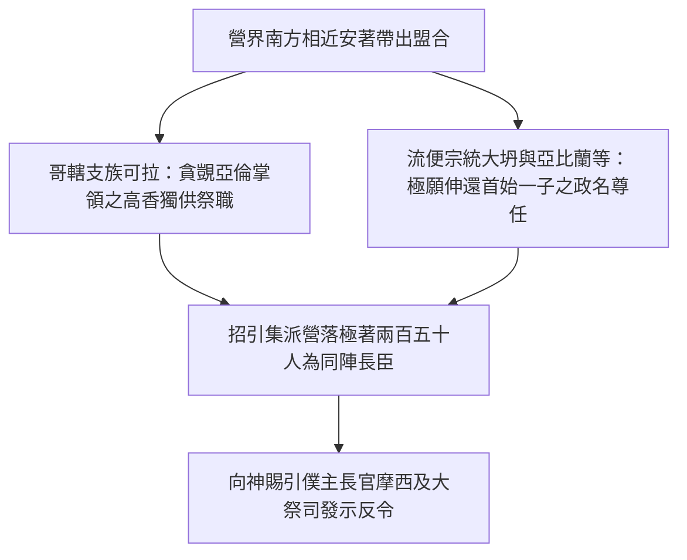
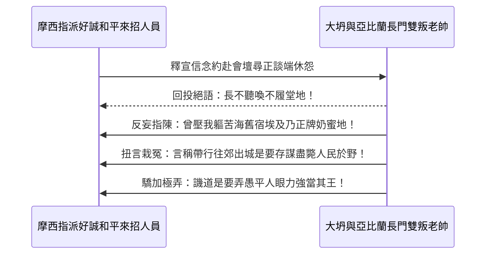
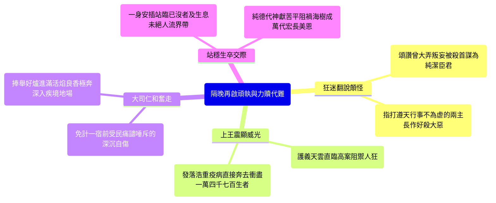

# 民數記 第16章

<!-- chapter-navigation:start -->
| [前一章](../04%20民數記/第15章.md) | [回目錄](../04%20民數記/全書目錄及綱要.md) | [下一章](../04%20民數記/第17章.md) |
| :--- | :---: | ---: |
<!-- chapter-navigation:end -->

1. 利未的曾孫、哥轄的孫子、以斯哈的兒子可拉，和流便子孫中以利押的兒子[[可拉大坍亞比蘭等領首聯合的大反亂|大坍、亞比蘭]]，與比勒的兒子安，
2. 並[[可拉大坍亞比蘭等領首聯合的大反亂|以色列會中的二百五十個首領]]，就是有名望選入會中的人，在摩西面前一同起來，
3. 聚集攻擊摩西、亞倫，說：你們擅自專權！全會眾個個既是聖潔，耶和華也在他們中間，[[全會眾的聖潔宣示與對代表主職之挑釁|你們為什麼自高]]，超過耶和華的會眾呢？
4. 摩西聽見這話就俯伏在地，
5. 對可拉和他一黨的人說：到了早晨，耶和華必指示誰是屬他的，誰是聖潔的，就叫誰親近他；他所揀選的是誰，必叫誰親近他。
6. 可拉啊，你們要這樣行，你和你的一黨要拿香爐來。
7. 明日，在耶和華面前，把火盛在爐中，把香放在其上。耶和華揀選誰，誰就為聖潔。你們這利未的子孫擅自專權了！
8. 摩西又對可拉說：利未的子孫哪，你們聽我說！
9. [[利未職分的尊嚴與越權追求祭司職分|以色列的神從以色列會中將你們分別出來]]，使你們親近他，辦耶和華帳幕的事，並站在會眾面前替他們當差。
10. 耶和華又使你和你一切弟兄─利未的子孫─一同親近他，這豈為小事？[[利未職分的尊嚴與越權追求祭司職分|你們還要求祭司的職任嗎]]？
11. 你和你一黨的人聚集是要攻擊耶和華。亞倫算什麼，你們竟向他發怨言呢？
12. 摩西打發人去召以利押的兒子[[可拉大坍亞比蘭等領首聯合的大反亂|大坍、亞比蘭]]。他們說：[[大坍和亞比蘭強硬反抗與藐視帶進蜜地的應許|我們不上去]]！
13. 你將我們從流奶與蜜之地領上來，要在曠野殺我們，這豈為小事？你還要自立為王轄管我們嗎？
14. 並且你沒有將我們領到流奶與蜜之地，也沒有把田地和葡萄園給我們為業。難道你要剜這些人的眼睛嗎？[[大坍和亞比蘭強硬反抗與藐視帶進蜜地的應許|我們不上去]]！
15. 摩西就甚發怒，對耶和華說：求你不要享受他們的供物。我並沒有奪過他們一匹驢，也沒有害過他們一個人。
16. 摩西對可拉說：明天，你和你一黨的人，並亞倫，都要站在耶和華面前；
17. 各人要拿一個香爐，共二百五十個，把香放在上面，到耶和華面前。你和亞倫也各拿自己的香爐。
18. 於是他們各人拿一個香爐，盛上火，加上香，同摩西、亞倫站在會幕門前。
19. 可拉招聚全會眾到會幕門前，要攻擊摩西、亞倫；耶和華的榮光就向全會眾顯現。
20. 耶和華曉諭摩西、亞倫說：
21. 你們離開這會眾，我好在轉眼之間把他們滅絕。
22. 摩西、亞倫就俯伏在地，說：神，萬人之靈的神啊，一人犯罪，你就要向全會眾發怒嗎？
23. 耶和華曉諭摩西說：
24. 你吩咐會眾說：你們離開可拉、[[可拉大坍亞比蘭等領首聯合的大反亂|大坍、亞比蘭]]帳棚的四圍。
25. 摩西起來，往[[可拉大坍亞比蘭等領首聯合的大反亂|大坍、亞比蘭]]那裡去；以色列的長老也隨著他去。
26. 他吩咐會眾說：你們離開這惡人的帳棚吧，他們的物件，什麼都不可摸，恐怕你們陷在他們的罪中，與他們一同消滅。
27. 於是眾人離開可拉、[[可拉大坍亞比蘭等領首聯合的大反亂|大坍、亞比蘭]]帳棚的四圍。大坍、亞比蘭帶著妻子、兒女、小孩子，都出來，站在自己的帳棚門口。
28. 摩西說：我行的這一切事本不是憑我自己心意行的，乃是耶和華打發我行的，必有證據使你們知道。
29. 這些人死若與世人無異，或是他們所遭的與世人相同，就不是耶和華打發我來的。
30. 倘若耶和華創作一件新事，使地開口，把他們和一切屬他們的都吞下去，叫他們[[地破裂吞吃可拉與大坍亞比蘭之家與其財物|活活地墜落陰間]]，你們就明白這些人是藐視耶和華了。
31. 摩西剛說完了這一切話，他們腳下的地就開了口，
32. 把他們和他們的家眷，並一切屬可拉的人丁、財物，都吞下去。
33. 這樣，他們和一切屬他們的，都[[地破裂吞吃可拉與大坍亞比蘭之家與其財物|活活地墜落陰間]]；地口在他們上頭照舊合閉，他們就從會中滅亡。
34. 在他們四圍的以色列眾人聽他們呼號，就都逃跑，說：恐怕地也把我們吞下去。
35. 又[[耶和華的烈火將兩百五十個拿香爐者徹底毀滅|有火從耶和華那裡出來]]，[[耶和華的烈火將兩百五十個拿香爐者徹底毀滅|燒滅了那獻香的二百五十個人]]。
36. 耶和華曉諭摩西說：
37. 你吩咐祭司亞倫的兒子以利亞撒從火中撿起那些香爐來，把火撒在別處，因為那些香爐是聖的。
38. 把那些犯罪、自害己命之人的香爐，叫人錘成片子，用以包壇。那些香爐本是他們在耶和華面前獻過的，所以是聖的，並且可以[[香爐被鍛釘為包裝壇上的銅片與長遠鑑誡|給以色列人作記號]]。
39. 於是祭司以利亞撒將被燒之人所獻的銅香爐拿來，人就錘出來，用以包壇，
40. 給以色列人作紀念，使亞倫後裔之外的人不得近前來在耶和華面前燒香，免得他遭可拉和他一黨所遭的。這乃是照耶和華藉著摩西所吩咐的。
41. [[次日會眾猛發埋怨招致耶和華天譴大瘟疫|第二天，以色列全會眾都向摩西、亞倫發怨言]]說：[[次日會眾猛發埋怨招致耶和華天譴大瘟疫|你們殺了耶和華的百姓了]]。
42. 會眾聚集攻擊摩西、亞倫的時候，向會幕觀看，不料，有雲彩遮蓋了，耶和華的榮光顯現。
43. 摩西、亞倫就來到會幕前。
44. 耶和華吩咐摩西說：
45. 你們離開這會眾，我好在轉眼之間把他們滅絕。他們二人就俯伏於地。
46. 摩西對亞倫說：[[亞倫拿著香爐站在死人與活人中間祈禱救恩代濟|拿你的香爐]]，把壇上的火盛在其中，又加上香，快快帶到會眾那裡，[[亞倫拿著香爐站在死人與活人中間祈禱救恩代濟|為他們贖罪]]；因為有忿怒從耶和華那裡出來，瘟疫已經發作了。
47. 亞倫照著摩西所說的拿來，跑到會中，不料，瘟疫在百姓中已經發作了。他就加上香，為百姓贖罪。
48. 他站在活人死人中間，[[亞倫拿著香爐站在死人與活人中間祈禱救恩代濟|瘟疫就止住了]]。
49. 除了因可拉事情死的以外，遭瘟疫死的，共有一萬四千七百人。
50. 亞倫回到會幕門口，到摩西那裡，瘟疫已經止住了。

---

## 本章知識節點

### 事件
- [[可拉大坍亞比蘭等領首聯合的大反亂]]
- [[大坍和亞比蘭強硬反抗與藐視帶進蜜地的應許]]
- [[地破裂吞吃可拉與大坍亞比蘭之家與其財物]]
- [[耶和華的烈火將兩百五十個拿香爐者徹底毀滅]]
- [[次日會眾猛發埋怨招致耶和華天譴大瘟疫]]

### 神學
- [[全會眾的聖潔宣示與對代表主職之挑釁]]
- [[利未職分的尊嚴與越權追求祭司職分]]
- [[摩西在耶和華面前自辯清白與拒受甘禮]]
- [[亞倫拿著香爐站在死人與活人中間祈禱救恩代濟]]

### 文化
- [[香爐被鍛釘為包裝壇上的銅片與長遠鑑誡]]

---

## 本章整理

### 可拉黨與流便宗族的政治宗教叛變背景（v1-11）

民數記第16章詳細記載了一場內部權力對立與制度挑戰的歷史事件：涉及宗教祭司權柄與宗族政治統治階層之雙重衝突 —— [[可拉大坍亞比蘭等領首聯合的大反亂|「哥轄宗族可拉與流便領袖聯手建立兩百五十位名宿大抗道紀錄」]]（v1-3）。經文溯源直陳，發起對抗的代表可拉屬於利未曾孫、哥轄孫子、以斯哈之子。這重宗族的血緣脈絡闡明了矛盾的源起：可拉身居哥轄族中，長期承擔運送上帝寶殿內供器與聖靈方櫃重職，但在層級體制裡終歸屬於侍候角色，未能擁握主大正壇行熱香祀大願祭的大司正席（由亞倫及長脈專屬）。在此心理縫隙內，《基督徒文摘解經系列》（CT）引介專家黃迦勒洞見闡明：「以斯哈為哥轄家族裡的第二長房；遇及將哥轄第四房烏薛子系人臣委任昇為主帶其整支派的大領正宗時，其失落與競存忿念極深。」

同時，地理布陣結構驅助了兩派聲氣呼應。按營棚安排，流便族流落紮棲南方會所與哥轄子徒面正交連（民二10；三29）。流便後人們長期帶著先世由於操道不守以致丟落長子主政至上大分的家族舊結（創四十九3-4），在利權爭長的心致驅助下彼此聲援。《拾穗》（GT）剖析明斷：「可拉貪望攬居成正宗上尊行司職，大坍及亞比蘭爭探歸向雅各元始一世統任身牌，遂匯盟聯合會眾兩百五十個顯赫且負有名位之前驅主老，向權道主中保直接揭發抗言戰場。」

```mermaid
flowchart TD
    A["營界南方相近安著帶出盟合"] --> B["哥轄支族可拉：貪覬亞倫掌領之高香獨供祭職"]
    A --> C["流便宗統大坍與亞比蘭等：極願伸還首始一子之政名尊任"]
    B --> D["招引集派營落極著兩百五十人為同陣長臣"]
    C --> D
    D --> E["向神賜引僕主長官摩西及大祭司發示反令"]
```

這一眾挑戰者齊集後，提具一組打正靈本大節且似義高光、深層卻解毀恩選定意之質疑論詞 —— [[全會眾的聖潔宣示與對代表主職之挑釁|「主稱萬眾受榮潔而質斥受任管首乃自攬尊昂」]]（v3）。叛首直對摩西言抗：「你們擅自專權！全會眾個個既是聖潔，耶和華也在他們中間，你們為什麼自高，超過耶和華的會眾呢？」彼方所借鑑引用之句，即是神於西乃立約大典授信與以色列大族的誓諾詞段（出十九6）。依 BibleHub 解經彙論評說：「自認擁有全民共有光華便否奪聖靈區分職使之主能，是抗經路上見屢的誤逆；以不拘層次的自由名分去否決使長和祭政，在神學本源是以偽道言辭意欲破除全智上帝的特殊委遣架構！」CT 與 GT 更警正申論：「責人濫逞，常正是自身貪驕野心的深遠顯像；妄加拒慢公義引信、挑戰君差中保皆歸在不信反逆底坑境地。」

> [!quote] 經典默想引句
> - **虛假名義下的企求**：「以全員得靈做護牌來挑戰正任宰位，並非期望共享平靜公順的平等生命，往往藏置意欲超越神意並取而代之的血肉貪婪。」(KC 註解釋道)
> - **對揀選的反斥**：「用至聖盟約之語反攻所差使正神長官，是誤用特許福祉打倒屬靈秩序的典型危險試圖。」(CT 與 GT 前後研錄)

遭受此極為不純之衝撞與質問時，持懷虛敬無競心的摩西首先「俯伏在地」（v4），不謀仰倚群軍鬥勢反圍；繼以向可拉眾子指明，次晨必定將對與非之公判呈交在主案與恩座審查間：「到了早晨，耶和華必指示誰是屬祂的，誰是聖潔的，就叫誰親近祂；祂所揀選的是誰，必叫誰親近祂。可拉啊，你們要這樣行，你和你的一黨要拿香爐來...你們這利未的子孫擅自專權了！」（v5-7）。在此關頭，摩西吐示情深語深以喚轉宗族手嗣，闡提了一組明徹正學之經道至論 —— [[利未職分的尊嚴與越權追求祭司職分|「擔承移養神居殿舍早為浩顯極光、毋生心驕圖越獨供之祭」]]（v8-11）。主言宣說：「以色列的神從以色列會中將你們分別出來，使你們親近祂，辦耶和華帳幕的事...這豈為小事？你們還要求祭司的職任嗎？你和你一黨的人聚集是要攻擊耶和華。」

| 職務奉信派司分級 | 神定使命之核心本務與尊恩意蘊 | 不純盲從衍生的偏失態度 |
| :--- | :--- | :--- |
| **利未隨奉搬載聖務** | 得承神指於無量俗胞中出世隨候方台護奉，是毫無能及、值得竭榮惜福的奇大聖恩。 | 任身隨妄視聖使平居為常、輕看既得大信，生出不滿競鬥之妄欲爭功。 |
| **亞倫長使正職焚香** | 取源於天權至一神手、不可容以世想智計僭往，屬耶和華全然護信的聖香獻理神宣。 | 縱恣私欲硬挑自立，強欲冒行至內祭壇，實同舉心攻伐原宰大主君上帝！ |

KingComments 研讀札書在此點深：「領取神手交付之極敬侍幕榮任不去修謝於德，轉欲覬望別家之專職，就是以驕逆推倒信仰分工！摩西清楚拆揭背叛核心：非爭人權，而是聚集敵對天上王意神政。」

### 大坍亞比蘭的堅決拒絕與摩西在神前的極為正直自證（v12-15）

當摩西出於體恤宗長、意圖透過平和會同探尋解答，降差前往招呼大坍與亞比蘭共議分決時，局勢落入深重偏廢無歸的固持抗戰場內 —— [[大坍和亞比蘭強硬反抗與藐視帶進蜜地的應許|「執抗不前出且翻誣苦為安順埃及乃純福地、誣打靈宰意設謀害」]]（v12-14）。大坍與亞比蘭發對詞意完全僵硬毫無反悔：「我們不上去！你將我們從流奶與蜜之地領上來，要在曠野殺我們，這豈為小事？你還要自立為王轄管我們嗎？並且你沒有將我們領到流奶與蜜之地...難道你要剜這些人的眼睛嗎？我們不上去！」

```mermaid
sequenceDiagram
    participant M as 摩西指派好誠和平來招人員
    participant D as 大坍與亞比蘭長門雙叛老帥
    M->>D: 釋宣信念約赴會壇尋正談端休怨
    D-->>M: 回投絕語：長不聽喚不履堂地！
    D->>M: 反妄指陳：曾壓我軀苦海舊宿埃及乃正牌奶蜜地！
    D->>M: 扭言栽冤：言稱帶行往郊出城是要存謀盡斃人民於野！
    D->>M: 驕加極弄：譏道是要弄愚平人眼力強當其王！
```

如此一改常情、扭倒天地歷史的痛批語音，突露深淵迷念最狂甚的反轉謬態。《拾穗》（GT）與《逐節註解》（CT）分剖批言：「這般言語極大敢言地翻妄是非：把先前呼厄悲鳴被驅壓的埃及勞作苦役場，反過手大捧稱為純甘至福奶蜜勝地！將勞思奔命施大引帶他們去厄除痛的神選真長者，汙指為懷計謀命於沙漠的大凶之人。」BibleHub 更補充剖明一句尖銳詞說：「『難道你要剜這些人的眼睛嗎？』，古世俗語即意引群盲瞎走死方而蓄瞞其道；這一席逆控暴露人心墜深不順時，永遠好仰將奇好救主恩護扭為誘殺禍行。」

承受此類妄言辱罵、遭逢深毒非義的無名之罪，處變自謙從來安虛向本的摩西興動良善的公誠赤憤，迎面啟陳極其清肅正直向天之懇告 —— [[摩西在耶和華面前自辯清白與拒受甘禮|「深懷信志申論絕未橫奪片隻匹驢、莫傷斯民、願主自卻自是無經偽禮」]]（v15）。「摩西就甚發怒，對耶和華說：求你不要享受他們的供物。我並沒有奪過他們一匹驢，也沒有害過他們一個人。」這一告白由內直抵天京御座前，印載一位良牧在中保路上經世長在之正清純德。

> [!important] 正直中保修德與公義裁判求告
> - **免於私械格鬥**：碰見非理攻誣和強拒赴誓，摩西未出派軍甲去行報剿反伐，單把事全托留真王面前尋依至安。
> - **修潔操為正聲**：「未取一隻疲驢，免損任意一人！」表證受挑神役絕不同乎世界常慣索取強科的掌柄者，擁有一肩擔民、不掠纖毫之無暇善節；唯立無過之心才能迎天賜發真義護扶。
> - **破排不誠偽呈**：見識驕妄徒將事神煙盆作奪席械裝，深信耶和華決不納喜斯等狂傲所熏香氣；正氣求祈拒享此祀。

### 雙向法裁宣示：地層中裂沉陷與聖殿清廷之烈火（v16-40）

次旦臨晨，摩西約喚可拉連同一心角試名榮之兩百五十長領皆自取銅鑄聖缽，安挑炙火置入白屑淨香前臨帳門；同一時候，可拉挑攬大數滿滿群眾並至朝圍圖興壓聚。天際當下了明明應合：「耶和華的榮光就向全會眾顯現！」（v19）。公裁勃落之即，上主甚且親令兩司使前出：「你們離開這會眾，我好在轉眼之間把他們滅絕！」（v21），好仗摩西連同其兄又復躬身「俯伏在地」申祈：「神，萬人之靈的神啊，一人犯罪，你就要向全會眾發怒嗎？」（v22），始阻止盡除百族之命局。摩西接持命宣，直臨南地宗陣喝出告全體信民的良言救令：「你們離開這惡人的帳棚吧，他們的物件，什麼都不可摸，恐怕你們陷在他們的罪中，與他們一同消滅！」（v26）。群民急散兩傍離棄死門，徒留大坍、亞比蘭暨妻室幼孩執持傲姿長駐門埕。

正是此刻，摩西對臨對全場揚揭千百年代所不有、無雙明確神斷信憑的話約，以此帶入震撼天下的判罪奇地刑大端 —— [[地破裂吞吃可拉與大坍亞比蘭之家與其財物|「天意施興創立偉事喚令厚地直破吞沒悖主一門歸止陰間」]]（v28-34）。摩西揚誓：「我行的這一切事本不是憑我自己心意行的，乃是耶和華打發我行的，必有證據使你們知道。這些人死若與世人無異...就不是耶和華打發我來的。倘若耶和華創作一件新事，使地開口，把他們和一切屬他們的都吞下去...你們就明白這些人是藐視耶和華了！」音歇風息頃時，泥土開闢直落幽淵，「他們腳下的地就開了口，把他們和他們的家眷，並一切屬可拉的人丁、財物，都吞下去...地口在他們上頭照舊合閉，他們就從會中滅亡」（v31-33）。

```mermaid
timeline
    title 神怒判斷大案的序向時間紀錄
    旦日啟壇 : 兩百五十豪士提舉爐火進陣 : 可拉呼促眾姓人面齊合朝逼前帳
    上帝顯榮 : 威光宏照呼喊即秒誅殺 : 雙正使俯躬陳痛相解阻停全面除滅
    發退令告 : 叫宣全區良平急散惡傲軍陣帳圈 : 劉宗領相夥童小妻女猶站帳垣自守
    裂開巨土 : 造天聖主展發未聞奇蹟新舉 : 可拉門黨與流便雙帥直隨財戶盡滅口中
    焚滅狂妄 : 一路白熱大潔聖香神焰燒襲 : 眾挑獻私祭長老隨瞬遭除清亡於世
```

KingComments 與 CT 皆特筆重提此事意理：「上帝以其能創之名作一莊純鮮無兩的『新事』——不止是不肯接顧其面，反而教乾野自綻坑道吞其所有！向各界警立真理：干犯受委神役就是抗伐耶和華主聖旨，永定逃不出審度絕裁！」隨時相和相輝的，正是生逢高台之上前門前的另一面純法厲裁 —— [[耶和華的烈火將兩百五十個拿香爐者徹底毀滅|「聖純祭焰化除競居無宣之私香者顯威」]]（v35）。

| 審判執行型態區別 | 對應領首階系及抗命性質 | 特徵與經典示教探析 |
| :--- | :--- | :--- |
| **荒土裂淵收隱坑** | 妄持民數與自恃肉血強拒朝旨、仰誣救引往生禍途的大坍亞比蘭及其部。 | 以生野斷揭宣告：任何存意污毀王使、高揭自己妄反呼告之道者定見除絕於大地上。 |
| **天降光火平貪願** | 超出恩定位，意希掠搶世間崇爵強持香具獻火祈榮的兩百五十長領。 | 表明非依主挑而縱自妄設以至衝祭居台的凡火舉意，不能近臨公潔主爐前，違者受直除裁！ |

此段肅厲事件收場後，造天大主更依遠揚慈育之心，引發了轉化逆傷殘片成就千年良見的大守記 —— [[香爐被鍛釘為包裝壇上的銅片與長遠鑑誡|「以背徒留下遺餘金器槌薄覆裝銅壇長世宣誓」]]（v36-40）。「耶和華曉諭摩西說：你吩咐祭司亞倫的兒子以利亞撒從火中撿起那些香爐來，把火撒在別處，因為那些香爐是聖的。把那些犯罪、自害己命之人的香爐，叫人錘成片子，用以包壇...給以色列人作記號」（v36-38）。CT 全件大書：「雖逆徒折命，其承拿直放臨近耶和華坐前的大片金工因為臨光而成非可賤毀的成榮禮聖。故呼叫大司主子弟親出廢場檢得歸案，以沉重鋼具打破扁開，裁築覆滿焚壇表面為精實鎧袍。」BibleHub 以敬拜心寫下感佩釋讀：「後世千載，人凡領羔獻拜面臨那包覆之明朗鋼壁，隨觀即可直懷此事訓 —— 永莫存心跨掠榮主特召祭封、切防身陷傲妄罪過！」

### 終曲再陷埋怨災疾與亞倫深入生死疆界的禱宥（v41-50）

如果推想隨閱過大地開張及猛熱怒火燒滅妄者之後，百姓定即久俯從不生怨，正是失查人性在偏狂迷夢處有如何厚重的強狂冥執！這一波毫未反悔之言端於旦日重現於途 —— [[次日會眾猛發埋怨招致耶和華天譴大瘟疫|「一朝重逢，愚怨人聲誣誣好軍使官私屠忠徒引得浩疫奔落裁人」]]（v41-45）。「第二天，以色列全會眾都向摩西、亞倫發怨言說：你們殺了耶和華的百姓了。會眾聚集攻擊摩西、亞倫的時候，向會幕觀看...耶和華的榮光顯現...我好在轉眼之間把他們滅絕！」

```mermaid
mindmap
    root("隔晚再啟頑執與力贖代難")
      狂迷翻說顛怪
        ("頌讚曾大弄叛妄被殺首謀為純潔臣君")
        ("指打遵天行事不為虐的兩主長作好殺大惡")
      上王震顯威光
        ("護義天雲直臨高案阻禦人狂")
        ("發落浩重疫病直接奔去衝盡一萬四千七百生者")
      大司仁和奮走
        ("免計一宿前受民痛譴唾斥的深沉自傷")
        ("捧舉好爐進滿活焰良香極奔深入疾境地場")
      站穩生卒交際
        ("一身安插站臨已沒者及生息未絕人流界帶")
        ("純德代神獻苦平阻禍海樹成萬代宏長美恩")
```

遭遇此次空前的強狠黑語，群黎一宿之下便將前夕惹動震天刑火、不聽召引的主謀「可拉及兩百香群」全反奉讚作「耶和華正良子民」！而深護族流苦身奔禱之主公反而受指叫作為嗜戮惡手。此背理荒狂言直令大氣染落無赦病疫狂潮：「瘟疫在百姓中已經發作了...遭瘟疫死的，共有一萬四千七百人」（v47,49）。《拾穗》（GT）嚴肅告警說：「此番災跡刻立千秋明鑑：眾民若欲盲賴巨量群音扭冒善非、施壓天命公定法則，只會觸生迅猛不輟的天威裁判告警。」

當長病橫肆、無量生眾瀕墮危淵之际，一段流芳長存、表彰高純中保仁情救護的心懷畫跡光映而出 —— [[亞倫拿著香爐站在死人與活人中間祈禱救恩代濟|「長司不念凌辱捧裝聖安香直駐倒滅死海連生之陣中止絕禍殃」]]（v46-48）。摩西看透災危浩發，即刻向行年已高、方為千萬聲喝欲革職的兄長亞倫道：「拿你的香爐，把壇上的火盛在其中，又加上香，快快帶到會眾那裡，為他們贖罪！」（v46）。亞倫當刻遺失自我受辱創痕，捧取盆具盈載活薪拋落馨香飛向急海大苦厄陣極核心中！「亞倫...跑到會中...就加上香，為百姓贖罪。他站在活人死人中間，瘟疫就止住了！」

> [!important] 中保典型：亞倫捨身事福與基督救恩預表
> - **以仁報恨**：經前夕直朝己名群罵、逼落榮任的眾民，年長的祭儀大首於其臨危時忘記舊辱，手持活壇炭火衝赴群殃地境！
> - **靈香活止**：盆中並非塵薪私草，乃是來自天喜高潔柴案上永動不熄之聖潔真活苗，方有浩勝大能消息怒火災潮。
> - **死生之際中保駐立**：「他站在活人死人中間！」這成為全經新約預表的偉大史典 —— 如同拯救大地世界的真宰耶穌基督，捨卻崇京無玷榮姿，甘心擔荷世狂辱誚，高聳進臨於自縱陷喪的罪身墳死底與真光活門間，發盡捨念成就永安消止一切定刑，彰為榮恩護恤萬代的真正高天中保！

### 全章靈程整合與救贖啟示綜覽（v1-50）

當我們貫縱思辨民數記第16章這一部歷練荒野人心、深含巨罪衝撞與真神判正修救的沉實篇章時，即可辨識全五經神權統率與拯救架構如何在苦逆磨試裡益加凸朗光明。遭遇內部憑著片面經意去解構事職與自攬貪譽的造禍試場，上帝以明證無二的天降正焰與大地裂淵明確捍衛其賜命揀選與崇祭定儀；甚至不忍遺下白殘廢金，也特呼槌延成牆蓋作永遠不忘顧道安守的戒心良標。至落日暮旦早民怨又翻、挑釁無赦直陷疫端大禍一剎那，神恩中保亞倫秉發出毫不知恨、直提聖活烈火狂往荒危中央中絕生殃大苦行徑。全章非特紀錄了一通歷史管訓之軌，更於至終深致宣證出天心憐恤救主捨身立命於死世大界間護守垂存蒼生脫禍的，至高拯救福音美義與神學豐功。

**參考資料**
https://www.ccbiblestudy.org/Old%20Testament/04Num/04CT16.htm
https://www.ccbiblestudy.org/Old%20Testament/04Num/04GT16.htm
https://www.kingcomments.com/en/bible-studies/Num/16
https://biblehub.com/study/numbers/16.htm

<!-- appendix-links:start -->
## 附錄

### 相關地圖
- [[appendix/fhl_maps/maps/021|〈民圖二〉探查應許地和應許地的範圍]]
<!-- appendix-links:end -->

<!-- chapter-navigation:start -->
| [前一章](../04%20民數記/第15章.md) | [回目錄](../04%20民數記/全書目錄及綱要.md) | [下一章](../04%20民數記/第17章.md) |
| :--- | :---: | ---: |
<!-- chapter-navigation:end -->
