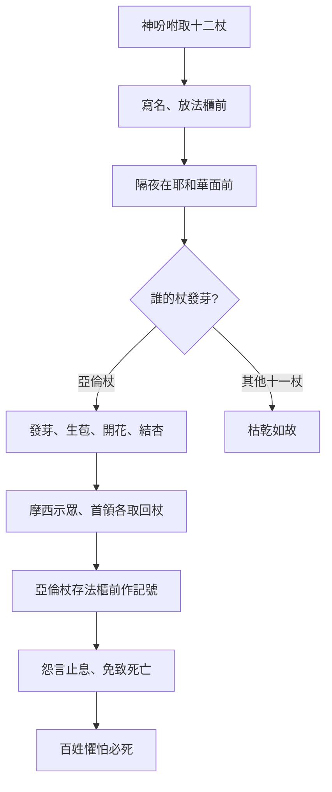

# 民數記 第17章

1. 耶和華對[[摩西]]說：
2. 你曉諭以色列人，從他們手下取杖，每支派一根；從他們所有的首領，按著支派，共取十二根。你要將各人的名字寫在各人的杖上，
3. 並要將[[亞倫]]的名字寫在利未的杖上，因為[[以色列眾首領|各族長]]必有一根杖。
4. 你要把這些杖存在會幕內法櫃前，就是我與你們相會之處。
5. 後來我所揀選的那人，他的杖必[[發芽（parach）|發芽]]。這樣，我必使以色列人向你們所發的怨言止息，不再達到我耳中。
6. 於是[[摩西|摩西曉諭以色列人]]，他們的首領就把杖交給他，按著支派，每首領一根，共有十二根；[[亞倫]]的杖也在其中。
7. [[摩西]]就把杖存在法櫃的帳幕內，在耶和華面前。
8. 第二天，[[摩西]]進法櫃的帳幕去。誰知利未族[[亞倫]]的杖已經發了芽，生了花苞，開了花，結了[[杏（shaqed）|熟杏]]。
9. [[摩西]]就把所有的杖從耶和華面前拿出來，給以色列眾人看；他們看見了，各首領就把自己的杖拿去。
10. 耶和華吩咐[[摩西]]說：把[[亞倫]]的杖還放在法櫃前，給這些背叛之子[[亞倫杖存放法櫃前作記號|留作記號]]。這樣，你就使他們向我發的怨言止息，免得他們死亡。
11. [[摩西]]就這樣行。耶和華怎樣吩咐他，他就怎樣行了。
12. 以色列人對[[摩西]]說：[[以色列人懼怕必死|我們死啦]]！我們滅亡啦！都滅亡啦！
13. 凡挨近耶和華帳幕的是必死的。我們都要死亡嗎？

<!-- fhl-map-links:start -->
## 相關地圖

- [[appendix/fhl_maps/maps/021|〈民圖二〉探查應許地和應許地的範圍]]
<!-- fhl-map-links:end -->

---

## 本章知識節點

### 神學
- [[神主權揀選祭司職分]]
- [[祭司職分嚴肅性]]
- [[怨言止息靠神蹟非人勸]]
- [[神揀選止息怨言預表基督平息叛逆（來 12：24；羅 5：10）]]

### 原文
- [[發芽（parach）]]
- [[杏（shaqed）]]

### 人物
- [[摩西]]
- [[亞倫]]
- [[以色列眾首領]]

### 事件
- [[耶和華吩咐取十二支派杖放法櫃前]]
- [[十二根杖是否包含利未支派]]
- [[亞倫杖發芽生苞開花結杏]]
- [[亞倫杖存放法櫃前作記號]]
- [[以色列人懼怕必死]]

### 象徵預表
- [[死杖發芽表徵復活生命]]
- [[亞倫杖發芽預表基督復活大祭司（來 4：14-16；9：11-12）]]
- [[法櫃前杖作記號預表基督在神面前為證（來 9：24；約一 2：1）]]
- [[亞倫杖發芽是否為自然現象]]

---

## 本章整理

### 神命取杖試驗（v1-7）
耶和華吩咐 [[摩西]] 從以色列十二支派各取一根杖，每支派首領一根，共十二根；利未支派的杖上寫 [[亞倫]] 的名字（v1-3）。這 [[耶和華吩咐取十二支派杖放法櫃前|神命試驗]] 旨在公開、不可辯駁地確認祭司職分歸屬，[[神主權揀選祭司職分|主權在神]]，而非人謀人算。杖要放在會幕內法櫃前——神與人相會之處（v4），[[怨言止息靠神蹟非人勸|怨言止息靠神蹟非人勸]]。[[以色列眾首領|十二首領]] 照命交杖，[[亞倫]] 的杖在其中（v6-7）。

### 亞倫杖發芽為證（v8-9）
次日 [[摩西]] 進帳幕，見利未支派亞倫的杖已經 [[發芽（parach）|發芽]]、[[亞倫杖發芽生苞開花結杏|生苞]]、[[亞倫杖發芽生苞開花結杏|開花]]、[[亞倫杖發芽生苞開花結杏|結熟杏]]（v8）。[[杏（shaqed）|杏]]（shaqed）在希伯來文含「警醒、速成」雙關，暗示神審判迅速、應驗確實。[[亞倫杖發芽生苞開花結杏|一根枯杖同時呈現芽、花、果三階段]]，超越自然生長節奏，[[亞倫杖發芽是否為自然現象|絕非自然現象]]，乃 [[死杖發芽表徵復活生命|死杖發芽表徵復活生命]] 的神蹟。摩西取出眾杖給百姓看，各首領認回自己的杖（v9），對比鮮明：唯有亞倫的杖有生命。

### 杖存法櫃前作記號（v10-11）
耶和華命摩西將亞倫的杖「還放在法櫃前，給這些背叛之子留作記號」（v10）。[[亞倫杖存放法櫃前作記號|杖存法櫃前]]，長久見證神揀選，使怨言止息、免得百姓死亡。這預表 [[法櫃前杖作記號預表基督在神面前為證（來 9：24；約一 2：1）|基督在天上聖所為信徒作中保、辯護者]]，也是 [[亞倫杖發芽預表基督復活大祭司（來 4：14-16；9：11-12）|復活大祭司職分永不更改]] 的預表。

### 百姓懼怕必死（v12-13）
以色列人見狀驚呼：「我們死啦！我們滅亡啦！都滅亡啦！凡挨近耶和華帳幕的是必死的」（v12-13）。[[以色列人懼怕必死|恐懼源於認識神聖潔與祭司職分嚴肅性]]，卻未轉為信靠順服，反顯露內心仍抗拒神秩序。

### 跨章預表：死杖發芽指向基督大祭司
| 本章意象 | 新約應驗 | 經文 |
|---|---|---|
| 枯杖發芽、結杏 | 基督死而復活，成永遠大祭司 | 來 4:14-16；9:11-12 |
| 杖存法櫃前作記號 | 基督升天，在父面前為我們顯現 | 來 9:24；約一 2:1 |
| 神揀選止息叛逆怨言 | 基督寶血說話，勝過亞伯的血，使我們與神和好 | 來 12:24；羅 5:10 |

> [!important] 本章樞紐
> **死杖發芽** 是全章神學中心：唯有神能使死而復活，唯有復活的生命證明真祭司職分。這不僅平息可拉黨餘波，更預表基督「憑無盡生命的大能」成就永遠祭司職分（來 7:16）。

> [!note] 釐清
> 「十二根杖是否包含利未支派」：經文明說「從他們所有的首領，按著支派，共取十二根……將亞倫的名字寫在利未的杖上」（v2-3），利未支派在十二支派中佔一根，亞倫代表利未；約瑟兩支派（以法蓮、瑪拿西）各算一支派，維持十二數。

**參考資料**
https://www.ccbiblestudy.org/Old%20Testament/04Num/04CT17.htm
https://www.ccbiblestudy.org/Old%20Testament/04Num/04GT17.htm
https://www.kingcomments.com/en/bible-studies/Num/17
https://biblehub.com/study/numbers/17.htm
