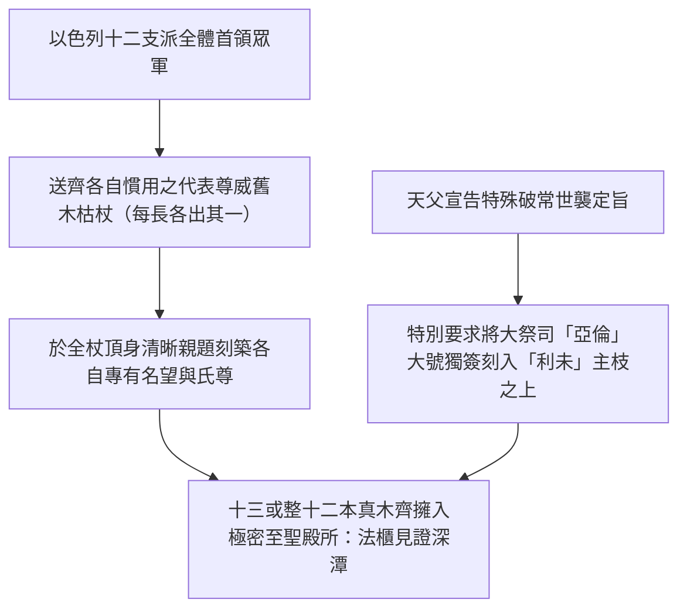
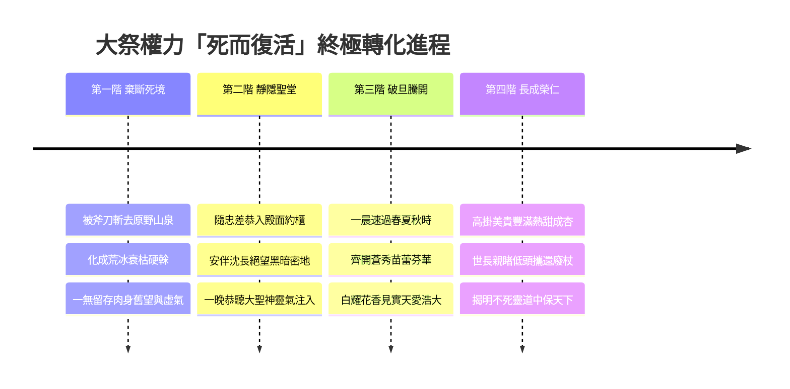
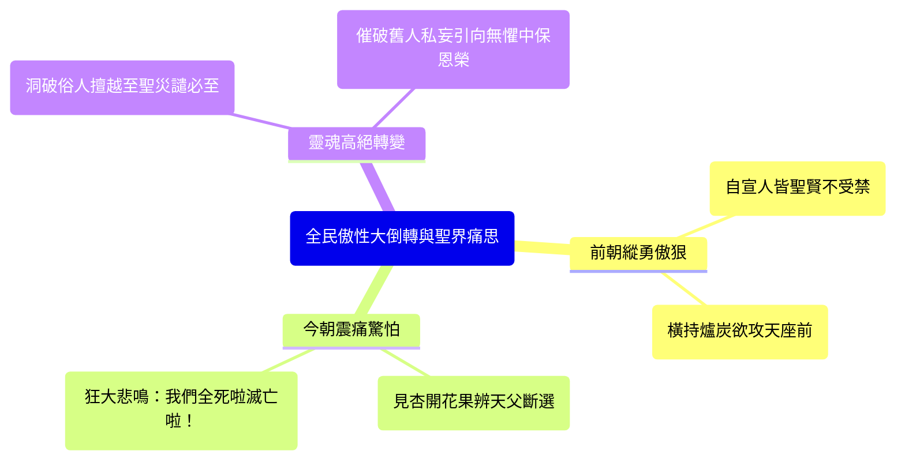

# 民數記 第17章

1. 耶和華對摩西說：
2. 你曉諭以色列人，[[十二支派首領之杖按著名冊交付驗證|從他們手下取杖]]，每支派一根；從他們所有的首領，按著支派，[[十二支派首領之杖按著名冊交付驗證|共取十二根]]。你要[[十二支派首領之杖按著名冊交付驗證|將各人的名字寫在各人的杖上]]，
3. 並要[[把亞倫之名簽寫在利未之杖上的授命標記|將亞倫的名字寫在利未的杖上]]，因為[[把亞倫之名簽寫在利未之杖上的授命標記|各族長必有一根杖]]。
4. 你要把這些杖[[存於見證會殿前等候神使出枯長生苞結杏的奇顯|存在會幕內法櫃前]]，就是我與你們相會之處。
5. 後來[[存於見證會殿前等候神使出枯長生苞結杏的奇顯|我所揀選的那人，他的杖必發芽]]。這樣，我必使以色列人向你們所發的怨言止息，不再達到我耳中。
6. 於是摩西曉諭以色列人，他們的首領就把杖交給他，按著支派，每首領一根，共有十二根；亞倫的杖也在其中。
7. 摩西就把杖存在法櫃的帳幕內，在耶和華面前。
8. 第二天，摩西進法櫃的帳幕去。誰知利未族[[存於見證會殿前等候神使出枯長生苞結杏的奇顯|亞倫的杖已經發了芽]]，[[亞倫發芽熟杏之杖表徵經歷死地步入復活生命力|生了花苞，開了花，結了熟杏]]。
9. 摩西就把所有的杖[[亞倫發芽熟杏之杖表徵經歷死地步入復活生命力|從耶和華面前拿出來]]，給以色列眾人看；他們看見了，各首領就把自己的杖拿去。
10. 耶和華吩咐摩西說：[[亞倫之杖存於法櫃前留給悖逆之子作垂範鑑戒|把亞倫的杖還放在法櫃前]]，[[亞倫之杖存於法櫃前留給悖逆之子作垂範鑑戒|給這些背叛之子留作記號]]。這樣，你就使他們[[亞倫之杖存於法櫃前留給悖逆之子作垂範鑑戒|向我發的怨言止息]]，免得他們死亡。
11. 摩西就這樣行。耶和華怎樣吩咐他，他就怎樣行了。
12. 以色列人對摩西說：[[凡擅進靠近耶和華會棚與祭事場者必定蒙誅死亡|我們死啦]]！[[凡擅進靠近耶和華會棚與祭事場者必定蒙誅死亡|我們滅亡啦]]！都滅亡啦！
13. [[凡擅進靠近耶和華會棚與祭事場者必定蒙誅死亡|凡挨近耶和華帳幕的是必死的]]。[[凡擅進靠近耶和華會棚與祭事場者必定蒙誅死亡|我們都要死亡嗎]]？

<!-- fhl-map-links:start -->
## 相關地圖

- [[appendix/fhl_maps/maps/021|〈民圖二〉探查應許地和應許地的範圍]]
<!-- fhl-map-links:end -->

---

## 本章知識節點

### 事件
- [[十二支派首領之杖按著名冊交付驗證]]
- [[存於見證會殿前等候神使出枯長生苞結杏的奇顯]]

### 神學
- [[把亞倫之名簽寫在利未之杖上的授命標記]]
- [[亞倫發芽熟杏之杖表徵經歷死地步入復活生命力]]
- [[凡擅進靠近耶和華會棚與祭事場者必定蒙誅死亡]]

### 文化
- [[亞倫之杖存於法櫃前留給悖逆之子作垂範鑑戒]]

---

## 本章整理

### 十二支派首領交杖與法櫃前的測試設定（v1-7）

民數記第十七章在希伯來舊約聖言與神聖神權事奉秩序中，扮演著自毀滅烈火跨往恩慈活命見證的重要分水嶺。在前段歷史（第十六章）經歷可拉黨人的傲慢造反、地陷吞敵、兩百五十尊銅香爐遭焚燒成災、以及次旦萬群民變致招巨災的長鏈殺伐之後，血肉世心雖然深懼天罰威嚴，卻未能徹底自靈裡面解脫對權位把持與貪婪高升的痴頑質疑。是以全能的主君在此再啟神諭，以和平恩慰與無限的創生偉力來召開第三次祭司合法地位的大公堂評選——這正是[[十二支派首領之杖按著名冊交付驗證|十二支派首領交割木杖的驗證大程]]（v1-2）。神指示摩西：「你曉諭以色列人，從他們手下取杖，每支派一根...共取十二根。你要將各人的名字寫在各人的杖上」（v2）。黃迦勒探明此手杖之沉重分量：「希伯來經典中所見此杖皆非平原打牧或拄病衰拐，乃是標示尊貴宗室主宰的慣隨身權杖，代表每派元宰掌治家土的高爵；把首腦身名親刻其上，代表眾長率一身前途親自俯下送返至造主裁決前」（CT）。

```mermaid
flowchart TD
    A["以色列十二支派全體首領眾軍"] --> B["送齊各自慣用之代表尊威舊木枯杖（每長各出其一）"]
    B --> C["於全杖頂身清晰親題刻築各自專有名望與氏尊"]
    D["天父宣告特殊破常世襲定旨"] --> E["特別要求將大祭司「亞倫」大號獨簽刻入「利未」主枝之上"]
    C & E --> F["十三或整十二本真木齊擁入極密至聖殿所：法櫃見證深潭"]
```

然而在這群各歸氏名的王杖中，上帝單獨頒下了一道大震倫宗規矩、直劈血緣庸次觀念的偉神令，這正是[[把亞倫之名簽寫在利未之杖上的授命標記|亞倫之名簽刻於利未代表長仗]]（v3）。「並要將亞倫的名字寫在利未的杖上，因為各族長必有一根杖。」丁良才及精讀本指出：「考詳本本世系，亞倫之祖哥轄其實不過是利未眾親中的次第長生（代上六1-3），根本難算為先世宗男首生，然耶和華特別指定此二字長登總代利未主榮牌面，意謂著那真命天國大祭統治根本決非由屬肉俗人的推崇抗吼所能偷拿，端仰賴至主高高宣恩任命！」（GT）。BibleHub 深掘此舉意深：「簽署亞倫字形於良枝上，不僅擊沉私鬥人語，更於此處為千年將臨的浩大君靈祭王耶穌預設尊美縮格：唯有獲主宣認的名號始能在見證匣口立穩！」（BH）。

繼往開來，摩西毫不憑己意或挑打是非，恭敬隨手接攏悉數棒榦，展開了那震懾未安眾心夜幕沉寂的和平守護——即[[存於見證會殿前等候神使出枯長生苞結杏的奇顯|眾杖收鎮於見證約匣尊殿等待真光破曉]]（v4-7）。「你要把這些杖存在會幕內法櫃前...摩西就把杖存在法櫃的帳幕內，在耶和華面前。」KingComments 高昂宣告此暗谷存容的大真義：「神既不要借持摩西仗把執行刑打與震災狂雷來平心，反而移置此寬恤垂顧、見證軟枯相扶的祭壇名器！世長妄貪吵鬧奪政，不知全天地唯有一所終審真聖法院：即幽靜黑垂而毫無囂叫的見證寶箱之前；千言不必說盡，留經神口於長晦終夜降入創生奇力！」（KC）。

| 按支派挑杖進退結構 | 物理現況與表面身份 | 主靈所含的權職透視 |
| :--- | :--- | :--- |
| **各派宗臣名錄殘杖** | 世俗尊風所刻印姓名，卻均屬被刀斷斬、與原林長壤久割的死竭老木。 | 一面顯白肉血傲才毫缺不死生長泉源，一面表彰平爭放棄世鬥，把禍祿任性付仰天王法理評辦。 |
| **亞倫利未大代表長** | 為天君特別明文點呼，將長祭高稱直鑄在代表哥轄及全族家室的名枝側畔。 | 超越塵世宗世血系之爭擾，宣立唯天父恩定召取之祭位，能扛起溝通神人和合無限生氣責任。 |

> [!note] 經典靈思啟讀
> - 「可拉暴軍爭喊『誰皆聖潔』而想借肉手操抓聖物；上帝在此以存靜交枝示曉：無人能在殿堂狂言稱神，直到祂經歷全黑寂滅之後長生花芽。」(CT)
> - 「手木上簽著本家真姓，等於人人將全生命面呈殿庭；唯投身順依者獲解厄脫愁。」(BH)

### 枯木歷死而長茂與存立見證的和平垂範（v8-11）

隔早朝陽刺破夜陰，摩西孤肩一走踏歸沉肅黑寂的見證會堂內部，竟是滿目迎受令世界千世同震、輝鑠宇宙神光的空前奇展！這既不是長槍降殺、更無苦災雷打，而是在無邊死沉枯殘木屑之間激躍澎湃而來的絕高活天榮顯，也就是那偉大的神學史證——[[亞倫發芽熟杏之杖表徵經歷死地步入復活生命力|亞倫舊杖一朝三秀掛吐香仁杏果的神蹟]]（v8-9）。「第二天，摩西進法櫃的帳幕去。誰知利未族亞倫的杖已經發了芽，生了花苞，開了花，結了熟杏。摩西就把所有的杖從耶和華面前拿出來...他們看見了，各首領就把自己的杖拿去。」黃迦勒無限深重地帶領眾讀者沉浸這一場一宵越世的心性大重興：「乾仗乃曾飽享風斬伐棄、生機久散無毫分熱氣的殘廢槁薪；此刻放置暗聖夜地終，一夜曉放竟爆現出一齊發芽、伸苞、綻破春芳雪英甚至沉甸甸結實出蜜潤至甜白杏熱果！此實證明天王偉位全出自『死而復活』不休浩力：你絕不得恃天然口思與雄謀血才自任；唯把舊枯棄盡埋休神地，直到長晨復活偉耀發綻浩美！」（CT）。

```mermaid
timeline
    title 大祭權力「死而復活」終極轉化進程
    第一階 棄斷死境 : 被斧刀斬去原野山泉 : 化成荒冰衰枯硬榦 : 一無留存肉身舊望與虛氣
    第二階 靜隱聖堂 : 隨忠差恭入殿面約櫃 : 安伴沈長絕望黑暗密地 : 一晚恭聽大聖神靈氣注入
    第三階 破旦騰開 : 一晨速過春夏秋時 : 齊開蒼秀苗蕾芬華 : 白耀花香見實天愛浩大
    第四階 長成榮仁 : 高掛美貴豐滿熱甜成杏 : 世長親睹低頭攜還廢杖 : 揭明不死靈道中保天下
```

丁良才及舊約聖經背景更加探究這熟香甘物「杏枝」的美深聖典寄喻：「春天原野嚴霜冷閉，唯獨杏花敢闖第一先放清香喜開白榮；杏字在此間雙音回響於耶利米言裡『留心看護』偉訓（耶一11-12），見證我神常如看守杏林不睡倦地庇護其正統權民！基督之臨不即是這破土稱第一熟珍果之至高初實？引我們於百死世間活發平安大實！」（GT）。BibleHub 及 KingComments 亦聯篇合唱：「群長手捧故姓朽木空看垂落無華，始曉憑人巧語決無得長旺之份；主未使大火斬愚，反而奉這榮果枝棒把平安深栽千民心中！」（KC）。

為了使得這樣一件直透浩宇、見證生死易轉的浩愛功歌不致被驕矜無憶的人世轉臉棄忘，上帝更發施長遠睿智大圖，把它化沉作百代子民皆可同仰的心身永御，建立此[[亞倫之杖存於法櫃前留給悖逆之子作垂範鑑戒|把成果活杖永鎖至聖所作休兵與安靖鑑戒]]（v10-11）。「耶和華吩咐摩西說：把亞倫的杖還放在法櫃前，給這些背叛之子留作記號。這樣，你就使他們向我發的怨言止息，免得他們死亡...耶和華怎樣吩咐他，他就怎樣行了。」黃迦勒深陳藏匿這永不衰萎熟杏老棍的千聖真理：「這極聖奇器不再散赴平川爭奪世榮，乃伴住真誓兩片神石和那精白甘純、存載嗎哪美味的水金爐（來九4），成為萬姓前頭護衛長歌；此存安正是宣告至神恩判堅如磐石：把叫擾與猜妒從人嘴撕斷、永保群氓毋庸因狂碰聖怒觸神火受害至絕！」（CT）。

| 聖殿存證奇器 | 物象特性與靈魂表彰 | 所擔負的天堂防衛使功 |
| :--- | :--- | :--- |
| **金壇珍載白嗎哪** | 出自晴天黎早之聖潔清蜜珍糧，代表從無極界飄降的浩大生命餽哺。 | 在奔騰無垠曠沙孤程中，時宵提醒群黎莫懷怨言渴懼，永倚靠天上慈恩無限飽潤。 |
| **亞倫發花大熟木** | 為經歷暗夜、死裡重生活力長掛香仁杏甜的授職天證。 | 把僭奪權爵的橫論斬絕一空，護退狂惑逆言激火死報，成為永久和平相合鑑誡。 |

> [!important] 死活長耀之古今誡約
> - **止息空叫猜言**：天判不在群情聚罵，唯借果綠榮茂現道；凡明悉這花果大威者必斂口恭退、洗盡毒心言舌。
> - **死後生命唯大王**：莫把人思俗智擠探會幕，你非經歷與主暗谷同沉夜靜、發吐復活花香，不得越踏半寸天宮！

### 民眾的極端震撼與呼喚中保護庇的真誠覺醒（v12-13）

然而如此高卓長活恩慈的聖蹟，當映射落在全無視神心浩願的脆弱血民瞳眸中，居然再度激翻起浩蕩如巨濤墜滅般極向絕命號哭；原本傲不可遏、喊殺爭當主司的大呼喧呼，至此全數散解作駭懼心裂與生死絕泣，揭開了[[凡擅進靠近耶和華會棚與祭事場者必定蒙誅死亡|凡未蒙派進惹會殿必定遭受炎雷誅戮]]（v12-13）的深長呼籲。「以色列人對摩西說：我們死啦！我們滅亡啦！都滅亡啦！凡挨近耶和華帳幕的是必死的。我們都要死亡嗎？」黃迦勒深刻剖分這場人心極熱極冰的大震動：「首日人群聚打豪罵自認悉數為全聖不差（十六3），今朝日曉對看那枯棒長仁奇道以及未被允許者踏近的即火炎刑，狂情自取沉痛震折；『我們皆滅了』正是屬自然人不堪見證高聖嚴潔時必當激爆的無保戰慄：無有聖僕引道中間，妄走王家半步便是自奔火河浩劫！」（CT）。

```mermaid
mindmap
    root("全民傲性大倒轉與聖界痛思")
        前朝縱勇傲狠
            ("自宣人皆聖賢不受禁")
            ("橫持爐炭欲攻天座前")
        今朝震痛驚怕
            ("見杏開花果辨天父斷選")
            ("狂大悲鳴：我們全死啦滅亡啦！")
        靈魂高絕轉變
            ("洞破俗人擅越至聖災譴必至")
            ("催破舊人私妄引向無懼中保恩榮")
```

丁良才及精讀本深入稱誦這一大片垂涕中尚未臻至圓成的純良靈魂初光：「前夕恃憑狂氣挺擊高帝，如今閱盡無上聖輝始獲顫怖與戰懾（賽六5）；即便此浩哀顯露出未諳赦憫聖靈寬懷的盲昧懦怯，可也終於把世俗汙陋跟清高上帝間重重絕天深壑透徹敞彰！」（GT）。BibleHub 同起闡揚這由震痛通赴大喜的千禧福音橋段：「若缺天上親簡大先中保覆掩，人人直指榮帳下場實無他途；可此等震叫不意卻敲亮了千秋最要天愛—唯獨透過將至榮耶穌祭大將至誠鮮血恩幕，天下倦庶方無憂入殿歡享永耀大生！」（BH）。 KingComments 也為斯哀歌留下美麗休嘆：「盲黎迷怕、未能善悟復活杏杖原為慈愛護濟，反而誤將奇權當追命催符！但正經由這深刻畏悚與投降，神國之門正式轉引到新章偉業：把大祭中保不歇替祈的永恆愛網豐盛鋪展！」（KC）。

| 會眾意識轉折 | 此前可拉狂變時之驕喊態度 | 此夕看杏實後之震悚悲泣 | 對天國浩恩的中保啟悟 |
| :--- | :--- | :--- | :--- |
| **自我地位裁信** | 自負宣喊合眾盡是乾淨大民，妄自要求執權焚香。 | 自愧痛宣一身不堪受罪，自駭「我等盡當毀戮矣！」 | 放下殘狂誇高自能，謙卑尋討能扛贖愆浩德的指定使將。 |
| **看待會殿極門** | 視作人可隨衝奪爭的名榮法所，聚夥圍進圖掌香政。 | 不敢橫越寸泥，叫說「凡進撞其所必定遭殺無餘！」 | 知道神壇乃無偽至聖密境，須仰恃復活中保恩愛保攜直赴。 |

> [!warning] 經史重修鑑誡
> - **莫執驕心忘靈罰**：天下無不受檢試之私人誇權，硬憑私志衝闖天顏必換殘悔極痛；唯低仰恩定復活僕帥能享聖靈平安。
> - **擁攬恩果長中保**：勿忘神存大成熟花木既不是苦罰殺刀，乃是無罪神慰保顧無休，領導世民靠主進向長悅安歌！

**參考資料**
https://www.ccbiblestudy.org/Old%20Testament/04Num/04CT17.htm
https://www.ccbiblestudy.org/Old%20Testament/04Num/04GT17.htm
https://www.kingcomments.com/en/bible-studies/Num/17
https://biblehub.com/study/numbers/17.htm
