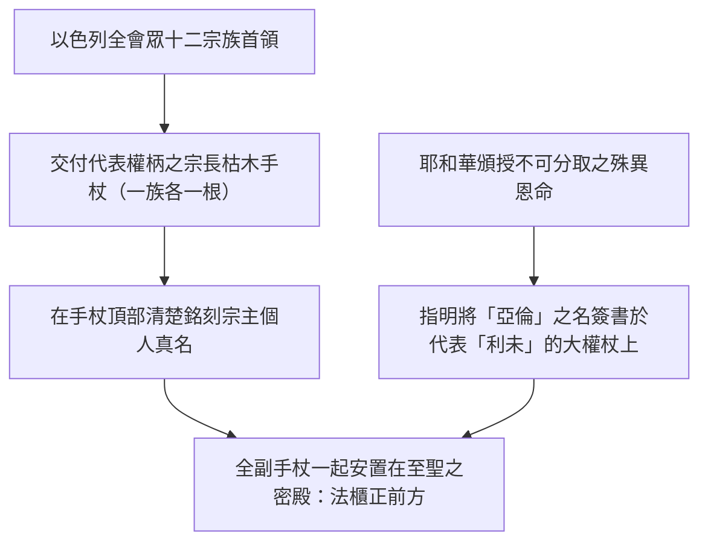
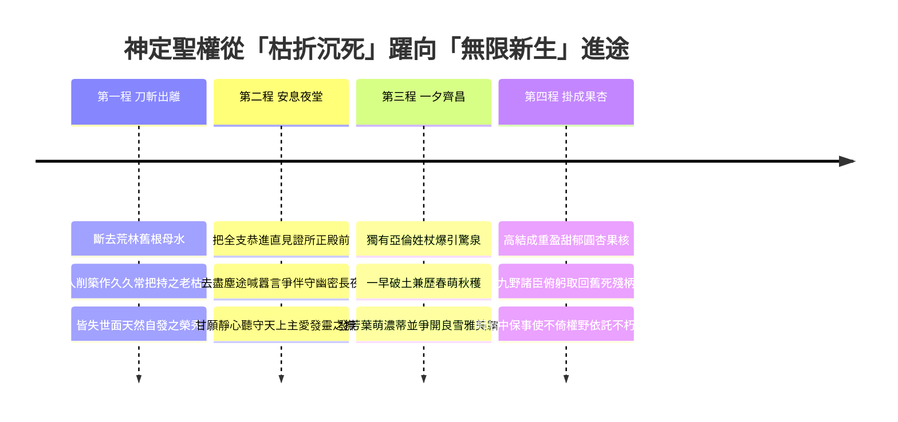
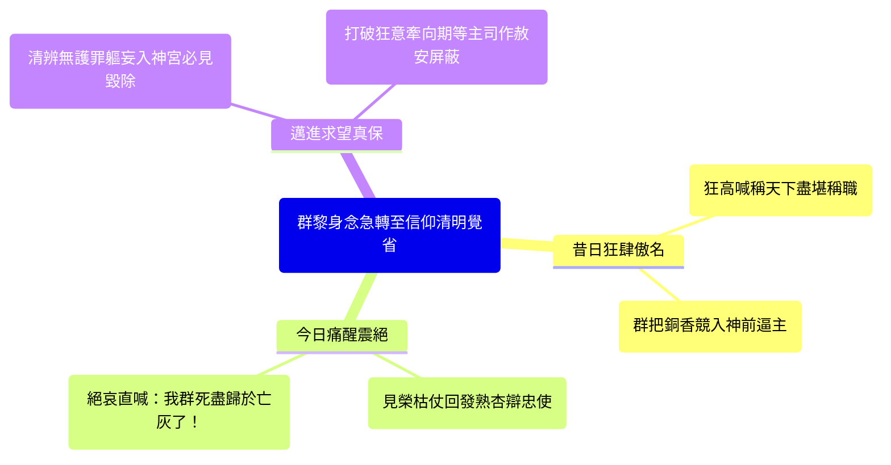

# 民數記 第17章

<!-- chapter-navigation:start -->
| [前一章](../04%20民數記/第16章.md) | [回目錄](../04%20民數記/全書目錄及綱要.md) | [下一章](../04%20民數記/第18章.md) |
| :--- | :---: | ---: |
<!-- chapter-navigation:end -->

1. 耶和華對摩西說：
2. 你曉諭以色列人，[[十二支派首領之杖按著名冊交付驗證|從他們手下取杖]]，每支派一根；從他們所有的首領，按著支派，[[十二支派首領之杖按著名冊交付驗證|共取十二根]]。你要[[十二支派首領之杖按著名冊交付驗證|將各人的名字寫在各人的杖上]]，
3. 並要[[把亞倫之名簽寫在利未之杖上的授命標記|將亞倫的名字寫在利未的杖上]]，因為[[把亞倫之名簽寫在利未之杖上的授命標記|各族長必有一根杖]]。
4. 你要把這些杖[[存於見證會殿前等候神使出枯長生苞結杏的奇顯|存在會幕內法櫃前]]，就是我與你們相會之處。
5. 後來[[存於見證會殿前等候神使出枯長生苞結杏的奇顯|我所揀選的那人，他的杖必發芽]]。這樣，我必使以色列人向你們所發的怨言止息，不再達到我耳中。
6. 於是摩西曉諭以色列人，他們的首領就把杖交給他，按著支派，每首領一根，共有十二根；亞倫的杖也在其中。
7. 摩西就把杖存在法櫃的帳幕內，在耶和華面前。
8. 第二天，摩西進法櫃的帳幕去。誰知利未族[[存於見證會殿前等候神使出枯長生苞結杏的奇顯|亞倫的杖已經發了芽]]，[[亞倫發芽熟杏之杖表徵經歷死地步入復活生命力|生了花苞，開了花，結了熟杏]]。
9. 摩西就把所有的杖[[亞倫發芽熟杏之杖表徵經歷死地步入復活生命力|從耶和華面前拿出來]]，給以色列眾人看；他們看見了，各首領就把自己的杖拿去。
10. 耶和華吩咐摩西說：[[亞倫之杖存於法櫃前留給悖逆之子作垂範鑑戒|把亞倫的杖還放在法櫃前]]，[[亞倫之杖存於法櫃前留給悖逆之子作垂範鑑戒|給這些背叛之子留作記號]]。這樣，你就使他們[[亞倫之杖存於法櫃前留給悖逆之子作垂範鑑戒|向我發的怨言止息]]，免得他們死亡。
11. 摩西就這樣行。耶和華怎樣吩咐他，他就怎樣行了。
12. 以色列人對摩西說：[[凡擅進靠近耶和華會棚與祭事場者必定蒙誅死亡|我們死啦]]！[[凡擅進靠近耶和華會棚與祭事場者必定蒙誅死亡|我們滅亡啦]]！都滅亡啦！
13. [[凡擅進靠近耶和華會棚與祭事場者必定蒙誅死亡|凡挨近耶和華帳幕的是必死的]]。[[凡擅進靠近耶和華會棚與祭事場者必定蒙誅死亡|我們都要死亡嗎]]？

---

## 本章知識節點

### 事件
- [[十二支派首領之杖按著名冊交付驗證]]
- [[存於見證會殿前等候神使出枯長生苞結杏的奇顯]]

### 神學
- [[把亞倫之名簽寫在利未之杖上的授命標記]]
- [[亞倫發芽熟杏之杖表徵經歷死地步入復活生命力]]
- [[凡擅進靠近耶和華會棚與祭事場者必定蒙誅死亡]]

### 文化
- [[亞倫之杖存於法櫃前留給悖逆之子作垂範鑑戒]]

---

## 本章整理

### 十二支派交割代表木杖與授職驗證設定（v1-7）

民數記第17章在神聖的申述與神權事奉秩序歷史中，展現了由天火災烈裁罰過渡至恩慈保溫與生命顯證之重大神學轉軌。經歷了前章可拉反亂與事後的瘟疫群怨，世人往往口懾神威而內自藏留疑怠；在此上帝改採非毀滅性的、創生性的大能來揭示第三次關於大祭司職位合法地位的公義釋放 —— 也就是設立 [[十二支派首領之杖按著名冊交付驗證|「按著名冊徵詢十二族宗伯木杖的驗證禮典」]]（v1-2）。耶和華曉諭摩西說：「你曉諭以色列人，從他們手下取杖，每支派一根...共取十二根。你要將各人的名字寫在各人的杖上」（v2）。依及考證《基督徒文摘解經系列》（CT）等釋述：「所謂的杖並非尋常農務短棍或行途拄杖，而是於近東社會長期表徵為一族首主長銜和統括家邦地位的宗師權杖；將自用真實氏名手刊於杖表，意味著諸眾領將自己的威儀及前程全部呈降並交存於耶和華施恩神工之下聽斷。」

```mermaid
flowchart TD
    A["以色列全會眾十二宗族首領"] --> B["交付代表權柄之宗長枯木手杖（一族各一根）"]
    B --> C["在手杖頂部清楚銘刻宗主個人真名"]
    D["耶和華頒授不可分取之殊異恩命"] --> E["指明將「亞倫」之名簽書於代表「利未」的大權杖上"]
    C & E --> F["全副手杖一起安置在至聖之密殿：法櫃正前方"]
```

就在收集的名氏權杖安排間，神意展陳了一項跨衝宗室血嗣舊度與爭榮次席的話度 —— [[把亞倫之名簽寫在利未之杖上的授命標記|「明令在利未本流直代表大仗題銘亞倫個人芳諱」]]（v3）。經云：「並要將亞倫的名字寫在利未的杖上，因為各族長必有一根杖。」依前釋家之述及《拾穗》（GT）剖解與查釋（參代上六1-3）：亞倫先祖哥轄並非出自利未的居長元嫡，但上主的無赦意定偏偏要把此人的榮銜作為一族主位唯一的銘寫。此動作嚴肅且深刻指出：神殿大祭司之權責體系非經由天然長子權繼任、也遠遠不能透過抗聲群叫自立取去，其本源永遠是建置於上地獨主恩許與堅實任命基礎上。BibleHub 同起闡論此番啟迪：「於榮枯木表書畫其稱，不止消歇了營裡人事爭名，並且將此事態構築為遠世真正主事基督神性大主司之深景印記 —— 只有受天權明示書寫認同的大君才能於恩櫃面前常久居存！」

承秉此聖諭，摩西穩篤自律地收拾這一套十二根木體，步向一幕肅然止訟之神道深處 —— 進行 [[存於見證會殿前等候神使出枯長生苞結杏的奇顯|「將諸眾遺枯死枝合納存入約旦聖櫃之前幽等黎曉新光」]]（v4-7）。「你要把這些杖存在會幕內法櫃前...摩西就把杖存在法櫃的帳幕內，在耶和華面前。」KingComments 深刻註釋說：「上主不再以干戈刑霆使爭訴消盡，卻是開設如此柔善無言、存念復活和同行的祭台見證。反目抗命往往仰賴口舌音浪威逼爭雄，但浩曠乾端有一最純正清白聽證場合 —— 當存留片響放置進密閉毫無囂音的見證恩台底畔；不付人力修添，靜隨夜終喜納神自空發動的神偉新生命！」

| 提繳交杖層級劃分 | 木杖現狀與宗氏名分 | 神聖恩命與檢定屬理 |
| :--- | :--- | :--- |
| **各族宗室呈錄朽木** | 木體雖攜顯爵人臣貴諱，實為早與母木本根和水壤隔裂、失缺長流生源的乾老枯柄。 | 赤手呈出人血權勢本非自存無限泉眼的事實，同時把紛怨心謀息卻，交於上帝之手引定分曉。 |
| **亞倫作為利未支君** | 受上天下令單銘其芳名於利未全門的共同象徵權杖面目。 | 超過傳統門系論長順序，宣彰仰靠天上超然神聖特許出世為眾承責行恩大長者。 |

> [!note] 經典靈思啟讀
> - **人造野想的沉寂**：「昔日可拉軍團揚囂天下人人聖潔皆堪手執香尊；此刻上地讓群族俯獻死仗入聖室：未經沉息入死而歷久得花繁茂，決難立宣事神的合法代表。」(CT 與 GT 主論)
> - **名仗成證的內在意態**：「當宗主自鐫大名呈向至殿，也就是把生命主權委奉神座審查；肯甘於臣伏受領洗者方享有得和止災的清甜盼見。」(BH)

### 枯杖回春開秀與留傳寶櫃之長治久安（v8-11）

及至破曉朝曦漸揚，摩西獨身上步赴長晦無際至正幕堂中勘察，當見一件名動萬卷經書、深映聖恩無限動生氣的神學里程碑 —— [[亞倫發芽熟杏之杖表徵經歷死地步入復活生命力|「老死權木超忽時界一夜繁開花苞結成熱果的浩妙神蹟」]]（v8-9）。「第二天，摩西進法櫃的帳幕去。誰知利未族亞倫的杖已經發了芽，生了花苞，開了花，結了熟杏。摩西就把所有的杖從耶和華面前拿出來...他們看見了，各首領就把自己的杖拿去。」黃迦勒如此分析這種從朽索躍赴興昌的至美大啟發：「已斬老柄原屬乾折竭廢毫無春氣的小長木；安置夜室之下竟爆顯同一良霄通履三耕年節的神榮進發：出綠芽、抽含花朵至且懸掛甘芳充滿之濃香熟杏。實明確印照主使事權絕對仰承於『從枯亡走到復活重生』之全永真動能 —— 人不能僅恃生質心志智力或野口爭當祭職，必定隨己滅沒在虛微神土中直到收得無限新生。」

```mermaid
timeline
    title 神定聖權從「枯折沉死」躍向「無限新生」進途
    第一程 刀斬出離 : 斷去荒林舊根母水 : 為人削築作久久常把持之老枯平杖 : 皆失世面天然自發之榮秀
    第二程 安息夜堂 : 把全支恭進直見證所正殿前 : 去盡塵途喊囂言爭伴守幽密長夜 : 甘願靜心聽守天上主愛發靈之撫衛
    第三程 一夕齊昌 : 獨有亞倫姓杖爆引驚泉 : 一早破土兼歷春萌秋穫 : 發芳葉萌濃蒂並爭開良雪雅美霜華
    第四程 掛成果杏 : 高結成重盈甜郁圓杏果核 : 九野諸臣俯躬取回舊死殘柄 : 明昭中保事使不倚權野依託不朽榮活
```

丁良才與各深論《聖經精讀本》深步直析為何以此甜美無玷物「杏實」為宣顯對靶：「在近東春寒破霧節氣裡，杏梅每必首鳴初破芳蹤開揚第一片春輝；此杏名重呼回應於前哲耶利米『儆醒聽令見安與堅實庇攜』大預許中（耶一11-12），申道大上帝永遠儆心引看和保扶真受指差的代表長役！且其初熟喜性更深遠指向世中榮主大耶酥 —— 穿越寒釘悲架後，率先跳出死墳石谷作為眾聖無雙的至樂成善初實（來九11-12；林前十五20）。」KingComments 與 BibleHub 同呼：「聚陣合姓者恭持自屬仍舊長僵如死舊枝返出殿門，才醒自恃強權妄爭永乏長春份量；神無借狂鋒滅過，是用芳杏活華為萬邦種下了溫誠恩惠。」

為了阻遏狂縱多疑且極意失憶的大朝後嗣再造狂惑反論，耶和華又用長安謀圖降手定規將該實證收掛為合系永久存望良城 —— 締設 [[亞倫之杖存於法櫃前留給悖逆之子作垂範鑑戒|「令聖榮成果發杏長仗永收安放見證神盒端面化作平安警誡」]]（v10-11）。「耶和華吩咐摩西說：把亞倫的杖還放在法櫃前，給這些背叛之子留作記號。這樣，你就使他們向我發的怨言止息，免得他們死亡...」解經名門相承論說此器之永久封存真意義：「那燦耀榮華的新實奇杖不該任人流傳行使威霸，是收納存安與那刻下誠命雙方大誓的兩板聖石及甜蜜純涼無疆的純純金嗎哪香罌（來九4），共建祭室至高和平堡牌；宣證真主護恤本能：使浮怨於口舌中斷定止去，避免日後百姓蒙混妄言再近刑禍亡滅中！」

| 密藏神地寶物 | 形器物理質性與意義代表 | 在聖經信約秩序中長遠擔承護義 |
| :--- | :--- | :--- |
| **精壺聖裝白嗎哪** | 賜自黎暗極天、如露甘芳清純之養長餽賞。 | 提醒民眾於艱程遠沙長保不惑不咎口心，篤敬靠神天天無限之救贖活糧。 |
| **亞倫花盛杏成果** | 為一朽入枯夜轉即生綠出苞喜發飽滿甜熟蜜果之天差證券。 | 剷截不當權掠爭鬥，杜絕毀謗反叛火禍，為全聚世子建立長世和平共仰的護信鐵牌。 |

> [!important] 死枯發光之歷史戒規
> - **收卻強頑妄謗**：正統與真命不受喧嘩多言驅使，唯見開枝結杏見神威；明察榮工者皆斂默謙身、除淨乖逆語心。
> - **侍天永藉新生**：無論何階人智世技，毫無跨度硬探上帝靈宮之可能，須隨恩公行歷經無我與復權大喜，才堪受任走立神殿之中。

### 民眾之震撼戰慄與渴企中保良佑的聖潔領悟（v12-13）

然而如此聖嚴無瑕並充沛復活無限氣力的超神印信，映觸進全然未知造意深切垂顧的迷頑脆弱生眾靈性內，卻引爆出一席猶如地層陷覆的深徹懼厲悲鳴；以往囂言「個個歸主皆為聖賢堪獨作主獻祭」的神狂心自傲，如今徹底潰裂瓦解化成了面對絕路難除的嚴悚戰叫 —— 並此寫下 [[凡擅進靠近耶和華會棚與祭事場者必定蒙誅死亡|「會黎震絕未蒙遮覆私進向耶和華幕堂只換自致亡滅之長嘯」]]（v12-13）。「以色列人對摩西說：我們死啦！我們滅亡啦！都滅亡啦！凡挨近耶和華帳幕的是必死的。我們都要死亡嗎？」此處黃迦勒精確解理群情急溫自極頂摔入巨谷底的歷史大關說：「往時揚囂聚徒妄引名宣人個是聖（十六3），旦午見杏垂果及僭闖凡人隨地消沉處遇，才悟聖炎難近、忌邪神工令人不寒而立震；『我等於一幕死落滅無盡矣』正是屬血氣生命自恃妄入浩光時激燃的恐慄真相 —— 無長護使君掩被其首，踏至幕畔即赴燒難之淵！」

```mermaid
mindmap
    root("群黎身念急轉至信仰清明覺省")
        昔日狂肆傲名
            ("狂高喊稱天下盡堪稱職")
            ("群把銅香競入神前逼主
")
        今日痛醒震絕
            ("見榮枯仗回發熟杏辯忠使")
            ("絕哀直喊：我群死盡歸於亡灰了！")
        邁進求望真保
            ("清辨無護罪軀妄入神宮必見毀除")
            ("打破狂意牽向期等主司作赦安屏蔽")
```

丁良才與各釋家同陳這種震動於呼戚底界所含具的破暗啟導光采：「前有縱身挑戰大差官命，後自洞觸超自然光華始心生沉震畏懼（賽六5）；即便上述憂嚎映露群氓尚少識神意赦憫救懷與喜樂慈德，仍終可算作清徹打開了朽垢舊性對看至高純淨上地中間如山深重的巨落深道。」BibleHub 與 KingComments 並和發宣，把這由戰悚走向天宥新程的至榮盼念寫下明言：「若是缺遣極慈救僕挺身把蓋與申祈，常僕直近極聖座前本毫無苟生僥免地隙；然而這種深顫痛悔、不識把仗見證原是主存和平垂顧的心切誤辨，也於轉角敲敞了天下續朝不息的神恩拯救門面 —— 引道世眾由傲轉歉、迫使群情殷待至高君官祭正（新約神子基督）承奉中保無間不息的遮恩血功與帶領，平流而得真正安存生福！」

| 信仰心性變造 | 上日面對可拉競榮事之囂氣態度 | 此旦對瞻枯仗盛杏後之痛心狂慄 | 向福音長存中保職掌的領受深得 |
| :--- | :--- | :--- | :--- |
| **身階本份思感** | 恣認隨人得封無限聖光，放執搶當香神掌領。 | 悲歎一身卑鄙涉戾難容，自呼「皆必落入長禍與傾亡矣！」 | 棄毀狂慢浮榮，甘伏自牧尋依堪當替祈與赦過的真正領將。 |
| **仰對神殿帷門** | 當成群黎能恣權力搶奪把玩的世俗權堂，意興聚逼取爵。 | 慄駭不敢橫行步至寸土，絕聲呼「但行踏入皆沒其殘骸！」 | 知悟造天天京乃超凡聖潔靈境，務須依靠中保恩顧方無苦入往長歇。 |

> [!warning] 經史重修鑑誡
> - **莫縱傲性忘天法**：莫拿血氣名望或群喧聲量擠踏上帝神恩差權，不憑重生復權者衝向高炎唯取痛罰！
> - **常仰存櫃熟活實**：要曉看此藏置無絕的美德熟木並非催命殺器，實為破去野願解除冤言、攜導千萬平群於謙和平順中步進至愛福地的長流榮牌！

**參考資料**
https://www.ccbiblestudy.org/Old%20Testament/04Num/04CT17.htm
https://www.ccbiblestudy.org/Old%20Testament/04Num/04GT17.htm
https://www.kingcomments.com/en/bible-studies/Num/17
https://biblehub.com/study/numbers/17.htm

<!-- appendix-links:start -->
## 附錄

### 相關地圖
- [[appendix/fhl_maps/maps/021|〈民圖二〉探查應許地和應許地的範圍]]
<!-- appendix-links:end -->

<!-- chapter-navigation:start -->
| [前一章](../04%20民數記/第16章.md) | [回目錄](../04%20民數記/全書目錄及綱要.md) | [下一章](../04%20民數記/第18章.md) |
| :--- | :---: | ---: |
<!-- chapter-navigation:end -->
