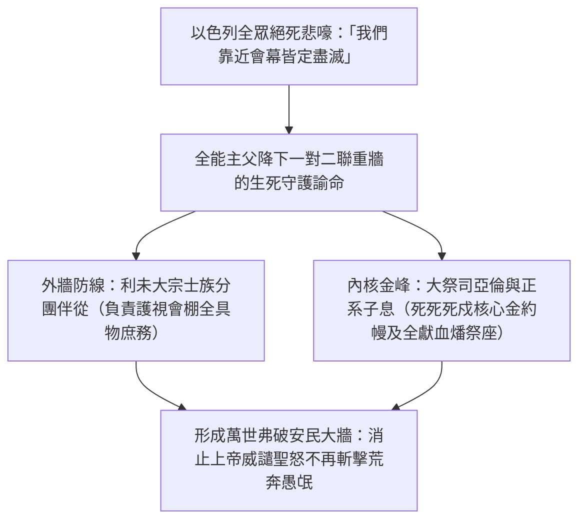
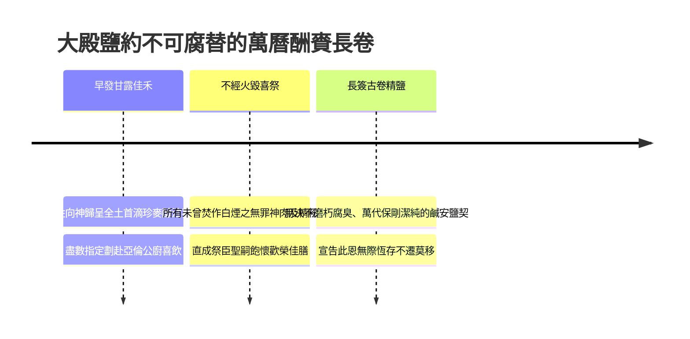
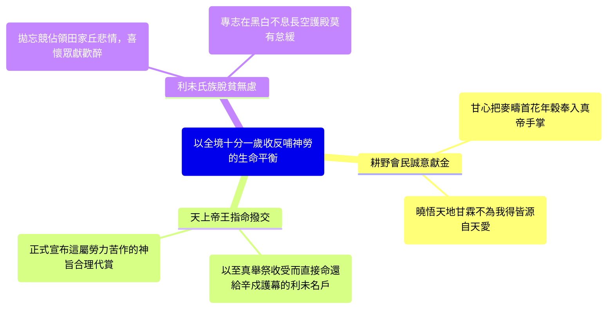
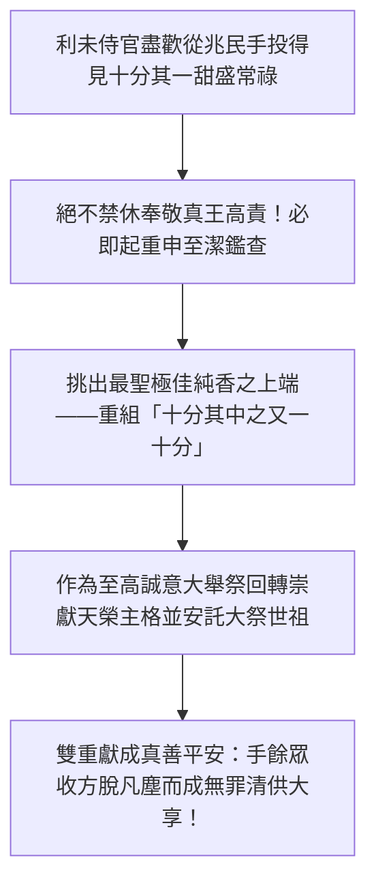

# 民數記 第18章

1. 耶和華對亞倫說：你和你的兒子，並你本族的人，要一同擔當干犯聖所的罪孽。你和你的兒子也要一同擔當干犯祭司職任的罪孽。
2. 你要帶你弟兄利未人，就是你祖宗支派的人前來，使他們與你聯合，服事你，只是你和你的兒子，要一同在法櫃的帳幕前供職。
3. 他們要守所吩咐你的，並守全帳幕，只是不可挨近聖所的器具和壇，免得他們和你們都死亡。
4. 他們要與你聯合，也要看守會幕，辦理帳幕一切的事，只是外人不可挨近你們。
5. 你們要看守聖所和壇，免得忿怒再臨到以色列人。
6. 我已將你們的弟兄利未人從以色列人中揀選出來歸耶和華，是給你們為賞賜的，為要辦理會幕的事。
7. 你和你的兒子要為一切屬壇和幔子內的事一同守祭司的職任。你們要這樣供職；我將祭司的職任給你們當作賞賜事奉我。凡挨近的外人必被治死。
8. 耶和華曉諭亞倫說：我已將歸我的舉祭，就是以色列人一切分別為聖的物，交給你經管；因你受過膏，把這些都賜給你和你的子孫，當作永得的分。
9. 以色列人歸給我至聖的供物，就是一切的素祭、贖罪祭、贖愆祭，其中所有存留不經火的，都為至聖之物，要歸給你和你的子孫。
10. 你要拿這些當至聖物吃；凡男丁都可以吃。你當以此物為聖。
11. 以色列人所獻的舉祭並搖祭都是你的；我已賜給你和你的兒女，當作永得的分；凡在你家中的潔淨人都可以吃。
12. 凡油中、新酒中、五穀中至好的，就是以色列人所獻給耶和華初熟之物，我都賜給你。
13. 凡從他們地上所帶來給耶和華初熟之物也都要歸與你。你家中的潔淨人都可以吃。
14. 以色列中一切永獻的都必歸與你。
15. 他們所有奉給耶和華的，連人帶牲畜，凡頭生的，都要歸給你；只是人頭生的，總要贖出來；不潔淨牲畜頭生的，也要贖出來。
16. 其中在一月之外所當贖的，要照你所估定的價，按聖所的平，用銀子五舍客勒贖出來（一舍客勒是二十季拉）。
17. 只是頭生的牛，或是頭生的綿羊和山羊，必不可贖，都是聖的，要把他的血灑在壇上，把他的脂油焚燒，當作馨香的火祭獻給耶和華。
18. 他的肉必歸你，像被搖的胸、被舉的右腿歸你一樣。
19. 凡以色列人所獻給耶和華聖物中的舉祭，我都賜給你和你的兒女，當作永得的分。這是給你和你的後裔、在耶和華面前作為永遠的鹽約（鹽即不廢壞的意思）。
20. 耶和華對亞倫說：你在以色列人的境內不可有產業，在他們中間也不可有分。我就是你的分，是你的產業。
21. 凡以色列中出產的十分之一，我已賜給利未的子孫為業；因他們所辦的是會幕的事，所以賜給他們為酬他們的勞。
22. 從今以後，以色列人不可挨近會幕，免得他們擔罪而死。
23. 惟獨利未人要辦會幕的事，擔當罪孽；這要作你們世世代代永遠的定例。他們在以色列人中不可有產業；
24. 因為以色列人中出產的十分之一，就是獻給耶和華為舉祭的，我已賜給利未人為業。所以我對他們說：在以色列人中不可有產業。
25. 耶和華吩咐摩西說：
26. 你曉諭利未人說：你們從以色列人中所取的十分之一，就是我給你們為業的，要再從那十分之一中取十分之一作為舉祭獻給耶和華，
27. 這舉祭要算為你們場上的穀，又如滿酒醡的酒。
28. 這樣，你們從以色列人中所得的十分之一也要作舉祭獻給耶和華，從這十分之一中，將所獻給耶和華的舉祭歸給祭司亞倫。
29. 奉給你們的一切禮物，要從其中將至好的，就是分別為聖的，獻給耶和華為舉祭。
30. 所以你要對利未人說：你們從其中將至好的舉起，這就算為你們場上的糧，又如酒醡的酒。
31. 你們和你們家屬隨處可以吃；這原是你們的賞賜，是酬你們在會幕裡辦事的勞。
32. 你們從其中將至好的舉起，就不致因這物擔罪。你們不可褻瀆以色列人的聖物，免得死亡。

<!-- fhl-map-links:start -->
## 相關地圖

- [[appendix/fhl_maps/maps/021|〈民圖二〉探查應許地和應許地的範圍]]
- [[appendix/fhl_maps/maps/038|〈書圖十一〉利未人的城和十二個支派的地業]]
<!-- fhl-map-links:end -->

---

## 本章知識節點

### 神學
- [[祭司與利未人聯合承擔干犯聖所與神職的重任]]
- [[上帝給予大祭司的特別賞賜與供職責任]]
- [[耶和華為祭司在死寂人境唯一的無地之分與永世產業]]
- [[利未人自十分之一中向神獻呈至佳十分之一奉為至聖供物]]

### 文化
- [[舉祭與搖祭為受膏祭司子孫永得的鹽約與永至]]
- [[收受以色列全地出產十分之一作為會幕服役之代償賞回]]

---

## 本章整理

### 祭司與利未人於會幕中的職務大定與中保責任（v1-7）

民數記第十八章在整個出埃及舊約敘事及神界權柄體統的揭露當中，扮演著一座將災禍的震懾順利導引至安定垂顧與平安秩序的雄壯神道橋樑。上接第十至十七章所一再重演的大規模騷動：由可拉黨反悖所牽扯出的爭奪祭權狂焰、兩百五十尊銅香爐遭神火燒殘的慘酷收場、大地龜裂破滅的凶途、乃至亞倫發芽熟杏木杖擺陳在法櫃前的最後裁判。經歷一連串心肝皆破的浩大炎罰後，以色列百姓陷入了一層極具絕望色彩的心魂崩潰之中，狂嘯發嚎著：「我們死啦！我們滅亡啦！都滅亡啦！凡挨近耶和華帳幕的是必死的。我們都要死亡嗎？」（十七12-13）。全能天父既深恤屬血人類在經歷震慄後的極度無依，便在此破曉開卷，面向亞倫直接大宣垂恤生機，重立這套分憂解怒、由大祭祀家世替天下擋罪的無上中保大架構——正是[[祭司與利未人聯合承擔干犯聖所與神職的重任]]與相關重令（v1-5）。「耶和華對亞倫說：你和你的兒子，並你本族的人，要一同擔當干犯聖所的罪...又要使你弟兄利未支派，就是你祖宗支派的人，一同過來，陪伴你，事奉你...免得他們和你們一同死亡」（v1-3）。

黃迦勒在其釋讀中無限深致地領受此中中保的浩嘆偉歌：「屬肉世界的常情莫不是對殿堂高職垂涎熱愛，爭逐居榮得譽的表層好處，知之者稀者莫大如這鐵言真判：受召居位絕非自炫無虞榮寵，反倒是站往炎雷浩災尖谷前頭、甘心分吃並一肩雙拱頂下來致聖威怒下的可怕罪障與死亡刑重！神叫事使一眾聯結同禦，正是去撐造一面長青的屏障護道，叫那些盲昏蠢民得以安居會棚外圈而非碰入大誓死亡深谷」（CT）。

丁良才及舊約經典背景釋註深入辨明此內外兼防的聯璧機制：「希伯來文中利未本名原來即懷抱著『聯接與同棲』的大思；今日他們榮耀地從合萬之眾裡拔領前進相扶阿倫事司，但在絕嚴至聖的黃金秘堂上，主心斬決下了生死紅線：僅祭長神君之胤才得越近燒火和心心贖契！此既宣講神性無情偏袒容不得自取妄動，同時卻是把千層天盾加疊護固」（GT）。

而在極其分明嚴苛的擔罰戒宣之後，造化真靈大言高昇，為天下千古奉行使命的高潔工臣澆下長露和甘恩喜音，大顯那聖榮真旨，也正是[[上帝給予大祭司的特別賞賜與供職責任]]（v7）。「你和你的兒子要為壇和幔子內的一切事，守祭司的職任...我將祭司的職任給你們當作賞賜事奉我。凡挨近的外人必被治死。」KingComments 氣勢無限澎湃地闡發這一至高正名與福音喜宴：「悖言流黨始終錯拿屬神天職作成傲慢強凌的權位競爭，耶和華自金闕發力把其劣心敲得粉碎！主宣口指出：那長年涉險承死苦戰的贖罪聖祀，全因創造聖慈憐惠平平無由餽授於大信心使之賞饋恩寶；凡世貪功外漢意欲強行偷篡這大榮幸寵必然滅禍！」（KC）。BibleHub 更把這榮大天道延伸探向無私聖父：「唯神自遣的使帥堪背罪軛；能作上主身前中保者即屬平空獲賞無限喜靈！天下無比的大大樂事，正在於敢擔人苦而成全順命殿祀」（BH）。

| 事主聯防護制分區 | 所擔當的核心神職領域 | 所需承負的神聖天討與榮寵天誓 |
| :--- | :--- | :--- |
| **利未同宗輔隨戰團** | 看守帳幕四表庶務、執管運移、守望庭外阻擋狂俗進侵。 | 不可近踏黃金心器及燔火重陵；誤越即死；以同伴身姿成固防衛重壕。 |
| **亞倫長職大祭本院** | 直往至聖幔幕最奧深地；掌使熱燒火地及鮮純紅血獻揚。 | 自承干犯聖所重過之生責；為天父格外恩賜的『榮愛喜賞』大遺產，專吃中保千恩。 |

> [!note] 事道承罪大榮
> - 「神把至危至顯的重務名狀作白授好禮；此語解散了人世把神位當狂耀榮祿的愚夢，證明甘肩刑責才是得帝獎顧的心鑰。」(CT)
> - 「利未之伴與阿倫之守將會幕死河轉成天下樂源；莫愁不能登火壇，當嘆有神中保相挺生靈！」(BH)

### 祭司至高的永恆賞祿與不可廢毀之鹽約（v8-20）

在親聲立誓將會所沉罪大關全權歸交於亞倫正統系身中之後，天道之王隨即展開了曠歷古今天下最廣厚豐蔚的回慰之典。創造主決不叫甘願終歲藏臥於荒寒會帳、捨棄四向泥疆追獵的小民陷入半縷餓空枯老，而是借此洪大宣告奠約下了神聖厚實的供給——即[[舉祭與搖祭為受膏祭司子孫永得的鹽約與永至]]（v8-19）。「耶和華對亞倫說：我已將我的舉祭，就是以色列人一切的分別為聖的物，交給你看守...全獻給君主不可投火燒化的各等素貢、罪過除赦、安懷歡宴祭品...凡全境首綻甜潤橄欖華油、絕頂麥金芳穗與早時酒蜜都將化為爾嗣終古歡慶不竭的新餽。此是我在真面與爾後裔子苗結鑄萬載毫無料減變遷的鹽約」（v8-19）。黃迦勒沉浸讚歎這一席神榮珍餉的無限善待：「請俯聽我們至聖真光對於為義當勞不求虛利者的宏偉保單！世上獵權常伴算斗與憂竭，但侍守真光的主工豈是一寒苦奴？上帝把自己案表前最高厚喜美的大恩珍味直接端赴為阿倫一家甘潤長餉！凡全族未玷不汙之口通當坦無懼慮與主宴樂此厚寵長祿」（CT）。

丁良才及舊約嚴格背景釋疑對這難以摧替的「鹽約」聖誓及奉祭制度作出深入開拓：「古經近東列土長世結交莫大的邦交厚誓，多喜捉進純堅不蛀莫死莫亡的海海極白堅鹽作為無情悔移之憑證（參利二13；代下十三5）；天光不用片麻危簡，卻親宣把萬流佳歲歸成祭工世代享受長甘的純堅鹽卷，直令天下窺探猜算天朝俸祿者肅然噤唱！」（GT）。BibleHub 及精湛經疏更大唱基督同餐甘旨：「平安良犧非庸徒得嘗，證明順道忠勤使臣日日享有與至天活君筵上分光榮幸，沒有塵食衰老」（BH）。

而在如此璀璨不腐的萬里聖糧宣告尾聲，耶和華自太初極峰猛烈落下了一發令千邦大地俯首相隨、將生死物利看空拔淨至極的神性最高榮示，也成了千載至崇傳承——即[[耶和華為祭司在死寂人境唯一的無地之分與永世產業]]（v20）。「耶和華對亞倫說：你在以色列人的地上不可有產業，在他們中間也不可有分。我就是你的分，是你的產業。」黃迦勒熱狂淚出闡寫這種拋卻沙原、直得創皇神軀為終年財富的大超脫：「蠢頑血心總是哭叫不分片隅田疆必定老於乞絕；哪裡透知能把天地長海一肩直捏的永生成創神——祂聖格神榮本人必定成為你的無限田壤與厚盈金庫！你放棄了在微賤紅泥間奪奪殺殺一息領丘，反而承入活天大主神軀、遍享浩大歡欣榮足的天下至偉產遺！」（CT）。KingComments 也縱吟出悠雅長贊：「『我本身便是爾的大定分』——這是任何邦王無以媲對的極恩盟語；當常士抱田防懼成虛，事帝重匠直接在永主心肝中躺享有定無缺，千古成冠！」（KC）。

| 祭司物心酬濟條規 | 世人凡目所瞻的物理表象 | 真實屬天所承啟永存威儀 |
| :--- | :--- | :--- |
| **不壞恆純長鹽約** | 收攏眾邦頂金鮮美麥酒祭珍歸賜祭一戶充任口糧食養。 | 表言長老真君絕不叫誠侍之使苦餒饑缺；用抗腐大鹽起誓宣告終生寵饋絕無悔落。 |
| **耶穌為我至偉產** | 在萬群奪爭封壤的迦南紅地毫不留拿半寸農野荒田。 | 大啟拋丟塵間得損自義的清貴使位：造宇宙者本人化為爾無盡歡飽大基、遠邁億里泥領。 |

> [!important] 無地卻擁萬世的極上長樂
> - **用鹽明契長鮮**：海鹽長久解蟲擋腐，上天也把常膳給供如此固鑄於公奉一朝，拒退任何荒憂與吝奪。
> - **造王即是大富**：勿去計苦莫領山隅私城；真正把君主活心收入腹中、成我永遠家庫者，方是縱觀千宇最豐茂的萬乘首貴！

### 利未氏族領受天下出產一成作為神職報酬與安養（v21-24）

在此既已完全建固祭臣不缺不寒的核心榮祿後，那位深憐天地細微骨血、洞燭全軍勞損的大慈上工君，進一步向全個以色列大家譜延拓那不可廢輟、社會相互成全成活的反哺大天綱——即[[收受以色列全地出產十分之一作為會幕服役之代償賞回]]（v21-24）。「至若利未子孫，我看，我已將以色列中出產的十分之一，就是他作他們眾人辦會幕之事的酬勞，通給了他們...因為以色列人奉獻給耶和華為舉祭的十分之一，我已給予了利未人為業」（v21-24）。

黃迦勒懷熱讚詞申辯這一公平與宏毅並揚的大愛供償制：「愚頑世態容易妄疑凡事天主者好爭剝索；上帝自天直接降定至正綱則！那不怕炎責、肩扛看屋侍戍之巨苦的長使名宿，全為保護黎生少吃聖火天罰！彼既於紅域捨撇田疇長事，則呼朋喚里把自己收納出花首富取其十分其一、心愛誠和奉充作渠眾久活甜資，並言之即彼辛作之神法定償薪，實乃公直美盛的浩坦大道！」（CT）。

丁良才及經世正理史傳進而精準申張這被呼號「十分之一供量」在律史古章下的壯觀長效：「從中東先祖即流揚的頂獻習則，被這極至聖主改構成社群互相成就共福的堅律強規：民奉十金不必悲憐乞貸，正是對侍衛神城勞臣薪資大定；而此長金奉足，叫全體子性遠遠遠離因私妄忘酬而惹爆的神格棄遣！」（GT）。BibleHub 亦徹言剖析如此雙向成聖的美德：「收得世上極佳歲作是為證明奉命長差皆受帝撫；肯把勞薪與利未均享，則全民於土宇得獲上帝長賜無限長榮！」（BH）。

KingComments 也以清麗詩筆頌頌道：「當百姓笑納己收中的一成分發到替眾看靈的使臣手懷，這裡沒有貪算計仇，只留長浩感恩喜淚；這般愛護使工的神律，教我們曉知永不讓熱血為我盡心的苦將蒙遇炎冬飢難，乃牽成眾樂喜宴之地！」（KC）。一令出震，保全萬戶互愛護持神序。

| 社會互哺角色定位 | 在大地農村事場的任務態勢 | 上下相扶的神學靈長深義 |
| :--- | :--- | :--- |
| **稼穡眾信黎苗** | 親下泥原鋤植收滿歲稼百實；不自吝愛把整盤頂面一成提拿敬奉。 | 在歡獻不欠中彰顯一切長養仰出天天仁君；依薪奉還侍者護佑神怒之功。 |
| **苦任看棚利未軍** | 全歲拋丟山疆、日夜死立大幕前承荷重罰苦戍；盡數迎攬各處輸往既安歲常。 | 證得苦務從不見冷酷虧苦於真靈面孔；能安享長命薪酬且成民靈喜樂橋欄。 |

> [!warning] 分恩同長訓約
> - **酬薪即真義**：忘失奉金供償莫過於虧待替我擋災承過的神朝重匠；遵愛分抽就是喜享和平聖地榮路。
> - **長安不妄奪**：事差眾使喜領此恩當休去企地奪邑心思，專把長燈挑明報答主懷。

### 利未侍道者自報酬中再次提繳首上至好為祭品（v25-32）

而在確立利未氏族將坦然受納自全以色列滾滾洶湧注入的一成宏福薪潤後，那直透人類潛藏敗壞、決不在聖所養留特縱肆情者的千全至聖審座，向著領享有金澤酬報的利未同等降下一陣猛如重雷卻純美如光的再平衡聖律——即[[利未人自十分之一中向神獻呈至佳十分之一奉為至聖供物]]（v25-32）。「你又要曉諭利未人說：你們從以色列人那裡取了我給你們的十分之一，就是你們作他們的工資，你們就要從這十分之一中，取十分之一，為耶和華的舉祭...你們要從所受的一切禮物中，把至好的、至聖的交與耶和華為舉祭...就不至被罰遭戮死亡」（v25-32）。黃迦勒以凌厲的聖見痛陳人性最愛的幽謬並申明神天萬道皆平：「俗徒最愛一存功高勞厚便妄生輕漫不受管治之妄傲，意圖主張我辦大幕苦事豈能照當獻納於神？至靈帝天手棒打散此迷狂大垢！明確再詔：莫以為承役供差可享免獻豁庇！既收千萬甘養一成金進，必定一樣再精打細擇把首頂無玷、精華之中最鮮最上好的其一再作舉禮恭轉敬獻至上高神與亞倫掌座！豪爽長行此奉道就是清白安長，任何忘省偷漏皆招苦禍大罰！」（CT）。

丁良才及研經文化深度背景探幽闡曉斯「十分之金供再取其首一」所含靈活光景：「造古東疆莫不如這美法嚴整！上帝並非吝取僕資，卻是勒言長告所有居首之將，必定深存回向首德之心。更絕之秘訣，唯在斯一十分頂聖高貢交足天筵後，爾全戶剩下九九歲食才果真蒙賜淨脫凡垢（等同良田首獲），足以堂堂無懼口腹飽呼！」（GT）。BibleHub 亦徹讚一體虔恭長樂：「即便神廷大差使臣也未嘗不是造化愛養下的子庶；以最優第一滴芳呈主，告明無上僕謙與深真聖恩萬千貫連！」（BH）。

KingComments 更為如此首尾互隨、雙軌輪回的壯麗貢呈制度題詩高稱：「瞧阿這完美毫缺點漏的愛福巨鏈：萬戶喜獻利未，利未高舉阿倫，阿倫長立真座，層層飛揚無有半分藏私！任何高高在上侍職皆不可免了把至鮮最好敬還天恩，此律護牢神殿絕不會墮變為自大豪取枯林，永遠洋溢真虔純聖光歌！」（KC）。

| 再提聖供結構要目 | 表層的經濟物資運載態勢 | 底蘊的神學自潔與免罰深誓 |
| :--- | :--- | :--- |
| **首中選首之真一成** | 於從以民處受致金禾海宴裡面、摘精拔頂挑拿一小面絕對至優最醇的十分提拿神往。 | 打破辦事大員豁當聖恩妄自尊大迷途；宣告作天吏神兵者更要至誠不替歸主心歡。 |
| **餘額全然無咒祝聖** | 在將頂首轉交與上神及亞倫門中後，利未眾生即可於處處宅邸肆適快然長享其餘食儲。 | 在奉納誠真底下化盡一切得損不敬之災譴；把口祿全轉為聖安妙味，解免自取滅罪慘終。 |

> [!note] 永續誠潔聖歌
> - **無一例外稱聖**：無一人敢恃位免勞敬上帝之份；身陷長安必定挑一為精供！
> - **善首方能常豐**：向世示白當最好的已在君懷歡留，全地所食所思方證無祸平安長世！

**參考資料**
https://www.ccbiblestudy.org/Old%20Testament/04Num/04CT18.htm
https://www.ccbiblestudy.org/Old%20Testament/04Num/04GT18.htm
https://www.kingcomments.com/en/bible-studies/Num/18
https://biblehub.com/study/numbers/18.htm
