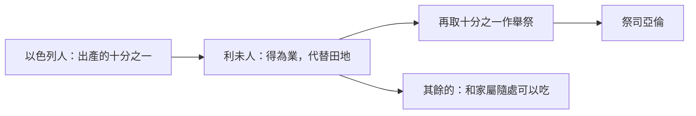

# 民數記 第18章

<!-- chapter-navigation:start -->
| [前一章](../04%20民數記/第17章.md) | [回目錄](../04%20民數記/全書目錄及綱要.md) | [下一章](../04%20民數記/第19章.md) |
| :--- | :---: | ---: |
<!-- chapter-navigation:end -->

1. 耶和華對[[亞倫]]說：你和你的兒子，並你本族的人，要一同擔當干犯聖所的罪孽。你和你的兒子也要一同擔當干犯[[亞倫和他兒子（祭司）|祭司]]職任的罪孽。
2. 你要帶你弟兄[[利未支派|利未人]]，就是你祖宗支派的人前來，使他們與你聯合，服事你，只是你和你的兒子，要一同在法櫃的帳幕前供職。
3. 他們要守所吩咐你的，並守全帳幕，只是不可挨近聖所的器具和壇，免得他們和你們都死亡。
4. 他們要與你聯合，也要看守會幕，辦理帳幕一切的事，只是外人不可挨近你們。
5. 你們要看守聖所和壇，免得忿怒再臨到以色列人。
6. 我已將你們的弟兄[[利未支派|利未人]]從以色列人中揀選出來歸耶和華，是給你們為賞賜的，為要辦理會幕的事。
7. 你和你的兒子要為一切屬壇和幔子內的事一同守[[亞倫和他兒子（祭司）|祭司]]的職任。你們要這樣供職；我將祭司的職任給你們當作賞賜事奉我。凡挨近的外人必被治死。
8. 耶和華曉諭[[亞倫]]說：我已將歸我的[[舉祭]]，就是以色列人一切分別為聖的物，交給你經管；因你受過膏，把這些都賜給你和你的子孫，當作永得的分。
9. 以色列人歸給我[[至聖的供物（聖與至聖之分）|至聖的供物]]，就是一切的素祭、贖罪祭、[[贖愆祭（asham）|贖愆祭]]，其中所有存留不經火的，都為至聖之物，要歸給你和你的子孫。
10. 你要拿這些當至聖物吃；凡男丁都可以吃。你當以此物為聖。
11. 以色列人所獻的[[舉祭]]並[[搖祭]]都是你的；我已賜給你和你的兒女，當作永得的分；凡在你家中的潔淨人都可以吃。
12. 凡油中、新酒中、五穀中至好的，就是以色列人所獻給耶和華[[初熟]]之物，我都賜給你。
13. 凡從他們地上所帶來給耶和華[[初熟]]之物也都要歸與你。你家中的潔淨人都可以吃。
14. 以色列中一切永獻的都必歸與你。
15. 他們所有奉給耶和華的，連人帶牲畜，凡頭生的，都要歸給你；只是人頭生的，總要贖出來；不潔淨牲畜頭生的，也要贖出來。
16. 其中在一月之外所當贖的，要照你所估定的價，按聖所的平，用銀子五[[舍客勒]]贖出來（一舍客勒是二十季拉）。
17. 只是頭生的牛，或是頭生的綿羊和山羊，必不可贖，都是聖的，要把他的血灑在壇上，把他的脂油焚燒，當作馨香的火祭獻給耶和華。
18. 他的肉必歸你，像被搖的胸、被舉的右腿歸你一樣。
19. 凡以色列人所獻給耶和華聖物中的[[舉祭]]，我都賜給你和你的兒女，當作永得的分。這是給你和你的後裔、在耶和華面前作為永遠的[[立約的鹽|鹽約]]（鹽即不廢壞的意思）。
20. 耶和華對[[亞倫]]說：你在以色列人的境內不可有產業，在他們中間也不可有分。我就是你的分，是你的產業。
21. 凡以色列中出產的[[十分之一]]，我已賜給利未的子孫為業；因他們所辦的是會幕的事，所以賜給他們為酬他們的勞。
22. 從今以後，以色列人不可挨近會幕，免得他們擔罪而死。
23. 惟獨[[利未支派|利未人]]要辦會幕的事，擔當罪孽；這要作你們世世代代永遠的定例。他們在以色列人中不可有產業；
24. 因為以色列人中出產的[[十分之一]]，就是獻給耶和華為[[舉祭]]的，我已賜給[[利未支派|利未人]]為業。所以我對他們說：在以色列人中不可有產業。
25. 耶和華吩咐[[摩西]]說：
26. 你曉諭[[利未支派|利未人]]說：你們從以色列人中所取的[[十分之一]]，就是我給你們為業的，要再從那十分之一中取十分之一作為[[舉祭]]獻給耶和華，
27. 這[[舉祭]]要算為你們場上的穀，又如滿酒醡的酒。
28. 這樣，你們從以色列人中所得的[[十分之一]]也要作[[舉祭]]獻給耶和華，從這十分之一中，將所獻給耶和華的舉祭歸給[[亞倫和他兒子（祭司）|祭司]][[亞倫]]。
29. 奉給你們的一切禮物，要從其中將至好的，就是分別為聖的，獻給耶和華為[[舉祭]]。
30. 所以你要對[[利未支派|利未人]]說：你們從其中將至好的舉起，這就算為你們場上的糧，又如酒醡的酒。
31. 你們和你們家屬隨處可以吃；這原是你們的賞賜，是酬你們在會幕裡辦事的勞。
32. 你們從其中將至好的舉起，就不致因這物擔罪。你們不可褻瀆以色列人的聖物，免得死亡。

---

## 本章知識節點

### 神學
- [[擔當干犯聖所與祭司職任的罪孽]]
- [[祭司與利未人的職任為神之賞賜]]
- [[耶和華是事奉者的業與分]]
- [[利未人的什一奉獻]]
- [[立約的鹽]]
- [[永遠當祭司的職任]]

### 主題
- [[至聖的供物（聖與至聖之分）]]
- [[十分之一]]

### 原文
- [[舉祭]]
- [[贖銀五舍客勒]]
- [[贖愆祭（asham）]]
- [[搖祭]]
- [[舍客勒]]
- [[初熟]]

### 人物
- [[利未支派]]
- [[亞倫和他兒子（祭司）]]
- [[亞倫]]
- [[摩西]]

### 文化
- [[古代近東以什一奉獻為神職薪酬]]

---

## 本章整理

第17章結尾百姓喊了一句「凡挨近耶和華帳幕的是必死的。我們都要死亡嗎？」（民17:13），第18章就是這句話的答覆。GT 丁良才《民數記註釋》在民17 的註解裡直接說：第十八章上就顯明神雖有威嚴，卻也有憐愛。

答覆不是把人推遠，是派人站在中間；而站在中間的人，神也負責養活。

### 一、全本聖經唯一一次，神直接對亞倫說話（v1）

CT 注意到本章開頭的異常：「神在此處單獨對亞倫說話，是因為本章的話是有關祭司和利未人的職責。」GT 丁良才《民數記註釋》講得更細：平常神曉諭摩西，或摩西和亞倫，甚至只關係[[亞倫]]一個人的事，神也先吩咐摩西；這一次直接對亞倫說，「大概也是神因為十六章上的事，要在百姓面前尊重亞倫的職分，使百姓也尊重他」。KC 也指出這是第一次也是唯一的一次。

GT 丁良才並歸納本章的兩個宗旨：「1要顯明祭司的職分何等尊貴，2要安慰百姓的心（參十七12-13）。」

第1節是[[擔當干犯聖所與祭司職任的罪孽|整章的鑰句]]：「你和你的兒子，並你本族的人，要一同擔當干犯聖所的罪孽。你和你的兒子也要一同擔當干犯祭司職任的罪孽。」

> [!note] 「擔當」在原文裡有兩層意思
> GT 丁良才《民數記註釋》：「這兩個字，在原文上有兩個意思：一受刑，二贖罪（參出二十八38）。在基督裡，這兩個意思卻歸於一，因為祂不但受了世人應受的刑罰，也贖了世人所犯的罪愆。」
>
> STEP 原文資料顯示這個動詞是 תִּשְׂאוּ（tis.'U），詞典形 נָשָׂא（na.sa，H5375J，to lift: guilt）——正是民14:18 神「赦免」罪孽、民14:34 百姓「擔當」罪孽的同一個字。

### 二、誰做什麼：兩層職分的分界（v2-7）

本章把[[利未支派|利未人]]與[[亞倫和他兒子（祭司）|祭司]]的界線畫得很清楚：

| | 利未人 | 祭司（亞倫和他的兒子） |
| :--- | :--- | :--- |
| 服事對象 | 服事祭司（v2） | 服事神（v7） |
| 範圍 | 看守會幕、辦理帳幕一切的事（v4） | 一切屬壇和幔子內的事（v7） |
| 禁區 | 不可挨近聖所的器具和壇（v3） | —— |
| 界線之外的人 | 「外人不可挨近你們」（v4，指利未人以外） | 「凡挨近的外人必被治死」（v7，指非祭司者） |

GT 丁良才《民數記註釋》把兩個「外人」分得很清楚：第4節的外人「就是利未族以外的人」，第7節的外人「乃是指著不做祭司的人」。CT 也指出第7節的外人包括利未人在內。

KC 從這個分工讀出一個原則：利未人要歸入祭司，不是反過來——利未（Levi）的意思正是「聯合」（創29:34）；每一項利未人的服事，都要以讓祭司能更好地獻祭為目標。

GT《舊約聖經背景註釋》用同心圓來說明整個設計：聖潔空間的核心是至聖所，向外是多個潔淨程度不同的地帶，「祭司的主要任務之一是實施規例，以求維持每個地帶的聖潔程度合乎規格」。

第5節說明這一切要防的是什麼：「你們要看守聖所和壇，免得忿怒再臨到以色列人。」GT 丁良才註得很短：「如同臨到可拉黨人的一樣（十六49）。」

### 三、兩樣都是「賞賜」（v6-7）

第6-7節兩次用同一個詞（[[祭司與利未人的職任為神之賞賜|賞賜]]）：利未人是給祭司的賞賜（v6），祭司的職任是給亞倫家的賞賜（v7）。

GT 丁良才《民數記註釋》解釋這個詞：「這種功夫不是一樣重擔，或是不測的事，也不是他們自然應得的，或生來就有的，乃是神特別之恩賜的工作。」

KC 指出兩樣賞賜都給了祭司——這是恩典，不是功勞。CT 則把它接回可拉：「只有像可拉一樣不認識事奉的人，才會輕看在神面前的事奉，而重看在人眼中的高位。」他並提醒另一面：「任何權利的另一面都是責任」

GT《啟導本聖經註釋》補上一句常被忽略的：「祭司的設立，不只是神給擔任祭司的人的一種賞賜，也是給全民的賞賜（5,7節）。」

### 四、祭司靠什麼過活（v8-19）

站在中間的人不能耕地，所以神把供養寫成制度。GT 丁良才《民數記註釋》把祭司所得列成八項：

| # | 項目 | 節次 |
| :--- | :--- | :--- |
| 1 | 一切分別為聖之物 | v8 |
| 2 | 素祭、贖罪祭、[[贖愆祭（asham）]]中所存留不被焚的 | v9-10 |
| 3 | 一切的[[搖祭]] | v11 |
| 4 | 一切[[初熟]]的五穀、初成的油和新酒 | v12 |
| 5 | 一切被獻之初熟的果子 | v13 |
| 6 | 一切被永獻的 | v14 |
| 7 | 一切頭生的人和牲畜 | v15 |
| 8 | 一切的[[舉祭]] | v19 |

這些東西分兩級（[[至聖的供物（聖與至聖之分）|至聖之物與聖物]]），吃的人與吃的地方都不同：

- **至聖之物**（素祭、贖罪祭、贖愆祭中不經火的部分）：只有祭司家的男丁可以吃（v10）。GT《民數記串珠聖經註釋》指出這一級「惟有祭司（男丁）可吃」。
- **聖物**（舉祭、搖祭、初熟之物等）：「凡在你家中的潔淨人都可以吃」（v11、13）。

CT 註明「潔淨人」的意思是本身沒有不潔的狀況、也未沾染不潔（參利11-15章）；GT 丁良才則指出吃的地點也不同：前一級要在會幕裡吃，後一級可以在家中吃。

KC 從這個分級讀出一層屬靈的意思：兒子代表真正在盡祭司職分的信徒，女兒代表原則上是祭司、實際上沒有進到裡面的信徒；素祭、贖愆祭、贖罪祭需要屬靈的成熟才吃得下，平安祭則是剛信主的人也能立刻享受的。

第15-16節處理[[贖銀五舍客勒|頭生的贖價]]。GT 丁良才《民數記註釋》特別澄清一個容易誤解的地方：「要贖出來」不是叫祭司出五舍客勒銀子（這是父母當出的），乃是要祭司辦理這事，而那贖價的銀子必歸與祭司。STEP 原文資料另可確認第16節[[舍客勒|舍客勒]]與季拉的換算——GT《舊約聖經背景註釋》給的數字是：「贖回孩童和不潔牲畜所用的舍客勒，等於銀子二十季拉（11.5克）。本節所指的，不是要到主前四世紀才出現的錢幣。」

### 五、鹽約（v19）

第19節用了一個很特別的說法（[[立約的鹽]]）：「這是給你和你的後裔、在耶和華面前作為永遠的鹽約」。

各家的解釋集中在鹽的兩個性質上：

- GT 丁良才《民數記註釋》從立約的場合說：「古時的人，多在筵席上訂立條約（創三十一46），因此就將鹽作為雙方立約的標記。因為鹽在各種食物中，是不可少的。」
- GT《啟導本聖經註釋》從防腐說：「鹽能保持食物不易腐壞，古代近東民族多以鹽象徵永久。」
- BH 的說法相同，並補上跨文化的證據：巴比倫、波斯、阿拉伯、希臘的文獻都證實了這個象徵性的用法。
- GT《舊約聖經背景註釋》另指出一個角度：鹽有妨礙發酵過程的功用，而酵是悖逆的象徵，「所以鹽自然就成為防止悖逆的代表」。

STEP 原文資料可確認第19節這一段的用字：「舉祭」是 תְּרוּמֹת（te.ru.Mot，H8641，contribution），「鹽約」是 בְּרִית מֶלַח（be.Rit Me.lach，H1285＋H4417M）。

> [!important] 同一個動詞，在民16 與民18 走了兩條路
> 第19節「所獻給耶和華」的動詞是 יָרִימוּ（ya.Ri.mu），詞典形 רוּם（rum，H7311A，to exalt）——把東西舉起來獻上。
>
> 而民16:30 的「擅敢行事」（字面「用高舉的手」，見該章的原文資料）出自同一個 רוּם。
>
> 同一個「舉起」的動作：一次是舉手抗拒神，一次是舉祭獻給神。

### 六、我就是你的分（v20-24）

第20節是全章的高點：[[耶和華是事奉者的業與分|「你在以色列人的境內不可有產業，在他們中間也不可有分。我就是你的分，是你的產業。」]]

STEP 原文資料顯示這一節用了兩個不同的字：「分」是 חֵלֶק（Che.lek，H2506A，portion），「產業」是 נַחֲלָה（na.cha.Lah，H5159，inheritance）；而「不可有產業」的動詞 תִנְחָל（tin.Chal，H5157）正是「產業」那個名詞的同源動詞。兩個字都先被收回來，再由神自己填進去。

GT 丁良才《民數記註釋》指出這條命令的實際後果：「後來祭司只得了十三座城，就是因這命令（書二十一13-19）。」他並列出不得有產業的三樣益處：

1. 「利未人少有世務纏身，就能專心侍奉神」
2. 「他們代替百姓辦理事神的事，百姓供給他們一切的需用，因此就能生出彼此相愛互助的精神」
3. 「他們被分散在十二支派中，因此越發能盡引導教訓百姓的責任」

代替產業的是[[十分之一]]（v21-24）。GT《舊約聖經背景註釋》做了一個跨文化的比較，指出這個作法在當時很特別（[[古代近東以什一奉獻為神職薪酬]]）：

| | 以色列 | 鄰近諸國 |
| :--- | :--- | :--- |
| 什一奉獻名義上歸誰 | 耶和華 | 君王與行政機關 |
| 實際受益者 | 沒有分到土地的利未人 | 宮室官僚、常備兵團 |
| 註釋原文 | 「顯然是以色列獨有的作法」 | 「迦南文化的什一制度與以色列十分相似，但受益者卻是君王與行政機關，不是祭司」 |

GT 丁良才《民數記註釋》另指出什一制度不是本章才有的新事：「自古以來，有十分捐一與主的規矩」，並舉亞伯拉罕（創14:20）與雅各（創28:22）為例；GT《啟導本聖經註釋》則指出本章的位置——奉獻土地出產十分之一本為古制，「此處首次指明歸給利未族」。

### 七、收十分之一的人，也要獻十分之一（v25-32）

最後一段轉了對象：第25節神吩咐[[摩西]]，不是亞倫。CT 說明原因：「神將對亞倫所說的話(參1~24節)，向摩西證實，因為他是以色列全會眾的首領。」GT《民數記串珠聖經註釋》讀出另一層：吩咐祭司的事直接向亞倫說，吩咐利未人的事卻透過摩西，「再次顯明利未人不能享有祭司與神直接相交的特權」。

規定本身很簡單：[[利未人的什一奉獻|利未人要從所收的十分之一裡再拿出十分之一]]獻給耶和華，歸給祭司亞倫（v26、28）。GT《民數記串珠聖經註釋》指出這是聖經第一次記載這件事。

第27節說明這筆奉獻怎麼算：「這舉祭要算為你們場上的穀，又如滿酒醡的酒。」CT 的解釋是：神將利未人的什一奉獻，視為他們勞力所得的成果。

CT 的〔話中之光〕把原則講得最直接：「利未人也需要作十一奉獻，支持神的工作。沒人有權不將所得的獻一部分給神。」KC 的說法相同，並加了一句：他們獻的是從百姓最好的部分裡再挑最好的。

至於要獻什麼樣的，第29節說「要從其中將至好的」。GT 丁良才《民數記註釋》的註只有一句話，但很重：「不可將次的獻與神。」

這一段的收尾是安全的：「你們和你們家屬隨處可以吃」（v31）。CT 註明「隨處可以吃」的意思是可以在家裡吃，不受聖物必須在聖處吃（參利7:6）的限制。而第32節給出唯一的紅線：「你們不可褻瀆以色列人的聖物，免得死亡。」GT《聖經精讀本──民數記註解》說明什麼叫褻瀆——若利未人不獻上該獻的十分之一，等於是把神的聖物變成被罪污染的不潔淨之物。

從民16 到民18，這三章其實在回答同一個問題：誰能站在神面前？民16 用審判排除了不該站的人，民17 用一根發芽的杖指出該站的人，民18 則交代了站在那裡的人怎麼活下去——而答案是：「我就是你的分」

**參考資料**
https://www.ccbiblestudy.org/Old%20Testament/04Num/04CT18.htm
https://www.ccbiblestudy.org/Old%20Testament/04Num/04GT18.htm
https://www.kingcomments.com/en/bible-studies/Num/18
https://biblehub.com/study/numbers/18.htm
https://github.com/STEPBible/STEPBible-Data

<!-- chapter-navigation:start -->
| [前一章](../04%20民數記/第17章.md) | [回目錄](../04%20民數記/全書目錄及綱要.md) | [下一章](../04%20民數記/第19章.md) |
| :--- | :---: | ---: |
<!-- chapter-navigation:end -->
