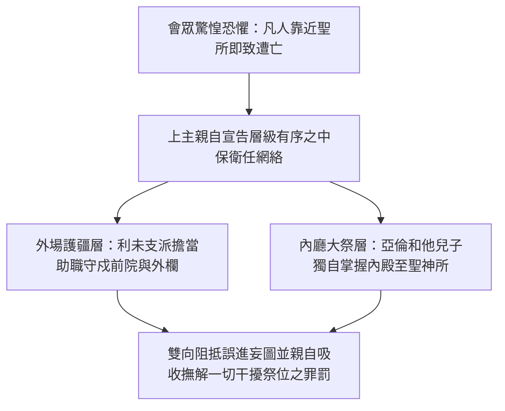
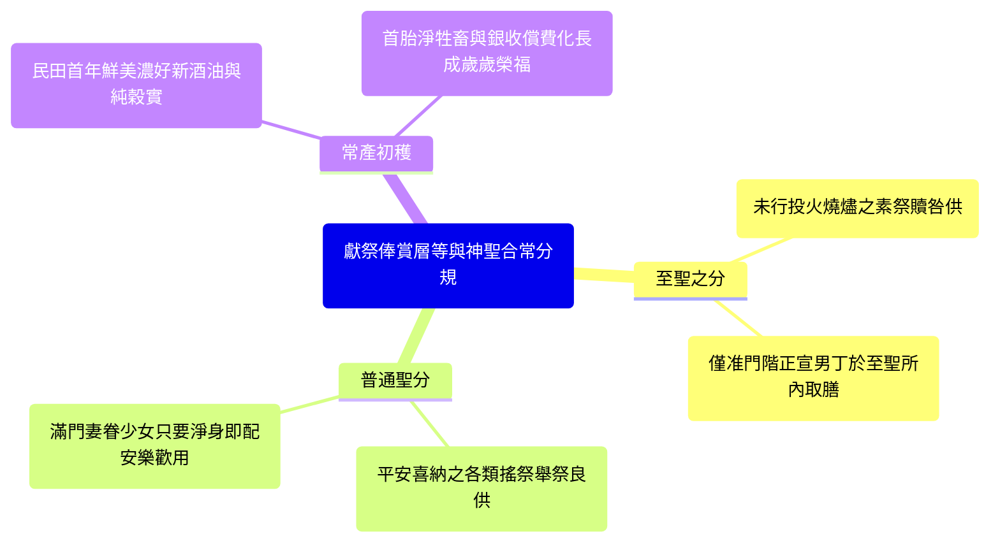
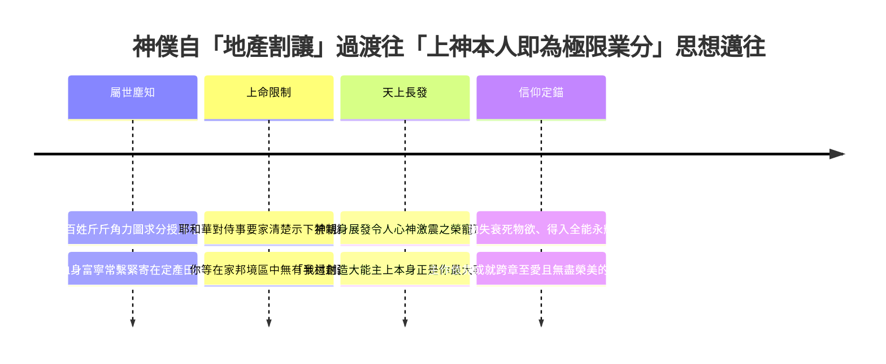
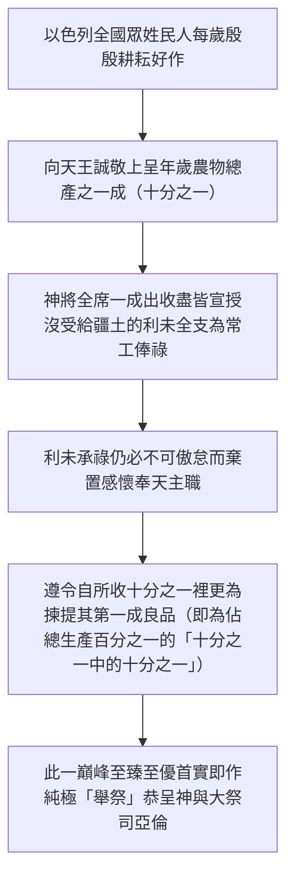

# 民數記 第18章

1. 耶和華對亞倫說：你和你的兒子，並你本族的人，要一同擔當干犯聖所的罪孽。你和你的兒子也要一同擔當干犯[[亞倫和他兒子（祭司）|祭司]]職任的罪孽。
2. 你要帶你弟兄[[利未支派|利未人]]，就是你祖宗支派的人前來，使他們與你聯合，服事你，只是你和你的兒子，要一同在法櫃的帳幕前供職。
3. 他們要守所吩咐你的，並守全帳幕，只是不可挨近聖所的器具和壇，免得他們和你們都死亡。
4. 他們要與你聯合，也要看守會幕，辦理帳幕一切的事，只是外人不可挨近你們。
5. 你們要看守聖所和壇，免得忿怒再臨到以色列人。
6. 我已將你們的弟兄[[利未支派|利未人]]從以色列人中揀選出來歸耶和華，是給你們為賞賜的，為要辦理會幕的事。
7. 你和你的兒子要為一切屬壇和幔子內的事一同守[[亞倫和他兒子（祭司）|祭司]]的職任。你們要這樣供職；我將祭司的職任給你們當作賞賜事奉我。凡挨近的外人必被治死。
8. 耶和華曉諭亞倫說：我已將歸我的[[舉祭（terumah）|舉祭]]，就是以色列人一切分別為聖的物，交給你經管；因你受過膏，把這些都賜給你和你的子孫，當作永得的分。
9. 以色列人歸給我[[至聖的供物（聖與至聖之分）|至聖的供物]]，就是一切的素祭、贖罪祭、贖愆祭，其中所有存留不經火的，都為至聖之物，要歸給你和你的子孫。
10. 你要拿這些當至聖物吃；凡男丁都可以吃。你當以此物為聖。
11. 以色列人所獻的[[舉祭（terumah）|舉祭]]並搖祭都是你的；我已賜給你和你的兒女，當作永得的分；凡在你家中的潔淨人都可以吃。
12. 凡油中、新酒中、五穀中至好的，就是以色列人所獻給耶和華初熟之物，我都賜給你。
13. 凡從他們地上所帶來給耶和華初熟之物也都要歸與你。你家中的潔淨人都可以吃。
14. 以色列中一切永獻的都必歸與你。
15. 他們所有奉給耶和華的，連人帶牲畜，凡頭生的，都要歸給你；只是人頭生的，總要贖出來；不潔淨牲畜頭生的，也要贖出來。
16. 其中在一月之外所當贖的，要照你所估定的價，按聖所的平，用銀子五舍客勒贖出來（一舍客勒是二十季拉）。
17. 只是頭生的牛，或是頭生的綿羊和山羊，必不可贖，都是聖的，要把他的血灑在壇上，把他的脂油焚燒，當作馨香的火祭獻給耶和華。
18. 他的肉必歸你，像被搖的胸、被舉的右腿歸你一樣。
19. 凡以色列人所獻給耶和華聖物中的[[舉祭（terumah）|舉祭]]，我都賜給你和你的兒女，當作永得的分。這是給你和你的後裔、在耶和華面前作為永遠的[[立約的鹽|鹽約]]（鹽即不廢壞的意思）。
20. 耶和華對亞倫說：你在以色列人的境內不可有產業，在他們中間也不可有分。我就是你的分，是你的產業。
21. 凡以色列中出產的[[十分之一]]，我已賜給利未的子孫為業；因他們所辦的是會幕的事，所以賜給他們為酬他們的勞。
22. 從今以後，以色列人不可挨近會幕，免得他們擔罪而死。
23. 惟獨[[利未支派|利未人]]要辦會幕的事，擔當罪孽；這要作你們世世代代永遠的定例。他們在以色列人中不可有產業；
24. 因為以色列人中出產的[[十分之一]]，就是獻給耶和華為[[舉祭（terumah）|舉祭]]的，我已賜給[[利未支派|利未人]]為業。所以我對他們說：在以色列人中不可有產業。
25. 耶和華吩咐摩西說：
26. 你曉諭[[利未支派|利未人]]說：你們從以色列人中所取的[[十分之一]]，就是我給你們為業的，要再從那十分之一中取十分之一作為[[舉祭（terumah）|舉祭]]獻給耶和華，
27. 這[[舉祭（terumah）|舉祭]]要算為你們場上的穀，又如滿酒醡的酒。
28. 這樣，你們從以色列人中所得的[[十分之一]]也要作[[舉祭（terumah）|舉祭]]獻給耶和華，從這十分之一中，將所獻給耶和華的舉祭歸給[[亞倫和他兒子（祭司）|祭司]]亞倫。
29. 奉給你們的一切禮物，要從其中將至好的，就是分別為聖的，獻給耶和華為[[舉祭（terumah）|舉祭]]。
30. 所以你要對[[利未支派|利未人]]說：你們從其中將至好的舉起，這就算為你們場上的糧，又如酒醡的酒。
31. 你們和你們家屬隨處可以吃；這原是你們的賞賜，是酬你們在會幕裡辦事的勞。
32. 你們從其中將至好的舉起，就不致因這物擔罪。你們不可褻瀆以色列人的聖物，免得死亡。

---

## 本章知識節點

### 神學
- [[擔當干犯聖所與祭司職任的罪孽]]
- [[祭司與利未人的職任為神之賞賜]]
- [[耶和華是事奉者的業與分]]
- [[利未人的什一奉獻]]
- [[永遠當祭司的職任]]

### 文化
- [[古代近東以什一奉獻為神職薪酬]]
- [[贖銀五舍客勒]]

### 主題
- [[立約的鹽]]
- [[至聖的供物（聖與至聖之分）]]

### 原文
- [[舉祭（terumah）]]
- [[十分之一]]

### 人物
- [[利未支派]]
- [[亞倫和他兒子（祭司）]]

---

## 本章整理

### 祭司與利未人擔當聖所與祭務之中保重任（v1-7）

民數記第18章承接了前兩章有關可拉反亂以及枯杖出果的嚴肅神聖印證，宣告了一次完備精深、旨在長治久安與化解群怨的祭務組織秩序綱要。隨著會民恐懼發出「我們沒死也定遭殺落矣，凡闖近耶和華之殿所必收喪難！」的震痛不安後，上帝藉由正面授令，具體將捍衛祭所、吸收誤觸災厄的中保使命，賦權派定給特定家族 —— 此為 [[擔當干犯聖所與祭司職任的罪孽]] 之核心教導（v1）。耶和華直接對亞倫說：「你和你的兒子，並你本族的人，要一同擔當干犯聖所的罪孽；你和你的兒子也要一同擔當干犯祭司職任的罪孽。」依《基督徒文摘解經系列》（CT）等釋述：「擔當過咎者，兼含挑攬平亂屏防以及為民引避怒譴二意；百姓不必自恐自慌因為神恩既指准正統臣公鎮戌第一關門，凡由盲混私近引燃之咒責便早由指定之護官抵擋洗卻。」

為了具體落實這一重疊保護網，主進一步確立 [[利未支派]] 與 [[亞倫和他兒子（祭司）]] 之間主從明確、不可越軌的職事區位（v2-5）。利未門流被召引作亞倫麾下合作並扶工之護營生力，「只是他們不可挨近聖所的器具和壇，免得他們和你們一同死亡」（v3）；內帷心堂的點燃及獻香供儀則惟令合法之繼承祭臣把掌。此制度架構絕非常俗的統治分配或階位相鬥，因為天主親以崇美之語彙為此二職定調 —— 這便是 [[祭司與利未人的職任為神之賞賜]]，同時宣告了 [[永遠當祭司的職任]] 根源於至愛的天授（v6-7）。「我從以色列人中將你們的弟兄利未人分別出來，送給你們，為耶和華的賞賜...我將祭司的職任給你們當作賞賜事奉我。」《拾穗》（GT）引介丁良才等各釋論：「受任挑扛重大凶難和戍更危任，人易以為苦；但在此上帝正呼知眾心 —— 能以肉血擔奉保贖千萬人之聖安，絕不取決於群情力爭，本屬真大王座上流賜贈來的一等大榮與恩寵！」

| 事奉人員組織劃分 | 事務空間與主要責任範疇 | 在禮儀中保機制中的核心功能 |
| :--- | :--- | :--- |
| **利未支派** | 會幕外部與整體周遭帳棚之各樣運作與守戍，不可觸及內聖香具。 | 在廣群與神聖高光前駐起阻衝紅牆，攔阻並吸收不合格野力私犯。 |
| **亞倫與祭司團** | 內殿、櫃邊及直面上蒼青銅燔壇與熱煙香盞的所有獻奉主掌。 | 代表全民把潔獻高獻往上父殿面，使公義慈恤無礙庇攜眾民。 |

> [!quote] 經典默想引句
> - **承當為恩慈**：「人常眼光著重掌位顯揚而未辨災患；唯心甘意願為全族承受神所前衛戌死患中保重擔之人，才見收受真賞之特權！」(CT)
> - **賞賜之要意**：「不是用兵爭贏來的勳位，乃是真皇自發賞發下去叫人低頭樂守不移的靈格家風。」(KingComments)

### 祭司俸祿之來源、種類及立約之永恆基礎（v8-19）

當上帝以身家性命定立了祭司為全族抵禦天難之護衛職缺後，祂隨即頒下公允有容之報償綱要：令所有奉祀勞者於侍神中皆有充足體力安好存安，此即確立了全書中針對獻上之物食用權力與等級化之大章規範 —— 深化解剖了 [[至聖的供物（聖與至聖之分）]] 暨 [[舉祭（terumah）]] 豐富落實之道（v8-14）。上帝明定，凡是以色列人獻於前廷之各樣未經烈火全燒灰化之祭件，即各等素祭、贖罪祭、贖愆祭等的長剩珍餅肉塊，全然歸屬於「至聖的物」，「要在至聖之處吃，凡男丁都可以吃，這為你算為聖」（v9-10）；而眾百姓牽領自願樂喜的搖香正肉與甘樂喜奉等屬一般「聖物」的新鮮舉祭，則以更為開懷和親族和樂之視野賜授亞倫滿戶，「你家中潔淨的人都可以吃」（v11）。

除一般日常祭牲之盈餘，民之首年新喜農穫與人獸初出亦是上帝所垂顧為祭民長存安食的重要薪資，由此便落實了雙項具有歷史文化與信仰教育核心的大制度 —— 即規範了 [[贖銀五舍客勒]] 之普世化，同時將上述一連串浩長薪賞以絕對堅牢、抗損莫易的約分印立為 [[立約的鹽]]（v15-19）。針對牛仔肥綿等聖定清牲之首胎，「不可贖，是聖的...要把血灑在壇上；肉要歸你」（v17-18）；然人子之長生或是無法作為獻用不潔幼獸，神便勒諭需統由贖奉買放：「一月之外，要照你所估定的，按聖所的平，用銀子五舍客勒贖出來（一舍客勒是二十季拉）」（v16）。《基督徒文摘解經系列》（CT）等解說此手續之定立，不但貫串了民數記第三章間為平湊長男名單開筆收取多剩子民費用的歷史先驅，更是以此確立起讓天職役使可歲歲獲賴常收的安平之規。且隨極，神用了一筆崇高且堅若山嶽的新語為整章津資加簽發照：「這是在耶和華面前作為永遠的鹽約」（v19）。

| 神聖禮物收納結構 | 給出與交卸者性質 | 享吃或折得人眾權限 | 內涵的神聖倫理與象徵 |
| :--- | :--- | :--- | :--- |
| **至聖之物（火餘贖咎祭等）** | 由犯罪求恕及獻誠禮火所遺留下的頂級聖餘。 | 僅可供世系正式之大祭家系男童及男丁於內院取食。 | 顯示最高禮祭忌邪嚴厲度，護衛中保獻贖重工成效不污。 |
| **一般聖品與初熟甘穀** | 來自田園之首出嘉純香油好酒以及甘悅謝恩大獻件。 | 容許合室凡無身陷髒鄙或失禮未淨之全員悉數享享。 | 開演信仰眷顧家業常福的美德與上帝對奉忠臣家的一貫善護。 |

> [!important] 鹽約永存神學省思
> - **長安莫悔的立信**：鹽之氣性能拒散防腐、永不毀衰變味；正如上帝許下予亞倫職務與安生活給的浩大契約，經歷世態風雲自堅常不退縮。
> - **受職忠實之呼籲**：常人食鹽如領守盟，天差享取鹽誓好禮即當對高主盡奉恭勤不怠、對百庶殷殷申守和平！

### 神為其僕人唯一永享無界產業與至上歸屬（v20）

在接連鋪設好此般豐郁廣達、鉅大久永的俸給規例後，上帝引著祭老進入了全舊約神學中最被眾神靈信士激歡傳頌、極大打破屬世占有貪念的至真至純高峰 —— 此正是對章節內涵與基督靈訓皆有重磅價值的哲學心要：[[耶和華是事奉者的業與分]]（v20；並於v24向利未再加申令）。「耶和華對亞倫說：你在以色列人的境內不可有產業，在他們中間也不可有分。我就是你的分，是你的產業。」當諸多以色列常人支隊心心盼冀、於廣大迦南流乳美土中急待占算自有一處丘壤長野以做世代根本時，真帝早出旨宣，把肩事幕堂的官僕自此等疆業瓜分奔走退離一空！

KingComments 於其深讀中特遣大墨謳揚斯筆妙章：「神看似叫此般專務使役沒得著片寸世土；但真實相告是神親格自發奉立於他們身傍作萬古安好之本！凡是倚仗田苗私藏者早必枯涸折休；若為父君所愛呼進榮宮奉獻全軀、棄置對塵世疆域的競爭，即可親手於靈理底間長攜擁坐浩妙天地中真原之真皇，作永流萬古毫無困竭之第一大產業！」（KC；參林後六10）。此亦向千禧來葉開朗宣告：上帝為我心與一生無愧之最巨產收。

### 利未氏系奉獻工餉制度、近東比較及二階奉納（v21-32）

為了照應全沒有得到土壤割田的廣大家族群流安住，神旨依其超遠智慧，將全邦歲收的奉祀動態引入保障與支持的宏深規程中，這既揭啟了長流後世不忘之主稅體制 —— [[十分之一]]（v21-24），又為全古籍在民族倫常史上豎設下超越世界帝制的大成新典 —— [[古代近東以什一奉獻為神職薪酬|「古代近東社會制度下將一成出收盡回歸於侍候人力之特殊神權人本建置」]]。主言云：「凡以色列中出產的十分之一，我已賜給利未的子孫為業，因他們所辦會幕的事，就以此為賞賜...在以色列人中不可有產業」（v21,24）。《舊約聖經背景註釋》和各權威文獻考古互對證示：「古西亞（美索不達米亞至西台及東方埃及群土）之皇主多皆喜課黎庶得實十分之一款（甚至逾多），但往往搜充入皇殿私宮營衛享耗及出軍暴餉間；獨是上帝叫全以色列進奉之這份敬天之禮，分文不過存於自私君堂，直降交回長久勞為戍守不讓無謂庶民受死之無業親伴（利未宗家），成功化生一組屬天奉獻結合人際仁護相榮的大和平共同圈！」

然則在這環繞交接有情的恩道法制最終了的一席，主恩發露一條嚴謹無情義漏、宣證萬生皆應於領德後向神存厚愛致歌的心訓誓法 —— 此便建成了 [[利未人的什一奉獻|「利未從進祿內再度拔出最好一成轉充祭主舉貢的次席十一美制」]]（v25-32）。神令述道：「你們從以色列人所取的十分之一...要從其中將十分之一為舉祭獻給耶和華...把第一等至美之果呈於前奉歸給亞倫」（v26,28）。這意味著手接重酬的侍從部伍不准存念仗役逃過申獻謝儀，務須在悉數收入內（全場群穀之 1/10）再次檢定獻行 1/10 歸與長司之安廚（占原邦全糧之百分之一，1%）。《拾穗》（GT）嚴警言銘：「唯當為役官領收後願意依持恭謙敬神心甘樂奉還最好的，彼全戶妻兒散居家宴方堪於無苦安寧下安心享餐所留百珍；否則傲持受命私留一毫不用至榮尊表回謝，必陷觸犯罪殃之悲沉境遇間！」

| 兩階什一轉納進展 | 進獻義務擔承人眾 | 奉呈收得者與權重意義 | 在天神大帳運行大格局中貢深價值 |
| :--- | :--- | :--- | :--- |
| **首階神役產業十一** | 全境耕田獲粟之諸以色列會黎群落。 | 沒有私地無寸山野、日旰護候前大帷園的全班利未侍衛眾群。 | 保固了弱者受供與信仰侍工安定有歲，打造免世態不公及相惜同活的大公神權社風。 |
| **次階至優千選奉謝** | 早已手得全區一成厚歲糧財的利未長子等宗戶。 | 大司天職首官亞倫和手擔至祭內禮供獻重度勞命之正祭士家室。 | 打破受神俸即省除感激謝王之謬，確立天下受神命奉工首僕通皆當以最善喜奉主的心誓箴！ |

### 靈訓總結與舊約新約救濟美恩傳繫（v1-32）

縱觀民數記第18章此等結構齊全、條次精緻明透的章典，即可深刻省識西奈曠野在行朝危苦打擊過後，上帝如何以無限的溫柔睿知和公誠天賦修起守安救急的神經大殿防。在內院中，上帝遣立祭臣擔當中保避止災雷，讓迷震世手皆曉知神聖勿用野力挑打，乃倚仗上主賞定和平庇蓋。於日長安居和食薪規矩內，以全安善意不息之「鹽約」許給長使合適度日安康；又叫去爭強取野的血望，立銘「耶和華即為最大業分」的高情豐寶。乃至以兩重什一及首好舉禮串連了全民親誼、護眾扶使。這一切不單維持了往世希伯來人在曠世道途行旅中無缺太平，且其深意更在千秋歲月流轉後於新約長卷亮透無量春榮 —— 表徵真基督神君化成了中保擔當了人際切實侵反之巨咎，使歸正臣民咸享上帝無盡產富為最美家地！

**參考資料**
https://www.ccbiblestudy.org/Old%20Testament/04Num/04CT18.htm
https://www.ccbiblestudy.org/Old%20Testament/04Num/04GT18.htm
https://www.kingcomments.com/en/bible-studies/Num/18
https://biblehub.com/study/numbers/18.htm
