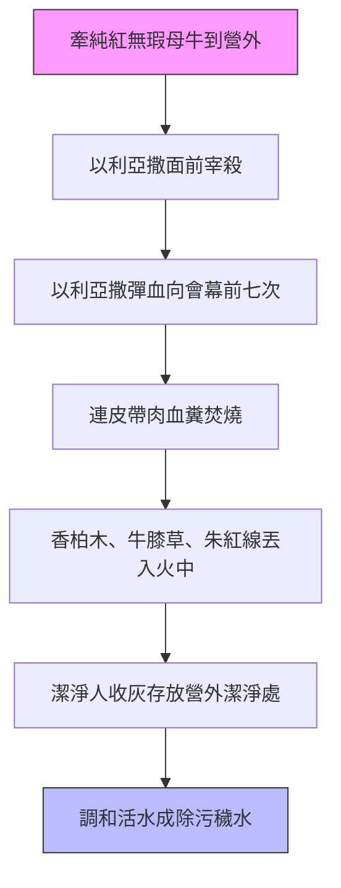

# 民數記 第19章

1. 耶和華曉諭[[摩西]]、[[亞倫]]說：
2. 耶和華命定[[耶和華曉諭摩西亞倫紅母牛條例|律法中的一條律例]]乃是這樣說：你要吩咐以色列人，把一隻沒有殘疾、未曾負軛、[[耶和華曉諭摩西亞倫紅母牛條例|純紅的母牛]]牽到你這裡來，
3. [[以利亞撒牽母牛到營外宰殺|交給祭司以利亞撒]]；他必牽到[[營外]]，人就把牛[[以利亞撒牽母牛到營外宰殺|宰在他面前]]。
4. [[以利亞撒|祭司以利亞撒]]要用指頭蘸這牛的血，[[以利亞撒彈血向會幕前七次|向會幕前面彈七次]]。
5. 人要在他眼前把這[[紅母牛連皮帶肉血糞焚燒|母牛焚燒]]；牛的皮、肉、血、糞都要焚燒。
6. 祭司要把香柏木、牛膝草、[[香柏木牛膝草朱紅線丟入火中|朱紅色線]]都丟在燒牛的火中。
7. 祭司必[[灑水人洗衣服不潔淨到晚上|不潔淨到晚上]]，要[[收牛灰人不潔淨到晚上|洗衣服]]，用水洗身，然後可以進營。
8. 燒牛的人必[[灑水人洗衣服不潔淨到晚上|不潔淨到晚上]]，也要[[收牛灰人不潔淨到晚上|洗衣服]]，用水洗身。
9. 必有一個潔淨的人收起母牛的灰，存在[[營外]]潔淨的地方，為以色列會眾調做除污穢的水。這本是除罪的。
10. 收起母牛灰的人必[[灑水人洗衣服不潔淨到晚上|不潔淨到晚上]]，要[[收牛灰人不潔淨到晚上|洗衣服]]。這要給以色列人和寄居在他們中間的外人作為永遠的定例。
11. 摸了人死屍的，就必[[死屍不潔淨預表罪的死權勢|七天不潔淨]]。
12. 那人到第三天要用這除污穢的水潔淨自己，第七天就潔淨了。他若在第三天不潔淨自己，第七天就不潔淨了。
13. 凡摸了人死屍、不潔淨自己的，就玷污了耶和華的帳幕，這人必從以色列中剪除；因為那除污穢的水沒有灑在他身上，他就為不潔淨，污穢還在他身上。
14. 人死在帳棚裡的條例乃是這樣：凡進那帳棚的，和一切在帳棚裡的，都必[[死屍不潔淨預表罪的死權勢|七天不潔淨]]。
15. 凡敞口的器皿，就是沒有紮上蓋的，也是不潔淨。
16. 無論何人在田野裡摸了被刀殺的，或是屍首，或是人的骨頭，或是墳墓，就要[[死屍不潔淨預表罪的死權勢|七天不潔淨]]。
17. 要為這不潔淨的人拿些燒成的除罪灰放在器皿裡，倒上活水。
18. 必當有一個潔淨的人拿牛膝草蘸在這水中，把水灑在帳棚上，和一切器皿並帳棚內的眾人身上，又灑在摸了骨頭，或摸了被殺的，或摸了自死的，或摸了墳墓的那人身上。
19. 第三天和第七天，潔淨的人要灑水在不潔淨的人身上，第七天就使他成為潔淨。那人要[[收牛灰人不潔淨到晚上|洗衣服]]，用水洗澡，到晚上就潔淨了。
20. 但那污穢而不潔淨自己的，要將他從會中剪除，因為他玷污了耶和華的聖所。除污穢的水沒有灑在他身上，他是不潔淨的。
21. 這要給你們作為永遠的定例。並且那灑除污穢水的人要[[收牛灰人不潔淨到晚上|洗衣服]]。凡摸除污穢水的，必[[灑水人洗衣服不潔淨到晚上|不潔淨到晚上]]。
22. 不潔淨人所摸的一切物就不潔淨；摸了這物的人必[[灑水人洗衣服不潔淨到晚上|不潔淨到晚上]]。

<!-- fhl-map-links:start -->
## 相關地圖

- [[appendix/fhl_maps/maps/021|〈民圖二〉探查應許地和應許地的範圍]]
<!-- fhl-map-links:end -->

---

## 本章知識節點

### 神學
- [[紅母牛預表基督完全贖罪]]
- [[除污穢水預表聖靈潔淨能力]]
- [[死屍不潔淨預表罪的死權勢]]
- [[第三天第七天灑水預表完全潔淨]]
- [[拒絕潔淨被剪除預表拒絕恩典滅亡]]
- [[不潔淨傳遞性預表罪的感染力]]
- [[紅母牛預表基督城外受苦（來13：11-12）]]
- [[牛灰活水預表聖靈潔淨（約7：38-39）]]
- [[牛膝草灑水預表信心應用寶血（來9：19-22）]]
- [[第三天第七天預表復活與完全（林前15：4；來10：10）]]
- [[不潔淨被剪除預表拒絕恩典滅亡（來10：26-29）]]

### 儀式
- [[耶和華曉諭摩西亞倫紅母牛條例]]
- [[以利亞撒牽母牛到營外宰殺]]
- [[以利亞撒彈血向會幕前七次]]
- [[紅母牛連皮帶肉血糞焚燒]]
- [[香柏木牛膝草朱紅線丟入火中]]
- [[祭司燒牛人不潔淨到晚上]]
- [[潔淨人收牛灰存放營外潔淨處]]
- [[收牛灰人不潔淨到晚上]]
- [[用牛灰活水調製除污穢水]]
- [[摸死屍不潔淨七天]]
- [[帳幕內死人不潔淨七天]]
- [[摸野外死屍骨頭墳墓不潔淨]]
- [[不潔淨人不灑水被剪除]]
- [[灑水人洗衣服不潔淨到晚上]]
- [[不潔淨人所摸之物不潔淨]]

### 關鍵術語
- [[紅母牛（parah adumah）]]
- [[除污穢水（mei niddah）]]

### 待釐清
- [[紅母牛是否為獨特贖罪祭]]
- [[以利亞撒而非亞倫執行是否為大祭司預備]]

---

## 本章整理

### 紅母牛條例：灰燼預備與潔淨儀式（v1-22）

本章記載耶和華向[[摩西]]、[[亞倫]]頒布的「律法中的一條律例」——[[耶和華曉諭摩西亞倫紅母牛條例|紅母牛條例]]。這是一項獨特的==除污穢儀式==，核心在於透過[[紅母牛（parah adumah）|紅母牛]]的焚燒產生灰燼，調和[[除污穢水（mei niddah）|活水]]，以潔淨因接觸屍體而不潔淨的人。全章分為三大階段：灰燼製備（v1-10）、不潔淨來源界定（v11-16）、潔淨程序執行（v17-22）。

#### 一、 紅母牛灰燼的製備（v1-10）

上帝指定[[以利亞撒]]而非大祭司亞倫執行此禮（[[以利亞撒而非亞倫執行是否為大祭司預備|或預表大祭司職分的轉移與預備]]）。儀式在[[營外]]進行，強調與營中聖所的空間隔離，預表基督[[紅母牛預表基督城外受苦（來13：11-12）|在城門外受苦]]。

過程中有三組人員因接觸儀式而成為「不潔淨到晚上」：祭司以利亞撒（v7）、燒牛的人（v8）、收灰的人（v10）。這顯示[[紅母牛是否為獨特贖罪祭|此祭雖屬贖罪性質（v9「這本是除罪的」），卻使執行者暫時不潔淨]]，與一般獻祭祭司因聖職成聖形成反差，凸顯其「為他人成聖、自己卻暫時不潔」的代贖特質。

#### 二、 屍體不潔淨的傳染性與界定（v11-16）

經文詳細列舉三類主要不潔淨來源，皆導致「七天不潔淨」：
1. **接觸人屍**（v11, 13）：[[摸死屍不潔淨七天|核心案例]]。
2. **帳棚內死亡**（v14-15）：[[帳幕內死人不潔淨七天|空間傳染]]，連敞口器皿（[[不潔淨人所摸之物不潔淨|無蓋器皿]]）亦不潔淨。
3. **野外接觸**（v16）：[[摸野外死屍骨頭墳墓不潔淨|被殺者、骸骨、墳墓]]。

這些條文揭示[[死屍不潔淨預表罪的死權勢|死亡（罪的工價）具有強烈的傳染性與污染力]]（[[不潔淨傳遞性預表罪的感染力|v22「不潔淨人所摸的一切物就不潔淨」]]），不經神所定潔淨程序，無法自行脫離。

#### 三、 除污穢水的灑潔程序（v17-22）

潔淨儀式採「第三天、第七天」雙重灑潔（v12, 19），由[[潔淨人收牛灰存放營外潔淨處|潔淨人]]用[[牛膝草]]蘸取[[用牛灰活水調製除污穢水|灰燼活水]]，灑在帳棚、器皿、人身上（v18）。[[牛膝草灑水預表信心應用寶血（來9：19-22）|牛膝草象徵信心的應用]]，[[牛灰活水預表聖靈潔淨（約7：38-39）|灰燼活水預表基督完成救贖後聖靈的潔淨大能]]。

> [!important] **關鍵警告：拒絕潔淨的後果**
> 第13、20節重複強調：不潔淨人若不在第三天、第七天接受灑潔，就「玷污耶和華的帳幕/聖所」，必「從以色列中剪除」。這預表[[拒絕潔淨被剪除預表拒絕恩典滅亡|拒絕神唯一提供的潔淨道路（基督寶血/聖靈工作）者，必面臨永恆的斷絕]]（[[不潔淨被剪除預表拒絕恩典滅亡（來10：26-29）|來10:26-29]]）。

第七天灑潔後，受潔淨者仍須洗衣、沐浴，到晚上才算完全潔淨（v19）。灑水者亦須洗衣，接觸除污穢水者不潔淨到晚上（v21），顯示潔淨儀式本身帶有「分別為聖」的嚴肅性，不可輕忽。

#### 四、 跨章神學脈絡與新約預表整理

| 紅母牛儀式要素 | 經文依據 | 新約預表應驗 | 神學意義 |
| :--- | :--- | :--- | :--- |
| **純紅無瑕母牛** | v2 | 基督無瑕疵、無玷污（彼前1:19） | 完美的祭物資格 |
| **營外宰殺焚燒** | v3, 5 | 基督在城門外受苦（來13:11-12） | 替罪羔羊被棄絕、担當咒詛 |
| **彈血七次向會幕** | v4 | 基督寶血一次永遠成就贖罪（來9:12） | 贖罪工作完全、神面前蒙悅納 |
| **香柏木、牛膝草、朱紅線** | v6 | 最高貴與最卑微（香柏/牛膝草）、血的代價（朱紅） | 基督榮耀謙卑並存，寶血功效普及 |
| **灰燼存留、調水灑潔** | v9, 17 | 聖靈常存、隨時潔淨（約7:38-39；來9:13-14） | 救贖成果歷久彌新，聖靈持續應用 |
| **第三天、第七天灑潔** | v12, 19 | 基督第三天復活、完全拯救（林前15:4；來10:10） | [[第三天第七天預表復活與完全（林前15：4；來10：10）|復生大能帶來徹底潔淨]] |

本章作為《民數記》後段（第19-20章）的轉折，為即將進入迦南的新一代以色列人，建立處理「死亡污穢」的永久機制（v10, 21「永遠的定例」）。它不僅是衛生條例，更是神學宣示：**生命的神不容死亡的污穢玷污祂的同在；惟有神主動提供的「死而復活」大能（灰燼/復活），能打破死亡的權勢，使不潔淨者重返會眾、親近聖潔的神。**

**參考資料**
https://www.ccbiblestudy.org/Old%20Testament/04Num/04CT19.htm
https://www.ccbiblestudy.org/Old%20Testament/04Num/04GT19.htm
https://www.kingcomments.com/en/bible-studies/Num/19
https://biblehub.com/study/numbers/19.htm
