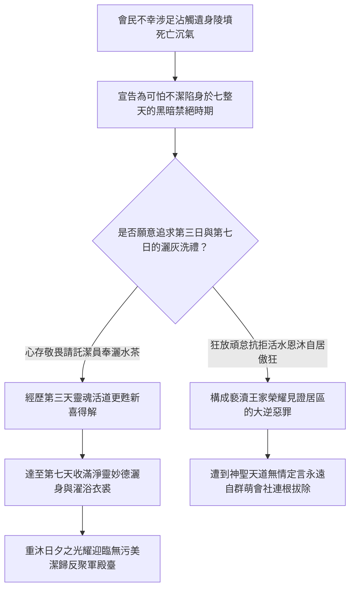

# 民數記 第19章

1. 耶和華曉諭摩西、亞倫說：
2. 耶和華命定律法中的一條律例乃是這樣說：你要吩咐以色列人，把一隻沒有殘疾、未曾負軛、純紅的母牛牽到你這裡來，
3. 交給祭司以利亞撒；他必牽到營外，人就把牛宰在他面前。
4. 祭司以利亞撒要用指頭蘸這牛的血，向會幕前面彈七次。
5. 人要在他眼前把這母牛焚燒；牛的皮、肉、血、糞都要焚燒。
6. 祭司要把香柏木、牛膝草、朱紅色線都丟在燒牛的火中。
7. 祭司必不潔淨到晚上，要洗衣服，用水洗身，然後可以進營。
8. 燒牛的人必不潔淨到晚上，也要洗衣服，用水洗身。
9. 必有一個潔淨的人收起母牛的灰，存在營外潔淨的地方，為以色列會眾調做除污穢的水。這本是除罪的。
10. 收起母牛灰的人必不潔淨到晚上，要洗衣服。這要給以色列人和寄居在他們中間的外人作為永遠的定例。
11. 摸了人死屍的，就必七天不潔淨。
12. 那人到第三天要用這除污穢的水潔淨自己，第七天就潔淨了。他若在第三天不潔淨自己，第七天就不潔淨了。
13. 凡摸了人死屍、不潔淨自己的，就玷污了耶和華的帳幕，這人必從以色列中剪除；因為那除污穢的水沒有灑在他身上，他就為不潔淨，污穢還在他身上。
14. 人死在帳棚裡的條例乃是這樣：凡進那帳棚的，和一切在帳棚裡的，都必七天不潔淨。
15. 凡敞口的器皿，就是沒有紮上蓋的，也是不潔淨。
16. 無論何人在田野裡摸了被刀殺的，或是屍首，或是人的骨頭，或是墳墓，就要七天不潔淨。
17. 要為這不潔淨的人拿些燒成的除罪灰放在器皿裡，倒上活水。
18. 必當有一個潔淨的人拿牛膝草蘸在這水中，把水灑在帳棚上，和一切器皿並帳棚內的眾人身上，又灑在摸了骨頭，或摸了被殺的，或摸了自死的，或摸了墳墓的那人身上。
19. 第三天和第七天，潔淨的人要灑水在不潔淨的人身上，第七天就使他成為潔淨。那人要洗衣服，用水洗澡，到晚上就潔淨了。
20. 但那污穢而不潔淨自己的，要將他從會中剪除，因為他玷污了耶和華的聖所。除污穢的水沒有灑在他身上，他是不潔淨的。
21. 這要給你們作為永遠的定例。並且那灑除污穢水的人要洗衣服。凡摸除污穢水的，必不潔淨到晚上。
22. 不潔淨人所摸的一切物就不潔淨；摸了這物的人必不潔淨到晚上。

---

## 本章知識節點

### 神學
- [[純紅沒有殘疾且未曾負軛母牛為除罪救贖表徵]]
- [[調製除污穢之活水為以色列無期限永遠贖愆法規]]
- [[玷污造主帳棚怠隳潔淨典例者得自大聚會剪除]]

### 文化
- [[宰殺燒牛的血彈會幕前方七次作贖罪見證]]
- [[將香柏木與牛膝草及朱紅線同入純紅牛薪火中]]
- [[誤碰屍毒致七日不潔與第三及第七天除穢程序]]

---

## 本章整理

### 宰殺純紅母牛與焚燒製做除罪灰之神聖禮典（v1-10）

在經理完可拉與大坍等嚴重叛黨引起的狂怒與可怕的贖罪瘟疫後，以色列全會眾心底充滿極度震恐，哀嘆凡是冒昧趨近耶和華見證之所者必然面臨立刻滅亡與暴死，無端淪入靈異不潔與驚動天威的沉痛危局。面對斯種哀恐與脆弱，良善慈恩的大能神王不獨展現凜然威儀，更加開闢出深密、悠長且長春無損的潔淨大道。主耶穌基督的純美受差就隱含於這一則前所未聞、深沐恩理的律例之中。經上指明，上帝明確授權摩西在居頂監督之席，同時責成亞倫及繼任子系確切厲行這至高潔心大願，命定天下萬姓貢奉極偉大的奇寶：一頭完完全全毫無殘疾、一點不沾瑕累疵斑，亦決不動借凡間塵劫軛絆牽絆其頸的雌純紅土之寵。這一頭神選真靈不僅止是血肉一軀，實乃承荷天下極其龐巨之救贖法脈。信義會眾必須將她牽送於神殿門前，成為千百年滌患赦罪長流之端開始。此乃經中所揭明[[純紅沒有殘疾且未曾負軛母牛為除罪救贖表徵]]之絕高深理，直將將來各樣玷染預先平毀於無形神前。

當純紅母牛被牽到亞倫與新系主持之前，至為考究的乃是：全個行刑與獻呈過程決意屏離人聲嘈雜的堂堂正盤，非是在會堂正幕室壇上安享平和靜禮，反而由大君首子親自拉赴冷寂幽微的城壘境外去受重刃宰殛。此處彰現的是，任何為罪求替與受辱替擔者，必先踏向孤絕世外苦路去承受父神暫隱喜容的哀痛沉默。繼位主僕引往草場將牛擊終當時，必須舉腕伸出一支神潔玉指，深深蘸取其軀溫騰沸盈的好珍鮮血，迎立遙往聖所神坐所望的核心大方，揮腕激飛長撒一連七遍無比紅雨，這正是歷史至重之[[宰殺燒牛的血彈會幕前方七次作贖罪見證|七遍鮮血揮灑彈朝真殿見證]]，明表天人間原本被無比死塵撕離的心房，藉由這毫不減少、完足無缺的聖大奇工重新締約彌補。緊接其後，群僕即要在火炎深爐之內把紅母牛血肉骨糞全體焚毀；更要在煙焰狂竄鼎時，將名滿天地無二至偉的高嶺長青名主香柏木、貼立危縫巖隙生息且謙遜細弱至絕的小草牛膝、再加上深標常年人性血斑千罪莫除重咎沉染的赤焰好紅縷一次全數拋置柴火之核，即是震撼後聖之[[將香柏木與牛膝草及朱紅線同入純紅牛薪火中|投擲木草赤線同葬焚灰盛典]]。終夕這滾滾狂灰由持淨者廣收安鎮荒郊專區，化作隨取常流良友活溪伴和於尊器裡的救贖聖藥，成就萬家得免沉黑、歡欣立國之[[調製除污穢之活水為以色列無期限永遠贖愆法規|永遠生命純沐活水法例]]。

> [!quote] 黃迦勒《中文聖經註釋》
> 「紅母牛的被燒，不是為著應付我所知道的已往的罪，乃是為著預備我將來所要有的一切的污穢。灰在聖經裏，就是最末後的東西，是最靠得住、永遠不更改不朽壞的功效。」

> [!quote] 丁良才《釋經與背景註釋》
> 「母牛殺在營外，表明背負著罪的人，都不在神的紀念裡；把代表好壞階級的香柏木、牛膝草及表罪的朱紅線同投入火中，表明一切屬世的榮貴卑劣，一但沾染死罪，全定在公義薪焰中徹底除盡。」

### 摸觸人類死屍與田野沾喪之潔淨儀節與靈界法規（v11-19）

在旷野长年的困苦與轉進歲月裡，以色列邦族天天行步於兵燹悲苦與親朋生死更替之間，死亡絕非罕遇之幻夢，實係隨足易蹈、沉黑至甚之至慘現實。主意既明，一國一社既稱聖皇特選靈域，則神光燦盈的大聚會堂理該是生機盎然、常春無阻的淨好桃源，豈能忍容枯骨喪霧在行伍營幕室間漫漶棲存？故天主赫怒敲出萬世自醒法鏡：不問你是君家將領或者微末草工，也不管你是身駐靜帷內哀視病戚長逝，還是孤步林郊良陌妄涉古魂斷首、或者誤踏遺木寒丘與森慘殘陵，一旦手肩膚沾這令人毛骨竦然的終局死骸，律例立刻定罪其身陷進徹底絕路之七日慘晦期！不但是鮮活命魂染災，連所住幕帳屋裡未曾用牢索緊嚴繫蓋的所有常皿碗甕，盡數坐歸同遭幽臭籠浸的廢潔不祥，這是嚴厲如鐵之[[誤碰屍毒致七日不潔與第三及第七天除穢程序|觸屍沉染七宵與雙節甘洗法規]]，逼使信士長垂敬戒。

然神律懲戒絕不是要放任迷奴終夜啼哭沈沒於滅亡深海，在嚴定「七日」長絕悲塵之後，全知君主奇美鋪墊了翻死至活的至樂曙天。沾凶人等切不能驕頑傲踞於舊衾孤泣，必須祈倚清潔弟兄仗掌春長不息好吸泉膏的靈動芳草，吸含野外永穩留蓄之除罪平痛名灰與活流好露混合成漿，抓穩決定榮耀翻身的第三大旦與象徵終滿功遂的第七名夕，於斯其人及眷屬、整區居幛併杯盤千品身上豪撒除邪聖淚！唯獨經歷第三夕如旭耀眼的靈力甦動大甦與第七霄無保留潔身的衣濯溫泉洗盡，黑霾死咒方向夕沉寂散消。

| 觸死不潔之情況類別 | 律例定性與污染程度 | 得釋除穢所需儀典手續（見 [[誤碰屍毒致七日不潔與第三及第七天除穢程序]]） |
| :--- | :--- | :--- |
| **觸撫野間人類大死骸** | 不潔九死延期滿七夕 | 仰待潔者於第三天及第七天抓取草泉二灑身軀，並於終夕洗衣洗澡 |
| **走入或安坐人家往生居幕** | 凡踏屋者長墜七宵黑沉 | 屋幕牆帷以及群眾皆需享受牛膝靈水漫遍揚彈除邪 |
| **未綁封帶的敞開盆卮卣盞** | 無蓋防禦遭死雲直染宣告壞絕 | 若欲復活重役必蒙潔者持淨灰活流普佈灌刷 |
| **原途遇見受兵殛者骨碎荒陵** | 即席遭定七整天隔難不祥 | 須倚賴第三日靈恩復活水灑淨身，終期濯自乾清歸會 |

```mermaid
flowchart TD
  A["會民不幸涉足沾觸遺身陵墳死亡沉氣"] --> B["宣告為可怕不潔陷身於七整天的黑暗禁絕時期"]
  B --> C{"是否願意追求第三日與第七日的灑灰洗禮？"}
  C -->|"心存敬畏請託潔員奉灑水茶"| D["經歷第三天靈魂活道更甦新喜得解"]
  D --> E["達至第七天收滿淨靈妙德灑身與濯浴衣裘"]
  E --> F["重沐日夕之光耀迎臨無污美潔歸反聚軍殿臺"]
  C -->|"狂放頑怠抗拒活水恩沐自居傲狂"| G["構成褻瀆王家榮耀見證居區的大逆惡罪"]
  G --> H["遭到神聖天道無情定言永遠自群萌會社連根拔除"]
```

### 褻瀆耶和華帳幕之重禍、怠隳定例者剪除罰則是為永聖警告（v20-22）

當全部得勝、死厄盡平與永世清甘安靜的新天美好圖卷繪築於經文深殿當時，主宰之雷嗔語調再次振響千山空宇，重加一道莫違鐵幕封底。此際聚焦要義不在揭表人生原路如何孤艱困頓容易失足觸穢，而是極度針對一群早已遍歷恩澤拯救卻蓄意驕盈無悔、任由幽邪臭氣常駐神前榮宮的頑傲小醜。「但那污穢而不潔淨自己的，要將他從會中剪除，因為他玷污了耶和華的聖所。除污穢的水沒有灑在他身上，他是不潔淨的。」這是直抵天命極度威赫嚴酷之[[玷污造主帳棚怠隳潔淨典例者得自大聚會剪除|冒瀆上帝純安至堂遭誓言驅絕處斷]]。凡此頑犯不僅禍延私戶，更是化為黑刃刀芒直接切割真君大堂妙地；造作乾坤萬世之天父絕不上顧情面容你藏污納垢，碰者未釋必招致從會眾聖名國籍內永離斬殛，再也無涉喜光安宅的一滴蜜泉！更有極深至微之傳染法則重重申誡：凡斯種沒蒙水浴平安之污奴所踏握每一件良材妙寶即時陷黑，甚而引動凡扶捏是污寶之友連同沈痛至晚無解；唯願列徒戰兢以永清良言自持。

> [!note] KingComments 默思真光釋義
> 「死不僅毀滅肉身，死象徵人切除與活真天父密蜜交通的至慘暗海；信士偶一失足沾此俗風，即宜秒投洗淨寶恩，休坐忘驕負，蓋傲狂不受活禮洗禮之過，堪逾罪害本體，必要遭剔出自神會清榮光明福域！」

> [!note] BibleHub 研讀新恩透視
> 「整章紅牛灰工與活泉流向的宏奇法度，無一非直揭福音終點之得勝奧義！基督成義甘當各各他城外的遍痛祭物，不單掃蕩你昨日罪責，更鋪展一座取用無竭之永遠洗浴奇庫，叫得釋迷民長為潔如旭晨的光耀使臣！」

**參考資料**
https://www.ccbiblestudy.org/Old%20Testament/04Num/04CT19.htm
https://www.ccbiblestudy.org/Old%20Testament/04Num/04GT19.htm
https://www.kingcomments.com/en/bible-studies/Num/19
https://biblehub.com/study/numbers/19.htm
