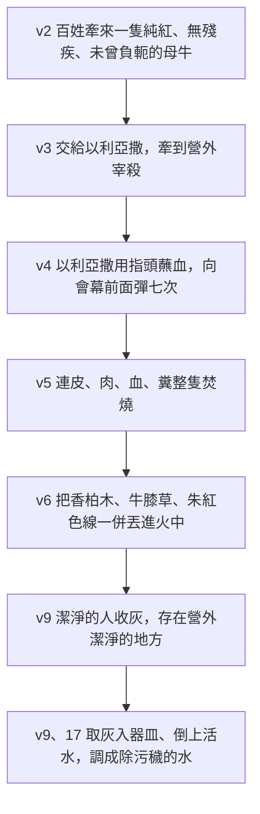
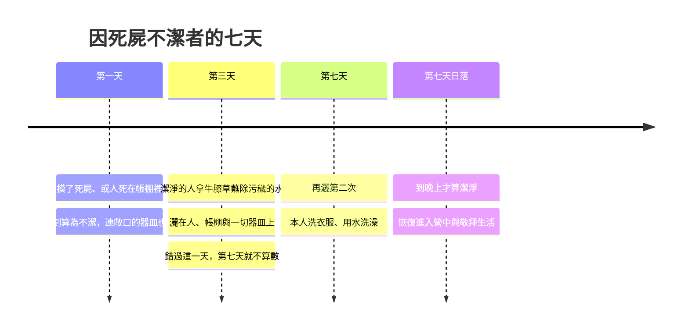

# 民數記 第19章

<!-- chapter-navigation:start -->
| [前一章](../04%20民數記/第18章.md) | [回目錄](../04%20民數記/全書目錄及綱要.md) | [下一章](../04%20民數記/第20章.md) |
| :--- | :---: | ---: |
<!-- chapter-navigation:end -->

1. 耶和華曉諭摩西、亞倫說：
2. 耶和華命定律法中的一條律例乃是這樣說：你要吩咐以色列人，把一隻沒有殘疾、未曾負軛、純紅的母牛牽到你這裡來，
3. 交給祭司[[以利亞撒]]；他必牽到營外，人就把牛宰在他面前。
4. 祭司[[以利亞撒]]要用指頭蘸這牛的血，向會幕前面彈七次。
5. 人要在他眼前把這母牛焚燒；牛的皮、肉、血、糞都要焚燒。
6. 祭司要把[[香柏木（潔淨儀式用）|香柏木]]、[[牛膝草]]、[[藍色、紫色、朱紅色線|朱紅色線]]都丟在燒牛的火中。
7. 祭司必不潔淨到晚上，要洗衣服，用水洗身，然後可以進營。
8. 燒牛的人必不潔淨到晚上，也要洗衣服，用水洗身。
9. 必有一個潔淨的人收起母牛的灰，存在營外潔淨的地方，為以色列會眾調做[[除污穢的水]]。這本是除罪的。
10. 收起母牛灰的人必不潔淨到晚上，要洗衣服。這要給以色列人和寄居在他們中間的外人作為[[永遠的定例]]。
11. 摸了人死屍的，就必七天不潔淨。
12. 那人到第三天要用這[[除污穢的水]]潔淨自己，第七天就潔淨了。他若在第三天不潔淨自己，第七天就不潔淨了。
13. 凡摸了人死屍、不潔淨自己的，就玷污了耶和華的帳幕，這人必從以色列中[[剪除]]；因為那[[除污穢的水]]沒有灑在他身上，他就為不潔淨，污穢還在他身上。
14. 人死在帳棚裡的條例乃是這樣：凡進那帳棚的，和一切在帳棚裡的，都必七天不潔淨。
15. 凡[[敞口的器皿]]，就是沒有紮上蓋的，也是不潔淨。
16. 無論何人在田野裡摸了被刀殺的，或是屍首，或是人的骨頭，或是墳墓，就要七天不潔淨。
17. 要為這不潔淨的人拿些燒成的除罪灰放在器皿裡，倒上[[活水（潔淨儀式用）|活水]]。
18. 必當有一個潔淨的人拿[[牛膝草]]蘸在這水中，把水灑在帳棚上，和一切器皿並帳棚內的眾人身上，又灑在摸了骨頭，或摸了被殺的，或摸了自死的，或摸了墳墓的那人身上。
19. 第三天和第七天，潔淨的人要灑水在不潔淨的人身上，第七天就使他成為潔淨。那人要洗衣服，用水洗澡，到晚上就潔淨了。
20. 但那污穢而不潔淨自己的，要將他從會中[[剪除]]，因為他玷污了耶和華的聖所。[[除污穢的水]]沒有灑在他身上，他是不潔淨的。
21. 這要給你們作為[[永遠的定例]]。並且那灑除污穢水的人要洗衣服。凡摸除污穢水的，必不潔淨到晚上。
22. 不潔淨人所摸的一切物就不潔淨；摸了這物的人必不潔淨到晚上。

---

## 本章知識節點

### 神學
- [[無殘疾與未曾負軛的紅母牛]]
- [[除污穢的水]]
- [[玷污耶和華的聖所與帳幕]]
- [[死屍不潔]]
- [[潔淨與不潔淨]]
- [[永遠的定例]]
- [[贖罪祭]]
- [[第三日]]

### 文化
- [[第三日與第七日的除污穢禮儀]]
- [[敞口的器皿]]
- [[香柏木（潔淨儀式用）]]

### 主題
- [[營外焚燒]]
- [[彈血七次]]
- [[藍色、紫色、朱紅色線]]
- [[不潔之人出到營外]]
- [[不可挨近死屍（拿細耳人的潔淨）]]
- [[潔淨痲瘋者的兩鳥儀式]]

### 原文
- [[牛膝草]]
- [[活水（潔淨儀式用）]]
- [[剪除]]

### 人物
- [[以利亞撒]]

### 地點
- [[潔淨之地]]

### 事件
- [[意外沾染死屍與重新潔淨條例]]

### 背景
- [[古代近東的替罪與潔淨儀式]]

### 互文
- [[紅母牛預表基督城外受苦（來13：11-12）]]
- [[不潔淨被剪除預表拒絕恩典滅亡（來10：26-29）]]

---

## 本章整理

### 燒一次，用四十年：紅母牛除污穢水的製法（v1-10）

這條律例出現的時機不是隨機的。CT 直接把它接回前兩章：「以色列人剛發生可拉黨人活活墜落陰間，並因抱怨而遭瘟疫死了一萬多人(參十六33，49)，害怕自己因得罪神而死亡(參十七12~13)，故此命定如下的律例。」GT《民數記串珠聖經註釋》從實務面說同一件事：本章特別處理接觸死屍而來的不潔，「可能因上文提到的瘟疫死亡人數眾多而引起了實際處理的問題」，而且接觸死屍是難以避免的事。換句話說，第16、17章死了那麼多人之後，全營都成了不潔的人——本章給的是一套**負擔得起、用得起**的解法。

主角是一隻 [[無殘疾與未曾負軛的紅母牛|沒有殘疾、未曾負軛、純紅的母牛]]。GT 丁良才《民數記註釋》把條件列成四項：「這牛須有四樣特色：1沒有殘疾的，2未曾負軛的，3毛色純紅的，4必須是母的。」這四項合起來指向同一件事，GT《民數記串珠聖經註釋》說得最清楚：這些條件「都充分代表生命活力，所以能夠除去死亡的玷污」。要留意的是牠不是一般祭牲——GT《啟導本聖經註釋》特別澄清：「純紅的母牛，雖規定要沒有殘疾，卻不是作獻祭用。因為獻祭須用公牛，且要燒在壇上。」牠被牽到 [[營外焚燒|營外]]宰殺，執行的是 [[以利亞撒]]而不是大祭司亞倫；GT 丁良才《民數記註釋》給的理由是：「神吩咐以利亞撒，不吩咐亞倫，是因為亞倫不敢污穢自己」，GT《民數記串珠聖經註釋》補上制度上的根據：「大祭司亞倫有聖職在身，不可接觸死屍及出聖所」。

```mermaid
flowchart TD
    A["v2 百姓牽來一隻純紅、無殘疾、未曾負軛的母牛"] --> B["v3 交給以利亞撒，牽到營外宰殺"]
    B --> C["v4 以利亞撒用指頭蘸血，向會幕前面彈七次"]
    C --> D["v5 連皮、肉、血、糞整隻焚燒"]
    D --> E["v6 把香柏木、牛膝草、朱紅色線一併丟進火中"]
    E --> F["v9 潔淨的人收灰，存在營外潔淨的地方"]
    F --> G["v9、17 取灰入器皿、倒上活水，調成除污穢的水"]
```

儀式裡有兩個動作特別值得停一下。一是 [[彈血七次]]：地點在營外，方向卻朝著會幕。GT《民數記串珠聖經註釋》解釋它的作用——「將血向會幕彈七次，表示這血能恢復神人的溝通」，並指出其餘的血要燒掉，「這與一般處理祭牲之血的方法不同」。二是丟進火裡的三樣東西，這一組材料與利未記十四章潔淨大痲瘋者所用的完全相同（見 [[潔淨痲瘋者的兩鳥儀式]]）。

| 丟進火中的材料 | GT 丁良才《民數記註釋》 | KC | GT《聖經精讀本──民數記註解》 |
| :--- | :--- | :--- | :--- |
| [[香柏木（潔淨儀式用）]] | 有馨香和不朽壞的標幟 | 人天然的偉大 | 不易腐爛，象徵生命的永恆 |
| [[牛膝草]] | 潔淨的標幟 | 人天然的渺小 | 潔淨死亡的不潔 |
| [[藍色、紫色、朱紅色線]] | 罪惡的標幟，也是贖罪血的標幟 | 地上的榮耀 | 指基督為贖罪流出的寶血 |

燒剩的灰存在 [[潔淨之地|營外潔淨的地方]]，隨用隨調成 [[除污穢的水]]。CT 的〔話中之光〕從灰的性質解釋這個設計為何有效：「灰在聖經裏，就是最末後的東西。」灰不能再改變、不能再敗壞，所以「紅母牛的灰，就是表明十字架已往的工作，是為著今天的用處。」KC 把同一點講成一句話：紅母牛只宰殺焚燒一次，不重複，這是它與其他祭最大的分別——不必為每一次沾染再燒一隻牛。第10節還把外人一併納入，成為 [[永遠的定例]]；GT 丁良才《民數記註釋》讀出它的射程：「這樣看來，神所賜借著耶穌基督贖罪的應許，不但是為猶太人和他們的子孫，也是為一切在遠方的人（參徒二39）。」

> [!note] STEP語言資料：這隻牛在原文裡被稱作什麼
> 第9節「這本是除罪的」在原文只有一個字：חַטָּאת（cha.Tat，H2403H），簡要義域是 sin: sin offering；第17節「燒成的除罪灰」字面也是同一個字。也就是說，儘管牠不上壇、不照常例獻，經文仍用 [[贖罪祭]]的名稱稱呼牠。同一節的「除污穢的水」由「水」加上 נִדָּה（ni.Dah，H5079，簡要義域 impurity）組成，字面是「污穢之水」。另外第9節的「灰」是 אֵפֶר（E.fer，H665，ashes），第17節的「灰」卻是 עָפָר（a.Far，H6083，dust），原文用了兩個不同的字。

### 死亡碰過的，一律不潔（v11-16）

第11節起，條例從製法轉到用法，處理的是 [[死屍不潔]]。GT 丁良才《民數記註釋》先把輕重分出來：「唯獨摸人死屍的不潔七日，摸別樣走獸的死體不潔到晚（22，利十一28）。人的死乃是罪的工價，所以摸人的死屍，比摸別樣動物之死屍，所染的不潔更大。」這條規定的涵蓋面很廣，而且不問是否出於自願。

| 情況 | 經文 | 誰受影響 |
| :--- | :--- | :--- |
| 摸了人的死屍 | v11 | 摸的人，七天 |
| 有人死在帳棚裡 | v14 | 進帳棚的與帳棚裡的所有人，七天 |
| 沒有紮上蓋的容器 | v15 | 器皿本身（見 [[敞口的器皿]]） |
| 在田野摸了被刀殺的、屍首、人的骨頭、墳墓 | v16 | 摸的人，七天 |
| 不潔淨的人摸過的一切物 | v22 | 物與後來摸物的人，到晚上 |

CT 把第16節讀成生活場景：田野表徵工作和社交場合，都滿了死亡的污穢。KC 走得更遠，逐項給了應用：帳棚是家裡的私領域，也可以是地方教會，死亡會突然從一句話、一個舉動進來；敞口的器皿指的是兒童、初信者、軟弱的信徒，他們對錯誤的東西毫無防備；田野是公開場合，被刀殺的指向暴力，包括暴力的語言；人的骨頭是那種已經被普遍接受、罪的意識早已退到背景的行為；墳墓外表好看、裡面卻是死的冷的，主耶穌正是這樣形容法利賽人（太23:27）。

這種對屍體的畏懼並非以色列獨有。GT《舊約聖經背景註釋》列了跨文化的對照：「美索不達米亞和古以色列雖然沒有清楚的來生觀念，卻依然有死者的靈能夠影響活人的信念」，赫人怕的是在死者的靈面前不潔，而美索不達米亞的南布爾比儀式顯出他們對屍體所導致的不潔相當畏懼（見 [[古代近東的替罪與潔淨儀式]]）。但同一份註釋也標出分別：「赫人的儀式雖然也包括洗身、獻祭、隔離，但古代近東淨化儀式細節最為詳盡的，大概還是首推聖經。」GT《啟導本聖經註釋》則替整套制度說了一句公道話：「也許有人認為這種儀式屬原始社會所為，跡近迷信。現代人類學家已知道，儀式所反映的，是一個社會對生命最深刻的認識，並非源於無知。」

值得一提的是，這條通則在民數記裡有過兩次特例。民6:9 的拿細耳人若身旁忽然有人死了，先前的日子要歸徒然（見 [[不可挨近死屍（拿細耳人的潔淨）]]與 [[意外沾染死屍與重新潔淨條例]]）；民9:6 有幾個人因死屍不潔淨，不能在正月守逾越節，神為此開了二月補守的特例。民5:2 更早就規定 [[不潔之人出到營外|因死屍不潔淨的人要出到營外]]。

### 第三天與第七天：兩次灑水，缺一不可（v12、17-19）

[[第三日與第七日的除污穢禮儀|七天的不潔期不是靜靜等它過去]]。第12節把話講死了：「那人到第三天要用這除污穢的水潔淨自己，第七天就潔淨了。他若在第三天不潔淨自己，第七天就不潔淨了。」錯過第三天，第七天就不算數。為什麼是這兩個日子，來源沒有一致答案——GT《民數記串珠聖經註釋》乾脆承認「這裡沒說明選擇這些數字的原因」；GT 丁良才《民數記註釋》只給了一句：「特要表明這污穢是何等大，甚不容易除掉。」CT 走預表路線：「『第三天』是主復活的日子，此處表徵承認主復活是為使我們稱義(參羅四25)；『第七天』七是完全的數目字，表徵從不潔淨中得著完全的釋放。」BH 指出 [[第三日]]在聖經的類型學裡常與復活和新的開始相連，並舉何西阿書6:2 為例。

```mermaid
timeline
    title 因死屍不潔者的七天
    第一天 : 摸了死屍、或人死在帳棚裡 : 立刻算為不潔，連敞口的器皿也算
    第三天 : 潔淨的人拿牛膝草蘸除污穢的水 : 灑在人、帳棚與一切器皿上 : 錯過這一天，第七天就不算數
    第七天 : 再灑第二次 : 本人洗衣服、用水洗澡
    第七天日落 : 到晚上才算潔淨 : 恢復進入營中與敬拜生活
```

調水的方法寫在第17節：取灰放在器皿裡，倒上 [[活水（潔淨儀式用）|活水]]——CT 註「活」是活、流動的，指的是流動的水，不是死水。灑水的工具是 [[牛膝草]]，GT《舊約聖經背景註釋》解釋為什麼選它：「用牛膝草的原因，是因為其枝條多毛，能夠吸收水分。」KC 從另一個角度讀這根草：拿牛膝草表示那潔淨的人必須用溫柔謙卑的心對待不潔淨的人，而不是靠自己的知識或見識。

> [!note] STEP語言資料：原文把「除罪」與「潔淨」分成兩個動作
> 第12節的「潔淨自己」是 יִתְחַטָּא（yit.cha.Ta，H2398）的反身形，詞典形是 חָטָא，簡要義域 to sin——與「罪」同一個字根，本節譯義是使自己除罪；第19節「使他成為潔淨」則是同一字根的使役形。而「第七天就潔淨了」用的是另一個字根 טָהֵר（ta.Her，H2891，簡要義域 be pure）。第19節收尾的兩個動作在原文也是兩個字：「洗衣服」是 כָּבַס（khi.Bes，H3526H），「用水洗澡」是 רָחַץ（ra.Chatz，H7364）。CT 註第12節的「除污穢的水」是「(原文無此詞)」，STEP 顯示本節確實只寫「用它」，沒有出現水的名稱。

### 不肯潔淨的人才被剪除（v13、20）

本章兩次宣告 [[剪除]]，而兩次針對的都不是意外碰到死人的那種情況。CT 說得最白：「意指雖經過灑除污穢的水，但若他本人不肯配合潔淨自己，仍然無效，是很嚴重的罪，要被治死。」GT《聖經精讀本──民數記註解》一句話收束：「神所責備的並不是犯罪的人,而是犯罪以後不知悔改的人。」KC 的說法最短：叫我們致命的不是罪，而是不肯使用神所賜下的潔淨方法。至於一個人的不潔為何會扯上聖所，CT 指出這是連帶責任：「表示一個人的不潔淨，不僅關係到他自己，甚至會影響到全會眾，乃至神的居所(參利十五31)。」

不過刑度有多重，CT 自己留了餘地。他在〔話中之光〕註明：「這不是永遠沉淪，因為在埃及逾越節羔羊血的效力尚在；這不過將他從神之聖民的會中剪除。」新約把這條警告接到更重的地方（見 [[不潔淨被剪除預表拒絕恩典滅亡（來10：26-29）]]）。

> [!note] STEP語言資料：兩節的用詞其實不一樣
> 第13節被玷污的是 מִשְׁכַּן（mish.Kan，H4908，簡要義域 tabernacle），剪除的範圍是從以色列；第20節被玷污的是 מִקְדַּשׁ（mik.Dash，H4720，簡要義域 sanctuary），剪除的範圍是從 קָהָל（ka.Hal，H6951，簡要義域 assembly）當中——這正是條目名 [[玷污耶和華的聖所與帳幕]]兩個詞並列的緣故。另外這兩節說「沒有灑在他身上」，用的是 זָרַק（zo.Rak，H2236，簡要義域 to scatter）的被動形，與第4、18、21節祭司實際動手時所用的 נָזָה（na.zah，H5137A，簡要義域 to sprinkle）不是同一個字。

### 使人潔淨的，自己反倒不潔淨（v7-10、21-22）

本章最奇特的一點藏在收尾：凡經手這套潔淨程序的人，一律不潔淨到晚上。祭司（v7）、燒牛的人（v8）、收灰的人（v10）、灑水的人與摸水的人（v21）無一例外。GT 丁良才《民數記註釋》坦白說想不通，但給了一個方向：「我們不知道這種水如何叫這人潔淨，又叫那人不潔淨。或者是要顯明這潔淨的能力，不是在乎水，乃是在乎神的命令。」GT《舊約聖經背景註釋》的解釋比較技術性：「它所以如此，是與調劑的目的有關，並且假設祭禮用到的材料，本身有污染作用。」BH 直接稱這是潔淨程序的弔詭：洗淨別人的水，同時使摸它的人暫時不潔。KC 給的原則最短：凡經手罪的事，按定義就會使自己沾污。

這一層弔詭把整章的 [[潔淨與不潔淨]]收在一個很不舒服的位置上——潔淨不是靠人的乾淨手，是靠那隻已經燒成灰的牛。CT 在第9節的〔話中之光〕點出這個限制：這灰有除罪的功用，卻不能帶進營內，因為凡是沾上罪的事物，都不能擺進神的範圍內。而新約正是從這裡接手：紅母牛被牽到營外宰殺焚燒，希伯來書把它讀成基督在城門外受苦（見 [[紅母牛預表基督城外受苦（來13：11-12）]]），KC 引來9:13-14 作結——公牛山羊的血與母牛的灰若能叫人的身體潔淨，何況基督的血。GT 丁良才《民數記註釋》早在第1節就把整章分成四層：犧牲被宰殺、血七次被彈在會幕前面、犧牲被燒成灰作這祭的紀念、用灰和活水灑在不潔淨的人身上，並說明本章所論的禮「預表主耶穌如何潔淨那些為客旅經過曠野（就是世界）的信徒，使他們脫離了在路上所沾染的污穢」。

**參考資料**
https://www.ccbiblestudy.org/Old%20Testament/04Num/04CT19.htm
https://www.ccbiblestudy.org/Old%20Testament/04Num/04GT19.htm
https://www.kingcomments.com/en/bible-studies/Num/19
https://biblehub.com/study/numbers/19.htm
https://github.com/STEPBible/STEPBible-Data

<!-- appendix-links:start -->
## 附錄

### 相關地圖
- [[appendix/fhl_maps/maps/021|〈民圖二〉探查應許地和應許地的範圍]]
<!-- appendix-links:end -->

<!-- chapter-navigation:start -->
| [前一章](../04%20民數記/第18章.md) | [回目錄](../04%20民數記/全書目錄及綱要.md) | [下一章](../04%20民數記/第20章.md) |
| :--- | :---: | ---: |
<!-- chapter-navigation:end -->
