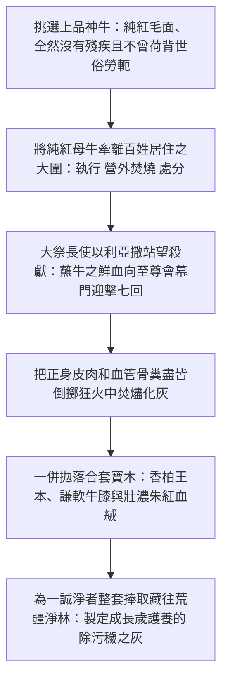
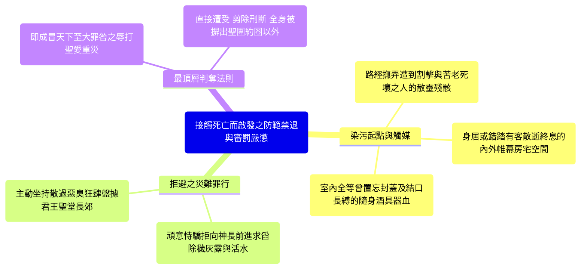
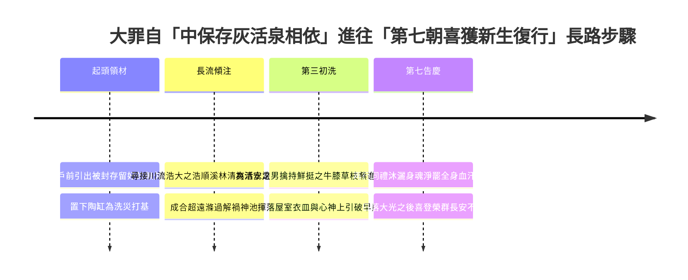

# 民數記 第19章

<!-- chapter-navigation:start -->
| [前一章](第18章.md) | [回目錄](全書目錄及綱要.md) | [下一章](第20章.md) |
| :--- | :---: | ---: |
<!-- chapter-navigation:end -->

1. 耶和華曉諭摩西、亞倫說：
2. 耶和華命定律法中的一條律例乃是這樣說：你要吩咐以色列人，把一隻沒有殘疾、未曾負軛、純紅的母牛牽到你這裡來，
3. 交給祭司以利亞撒；他必牽到營外，人就把牛宰在他面前。
4. 祭司以利亞撒要用指頭蘸這牛的血，向會幕前面彈七次。
5. 人要在他眼前把這母牛焚燒；牛的皮、肉、血、糞都要焚燒。
6. 祭司要把[[香柏木（潔淨儀式用）|香柏木]]、[[牛膝草]]、朱紅色線都丟在燒牛的火中。
7. 祭司必不潔淨到晚上，要洗衣服，用水洗身，然後可以進營。
8. 燒牛的人必不潔淨到晚上，也要洗衣服，用水洗身。
9. 必有一個潔淨的人收起母牛的灰，存在營外潔淨的地方，為以色列會眾調做[[除污穢的水]]。這本是除罪的。
10. 收起母牛灰的人必不潔淨到晚上，要洗衣服。這要給以色列人和寄居在他們中間的外人作為永遠的定例。
11. 摸了人死屍的，就必七天不潔淨。
12. 那人到第三天要用這[[除污穢的水]]潔淨自己，第七天就潔淨了。他若在第三天不潔淨自己，第七天就不潔淨了。
13. 凡摸了人死屍、不潔淨自己的，就玷污了耶和華的帳幕，這人必從以色列中[[剪除（kareth）|剪除]]；因為那[[除污穢的水]]沒有灑在他身上，他就為不潔淨，污穢還在他身上。
14. 人死在帳棚裡的條例乃是這樣：凡進那帳棚的，和一切在帳棚裡的，都必七天不潔淨。
15. 凡敞口的器皿，就是沒有紮上蓋的，也是不潔淨。
16. 無論何人在田野裡摸了被刀殺的，或是屍首，或是人的骨頭，或是墳墓，就要七天不潔淨。
17. 要為這不潔淨的人拿些燒成的除罪灰放在器皿裡，倒上[[活水（潔淨儀式用）|活水]]。
18. 必當有一個潔淨的人拿[[牛膝草]]蘸在這水中，把水灑在帳棚上，和一切器皿並帳棚內的眾人身上，又灑在摸了骨頭，或摸了被殺的，或摸了自死的，或摸了墳墓的那人身上。
19. 第三天和第七天，潔淨的人要灑水在不潔淨的人身上，第七天就使他成為潔淨。那人要洗衣服，用水洗澡，到晚上就潔淨了。
20. 但那污穢而不潔淨自己的，要將他從會中[[剪除（kareth）|剪除]]，因為他玷污了耶和華的聖所。[[除污穢的水]]沒有灑在他身上，他是不潔淨的。
21. 這要給你們作為永遠的定例。並且那灑除污穢水的人要洗衣服。凡摸除污穢水的，必不潔淨到晚上。
22. 不潔淨人所摸的一切物就不潔淨；摸了這物的人必不潔淨到晚上。

---

## 本章知識節點

### 神學
- [[無殘疾與未曾負軛的紅母牛]]
- [[除污穢的水]]
- [[玷污耶和華的聖所與帳幕]]
- [[死屍不潔]]
- [[第三日]]

### 文化
- [[向會幕前彈紅母牛的血七次]]
- [[香柏木、牛膝草與朱紅線]]
- [[第三日與第七日的除污穢禮儀]]
- [[香柏木（潔淨儀式用）]]

### 主題
- [[營外焚燒（machutz la-machaneh saraf）]]

### 原文
- [[牛膝草]]
- [[活水（潔淨儀式用）]]
- [[剪除（kareth）]]

---

## 本章整理

### 紅母牛除罪灰之選備、營外刑焚與神聖材料添加（v1-10）

民數記第19章開啟了西奈舊約律例中最特殊也極具預表救贖大益的一則神學專題 —— 為了使身處於曠野途旅中無可避免會遭逢死亡與喪家的百姓不至於永墮被離之災，上帝向摩西及亞倫下令確立了一道常備的禮儀潔淨良方（v1-2）。此處命定的主線即為 [[無殘疾與未曾負軛的紅母牛]] 宰獻規則：「你要告訴以色列人，把一隻純紅的、沒有殘疾、未曾負軛的母牛牽到你這裡來。」據《基督徒文摘解經系列》（CT）及《拾穗》（GT）剖解：選擇「純紅」者表徵熱烈盎然、生猛飽實並未染衰病退敗氣息的榮旺豐盛生命，能以對抗冷暗沉鬱之死亡污垢；「毫無殘疾」宣信這犧牲為上好不污之品；「未曾負軛」更強調這群純母不曾經歷庸凡之重累與為世俗田場受奴，得以坦蕩乾淨保留歸一獻予真主作贖咎至恩（參閱 Hebrews 9:13-14）。

```mermaid
flowchart TD
    A["挑選上品神牛：純紅毛面、全然沒有殘疾且不曾荷背世俗勞軛"] --> B["將純紅母牛牽離百姓居住之大圍：執行 營外焚燒 處分"]
    B --> C["大祭長使以利亞撒站望殺獻：蘸牛之鮮血向至尊會幕門迎擊七回"]
    C --> D["把正身皮肉和血管骨糞盡皆倒擲狂火中焚燼化灰"]
    D --> E["一併拋落合套寶木：香柏王本、謙軟牛膝與壯濃朱紅血絨"]
    E --> F["為一誠淨者整套捧取藏往荒疆淨林：製定成長歲護養的 除污穢之灰"]
```

這一場宰獻全然有別於在會幕銅壇頂層執行的凡例，其地點更被迫移至距離靜密聖宇和眾人住帳大疆千里外的冷涼塞表去執行 —— 此正豐富實現了 [[營外焚燒（machutz la-machaneh saraf）|「不准致刑罪惡侵入上內府、須往營外受焚」]] 的根源法理與重磅預表（v3, 5；參看 Hebrews 13:11-13）。主諭以利亞撒領前督看，且在他手執指頭間落實了一組精密的空間補救誓式 —— [[向會幕前彈紅母牛的血七次]]（v4）。正由這完足七次的遠空直面幕大門方向點彈宣灑，宣告殺亡雖放於野陵外側，其化愆解過的贖血憑證早無折缺地定進了大能主上帝御殿恩憫的核心掌理。而在牛體燃火的沸焰中，一併被指令加置了象徵意向弘遠的神禮配件 —— 這即是 [[香柏木、牛膝草與朱紅線]] 組合（v6；其單項涵攝了代表天堅久永不腐的 [[香柏木（潔淨儀式用）|香柏珍林]] 與表徵卑俯受容的 [[牛膝草]]）：神藉極尊之樹榮與極下之纖細小苗同入化死紅血裡同融一燼，建構出不容殘朽之最偉贖罪除灰泉頭。隨之宣告：「存在營外潔淨的地方，為以色列會眾留著，用以作 [[除污穢的水]]。這本是除罪的...作為永遠的定例」（v9-10）。

| 上帝選命原材料與禮器 | 外顯物性與特殊條例 | 蘊伏其中的神性倫理與抗死神學功效 |
| :--- | :--- | :--- |
| **未負軛之純紅母牛** | 全毛通紅無雜、身骨不負人軛毫無病瑕。 | 用極盛壯旺不曾屈困於凡塵奴累之極潔命脈來清洗消遣冷死衰厄。 |
| **長老遠向幕庭灑血七回** | 身住曠原邊表卻朝大帳正面全彈七回鮮紅。 | 表彰替代殺刑雖為去辱移置野外，然赦宥授力卻百分全發自至高上御會堂。 |
| **香柏樹、牛膝與赤線共融** | 極貴木豪結合最順纖林及血絨火中並融。 | 聚發防朽不壞王度與微俯親赦仁心，共化贖死亡與污耗的心核藥露。 |

> [!quote] 註解引讀與反思
> - **營外預表的終局**：「人若執著唯依常俗城樓尋榮必迷，神愛那身擔萬過、替民受辱棄走郊外成死者的紅斑至灰；這薪灰竟能萬古化露洗眾冤！」(CT/GT)
> - **永久除舊自薦**：「殺牲一次不勞常常再縛千頭；一牛的成燼長伴活水相攙，即成就常隨眾民遍遊百疆取飲滌垢的萬歲常樂定約！」(KingComments)

### 死亡帶來的沉重玷染、七日禁期與不順遂者之致命嚴譴（v11-16, 20）

為彰顯造一切活氣上帝那豐純毫無老滅沉氣的神格至潔，本段接著精嚴規定凡黎人在人倫起居中無法杜退或閃身規免的觸過事件規範 —— 廣大剖論了 [[死屍不潔]] 之至甚法規（v11, 14-16）。「人摸了死屍、無論是什麼人，必七日不潔淨。」律例列明了極廣範圍的神譴污限：不但親近大喪、踏尋露兵血殺遭戳割陣終兵骸、路郊遺散零碎乾骨甚至踏臨丘山舊碑等全都在內；就連有人於居家圍殿中間告過辭終，這座臨喪室廬同內部隨附走履奔踏之任何長丁兒弱，乃至那敞著頂蓋毫無鎖巾紮牢蓋住的各式油陶器及日常木杯，一律墜落受封「七天的殘染禁退境地」。《拾穗》（GT）以嚴懇口吻評明其學：死亡本即為先祖逆絕生命天泉後所領得至重的宣罰沉果，故在其光芒會處內任隨一點腐死氣焰自滿恣散，就是對神權生命公尺的一番侵褻。

```mermaid
mindmap
    root("接觸死亡而啟發之防範禁退與審罰嚴懲")
        染污起點與觸媒
            ("路經撫弄遭到割擊與苦老死壞之人的散靈殘骸")
            ("身居或錯踏有客散逝終息的內外帷幕房宅空間")
            ("室內全等曾置忘封蓋及結口長縛的隨身酒具器血")
        拒避之災難罪行
            ("頑意恃驕拒向神長前進求舀除穢灰露與活水")
            ("主動坐持散過惡臭狂肆盤據君王聖堂長郊")
        最頂層判奪法則
            ("即成冒天下至大罪咎之辱打聖愛重災")
            ("直接遭受 剪除刑斷 全身被摒出聖團約圈以外")
```

而如此嚴謹分層的制度終點，莫過於高舉那驚動西奈群堂、禁止以傲自輕恩成風的大死喝戒 —— [[玷污耶和華的聖所與帳幕|「頑抗不受水潔除污者必淪為強犯上帝至誠殿宇大禍並即吃判除斷」]]（v13, 20）。神親自用最堅決字詞勒布：「凡摸了死人...不受潔淨的，就玷污了耶和華的帳幕，這人必從以色列中剪除；因為除污穢的水沒有灑在他身上...他若不潔淨，這人必從會中剪除，因為他玷污了耶和華的聖所！」這一罪狀將問題根結徹底釐平：《KingComments》及《BibleHub》雙皆申言：遭罹意外沾觸野塚喪者本非不赦死惡，真正惹發上帝怒打千家驅趕、並施加最慘狠天意刑裁 —— 即處以 [[剪除（kareth）|「直接把罪命自我眾民神恩契約內全斬拔出」]] 的根由，全然是因染病生民內心放肆驕揚，把上帝早經憐惜為渠燒存成盒免費候領的常潔藥水撇擲背後！仗執污垢自恃平安，斯情正無異於主動捧污進侵永生榮帝座前！

> [!warning] 輕慢赦水的審判
> - **忽視為罪本**：遇喪相送屬人無奈；但自認穢跡可以隨意親靠聖民居堂而不屑赴求除罪一灌水露，即名作藐蔑上主的頂等反罪。
> - **無救之剪除**：被剪絕命之徒並非困苦不得遇贖；乃在活水灰桶長列路側時傲目笑揚、拒領恩露以臻被放絕於安居牆外！

### 第三日與第七日之兩次成赦洗禮、活水添入及祭物傳延（v17-19, 21-22）

為了教導百姓洗脫沉痾非是可恣性慢待、須存嚴肅法度執行，上帝定調了對付此等死亡污損的具體時距律例 —— 此是對於信仰教義大為關鍵的 [[第三日與第七日的除污穢禮儀|「經七日隔離其間必重申於第三早與第七早接兩梯次領灰泉神誓」]]（v12, 19；並以引渡進新約拯救突破曙光之數字靈格見長：[[第三日|「作為突破死亡之要關首沐時辰」]]）。主云：「那人要在第三日和第七日用這水潔淨自己，就乾淨了；他若在第三日不潔淨自己，第七日就不乾淨。」（v12）。這重時間法則打破了只呆坐消解天日等其自然的幻期心意：當於罹過後迅速於 [[第三日]] 依規赴領灑衣與沐灑，這第一回破晦灑淨正是引向將滿全安七日康福的新開關；無置起第三日的恭遜先行禮，至遲第七天依歸不配重踏喜歌榮門！

```mermaid
timeline
    title 大罪自「中保存灰活泉相依」進往「第七朝喜獲新生復行」長路步驟
    起頭領材 : 在不潔民戶前引出被封存留好的無欠紅牛舊灰 : 置下陶缸為洗災打基
    長流傾注 : 尋接川流浩大之浩順溪林清爽活水滾貫缸裡 : 成合超遠滌過解禍神池
    第三初洗 : 為清安之男擒持鮮挺之牛膝草枝蘸進大水面 : 揮落屋室衣皿與心神上引破早厄
    第七告慶 : 再行同禮沐灑身魂淨罷全身血汗水災 : 日落大光之後喜登榮群長安不污
```

更為引人深省的是上帝對化成除難甘池步驟之神聖選定法 —— 這便成就了將靜謐乾老遺殘同湧猛大水絕妙交配的教理 —— 即必定要注進天然未息不朽的 [[活水（潔淨儀式用）|「生猛天然湧溢的靈生水源」]]（v17），以及善加運用善汲謙沖小枝叢來作引發功媒介 —— 運用 [[牛膝草|「握住新結之小林一束飽染活水朝犯禍病戶滿撒大禮」]]（v18）。「要為這不潔淨的人拿些燒成的除罪之灰，放在器皿裡，倒上活水；一個潔淨的人要拿牛膝草蘸在這水中，把水灑在帳幕和一切器皿...於第三日和第七日灑在其人身體...到晚上乃為乾淨」（v17-19）。《舊約聖經背景註釋》特別申白，世局常有借鹽洗傷，真王神意卻把代死公犧牲身上千煉無損的殘燼當成過世代辱的贖證；將此灰一灑投奔生涼活泉內，正猶如用無限生生不止的新活聖流洗沐死亡腐滅的殘舊敗土！末端第21-22節進深補充說明，連那好意捧執此水潑罪的潔者、其雙掌衣飾也會在接通當日陷受薄冰不淨而需澣衫自浴待向星昏 —— 此既保護世民切莫把救贖大水視作浮言戲物，並顯得擔他苦孽自會身帶羞垢（直顯神父聖子基督替我背挑百辱作聖之厚高無限風采）。

| 清滌時序與對面材料 | 在禮儀運作中的精確實踐 | 深刻蘊含之去朽翻生救恩本色 |
| :--- | :--- | :--- |
| **活水相伴純灰調勻** | 在裝缸牛塵頂下倒奔滾湧無止絕流天然水露。 | 代受極禍沉灰攜合湧流豐美活水，建起解開世苦抗退致終死亡的解毒大道。 |
| **第三晨初次揚打靈枝** | 找請清白善伯提抓牛膝樹支漫灑身壁衫碗。 | 不徒坐熬苦陰，必當把握中場機智在三早破苦先求聖赦露指點。 |
| **第七星晚康美新生** | 再彈一回深禮並勒人寬解自沐衣衫浸浴全身。 | 歷此兩段完整深心潔禮，自星沉大暮一開，榮獲無罪安居迎向全區眾親。 |

### 靈訓總結與新約救濟全景印設（v1-22）

總匯民數記第19章的深刻教訓與體制建置，我們即在行途絕旱荒原上讀見上帝對人性生死限制極遠大又慈實有度的寬愛施政。西奈行營長行三十幾秋，死苦頻生，上帝若要每次死患皆命人宰羔驅羊不輟，全營恐將入陷資源蕩損和疲憊哀懼。這尊被欽選牽往廣疆極外屠燒的大地紅母牛，其純灰被妥善存妥、配就甘香奔騰「活水」，成為千夫與無數寄生外儒隨遭不慎觸衰必能自得救恩洗宥的高聖源津！同時神用莫能寬免的「玷主必斷」威令，教曉眾心須當領德敬誠以向三日早課仰沾除沐露泉。這一連串兼聚神殿清潔安全與便民濟靈的好規矩，直越千古歲月引到福音榮章：正如希伯來神信明銘所歡，《民》章牛灰跟青水洗得的是舊禮體膚暫純，獨真天愛子無玷基督城門之外的傾己血源與永生聖靈之充活流水，方是萬全為眾信在天天人生旅間常護靈身得超絕污厄、永保靠父不移的高妙終局！

**參考資料**
https://www.ccbiblestudy.org/Old%20Testament/04Num/04CT19.htm
https://www.ccbiblestudy.org/Old%20Testament/04Num/04GT19.htm
https://www.kingcomments.com/en/bible-studies/Num/19
https://biblehub.com/study/numbers/19.htm

<!-- appendix-links:start -->
## 附錄

### 相關地圖
- [[appendix/fhl_maps/maps/021|〈民圖二〉探查應許地和應許地的範圍]]
<!-- appendix-links:end -->

<!-- chapter-navigation:start -->
| [前一章](第18章.md) | [回目錄](全書目錄及綱要.md) | [下一章](第20章.md) |
| :--- | :---: | ---: |
<!-- chapter-navigation:end -->
