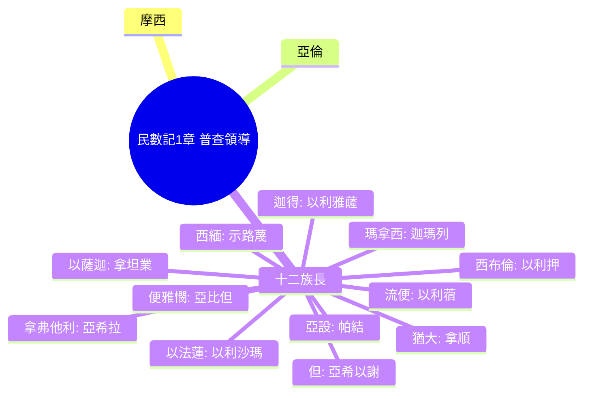

# 民數記 第1章

1. [[以色列人出埃及地後]]，[[第二年二月初一日]]，耶和華在西乃的[[曠野]]、[[會幕中]][[曉諭摩西說]]：
2. 你要按[[以色列|以色列全會眾]]的[[家室（bet av）|家室、宗族]]、[[人名（shem）|人名的數目]][[數點以色列男丁條例|計算所有的男丁]]。
3. 凡[[以色列]]中，從[[二十歲以外]]，[[能出去打仗]]的，[[亞倫|你和亞倫]]要[[數點以色列男丁條例|照他們的軍隊數點]]。
4. 每支派中必有一人作本支派的族長，幫助你們。
5. 他們的[[人名（shem）|名字]]：屬[[流便]]的，有[[以利蓿（流便族長）|示丟珥的兒子以利蓿]]；
6. 屬[[西緬]]的，有[[示路蔑（西緬族長）|蘇利沙代的兒子示路蔑]]；
7. 屬[[猶大（雅各之子）|猶大]]的，有[[拿順（猶大族長）|亞米拿達的兒子拿順]]；
8. 屬以薩迦的，有[[拿坦業（以薩迦族長）|蘇押的兒子拿坦業]]；
9. 屬[[西布倫（同住）|西布倫]]的，有[[以利押（西布倫族長）|希倫的兒子以利押]]；
10. 約瑟子孫、屬[[以法蓮]]的，有[[亞米忽（Ammihud）|亞米忽的兒子]]以利沙瑪；屬[[瑪拿西]]的，有[[比大蓿（Pedahzur）|比大蓿的兒子]]迦瑪列；
11. 屬[[便雅憫]]的，有[[基多尼（Gideoni）|基多尼的兒子]]亞比但；
12. 屬但的，有[[亞米沙代（Amishaddai）|亞米沙代的兒子]]亞希以謝；
13. 屬[[亞設（有福）|亞設]]的，有[[俄蘭|俄蘭的兒子]]帕結；
14. 屬迦得的，有[[丟珥|丟珥的兒子]]以利雅薩；
15. 屬[[拿弗他利]]的，有[[以南|以南的兒子]]亞希拉。
16. 這都是[[十二支派族長名單|從會中選召的]]，[[十二支派族長名單|各作本支派的首領]]，都是[[以色列]]軍中的統領。
17. 於是，[[摩西]]、[[亞倫]]帶著這些[[按名指定|按名指定的人]]，
18. 當二月初一日[[招聚全會眾]]。會眾就照他們的[[家室（bet av）|家室、宗族]]、[[人名（shem）|人名的數目]]，從[[二十歲以外]]的，都[[述說家譜|述說自己的家譜]]。
19. [[照耶和華吩咐|耶和華怎樣吩咐摩西]]，他就怎樣在西乃的[[曠野]]數點他們。
20. [[以色列]]的長子，[[流便|流便子孫]]的後代，照著[[家室（bet av）|家室、宗族]]、[[人名（shem）|人名的數目]]，從[[二十歲以外]]，凡[[能出去打仗|能出去打仗、被數的]][[男丁]]，共有四萬六千五百名。
21. 併於上節。
22. [[西緬|西緬子孫]]的後代，照著[[家室（bet av）|家室、宗族]]、[[人名（shem）|人名的數目]]，從[[二十歲以外]]，凡[[能出去打仗|能出去打仗、被數的]][[男丁]]，共有五萬九千三百名。
23. 併於上節。
24. 迦得子孫的後代，照著[[家室（bet av）|家室、宗族]]、[[人名（shem）|人名的數目]]，從[[二十歲以外]]，凡[[能出去打仗|能出去打仗、被數的]]，共有四萬五千六百五十名。
25. 併於上節。
26. [[猶大（雅各之子）|猶大子孫]]的後代，照著[[家室（bet av）|家室、宗族]]、[[人名（shem）|人名的數目]]，從[[二十歲以外]]，凡[[能出去打仗|能出去打仗、被數的]]，共有七萬四千六百名。
27. 併於上節。
28. 以薩迦子孫的後代，照著[[家室（bet av）|家室、宗族]]、[[人名（shem）|人名的數目]]，從[[二十歲以外]]，凡[[能出去打仗|能出去打仗、被數的]]，共有五萬四千四百名。
29. 併於上節。
30. [[西布倫（同住）|西布倫子孫]]的後代，照著[[家室（bet av）|家室、宗族]]、[[人名（shem）|人名的數目]]，從[[二十歲以外]]，凡[[能出去打仗|能出去打仗、被數的]]，共有五萬七千四百名。
31. 併於上節。
32. 約瑟子孫屬[[以法蓮|以法蓮子孫]]的後代，照著[[家室（bet av）|家室、宗族]]、[[人名（shem）|人名的數目]]，從[[二十歲以外]]，凡[[能出去打仗|能出去打仗、被數的]]，共有四萬零五百名。
33. 併於上節。
34. [[瑪拿西|瑪拿西子孫]]的後代，照著[[家室（bet av）|家室、宗族]]、[[人名（shem）|人名的數目]]，從[[二十歲以外]]，凡[[能出去打仗|能出去打仗、被數的]]，共有三萬二千二百名。
35. 併於上節。
36. [[便雅憫|便雅憫子孫]]的後代，照著[[家室（bet av）|家室、宗族]]、[[人名（shem）|人名的數目]]，從[[二十歲以外]]，凡[[能出去打仗|能出去打仗、被數的]]，共有三萬五千四百名。
37. 併於上節。
38. 但子孫的後代，照著[[家室（bet av）|家室、宗族]]、[[人名（shem）|人名的數目]]，從[[二十歲以外]]，凡[[能出去打仗]]，被數的，共有六萬二千七百名。
39. 併於上節。
40. [[亞設（有福）|亞設子孫]]的後代，照著[[家室（bet av）|家室、宗族]]、[[人名（shem）|人名的數目]]，從[[二十歲以外]]，凡[[能出去打仗|能出去打仗、被數的]]，共有四萬一千五百名。
41. 併於上節。
42. [[拿弗他利|拿弗他利子孫]]的後代，照著[[家室（bet av）|家室、宗族]]、[[人名（shem）|人名的數目]]，從[[二十歲以外]]，凡[[能出去打仗|能出去打仗、被數的]]，共有五萬三千四百名。
43. 併於上節。
44. 這些就是被數點的，是[[摩西]]、[[亞倫]]，和[[以色列]]中十二個[[族長|首領]]所數點的；這十二個人各作各宗族的代表。
45. 這樣，凡[[以色列|以色列人中]]被數的，照著宗族，從[[二十歲以外]]，[[能出去打仗|能出去打仗、被數的]]，共有六十萬零三千五百五十名。
46. 併於上節。
47. [[利未支派不被數點條例|利未人卻沒有按著支派數在其中]]，
48. 因為[[摩西|耶和華曉諭摩西]]說：
49. 惟獨[[利未人|利未支派]]你不可數點，也[[不可數點|不可在以色列人中計算]]他們的[[總數]]。
50. 只要[[利未支派不被數點條例|派利未人管法櫃的帳幕]]和[[器具|其中的器具]]，並屬乎帳幕的；他們要抬（抬或作：搬運）帳幕和其中的器具，並要[[抬帳幕|辦理帳幕的事]]，在帳幕的四圍[[安營]]。
51. 帳幕將往前行的時候，[[會幕四圍安營條例|利未人要拆卸]]；將[[支搭帳棚|支搭]]的時候，[[會幕四圍安營條例|利未人要豎起]]。[[會幕四圍安營條例|近前來的外人必被治死]]。
52. [[以色列|以色列人]][[支搭帳棚]]，要[[軍隊|照他們的軍隊]]，[[安營|各歸本營]]，[[纛|各歸本纛]]。
53. 但[[會幕四圍安營條例|利未人要在法櫃帳幕的四圍安營]]，[[忿怒|免得忿怒臨到]][[以色列全會眾|以色列會眾]]；利未人並要[[守法櫃帳幕（Mishkan HaEdut）|謹守法櫃的帳幕]]。
54. [[以色列|以色列人]][[照樣行了|就這樣行]]。[[照耶和華吩咐|凡耶和華所吩咐摩西的]]，他們就照樣行了。

<!-- fhl-map-links:start -->
## 相關地圖

- [[appendix/fhl_maps/maps/019|〈出圖二〉以色列人出埃及到西乃山]]
- [[appendix/fhl_maps/maps/020|〈民圖一〉從西乃山到加低斯]]
<!-- fhl-map-links:end -->

---

## 本章知識節點

### 神學
- [[忿怒]]
- [[會幕中]]

### 人物
- [[摩西]]
- [[亞倫]]
- [[以利蓿（流便族長）]]
- [[示路蔑（西緬族長）]]
- [[拿順（猶大族長）]]
- [[拿坦業（以薩迦族長）]]
- [[以利押（西布倫族長）]]
- [[以利沙瑪（以法蓮族長）]]
- [[迦瑪列（瑪拿西族長）]]
- [[亞比但（便雅憫族長）]]
- [[亞希以謝（但族長）]]
- [[帕結（亞設族長）]]
- [[以利雅薩（迦得族長）]]
- [[亞希拉（拿弗他利族長）]]

### 地理
- [[西乃的曠野]]
- [[會幕中]]

### 制度
- [[數點以色列男丁條例]]
- [[利未支派不被數點條例]]
- [[會幕四圍安營條例]]
- [[族長]]
- [[軍隊]]
- [[纛]]
- [[家室（bet av）]]

### 原文
- [[人名（shem）]]

### 事件
- [[以色列人出埃及地後]]
- [[第二年二月初一日]]
- [[招聚全會眾]]
- [[述說家譜]]
- [[曉諭摩西說]]
- [[按名指定]]
- [[被數點的]]
- [[總數]]
- [[照耶和華吩咐]]
- [[照樣行了]]

---

## 本章整理

### 普查命令與族長任命（v1-16）
以色列人出埃及後第二年二月初一日，耶和華在[[西乃的曠野|西乃曠野]]的[[會幕中|會幕]]中[[曉諭摩西說|吩咐摩西]]，要按[[家室（bet av）|家室]]、宗族、[[人名（shem）|人名]]數點全會眾中[[數點以色列男丁條例|二十歲以上]]、[[軍隊|能出戰]]的男丁。摩西、亞倫與十二支派[[族長|族長]]——各支派一人，[[按名指定|按名指定]]——共同執行。這份[[族長|族長名單]]記載了各支派領袖的名字與父系，如流便族長[[以利蓿（流便族長）|以利蓿]]、猶大族長[[拿順（猶大族長）|拿順]]、以法蓮族長[[以利沙瑪（以法蓮族長）|以利沙瑪]]等，他們代表各宗族協助普查。

### 各支派人口統計（v17-46）
摩西、亞倫在二月初一日[[招聚全會眾|招聚全會眾]]，眾人[[述說家譜|述說家譜]]，照耶和華吩咐逐支派登記。以下為各支派二十歲以上能出戰的男丁數目：

| 支派 | 族長 | 人口數 |
|------|------|--------|
| 流便 | [[以利蓿（流便族長）|以利蓿]] | 46,500 |
| 西緬 | [[示路蔑（西緬族長）|示路蔑]] | 59,300 |
| 迦得 | [[以利雅薩（迦得族長）|以利雅薩]] | 45,650 |
| 猶大 | [[拿順（猶大族長）|拿順]] | 74,600 |
| 以薩迦 | [[拿坦業（以薩迦族長）|拿坦業]] | 54,400 |
| 西布倫 | [[以利押（西布倫族長）|以利押]] | 57,400 |
| 以法蓮 | [[以利沙瑪（以法蓮族長）|以利沙瑪]] | 40,500 |
| 瑪拿西 | [[迦瑪列（瑪拿西族長）|迦瑪列]] | 32,200 |
| 便雅憫 | [[亞比但（便雅憫族長）|亞比但]] | 35,400 |
| 但 | [[亞希以謝（但族長）|亞希以謝]] | 62,700 |
| 亞設 | [[帕結（亞設族長）|帕結]] | 41,500 |
| 拿弗他利 | [[亞希拉（拿弗他利族長）|亞希拉]] | 53,400 |
| **總計** | | **603,550** |

這份人口統計顯示猶大支派最多，瑪拿西最少；總數六十萬零三千五百五十名，為後續軍隊編制與產業分配奠基。

### 利未人分別為聖與安營條例（v47-54）
利未人不在普查之列，因耶和華命令[[利未支派不被數點條例|不可數點]]他們，也不可計算總數。他們被分別歸給[[會幕中|法櫃]]的[[會幕四圍安營條例|法櫃帳幕]]服事：負責[[會幕四圍安營條例|抬運]]、拆卸、豎立帳幕與器具，並在帳幕四圍安營，形成保護圈，免得[[忿怒|忿怒]]臨到以色列會眾。其餘支派則按[[軍隊|軍隊]]編制、各歸本營、各歸本[[纛|纛]]安營。以色列人[[照樣行了|凡耶和華所吩咐摩西的，他們就照樣行了]]。

### 組織架構：普查領導層級

> [!important] 本章樞紐
> 民數記第一章建立了「曠野行軍」的三大架構：**人口普查**（軍力底數）、**利未人聖職**（敬拜中心）、**安營秩序**（空間聖潔）。普查非單純統計，乃神主權下的軍隊編組；利未人被排除在戰力外，卻守護神同在的核心——會幕。

### 跨章脈絡：從西乃到迦南的軍旅神學
- **出埃及記 30:11-16** 半舍客勒贖銀 → 民數記 1 以人名、家譜、二十歲以上為單位的實名普查，體現「屬神的軍隊」身分。
- **民數記 2** 緊接本章，展開四面安營圖（東猶大、南流便、西以法蓮、北但），利未人居中，形成「會幕為心、支派為體」的空間神學。
- **民數記 26** 第二次普查（摩押平原），新一代取代老一代，總數微減（601,730），驗證曠野漂流四十年的審判與保守。
- **啟示錄 7:4-8** 十二支派各一萬二千，共十四萬四千，屬靈爭戰的終極完成，呼應本章「能出去打仗」的屬天對應。

**參考資料**
https://www.ccbiblestudy.org/Old%20Testament/04Num/04CT01.htm
https://www.ccbiblestudy.org/Old%20Testament/04Num/04GT01.htm
https://www.kingcomments.com/en/bible-studies/Num/1
https://biblehub.com/study/numbers/1.htm
