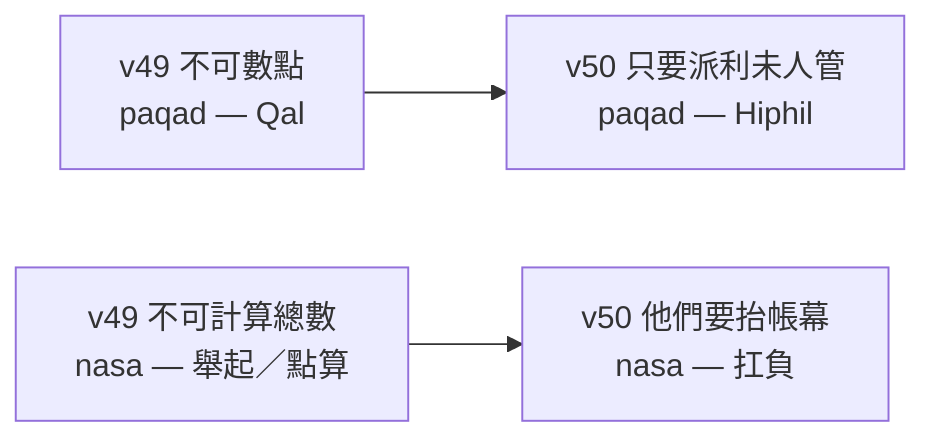

# 民數記 第1章

<!-- chapter-navigation:start -->
|  | [回目錄](../04%20民數記/全書目錄及綱要.md) | [下一章](../04%20民數記/第2章.md) |
| :--- | :---: | ---: |
<!-- chapter-navigation:end -->

1. 以色列人出埃及地後，第二年二月初一日，耶和華在[[西乃的曠野]]、[[會幕（帳幕整體）|會幕]]中曉諭[[摩西]]說：
2. 你要按以色列全會眾的[[家室與宗族|家室]]、[[家室與宗族|宗族]]、人名的數目[[數點民數|計算所有的男丁]]。
3. 凡以色列中，[[二十歲以外能打仗的|從二十歲以外]]，能出去打仗的，你和[[亞倫]]要照他們的軍隊[[數點民數|數點]]。
4. 每支派中必有一人作本支派的[[十二族長協助數點|族長]]，幫助你們。
5. 他們的名字：屬[[流便]]的，有示丟珥的兒子以利蓿；
6. 屬[[西緬]]的，有蘇利沙代的兒子示路蔑；
7. 屬猶大的，有亞米拿達的兒子[[拿順]]；
8. 屬[[以薩迦（價值）|以薩迦]]的，有蘇押的兒子拿坦業；
9. 屬[[西布倫（同住）|西布倫]]的，有希倫的兒子以利押；
10. 約瑟子孫、屬[[以法蓮]]的，有亞米忽的兒子以利沙瑪；屬[[瑪拿西]]的，有比大蓿的兒子迦瑪列；
11. 屬[[便雅憫]]的，有基多尼的兒子亞比但；
12. 屬但的，有亞米沙代的兒子亞希以謝；
13. 屬[[亞設（有福）|亞設]]的，有俄蘭的兒子帕結；
14. 屬[[迦得（萬幸）|迦得]]的，有丟珥的兒子以利雅薩；
15. 屬[[拿弗他利]]的，有以南的兒子亞希拉。
16. 這都是從會中選召的，各作本支派的[[十二族長協助數點|首領]]，都是以色列軍中的[[十二族長協助數點|統領]]。
17. 於是，[[摩西]]、[[亞倫]]帶著這些按名指定的人，
18. 當二月初一日招聚全會眾。會眾就照他們的[[家室與宗族|家室]]、[[家室與宗族|宗族]]、人名的數目，[[二十歲以外能打仗的|從二十歲以外]]的，都述說自己的[[家室與宗族|家譜]]。
19. 耶和華怎樣吩咐[[摩西]]，他就怎樣在[[西乃的曠野]][[數點民數|數點]]他們。
20. 以色列的長子，[[流便]]子孫的後代，照著[[家室與宗族|家室]]、[[家室與宗族|宗族]]、人名的數目，[[二十歲以外能打仗的|從二十歲以外]]，凡能出去打仗、[[數點民數|被數的]]男丁，共有四萬六千五百名。
21. 併於上節。
22. [[西緬]]子孫的後代，照著[[家室與宗族|家室]]、[[家室與宗族|宗族]]、人名的數目，[[二十歲以外能打仗的|從二十歲以外]]，凡能出去打仗、[[數點民數|被數的]]男丁，共有五萬九千三百名。
23. 併於上節。
24. [[迦得（萬幸）|迦得]]子孫的後代，照著[[家室與宗族|家室]]、[[家室與宗族|宗族]]、人名的數目，[[二十歲以外能打仗的|從二十歲以外]]，凡能出去打仗、[[數點民數|被數的]]，共有四萬五千六百五十名。
25. 併於上節。
26. 猶大子孫的後代，照著[[家室與宗族|家室]]、[[家室與宗族|宗族]]、人名的數目，[[二十歲以外能打仗的|從二十歲以外]]，凡能出去打仗、[[數點民數|被數的]]，共有七萬四千六百名。
27. 併於上節。
28. [[以薩迦（價值）|以薩迦]]子孫的後代，照著[[家室與宗族|家室]]、[[家室與宗族|宗族]]、人名的數目，[[二十歲以外能打仗的|從二十歲以外]]，凡能出去打仗、[[數點民數|被數的]]，共有五萬四千四百名。
29. 併於上節。
30. [[西布倫（同住）|西布倫]]子孫的後代，照著[[家室與宗族|家室]]、[[家室與宗族|宗族]]、人名的數目，[[二十歲以外能打仗的|從二十歲以外]]，凡能出去打仗、[[數點民數|被數的]]，共有五萬七千四百名。
31. 併於上節。
32. 約瑟子孫屬[[以法蓮]]子孫的後代，照著[[家室與宗族|家室]]、[[家室與宗族|宗族]]、人名的數目，[[二十歲以外能打仗的|從二十歲以外]]，凡能出去打仗、[[數點民數|被數的]]，共有四萬零五百名。
33. 併於上節。
34. [[瑪拿西]]子孫的後代，照著[[家室與宗族|家室]]、[[家室與宗族|宗族]]、人名的數目，[[二十歲以外能打仗的|從二十歲以外]]，凡能出去打仗、[[數點民數|被數的]]，共有三萬二千二百名。
35. 併於上節。
36. [[便雅憫]]子孫的後代，照著[[家室與宗族|家室]]、[[家室與宗族|宗族]]、人名的數目，[[二十歲以外能打仗的|從二十歲以外]]，凡能出去打仗、[[數點民數|被數的]]，共有三萬五千四百名。
37. 併於上節。
38. 但子孫的後代，照著[[家室與宗族|家室]]、[[家室與宗族|宗族]]、人名的數目，[[二十歲以外能打仗的|從二十歲以外]]，凡能出去打仗，[[數點民數|被數的]]，共有六萬二千七百名。
39. 併於上節。
40. [[亞設（有福）|亞設]]子孫的後代，照著[[家室與宗族|家室]]、[[家室與宗族|宗族]]、人名的數目，[[二十歲以外能打仗的|從二十歲以外]]，凡能出去打仗、[[數點民數|被數的]]，共有四萬一千五百名。
41. 併於上節。
42. [[拿弗他利]]子孫的後代，照著[[家室與宗族|家室]]、[[家室與宗族|宗族]]、人名的數目，[[二十歲以外能打仗的|從二十歲以外]]，凡能出去打仗、[[數點民數|被數的]]，共有五萬三千四百名。
43. 併於上節。
44. 這些就是被[[數點民數|數點]]的，是[[摩西]]、[[亞倫]]，和以色列中十二個[[十二族長協助數點|首領]]所數點的；這十二個人各作各[[家室與宗族|宗族]]的代表。
45. 這樣，凡以色列人中[[數點民數|被數的]]，照著[[家室與宗族|宗族]]，[[二十歲以外能打仗的|從二十歲以外]]，能出去打仗、被數的，共有六十萬零三千五百五十名。
46. 併於上節。
47. [[利未支派|利未人]]卻沒有按著支派數在其中，
48. 因為耶和華曉諭[[摩西]]說：
49. 惟獨[[利未支派]]你不可[[數點民數|數點]]，也不可在以色列人中計算他們的總數。
50. 只要派[[利未支派|利未人]]管[[會幕（帳幕整體）|法櫃的帳幕]]和其中的器具，並屬乎帳幕的；他們要抬（抬或作：搬運）帳幕和其中的器具，並要辦理帳幕的事，在帳幕的四圍安營。
51. [[會幕（帳幕整體）|帳幕]]將往前行的時候，[[利未支派|利未人]]要拆卸；將支搭的時候，利未人要豎起。[[外人近前來必被治死|近前來的外人必被治死]]。
52. 以色列人支搭帳棚，要照他們的軍隊，[[安營與纛|各歸本營]]，[[安營與纛|各歸本纛]]。
53. 但[[利未支派|利未人]]要在法櫃[[會幕（帳幕整體）|帳幕]]的四圍安營，免得忿怒臨到以色列會眾；利未人並要謹守[[會幕（帳幕整體）|法櫃的帳幕]]。
54. 以色列人就這樣行。凡耶和華所吩咐[[摩西]]的，他們就照樣行了。

---

## 本章知識節點

### 主題
- [[家室與宗族]]
- [[二十歲以外能打仗的]]
- [[安營與纛]]
- [[外人近前來必被治死]]
- [[會幕（帳幕整體）]]

### 事件
- [[數點民數]]
- [[十二族長協助數點]]
- [[六十萬零三千五百五十人（出38：26）]]

### 人物
- [[摩西]]
- [[亞倫]]
- [[拿順]]
- [[利未支派]]
- [[猶大支派]]
- [[但支派]]
- [[流便]]
- [[以法蓮]]
- [[瑪拿西]]
- [[西緬]]
- [[以薩迦（價值）]]
- [[西布倫（同住）]]
- [[迦得（萬幸）]]
- [[亞設（有福）]]
- [[拿弗他利]]
- [[便雅憫]]

### 地點
- [[西乃的曠野]]

### 神學
- [[十二支派起源]]
- [[以色列人的軍隊]]

### 背景
- [[古代近東的人口統計]]

### 解經爭議
- [[六十萬人的數目]]
- [[兩次普查的關係]]

---

## 本章整理

### 一個日期，一道命令（v1-4）

民數記開篇沒有鋪陳，直接給時間和地點：「以色列人出埃及地後，第二年二月初一日，耶和華在[[西乃的曠野]]、[[會幕（帳幕整體）|會幕]]中曉諭[[摩西]]說」（v1）。這一天距離會幕立起來剛好一個月（出40:17），距離百姓抵達西乃將近一年。GT《聖經精讀本》還算出另一頭的距離：這一天也是「以色列百姓整理陣營將要離開西乃曠野的前二十天」。換句話說，這道命令落在一個很窄的時間縫裡——律法已經頒完，會幕已經立好，隊伍還沒開拔。

GT《丁良才註釋》把會幕立起來以後發生的事排成一張十五件事的次序表，本章的[[數點民數|計算民數]]排在第十一件。看這張表最有用的地方，是它讓人知道民數記前十章的內容並不是按時間順序寫的：第七章十二支派首領獻禮物，其實發生在第一章數點民數之前。

| 次序 | 事件 | 時間／出處 |
|---|---|---|
| 1 | 立會幕 | 第二年正月初一（出40:16-33） |
| 2 | 神曉諭獻祭的禮節 | 利1:1-7:38 |
| 3 | 摩西用膏抹帳幕和器具使之成聖 | 利8:10 |
| 4 | 亞倫與他的兒子承受聖職（七日） | 利8:1-36 |
| 5 | 祭司初次供職（第八天） | 利9:1-24 |
| 6 | 拿答、亞比戶被火焚燒 | 利10 |
| 7 | 十二支派的首領奉獻禮物（每人一日） | 民7:1-88 |
| 8 | 神宣示其餘的律例 | 利11:1-27:34 |
| 9 | 神吩咐守逾越節 | 民9:1-3 |
| 10 | 以色列人守逾越節 | 正月十四日（民9:4-5） |
| 11 | 神命摩西計算民數 | 二月初一日（民1:1） |
| 12 | 設立四營 | 民2:1-34 |
| 13 | 神宣示管營的律例 | 民3:1-6:27 |
| 14 | 不潔淨的人補守逾越節之例 | 二月十四日（民9:9-14） |
| 15 | 以色列人離開西乃 | 二月二十日（民10:11-12） |

命令本身是「你要按以色列全會眾的家室、宗族、人名的數目計算所有的男丁」（v2）。GT《民數記每日研經》從這一句讀出一個貫穿舊約的模式：「上帝在與祂的百姓的關係中有一種主動性，並且採取主動……祂不是倚靠我們的信心而為我們採取行動的。」CT 則注意到說話的地點：「『會幕中』意指神和摩西面對面說話」，而「耶和華…曉諭摩西」這樣的模式，「本書至少記載了八十次以上」。GT《民數記串珠聖經註釋》把這個次數換算成密度：平均每章二點二次。

至於為什麼要數點，GT《舊約聖經背景註釋》提醒[[古代近東的人口統計|這在當時是很平常的政府行為]]，而且動機通常不好聽：「古代的人口統計是為徵召壯丁而設的，召來的男丁有時得服兵役，有時要參與官方的建築工程。政府往往同時課取人頭稅，人頭稅有時甚至是人口統計的動機。」這次數點的目的雖然是徵兵，但它與出埃及記三十章那次為收殿稅而作的統計「卻不無關係」。

### 算誰、怎麼算（v2-3, 18）

登記分三層：[[家室與宗族|家室、宗族]]、人名。STEP 原文資料把這三層的用字標得很清楚——「家室」的原形是 מִשְׁפָּחָה（mish.pa.chah，H4940，詞典義 family），「宗族」在原文不是一個字而是兩個字組成的片語，原形分別是 בַּ֫יִת（ba.yit，H1004M，house／household）與 אָב（av，H1G，father），STEP 逐字譯作「house of」加「ancestors/ their」。CT 的原文字義與這組詞形相合：「家室」作家族、部族，「宗族」作房屋、家庭。

不過這兩個中文詞誰大誰小，三家排出來的層級並不一致：

| 來源 | 對「家室」的說法 | 對「宗族」的說法 |
|---|---|---|
| CT | 略大於家庭的家族 | 介於支派和家族之間的部族 |
| GT《啟導本》 | 可譯為「家族」，比今天的「家庭」為大 | 社會的主要組成單位，大小介乎「支派」與「家室」之間 |
| GT《聖經精讀本》 | 指親屬 | 「父親」「族長」「家」的組合詞，指很多家族的聚集，就是各支派 |

讀這一段時知道有這個分歧就好，不必硬要三家對齊。

這樣登記有什麼用，GT《丁良才註釋》列了四層益處：

1. 好修成可靠的家譜
2. 得詳知各支派的人數
3. 能分佈各支派應占的位置
4. 可規定出發的次序

前兩層是行政，後兩層直接指向下一章的營盤與行軍。

對象限定在「[[二十歲以外能打仗的|從二十歲以外，能出去打仗的]]」（v3）。這句話裡藏著一組同字：STEP 顯示「能出去打仗」的「打仗」與同一節「照他們的軍隊」的「軍隊」同屬 Strong H6635，原形都是 צָבָא（tsa.va），詞典義 army／war。CT 的原文字義也記下了這件事，註明「軍隊」原文與「打仗」同字。也就是說，這一節在原文裡是「凡能出去當兵的，你們要按他們的[[以色列人的軍隊|兵團]]數點」——當兵和兵團本來就是同一個字。

第2節「計算所有的男丁」在原文其實分兩截。「男丁」的原形是 זָכָר（za.khar，H2145，詞典義 male），緊接著還有一個片語，其原形是 גֻּלְגֹּ֫לֶת（gul.go.let，H1538），詞典義正是 head，STEP 逐字譯作「to/ heads/ their」，也就是「按他們的頭數」。CT 把這層意思讀進了「男丁」一詞：「『男丁』按原文含有頭顱的意思，意指能夠出去打仗、為國家拋頭顱灑熱血的男子。」KC 把同一個片語譯成「Head by head」，卻讀出完全相反方向的重點：逐個點名表示百姓對神來說不是一團大眾，「個人不會被群體吸收掉；神認識他們每一個，一個也不會漏掉」。同一個「按頭數」，一家聽見的是為國捐軀，一家聽見的是一個都不漏。

誰不在名單上？GT《丁良才註釋》數出五等人：

- 二十歲以內的男丁
- 婦女
- 外邦人
- 利未人
- 年老不能上陣的人

GT《聖經精讀本》補上一句：「指年輕力壯的人，體弱多病和有殘疾的人不具備軍人的資格。」它同時提醒，只算男丁「並不意味著他們無視女人的人格」，而是因為這次要算的是軍隊。

第18節記下實際執行：全會眾當天集合，「都述說自己的家譜」。STEP 在這裡給出一個少見的詞形——這個動詞的原形是 יָלַד（ya.lad，H3205，詞典義 to beget，「生」），而 STEP 標的 morphology 是 Hithpael，也就是反身形，逐字譯作「they recorded their ancestry」。用「生」的反身形講登記，意思接近「各人把自己生回自己的家族裡」。KC 指出這道手續為什麼必要：出埃及的時候有「閒雜人」跟著上來（出12:38；民11:4），這些人不是以色列人，沒辦法在神面前申報自己屬於這個群體。

### 十二個族長，和他們名字的爭議（v4-16）

[[十二族長協助數點|每支派派一個人協助]]（v4），名單列在 v5-15，第16節給了他們兩個頭銜：「各作本支派的首領，都是以色列軍中的統領」。CT 把三個詞分開解釋得很細：

| 詞 | CT 的解釋 |
|---|---|
| 選召 | 才能出眾，被神按名指定 |
| 首領 | 官長，平時治理本支派的事務 |
| 統領 | 將領，戰時統帥本支派的軍士 |

同一個人，平時是官，戰時是將。

四份來源都替這十二個名字給了字義，而且都給得很完整——CT 在逐節的〔原文字義〕下列出每個族長與每個父親的名字，KC 則整批採用 Grant《Numerical Bible》的說法。把它們並排，會看到多數名字四家大致相合，少數幾個分歧不小：

| 支派 | 族長 | CT 原文字義 | KC（依 Grant） | BH |
|---|---|---|---|---|
| 流便 | 以利蓿 | 磐石是神 | 我的神是磐石 | 神是我的磐石 |
| 西緬 | 示路蔑 | 神的朋友 | 與神和好 | 神是我的平安 |
| 猶大 | 拿順 | 男巫 | 先知 | —（只記家譜與傳統） |
| 以薩迦 | 拿坦業 | 神的賜予 | 神的禮物 | 神已賜下 |
| 西布倫 | 以利押 | 神是父 | 我的神是父 | 神是父 |
| 以法蓮 | 以利沙瑪 | 我的神已經聽到 | 我的神已聽見 | 神已聽見 |
| 瑪拿西 | 迦瑪列 | 神的獎勵 | 神是賞賜者 | 神是我的獎賞 |
| 便雅憫 | 亞比但 | 我父是公義 | 我父是審判者 | 我父是審判者 |
| 但 | 亞希以謝 | 我兄弟是幫助 | 幫助的兄弟 | 我的兄弟是幫助 |
| 亞設 | 帕結 | 神的事件 | 神遇見了我 | 神介入／神與我相遇 |
| 迦得 | 以利雅薩 | 神已加添 | 神已加添 | 神已加添／神使增多 |
| 拿弗他利 | 亞希拉 | 我兄弟是惡毒的 | 惡的兄弟 | 惡的兄弟／我的兄弟是朋友 |

父親那一欄同樣有完整資料，而且主題很集中——十二個父名裡有四個扣著「磐石」或「全能者」：

| 族長之父 | CT 原文字義 | KC（依 Grant） | BH |
|---|---|---|---|
| 示丟珥（流便） | 迅光 | 全能者是火焰 | 光之田 |
| 蘇利沙代（西緬） | 我的磐石是全能的 | 我的磐石是全能者 | 我的磐石是全能者 |
| 亞米拿達（猶大） | 我的親屬是高貴的 | 甘心賜予者的子民 | 我的親屬是尊貴的 |
| 蘇押（以薩迦） | 渺小 | 微小 | —（僅見於家譜） |
| 希倫（西布倫） | 力量 | 字義過於不確定 | —（僅見於家譜） |
| 亞米忽（以法蓮） | 我的親屬是尊貴的 | 威嚴者的子民 | 榮耀的子民 |
| 比大蓿（瑪拿西） | 磐石已贖回 | 施贖的磐石 | 磐石已贖回 |
| 基多尼（便雅憫） | 我的砍伐者 | 砍伐者 | —（僅此一處提及） |
| 亞米沙代（但） | 我的親屬是大有能力的 | 全能者的子民 | 全能者的子民／我的親屬是全能者 |
| 俄蘭（亞設） | 憂慮的 | 受苦的 | —（僅見於家譜） |
| 丟珥（迦得） | 他們認識神 | 為神所識 | 神的朋友（另有抄本作流珥） |
| 以南（拿弗他利） | 有眼睛 | 看見 | —（僅作家譜連結） |

分歧最明顯的是西緬支派的示路蔑：CT 作「神的朋友」，GT《啟導本》作「神是我的拯救」，KC 作「與神和好」，BH 作「神是我的平安」。猶大支派的拿順也一樣，CT 作「男巫」，KC 作「先知」——兩者在中文裡幾乎是相反的評價。父名那邊，示丟珥的落差更大：CT 的「迅光」與 KC 的「全能者是火焰」、BH 的「光之田」，只共用一個「光」字。

有意思的是，KC 自己就對這件事提出警告。他說名字在聖經裡確實有意義，希伯來書第七章就示範了可以從名字學到屬靈功課，「但要緊的是保持警醒，不要落入幻想。有些名字有多個意思」，要確定一個名字的意思，最好查閱幾本聖經人名辭典，幾本都給同一個意思才比較可靠。他接著才說明自己採用的是 Grant 的字義，並把判斷權留給讀者。四家給出四個不同的示路蔑，正好說明了他的顧慮。KC 對希倫乾脆註明字義「過於不確定」而不給答案，也是同一種節制。

各家倒是在一件事上一致：這些名字裡多半有神的名字在響。KC 指出「El」就是「神」，這顯示以色列人在埃及寄居期間並沒有忘記他們的神，而是把對神的記念放進了給孩子取的名字裡。十二個族長裡，以利蓿、示路蔑、拿坦業、以利押、以利沙瑪、迦瑪列、帕結、以利雅薩八個名字都帶著這個字根。

名單裡最有來歷的是[[猶大支派]]的[[拿順]]。GT《丁良才註釋》給了兩層身分：「拿順是[[亞倫]]的妻兄（出六23），也是大衛的先祖。」BH 補上第三層：他出現在馬太福音一4 與路加福音三32 耶穌的家譜裡，而且猶太傳統高度推崇他，常把信心之舉歸給他——例如紅海分開之前，第一個踏進海裡的就是拿順。另外兩個名字也有下文：GT《丁良才註釋》指出以法蓮的族長以利沙瑪「是約書亞的祖父（代上七26-27）」，而 GT《丁良才註釋》在 v4 就推測這批族長「大概是摩西先前所分派的首領」（參出18:21-26）。

### 十二個數字（v20-46）

第20到46節是全章篇幅最大的一段，格式高度固定：支派名、按家室宗族人名、二十歲以外能打仗、被數的、多少名。逐支派報完，第46節給總數：[[六十萬零三千五百五十人（出38：26）|六十萬零三千五百五十名]]。

| 支派 | 民1 人數 | 民26 人數 | 增減 |
|---|---|---|---|
| 流便 | 46,500 | 43,730 | −2,770 |
| 西緬 | 59,300 | 22,200 | −37,100 |
| 迦得 | 45,650 | 40,500 | −5,150 |
| 猶大 | 74,600 | 76,500 | +1,900 |
| 以薩迦 | 54,400 | 64,300 | +9,900 |
| 西布倫 | 57,400 | 60,500 | +3,100 |
| 以法蓮 | 40,500 | 32,500 | −8,000 |
| 瑪拿西 | 32,200 | 52,700 | +20,500 |
| 便雅憫 | 35,400 | 45,600 | +10,200 |
| 但 | 62,700 | 64,400 | +1,700 |
| 亞設 | 41,500 | 53,400 | +11,900 |
| 拿弗他利 | 53,400 | 45,400 | −8,000 |
| 合計 | 603,550 | 601,730 | −1,820 |

這張對照表出自 GT《民數記串珠聖經註釋》，它並指出：「人口減少得最厲害的是西緬支派，這可能是25章提到的瘟疫所致；數目增加得最多的是瑪拿西支派，原因不詳。」

有一個細節值得留意：所有支派的人數都以百為單位收尾，只有迦得支派是45,650。GT《丁良才註釋》記下這件事和一種解釋：「除了迦得支派以外，十二支派都是記整數，沒有記零數，有人以為這一次的計算，是為預備打仗，所以只記五十個以上的整數。」GT《啟導本》也記了同一件事，說人數都以百為單位，「只有迦得支派降到十位的50」。

這個總數還牽出兩場爭論。第一場是[[兩次普查的關係|它和出埃及記三十八章26節那個一模一樣的數字有什麼關係]]，四家的答案並不一致：

| 來源 | 主張 | 兩次相隔 |
|---|---|---|
| GT《丁良才註釋》 | 兩次計算「是相連的」，是同一件事的兩半 | 約一個多月 |
| GT 賈斯樂郝威《聖經難解經文詮釋手冊》 | 兩次不同目的：出38 為宗教目的，民1 為軍事目的 | 日期相近不遠 |
| GT《民數記串珠聖經註釋》 | 沿用舊資料但目的不同 | 數月前 |
| KC | 對應先前一次普查 | 約九個月前 |

丁良才主張相連的理由之一是利未人的缺席：「利未人在民一章上沒有被數點，在出三十八上他們也沒有被數點，因為二次的數目是一樣的。」

第二場爭論是[[六十萬人的數目|這個數字換算成總人口有多少、可不可能]]：

| 來源 | 換算的總人口 | 態度 |
|---|---|---|
| GT《啟導本》 | 約二百萬 | 記下史家的質疑（地理、資源養不活），自己不站邊 |
| GT《丁良才註釋》 | 二百四十餘萬 | 視為神的保護 |
| GT《聖經精讀本》 | 單男丁即六十萬 | 直接當神蹟：「若靠自然能力這是不可能的」 |

啟導本把重點轉開的那句話值得記下來：「不問史家如何解說，數點人口的屬靈教訓是十分明白的。」

排在第一個的是[[流便]]，經文特別說明「以色列的長子」。CT 指出流便「因犯淫亂而失去長子的名份，被猶大和約瑟兩人分得」——名分沒了，位置還在。GT《聖經精讀本》說這正好顯示這段記錄「是以歷史事實為中心，而不是以屬靈事實為中心」。

### 不可數點的那一支（v47-54）

最後八節突然轉向：「[[利未支派|利未人]]卻沒有按著支派數在其中」（v47）。神的吩咐是「惟獨利未支派你不可數點，也不可在以色列人中計算他們的總數」（v49），接著改派他們管法櫃的帳幕、拆卸豎立搬運、在帳幕四圍安營並謹守（v50-53）。

這兩節在原文裡有一組很漂亮的對照，是四份註釋都沒有明說的。STEP 原文資料顯示，第49節「不可數點」和第50節「只要派利未人管」用的是同一個動詞 פָּקַד（pa.qad，H6485）——前者是 Qal，後者是 Hiphil 命令式，STEP 逐字譯作 appoint。同一節裡，第49節「也不可…計算他們的總數」和第50節「他們要抬帳幕」也是同一個動詞 נָשָׂא（na.sa，H5375）——前者取「舉起／點算」的意思，後者取「扛負」的意思。

```mermaid
flowchart LR
    A["v49 不可數點<br/>paqad — Qal"] --> B["v50 只要派利未人管<br/>paqad — Hiphil"]
    C["v49 不可計算總數<br/>nasa — 舉起／點算"] --> D["v50 他們要抬帳幕<br/>nasa — 扛負"]
```

換成白話：同一個「點」字，對別的支派是「點進兵冊」，對利未人是「點派職務」；同一個「舉」字，對別的支派是「舉起頭數」，對利未人是「舉起帳幕」。他們不是被漏掉，是被改派。

CT 的〔話中之光〕正好落在這個轉折上：「在以色列人的數點上，神沒有數點利未人，不是利未人不配為神的目的上前線作戰，而是神要他們承擔更重要的任務，為神的軍隊鞏固後方。」它接著說，前方接戰最吸引注意力，但屬靈的爭戰「並不是注意爭戰的激烈度，而是重在見證的持守」。

順帶一提，第47節「利未人卻沒有按著支派數在其中」這個動詞，STEP 標的 morphology 是 Hothpaal 被動式，是本章唯一一次出現這個語態。全章二十二次用到 פָּקַד，只有講到利未人沒被數的這一次換了語態。

利未人並非完全不數，只是換一套數法。GT《丁良才註釋》說得清楚：不像十二支派只數二十歲以外能打仗的，利未人是「從一個月以外的，一切男子就都被數點了」（民3:14-39）。他並追溯這個職分的起點：利未人早在金牛犢事件中就已為耶和華熱心（出32:26-29；申33:8-9），也曾幫助祭司（出38:21），「他們到這時候方被分派襄辦帳幕的事」。GT《啟導本》補上支派結構：利未有三子革順、哥轄和米拉利（創46:11），摩西和亞倫都是哥轄的子孫；利未人沒有分得迦南的地業，分住在各支派的城邑中（書21章）；早期侍奉的年歲為三十至五十歲，後來降到二十歲（代下31:7）。

第51節下半那句「[[外人近前來必被治死|近前來的外人必被治死]]」，「外人」是誰，同一份 GT 拾穗裡就有兩種讀法：《啟導本》說從會幕的侍奉來說，非利未人的以色列人都算外人，CT 也採這個較寬的範圍；但丁良才把它注得更窄——「『外人』——就是外族人」。

第52節安排安營：「以色列人支搭帳棚，要照他們的軍隊，[[安營與纛|各歸本營，各歸本纛]]。」「纛」的原形，STEP 作 דֶּ֫גֶל（de.gel，H1714），詞典義是 standard。這個字究竟指旗幟還是別的，GT《舊約聖經背景註釋》並列兩種讀法：一種按旗幟解，因為「埃及軍兵每個部隊都是以神祇為名，旗幟（纛）之上都有所屬神祇的標記」，所以假定每支派的纛上都有代表自己的標記是理所當然；「但另一方面，亦有釋經家將這字解作軍兵的單位，而非旗幟」。

同一則註釋還為營盤形制給了兩個不同文明的背景，讀的時候要分開：營盤呈方形「是這時代埃及的慣例」，而君王位居受保護的中央則見於「主前九世紀的亞述藝術」。它並解釋四營的排序：猶大領導最重要的東營，因為聖幕入口朝東；長子流便領導南營；[[但支派]]為北營之首，「因為但是妾生眾子最長的一個」；拉結眾子的支派位於西面，其中以[[以法蓮]]與[[瑪拿西]]兩支派補上約瑟的位置（見[[十二支派起源]]）。

全章收在一句順服上：「以色列人就這樣行。凡耶和華所吩咐摩西的，他們就照樣行了」（v54）。KC 用一句話總結這一章的百姓：他們的特徵就是聽命而行。

**參考資料**
https://www.ccbiblestudy.org/Old%20Testament/04Num/04CT01.htm
https://www.ccbiblestudy.org/Old%20Testament/04Num/04GT01.htm
https://www.kingcomments.com/en/bible-studies/Num/1
https://biblehub.com/study/numbers/1.htm
https://github.com/STEPBible/STEPBible-Data

<!-- appendix-links:start -->
## 附錄

### 相關地圖
- [[appendix/fhl_maps/maps/019|〈出圖二〉以色列人出埃及到西乃山]]
- [[appendix/fhl_maps/maps/020|〈民圖一〉從西乃山到加低斯]]
<!-- appendix-links:end -->

<!-- chapter-navigation:start -->
|  | [回目錄](../04%20民數記/全書目錄及綱要.md) | [下一章](../04%20民數記/第2章.md) |
| :--- | :---: | ---: |
<!-- chapter-navigation:end -->
