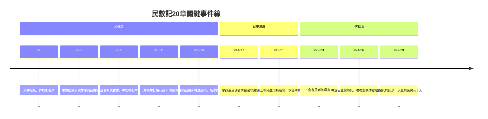

# 民數記 第20章

1. [[米利暗死在加低斯|正月間]]，以色列全會眾到了尋的曠野，就住在[[加低斯]]。[[米利暗死在加低斯|米利暗死]]在那裡，就葬在那裡。
2. 會眾[[會眾無水攻擊摩西亞倫|沒有水喝]]，就聚集攻擊[[摩西]]、[[亞倫]]。
3. 百姓[[會眾無水攻擊摩西亞倫|向摩西爭鬧]]說：我們的弟兄曾死在耶和華面前，我們恨不得與他們同死。
4. 你們為何把耶和華的會眾領到這曠野、使我們和牲畜都死在這裡呢？
5. 你們為何逼著我們出埃及、領我們到這[[會眾無水攻擊摩西亞倫|壞地方]]呢？這地方不好撒種，也沒有無花果樹、葡萄樹、石榴樹，又[[會眾無水攻擊摩西亞倫|沒有水喝]]。
6. [[摩西]]、[[亞倫]][[摩西亞倫俯伏會幕門口|離開會眾]]，到[[摩西亞倫俯伏會幕門口|會幕門口]]，[[摩西亞倫俯伏會幕門口|俯伏在地]]；耶和華的榮光向他們顯現。
7. 耶和華曉諭[[摩西]]說：
8. 你[[神吩咐摩西吩咐磐石出水|拿著杖去]]，和你的哥哥[[亞倫]][[神吩咐摩西吩咐磐石出水|招聚會眾]]，在他們眼前吩咐磐石[[神吩咐摩西吩咐磐石出水|發出水來]]，水就從磐石流出，給會眾和他們的牲畜喝。
9. 於是[[摩西]]照耶和華所吩咐的，[[摩西擊打磐石兩下出水|從耶和華面前取了杖]]去。
10. [[摩西]]、[[亞倫]]就[[摩西擊打磐石兩下出水|招聚會眾到磐石前]]。摩西說：你們這些[[摩西擊打磐石兩下出水|背叛的人]]聽我說：我為你們使水從這磐石中流出來嗎？
11. [[摩西]]舉手，用杖[[摩西|擊打磐石]]兩下，就有許多[[摩西擊打磐石兩下出水|水流出來]]，會眾和他們的牲畜都喝了。
12. 耶和華對[[摩西]]、[[亞倫]]說：因為你們不信我，不在以色列人眼前尊我為聖，所以你們必不得領這會眾進我所賜給他們的地去。
13. 這水名叫[[米利巴水]]（米利巴就是[[米利巴（ strife ）|爭鬧]]的意思），是因以色列人[[米利巴水|向耶和華爭鬧]]，耶和華就在他們面前[[米利巴水|顯為聖]]。
14. [[摩西]]從[[加低斯]][[摩西差遣使者見以東王|差遣使者]]去見以東王，說：你的弟兄以色列人這樣說：我們所遭遇的一切艱難，
15. 就是我們的列祖下到埃及，我們在埃及久住；埃及人惡待我們的列祖和我們，
16. 我們哀求耶和華的時候，他聽了我們的聲音，[[摩西差遣使者見以東王|差遣使者]]把我們從埃及領出來。這事你都知道。如今，我們在你邊界上的城[[加低斯]]。
17. 求你容我們從你的地經過。我們不走田間和葡萄園，也不喝井裡的水，只[[以東拒絕以色列經過|走大道]]（原文作王道），不偏左右，直到過了你的境界。
18. 以東王說：你不可從我的地經過，免得我帶刀出去攻擊你。
19. 以色列人說：我們要[[以東拒絕以色列經過|走大道]]上去；我們和牲畜若喝你的水，必給你價值。不求別的，只求你容我們步行過去。
20. 以東王說：你們[[以東拒絕以色列經過|不可經過]]！就率領許多人出來，要用強硬的手攻擊以色列人。
21. 這樣，以東王不肯容以色列人從他的境界過去。於是他們轉去，離開他。
22. 以色列全會眾從[[加低斯]]起行，到了何珥山。
23. 耶和華在附近[[何珥山|以東邊界]]的何珥山上曉諭[[摩西]]、[[亞倫]]說：
24. [[亞倫]]要歸到他列祖（原文作本民）那裡。他必不得入我所賜給以色列人的地；因為在[[米利巴水]]，你們違背了我的命。
25. 你帶[[亞倫]]和他的兒子[[以利亞撒]]上何珥山，
26. 把[[亞倫]]的聖衣脫下來，給他的兒子[[以利亞撒]]穿上；亞倫必死在那裡，歸他列祖。
27. [[摩西]]就照耶和華所吩咐的行。三人當著會眾的眼前上了何珥山。
28. [[摩西]]把[[亞倫]]的聖衣脫下來，給他的兒子[[以利亞撒]]穿上，亞倫就死在[[何珥山|山頂]]那裡。於是摩西和以利亞撒下了山。
29. 全會眾，就是以色列全家，見[[亞倫]]已經死了，便都為亞倫哀哭了三十天。

<!-- fhl-map-links:start -->
## 相關地圖

- [[appendix/fhl_maps/maps/022|〈民圖三〉從何珥山到摩押平原]]
- [[appendix/fhl_maps/maps/024|〈民圖五〉出埃及和進迦南的旅程]]
<!-- fhl-map-links:end -->

---

## 本章知識節點

### 人物
- [[米利暗]]
- [[摩西]]
- [[亞倫]]
- [[以利亞撒]]
- [[以東王]]

### 地點
- [[尋的曠野]]
- [[加低斯]]
- [[何珥山]]
- [[何珥山（Hor haHar）]]

### 事件
- [[米利暗死在加低斯]]
- [[會眾無水攻擊摩西亞倫]]
- [[摩西亞倫俯伏會幕門口]]
- [[神吩咐摩西吩咐磐石出水]]
- [[摩西擊打磐石兩下出水]]
- [[摩西不信不尊主為聖]]
- [[米利巴水]]
- [[摩西差遣使者見以東王]]
- [[以色列求經過以東被拒（民20：14-21）]]
- [[以東拒絕以色列經過]]
- [[亞倫死在何珥山]]
- [[大祭司職分傳承]]

### 神學
- [[磐石出水預表基督活水]]
- [[磐石（tsur）]]
- [[亞倫死預表大祭司更換（來7：23-24）]]

### 爭議
- [[摩西擊打磐石違背預表（民20：11-12）]]
- [[摩西擊打磐石是否故意違命]]
- [[亞倫死因是否僅因米利巴之罪]]

### 關係
- [[以色列與以東弟兄關係]]

---

## 本章整理

### 米利暗之死與加低斯新危機（v1-5）
正月，以色列全會眾來到 [[尋的曠野|尋的曠野]] 的 [[加低斯|加低斯]]。[[米利暗|米利暗]] 死在那裡，葬在那裡——這位曾在紅海邊領唱詩歌的女先知，結束了四十年曠野生涯。緊接著，會眾因無水喝再次聚集攻擊 [[摩西|摩西]]、[[亞倫|亞倫]]，控訴他們將耶和華的會眾領到這「壞地方」死在曠野，甚至恨不得早死在耶和華面前（v3-5）。這場危機與出埃及記17章利非訢試探神的事件形成鏡像，卻更顯悲涼：老一代幾乎盡亡，新一代仍重蹈覆轍。

### 米利巴水：擊打磐石與領袖的失敗（v6-13）
摩西、亞倫退到會幕門口俯伏，耶和華的榮光顯現。神吩咐摩西「拿著杖去……在他們眼前吩咐磐石發出水來」（v8）。然而摩西卻對會眾說：「你們這些背叛的人聽我說：我為你們使水從這磐石中流出來嗎？」隨即舉杖擊打磐石兩下（v10-11）。水雖湧出，神卻宣判：「因為你們不信我，不在以色列人眼前尊我為聖，所以你們必不得領這會眾進我所賜給他們的地去」（v12）。這處 [[米利巴水|米利巴水]]（意即「爭鬧」）見證神在審判中仍施恩，卻也標誌著摩西、亞倫領導權的終結。

> [!important] 關鍵神學張力
> - **預表破裂**：保羅在林前10:4指磐石預表基督——基督一次被擊打（十字架）便賜活水永流不息。摩西再次擊打，破壞了「一次成就、永遠有效」的救贖預表（[[磐石出水預表基督活水|磐石出水預表基督活水]]）。
> - **「不信」與「不尊為聖」**：摩西的罪不僅是違命，更是將榮耀歸自己（「我為你們使水流出來嗎？」），未將聖潔彰顯於百姓眼前（[[摩西不信不尊主為聖|摩西不信不尊主為聖]]）。

### 以東拒絕：弟兄國的關門（v14-21）
摩西從加低斯差遣使者見 [[以東王|以東王]]，以「弟兄」身分（雅各/以色列與以掃/以東）請求走「王道」經過，承諾不飲井水、不踐田園、付費飲水（v14-19）。以東王卻以刀劍相向拒絕，甚至率軍出來攻擊（v20-21）。這段 [[以色列與以東弟兄關係|以色列與以東弟兄關係]] 的破裂，預示後來以東在巴比倫入侵時落井下石（俄巴底亞書），也迫使以色列繞道而行，延長曠野旅程。

### 亞倫之死與大祭司職分傳承（v22-29）
會眾來到 [[何珥山|何珥山]]（即 [[何珥山（Hor haHar）|Hor haHar]]）。神宣告亞倫因在米利巴水違命，必死於此，不得進迦南（v24）。摩西遵命帶亞倫和兒子 [[以利亞撒|以利亞撒]] 上山，當眾將亞倫的聖衣脫下給以利亞撒穿上；亞倫死於山頂，全會眾為他哀哭三十天（v27-29）。這場 [[大祭司職分傳承|大祭司職分傳承]] 以可見儀式確立：舊秩序在曠野結束，新大祭司在應許之地前接棒。

> [!note] 亞倫死因的釋經討論
> 經文明說「因為在米利巴水，你們違背了我的命」（v24），但亞倫在擊打磐石事件中似屬被動配合。學者討論 [[亞倫死因是否僅因米利巴之罪|亞倫死因是否僅因米利巴之罪]]，或包含金牛犢事件（出32）的積累責任。希伯來書7:23-24以此對比：利未祭司因死而阻隔，惟基督永遠活著，擁有「不更改的祭司職分」（[[亞倫死預表大祭司更換（來7：23-24）|亞倫死預表大祭司更換]]）。

### 跨章脈絡：從米利巴到約旦河東——審判與恩典的雙重奏
本章集中呈現「曠野世代」的終結：米利暗死、摩西亞倫被判不得入地、亞倫死於何珥山。然而 [[磐石出水預表基督活水|磐石出水]] 仍賜下生命水，[[以利亞撒|以利亞撒]] 接任大祭司延續中保職分，神的應許未因人失敗而落空。這張力貫穿民數記後段（銅蛇、巴蘭、第二次人口普查），直指約書亞記渡過約旦河的新開始。

> [!question] 留待後章追蹤
> - 摩西在申命記如何回顧此事（申1:37, 3:26, 32:51）？
> - 以利亞撒在分地（書14:1）、約書亞受任（民27:18-23）中扮演何種角色？
> - 以東拒絕經過對後來以色列繞道摩押、亞摩利地有何戰略影響？

**參考資料**
https://www.ccbiblestudy.org/Old%20Testament/04Num/04CT20.htm
https://www.ccbiblestudy.org/Old%20Testament/04Num/04GT20.htm
https://www.kingcomments.com/en/bible-studies/Num/20
https://biblehub.com/study/numbers/20.htm
