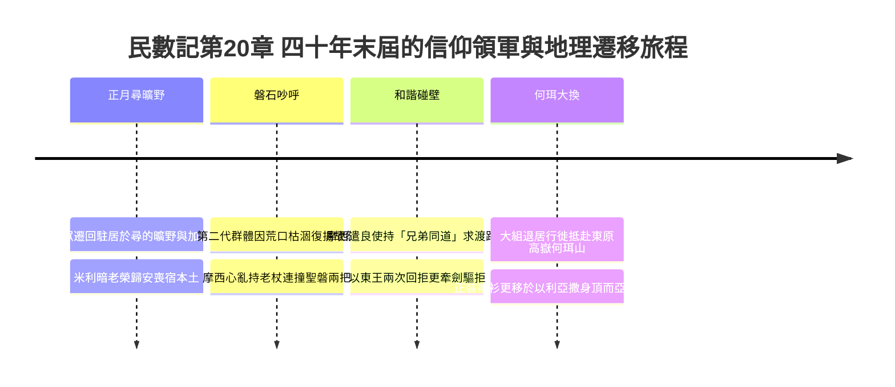
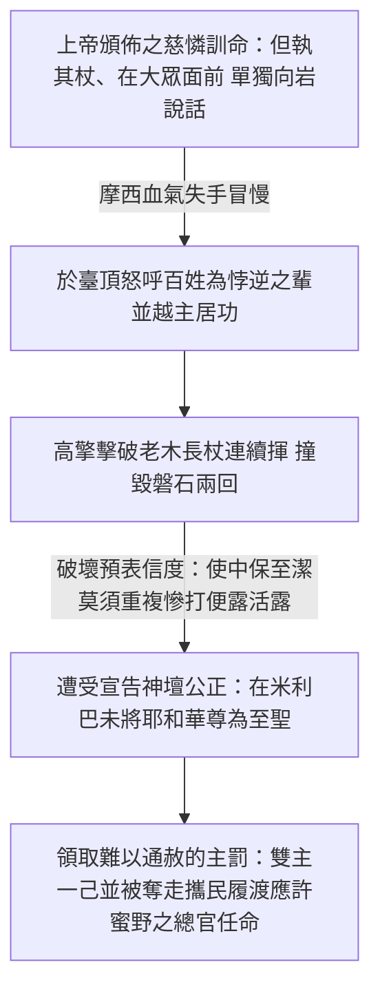
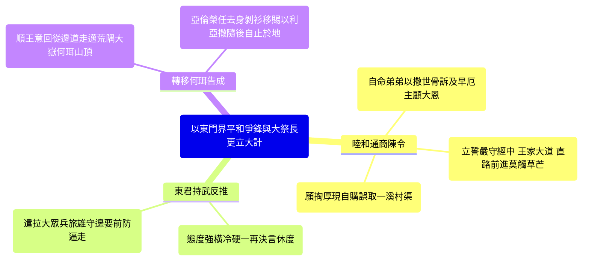

# 民數記 第20章

1. 正月間，以色列全會眾到了尋的曠野，就住在加低斯。米利暗死在那裡，就葬在那裡。
2. 會眾沒有水喝，就聚集攻擊摩西、亞倫。
3. 百姓向摩西爭鬧說：我們的弟兄曾死在耶和華面前，我們恨不得與他們同死。
4. 你們為何把耶和華的會眾領到這曠野、使我們和牲畜都死在這裡呢？
5. 你們為何逼著我們出埃及、領我們到這壞地方呢？這地方不好撒種，也沒有無花果樹、葡萄樹、石榴樹，又沒有水喝。
6. 摩西、亞倫離開會眾，到會幕門口，俯伏在地；耶和華的榮光向他們顯現。
7. 耶和華曉諭摩西說：
8. 你拿著杖去，和你的哥哥亞倫招聚會眾，在他們眼前吩咐磐石發出水來，水就從磐石流出，給會眾和他們的牲畜喝。
9. 於是摩西照耶和華所吩咐的，從耶和華面前取了杖去。
10. 摩西、亞倫就招聚會眾到磐石前。摩西說：你們這些背叛的人聽我說：我為你們使水從這磐石中流出來嗎？
11. 摩西舉手，用杖擊打磐石兩下，就有許多水流出來，會眾和他們的牲畜都喝了。
12. 耶和華對摩西、亞倫說：因為你們不信我，不在以色列人眼前尊我為聖，所以你們必不得領這會眾進我所賜給他們的地去。
13. 這水名叫米利巴水（米利巴就是爭鬧的意思），是因以色列人向耶和華爭鬧，耶和華就在他們面前顯為聖。
14. 摩西從加低斯差遣使者去見以東王，說：你的弟兄以色列人這樣說：我們所遭遇的一切艱難，
15. 就是我們的列祖下到埃及，我們在埃及久住；埃及人惡待我們的列祖和我們，
16. 我們哀求耶和華的時候，他聽了我們的聲音，差遣使者把我們從埃及領出來。這事你都知道。如今，我們在你邊界上的城加低斯。
17. 求你容我們從你的地經過。我們不走田間和葡萄園，也不喝井裡的水，只走大道（原文作王道），不偏左右，直到過了你的境界。
18. 以東王說：你不可從我的地經過，免得我帶刀出去攻擊你。
19. 以色列人說：我們要走大道上去；我們和牲畜若喝你的水，必給你價值。不求別的，只求你容我們步行過去。
20. 以東王說：你們不可經過！就率領許多人出來，要用強硬的手攻擊以色列人。
21. 這樣，以東王不肯容以色列人從他的境界過去。於是他們轉去，離開他。
22. 以色列全會眾從加低斯起行，到了[[何珥山]]。
23. 耶和華在附近以東邊界的[[何珥山]]上曉諭摩西、亞倫說：
24. 亞倫要歸到他列祖（原文作本民）那裡。他必不得入我所賜給以色列人的地；因為在米利巴水，你們違背了我的命。
25. 你帶亞倫和他的兒子以利亞撒上[[何珥山]]，
26. 把亞倫的聖衣脫下來，給他的兒子以利亞撒穿上；亞倫必死在那裡，歸他列祖。
27. 摩西就照耶和華所吩咐的行。三人當著會眾的眼前上了[[何珥山]]。
28. 摩西把亞倫的聖衣脫下來，給他的兒子以利亞撒穿上，亞倫就死在山頂那裡。於是摩西和以利亞撒下了山。
29. 全會眾，就是以色列全家，見亞倫已經死了，便都為亞倫哀哭了三十天。

---

## 本章知識節點

### 事件
- [[米利暗卒於加低斯]]
- [[摩西擊打磐石兩下]]

### 神學
- [[在米利巴未將耶和華尊為聖]]
- [[亞倫卒於何珥山與祭司職任更替]]

### 歷史
- [[以東王拒絕以色列人假道]]

### 地點
- [[何珥山]]

---

## 本章整理

### 四十年荒旅的長老退宿序曲與加低斯重蹈枯旱狂言（v1-9）

民數記第20章在整部曠野開拓史中堪稱極端的時代分水嶺 —— 它正式告終了以色列人民圍繞長原的漫漫潛逃靜滯期，迎來了出埃及後「第四十年」之突前轉進與第一世長官的集中告解退任。章始即以極為冷肅深摯的紀年記下 [[米利暗卒於加低斯|「女先知與初越舊民米利暗落墓加低斯」]] 之一語記錄（v1）。作為摩西與亞倫大兄姊與婦道信仰統領者，其辭世不僅刻落於尋地之加低斯泉畔，並且在天道歷史上吹起老年代會群與領袖因為曾經探地心疑而將受判全宿郊林之具體應實進程。

```mermaid
timeline
    title 民數記第20章 四十年末屆的信仰領軍與地理遷移旅程
    正月尋曠野 : 會眾遷回駐居於尋的曠野與加低斯 : 米利暗老榮歸安喪宿本土
    磐石吵呼 : 第二代群體因荒口枯涸復揚故怨 : 摩西心亂持老杖連撞聖磐兩把
    和諧碰壁 : 摩西遣良使持「兄弟同道」求渡路境 : 以東王兩次回拒更牽劍驅拒
    何珥大換 : 大組退居行徙抵赴東原 高嶽何珥山 : 正裝袍衫更移於以利亞撒身頂而亞倫入息
```

伴隨而生者，是成長起來之新世民戶因水源乏枯再次陷入先民那樣暴烈不知敬惜之口怨：「會眾沒有水喝...就聚居攻擊摩西和亞倫」（v2）。群聲咒嗟願與舊黨皆亡、埋怨神領帶投不毛長荒（v3-5）。上帝顯現出至聖光懷中的忍大和愛；既聽聞摩西亞倫仆倒會庭、便毫無降火天懌之責，極顯寬憫地直示領手：「你拿著杖...招呼會眾，在他們眼前 **向磐石說話**，磐石就必發出水來」（v8）。此段在釋經學（如丁良才《拾穗》）與新約聖經寓學上有極高規格預表：昔年利非訂上帝經已敕呼摩西用手「狠狠擊破磐石」，表徵為我們頂禍之中保 —— 耶穌基督 —— 受苦吃擊遭剖釘而打開洗宥長川（前例曾記）；如今主再展活水時，已明言斷勿施棒撻，惟需秉持信心於其跟前宣喊口誦！

### 摩西破壞舊儀宣愛、失控用杖撞擊與公定威重神審（v10-13）

然而在這嚴肅而恩憫開顯的重頭前，希伯來首席大宰卻經歷一生最深而後遺永致的重大仆覆 —— 那便成就了名垂歷史警戒之 [[摩西擊打磐石兩下|「先知怒揚喝斥悖逆人後且提長杖連拍冷崖兩度」]] 的悲憾一回（v10-11）。《基督徒文摘解經系列》（CT）等各大釋卷指出：摩西荷撐這夥常發怒言的民頑逾四十秋、心情沉苦積憤；此日血氣爆發於神之平氣仁愛之前。其二度大錯甚深且猛：首先他在向群下開叱處逾越職格，言詞稱：「你們這些悖逆的人聽說吧...我與亞倫為你們使水從這磐石中流出來嗎？」這既懷有血肉意氣成憤之急熱、且言意語間忽將上空奇德當成私人造恩手段！更關鍵為第二罪著，他不惜置聖主告令「 **唯言說** 」的慈音莫顧，舉手使破老舊擊水長杖，「往那磐石直接擊撞兩回」！斯牽連的壞象甚是震撼：使神既遭敲劈定罪無需二次挨苦的預定活磐重披凶打，混淆了救天浩泉「單需靠口稱求恩」的神潔大理。

```mermaid
flowchart TD
    A["上帝頒佈之慈憐訓命：但執其杖、在大眾面前 單獨向岩說話"] -->|摩西血氣失手冒慢| B["於臺頂怒呼百姓為悖逆之輩並越主居功"]
    B --> C["高擎擊破老木長杖連續揮 撞毀磐石兩回"]
    C -->|破壞預表信度：使中保至潔莫須重複慘打便露活露| D["遭受宣告神壇公正：在米利巴未將耶和華尊為至聖"]
    D --> E["領取難以通赦的主罰：雙主一己並被奪走攜民履渡應許蜜野之總官任命"]
```

纵然主依然憐厚民情引噴廣流解旱（v11，這顯陳上天決非賴人言純方降愛恩），但這冒犯直接觸破了對聖所居安高潔和榮耀的主格。上帝果明毫無限遲於次發出那千真重磅無容妥協的大案宣讞 —— 這成名錄是為 [[在米利巴未將耶和華尊為聖|「上帝痛定主官乏缺真信奉並未彰露聖名光愛於大眾前方」]]（v12）。「因為你們不信我，不在以色列人眼前尊我為聖，所以你們必不得領這會眾進我所賜給他們的境涯去！」《KingComments》與《BibleHub》合稱斯地冠稱新任「米利巴（原語含意為大聲喧爭或頂撞之地）」的理由：越處天國首要聖召神役之人，上帝要看他身言遵從不雜一毫自我之純心即加萬倍嚴正；一旦稍摻肉情狂自而覆蔽了天帝原有和平神愛之宣榮，哪怕為無數豐功開朝世祖，皆難逃「不可足渡應許終疆」的高曠威令。

| 代表在台心跡與外施表現 | 不合道體之罪本落實要項 | 上天公正執法及長遠警戒象徵 |
| :--- | :--- | :--- |
| **破命揮木擊磐石兩手** | 拒聽唯單口稱「向岩說言」溫柔指示；打破不可常捶成活大恩碑。 | 護主榮愛與聖徒稱賴代功預度，宣白真愛救恤一但破功即便嚴罰。 |
| **怒唱我與兄作水流否** | 情緒暴走指罵大會為悖逆一夥；忽掩主宰恩容轉自當立功力主。 | 重宣告誡僕官若蓋沒主王恩面致虧尊稱，即便老驥終失引途終權。 |

### 求索大道被悍軍擋封、長往何珥大頂及亞倫卸任辭終（v14-29）

歷盡內部吵喊與受誡折騰，隊旅轉思著往國邊大道邁程。於加低斯荒麓，摩西以周密和平的兄弟言順遞傳了震爍當時的外交申約 —— 斯即是名在簡策之 [[以東王拒絕以色列人假道|「持以撒同派世骨弟兄為辭求步大道而屢遭到兇戎擋門」]] 的交涉爭況（v14-21）。以色列專任使夫宣稱本隊「弟弟以色列」，細繪南征苦楚與仰父釋放大史；更言信立立言唯尋最要商往直軌「大道」（即貫牽敘利亞中東至南方紅海口商業動盪要塗：王權大路 The King's Highway）；既決不蹂踏兩翼田林果池、凡倘有小兵牛牧誤尋一口村水亦願千真解銀為抵！如此忍厚退讓，換得的卻是君國極剛堅逆與抽舞鋼槍之武裝橫攔。為應天旨護珍以掃親族古土與不得恃勇肆討之老信（申2:4-6），聖團當休即平和往旁東彎而去，展放進山林遷途。

```mermaid
mindmap
    root("以東門界平和爭鋒與大祭長更立大計")
        睦和通商陳令
            ("自命弟弟以撒世骨訴及早厄主顧大恩")
            ("立誓嚴守經中 王家大道 直路前進莫觸草芒")
            ("願掏厚現自購誤取一溪村渠")
        東君持武反推
            ("態度強橫冷硬一再決言休度")
            ("遣拉大眾兵旅雄守邊要前防逼走")
        轉移何珥告成
            ("順王意回從邊道走邁荒隅大嶽何珥山頂")
            ("亞倫榮任去身剝衫移賜以利亞撒隨後自止於地")
```

這一席浩渺迴轉之路迅速抵達到名顯天疆的大嶽勝境 —— 便步訪至以東封土外翼重巒疊立的 [[何珥山|「代表首代天壇重職更代與引終之地段嶺崖」]]（v22-23；即傳統論定為南近西拉往阿巴沙坡相鄰浩高孤嶽）。居彼壯野山崖神明重開大幕，正式告示大祭司亞倫因同行米利巴罪約必屆人生頂期矣（v24）；然宣愛上帝心存恩典的乃是一面世死無礙他手奠長朝代宥洗公法的無限延接 —— 宣告著了名留史冊之 [[亞倫卒於何珥山與祭司職任更替|「親登嶽頂剝取老任神袍改著以利亞撒身心並於頂辭終」]]（v25-28）。在三百萬會庶望矚崇岡風露間，摩西敬將老兄那一襲厚載恩宥民罪之冠帶金服安緩脫去，立刻在老亞倫見證視野內直披他皇兒子以利亞撒背脊之上；亞倫即於靜潔長巔恬美大息！《希伯來書》於論點此一轉折時深情開筆：舊地上大祭司都曾必因為世衰命終而斷換迭改；而這一席衣缽無空移交，更正彰揚著全權父意要待那越揚穹間無極成身之永活榮主基督，攜永無老朽之堅純神命掌握天榮贖世祭權的遠遠聖啟！

| 里程關鍵站台與轉化場面 | 當下執導行動及社會遭遇 | 史觀引申及祭袍榮易的深濃法益 |
| :--- | :--- | :--- |
| **加低斯對東邦遞簡承諾** | 自尊兄弟誓遵一條王家商原大道決莫肆侵犯一草一勺。 | 印證神權忍德休興逞怒仇刃，自甘引步繞行東邊厚塵荒僻程途。 |
| **何珥山嶺百眾舉目朝仰** | 眾民仰盼三卿步往山岡迎接聖長安歇與繼主職裝成。 | 將人間領班之大息與聖所為罪贖衣的大續完美連貫，引赴永信真代。 |

### 靈訓總結與新約救濟全景印設（v1-29）

終綜觀民數記第20章漫天煙雲轉向之偉著，不論是米利暗埋軀熱砂或摩西擊岩失足受命莫抵平疇、抑或是大以東劍門相拒及至何珥極峰上父袍換子長往歸息，一貫宣告的是：舊地上屬土生命不論如何超奇、勤心神戰多少年秋，皆懷有衰亡朽病和人倫怒限而不曾徹底完善引導平眾登躍天堂樂甸！摩西與亞倫象徵之舊代律法與地上牛獻血袍，唯可前攜徒步直至曠境臨疆門邊；能用無需暴杖狂敲便憑愛呼求噴注不竭生涼深泉、甚至無需歷朝代父死子交而自憑不可毀壞生命久作大祭司而領萬千子系大踏長踩永久應許至安福境者，唯一仰望基督獨有至高的全功見證！

**參考資料**
https://www.ccbiblestudy.org/Old%20Testament/04Num/04CT20.htm
https://www.ccbiblestudy.org/Old%20Testament/04Num/04GT20.htm
https://www.kingcomments.com/en/bible-studies/Num/20
https://biblehub.com/study/numbers/20.htm
