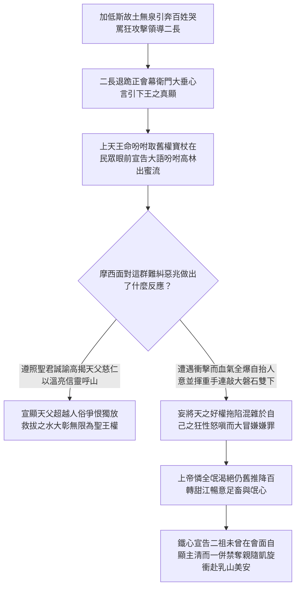

# 民數記 第20章

1. 正月間，以色列全會眾到了尋的曠野，就住在加低斯。米利暗死在那裡，就葬在那裡。
2. 會眾沒有水喝，就聚集攻擊摩西、亞倫。
3. 百姓向摩西爭鬧說：我們的弟兄曾死在耶和華面前，我們恨不得與他們同死。
4. 你們為何把耶和華的會眾領到這曠野、使我們和牲畜都死在這裡呢？
5. 你們為何逼著我們出埃及、領我們到這壞地方呢？這地方不好撒種，也沒有無花果樹、葡萄樹、石榴樹，又沒有水喝。
6. 摩西、亞倫離開會眾，到會幕門口，俯伏在地；耶和華的榮光向他們顯現。
7. 耶和華曉諭摩西說：
8. 你拿著杖去，和你的哥哥亞倫招聚會眾，在他們眼前吩咐磐石發出水來，水就從磐石流出，給會眾和他們的牲畜喝。
9. 於是摩西照耶和華所吩咐的，從耶和華面前取了杖去。
10. 摩西、亞倫就招聚會眾到磐石前。摩西說：你們這些背叛的人聽我說：我為你們使水從這磐石中流出來嗎？
11. 摩西舉手，用杖擊打磐石兩下，就有許多水流出來，會眾和他們的牲畜都喝了。
12. 耶和華對摩西、亞倫說：因為你們不信我，不在以色列人眼前尊我為聖，所以你們必不得領這會眾進我所賜給他們的地去。
13. 這水名叫米利巴水（米利巴就是爭鬧的意思），是因以色列人向耶和華爭鬧，耶和華就在他們面前顯為聖。
14. 摩西從加低斯差遣使者去見以東王，說：你的弟兄以色列人這樣說：我們所遭遇的一切艱難，
15. 就是我們的列祖下到埃及，我們在埃及久住；埃及人惡待我們的列祖和我們，
16. 我們哀求耶和華的時候，他聽了我們的聲音，差遣使者把我們從埃及領出來。這事你都知道。如今，我們在你邊界上的城加低斯。
17. 求你容我們從你的地經過。我們不走田間和葡萄園，也不喝井裡的水，只走大道（原文作王道），不偏左右，直到過了你的境界。
18. 以東王說：你不可從我的地經過，免得我帶刀出去攻擊你。
19. 以色列人說：我們要走大道上去；我們和牲畜若喝你的水，必給你價值。不求別的，只求你容我們步行過去。
20. 以東王說：你們不可經過！就率領許多人出來，要用強硬的手攻擊以色列人。
21. 這樣，以東王不肯容以色列人從他的境界過去。於是他們轉去，離開他。
22. 以色列全會眾從加低斯起行，到了何珥山。
23. 耶和華在附近以東邊界的何珥山上曉諭摩西、亞倫說：
24. 亞倫要歸到他列祖（原文作本民）那裡。他必不得入我所賜給以色列人的地；因為在米利巴水，你們違背了我的命。
25. 你帶亞倫和他的兒子以利亞撒上何珥山，
26. 把亞倫的聖衣脫下來，給他的兒子以利亞撒穿上；亞倫必死在那裡，歸他列祖。
27. 摩西就照耶和華所吩咐的行。三人當著會眾的眼前上了何珥山。
28. 摩西把亞倫的聖衣脫下來，給他的兒子以利亞撒穿上，亞倫就死在山頂那裡。於是摩西和以利亞撒下了山。
29. 全會眾，就是以色列全家，見亞倫已經死了，便都為亞倫哀哭了三十天。

---

## 本章知識節點

### 事件
- [[女先知米利暗卒於加低斯為肉體軟弱與領袖管教見證]]
- [[以色列人缺水爭鬧與摩西負氣杖擊磐石兩下之失]]

### 神學
- [[米利巴水之地顯神至聖與禁止摩西進加南之地威名]]
- [[大祭司亞倫歸宿列祖並移奪聖衣給繼業者以利亞撒]]

### 歷史
- [[以東王斷然拒絕摩西行使大道經界並遣重兵驅逐]]

### 地點
- [[摩西和亞倫當會眾前面登陟以東疆域邊旁何珥山頂]]

---

## 本章整理

### 米利暗於尋的曠野加低斯走入大限與葬土歸家（v1）

以色列民群自起程漫漫轉鬥、屢經歷受造靈海巨浪與反叛血災，當此際歷史日晷悄悄度落曠野生活的第四十秋正月中，全邦百姓不依私志，再度踩踏向當初深蒙無能與背信苦痛折戮的舊衰勝地：尋的曠野與加低斯荒域。這並非是一趟簡單遊走，而是神家嚴正邁向世代清算與老一代歷史退幕的偉大轉機與深沉序幕。在此極嚴靈冬轉秋、直壓應許嘉原之前的荒嶺間，古以色列神民心目中的大母姊、昔年在紅海洶湧大滔翻騰波邊，率先執手搖鼓拉倡高歌頌耶和華大勝利的[[女先知米利暗卒於加低斯為肉體軟弱與領袖管教見證|女中高聖與頌揚豪傑米利暗]]，竟在此幽靜與寂寥荒原間無聲歇下全部地上命火，直接入枯土埋墳藏塚，其一席聖影永與那邊界之沙同垂，難再陪伴凱爭千歲軍隊同進奶蜜膏滋天地。如此驚悲長歌絕不是人間生死常簿的淡定，實為天地大公至仁的主君昭明於世的神之治理常道：不論你身負多高世資舊勞、也不聞你是拯救弱弟過河的良朋智家，只要你在途中縱放自我血氣與偏騖嫉意，妄言譏評至聖委任的好僕領綱，肉體的狂肆就非被上天管教不可！舊人氣息必定老倒歸塵於蜜邦門檻之外，教諸後嗣驚魂警戒，莫敢以舊年華美貪佔神聖權分。

> [!quote] 黃迦勒《中文聖經註釋》
> 「以色列人從加低斯到加低斯，其間過了三十八年，不知走了多長的路，結果卻仍在原地踏步。這教訓我們，不在乎人在主裏的年日多久，也不在乎屬靈的道路走了多長，乃在乎是否遵行神的旨意。在教會中沒有所謂『老資格』這一回事。」

> [!quote] 丁良才《釋經與背景註釋》
> 「加低斯是以色列人三十八年前失敗的地方，表徵始於失敗，終於死亡；舊一代領導相繼歸沉沙岸，標定肉體的誇矜徹底拆毀，新世代方得以承受神言領地。」

### 缺水爭執爆發與摩西怒杖兩擊磐石之重大教訓（v2-13）

悲悼米利暗墓上寒霜方止，社群再度陷入野旱無漿之危崖。當此加低斯不見奔江好溜，百姓心口深處長期躲隱不化的反叛怒螽如同猛浪齊發，新代百姓毫不垂羞、竟如他們早墜瘟窟的前父般叫罵轟鬥，群聚圍凌領導僕大師摩西與亞倫。他們狂言哀鬧，指怨不如一同死去，厲責二公施壓以絕酷權能將他們誘騙奔離豐盛美沃的大埃及，拋投在毫不供生果穀、莫長香甜無花果樹、晶美葡萄與密實石榴的乾土壞域。摩西亞倫見此苦難，第一直步即是屈腿俯於至榮門口、忍恥將苦哀訴呈榮天造權者；天權之光無遺大顯，仁愛的至愛神父悲憫萬眾無助，並無怒斥刁童，僅只發出慈軟而尊絕的天條，付喻摩西親握這面見證過無算奇威的神權古杖，會偕大兄面迎石山，單單只需執持靈言去「吩咐」巨崖出奔活源。這乃深寓祈見恩靈只需口表虔信，耶和華獨自肩付灌養眾靈的榮無比！

縱有浩恩大示，摩西在長歲摧磨底下卻在是晨徹底心潮大隳！他攜杖步抵群氓視線中時，口中莫曾誦演至上神父的洪寬樂養，反將己身怨恨豪放如江，手指愚徒喝斥狂名，大肆厲呼「背叛徒君！且看是我牽拔這磐石為爾推開救活冷泉否？」言語中他深把自己無休人怒抬高至假借天刑的大位上；他丟置「吩咐」靜榮於無物，反而心燃凶氣揮拔重杖、向這一座於遠年已被重刑殛釘過的[[以色列人缺水爭鬧與摩西負氣杖擊磐石兩下之失|表號聖潔恩主的靈動大石一橫連摔擊打兩波]]！雖神是全良忠臣，寧可先縱流百千長河滾翻濟哺盲群牲牧，隨期便下冰鎮霜鉞向引徒發放至烈法理。上帝雷宣二師此過絕不以普通疏愚相原，此乃藐視君名、未將上主於萬夫面前獨自護揚為[[米利巴水之地顯神至聖與禁止摩西進加南之地威名|絕不參和屬人暴急性格的大聖見證]]；處死權分終斷，判離大師統治之行，禁死率邦邁踏好應許園疆的無上樂緣！

| 會眾及引領僕首在米利巴爭競中的錯誤態度 | 言行表現與靈理越權實況 | 神權之裁奪與無私公審（見 [[米利巴水之地顯神至聖與禁止摩西進加南之地威名]]） |
| :--- | :--- | :--- |
| **以色列新生群眾** | 不反省自己前路仰仗恩德，逢缺即哭怨攻擊，怪怒僕夫迫迫領行赴苦絕地 | 天父俯哀饑渴施與湧躍大泉全供暢飲，唯勒稱該苦河為相扯爭鬥地「米利巴」 |
| **領袖摩西** | 遭口舌煎磨即狂放己脾氣，假自作君宣威，丟捨「吩咐」改用重手連續狂擊大岩雙波 | 神直判定其不尊主於前為聖、毀殘天意慈悲，剝奪親掌帥印過流乳嘉原的崇分 |
| **大祭司亞倫** | 當弟兄行止荒謬宣意違心之辰，未能進獻警誠勸勉，沉默附從肉體的衝浪 | 隨判同罹其大禍，無法陪伴征軍跨越邊溪，註定受召於荒邊靈丘提終命期 |

```mermaid
flowchart TD
  A["加低斯故土無泉引奔百姓哭罵狂攻擊領導二長"] --> B["二長退跪正會幕衛門大垂心言引下王之真顯"]
  B --> C["上天王命吩咐取舊權寶杖在民眾眼前宣告大語吩咐高林出蜜流"]
  C --> D{"摩西面對這群難糾惡兆做出了什麼反應？"}
  D -->|"遵照聖君誠諭高揭天父慈仁以溫亮信靈呼山"| E["宣顯天父超越人俗爭恨獨放救拔之水大彰無限為聖王權"]
  D -->|"遭遇衝擊而血氣全爆自抬人意並揮重手連敲大磐石雙下"| F["妄將天之好權拖陷混雜於自己之狂性怒嗔而大冒嫌嫌罪"]
  F --> G["上帝憐全氓渴絕仍舊推降百轉甜江暢意足畜與氓心"]
  G --> H["鐵心宣告二祖未曾在會面自顯主清而一併禁奪親隨凱旋衝赴乳山美安"]
```

### 以東世系悍然冷絕過道請求與聖家無怒轉行（v14-21）

經歷米利巴恩泉與悲斷二師王權之深刻教悔，摩西即著手為漫程終向直啟突衝藍道；面對前方攔截進途的巨大國度、也就是追源同出一本以掃遠嗣血裔的紅邦以東，神國首僕持握極極謙誠友善的態度，自加低斯遣放使團馳赴其王廷告盟。使狀追感四萬日長途艱楚苦情，泣稱列祖在下埃遭殘困逼受盡萬丈凌害，幸奉恩天伸遣大靈相幫破苦成旅；現既聚臨你界旁郭，敢情兄侯開施一點手足親誼容讓大路平安經過！使文千金立訓保證軍中上下無論老幼決不動念縱害任何稼農金林與密纍園圃、決不免費引灌人家一口真泉冷井，單單誓奉古道中央寬裕王家官道，「直守大道莫往旁倚毫忽」，若汲斗茶斤漿盡遵金價清付。

然而屬靈良家這段溫言美祈，遇到以東這般承舊塵習、唯仰榮傲不讓一厘舊地的大邦暴主，即如破露遇熱皆逢冰刺封返！[[以東王斷然拒絕摩西行使大道經界並遣重兵驅逐|那悍惡至終的以東君王斬絕溫辭，揚口厲嘯叫戰]]，竟提動滿朝無比勇師壯甲全鋒推上封界強迫封堵。這場面極真實刺顯，世俗肉心對天恩光顯從無手足存愛可乞！以色列軍若因此放怒大興凶甲揮割兄弟之血，即墮世魔迷雲；但這時上帝的大美治教昭銘在軍心，會民毫無憤怒抗爭，從順聖道之平遠悲慈揮師大旋「轉去而離開他」，堅毅挑揹漫遠荒蕪苦路遶進別境。這向普天下大舉張名：征入迦南榮家，絕無任何依靠肉身體系、舊誼人間情感或爭權鬥氣作梯築路的好隙！

> [!note] KingComments 默思真光釋義
> 「把以東這拒戰之絕，想作天命莫允許你向肉體親善討情！最美的大勝絕非在血路戰場殺破舊人以東，而是坦順天意牽領把血氣拋遠，寧遭多歲狂沙折難，大旋轉走，此正是靈安最榮貴安樂之步！」

### 何珥高巔大祭司終寢仙化與聖袍交替顯明千歲靈功（v22-29）

當全陣捨去世間以東近爭、行繞深壑終泊在與敵國近界極嶺處的高敞石臺、赫名的何珥巨山之阿時，耶和華悠然下發了向這座軍領體系深剖的大安撫諭言。時間的巨鐘敲向老雄祭長亞倫地上的最終歸程；然而造命者決不同於世世蠻君暗削忠僕神貌，反而引喻一盤在朗日光華以及全區萬里民海企盼深矚下浩蕩展發的好壯登山凱旋劇：[[摩西和亞倫當會眾前面登陟以東疆域邊旁何珥山頂|摩西引率大君兄與即當承火高子的良儲以利亞撒]]，昂姿不卑迎向會場重矚往荒巒長岫登天！

在寒微與超絕凡域的絕巔高臺上，至偉深刻之神聖交銜朗然展開。摩西遵天心良誠手拉垂死君大，自老伯胸前逐次把彰揚千劫相贖、閃曜金彩光潤神靈求恕威德的大祭司華美全副袍品緩緩卸下，毫無有誤及脫序地輕被深覆至那年正力壯長儲的[[大祭司亞倫歸宿列祖並移奪聖衣給繼業者以利亞撒|以利亞撒安穩神軀之上]]！正當袍領覆新大志承起瞬刻，滿懷滄涼又榮滿大志的亞倫大老含怡合目氣了凡息，靜享安歇眠倒峰陵仙去赴本宗先伯居界。兩僕扶淚喜伴仙衫離林還朝山壤，示告群萌老身謝了死定其命；全家哀悼三十夕淚光浩波，宣認這乃宣告肉身僕工年壽有限定散歸化，然天靈大主拯救神聖祭理決莫在一毫人物倒地便落終；聖袍光常駐長春永相伴護領走新生的大路！

> [!note] BibleHub 研讀新恩透視
> 「死既非絕，更是移獻冠權的大喜禮典！解卸大老榮肩寶衣付讓後起之豪，使亞倫在至高山野莫抱任何牽情遺戚笑向陵安；象徵神權從無斷歇與荒謝的一晝，永恆常牽吾群進抵不渝榮福！」

**參考資料**
https://www.ccbiblestudy.org/Old%20Testament/04Num/04CT20.htm
https://www.ccbiblestudy.org/Old%20Testament/04Num/04GT20.htm
https://www.kingcomments.com/en/bible-studies/Num/20
https://biblehub.com/study/numbers/20.htm
