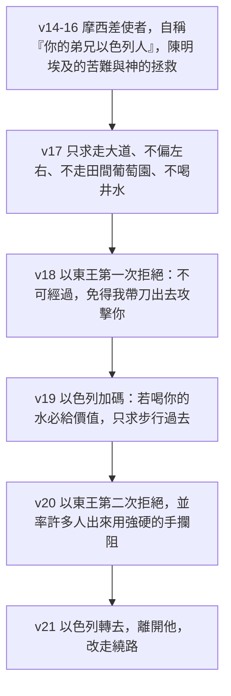

# 民數記 第20章

<!-- chapter-navigation:start -->
| [前一章](../04%20民數記/第19章.md) | [回目錄](../04%20民數記/全書目錄及綱要.md) | [下一章](../04%20民數記/第21章.md) |
| :--- | :---: | ---: |
<!-- chapter-navigation:end -->

1. 正月間，以色列全會眾到了尋的曠野，就住在[[加低斯]]。[[米利暗]]死在那裡，就葬在那裡。
2. 會眾沒有水喝，就聚集攻擊[[摩西]]、[[亞倫]]。
3. 百姓向[[摩西]][[米利巴（Meribah）|爭鬧]]說：我們的弟兄曾死在耶和華面前，我們恨不得與他們同死。
4. 你們為何把耶和華的會眾領到這曠野、使我們和牲畜都死在這裡呢？
5. 你們為何逼著我們出埃及、領我們到這壞地方呢？這地方不好撒種，也沒有無花果樹、葡萄樹、石榴樹，又沒有水喝。
6. [[摩西]]、[[亞倫]]離開會眾，到會幕門口，俯伏在地；[[耶和華的榮光]]向他們顯現。
7. 耶和華曉諭[[摩西]]說：
8. 你拿著[[杖]]去，和你的哥哥[[亞倫]]招聚會眾，在他們眼前吩咐磐石發出水來，水就從磐石流出，給會眾和他們的牲畜喝。
9. 於是[[摩西]]照耶和華所吩咐的，從耶和華面前取了[[杖]]去。
10. [[摩西]]、[[亞倫]]就招聚會眾到磐石前。摩西說：你們這些背叛的人聽我說：我為你們使水從這磐石中流出來嗎？
11. [[摩西]]舉手，用[[杖]]擊打磐石兩下，就有許多水流出來，會眾和他們的牲畜都喝了。
12. 耶和華對[[摩西]]、[[亞倫]]說：因為你們不信我，不在以色列人眼前尊我為聖，所以你們必不得領這會眾進我所賜給他們的地去。
13. 這水名叫[[米利巴（Meribah）|米利巴]]水（米利巴就是[[米利巴（Meribah）|爭鬧]]的意思），是因以色列人向耶和華爭鬧，耶和華就在他們面前顯為聖。
14. [[摩西]]從[[加低斯]]差遣使者去見[[以東]]王，說：你的弟兄以色列人這樣說：我們所遭遇的一切艱難，
15. 就是我們的列祖下到埃及，我們在埃及久住；埃及人惡待我們的列祖和我們，
16. 我們哀求耶和華的時候，他聽了我們的聲音，差遣使者把我們從埃及領出來。這事你都知道。如今，我們在你邊界上的城[[加低斯]]。
17. 求你容我們從你的地經過。我們不走田間和葡萄園，也不喝井裡的水，只走[[大道（原文作王道）]]，不偏左右，直到過了你的境界。
18. [[以東]]王說：你不可從我的地經過，免得我帶刀出去攻擊你。
19. 以色列人說：我們要走[[大道（原文作王道）|大道]]上去；我們和牲畜若喝你的水，必給你價值。不求別的，只求你容我們步行過去。
20. [[以東]]王說：你們不可經過！就率領許多人出來，要用強硬的手攻擊以色列人。
21. 這樣，[[以東]]王不肯容以色列人從他的境界過去。於是他們轉去，離開他。
22. 以色列全會眾從[[加低斯]]起行，到了[[何珥山]]。
23. 耶和華在附近[[以東]]邊界的[[何珥山]]上曉諭[[摩西]]、[[亞倫]]說：
24. [[亞倫]]要[[歸到他列祖]]（原文作本民）那裡。他必不得入我所賜給以色列人的地；因為在[[米利巴（Meribah）|米利巴]]水，你們違背了我的命。
25. 你帶[[亞倫]]和他的兒子[[以利亞撒]]上[[何珥山]]，
26. 把[[亞倫]]的[[聖衣（祭司聖服）|聖衣]]脫下來，給他的兒子[[以利亞撒]]穿上；亞倫必死在那裡，歸他列祖。
27. [[摩西]]就照耶和華所吩咐的行。三人當著會眾的眼前上了[[何珥山]]。
28. [[摩西]]把[[亞倫]]的[[聖衣（祭司聖服）|聖衣]]脫下來，給他的兒子[[以利亞撒]]穿上，亞倫就死在山頂那裡。於是摩西和以利亞撒下了山。
29. 全會眾，就是以色列全家，見[[亞倫]]已經死了，便都為亞倫哀哭了三十天。

---

## 本章知識節點

### 事件
- [[米利暗卒於加低斯]]
- [[摩西擊打磐石兩下]]
- [[磐石出水]]

### 神學
- [[在米利巴未將耶和華尊為聖]]
- [[亞倫卒於何珥山與祭司職任更替]]
- [[磐石預表基督]]
- [[杖]]
- [[耶和華的榮光]]
- [[以東與以色列的敵對]]

### 歷史
- [[以東王拒絕以色列人假道]]
- [[曠野飄流四十年]]

### 地點
- [[何珥山]]
- [[加低斯]]
- [[以東]]

### 人物
- [[米利暗]]
- [[亞倫]]
- [[摩西]]
- [[以利亞撒]]
- [[受膏的祭司]]

### 原文
- [[米利巴（Meribah）]]

### 文化
- [[大道（原文作王道）]]
- [[哀哭三十天]]

### 主題
- [[歸到他列祖]]
- [[聖衣（祭司聖服）]]

### 解經爭議
- [[以色列人經過還是繞過以東境界]]
- [[瑪撒米利巴是一次還是兩次]]
- [[十二探子自巴蘭或加低斯巴尼亞出發之解經爭議]]

### 互文
- [[林前10：4 靈磐石就是基督]]
- [[賽53：4-5 磐石被擊打]]
- [[以掃貪戀世俗（來12：16）]]

---

## 本章整理

### 三十八年之後，又回到同一個地方（v1）

民數記第20章一開頭就是一句時間標記：「正月間，以色列全會眾到了尋的曠野，就住在加低斯。」這個「正月」是出埃及後第四十年的正月——[[曠野飄流四十年|四十年的飄流]]走到了盡頭。BH 指出這一節標誌著一段轉折：受罰死在曠野的那一代正在凋零，新的一代正在預備進入應許之地。

真正刺人的是地點。CT 算了一筆很不客氣的帳：「以色列人從加低斯(參十三26)到加低斯，其間，過了三十八年，不知走了多長的路，結果卻仍在原地踏步。」[[加低斯]]正是三十八年前十二探子回報、全會眾號啕大哭的地方（[[十二探子自巴蘭或加低斯巴尼亞出發之解經爭議|民13:26 說那是「巴蘭曠野的加低斯」，本節卻說是尋的曠野]]）。走了一整圈，回到起點。

同一節記下 [[米利暗卒於加低斯|米利暗的死]]。GT《舊約聖經背景註釋》把它讀成一個過程的開始：「領袖的交接在米利暗於第四十年第一個月去世時開始，並於五個月後亞倫之死（民三十三38）達到高峰。」[[米利暗]]是三人中第一個走的。KC 的觀察最沉：她在紅海邊唱出的得救之樂，隨著她的死沉寂下來；而她自從攻擊摩西的權柄之後幾乎沒有再出現——他由此提出一個不留情的教訓：一個人的大罪即使得了赦免，也未必能取回犯罪以前在神工作中的影響力或地位。

### 一句話與一根杖：摩西一生最重的失腳（v2-13）

百姓沒有水喝，又聚集攻擊 [[摩西]]和 [[亞倫]]。他們說的話，CT 註得很簡短：「他們所說抱怨的話，幾乎和上一代的人所說的沒有兩樣(參出十七3)。」KC 說得更直：這一代人幾乎全是出發時未滿二十歲、或在曠野出生的，卻不比死在曠野的那一代好——人的本質沒有改變，歷史就重複。兩位領袖沒有回嘴，直接到會幕門口俯伏在地，[[耶和華的榮光]]就向他們顯現（v6）。

神的吩咐與摩西的動作之間，只差一個動詞。

| | 神在第8節說的 | 摩西在第10-11節做的 |
| :--- | :--- | :--- |
| 對象 | 對磐石說話 | 對百姓說話 |
| 動作 | 吩咐磐石發出水來 | 舉手用杖擊打磐石 |
| 次數 | 一次也不必打 | 兩下 |
| 稱謂 | 神使水流出 | 「我為你們使水從這磐石中流出來嗎」 |

CT 把帳算得很清楚：「摩西首三件事的確遵照神的吩咐：(1)拿著杖去；(2)招聚會眾；(3)到磐石前。可惜第四步並未遵照神的吩咐。」他並指出兩層錯：「摩西不該用杖『擊打』磐石，更不該擊打『兩下』。」GT 丁良才《民數記註釋》數得更細，一共五件：「摩西、亞倫的錯謬有五：1違逆主命（二十七14），2自大過分（10末句），3不信神（12），4不尊主為聖（12），5擅自發怒（10第三句，詩一百零六33，申九24，雅一20，三2，詩一百四十一3）。」

為什麼不可以再打？因為那塊石頭代表誰。GT 丁良才《民數記註釋》說得最白：「這磐石預表主耶穌（林前十4）。既然被擊打了一次（出十七6），就不可再打。摩西卻廢了這預表的意思」。[[磐石預表基督]]這條線在四套來源裡是一致的（見 [[林前10：4 靈磐石就是基督]]、[[賽53：4-5 磐石被擊打]]）；KC 補上一層：第一次的擊打用的是審判的杖，如今神要顯明自己是施恩的神，人只需向那磐石說話就能得著祝福。這正是 [[摩西擊打磐石兩下|本章與出17 那一次的分別]]，而 [[磐石出水|磐石出水]]這件事在聖經中總共只發生過兩次。

**這根杖是誰的，四套來源明確分歧。** CT 與 GT 兩份子來源都說是摩西自己的杖，KC 卻說是亞倫那根發過芽的 [[杖]]。GT 丁良才《民數記註釋》給的理由是原文：「這杖大約不是亞倫發過芽的杖（十七5），乃是摩西在埃及施行神跡的杖，11節原文作他的杖」；GT《民數記串珠聖經註釋》同一立場：「摩西所取的杖（9）並非亞倫的杖 （17:8），而是他領以色列人出埃及屢施神跡所用的杖（出4:2, 17）」。

> [!note] STEP語言資料：本章內部的兩個回聲
> 第一個回聲在「背叛」上。第10節摩西罵百姓「你們這些背叛的人」，原文是 מָרָה（ha./mo.Rim，H4784，簡要義域 to rebel）；第24節神對摩西亞倫說「你們違背了我的命」，用的是同一個字根（me.ri.Tem），而「我的命」原文是 פֶּה（H6310I），字面是「我的口」。GT 丁良才《民數記註釋》正是這樣註第10節的：「當時摩西自己卻背叛了神」。
> 第二個回聲在「聖」上。第12節「尊我為聖」是 קָדַשׁ（le./Hak.di.She./ni，H6942G）的使役形，第13節「顯為聖」是同一個編碼的反身被動形（va/i.yi.ka.Desh）。摩西沒有做的那件事，神自己做了——KC 把這一層講成一句話：我們若不尊神為聖，神就自己尊自己為聖。
> 另外第11節「用杖」是 בְּמַטֵּהוּ（be./ma.Te./hu，H4294G）帶第三人稱所有格後綴，正是丁良才所說的「11節原文作他的杖」；而本章的「磐石」是 סֶלַע（Se.la，H5553H，簡要義域 crag），而出17:6 的磐石在 STEP 是另一個編碼（H6697H，簡要義域 rock），兩處不是同一個字。

判詞下在第12節：[[在米利巴未將耶和華尊為聖|「因為你們不信我，不在以色列人眼前尊我為聖」]]。GT《啟導本聖經註釋》列了三種解釋並陳：一是摩西不信真能憑一句話便能叫石出水；二是他盛怒之下連擊二下，沒有在百姓前尊敬神；三是磐石是神的象徵，百姓聚合在磐石前有若集合在會幕或約櫃前，摩西擊石構成一種瀆犯。CT 的〔話中之光〕點出實際的傷害：「摩西那一次發脾氣的壞處是在這裏︰一方面他在那裏發脾氣，一方面杖打下去又有水流出來，看見有神的工作在那裏，這就叫人分不清到底這是誰作的事。」第13節給這處水起名 [[米利巴（Meribah）|米利巴]]——與出17:7 同名，而兩處是不是同一件事，各家並不一致（見 [[瑪撒米利巴是一次還是兩次]]）。

### 弟兄不讓路：以東拒絕借道（v14-21）

```mermaid
flowchart TD
    A["v14-16 摩西差使者，自稱『你的弟兄以色列人』，陳明埃及的苦難與神的拯救"] --> B["v17 只求走大道、不偏左右、不走田間葡萄園、不喝井水"]
    B --> C["v18 以東王第一次拒絕：不可經過，免得我帶刀出去攻擊你"]
    C --> D["v19 以色列加碼：若喝你的水必給價值，只求步行過去"]
    D --> E["v20 以東王第二次拒絕，並率許多人出來用強硬的手攔阻"]
    E --> F["v21 以色列轉去，離開他，改走繞路"]
```

摩西開口就攀親戚。GT 丁良才《民數記註釋》說明這個稱呼的用意：「這稱呼使以東人紀念他們和以色列人同是一個祖宗的後裔（創三十三1-17）。」他要走的是 [[大道（原文作王道）|那條大道]]——GT《啟導本聖經註釋》說它「當系指外約但溝通南北的通商大道，從阿卡巴灣口直上大馬色（今大馬士革）」，而 GT 丁良才《民數記註釋》指出這不是挑方便：「從亞拉巴到以東山地有一條深溝，沿路有好些泉源和草地，在以東西邊，以色列人往來，只有這條路可走。」

[[以東王拒絕以色列人假道|以東兩次拒絕]]，第二次還出了兵。以色列的兵力其實遠勝——GT 艾基斯《舊約聖經難題彙編》算過：可以打仗的人數共六十萬一千三百名，「這個數目當然遠超過以東的戰士」，而經文毫無兩軍交鋒的記載。為什麼不打？GT《聖經精讀本──民數記註解》給的理由是這個地並不是神所應許他們的地；GT 丁良才《民數記註釋》另記下一條容易被忽略的規定：「以東人雖然這樣待以色列人，神卻禁止以色列人憎惡他們（申二十三7）。」CT 從 [[以掃貪戀世俗（來12：16）|來十二16]] 讀 [[以東]]，KC 則把以東讀成我們裡面的舊人——對敵對的民族可以爭戰，對這個「弟兄」不可以，只能繞過去。這場拒絕是 [[以東與以色列的敵對]]的第一次正面衝突，GT《民數記串珠聖經註釋》把後果一併寫出：「雖然以掃與雅各和解了，但他們的後裔卻世代對敵，以東人此際首次不念舊情，日後更變本加厲（參摩1:11）。」

順帶一提，民20:21 說以色列「轉去，離開他」，申2:4 卻說「你們要經過他們的境界」——這個矛盾 GT 收了兩份專門的材料處理（見 [[以色列人經過還是繞過以東境界]]）。

### 山頂上的脫衣與穿衣：亞倫的結局（v22-29）

繞路的第一站是 [[何珥山]]。神在這裡宣告 [[亞倫卒於何珥山與祭司職任更替|亞倫的結局]]，理由與摩西同一條：「因為在米利巴水，你們違背了我的命」（v24）。但同一節的前半句是 [[歸到他列祖|「亞倫要歸到他列祖（原文作本民）那裡」]]——GT《啟導本聖經註釋》指出這句話並不中性：「“歸到他列祖”，通常指一個受大家尊敬的人善終而死。」也就是說，同一節裡兩件事同時成立：他受了罰，也得了善終。

交接是公開進行的。摩西把 [[聖衣（祭司聖服）|亞倫的聖衣]]脫下來，給 [[以利亞撒]]穿上，三人當著會眾的眼前上山，只有兩人下來。CT 說明神為什麼要這樣安排：「會眾只看見三人上山，後來覲見兩人下山(參28節)，雖然沒有親眼看見亞倫之死，卻可推知他死在山上，給他保留了大祭司的尊榮。」GT《啟導本聖經註釋》從制度面說同一件事：這是以色列民生活中的大事，因此要舉行儀式讓會眾清楚看見，「由亞倫開始的一個時代已告終結，由下一代繼起的新時代已經開始」。

| 山上發生的事 | 經文 | 各家怎麼讀 |
| :--- | :--- | :--- |
| 脫下聖衣、給以利亞撒穿上 | v26、28 | CT：聖衣的移交代表事工職任的傳承，有時甚至代表聖靈能力的傳承（王下二13~14） |
| 亞倫死在山頂 | v28 | GT 丁良才《民數記註釋》：「亞倫既死了，就顯明他為祭司的職分不完全（參來七23-25）。」 |
| 誰埋葬了他 | 經文沒寫 | CT 與 GT 丁良才都推測不是摩西與以利亞撒，因為按民19:11 那會使他們不潔七天 |
| 全會眾哀哭三十天 | v29 | 見 [[哀哭三十天]]：一般服喪七天，三十天等同國葬 |

[[受膏的祭司|大祭司]]這個職分第一次換人，新約據此論了一件更大的事。GT《聖經精讀本──民數記註解》把它分成兩層：祭司職分的不完全性——人因罪惡和死亡不能完全履行職責；以及祭司職分的暫時性——以色列的祭司只在活著的時候才能擔當職分，所以需要很多祭司。KC 從以利亞撒身上讀出另一層：亞倫是帶領百姓走曠野路的大祭司，以利亞撒則要把百姓帶進那地。

> [!note] STEP語言資料：亞倫的死用了一個特別的字
> 第29節「見亞倫已經死了」的動詞不是本章第1節寫米利暗的 מוּת（H4191），而是 גָּוַע（ga.Va，H1478，簡要義域 to die）——創世記寫列祖善終用的正是這個字。KC 讀出的也是這一層：亞倫是在尊嚴與平安中離世，不是被從百姓中剪除。第24節「歸到他列祖」的原文字面則是被聚集到他的族人那裡：動詞 אָסַף（H622）是被動形，受詞是 עַם（H5971B，簡要義域 kinsman）；同一個 H5971B 也出現在利未記剪除條例的公式裡——同一個字，一邊是被剪除離開族人，一邊是被聚集歸回族人。

### 這一章為什麼放在這裡（v1-29）

三件死亡與一次拒絕，擠在同一章。GT《啟導本聖經註釋》把全書的旅程分成三段，並指出本章的位置：前二次都以歡樂始而以悲哀終，「這最後一段卻以悲哀始，而以歡樂終」——米利暗與亞倫先後死在旅途，但到了終點，以色列人佔領了何珥瑪、戰勝了西宏與噩，沿途歡呼作歌。

KC 把摩西在本章遭遇的五件事列成一串：先是姊姊米利暗的死，然後是百姓的暴動，接著是他自己的失敗與所受的懲罰，再來是以東的拒絕與敵意——這意味著繞路與延遲，最後是他親眼看著哥哥亞倫死去。而摩西在這一連串打擊之後仍然「照耶和華所吩咐的行」（v27），KC 因此說他是我們面對挫折時的榜樣。

GT《聖經精讀本──民數記註解》從兩位領袖的死歸出兩點：管轄以色列的是神而不是人；在迦南建立國家的主角絕對不能受血氣和感情左右。CT 的提醒更直接：本章記載米利暗和亞倫的死亡，又記載摩西因擊打磐石而不得進迦南地，對年長的領袖是極大的警戒與教訓。

**參考資料**
https://www.ccbiblestudy.org/Old%20Testament/04Num/04CT20.htm
https://www.ccbiblestudy.org/Old%20Testament/04Num/04GT20.htm
https://www.kingcomments.com/en/bible-studies/Num/20
https://biblehub.com/study/numbers/20.htm
https://github.com/STEPBible/STEPBible-Data

<!-- appendix-links:start -->
## 附錄

### 相關地圖
- [[appendix/fhl_maps/maps/022|〈民圖三〉從何珥山到摩押平原]]
- [[appendix/fhl_maps/maps/024|〈民圖五〉出埃及和進迦南的旅程]]
<!-- appendix-links:end -->

<!-- chapter-navigation:start -->
| [前一章](../04%20民數記/第19章.md) | [回目錄](../04%20民數記/全書目錄及綱要.md) | [下一章](../04%20民數記/第21章.md) |
| :--- | :---: | ---: |
<!-- chapter-navigation:end -->
