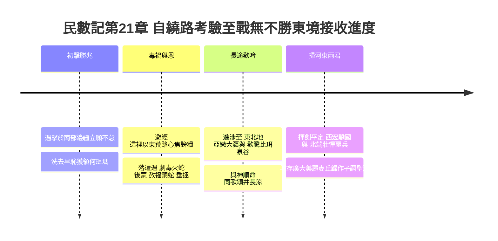
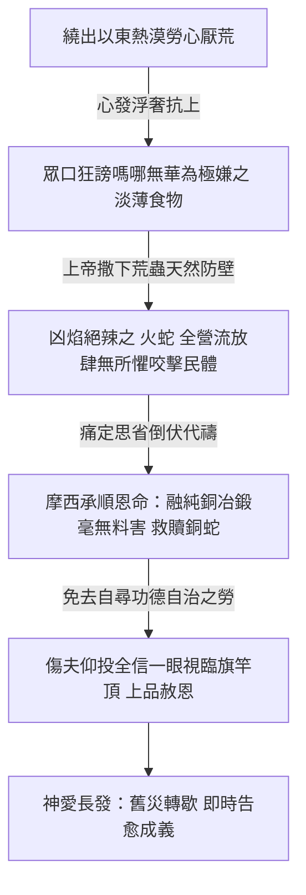
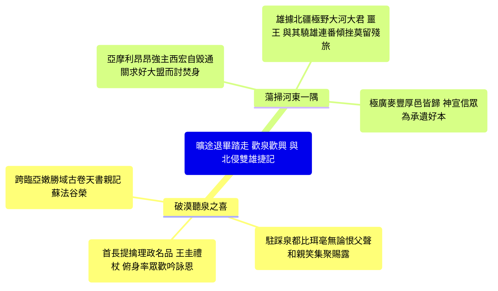

# 民數記 第21章

1. 住南地的迦南人亞拉得王，聽說以色列人從亞他林路來，就和以色列人爭戰，擄了他們幾個人。
2. 以色列人向耶和華發願說：你若將這民交付我手，我就把他們的城邑盡行毀滅。
3. 耶和華應允了以色列人，把迦南人交付他們，他們就把迦南人和迦南人的城邑盡行毀滅。那地方的名便叫何珥瑪（何珥瑪就是毀滅的意思）。
4. 他們從[[何珥山]]起行，往紅海那條路走，要繞過[[以東|以東地]]。百姓因這路難行，心中甚是煩躁，
5. 就怨讟神和摩西說：你們為什麼把我們從埃及領出來、使我們死在曠野呢？這裡沒有糧，沒有水，我們的心厭惡這淡薄的食物。
6. 於是耶和華使[[火蛇（saraph）|火蛇]]進入百姓中間，蛇就咬他們。以色列人中死了許多。
7. 百姓到摩西那裡，說：我們怨讟耶和華和你，有罪了。求你禱告耶和華，叫這些蛇離開我們。於是摩西為百姓禱告。
8. 耶和華對摩西說：你製造一條[[火蛇（saraph）|火蛇]]，掛在杆子上；凡被咬的，一望這蛇，就必得活。
9. 摩西便製造一條[[銅蛇（nehushtan）|銅蛇]]，掛在杆子上；凡被蛇咬的，一望這銅蛇就活了。
10. 以色列人起行，安營在阿伯。
11. 又從阿伯起行，安營在以耶亞巴琳，與[[摩押]]相對的曠野，向日出之地。
12. 從那裡起行，安營在撒烈谷。
13. 從那裡起行，安營在亞嫩河那邊。這亞嫩河是在曠野，從亞摩利的境界流出來的；原來亞嫩河是[[摩押]]的邊界，在摩押和[[亞摩利人]]搭界的地方。
14. 所以耶和華的戰記上說：蘇法的哇哈伯與亞嫩河的谷，
15. 並向亞珥城眾谷的下坡，是靠近[[摩押]]的境界。
16. 以色列人從那裡起行，到了比珥（比珥就是井的意思）。從前耶和華吩咐摩西說：招聚百姓，我好給他們水喝，說的就是這井。
17. 當時，以色列人唱歌說：井啊，湧上水來！你們要向這井歌唱。
18. 這井是首領和民中的尊貴人用圭用杖所挖所掘的。以色列人從曠野往瑪他拿去，
19. 從瑪他拿到拿哈列，從拿哈列到巴末，
20. 從巴末到[[摩押]]地的谷，又到那下望曠野之毘斯迦的山頂。
21. 以色列人差遣使者去見[[亞摩利人]]的王西宏，說：
22. 求你容我們從你的地經過；我們不偏入田間和葡萄園，也不喝井裡的水，只走大道（原文作王道），直到過了你的境界。
23. 西宏不容以色列人從他的境界經過，就招聚他的眾民出到曠野，要攻擊以色列人，到了雅雜與以色列人爭戰。
24. 以色列人用刀殺了他，得了他的地，從亞嫩河到雅博河，直到[[亞捫人]]的境界，因為亞捫人的境界多有堅壘。
25. 以色列人奪取這一切的城邑，也住[[亞摩利人]]的城邑，就是希實本與希實本的一切鄉村。
26. 這希實本是亞摩利王西宏的京城；西宏曾與[[摩押]]的先王爭戰，從他手中奪取了全地，直到亞嫩河。
27. 所以那些作詩歌的說：你們來到希實本；願西宏的城被修造，被建立。
28. 因為有火從希實本發出，有火焰出於西宏的城，燒盡[[摩押]]的亞珥和亞嫩河邱壇的祭司（祭司原文作主）。
29. [[摩押]]啊，你有禍了！基抹的民哪，你們滅亡了！基抹的男子逃奔，女子被擄，交付亞摩利的王西宏。
30. 我們射了他們；希實本直到底本盡皆毀滅。我們使地變成荒場，直到挪法；這挪法直延到米底巴。
31. 這樣，以色列人就住在[[亞摩利人]]之地。
32. 摩西打發人去窺探雅謝，以色列人就佔了雅謝的鎮市，趕出那裡的[[亞摩利人]]。
33. 以色列人轉回，向巴珊去。巴珊王噩和他的眾民都出來，在以得來與他們交戰。
34. 耶和華對摩西說：不要怕他！因我已將他和他的眾民，並他的地，都交在你手中；你要待他像從前待住希實本的亞摩利王西宏一般。
35. 於是他們殺了他和他的眾子，並他的眾民，沒有留下一個，就得了他的地。

---

## 本章知識節點

### 互文
- [[以色列戰勝亞摩利王西宏互文（申2：24-37；3：1-7；詩135：10-12；136：17-22）]]
- [[以色列戰勝巴珊王噩互文（申3：1-11；詩135：10-12；136：17-22）]]
- [[銅蛇被毀滅預表除去偶像（王下18：4）]]

### 地點
- [[何珥山]]
- [[以東]]
- [[以耶亞巴琳經亞嫩河與戰記上述蘇法的哇哈伯]]

### 人物
- [[亞捫人]]
- [[摩押]]
- [[亞摩利人]]

### 原文
- [[火蛇（saraph）]]
- [[銅蛇（nehushtan）]]

### 歷史
- [[亞拉得人襲擊探路者及神賜下徹底戰勝之何珥瑪]]
- [[戰勝希實本與巴珊二大頑梗敵軍與佔領其廣澤領土]]

### 事件
- [[百姓抱怨難路痛厭淡薄食物與耶和華使火蛇咬人]]
- [[比珥活水泉谷與眾首領用圭用杖挖井引頌讚凱歌]]

### 神學
- [[摩西為民祈禱製作銅蛇掛於杆上見證望蛇生得治]]

---

## 本章整理

### 初嘗戰鬥成果：亞拉得人突襲與奉獻何珥瑪凱歌（v1-3）

民數記第21章開啟了以色列第二代會眾在漫長曠野鍛鍊後，正向 Canaan 大省邁赴征討勝利新程的大格局序曲（v1-3）。故事的首發衝突始於地理節點南地 —— [[亞拉得人襲擊探路者及神賜下徹底戰勝之何珥瑪|「駐臨南方要道之迦南君王亞拉得驚見兵至進侵掳民，以民肅穆求父下願徹底破亡其縣定名何珥瑪」]]。此一度遇擊之地理正近於昔往三十八年前初代會老任性恃暴受辱被擊之地（參考 民數記 14:45）；未曾預想新世代群庶展放的反應，並非恐嚇或暴退與舊世般叫罵退回，反而是沈穩自斂退至於神權君誓下力倡大奉獻契 —— 即呼喊若神交付便願履行聖禮徹底「毀其境為禁絕之物」（Herem）。主隨其願行戰力奪，那曾經為敗喪與恥笑老舊荒墳的新荒麓，就從今日成為勝利開天幕之「何珥瑪（全守奉獻上帝大裁決地）」歷史豐碑！

### 途行繞遠的枯倦大怨、火蛇猛災與仰視銅蛇赦病極至預表（v4-9）

正如現實世道進攻歷程總見反覆修磨，部伍甫獲初捷不久，因為被拘無可踐越東側同屬祖家境野（見 [[以東]] 與自居之邊疆高點 [[何珥山]] ），軍列逼退向南牽出超長弧形去曲赴以東。在一串荒遠熱塵壓折途中，深潛而未除潔的肉血暴根竟再次於民眾胸臆爆宣，演變成為嚴重冒逆名節之 [[百姓抱怨難路痛厭淡薄食物與耶和華使火蛇咬人|「群音浩蕩罵責上帝長途枯倦更公然鄙棄天使天糧為可厭的淡薄粗料致招 猛毒火蛇 撲咬災過」]]（v4-6）。此乃破辱信仰道德底層的一擊：《拾穗》等各路考證顯發，會群不獨攻擊長征勞路，更悍行污蔑養育一身筋膜近半世秋雨的靈糧嗎哪為「淡薄」（原文乃貧乏空洞、淺淡惹厭的無堪劣食）！聖安神怒便收手解下了曠川對蠻野惡蟲長伴的神力防盾，大漠廣產具猛灼火性與紅熱刺牙的 [[火蛇（saraph）]] 全軍殺進眾居室幕，噬痛橫生喪聲動原。

這一席慘劇因民自省折首哀告，催立起整幅基督教深邃天約裡光昭天下、堪為首屈一指的至聖代贖模樣 —— 此便是歷史永頌的 [[摩西為民祈禱製作銅蛇掛於杆上見證望蛇生得治|「先知隨順上靈告禱承敕鍛建神跡 榮光銅蛇 高頂幡上，垂盼病者憑一念單信瞻視旋即大康復」]]（v7-9）。這項拯救工藝精嚴有致：天上至明上帝並不宣命仗斬絕百害、亦不教授丹參秘藥，偏教摩西手打一座外顯宛肖 [[銅蛇（nehushtan）|魔毒厄蛇之態、其內核絲毫无一滴蛇霜死血之純銅蛇形]] 高擎長竿頂！一重宣揚見解直越古今：這象徵著未來天道獨往罪群、由受罰逆徒表象遮肩然心髓純厚至淨的神聖救恩主人 —— Jesus 基督（直承約3:14-15語調），竟親為天下眾冤擔過上挑於辱架頂端！世間被咬至死沉者無復自逞修行才幹，凡肯一向此桿伸送微誠一仰信目的愚者，皆當夜於至聖慈座得成榮安康健！惟至警示重重，《聖說》更附引 [[銅蛇被毀滅預表除去偶像（王下18：4）|「及王國時序人失敬純恩反將 榮身銅蛇 妄為香拜神明而遭王斧砸除」]] 互史（王下18:4），警語信眾切謹當敬大聖賜福主人而非把沉沉器具倒推成了偶像大害！

| 荒途歷險與事變節奏 | 前後民心起落與神明管促舉止 | 豐美教義深奧及世約象徵論證 |
| :--- | :--- | :--- |
| **出走何珥謗譏淡薄涼霜** | 厭倦路遠反罵天使恩糕嗎哪為堪嫌薄料；招引紅舌火蛇。 | 彰釋恩賜不可傲心存戲慢棄；無恩眷時人倫於險路原毫無抵禦才防。 |
| **冶打無毒赤銅懸幡直頂** | 高立仿若禍身毫無毒性之銅器；免藥石自理唯求向竿單揚深盼一念。 | 至深啟演十字聖架中保獨受屈辱表徵，萬世子民藉純心投望即便洗禍長蘇。 |

### 大漠退終轉上向東高岸、古卷戰錄印契與比珥挖井之詩（v10-20）

經歷火蛇血鍊與恩竿自建的高光歷練後，那長期盤阻進程之繞境老歲順終告捷；這是一幅長江廣涉的遷安畫冊 —— 由以東極外踏駐，迎臨大水洗入東土的 [[以耶亞巴琳經亞嫩河與戰記上述蘇法的哇哈伯|「步過洗魯駐望亞嫩河口、且見刻往昔主王浩卷《耶和華戰記》上歌載蘇法的哇哈伯等天然偉關」]]（v10-15）。以耶亞巴琳落位荒野最極；及全軍跨至摩押名郊（見 [[摩押]] 與周側之 [[亞捫人]] 地隅），大流奔暢的亞嫩河成了不可侵逆的堅實兩界！上帝那失落古書長歌「戰記」所揚傳之名要關谷「蘇法的哇哈伯」，宣告著神手早在百古已指派妥妥，全無差忒地領軍將踏入應許前驛的踏步地帶。

而這世代蛻凡去俗之頂級見證，便是無上喜樂溢滿荒坡的聖地歡章 —— 這就是馳譽長史的 [[比珥活水泉谷與眾首領用圭用杖挖井引頌讚凱歌|「進歇名邑比珥莫起埋怨心恨，喜逢天主主動喝合甘水；先王大首喜把公朝理務王圭祭杖同戳鬆原詠恩開泉」]]（v16-18）。反思先民每遇苦旱便呼天哭號，如今至善後嗣一過此土卻滿有信怡和靜默安隨！天父亦喜從其意親宣引宴賜以清奔之美井；全體貴勳棄甩架貌擒仗朝職要物長圭祭手同挖鬆土，唱頌「井兮深湧、高歌為揚」的大浩甘霖凱調！此乃新舊交接真正圓滿大顯神喜之最美光芒：新世從此非復被動受拖之亡野者，成了在喜順和音間共耕喜樂神樂園的真信心繼主！

| 開地關口與詩樂意蘊 | 社群與長老於進攻路途中的舉致 | 重啟心神盟誓之高偉示範力 |
| :--- | :--- | :--- |
| **洗魯橋畔吟覽早載勝書** | 列駐亞嫩邊溝重憶戰記宏詞揚呼君恩全順。 | 地界不移，見證主親誓保守選眾安順破圍入站之不動明言。 |
| **長官捉手用圭杖鑿破喜川** | 歡悅莫叫苦痛，首臣聯手蹲戳原面揚和頌井高賦。 | 心態脫退前人奴疑愁霧，以信順大詠迎求無窮美流的高雅新境界。 |

### 挺劍河東全得大勝：潰退亞摩利驕朝及巴珊頑主噩（v21-35）

本章中末，直引出建構未來希伯來史詩宏大基址之「兩河東岸霸主大清除行動」 —— 宣告了名流宇宙的 [[戰勝希實本與巴珊二大頑梗敵軍與佔領其廣澤領土|「宣平誠摯通商良儀於驕豪敵邦遭怒犯反打，聖師藉主旨掃卻西宏並揮師長殄巴珊凶王噩的長久基業」]]（v21-35；此歷史豪戰深深交疊於後代宣德讚典間，分別為 [[以色列戰勝亞摩利王西宏互文（申2：24-37；3：1-7；詩135：10-12；136：17-22）]] 與 [[以色列戰勝巴珊王噩互文（申3：1-11；詩135：10-12；136：17-22）]] 。首發戰火為統領中北平壤豪國的亞摩利驕龍西宏（見 [[亞摩利人]] ），當先軍捧往誠篤禮文求履公商走軌、發死言斷無冒占農池之約，渠竟橫揮暴志集軍進軍於野道雅雜衝挑合戰；神恩助戰使民旅盡屠強主，將其從亞嫩長谿向至雅博幽嶺所攬全等榮邑（曾自摩押昔主手前猛掠來奪者）一統入庫留住！

此凱歌意氣千尋，連隨引爆第二進擊征服巨碑：那盤坐遠北極澤山陵的霸王巴珊主王「噩」，仗恃山河厚力聯結龐大名從出鋒自向以得來撲擊我眾。天恩直接安撫眾手：「休怯怕其凶相，因為我都付掌！」子眾奮身橫衝連絕此傲王身骨兼他雙王儲及長旅千萬莫有一逃！這套秋爽大順不僅全數收得壯豐良麥極產地，更是將信仰之師從漫遊漂逐之貧丁，一舉晉封為能依命攻堅克難、雄掌沃地新王邦的聖誓天軍！

### 靈訓總結與新約救濟全景印設（v1-35）

總結民數記第21章，從哭悼老世老路進至戰呼河東風雲的大歷史跨幅中，聖傳指釋了至深不渝的神性榮恩共存大規：雖途有難涉熱曲易牽出人性怨毒招蛇害，只要單一倚望耶和華隨命早造、無半絲魔性毒素卻甘懷受苦獸容之救護懸幡 —— Jesus 十架主神之完美化身，罪痛病殤立可冰散；更能使哭淚之師脫胎為立居井岸詠舞同掘活甘流的新聖群體！當他們攜神力往掃世苦仇敵西宏與傲骨老王噩時，神權天兵再莫恐怯於凶蠻兵車，唯因主權在頂！這從自憐悲歌一翻直上成為勝史古讚、由毒蛇肆荒步向收割東隅浩野豐禾的神榮史冊，千真無差地預演了凡以信仰瞻望得贖基督救恩的徒侶，必定奔出舊土世途的苦寒羈絆、穩進永樂國邑享受得勝安寧之終局榮幸！

**參考資料**
https://www.ccbiblestudy.org/Old%20Testament/04Num/04CT21.htm
https://www.ccbiblestudy.org/Old%20Testament/04Num/04GT21.htm
https://www.kingcomments.com/en/bible-studies/Num/21
https://biblehub.com/study/numbers/21.htm

<!-- appendix-links:start -->
## 附錄

### 相關地圖
- [[appendix/fhl_maps/maps/022|〈民圖三〉從何珥山到摩押平原]]
- [[appendix/fhl_maps/maps/024|〈民圖五〉出埃及和進迦南的旅程]]
<!-- appendix-links:end -->
