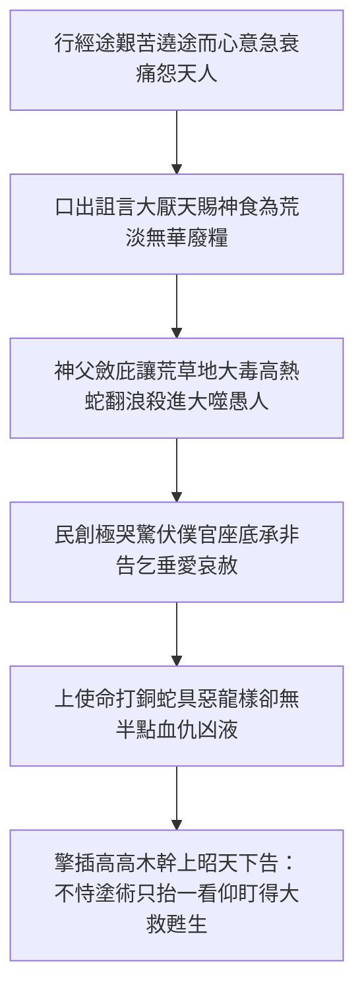

# 民數記 第21章

1. 住南地的迦南人亞拉得王，聽說以色列人從亞他林路來，就和以色列人爭戰，擄了他們幾個人。
2. 以色列人向耶和華發願說：你若將這民交付我手，我就把他們的城邑盡行毀滅。
3. 耶和華應允了以色列人，把迦南人交付他們，他們就把迦南人和迦南人的城邑盡行毀滅。那地方的名便叫何珥瑪（何珥瑪就是毀滅的意思）。
4. 他們從何珥山起行，往紅海那條路走，要繞過以東地。百姓因這路難行，心中甚是煩躁，
5. 就怨讟神和摩西說：你們為什麼把我們從埃及領出來、使我們死在曠野呢？這裡沒有糧，沒有水，我們的心厭惡這淡薄的食物。
6. 於是耶和華使火蛇進入百姓中間，蛇就咬他們。以色列人中死了許多。
7. 百姓到摩西那裡，說：我們怨讟耶和華和你，有罪了。求你禱告耶和華，叫這些蛇離開我們。於是摩西為百姓禱告。
8. 耶和華對摩西說：你製造一條火蛇，掛在杆子上；凡被咬的，一望這蛇，就必得活。
9. 摩西便製造一條銅蛇，掛在杆子上；凡被蛇咬的，一望這銅蛇就活了。
10. 以色列人起行，安營在阿伯。
11. 又從阿伯起行，安營在以耶亞巴琳，與摩押相對的曠野，向日出之地。
12. 從那裡起行，安營在撒烈谷。
13. 從那裡起行，安營在亞嫩河那邊。這亞嫩河是在曠野，從亞摩利的境界流出來的；原來亞嫩河是摩押的邊界，在摩押和亞摩利人搭界的地方。
14. 所以耶和華的戰記上說：蘇法的哇哈伯與亞嫩河的谷，
15. 並向亞珥城眾谷的下坡，是靠近摩押的境界。
16. 以色列人從那裡起行，到了比珥（比珥就是井的意思）。從前耶和華吩咐摩西說：招聚百姓，我好給他們水喝，說的就是這井。
17. 當時，以色列人唱歌說：井啊，湧上水來！你們要向這井歌唱。
18. 這井是首領和民中的尊貴人用圭用杖所挖所掘的。以色列人從曠野往瑪他拿去，
19. 從瑪他拿到拿哈列，從拿哈列到巴末，
20. 從巴末到摩押地的谷，又到那下望曠野之毘斯迦的山頂。
21. 以色列人差遣使者去見亞摩利人的王西宏，說：
22. 求你容我們從你的地經過；我們不偏入田間和葡萄園，也不喝井裡的水，只走大道（原文作王道），直到過了你的境界。
23. 西宏不容以色列人從他的境界經過，就招聚他的眾民出到曠野，要攻擊以色列人，到了雅雜與以色列人爭戰。
24. 以色列人用刀殺了他，得了他的地，從亞嫩河到雅博河，直到亞捫人的境界，因為亞捫人的境界多有堅壘。
25. 以色列人奪取這一切的城邑，也住亞摩利人的城邑，就是希實本與希實本的一切鄉村。
26. 這希實本是亞摩利王西宏的京城；西宏曾與摩押的先王爭戰，從他手中奪取了全地，直到亞嫩河。
27. 所以那些作詩歌的說：你們來到希實本；願西宏的城被修造，被建立。
28. 因為有火從希實本發出，有火焰出於西宏的城，燒盡摩押的亞珥和亞嫩河邱壇的祭司（祭司原文作主）。
29. 摩押啊，你有禍了！基抹的民哪，你們滅亡了！基抹的男子逃奔，女子被擄，交付亞摩利的王西宏。
30. 我們射了他們；希實本直到底本盡皆毀滅。我們使地變成荒場，直到挪法；這挪法直延到米底巴。
31. 這樣，以色列人就住在亞摩利人之地。
32. 摩西打發人去窺探雅謝，以色列人就佔了雅謝的鎮市，趕出那裡的亞摩利人。
33. 以色列人轉回，向巴珊去。巴珊王噩和他的眾民都出來，在以得來與他們交戰。
34. 耶和華對摩西說：不要怕他！因我已將他和他的眾民，並他的地，都交在你手中；你要待他像從前待住希實本的亞摩利王西宏一般。
35. 於是他們殺了他和他的眾子，並他的眾民，沒有留下一個，就得了他的地。

---

## 本章知識節點

### 歷史
- [[亞拉得人襲擊探路者及神賜下徹底戰勝之何珥瑪]]
- [[戰勝希實本與巴珊二大頑梗敵軍與佔領其廣澤領土]]

### 事件
- [[百姓抱怨難路痛厭淡薄食物與耶和華使火蛇咬人]]
- [[比珥活水泉谷與眾首領用圭用杖挖井引頌讚凱歌]]

### 神學
- [[摩西為民祈禱製作銅蛇掛於杆上見證望蛇生得治]]

### 地點
- [[以耶亞巴琳經亞嫩河與戰記上述蘇法的哇哈伯]]

---

## 本章整理

### 在南向要衝何珥瑪擊敗亞拉得王之信心重振（v1-3）

以色列大軍步出尋的曠野沉痛的漫遊歲月、將邁進應許樂地前夕，旅營前緣便於南疆遇到了歷史記憶最驚魂的心碎奮戰地。長期佔踞南部別是巴乾熱土域的迦南名豪亞拉得王，耳聞希伯來百姓正齊率大勇走循古代探子踏巡的古名途——亞他林路進走，竟然仗恃三十八載以前曾於此界將背棄神誓之第一代會群慘打擊碎的舊日勝風，無預警猛挑鋒革偷掠邊陣，擄去數位後哨以色列人。當面臨世敵這般狂傲凶悍的打壓與欺擄折損，現代新起軍魂的生命姿儀大大突破舊習；會中絕無人嚎哭絕望或者相牽咒叫反回埃疆，眾民意志齊奮如雷，直向拯救上天傾獻虔誠與純潔的信仰起誓：「求主俯眷此戰，若手握榮顯者垂令將是眾野鬼豪敵全交付僕民杖柄，我軍定誓把敵邑深土全燔絕燬、完全滅去奉主為聖！」上大君父見會家棄盡自己得贖利益、惟以稱榮神名大舉，及時應允民禱把敵旅推傾。全盟揮戈犁盡南城堡界，將當年為著人勇挫退、曾流乾血淚之失足故土，堂堂刻建為昭告殺絕仇魔歸給上帝的威勝寶碑，起名呼為[[亞拉得人襲擊探路者及神賜下徹底戰勝之何珥瑪|代表至潔毀滅歸神的何珥瑪]]。這極其壯麗的開端宣告：人在歷史苦谷跌碎之處，一旦靠信俯靠造神，即能於同一谷底翻作天勝頌樂之聖城。

> [!quote] 黃迦勒《中文聖經註釋》
> 「何珥瑪是以色列人從前失敗的地方，如今就在那地反敗為勝，而且是大大的得勝。米利巴記錄了百姓的虧欠，何珥瑪記錄了百姓的信心恢復。在神的路上所遇到的挫折，不該使我們氣餒，因為挫折常是引導我們恢復信心的前奏。」

### 繞路焦躁抱怨引招烈毒火蛇與仰望銅蛇之解危（v4-9）

在首嚐南天大激戰的高昂凱揚後，眾軍迎對更峻峭耐受性大考驗：由於死硬愛守世利為本的以東君門提拒路塗並厲拒軍境，以色列軍心情顧順守上帝莫用刃兄血的大義，寧從高敞的何珥絕峰苦繞遠行前往紅海那途大圈背走。誰料沙漠炎乾路遙難越，民眾心神竟被崎嶇歧途拖磨至沮喪如冰，舊性情如狼狂爆；新眾莫復忍懷，公然聚舌齊叫攻擊上帝大尊名並長師摩西，凶凶痛痛追罪曰：「是何惡使我們被拉脫肥蜜之埃及拋投是死狂谷中？你看天毫無米粒甘釀、地毫無蜜流良酒，我們要咬牙痛怨、厭惡並厭厭嫌惡這每日垂天降施的淡薄無味粗鄙食物！」百姓仗血傲狂、出齒譏侮護他性靈長活數千星宿之無暇天使仙糧為不堪嚥咽的一團糟土，無比深刻震怒神王護心！慈恩帷幔不得不自傲群退撇，早潛竄往於曠途熱原之間的大隻熾烈毒火煞猛蛇即獲出世凶隙，翻浪衝襲營間痛吞愚者，使不計其數輕言辱主的好鬥口舌墮進斃垂沉沙底，大張教化於無信貪慾前。

遭災死骸狼藉之下，盲民大醒自過奔去伏罪求救莫及，哀哭對使者大君伯承過說：「吾族真落罪途矣，舌敢指斥天尊及神你，乞早牽誠向父告哀止退是毒龍群吧！」長官莫計毀辱立心合跪天幕大請求活。上帝慈道至闊無限，祂施下不偏奇詭絕絕的解毒秘旨：並非起指即剪撲除諸荒野殺虺，而命僕摩西即工良造一座全掛著窮惡殺身模樣卻深未帶有微塵血性毒素的輝亮金純的「銅蛇」，威震擎插於拔直極立之長大「旗杆」極尖之上；上君大諾下授全邦：凡在草地中創倒瀕絕息之百姓，甚至氣竭殘唇，惟獨拋下自力與胡走世方，抬頸對桿上一目堅仰凝睛望睹是蛇，立蒙聖天真命超拔復活！此一奇景向世代重鐫了毫無替代的天國唯一解救良方：罪者解脫絕死不恃吃藥自拔，唯仰看這[[摩西為民祈禱製作銅蛇掛於杆上見證望蛇生得治|擔了罪態掛在高寒木幹的救贖預表金標]]，便能喜獲復甦至聖大榮。

| 民眾跌絆的苦楚怨言表現 | 引降之管教與罪行真象（見 [[百姓抱怨難路痛厭淡薄食物與耶和華使火蛇咬人]]） | 上帝自立之超絕解毒大恩（見 [[摩西為民祈禱製作銅蛇掛於杆上見證望蛇生得治]]） |
| :--- | :--- | :--- |
| **苦痛嫌道艱曲** | 遭遇難纏舊俗牽退遠去繞途大曠野，意志受摧而叫噪不安 | 上宰用路考人純真意志，磨斷浮誇貪慕順利平穩的大血氣 |
| **厭辱淡薄天糧** | 狂齒叱罵每日天上好嗎哪是平白無趣可憎的餱食，輕縱恩榮 | 神斂卻庇光讓熱土間常居的猛殺大火龍放縱橫衝、傷斃浪民 |
| **伏哭乞哀求醫** | 心醒投抱僕王長跪承禍、痛白自欺背叛恩恩上帝好愛 | 大令打鑄光潔亮容無血素巨「銅蛇」昂掀高桿頂，憑一望便得復世生大美 |

### 穿越眾河古谷與《耶和華的戰記》載唱讚主壯歌（v10-15）

脫免蛇咬哭悲、心懷純信望而重生的前隊會友，不再沉迷退縮與顧看舊恥，兵心直轉挺進迎朝旭昇的喜日晨曦。大軍發足過步安穩依歇於名表富蘊樂流皮袋之阿伯長涯，其後層次向東方邁臨浩歌古城廢址：面向摩押浩浩曠野與日光耀起境界的以耶亞巴琳；旋踏度入旱烈深谷之撒烈乾水坑地，終挺至南北切割無朋偉大巨川、區隔亞摩利凶國與摩押王邦的壯闊極河—亞嫩川疆隔處。這一連繞行絕荒涉過古流不懈進逼的大旅史紀，為向先朝神榮記證神帥恩常伴引，古卷隆深拉入那久失名世舊詩典《耶和華的戰記》，歌唱寫敘永安兵主曾如何不借一尺愚鋒，空自將邊緣狂域蘇法的哇哈伯深險之場打清，並向那深臨摩押神界的巨京大邑亞珥底谷陡坡橫摧克定。此一段波壯山嵐連程的舊跡大歌，為著天下子眾張宣：屬天的孤旅絕不止步一草小地，每一重高過深澗的絕履，皆是陪伴千歲偉大將王把漫沙走成無憂勝曲。

> [!note] 丁良才《釋經與背景註釋》
> 「這一連串前進名城皆帶豐富意義：向著東向『日出之地』步進，象徵信仰走出幽黑；而古冊提及《耶和華的戰記》，正指明天帝親自主領聖徒履踐天下諸道，不在於兵甲血肉，而在乎神旨高舉成讚頌曲揚。」

### 比珥活水湧流與眾王長用圭用杖歡心掏泉之享受（v16-20）

歷經無倫天行涉川喜躍，隊中上下心存樂音直投一座使信光大露輝華的泉丘定駐——古名釋語正是大吉名詞「活井」之良野比珥。當這千群萬黎立到泉岸地頭，破天荒絲毫不用待一口饑渴呼怨、無須僕工苦淚拉拜大求，仁民救贖上君喜溢恩言先唱對摩西賜告：「莫久猶猶、速速集聚滿會好子孫至，我今歡愛送致滔滔好水賞飲！」全黨會友聽命莫興打鬧爭鬥，喜把歌音揚揚拔透大際，群舞齊慶直高吟讚道古詩：「古深好井哪！快疾破塗狂湧解恩吧！合邦諸弟妹，爾等皆得朝是勝井歡騰而歌唱！」

最為震世留頌的名目景象隨而引發：象徵神團信仰清廉無私的大長輩眾伯、亦即領導諸部浩歌十二巨頭一派並七十貴君宗長，他們不用刀刃蠻打狂爭，單以手中主率宣榮的掌徽「權圭」和伴履曠途好長「名杖」，率同合氣往井底狂土深根努力淘掏、把年積沉澱厚厚塞礙活水道的一重重頑石烏沉黑沙徹底刺拔清除。你看這除阻透泉之歡手，瞬間便催激那自最天上湧賜的恩江喜波大跳大冒、漫盈盡養大軍不休！隨之會家直循這大流圖書所宣佈的極光前向歡步直走：過往王上帝恩禮的瑪他拿，進升承受天權洪澤水潮的拿哈列，步立至榮頂天的巔岑山巔巴末，俯登下看無限野川之至偉巨岫毗斯迦台！此程大慶見證向萬神侍宣明：卸除自傲抱怨、把歌歡深挖活恩底端，靈漿即時滾流陪伴永進。

> [!quote] 黃迦勒《中文聖經註釋》
> 「讚美使我們得到泉源，怨言使我們招審判。甚至禱告亦不能使井湧上水來，因為沒有一件東西比讚美更能叫神喜悅。首領與尊貴人用圭用杖掘井，代表靈魂的首長們同心用信心的權柄把肉體與情慾的阻隔掏清除乾，內住耶穌基督的喜水便不竭湧奔而出！」

### 揮師破敗希實本西宏與巴珊王噩之大獲榮業（v21-35）

當喜飽甘流好酒之後，神的聖師終於邁對約旦河邊緣最後一道雄固敵門：霸居北方高大王疆的亞摩利驕虎以及高偉巨人蠻權。摩西仍循和明浩道向雅博南鄰的大霸侯—希實本好都的西宏世家遞封喜語請款借道，深自矢誓只行寬弘御塗絕對不折一片麥禾甘蔗。那恃著剛吞倒舊鄰摩押先軍大喜的傲君西宏心黑拒客，反發軍雄怒挑重軍撲落雅雜谷迎敵。神天大怒放權，百姓英猛持刃痛掃、一夜未費久工便剿清是邦大伍！揮刀屠王得盡千歲大野，一掌取坐自亞嫩至雅博深道以西廣野全幅故土；曾經那嘲歌摩押失城荒廢、大頌西宏威鎮城寨無雙的希實本得意嘲詠古歌，轉瞬間於真君聖仗手下全成了廢沙枯煙。

戰陣不停好銳，旋首一轉破步朝越正北方無涯富茂牛群草海、以豐膏大聞名中原的長嶺美原巴珊大舉踏伐！這那裡盤踞神世傳古最碩極巨一族利乏音大祖——猛候長頸侯霸「巴珊王噩」，親驅死力全軍蜂至大鎮副朝以得來與神爭雄！世態對此狂長魁體無不同皆懼散；唯萬師之宰溫諭忠臣：「且慢放驚恐！我昔年待西宏何樣滅殘，今日也早把噩族王父帶軍甚至片片佳草良田全授交你長掌握底！」聽喜令之戰歌雄壯狂衝，揮軍殺竭頑霸甚至子豪一干將吏悉解命脈「破死靡遺留一人未在」，穩將戈蘭高廣無限草原盡併大王版圖！兩大妖關盡被剷破，為古往神家豎下了：唯恃神信毫無畏駭世間最高魔堅與崇強石寨，手持神名長赴戰役必得坐享有常之浩福天地王區的永遠旌旗。

> [!note] KingComments 默思光遠心解
> 「常有巨人豪城正鎮守於流奶高地進渡之倒數一關！切切記得主云『莫怕他！』那是假仗肉氣逞狂的好鬥廢像，當神徒心存長望勇向他攻取，你過往懼畏的頑霸早成為你手中收得大無限美好土田的榮勝喜宴品！」

**參考資料**
https://www.ccbiblestudy.org/Old%20Testament/04Num/04CT21.htm
https://www.ccbiblestudy.org/Old%20Testament/04Num/04GT21.htm
https://www.kingcomments.com/en/bible-studies/Num/21
https://biblehub.com/study/numbers/21.htm
