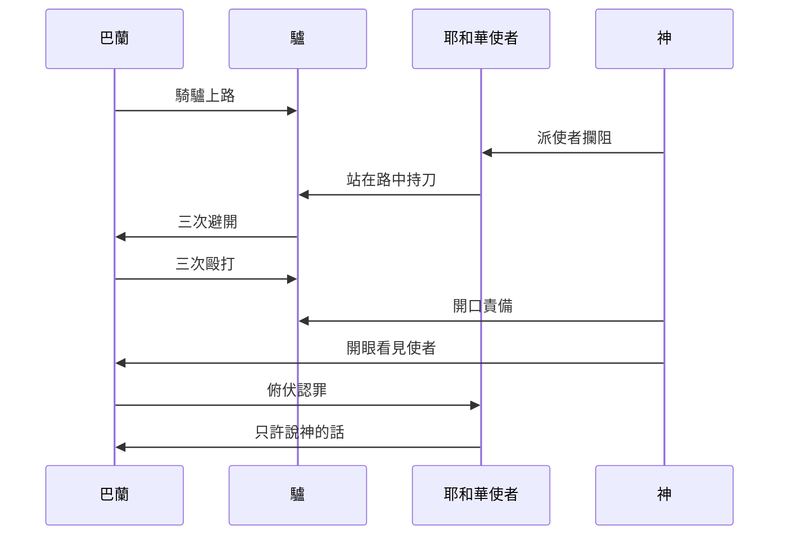

# 民數記 第22章

1. 以色列人起行，在摩押平原、約但河東，對著[[耶利哥]]安營。
2. 以色列人向亞摩利人所行的一切事，[[摩押王巴勒|西撥的兒子]][[摩押王巴勒|巴勒]]都看見了。
3. 摩押人因以色列民甚多，就大大懼怕，[[巴勒看見以色列擊敗亞摩利人|心內憂急]]，
4. 對米甸的長老說：現在這眾人要把我們四圍所有的一概餂盡，就如牛餂盡田間的草一般。那時[[摩押王巴勒|西撥的兒子]][[摩押王巴勒|巴勒]]作[[摩押王巴勒|摩押王]]。
5. 他[[巴勒差遣使者召巴蘭|差遣使者]]往大河邊的毘奪去，到[[巴勒差遣使者召巴蘭|比珥的兒子巴蘭]]本鄉那裡，召巴蘭來，說：有一宗民從埃及出來，遮滿地面，與我對居。
6. 這民比我強盛，現在求你來為我咒詛他們，或者我能得勝，攻打他們，趕出此地。因為我知道，你為誰祝福，誰就得福；你咒詛誰，誰就受咒詛。
7. 摩押的長老和米甸的長老手裡[[摩押長老|拿著卦金]]，到了巴蘭那裡，將[[摩押米甸長老拿卦金見巴蘭|巴勒的話]]都告訴了他。
8. 巴蘭說：你們今夜在這裡住宿，我必照耶和華所曉諭我的回報你們。摩押的使臣就在巴蘭那裡住下了。
9. [[神禁止巴蘭同去咒詛|神臨到巴蘭]]那裡，說：在你這裡的人都是誰？
10. 巴蘭回答說：是[[摩押王巴勒|摩押王]][[摩押王巴勒|西撥的兒子]][[摩押王巴勒|巴勒]]打發人到我這裡來，說：
11. 從埃及出來的民遮滿地面，你來為我咒詛他們，或者我能與他們爭戰，把他們趕出去。
12. 神對巴蘭說：你不可同他們去，也不可咒詛那民，因為那民是蒙福的。
13. 巴蘭早晨起來，對[[摩押王巴勒|巴勒]]的使臣說：你們回本地去吧，因為耶和華不容我和你們同去。
14. 摩押的使臣就起來，回[[摩押王巴勒|巴勒]]那裡去，說：巴蘭不肯和我們同來。
15. [[摩押王巴勒|巴勒]][[巴勒再差遣更多更尊貴的使臣|又差遣使臣]]，比先前的又多又尊貴。
16. 他們到了巴蘭那裡，對他說：[[摩押王巴勒|西撥的兒子]][[摩押王巴勒|巴勒]]這樣說：求你不容什麼事攔阻你不到我這裡來，
17. 因為我必使你得[[巴勒再差遣更多更尊貴的使臣|極大的尊榮]]。你向我要什麼，我就給你什麼；只求你來為我咒詛這民。
18. 巴蘭回答[[摩押王巴勒|巴勒]]的臣僕說：巴勒就是將他滿屋的金銀給我，我行大事小事也不得越過耶和華─我神的命。
19. 現在我請你們今夜在這裡住宿，等我得知耶和華還要對我說什麼。
20. 當夜，[[神禁止巴蘭同去咒詛|神臨到巴蘭]]那裡，說：這些人若來召你，[[神是否改變心意允許巴蘭同去|你就起來同他們去]]，你只要[[神允許巴蘭同去但只說神的話|遵行我對你所說的話]]。
21. 巴蘭早晨起來，備上[[巴蘭的驢|驢]]，和摩押的使臣一同去了。
22. [[巴蘭騎驢遇耶和華使者|神因他去就發了怒]]；[[巴蘭騎驢遇耶和華使者|耶和華的使者站在路上]]敵擋他。他騎著[[巴蘭的驢|驢]]，有兩個僕人跟隨他。
23. [[巴蘭騎驢遇耶和華使者|驢看見耶和華的使者]]站在路上，手裡有拔出來的刀，就從路上跨進田間，巴蘭便打驢，要叫他回轉上路。
24. 耶和華的使者就站在葡萄園的窄路上；這邊有牆，那邊也有牆。
25. [[巴蘭騎驢遇耶和華使者|驢看見耶和華的使者]]，就貼靠牆，將巴蘭的腳擠傷了；巴蘭又打驢。
26. 耶和華的使者又往前去，站在狹窄之處，左右都沒有轉折的地方。
27. [[巴蘭騎驢遇耶和華使者|驢看見耶和華的使者]]，就臥在巴蘭底下，巴蘭發怒，用杖打驢。
28. 耶和華叫[[巴蘭的驢|驢開口]]，對巴蘭說：我向你行了什麼，你竟打我這三次呢？
29. 巴蘭對[[巴蘭的驢|驢]]說：因為你戲弄我，我恨不能手中有刀，把你殺了。
30. [[巴蘭的驢|驢]]對巴蘭說：我不是你從小時直到今日所騎的驢嗎？我[[驢開口說話預表神奇妙拯救|素常向你這樣行過嗎]]？巴蘭說：沒有。
31. 當時，[[巴蘭眼目明亮看見耶和華使者|耶和華使巴蘭的眼目明亮]]，他就[[巴蘭眼目明亮看見耶和華使者|看見耶和華的使者]]站在路上，手裡有拔出來的刀，巴蘭便[[巴蘭眼目明亮看見耶和華使者|低頭俯伏在地]]。
32. 耶和華的使者對他說：你為何這三次打你的[[巴蘭的驢|驢]]呢？我出來敵擋你，因你所行的，在我面前偏僻。
33. [[巴蘭的驢|驢]]看見我就三次從我面前偏過去；驢若沒有偏過去，我早把你殺了，留他存活。
34. 巴蘭對耶和華的使者說：我有罪了。我不知道你站在路上阻擋我；你若不喜歡我去，我就轉回。
35. 耶和華的使者對巴蘭說：你同這些人去吧！你只要說我對你說的話。於是巴蘭同著[[摩押王巴勒|巴勒]]的使臣去了。
36. [[摩押王巴勒|巴勒]]聽見巴蘭來了，就往[[基列胡瑣|摩押京城]]去迎接他；這城是在邊界上，在亞嫩河旁。
37. [[摩押王巴勒|巴勒]]對巴蘭說：我不是急急地打發人到你那裡去召你嗎？你為何不到我這裡來呢？[[巴勒迎接巴蘭到基列胡瑣|我豈不能使你得尊榮]]嗎？
38. 巴蘭說：我已經到你這裡來了！現在我豈能擅自說什麼呢？[[巴勒迎接巴蘭到基列胡瑣|神將什麼話傳給我]]，我就說什麼。
39. 巴蘭和[[摩押王巴勒|巴勒]]同行，來到基列胡瑣。
40. [[摩押王巴勒|巴勒]]宰了（原文作獻）牛羊，[[巴勒獻牛羊巴蘭觀看以色列營|送給巴蘭]]和陪伴的使臣。
41. 到了早晨，[[摩押王巴勒|巴勒]]領巴蘭到巴力的高處；巴蘭從那裡觀看以色列營的邊界。

<!-- fhl-map-links:start -->
## 相關地圖

- [[appendix/fhl_maps/maps/022|〈民圖三〉從何珥山到摩押平原]]
- [[appendix/fhl_maps/maps/023|〈民圖四〉分地給兩個半支派]]
- [[appendix/fhl_maps/maps/024|〈民圖五〉出埃及和進迦南的旅程]]
<!-- fhl-map-links:end -->

---

## 本章知識節點

### 地理
- [[以色列在摩押平原安營]]
- [[摩押平原]]
- [[耶利哥]]
- [[毗奪]]
- [[基列胡瑣]]
- [[巴力的高處]]

### 人物
- [[摩押王巴勒]]
- [[摩押長老]]
- [[摩押米甸長老拿卦金見巴蘭]]
- [[巴蘭是否真先知還是假先知]]
- [[巴蘭預表假先知貪圖卦金]]
- [[巴蘭的驢]]

### 事件
- [[巴勒看見以色列擊敗亞摩利人]]
- [[巴勒差遣使者召巴蘭]]
- [[卦金（qesem）]]
- [[巴勒再差遣更多更尊貴的使臣]]
- [[神禁止巴蘭同去咒詛]]
- [[神允許巴蘭同去但只說神的話]]
- [[神是否改變心意允許巴蘭同去]]
- [[巴蘭騎驢遇耶和華使者]]
- [[神使驢開口責備巴蘭互文]]
- [[驢開口說話預表神奇妙拯救]]
- [[巴蘭眼目明亮看見耶和華使者]]
- [[巴勒迎接巴蘭到基列胡瑣]]
- [[巴勒獻牛羊巴蘭觀看以色列營]]
- [[巴勒召巴蘭咒詛以色列互文]]

### 神學
- [[神主權超越咒詛祝福]]
- [[巴蘭愛不義之工價互文]]

---

## 本章整理

### 摩押平原的危機與巴勒的召喚（v1-7）
以色列人在出埃及四十年後，終於來到 **[[摩押平原]]** 安營，對著 **[[耶利哥]]**（v1）。**[[摩押王巴勒]]** 親眼看見以色列擊敗亞摩利人，**[[巴勒看見以色列擊敗亞摩利人|心生大懼]]**（v2-3）。他聯同 **[[摩押長老]]** 與 **[[摩押米甸長老拿卦金見巴蘭|米甸長老]]**，手持 **[[卦金（qesem）|卦金]]** 派遣使者往 **[[毗奪]]** 召 **[[巴蘭是否真先知還是假先知|巴蘭]]** 來咒詛以色列（v4-7）。巴勒深信「你為誰祝福誰就得福，你咒詛誰誰就受咒詛」（v6），這反映古近東普遍視咒詛為可操控的屬靈武器，卻忽略 **[[神主權超越咒詛祝福|耶和華的主權]]**。

### 神的雙重回應與巴蘭的動搖（v8-20）
首次詢問時，**[[神禁止巴蘭同去咒詛|神明確禁止]]** 巴蘭同去，因以色列是蒙福的民（v12）。巴蘭順服拒絕首批使臣（v13-14）。**[[巴勒再差遣更多更尊貴的使臣|巴勒加派重臣]]** 並許以厚利（v15-17），巴蘭雖口稱「不得越過耶和華的命」（v18），卻再次求問神，顯露 **[[巴蘭預表假先知貪圖卦金|貪圖不義之工價]]** 的內心（參彼後 2:15）。神此次 **[[神允許巴蘭同去但只說神的話|許可同去]]** 但嚴守「只說我對你說的話」（v20），這引發 **[[神是否改變心意允許巴蘭同去|神心意是否改變]]** 的神學討論：實為容許計畫在審判中成就祝福。

### 驢與使者：神奇妙的攔阻與啟示（v21-35）
巴蘭騎驢上路，**[[神使驢開口責備巴蘭互文|耶和華發怒]]** 派使者攔阻（v22）。驢三次避開持刀使者（v23、25、27），巴蘭三次毆打驢。神開驢口責備，再開巴蘭眼看見使者（v28-31）。這 **[[驢開口說話預表神奇妙拯救|非常手段]]** 證明：連畜牲都比屬靈眼瞎的先知更敏銳。**[[巴蘭眼目明亮看見耶和華使者|巴蘭眼目明亮]]** 後俯伏認罪（v34），使者重申只許說神的話（v35）。

> [!note] 三次相遇對照
> | 次數 | 地點 | 驢的反應 | 巴蘭的反應 |
> |------|------|------------|--------------|
> | 1 | 寬闊大路 | 闖入田間 | 打驢趕回路 |
> | 2 | 葡萄園窄路 | 貼牆擠傷巴蘭腳 | 再打驢 |
> | 3 | 無法轉折之處 | 臥在地上 | 發怒用杖打驢 |

### 巴蘭抵達摩押：初見以色列營（v36-41）
**[[巴勒迎接巴蘭到基列胡瑣|巴勒在邊境迎接]]** 巴蘭至 **[[基列胡瑣]]**（v36-37）。巴蘭再次聲明 **[[巴勒召巴蘭咒詛以色列互文|只能說神賜的話]]**（v38）。巴勒宰牛羊款待，清早帶巴蘭上 **[[巴力的高處]]**，從此 **[[巴勒獻牛羊巴蘭觀看以色列營|觀看以色列營邊界]]**（v39-41），為後續三次求神發託、反成祝福鋪排。

> [!important] 本章樞紐
> 神的主權不受人操控：咒詛無法凌駕亞伯拉罕之約的祝福（創 12:3）。巴蘭雖具先知恩賜，卻因貪慾成為 **[[巴蘭愛不義之工價互文|假先知的反面典型]]**（猶 1:11），神卻借驢、借使者、借敵對國王，將咒詛轉為祝福，彰顯 **[[神主權超越咒詛祝福|救恩計畫的不可阻擋]]**。

**參考資料**
https://www.ccbiblestudy.org/Old%20Testament/04Num/04CT22.htm
https://www.ccbiblestudy.org/Old%20Testament/04Num/04GT22.htm
https://www.kingcomments.com/en/bible-studies/Num/22
https://biblehub.com/study/numbers/22.htm
