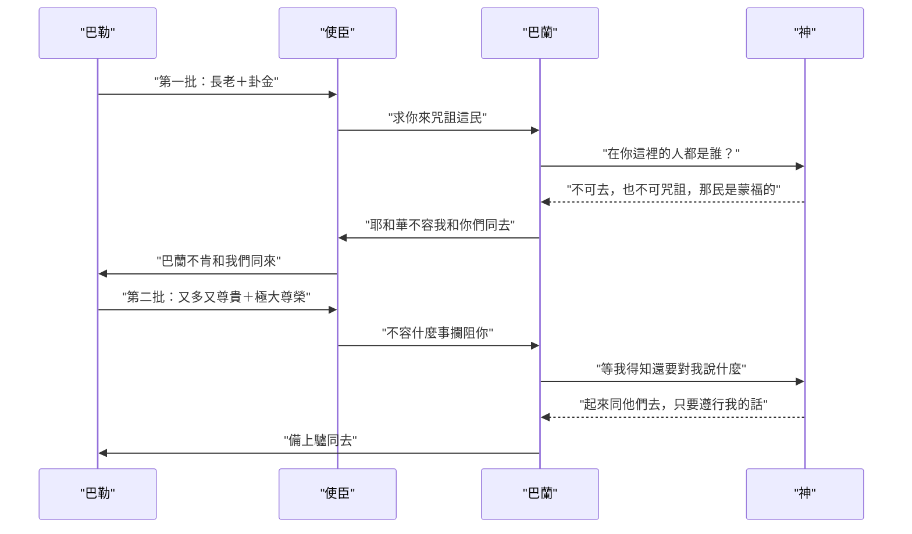

# 民數記 第22章

<!-- chapter-navigation:start -->
| [前一章](../04%20民數記/第21章.md) | [回目錄](../04%20民數記/全書目錄及綱要.md) | [下一章](../04%20民數記/第23章.md) |
| :--- | :---: | ---: |
<!-- chapter-navigation:end -->

1. 以色列人起行，在[[摩押平原]]、[[約但河]]東，對著[[耶利哥]]安營。
2. 以色列人向[[亞摩利人]]所行的一切事，西撥的兒子[[巴勒]]都看見了。
3. [[摩押人]]因以色列民甚多，就大大懼怕，心內憂急，
4. 對[[米甸]]的長老說：現在這眾人要把我們四圍所有的一概餂盡，就如牛餂盡田間的草一般。那時西撥的兒子[[巴勒]]作摩押王。
5. 他差遣使者往[[毘奪（巴蘭的本鄉）|大河]]邊的[[毘奪（巴蘭的本鄉）|毘奪]]去，到比珥的兒子[[巴蘭（比珥的兒子）|巴蘭]]本鄉那裡，召巴蘭來，說：有一宗民從埃及出來，遮滿地面，與我對居。
6. 這民比我強盛，現在求你來為我[[咒詛（a.rar 與 qa.vav）|咒詛]]他們，或者我能得勝，攻打他們，趕出此地。因為我知道，你為誰祝福，誰就得福；你咒詛誰，誰就受咒詛。
7. 摩押的長老和[[米甸]]的長老手裡拿著[[卦金（qe.sem）|卦金]]，到了[[巴蘭（比珥的兒子）|巴蘭]]那裡，將[[巴勒]]的話都告訴了他。
8. [[巴蘭（比珥的兒子）|巴蘭]]說：你們今夜在這裡住宿，我必照耶和華所曉諭我的回報你們。摩押的使臣就在巴蘭那裡住下了。
9. 神臨到[[巴蘭（比珥的兒子）|巴蘭]]那裡，說：在你這裡的人都是誰？
10. [[巴蘭（比珥的兒子）|巴蘭]]回答說：是摩押王西撥的兒子[[巴勒]]打發人到我這裡來，說：
11. 從埃及出來的民遮滿地面，你來為我[[咒詛（a.rar 與 qa.vav）|咒詛]]他們，或者我能與他們爭戰，把他們趕出去。
12. 神對[[巴蘭（比珥的兒子）|巴蘭]]說：你不可同他們去，也不可[[咒詛（a.rar 與 qa.vav）|咒詛]]那民，因為那民是蒙福的。
13. [[巴蘭（比珥的兒子）|巴蘭]]早晨起來，對[[巴勒]]的使臣說：你們回本地去吧，因為耶和華不容我和你們同去。
14. 摩押的使臣就起來，回[[巴勒]]那裡去，說：[[巴蘭（比珥的兒子）|巴蘭]]不肯和我們同來。
15. [[巴勒]]又差遣使臣，比先前的又多又尊貴。
16. 他們到了[[巴蘭（比珥的兒子）|巴蘭]]那裡，對他說：西撥的兒子[[巴勒]]這樣說：求你不容什麼事攔阻你不到我這裡來，
17. 因為我必使你得極大的尊榮。你向我要什麼，我就給你什麼；只求你來為我[[咒詛（a.rar 與 qa.vav）|咒詛]]這民。
18. [[巴蘭（比珥的兒子）|巴蘭]]回答[[巴勒]]的臣僕說：巴勒就是將他滿屋的金銀給我，我行大事小事也不得[[越過耶和華的口（peh）|越過耶和華─我神的命]]。
19. 現在我請你們今夜在這裡住宿，等我得知耶和華還要對我說什麼。
20. 當夜，神臨到[[巴蘭（比珥的兒子）|巴蘭]]那裡，說：這些人若來召你，你就起來同他們去，你只要遵行我對你所說的話。
21. [[巴蘭（比珥的兒子）|巴蘭]]早晨起來，備上[[驢]]，和摩押的使臣一同去了。
22. 神因他去就發了怒；[[耶和華的使者]]站在路上[[敵擋（sa.tan）|敵擋]]他。他騎著[[驢]]，有兩個僕人跟隨他。
23. [[驢]]看見[[耶和華的使者]]站在路上，手裡有拔出來的[[刀劍|刀]]，就從路上跨進田間，[[巴蘭（比珥的兒子）|巴蘭]]便打驢，要叫他回轉上路。
24. [[耶和華的使者]]就站在葡萄園的窄路上；這邊有牆，那邊也有牆。
25. [[驢]]看見[[耶和華的使者]]，就貼靠牆，將[[巴蘭（比珥的兒子）|巴蘭]]的腳擠傷了；巴蘭又打驢。
26. [[耶和華的使者]]又往前去，站在狹窄之處，左右都沒有轉折的地方。
27. [[驢]]看見[[耶和華的使者]]，就臥在[[巴蘭（比珥的兒子）|巴蘭]]底下，巴蘭發怒，用杖打驢。
28. [[驢開口說話|耶和華叫驢開口]]，對[[巴蘭（比珥的兒子）|巴蘭]]說：我向你行了什麼，你竟打我這三次呢？
29. [[巴蘭（比珥的兒子）|巴蘭]]對[[驢]]說：因為你戲弄我，我恨不能手中有[[刀劍|刀]]，把你殺了。
30. [[驢]]對[[巴蘭（比珥的兒子）|巴蘭]]說：我不是你從小時直到今日所騎的驢嗎？我素常向你這樣行過嗎？巴蘭說：沒有。
31. 當時，耶和華使[[巴蘭（比珥的兒子）|巴蘭]]的[[眼目明亮（ga.lah）|眼目明亮]]，他就看見[[耶和華的使者]]站在路上，手裡有拔出來的[[刀劍|刀]]，巴蘭便低頭俯伏在地。
32. [[耶和華的使者]]對他說：你為何這三次打你的[[驢]]呢？我出來[[敵擋（sa.tan）|敵擋]]你，因你所行的，在我面前偏僻。
33. [[驢]]看見我就三次從我面前偏過去；驢若沒有偏過去，我早把你殺了，留他存活。
34. [[巴蘭（比珥的兒子）|巴蘭]]對[[耶和華的使者]]說：我有罪了。我不知道你站在路上阻擋我；你若不喜歡我去，我就轉回。
35. [[耶和華的使者]]對[[巴蘭（比珥的兒子）|巴蘭]]說：你同這些人去吧！你只要說我對你說的話。於是巴蘭同著[[巴勒]]的使臣去了。
36. [[巴勒]]聽見[[巴蘭（比珥的兒子）|巴蘭]]來了，就往摩押京城去迎接他；這城是在邊界上，在[[亞嫩河]]旁。
37. [[巴勒]]對[[巴蘭（比珥的兒子）|巴蘭]]說：我不是急急地打發人到你那裡去召你嗎？你為何不到我這裡來呢？我豈不能使你得尊榮嗎？
38. [[巴蘭（比珥的兒子）|巴蘭]]說：我已經到你這裡來了！現在我豈能擅自說什麼呢？神將什麼話傳給我，我就說什麼。
39. [[巴蘭（比珥的兒子）|巴蘭]]和[[巴勒]]同行，來到[[基列胡瑣]]。
40. [[巴勒]]宰了（原文作獻）牛羊，送給[[巴蘭（比珥的兒子）|巴蘭]]和陪伴的使臣。
41. 到了早晨，[[巴勒]]領[[巴蘭（比珥的兒子）|巴蘭]]到[[巴力的高處（Bamoth-baal）|巴力的高處]]；巴蘭從那裡觀看以色列營的邊界。

---

## 本章知識節點

### 人物
- [[巴勒]]
- [[巴蘭（比珥的兒子）]]
- [[摩押人]]
- [[亞摩利人]]
- [[米甸]]

### 地點
- [[摩押平原]]
- [[耶利哥]]
- [[約但河]]
- [[毘奪（巴蘭的本鄉）]]
- [[亞嫩河]]
- [[基列胡瑣]]
- [[巴力的高處（Bamoth-baal）]]
- [[摩押地]]

### 事件
- [[驢開口說話]]

### 原文
- [[卦金（qe.sem）]]
- [[敵擋（sa.tan）]]
- [[咒詛（a.rar 與 qa.vav）]]
- [[越過耶和華的口（peh）]]
- [[眼目明亮（ga.lah）]]

### 神學
- [[耶和華的使者]]
- [[神的允許與神的命定]]
- [[神的主權]]

### 主題
- [[祝福與咒詛]]
- [[先知]]
- [[刀劍]]

### 背景
- [[巴力（迦南主神）]]
- [[代爾阿拉的巴蘭銘文]]
- [[基抹（摩押的神）]]
- [[古代近東的神諭機制]]

### 解經爭議
- [[巴蘭是先知還是術士]]
- [[神既准巴蘭去又向他發怒]]
- [[耶和華的使者是否為神顯現]]

### 互文
- [[巴蘭的道路（彼後2：15-16）]]
- [[巴蘭的錯謬（猶11）]]
- [[巴蘭的教訓（啟2：14）]]
- [[咒詛你的我必咒詛他（創12：3）]]
- [[開眼得見天上軍兵（王下6：17）]]

---

## 本章整理

### 一個看得見的威脅，和一個看不見的計畫（v1-6）

以色列人走完了曠野的路，在 [[摩押平原]] 紮下營。對岸就是 [[耶利哥]]，中間只隔著 [[約但河]] ——營帳的方向已經說明了一切：他們要過河，不是要打摩押。但 [[巴勒|西撥的兒子巴勒]] 看見的只有前一場戰爭的結果。GT《民數記串珠聖經註釋》把他的處境說得很清楚：「亞摩利人比摩押人強大，所以當以色列人取道摩押時，摩押人肯供給糧食和水」，只期望亞摩利人會擊敗以色列人，而「現在亞摩利人慘敗，摩押人就更恐懼了」

這份恐懼其實沒有根據。GT《聖經精讀本──民數記註解》指出：「摩押並不是以色列百姓要剿滅的物件(申7:1),所以沒有必要害怕以色列百姓經過。」KC 說得更重——惡人總是在沒有危險的地方看見危險，因為他們良心有虧。

於是巴勒換了戰場。GT《串珠》點出這一步背後的世界觀：「古代的民族有一相同信念，認為國家的興衰有系於一國之神的強弱。現在巴勒要請他國之神來幫忙。」他派人去請 [[巴蘭（比珥的兒子）|比珥的兒子巴蘭]]，一位住在幼發拉底河邊 [[毘奪（巴蘭的本鄉）|毘奪]] 的名術士。KC 由此指出巴勒最根本的誤判：他把以色列的神當成一位民族性的偶像，就像每個國家都有自己的神一樣；他只知道神是聖潔的，卻完全不知道神的恩典。

> [!important] 讀者一開始就知道，以色列卻不知道
> KC 提醒，這三章的對話發生在以色列全然不知情的時候，就像約伯記一開頭神與撒但的對話一樣——而結果也一樣：仇敵的攻擊反成了神賜福的場合。

### 兩次求問，兩個答案（v7-21）

長老們手裡拿著 [[卦金（qe.sem）|卦金]] 上門。**STEP語言資料**顯示這個詞的原文是 ke.sa.Mim（H7081），字面就是「占卜」的複數形；CT 說它「指求見的禮物」，GT《舊約聖經背景註釋》則追問：「但巴蘭要到咒詛以色列人之後才能收費（民二十四11）。故此，這數額可能是報酬而非定金。」

第一次求問，神的答覆沒有轉圜：「你不可同他們去，也不可咒詛那民，因為那民是蒙福的。」CT 指出這句話的份量：「暗示即使以色列向神犯了罪，行了當咒詛的事，但他們始終是神的百姓，所以並不是被外邦人咒詛滅亡的對象。」這正是 [[咒詛你的我必咒詛他（創12：3）|創12:3 那句應許]] 的效力所在。

巴蘭轉述給使臣的版本卻少了一半。GT 丁良才《民數記註釋》抓得很準：「憑這一句可知巴蘭有願意去的意思。巴蘭並沒有說神不准我咒詛以色列人，因為那民是蒙福的（12）。」使臣回報時又再削一次，只說「巴蘭不肯和我們同來」。

第二批使臣「比先前的又多又尊貴」。丁良才說：「先前被差的人，總看出巴蘭猶疑不定，以為他是多要些卦金。」巴蘭這時說了本章最漂亮的一句話——再多金銀也不能 [[越過耶和華的口（peh）|越過耶和華我神的命]] ——然後緊接著請他們再住一夜，好「等我得知耶和華還要對我說什麼」。CT 對這句的評語是：「去與不去，都假借神的意思。」

```mermaid
sequenceDiagram
    participant B as "巴勒"
    participant M as "使臣"
    participant N as "巴蘭"
    participant G as "神"
    B->>M: "第一批：長老＋卦金"
    M->>N: "求你來咒詛這民"
    N->>G: "在你這裡的人都是誰？"
    G-->>N: "不可去，也不可咒詛，那民是蒙福的"
    N->>M: "耶和華不容我和你們同去"
    M->>B: "巴蘭不肯和我們同來"
    B->>M: "第二批：又多又尊貴＋極大尊榮"
    M->>N: "不容什麼事攔阻你"
    N->>G: "等我得知還要對我說什麼"
    G-->>N: "起來同他們去，只要遵行我的話"
    N->>B: "備上驢同去"
```

[[神的允許與神的命定|神在第20節的允許]] 與第12節的禁止怎麼並存，是本章最常被問的問題。CT 的分法是：「神的命定絲毫沒有改變，改變的是巴蘭的道路，他放棄了神的命定，而接受了神的允許。」丁良才的說法相同——「神先因恩典不淮巴蘭去，後因發怒任憑他去（12、35）。神往往如此待人」——並列出詩一百零六15、箴一31、賽六十六4、耶二19 一串同型經文。KC 則說神常常給人與他們自己的願望相符的差事，正如祂給以色列一個像掃羅那樣的王。

### 路上的三次攔阻（v22-35）

第22節出現全章最刺眼的一句：站在路上作攔阻者的，正是 [[耶和華的使者]]。**STEP語言資料**顯示「[[敵擋（sa.tan）|敵擋]]」的原文是 le./sa.Tan（H7854），簡要義域 sa.tan: Satan——但 GT《舊約聖經背景註釋》立刻劃出界線：「本節用這個字只是形容天使在此扮演的敵對角色而已」，不是約伯記裡那位有格性的控訴者。

接下來的三個回合，[[驢]] 一次比一次沒有退路：

| 回合 | 地形 | 驢的反應 | 巴蘭的反應 |
| --- | --- | --- | --- |
| 一（v23） | 開闊的路上 | 跨進田間 | 打驢，要牠回轉上路 |
| 二（v24-25） | 葡萄園的窄路，兩邊有牆 | 貼靠牆，把巴蘭的腳擠傷 | 又打驢 |
| 三（v26-27） | 狹窄之處，左右都沒有轉折的地方 | 臥在巴蘭底下 | 發怒，用杖打驢 |

丁良才把這個結構整理成兩組數字：驢做了四件事（跨進田間、貼牆、臥下、開口說人話），巴蘭打了三次（打、再打、用杖打）。GT《啟導本聖經註釋》下的評語最直接：「一個自以為法力無邊的術士卻看不見神的天使，連驢也不如。」

[[驢開口說話|驢開口]] 是全章的轉折。GT《啟導本》指出：「除了伊甸園的蛇（創三1），全部聖經只有這裡記載動物開口說話。不同的是：蛇的話出乎魔鬼，驢說話是神叫它（28節）。」KC 細讀驢說的三句話：牠承認巴蘭對牠的所有權、指出自己一生忠心服事、並且指出反常的不是牠而是他；但 KC 同時強調，這些問句沒有預言性的內容，只是任何一隻被虐待的動物都會問的話。真正反常的是巴蘭的反應——驢說了人話，他竟毫不驚訝，只顧著和牠爭辯。

然後神開了他的眼睛。**STEP語言資料**在這裡給出一個容易被中文譯法蓋掉的分別：第28節開驢的口用的是 H6605A（to open），第31節 [[眼目明亮（ga.lah）|使巴蘭的眼目明亮]] 用的卻是 va/y.Gal（H1540I），簡要義域 ga.lah: to reveal: uncover——不是把壞掉的眼睛修好，而是把一層遮蔽揭開。CT 說這裡的眼睛「並不是指巴蘭身體的眼睛，而是指他屬靈的眼睛，也就是說指他屬靈的認知能力」；BH 則引 [[開眼得見天上軍兵（王下6：17）|王下6:17 以利沙的僕人被開眼]] 作對照。兩處差別很大：僕人看見的是保護，巴蘭看見的是對著自己的 [[刀劍|刀]]。

### 從邊界到巴力的高處（v36-41）

巴勒親自趕到 [[亞嫩河]] 旁的邊界城迎接。丁良才指出這條界線的由來：「亞摩利人的王西宏，曾占了摩押地，直到亞嫩河。」——摩押的國界之所以在這裡，本身就是一場敗仗的結果。GT《串珠》說巴勒到此迎接，是「希望巴蘭迅速地辦完他所願望的事」。

一行人先到 [[基列胡瑣]]，巴勒在那裡宰牛羊設宴（第40節小字註明「原文作獻」）。丁良才對這一節有個具體的推想：「巴勒一面獻祭，一面請巴蘭和陪伴他的使臣坐席。巴勒大概將這些牛羊獻給耶和華，因為巴蘭是耶和華的先知。」

隔天早晨，巴勒把巴蘭帶上 [[巴力的高處（Bamoth-baal）|巴力的高處]]。**STEP語言資料**顯示這在原文其實是一個地名（H1120H／H1168I，兩字都標為專有地名），和合本的意譯讓讀者容易忽略它是個地點。KC 指出這是聖經第一次提到 [[巴力（迦南主神）|巴力]]，並說這是一個完全獻給撒但的地方；他同時看出巴勒選址的用意——從這裡巴蘭看不到全民，只看得到一部分，好讓他小看這個民族。CT 則說這個「觀看以色列營的邊界」有兩種解法：看到的是最遠處的營盤，或只是最近處的營盤。

### 這個人到底是誰（跨章脈絡）

[[巴蘭是先知還是術士|巴蘭的身分]] 在四套來源之間沒有共識，而分歧的關鍵是判準不同：

| 來源 | 判準 | 結論 |
| --- | --- | --- |
| GT《舊約聖經背景註釋》 | 溝通方式（直接領受、以神諭形式宣告） | 「具有國際性的真先知信譽」，不獨是個占卜者 |
| GT《啟導本聖經註釋》 | 敘事線索與後續行為 | 不是聖潔的先知，列出四點理由 |
| GT《民數記串珠聖經註釋》 | 動機 | 「巴蘭並不是耶和華的先知（本章從沒有用這詞）」 |
| KC | 信息內容（有無指出不忠與悔改） | 假先知、撒但的僕人 |
| CT | 職業身分 | 「一位出名的異教術士」 |

GT《啟導本》自己提出並回答了隨之而來的問題：受感說話的人不一定是聖潔的——連受神罰的掃羅王仍可說預言（撒上19:23-24）；「神可以用任何人替祂說話，巴蘭能說神要說的話，不一定就表示他聖潔」。這一點與 [[代爾阿拉的巴蘭銘文|考古發現的代爾阿拉銘文]] 互相呼應：主前九世紀的約旦已有一份亞蘭文文獻，把比珥的兒子巴蘭記成一個夜間領受神明信息的先見。

至於他的結局，新約用三個詞記住了他：[[巴蘭的道路（彼後2：15-16）|彼後2:15 的「巴蘭的道路」]]、[[巴蘭的錯謬（猶11）|猶11 的「巴蘭的錯謬」]]、[[巴蘭的教訓（啟2：14）|啟2:14 的「巴蘭的教訓」]]。本章的 [[咒詛（a.rar 與 qa.vav）|咒詛]] 從頭到尾沒有成功，而 GT 李道生《舊約聖經問題總解》指出，他後來換了一條路——教巴勒把絆腳石放在以色列人面前，「而陷眾民於險惡的罪中，使二萬四千人遭受瘟疫死亡之禍」。外面的咒詛動不了這民，能傷害他們的只有他們自己的不忠。

**參考資料**
https://www.ccbiblestudy.org/Old%20Testament/04Num/04CT22.htm
https://www.ccbiblestudy.org/Old%20Testament/04Num/04GT22.htm
https://www.kingcomments.com/en/bible-studies/Num/22
https://biblehub.com/study/numbers/22.htm
https://github.com/STEPBible/STEPBible-Data

<!-- appendix-links:start -->
## 附錄

### 相關地圖
- [[appendix/fhl_maps/maps/022|〈民圖三〉從何珥山到摩押平原]]
- [[appendix/fhl_maps/maps/023|〈民圖四〉分地給兩個半支派]]
- [[appendix/fhl_maps/maps/024|〈民圖五〉出埃及和進迦南的旅程]]
<!-- appendix-links:end -->

<!-- chapter-navigation:start -->
| [前一章](../04%20民數記/第21章.md) | [回目錄](../04%20民數記/全書目錄及綱要.md) | [下一章](../04%20民數記/第23章.md) |
| :--- | :---: | ---: |
<!-- chapter-navigation:end -->
