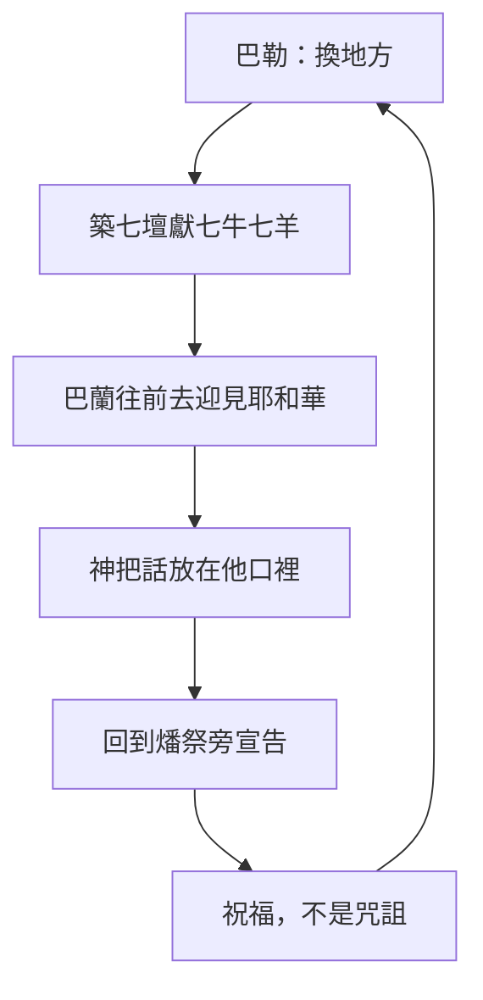

# 民數記 第23章

<!-- chapter-navigation:start -->
| [前一章](../04%20民數記/第22章.md) | [回目錄](../04%20民數記/全書目錄及綱要.md) | [下一章](../04%20民數記/第24章.md) |
| :--- | :---: | ---: |
<!-- chapter-navigation:end -->

1. [[巴蘭（比珥的兒子）|巴蘭]]對[[巴勒]]說：你在這裡給我築[[七座壇與七牛七羊|七座壇]]，為我預備七隻公牛，七隻[[公羊]]。
2. [[巴勒]]照[[巴蘭（比珥的兒子）|巴蘭]]的話行了。巴勒和巴蘭在每座壇上獻一隻公牛，一隻[[公羊]]。
3. [[巴蘭（比珥的兒子）|巴蘭]]對[[巴勒]]說：你站在你的[[燔祭]]旁邊，我且往前去，或者耶和華來迎見我。他指示我什麼，我必告訴你。於是巴蘭上一[[淨光的高處（she.phi）|淨光的高處]]。
4. 神迎見[[巴蘭（比珥的兒子）|巴蘭]]；巴蘭說：我預備了[[七座壇與七牛七羊|七座壇]]，在每座壇上獻了一隻公牛，一隻[[公羊]]。
5. 耶和華將話傳給[[巴蘭（比珥的兒子）|巴蘭]]，又說：你回到[[巴勒]]那裡，要如此如此說。
6. 他就回到[[巴勒]]那裡，見他同[[摩押人|摩押的使臣]]都站在[[燔祭]]旁邊。
7. [[巴蘭（比珥的兒子）|巴蘭]]便題起[[詩歌（ma.shal）|詩歌]]說：[[巴勒]]引我出[[亞蘭]]，摩押王引我出東山，說：來啊，為我[[咒詛（a.rar 與 qa.vav）|咒詛]]雅各；來啊，怒罵以色列。
8. 神沒有[[咒詛（a.rar 與 qa.vav）|咒詛]]的，我焉能咒詛？耶和華沒有怒罵的，我焉能怒罵？
9. 我從高峰看他，從小山望他；這是[[獨居的民不列在萬民中|獨居的民]]，不列在萬民中。
10. 誰能數點[[雅各的塵土與四分之一|雅各的塵土]]？誰能計算以色列的[[雅各的塵土與四分之一|四分之一]]？[[我願如義人之死而死]]；我願如義人之終而終。
11. [[巴勒]]對[[巴蘭（比珥的兒子）|巴蘭]]說：你向我做的是什麼事呢？我領你來[[咒詛（a.rar 與 qa.vav）|咒詛]]我的仇敵，不料，你竟為他們[[祝福與咒詛|祝福]]。
12. 他回答說：耶和華傳給我的話，我能不謹慎傳說嗎？
13. [[巴勒]]說：求你同我往別處去，在那裡可以看見他們；你不能全看見，只能看見他們邊界上的人。在那裡要為我[[咒詛（a.rar 與 qa.vav）|咒詛]]他們。
14. 於是領[[巴蘭（比珥的兒子）|巴蘭]]到了[[瑣腓田與毘斯迦山頂|瑣腓田]]，上了[[瑣腓田與毘斯迦山頂|毘斯迦山頂]]，築了[[七座壇與七牛七羊|七座壇]]；每座壇上獻一隻公牛，一隻[[公羊]]。
15. [[巴蘭（比珥的兒子）|巴蘭]]對[[巴勒]]說：你站在這[[燔祭]]旁邊，等我往那邊去迎見耶和華。
16. 耶和華臨到[[巴蘭（比珥的兒子）|巴蘭]]那裡，將話傳給他；又說：你回到[[巴勒]]那裡，要如此如此說。
17. 他就回到[[巴勒]]那裡，見他站在[[燔祭]]旁邊；[[摩押人|摩押的使臣]]也和他在一處。巴勒問他說：耶和華說了什麼話呢？
18. [[巴蘭（比珥的兒子）|巴蘭]]就題[[詩歌（ma.shal）|詩歌]]說：[[巴勒]]，你起來聽；西撥的兒子，你聽我言。
19. [[神非人必不致說謊|神非人]]，必不致說謊，也非人子，必不致後悔。他說話豈不照著行呢？他發言豈不要成就呢？
20. 我奉命[[祝福與咒詛|祝福]]；神也曾賜福，此事我不能翻轉。
21. 他[[未見雅各中有罪孽]]，也未見以色列中有奸惡。耶和華─他的神和他同在；有[[歡呼王的聲音（te.ru.ah）|歡呼王的聲音]]在他們中間。
22. 神領他們出埃及；他們似乎有[[野牛之力（re.em）|野牛之力]]。
23. [[斷沒有法術可以害雅各]]，也沒有[[卦金（qe.sem）|占卜]]可以害以色列。現在必有人論及雅各，就是論及以色列說：神為他行了何等的大事！
24. 這民起來，彷彿[[母獅與公獅的比喻|母獅]]，挺身，好像[[母獅與公獅的比喻|公獅]]，未曾吃野食，未曾喝被傷者之血，決不躺臥。
25. [[巴勒]]對[[巴蘭（比珥的兒子）|巴蘭]]說：你一點不要[[咒詛（a.rar 與 qa.vav）|咒詛]]他們，也不要為他們[[祝福與咒詛|祝福]]。
26. [[巴蘭（比珥的兒子）|巴蘭]]回答[[巴勒]]說：我豈不是告訴你說凡耶和華所說的，我必須遵行嗎？
27. [[巴勒]]對[[巴蘭（比珥的兒子）|巴蘭]]說：來吧，我領你往別處去，或者神喜歡你在那裡為我[[咒詛（a.rar 與 qa.vav）|咒詛]]他們。
28. [[巴勒]]就領[[巴蘭（比珥的兒子）|巴蘭]]到那下望[[曠野]]的[[毘珥山頂]]上。
29. [[巴蘭（比珥的兒子）|巴蘭]]對[[巴勒]]說：你在這裡為我築[[七座壇與七牛七羊|七座壇]]，又在這裡為我預備七隻公牛，七隻[[公羊]]。
30. [[巴勒]]就照[[巴蘭（比珥的兒子）|巴蘭]]的話行，在每座壇上獻一隻公牛，一隻[[公羊]]。

---

## 本章知識節點

### 人物
- [[巴勒]]
- [[巴蘭（比珥的兒子）]]
- [[摩押人]]

### 地點
- [[瑣腓田與毘斯迦山頂]]
- [[毘珥山頂]]
- [[亞蘭]]
- [[曠野]]
- [[摩押地]]
- [[巴力的高處（Bamoth-baal）]]

### 文化
- [[七座壇與七牛七羊]]

### 原文
- [[詩歌（ma.shal）]]
- [[淨光的高處（she.phi）]]
- [[歡呼王的聲音（te.ru.ah）]]
- [[野牛之力（re.em）]]
- [[咒詛（a.rar 與 qa.vav）]]
- [[卦金（qe.sem）]]
- [[後裔如地上的塵沙]]

### 主題
- [[巴蘭的七篇詩歌]]
- [[雅各的塵土與四分之一]]
- [[母獅與公獅的比喻]]
- [[祝福與咒詛]]
- [[先知]]
- [[公羊]]

### 神學
- [[獨居的民不列在萬民中]]
- [[神非人必不致說謊]]
- [[未見雅各中有罪孽]]
- [[斷沒有法術可以害雅各]]
- [[燔祭]]
- [[分別為聖]]
- [[因信稱義]]
- [[神的後悔與憂傷]]
- [[神的主權]]
- [[亞伯拉罕之約]]

### 解經爭議
- [[我願如義人之死而死]]
- [[換個地方就能改變神嗎]]
- [[巴蘭是先知還是術士]]

### 背景
- [[古代近東立約]]

### 互文
- [[誰能控告神所揀選的人（羅8：33-34）]]
- [[神必不致說謊也不後悔（撒上15：29）]]
- [[猶大是小獅子（創49：9）]]

---

## 本章整理

### 三次重來的同一套排場（v1-2、14、29-30）

本章的結構一眼就看得出來：三個地點、三套 [[七座壇與七牛七羊|七座壇與七牛七羊]]、三次同樣的結果。

| 次序 | 地點 | 經文 | 結果 |
| --- | --- | --- | --- |
| 一 | 巴力的高處（承民22:41） | v1-12 | 第一篇詩歌，祝福 |
| 二 | 瑣腓田、毘斯迦山頂 | v13-26 | 第二篇詩歌，祝福更多 |
| 三 | 下望曠野的毘珥山頂 | v27-30 | 築壇獻祭，詩歌在下一章 |

這套排場本身就是一份自白。CT 一句話點破：「『築七座壇』注意，以色列人僅有一座祭壇，而巴蘭卻要築七座壇，顯然不是按照向耶和華真神獻祭的條例，因此他不是真先知。」GT 丁良才《民數記註釋》說得更直接：「古時候的以色列人，在一處只築一座祭壇，祭壇既多，就是近乎拜邪神的禮節。」GT《啟導本聖經註釋》指出這是「古代東方術士傳統的獻祭儀式，有的還要安放七個香爐，澆奠七隻羊的血」；GT《舊約聖經背景註釋》則從條約文獻找到平行——亞述王以撒哈頓與推羅之巴力簽約時召請「七神」，並為每一神祇築壇獻祭，這也正是 [[古代近東立約|古代近東立約]] 的通行作法。至於為什麼是牛和羊，同一則註釋說這「兩樣是古代近東最珍貴、最高價的牲口」。

KC 從巴勒的角度讀出另一層：他也許聽說過以色列向他們的神獻祭，於是想照樣做來換取咒詛的許可，卻完全不明白 [[燔祭]] 代表什麼。

### 第一篇詩歌：一個看得見卻數不完的民（v3-12）

巴蘭先上 [[淨光的高處（she.phi）|一淨光的高處]]。**STEP語言資料**顯示這個詞是 She.fi（H8205），簡要義域 she.phi: bareness，字面就是光禿。他上去做什麼，各家看法不同：GT 丁良才說他往前去是「為要求法術」，卻又指出「這一句顯明巴蘭不是專意靠法術」；GT《民數記串珠聖經註釋》推想他想藉觀察天象得指示；GT《舊約聖經背景註釋》乾脆承認這個譯法「的翻譯頗有爭議，希伯來原文字眼的意思仍有疑問」。

結果第4節說的是「神迎見巴蘭」——主動的是神。KC 指出這裡沒有討論的餘地：神沒有回應巴蘭關於祭物的話，只把一句話放在他口裡就打發他回去。

回到燔祭旁邊，巴蘭[[詩歌（ma.shal）|題起詩歌]]。**STEP語言資料**顯示「詩歌」原文是 me.sha.L/o（H4912），簡要義域 ma.shal: proverb——不是歌，是箴言體的宣告；CT 給的原文字義同樣是「箴言，比喻」。GT《啟導本》數出從這裡到民24:25 一共有 [[巴蘭的七篇詩歌|七首]]，用的是對句法。

第一篇說了兩件事。第一件是 [[獨居的民不列在萬民中|這是獨居的民]]。**STEP語言資料**顯示「不列在萬民中」的動詞 yit.cha.Shav（H2803H）是反身形，本節譯義作 it reckons itself。GT《聖經精讀本──民數記註解》提醒這不是孤立：「這句話暗示著以色列百姓與列邦不同,是擁有榮耀和特權的民族,而不是說以色列百姓是孤立的。」KC 把它讀成教會的功課——分別為聖不是消極地與某些事物分開，而是積極地為神而活。

第二件是 [[雅各的塵土與四分之一|數不完]]。CT 解釋「四分之一」的來歷：以色列人的營地分成東、西、南、北四個營盤，「意指連其中的一個營盤內人數都難以計算」。丁良才指出這句話「是應驗創十三16節、二十八14節的話」，也就是 [[後裔如地上的塵沙|亞伯拉罕所得的塵沙之應許]]。

詩歌收在一句羨慕上：[[我願如義人之死而死|我願如義人之死而死]]。丁良才的評語很有名：「有許多人如同巴蘭一樣，願意如義人之終而終，卻不肯做義人」。CT 的讀法不同，它認為「義人之死…義人之終」是同義詞，「意指但願如以色列人那樣的傳宗接代，延續不斷」——爭議點在於「終」指的是善終永生，還是子孫延續。

### 第二篇詩歌：神不會改主意（v13-26）

巴勒的對策是[[換個地方就能改變神嗎|換地方]]。CT 在這裡下了本章最重的評語：「人的想法就是這樣無知，以為地方轉換了，神也就會改變了，環境不同了，神就會修改祂作事的法則和計畫」，而「神是不受環境影響的神，只有祂改變環境，環境絕不能改變祂」。GT《民數記串珠聖經註釋》說得更短：「這種想法實在是愚昧的迷信。」

第二篇一開口就把這個假設拆掉：[[神非人必不致說謊|神非人，必不致說謊，也非人子，必不致後悔]]。**STEP語言資料**顯示「後悔」是 ve./yit.ne.Cham（H5162H）反身形，本節譯義 so he may change his mind；GT《民數記串珠聖經註釋》一句話解完：「即改變主意」。丁良才在此列出一串平行經文——撒上15:29、瑪3:6、羅11:29、多1:2、來13:8、雅1:17，其中 [[神必不致說謊也不後悔（撒上15：29）|撒上15:29]] 幾乎是同一句話。

接著是全章最難的一句：[[未見雅各中有罪孽|他未見雅各中有罪孽，也未見以色列中有奸惡]]。說這話時，以色列在民數記裡已經抱怨、背叛、拜偶像過好幾輪。CT 給的解法是遮蓋：「不是說以色列沒有犯罪，而是在他們中間有祭壇，祭壇上的祭牲遮蓋了他們的罪孽和奸惡」；KC 給的解法是[[因信稱義|稱義]]——他說稱義超過赦免，被稱為義的人是神宣告他從未犯過罪的人，並兩次引 [[誰能控告神所揀選的人（羅8：33-34）|羅8:33-34]]。

同一節的下半句給出理由：[[歡呼王的聲音（te.ru.ah）|有歡呼王的聲音在他們中間]]。**STEP語言資料**顯示「歡呼」是 te.ru.'At（H8643，簡要義域 shout）；丁良才列出的平行經文都是立王迎王的場合。

接下來三節是三組意象：[[野牛之力（re.em）|野牛]]（BH 說希伯來文作 reem，與力量與未馴服的能力連在一起）、[[斷沒有法術可以害雅各|法術與占卜的無效]]、[[母獅與公獅的比喻|母獅與公獅]]。其中第23節有一個 STEP 給出的直接連結：這裡說「沒有占卜可以害以色列」的「占卜」是 Ke.sem（H7081），正是民22:7 摩押與米甸長老手裡拿去見巴蘭的那筆 [[卦金（qe.sem）|卦金]] 的同一個字。付出去的東西與被宣告無效的東西，在原文裡是同一個詞。GT《啟導本》因此說：「巴蘭承認他的法術、占卜都無用，不能阻止神的祝福。」而第24節的獅子，GT《啟導本》指出「本節暗合《創世記》四十九9的話」，也就是 [[猶大是小獅子（創49：9）|雅各給猶大的祝福]]。

### 巴勒的三次反應（v11-12、25-26、27）

巴勒的話一次比一次退讓，是本章最傳神的線索：

1. 第一次（v11）：「我領你來咒詛我的仇敵，不料，你竟為他們祝福。」CT 指出「不料」原文是「看哪！」，而「『你竟…』原文是加重語氣的強調」。KC 另注意到他說的不是你做了什麼，而是「你向我做的是什麼事」——他覺得自己被背叛了。
2. 第二次（v25）：「你一點不要咒詛他們，也不要為他們祝福。」CT 讀出他的心情：「我寧願你巴蘭不咒詛他們，也不願你為他們說祝福的話。」
3. 第三次（v27）：「來吧，我領你往別處去，或者神喜歡你在那裡為我咒詛他們。」丁良才說他「因發怒，先要哄巴蘭全然住口（25）。後來卻想，不如再試一次，或者能使神改變心意」。

而巴蘭每次的回答都一樣：話不是他的。第12節他說「耶和華傳給我的話，我能不謹慎傳說嗎？」——CT 指出「傳給我的話」原文是「放在我口中的話」。

### 這一章在整組詩歌裡的位置（跨章脈絡）

KC 說「巴蘭的這些宣告是聖經中第一批偉大的先知性話語」，並整理出四篇詩歌各自強調的神名與各自呈現的以色列面貌；GT《啟導本》則從對句法的角度數出七首。本章載的是前兩篇，而 KC 特別指出第二篇不是撤回第一篇，也不是重複，而是對第一篇的確認與延伸——GT《啟導本》的觀察與此相合：「誰知巴蘭的第二首詩歌比第一首祝福更多。」

至於巴勒為什麼一直換地方，KC 給了一個很生活化的解釋：他要巴蘭在曠野的處境中看這民，因為「我們在日常景況中的樣子，往往和主日不一樣」。這一章結束在第三座山上、第三套壇前，話還沒有說出口——而讀者已經知道結果會是什麼。

**參考資料**
https://www.ccbiblestudy.org/Old%20Testament/04Num/04CT23.htm
https://www.ccbiblestudy.org/Old%20Testament/04Num/04GT23.htm
https://www.kingcomments.com/en/bible-studies/Num/23
https://biblehub.com/study/numbers/23.htm
https://github.com/STEPBible/STEPBible-Data

<!-- appendix-links:start -->
## 附錄

### 相關地圖
- [[appendix/fhl_maps/maps/023|〈民圖四〉分地給兩個半支派]]
<!-- appendix-links:end -->

<!-- chapter-navigation:start -->
| [前一章](../04%20民數記/第22章.md) | [回目錄](../04%20民數記/全書目錄及綱要.md) | [下一章](../04%20民數記/第24章.md) |
| :--- | :---: | ---: |
<!-- chapter-navigation:end -->
